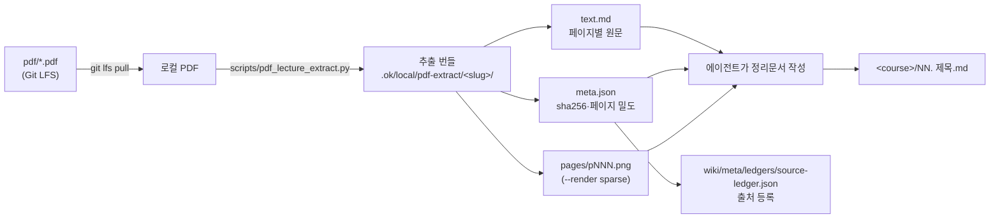
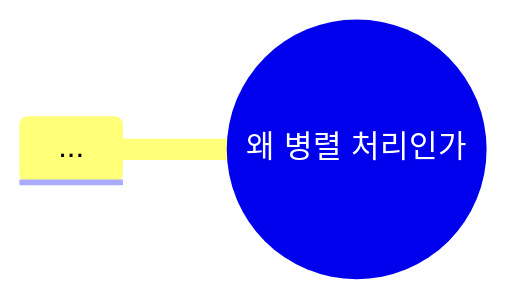

# 강의 PDF → 정리문서

## 언제 쓰는가

- `ComputerScience/<field>/<course>/pdf/` 안에 강의자료 PDF는 있는데 대응하는 정리문서가 없을 때
- 기존 정리문서를 강의자료 기준으로 다시 쓸 때
- 다른 수업 폴더(`LGAimer/`, `certifications/`, `Hackathon/`)의 자료에도 동일하게 적용

## 파이프라인



### 1. PDF 준비

PDF는 Git LFS로 관리된다. 포인터 상태면 스크립트가 거부한다.

```bash
git lfs install --local
git lfs pull --include="ComputerScience/<field>/<course>/pdf/*"
```

파일명 끝이 ` 2.pdf` 인 것은 macOS 중복 사본이다. **원본만 처리한다.**

### 2. 추출 번들 생성

```bash
# 텍스트만 (기본 · 빠름)
python3 scripts/pdf_lecture_extract.py "<course>/pdf/01_Foo.pdf" --render none

# 텍스트가 빈약한 페이지(=내용이 이미지에 있는 슬라이드)만 이미지로 렌더링
python3 scripts/pdf_lecture_extract.py "<course>/pdf/01_Foo.pdf" --render sparse --max-render 24
```

출력은 `.ok/local/pdf-extract/<slug>/` (gitignore 대상, 커밋하지 않는다):

| 파일 | 내용 |
|:--|:--|
| `text.md` | ` ```page N chars=M ` 블록 단위의 레이아웃 보존 원문 |
| `meta.json` | `sha256`, `pages`, `page_chars`, `text_poor_pages`, `rendered_pages` |
| `pages/pNNN.png` | 렌더링된 슬라이드 이미지 |

`chars` 가 낮은 페이지는 내용이 그림 안에 있다는 신호다. 그 페이지는
**PDF 페이지 임베드로 넘기거나**, 정말 핵심이면 이미지를 직접 읽고 글로 옮긴다.

### 3. 정리문서 작성

- 저장 위치: **강의 PDF와 같은 수업 폴더의 루트** (`<course>/NN. 제목.md`)
- 파일명: 슬라이드 번호를 살린 한국어 제목 (`01. 왜 병렬 처리인가.md`)
- 언어: **한국어**. 고유명사·API·수식 기호는 원문 유지
- 슬라이드를 그대로 옮기지 않는다. **재구성해서 설명한다.**

## 시각화 규격 (중요)

정리문서는 글 덩어리가 아니라 **읽는 문서**여야 한다.
아래 표현을 섹션 성격에 맞게 **골라 쓰되, 한 노트에 최소 4종류 이상** 섞는다.

| 표현 | 쓰는 상황 | 문법 |
|:--|:--|:--|
| **표** | 비교·분류·스펙·용어 정의 | 마크다운 표 |
| **Mermaid flowchart** | 처리 흐름, 의사결정, 계층 구조 | ` ```mermaid` + `flowchart LR/TD` |
| **Mermaid sequenceDiagram** | 프로토콜, 통신, 호출 순서 | `sequenceDiagram` |
| **Mermaid mindmap** | 챕터 전체 개념 지도 | `mindmap` |
| **Mermaid timeline** | 발전사, 세대 구분 | `timeline` |
| **Mermaid quadrantChart** | 2축 트레이드오프 배치 | `quadrantChart` |
| **Mermaid xychart-beta** | 성능 곡선, 스케일링 그래프 | `xychart-beta` |
| **Mermaid block-beta** | 메모리 레이아웃, 하드웨어 블록도 | `block-beta` |
| **Mermaid gantt** | 스케줄링·파이프라인 타이밍 | `gantt` |
| **콜아웃** | 정의/주의/시험포인트/예시/질문 | `> [!type]` |
| **LaTeX** | 수식, 복잡도, 증명 | `$인라인$`, `$$블록$$` |
| **PDF 페이지 임베드** | 원본 도해를 그대로 보여줄 때 | `![[pdf/파일.pdf#page=N]]` |
| **코드 블록** | 예제 코드 | 언어 태그 필수 (`c`, `cuda`, `python`, `bash`) |

### 콜아웃 사용 규칙

```markdown
> [!abstract] 한 줄 요약
> 이 강의의 핵심 주장 한 문장.

> [!info] 정의
> 용어의 정확한 정의.

> [!example] 예시
> 구체적인 수치·코드·사례.

> [!warning] 흔한 오해
> 헷갈리기 쉬운 지점.

> [!question]- 스스로 점검     ← `-` 를 붙이면 접힌 상태로 시작
> Q. ...
> A. ...

> [!quote] 슬라이드 근거
> `pdf/01_Foo.pdf` p.67
```

### Mermaid 주의사항

- 노드 라벨에 `(`, `)`, `:`, `,` 가 들어가면 **반드시 `"` 로 감싼다** → `A["ILP (슈퍼스칼라)"]`
- 줄바꿈은 `<br/>`
- Obsidian 렌더 폭을 넘지 않게 한 다이어그램당 노드 12개 이하 권장
- 한글 라벨 OK

### PDF 페이지 임베드

원본 도해가 텍스트로 옮기기 어려울 때 **그림을 다시 그리려 하지 말고** 임베드한다.
경로는 노트 기준 상대경로다.

```markdown
![[pdf/01_WhyParallelism.pdf#page=67]]
```

Obsidian에서는 PDF++ 로 해당 페이지가 인라인 렌더링되고,
LLM에게는 바로 위/아래의 텍스트 설명이 근거가 된다.
**임베드만 두고 설명을 생략하지 않는다** — LLM은 PDF를 못 읽는다.

## 노트 구조 템플릿

````markdown
---
aliases: []
course: <course-folder-name>
created: 'YYYY-MM-DD'
date: 'YYYY-MM-DD'
semester: '3-1'
source: pdf/01_WhyParallelism.pdf
source_type: lecture-slides
source_sha256: <meta.json 의 sha256>
source_pages: 139
authority: primary
review_state: active
status: seedling
tags:
  - type/lecture
  - cs/<domain>
title: 01. 왜 병렬 처리인가
type: lecture
updated: 'YYYY-MM-DD'
---

domain:: [[ComputerScience/04_systems-infrastructure/시스템 인프라 인터페이스|시스템 인프라 인터페이스]]
module:: [[ComputerScience/00_graph-interfaces/courses/병렬 분산처리 인터페이스|병렬 분산처리 인터페이스]]
source:: [[ComputerScience/.../pdf/01_WhyParallelism.pdf|01_WhyParallelism.pdf]]
related:: [[...]], [[...]]        ← 최대 8개. 진짜 관련된 것만.

# 01. 왜 병렬 처리인가

> [!abstract] 한 줄 요약
> ...

## 이 강의의 지도



## 1. <섹션>
...본문 (표/다이어그램/콜아웃/수식 혼합)...

## 핵심 정리

| 개념 | 한 줄 정의 | 왜 중요한가 |
|:--|:--|:--|

> [!question]- 스스로 점검
> Q. ...
> A. ...

## 슬라이드 근거

| 섹션 | 슬라이드 |
|:--|:--|
| 1. ... | p.4-12 |

## 관련 노트
- [[...]]
````

## 프론트매터 스키마

이 저장소는 **기존 vault 어휘를 우선**하고, claude-obsidian / OpenKnowledge(OKF)의
출처(provenance) 필드를 **추가로** 얹는다. 자세한 매핑은 `docs/knowledge-schema.md`.

| 필드 | 값 | 출처 |
|:--|:--|:--|
| `type` | `lecture` \| `index` \| `moc` \| `note` \| `project` | vault |
| `status` | `seedling` \| `budding` \| `evergreen` | vault |
| `course` | 수업 폴더명 | vault |
| `semester` | `3-1` 등, 없으면 `extracurricular` | vault |
| `source` | 근거 PDF의 노트 기준 상대경로 | vault + OKF |
| `source_type` | `lecture-slides` \| `textbook` \| `handout` \| `paper` | claude-obsidian |
| `source_sha256` | 원본 PDF의 sha256 (`meta.json`) | claude-obsidian |
| `source_pages` | 원본 PDF 페이지 수 | claude-obsidian |
| `authority` | `primary`(교수 배포 자료) \| `secondary` | claude-obsidian |
| `review_state` | `active` \| `superseded` \| `unreviewed` | claude-obsidian |

`kg_*` 필드와 `domain:: / stage:: / module:: / bridge::` 인라인 필드는
기존 GraphRAG 레이어의 것이므로 **있으면 보존**한다.

## 지켜야 할 것

1. **근거 없는 내용을 쓰지 않는다.** 슬라이드에 없는 사실은 넣지 않는다.
   보충 설명이 필요하면 `> [!note] 보충` 콜아웃으로 분리 표기한다.
2. **`![[image]]` 를 새로 만들지 않는다.** 도해는 PDF 페이지 임베드 또는 Mermaid 재작도.
3. **`related::` 를 자동 폭주시키지 않는다.** 8개 이하, 실제 선수/후속 관계만.
4. 같은 챕터의 ` 2.pdf` 중복본은 무시한다.
5. 작성 후 검증:
   ```bash
   npx -y @inkeep/open-knowledge@latest lint "<course>"
   python3 <claude-obsidian>/scripts/claude-obsidian.py lint --vault . --format markdown
   ```

## 출처 원장 등록

정리문서를 만든 뒤 `wiki/meta/ledgers/source-ledger.json` 에 PDF를 등록한다.
`scripts/register_pdf_sources.py` 가 추출 번들의 `meta.json` 들을 읽어 자동 반영한다.

```bash
python3 scripts/register_pdf_sources.py --course "ComputerScience/04_systems-infrastructure/parallel-distributed-computing"
```
