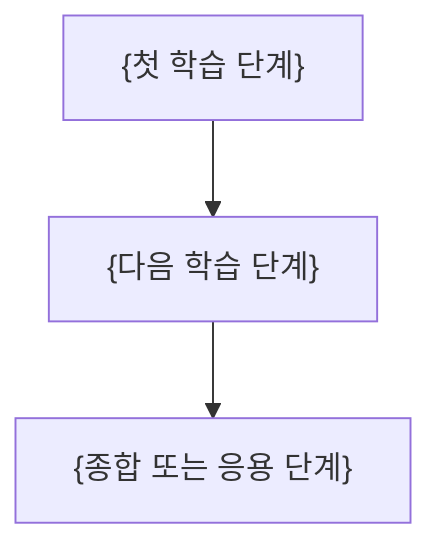

---
template:
  title: 과목 인덱스
  description: 실제 학습 경로와 문서·원본 coverage를 Mermaid와 source-backed palette 시각화로 보여주는 과목 인덱스.
  tags:
    - index
    - openknowledge
    - visual
    - slides
title: "{과목명}"
description: "{과목의 범위와 학습 목표}"
type: course-index
tags: []
course: "{과목명}"
semester: "{학기}"
status: draft
aliases: []
slides: true
created: "{{date}}"
updated: "{{date}}"
---

> [!abstract]
> {이 과목이 다루는 범위와 도달 목표}

## 학습 경로

## 정리문서

| 번호 | 문서 | 핵심 질문 | 근거 상태 |
| :-- | :-- | :-- | :-- |
| {번호} | {표준 Markdown 상대 링크} | {한 줄 질문} | {완료·근거 부족·제외} |

## 범위 시각화

{필수: 실제 문서 수·원본 수·반영 수가 있으면 palette v1 stat-cards, 동일 단위 모듈 집계가 있으면 chart, 정확한 반영률이면 custom-svg를 삽입한다. 근거가 없으면 값을 만들지 않는다}

## 근거 범위

| 원본 식별자 | 담당 문서 | 상태 |
| :-- | :-- | :-- |
| {파일명} | {문서명} | {반영·중복·근거 부족} |

> [!warning]
> {비어 있는 source·중복 원본·추출 실패 등 실제 누락이 있을 때만 유지}
