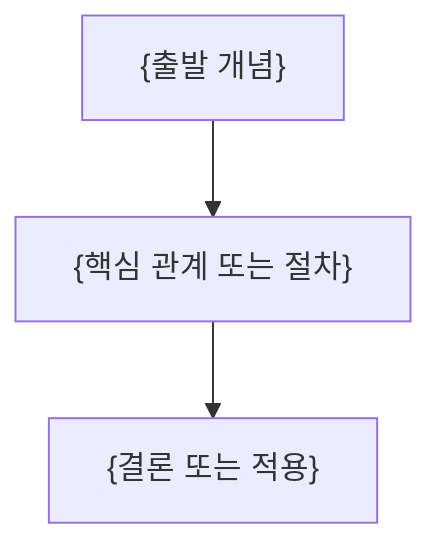

---
template:
  title: 강의 정리문서 — 비교 차트
  description: 동일 단위의 비교 가능한 source 수치가 3개 이상일 때 사용. 공식 chart starter의 label/value만 교체한다.
  tags:
    - lecture
    - openknowledge
    - visual
    - slides
title: "{강의 제목}"
description: "{이 문서가 답하는 질문과 학습 범위}"
type: lecture
tags: []
course: "{과목}"
semester: "{학기}"
source: "{원본 파일 식별자}"
source_pages: 0
status: draft
aliases: []
slides: true
created: "{{date}}"
updated: "{{date}}"
---
> [!abstract]
> {핵심 질문과 한 줄 결론}

## 개념 지도



## {원본 흐름에서 도출한 핵심 주제}

**핵심:** {짧은 결론}

- **{핵심어}:** {정의·조건·예시}
- **{근거}:** {원본에서 확인한 수치·절차·관계}

## {원본 흐름에서 도출한 다음 주제}

**핵심:** {짧은 결론}

- **{핵심어}:** {정의·조건·예시}
- **{근거}:** {원본에서 확인한 수치·절차·관계}

## 비교 수치 시각화

```html preview
<div style="font-family:system-ui,sans-serif;padding:20px;color:var(--foreground)">
  <h3 style="margin:0 0 14px;font-size:15px;font-weight:600">__SOURCE_CHART_TITLE__</h3>
  <div id="bars" style="display:flex;align-items:flex-end;gap:14px;height:170px"></div>
  <script>
    var data = [['__SOURCE_LABEL_1__', __SOURCE_VALUE_1__], ['__SOURCE_LABEL_2__', __SOURCE_VALUE_2__], ['__SOURCE_LABEL_3__', __SOURCE_VALUE_3__], ['__SOURCE_LABEL_4__', __SOURCE_VALUE_4__], ['__SOURCE_LABEL_5__', __SOURCE_VALUE_5__]];
    var max = Math.max.apply(null, data.map(function (d) { return d[1]; }));
    document.getElementById('bars').innerHTML = data.map(function (d, i) {
      return '<div style="flex:1;display:flex;flex-direction:column;align-items:center;' +
        'gap:6px;height:100%;justify-content:flex-end">' +
        '<span style="font-size:12px;font-weight:600">' + d[1] + '</span>' +
        '<div style="width:100%;height:' + (d[1] / max * 100) + '%;' +
        'background:var(--chart-' + (i + 1) + ');' +
        'border-radius:var(--radius) var(--radius) 0 0"></div>' +
        '<span style="font-size:12px;color:var(--muted-foreground)">' + d[0] + '</span>' +
        '</div>';
    }).join('');
  </script>
</div>
```

<details>
<summary>{선택적 심화 내용}</summary>

{원본에 있는 유도·긴 절차·부가 설명}

</details>

> [!warning]
> {원본 오류·추출 한계가 있을 때만 유지하고, 없으면 삭제}

## 정리

| 핵심 개념 | 의미 | 적용 또는 경계 |
| :-- | :-- | :-- |
| {개념} | {한 줄 의미} | {한 줄 적용 또는 경계} |
