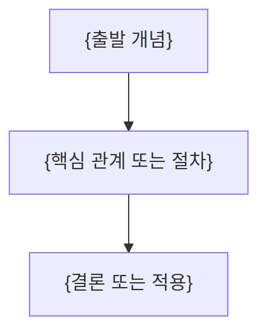

---
template:
  title: 강의 정리문서 — 비율·기하
  description: source가 비율·진행률·원형 기하를 직접 제공할 때 사용. 공식 custom-svg starter의 데이터와 접근성 문구만 교체한다.
  tags:
    - lecture
    - openknowledge
    - visual
    - slides
title: "{강의 제목}"
description: "{이 문서가 답하는 질문과 학습 범위}"
type: lecture
tags: []
course: "{과목}"
semester: "{학기}"
source: "{원본 파일 식별자}"
source_pages: 0
status: draft
aliases: []
slides: true
created: "{{date}}"
updated: "{{date}}"
---
> [!abstract]
> {핵심 질문과 한 줄 결론}

## 개념 지도



## {원본 흐름에서 도출한 핵심 주제}

**핵심:** {짧은 결론}

- **{핵심어}:** {정의·조건·예시}
- **{근거}:** {원본에서 확인한 수치·절차·관계}

## {원본 흐름에서 도출한 다음 주제}

**핵심:** {짧은 결론}

- **{핵심어}:** {정의·조건·예시}
- **{근거}:** {원본에서 확인한 수치·절차·관계}

## 비율 또는 기하 시각화

```html preview
<div style="font-family:system-ui,sans-serif;padding:20px;display:flex;align-items:center;gap:20px;color:var(--foreground)">
  <svg width="120" height="120" viewBox="0 0 120 120" role="img" aria-label="__SOURCE_ARIA_LABEL__">
    <circle cx="60" cy="60" r="46" stroke-width="14" style="fill: none; stroke: var(--border)" />
    <circle cx="60" cy="60" r="46" stroke-width="14"
      stroke-linecap="round" stroke-dasharray="289" stroke-dashoffset="__SOURCE_DASHOFFSET__"
      transform="rotate(-90 60 60)" style="fill: none; stroke: var(--chart-1)" />
    <text x="60" y="67" text-anchor="middle" font-size="22" font-weight="700"
      style="fill: var(--foreground)">__SOURCE_PERCENT__</text>
  </svg>
  <div>
    <div style="font-weight:600;font-size:15px">__SOURCE_METRIC_TITLE__</div>
    <div style="font-size:13px;color:var(--muted-foreground);margin-top:2px">__SOURCE_METRIC_CONTEXT__</div>
  </div>
</div>
```

<details>
<summary>{선택적 심화 내용}</summary>

{원본에 있는 유도·긴 절차·부가 설명}

</details>

> [!warning]
> {원본 오류·추출 한계가 있을 때만 유지하고, 없으면 삭제}

## 정리

| 핵심 개념 | 의미 | 적용 또는 경계 |
| :-- | :-- | :-- |
| {개념} | {한 줄 의미} | {한 줄 적용 또는 경계} |
