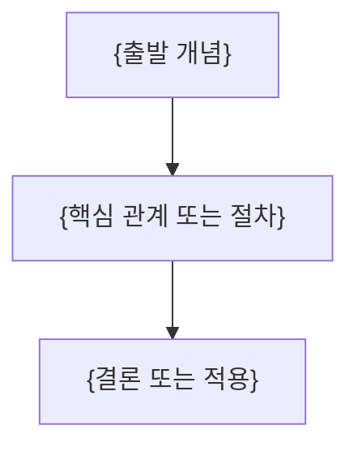

---
template:
  title: 강의 정리문서 — 인터랙티브 제어
  description: source가 실제 최솟값·최댓값·간격과 매개변수 효과를 제공할 때 사용. 공식 interactive-control
    starter만 사용한다.
  tags:
    - lecture
    - openknowledge
    - visual
    - slides
title: "{강의 제목}"
description: "{이 문서가 답하는 질문과 학습 범위}"
type: lecture
tags: []
course: "{과목}"
semester: "{학기}"
source: "{원본 파일 식별자}"
source_pages: 0
status: draft
aliases: []
slides: true
created: "{{date}}"
updated: "{{date}}"
---
> [!abstract]
> {핵심 질문과 한 줄 결론}

## 개념 지도



## {원본 흐름에서 도출한 핵심 주제}

**핵심:** {짧은 결론}

- **{핵심어}:** {정의·조건·예시}
- **{근거}:** {원본에서 확인한 수치·절차·관계}

## {원본 흐름에서 도출한 다음 주제}

**핵심:** {짧은 결론}

- **{핵심어}:** {정의·조건·예시}
- **{근거}:** {원본에서 확인한 수치·절차·관계}

## 매개변수 효과 탐색

```html preview
<div style="font-family:system-ui,sans-serif;padding:20px;color:var(--foreground)">
  <label for="amt" style="font-size:14px;font-weight:600">__SOURCE_PARAMETER_LABEL__</label>
  <div id="out" style="font-size:30px;font-weight:700;color:var(--chart-1);margin:6px 0">__SOURCE_INITIAL_VALUE__</div>
  <input id="amt" type="range" min="__SOURCE_MIN__" max="__SOURCE_MAX__" step="__SOURCE_STEP__" value="__SOURCE_INITIAL_VALUE__"
    style="width:100%;accent-color:var(--primary)" />
  <p style="font-size:13px;color:var(--muted-foreground)">__SOURCE_INTERACTION_GUIDANCE__</p>
  <script>
    var amt = document.getElementById('amt');
    var out = document.getElementById('out');
    amt.addEventListener('input', function () {
      out.textContent = Number(amt.value).toLocaleString();
    });
  </script>
</div>
```

<details>
<summary>{선택적 심화 내용}</summary>

{원본에 있는 유도·긴 절차·부가 설명}

</details>

> [!warning]
> {원본 오류·추출 한계가 있을 때만 유지하고, 없으면 삭제}

## 정리

| 핵심 개념 | 의미 | 적용 또는 경계 |
| :-- | :-- | :-- |
| {개념} | {한 줄 의미} | {한 줄 적용 또는 경계} |
