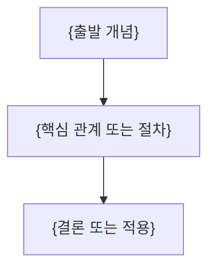

---
template:
  title: 강의 정리문서 — 핵심 지표
  description: 서로 다른 의미의 source 핵심 지표 2~4개를 한눈에 제시할 때 사용. 공식 stat-cards starter의 데이터만 교체한다.
  tags:
    - lecture
    - openknowledge
    - visual
    - slides
title: "{강의 제목}"
description: "{이 문서가 답하는 질문과 학습 범위}"
type: lecture
tags: []
course: "{과목}"
semester: "{학기}"
source: "{원본 파일 식별자}"
source_pages: 0
status: draft
aliases: []
slides: true
created: "{{date}}"
updated: "{{date}}"
---
> [!abstract]
> {핵심 질문과 한 줄 결론}

## 개념 지도



## {원본 흐름에서 도출한 핵심 주제}

**핵심:** {짧은 결론}

- **{핵심어}:** {정의·조건·예시}
- **{근거}:** {원본에서 확인한 수치·절차·관계}

## {원본 흐름에서 도출한 다음 주제}

**핵심:** {짧은 결론}

- **{핵심어}:** {정의·조건·예시}
- **{근거}:** {원본에서 확인한 수치·절차·관계}

## 핵심 지표 시각화

```html preview
<div style="font-family:system-ui,sans-serif;padding:20px">
  <div id="cards" style="display:flex;gap:14px;flex-wrap:wrap"></div>
  <script>
    var stats = [
      ['__SOURCE_METRIC_1__', '__SOURCE_VALUE_1__', '__SOURCE_CONTEXT_1__', 'var(--chart-2)'],
      ['__SOURCE_METRIC_2__', '__SOURCE_VALUE_2__', '__SOURCE_CONTEXT_2__', 'var(--chart-1)'],
      ['__SOURCE_METRIC_3__', '__SOURCE_VALUE_3__', '__SOURCE_CONTEXT_3__', 'var(--chart-5)']
    ];
    document.getElementById('cards').innerHTML = stats.map(function (s) {
      return '<div style="flex:1;min-width:150px;padding:16px;background:var(--card);' +
        'color:var(--card-foreground);border:1px solid var(--border);' +
        'border-radius:var(--radius)">' +
        '<div style="font-size:13px;color:var(--muted-foreground)">' + s[0] + '</div>' +
        '<div style="font-size:26px;font-weight:700;margin-top:4px">' + s[1] + '</div>' +
        '<div style="font-size:12px;font-weight:600;margin-top:4px;color:' + s[3] + '">' +
        s[2] + '</div>' +
        '</div>';
    }).join('');
  </script>
</div>
```

<details>
<summary>{선택적 심화 내용}</summary>

{원본에 있는 유도·긴 절차·부가 설명}

</details>

> [!warning]
> {원본 오류·추출 한계가 있을 때만 유지하고, 없으면 삭제}

## 정리

| 핵심 개념 | 의미 | 적용 또는 경계 |
| :-- | :-- | :-- |
| {개념} | {한 줄 의미} | {한 줄 적용 또는 경계} |
