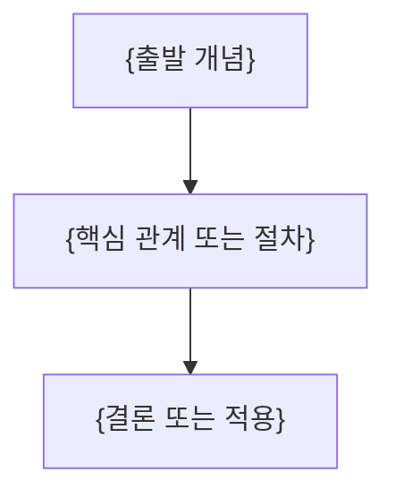

---
template:
  title: 강의 정리문서
  description: PDF·추출 텍스트의 실제 순서를 따르며 관계는 Mermaid, source 수치·범위가 있으면 palette v1
    chart·stat-cards·custom-svg·interactive-control을 반드시 사용하는 강의 노트.
  tags:
    - lecture
    - openknowledge
    - visual
    - slides
title: "{강의 제목}"
description: "{이 문서가 답하는 질문과 학습 범위}"
type: lecture
tags: []
course: "{과목}"
semester: "{학기}"
source: "{원본 파일 식별자}"
source_pages: 0
status: draft
aliases: []
slides: true
created: "{{date}}"
updated: "{{date}}"
---

> [!abstract]
> {핵심 질문과 한 줄 결론}

## 개념 지도

## {원본 흐름에서 도출한 핵심 주제}

**핵심:** {짧은 결론}

- **{핵심어}:** {정의·조건·예시}
- **{근거}:** {원본에서 확인한 수치·절차·관계}

## {원본 흐름에서 도출한 다음 주제}

**핵심:** {짧은 결론}

- **{핵심어}:** {정의·조건·예시}
- **{근거}:** {원본에서 확인한 수치·절차·관계}

## 시각적 설명

{필수: palette v1을 다시 호출해 source 정보 형태에 맞는 chart·stat-cards·custom-svg·interactive-control 또는 Tabs·표를 삽입한다. 수치·단위·범위가 없으면 값을 만들지 않고 Mermaid·표로 설명한다}

{선택적 심화 내용}

{원본에 있는 유도·긴 절차·부가 설명}

> [!warning]
> {원본 오류·추출 한계가 있을 때만 유지하고, 없으면 삭제}

## 정리

| 핵심 개념 | 의미 | 적용 또는 경계 |
| :-- | :-- | :-- |
| {개념} | {한 줄 의미} | {한 줄 적용 또는 경계} |
