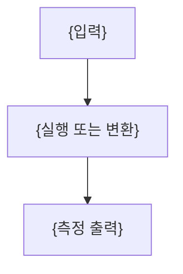

---
template:
  title: 실습 정리문서
  description: 실행된 코드·출력·측정값만 사용하며 workflow Mermaid와 source-backed palette 결과 시각화를
    포함하는 실습 노트.
  tags:
    - practice
    - openknowledge
    - visual
    - slides
title: "{실습 제목}"
description: "{이 실습이 검증하는 질문과 범위}"
type: practice
tags: []
course: "{과목}"
semester: "{학기}"
source: "{실습 원본 식별자}"
notebooks: 0
prerequisite: []
status: draft
aliases: []
slides: true
created: "{{date}}"
updated: "{{date}}"
---

> [!abstract]
> {실습 질문과 실행으로 확인한 결론}

## 입력과 환경

- **입력:** {실제로 사용한 데이터·파일·매개변수}
- **환경:** {실행 확인된 라이브러리·버전·하드웨어}
- **재현 조건:** {시드·설정·제약}

## 실행 흐름



## {핵심 실험 또는 구현}

```text
{실제로 실행한 핵심 코드}
```

```text
{실제 출력 또는 측정 결과}
```

- **관찰:** {출력에서 직접 확인한 사실}
- **해석:** {사실이 의미하는 것}
- **경계:** {재현·측정 한계}

## 결과 시각화

{필수: 비교 가능한 실측값은 palette v1 chart, 독립 측정치는 stat-cards, 실제 sweep 범위는 interactive-control, 정확한 성공수/전체수는 custom-svg를 삽입한다. 미실행 값은 만들지 않는다}

> [!warning]
> {실패·불일치·재현 한계가 있을 때만 유지}

## 결과 정리

| 측정 항목 | 결과 | 해석 |
| :-- | :-- | :-- |
| {항목} | {실측값} | {근거에 맞는 해석} |
