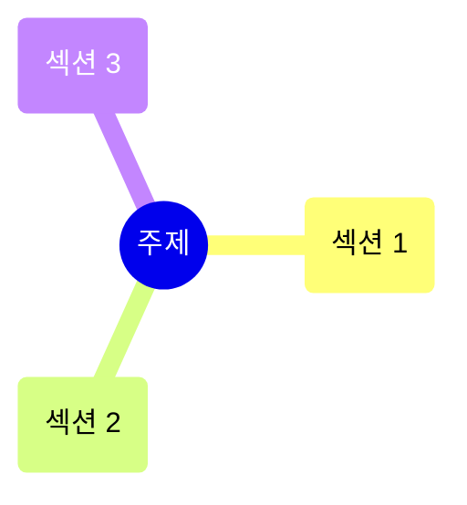

---
template:
  title: 강의 정리문서
  description: 강의자료 PDF를 근거로 쓰는 수업 정리문서. 표·Mermaid·콜아웃·LaTeX·PDF 페이지 임베드를 섞어 쓴다. 규격은 docs/knowledge-schema.md 와 .agents/skills/lecture-pdf-to-note 참고.
aliases: []
authority: primary
course: ""
created: {{date}}
date: {{date}}
review_state: active
semester: ""
source: pdf/
source_pages: 0
source_sha256: ""
source_type: lecture-slides
status: seedling
tags:
  - type/lecture
title: ""
type: lecture
updated: {{date}}
---

domain:: 
module:: 
source:: 

> [!abstract] 한 줄 요약
> 

## 이 강의의 지도

## 1. 

> [!quote] 슬라이드 근거
> `pdf/파일명.pdf` p.

## 핵심 정리

| 개념 | 한 줄 정의 | 왜 중요한가 |
|:--|:--|:--|
|  |  |  |

> [!question]- 스스로 점검
> **Q1.** 
> **A1.** 

## 슬라이드 근거

| 섹션 | 슬라이드 |
|:--|:--|
| 1.  | p. |

## 관련 노트

- 
