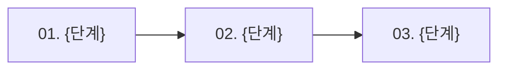

---
template:
  title: 실습 정리문서
  description: 실행된 노트북을 근거로 쓰는 실습 정리문서. 코드와 실측 출력을 인용하고 해석을 문서가 진다. 상세 규칙은
    ComputerScience 폴더 설명 참고.
  tags:
    - practice
    - openknowledge
title: ""
description: ""
type: practice
tags: []
course: ""
semester: ""
source: ""
notebooks: 0
status: draft
aliases: []
prerequisite: []
created: "{{date}}"
updated: "{{date}}"
---

> [!abstract] 한 줄 요약
> {이 실습이 확인하는 것}

## 실습 흐름



## 1. {첫 번째 단계}

> [!quote] 실습 근거
> `{노트북 파일명}.ipynb`

{이 단계가 하는 일}. =={핵심 용어}== 는 {정의}.

```python
{코드}
```

실행 결과는 다음과 같다.

```text
{셀 출력 원문}
```

{결과 해석}

## 2. {두 번째 단계}

<details>
<summary>전체 코드</summary>

```python
{긴 코드}
```

</details>

## 데이터로 보기

%% 실측 수치가 없는 실습이면 이 섹션을 통째로 지운다 %%

```html preview
<div style="font-family:system-ui,sans-serif;padding:20px;color:var(--foreground)">
  <h3 style="margin:0 0 14px;font-size:15px;font-weight:600">{차트 제목}</h3>
  <div id="bars" style="display:flex;align-items:flex-end;gap:14px;height:170px"></div>
  <script>
    var data = [['{항목1}', 0], ['{항목2}', 0]];
    var max = Math.max.apply(null, data.map(function (d) { return d[1]; })) || 1;
    document.getElementById('bars').innerHTML = data.map(function (d, i) {
      return '<div style="flex:1;display:flex;flex-direction:column;align-items:center;' +
        'gap:6px;height:100%;justify-content:flex-end">' +
        '<span style="font-size:12px;font-weight:600">' + d[1] + '</span>' +
        '<div style="width:100%;height:' + (d[1] / max * 100) + '%;' +
        'background:var(--chart-' + (i + 1) + ');' +
        'border-radius:var(--radius) var(--radius) 0 0"></div>' +
        '<span style="font-size:12px;color:var(--muted-foreground)">' + d[0] + '</span>' +
        '</div>';
    }).join('');
  </script>
</div>
```

## 핵심 정리

| 개념 | 정의 | 왜 중요한가 |
| :-- | :-- | :-- |
| {개념} | {정의} | {이유} |

## 다룬 노트북

| # | 노트북 | 하는 일 |
| :-- | :-- | :-- |
| 01 | `{파일명}.ipynb` | {한 줄 요약} |

## 관련 개념

- **prerequisite** — {선수 노트 링크} : {왜 먼저 봐야 하는가}
- **uses** — {이론 노트 링크} : {어느 개념을 쓰는가}

> [!question]- 스스로 점검
> **Q.** {질문}
>
> **A.** {답}

## 출처

- 노트북: `{폴더 경로}/` ({n}개)
- 원본 소스: {Google Drive 경로}
