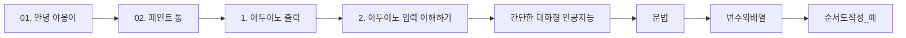

> [!abstract] 사용법
> 이 문서는 원본 PDF의 **순서 → 핵심 단서 → 학습 점검**을 한 번에 보는 지도입니다. 세부 개념은 같은 폴더의 주제 노트와 원본 PDF를 함께 대조하세요.

## 강의 흐름



<Tabs>
  <Tab label="파일 순서">파일명과 주차·장 제목을 강의 진행 신호로 삼아 처음부터 읽습니다.</Tab>
  <Tab label="읽기 전략">이론에서 실습·평가로 이동하며 같은 주제의 중복 PDF는 보조 자료로 비교합니다.</Tab>
  <Tab label="검증">텍스트가 빈약한 자료는 추출되지 않은 도식·수식을 임의로 채우지 않고 원본에서 확인합니다.</Tab>
</Tabs>

## 원본 PDF 목록

| 파일 | 쪽수 | 첫 페이지 단서 |
| :-- | --: | :-- |
| 01. 안녕 야옹이.pdf | — | PART 1 앱 인벤터 프로젝트 01 안녕 야옹이 |
| 02. 페인트 통.pdf | — | PART 1 앱 인벤터 프로젝트 02 페인트 통 |
| 1. 아두이노 출력.pdf | — | 텍스트 추출 빈약 — 원본 시각 자료 확인 필요 |
| 2. 아두이노 입력 이해하기.pdf | — | 텍스트 추출 빈약 — 원본 시각 자료 확인 필요 |
| 간단한 대화형 인공지능.pdf | — | 텍스트 추출 빈약 — 원본 시각 자료 확인 필요 |
| 문법.pdf | — | 1. if문 1. 기본 if문 • 조건문(선택 제어문)에는 if문과 switch문이 있는데 둘 다 조건에 따라서 다른 내용 이 실행되도 록 실행의 흐름을 제어하는 명령문 • ‘if’라는 단어의 사전상 의미는 ‘만약 ~라면’으로, C에 서도 ‘만약’이라는 어떤 조건을 |
| 변수와배열.pdf | — | 3. 변수의 이해 1. 변수 선언 • 요리를 하기에 앞서 그릇을 준비하듯이 C 프로그램을 작성하려면 변수 선언을 먼저 수행 • 국그릇, 밥그릇, 반찬그릇 등 다양한 그릇이 있는 것처럼 변수의 종류도 다양 • 소수점이 없는 값과 소수점이 있는 값을 담는 변수를 선언 |
| 순서도작성_예.pdf | — | 텍스트 추출 빈약 — 원본 시각 자료 확인 필요 |
| 스크래치.pdf | — | 텍스트 추출 빈약 — 원본 시각 자료 확인 필요 |
| 알고리즘연습1.pdf | — | 텍스트 추출 빈약 — 원본 시각 자료 확인 필요 |
| 알고리즘연습2.pdf | — | 텍스트 추출 빈약 — 원본 시각 자료 확인 필요 |
| 연산자.pdf | — | 1. 산술 연산자 1. 기본 산술 연산자 1/47 |
| 음성검색.pdf | — | 텍스트 추출 빈약 — 원본 시각 자료 확인 필요 |
| 컴퓨터의 이해와 정보의 표현.pdf | — | Part 01. 컴퓨팅 사고 이론 Chapter 02. 컴퓨터의 이해와 정보의 표현 |
| 컴퓨팅 사고와 문제해결.pdf | — | Part 01. 컴퓨팅 사고 이론 Chapter 03. 컴퓨팅 사고와 문제 해결 |
| 함수.pdf | — | 1. 함수의 이해 1. 함수의 개념  함수를 자판기에 비교 • 자판기가 없는 경우  매번 같은 작업을 반복 1/48 |
| Chapter 04. 알고리즘과 프로그래밍 언어.pdf | — | Part 01. 컴퓨팅 사고 이론 Chapter 04. 알고리즘과 프로그래밍 언어 |

## 원본 단계 인터랙티브

```html preview
<div style="font-family:system-ui,sans-serif;padding:20px;color:var(--foreground)">
  <label for="flow20759" style="font-size:14px;font-weight:600">원본 자료 단계</label>
  <div id="flow20759-out" style="font-size:24px;font-weight:700;color:var(--chart-1);margin:6px 0">01. 안녕 야옹이</div>
  <input id="flow20759" type="range" min="1" max="17" step="1" value="1" style="width:100%;accent-color:var(--primary)" />
  <p style="font-size:13px;color:var(--muted-foreground)">슬라이더를 움직이면 파일명 순서대로 자료의 역할을 확인합니다.</p>
  <script>
    var flow20759 = document.getElementById('flow20759');
    var flow20759Out = document.getElementById('flow20759-out');
    var flow20759Steps = ["01. 안녕 야옹이","02. 페인트 통","1. 아두이노 출력","2. 아두이노 입력 이해하기","간단한 대화형 인공지능","문법","변수와배열","순서도작성_예","스크래치","알고리즘연습1","알고리즘연습2","연산자","음성검색","컴퓨터의 이해와 정보의 표현","컴퓨팅 사고와 문제해결","함수","Chapter 04. 알고리즘과 프로그래밍 언어"];
    flow20759.addEventListener('input', function () {
      flow20759Out.textContent = flow20759Steps[Number(flow20759.value) - 1];
    });
  </script>
</div>
```

## 점검 포인트

- **범위:** 17개 PDF, 총 0쪽.
- **근거:** 첫 페이지 추출 단서를 표에 남겨 주제명과 흐름을 확인했습니다.
- **시각 자료:** 10개 파일은 첫 페이지 텍스트가 빈약하므로 필요한 경우 승인된 크롭 후보로만 별도 검토합니다.

> [!warning] 과해석 방지
> 이 지도에는 파일명·쪽수·추출된 첫 페이지 단서만 기록했습니다. PDF에 없는 구현 세부, 성능 수치, 권장 설정은 추가하지 않습니다.

<details>
<summary>다음 읽기</summary>

현재 단계의 파일을 선택한 뒤, 같은 폴더의 주제 노트에서 정의·절차·실습 결과를 대조하세요.

</details>
