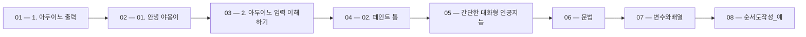

> [!abstract] 사용법
> 이 지도는 현재 폴더의 원본 PDF를 파일 순서대로 묶어 강의 진행 → 핵심 단서 → 점검 포인트를 연결합니다. 세부 개념은 같은 폴더의 주제 노트와 함께 대조하세요.

## 강의 흐름



<Tabs>
  <Tab label="파일 순서">파일명에 포함된 주차·장·버전 표기를 먼저 읽어 강의의 큰 흐름을 잡습니다.</Tab>
  <Tab label="중복 자료">같은 접두사나 버전이 겹치면 앞 자료를 기준으로 뒤 자료의 보충·실습 여부를 비교합니다.</Tab>
  <Tab label="검증">파일명과 쪽수는 탐색용 단서입니다. 정의·식·코드·도식은 각 원본 PDF에서 다시 확인합니다.</Tab>
</Tabs>

## 원본 PDF 목록

| 파일 | 쪽수 | 확인 메모 |
| :-- | --: | :-- |
| 1. 아두이노 출력.pdf | 22 | 원본 첫 페이지·본문 대조 |
| 01. 안녕 야옹이.pdf | 27 | 원본 첫 페이지·본문 대조 |
| 2. 아두이노 입력 이해하기.pdf | 12 | 원본 첫 페이지·본문 대조 |
| 02. 페인트 통.pdf | 30 | 원본 첫 페이지·본문 대조 |
| 간단한 대화형 인공지능.pdf | 22 | 원본 첫 페이지·본문 대조 |
| 문법.pdf | 9 | 원본 첫 페이지·본문 대조 |
| 변수와배열.pdf | 12 | 원본 첫 페이지·본문 대조 |
| 순서도작성_예.pdf | 34 | 원본 첫 페이지·본문 대조 |
| 스크래치.pdf | 15 | 원본 첫 페이지·본문 대조 |
| 알고리즘연습1.pdf | 23 | 원본 첫 페이지·본문 대조 |
| 알고리즘연습2.pdf | 38 | 원본 첫 페이지·본문 대조 |
| 연산자.pdf | 5 | 원본 첫 페이지·본문 대조 |
| 음성검색.pdf | 36 | 원본 첫 페이지·본문 대조 |
| 컴퓨터의 이해와 정보의 표현.pdf | 62 | 원본 첫 페이지·본문 대조 |
| 컴퓨팅 사고와 문제해결.pdf | 29 | 원본 첫 페이지·본문 대조 |
| 함수.pdf | 7 | 원본 첫 페이지·본문 대조 |
| Chapter 04. 알고리즘과 프로그래밍 언어.pdf | 38 | 원본 첫 페이지·본문 대조 |

## 원본 단계 인터랙티브

```html preview
<div style="font-family:system-ui,sans-serif;padding:20px;color:var(--foreground)">
  <label for="flow2741233933" style="font-size:14px;font-weight:600">원본 자료 단계</label>
  <div id="flow2741233933-out" style="font-size:24px;font-weight:700;color:var(--chart-1);margin:6px 0">1. 아두이노 출력</div>
  <input id="flow2741233933" type="range" min="1" max="17" step="1" value="1" style="width:100%;accent-color:var(--primary)" />
  <p style="font-size:13px;color:var(--muted-foreground)">슬라이더를 움직이면 파일명 순서대로 자료의 위치를 확인합니다.</p>
  <script>
    var flow2741233933 = document.getElementById('flow2741233933');
    var flow2741233933Out = document.getElementById('flow2741233933-out');
    var flow2741233933Steps = ["1. 아두이노 출력","01. 안녕 야옹이","2. 아두이노 입력 이해하기","02. 페인트 통","간단한 대화형 인공지능","문법","변수와배열","순서도작성_예","스크래치","알고리즘연습1","알고리즘연습2","연산자","음성검색","컴퓨터의 이해와 정보의 표현","컴퓨팅 사고와 문제해결","함수","Chapter 04. 알고리즘과 프로그래밍 언어"];
    flow2741233933.addEventListener('input', function () {
      flow2741233933Out.textContent = flow2741233933Steps[Number(flow2741233933.value) - 1] || '';
    });
  </script>
</div>
```

## 점검 포인트

- **범위:** 17개 PDF, 총 421쪽.
- **근거:** 쪽수와 파일명은 현재 sources/ 디렉터리에서 직접 수집했습니다.
- **학습 순서:** 흐름도와 슬라이더를 먼저 훑은 뒤, 주제 노트의 정의·절차·실습 결과를 순서대로 대조합니다.

> [!warning] 과해석 방지
> 이 지도에는 파일명·쪽수·확인 메모만 기록했습니다. PDF에 없는 구현 세부, 성능 수치, 권장 설정은 추가하지 않습니다.

<details>
<summary>다음 읽기</summary>

현재 단계의 원본을 열어 제목·절차·도식을 확인한 뒤, 같은 폴더의 주제 노트에 해당 근거가 반영되었는지 점검하세요.

</details>
