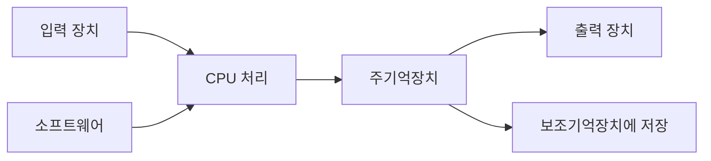

컴퓨터는 데이터를 입력받아 처리한 뒤 의미 있는 정보로 출력하거나 저장한다. 자료는 이 과정을 하드웨어와 소프트웨어의 협력으로 설명한다.

> [!IMPORTANT]
> 강의의 흐름은 컴퓨터 개요 → 발전과 변화 → 정보 표현이다. 아래 용어와 수치는 원본 자료에 명시된 범위만 사용했다.

---

## 1. 입력·처리·출력 구조

- **하드웨어**: CPU, 입력장치, 출력장치, 주기억장치, 보조기억장치.
- **소프트웨어**: 하드웨어를 조작해 원하는 정보를 만드는 프로그램.
- 주방 비유에서 CPU는 주방장, 주기억장치는 작업대, 보조기억장치는 재료 창고에 대응한다.



<Tabs>
  <Tab label="입력">키보드, 마우스, 이미지 센서처럼 데이터를 컴퓨터로 전달한다.</Tab>
  <Tab label="처리">CPU가 명령을 실행하고 메모리의 작업 공간을 사용한다.</Tab>
  <Tab label="출력·저장">모니터·스피커로 결과를 내보내거나 보조기억장치에 보관한다.</Tab>
</Tabs>

---

## 2. 발전 과정에서 달라진 사용 방식

자료는 진공관 기반 초기 컴퓨터에서 트랜지스터·집적회로를 거쳐 개인용 컴퓨터와 웹 환경으로 이어지는 변화를 보여 준다. 하이텔과 같은 문자 기반 환경, 1993년 모자이크 웹 브라우저의 등장은 입력·출력 방식이 문자에서 그래픽과 웹으로 확장된 사례다.

| 관점 | 초기 환경 | 이후 환경 |
| --- | --- | --- |
| 입력 | 천공 카드·키보드 중심 | 마우스·센서·터치 |
| 출력 | 문자·라인 프린터 | 모니터·영상·소리 |
| 처리 단위 | 제한된 기억 용량 | 집적회로와 고속 CPU |

---

## 3. 비트에서 진법으로

- 비트(bit)는 가장 작은 정보 단위이며 0 또는 1을 가진다.
- 1바이트는 8비트다.
- 워드 크기는 CPU가 한 번에 처리하는 기본 단위로 자료에서는 32비트와 64비트를 비교한다.
- 2진법은 0과 1로 표현하고, 16진법은 0–9와 A–F를 사용한다. 8비트 한 바이트를 두 자리 16진수로 읽기 쉽다는 점이 핵심이다.

1010₂ = A₁₆처럼 4비트 묶음을 한 자리 16진수로 대응시키면 변환 과정을 짧게 확인할 수 있다.

```html preview
<div style="font-family:system-ui,sans-serif;padding:20px;color:var(--foreground)">
  <label for="amt" style="font-size:14px;font-weight:600">정보 표현 단계</label>
  <div id="out" style="font-size:30px;font-weight:700;color:var(--chart-1);margin:6px 0">1단계</div>
  <input id="amt" type="range" min="1" max="3" step="1" value="1"
    style="width:100%;accent-color:var(--primary)" />
  <p style="font-size:13px;color:var(--muted-foreground)">원본 자료의 순서를 움직여 해당 단계의 핵심을 확인한다.</p>
  <script>
    var amt = document.getElementById('amt');
    var out = document.getElementById('out');
    amt.addEventListener('input', function () {
      out.textContent = Number(amt.value).toLocaleString() + '단계';
    });
  </script>
</div>
```

<details>
<summary>문자·숫자 표현 점검</summary>

- ASCII는 문자를 숫자와 대응시키는 7비트 코드다.
- 자료는 char가 1바이트(8비트)이고 -128~127 범위를 갖는다고 설명한다.
- 큰 저장 단위는 KB, MB, GB, TB, PB로 확장된다.
- 2진수와 16진수 변환은 자릿값을 분해한 뒤 합산하는 절차로 확인한다.

</details>

> [!WARNING]
> 비트·바이트·워드는 서로 다른 단위다. 64비트 CPU라는 말은 저장장치 용량이 아니라 CPU가 처리하는 워드 크기와 관련된다.

<!-- source: 컴퓨터의 이해와 정보의 표현.pdf; ordered sections and numeric definitions preserved -->