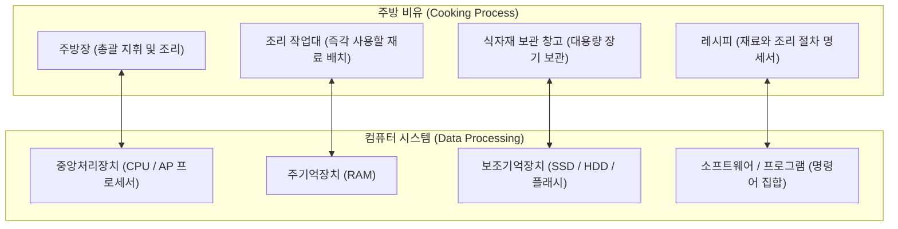
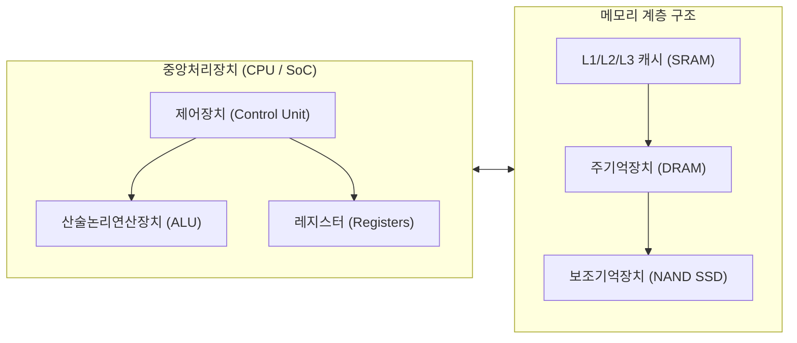
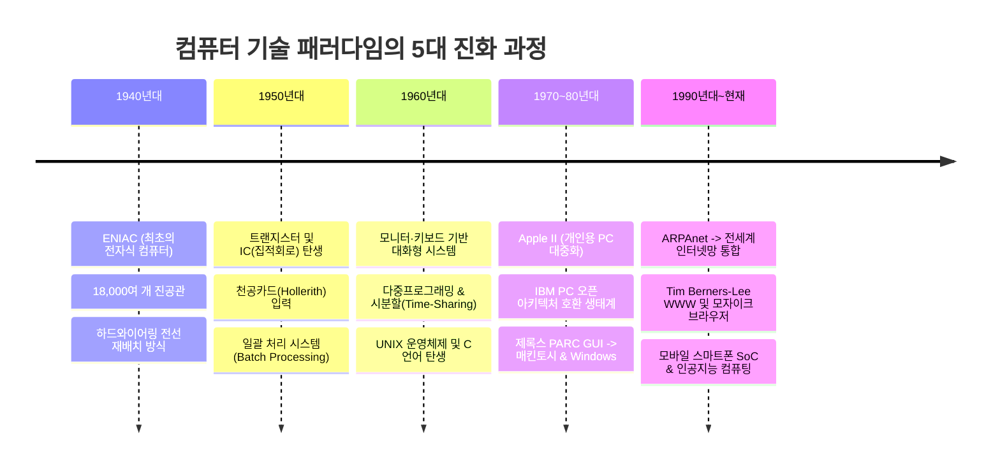
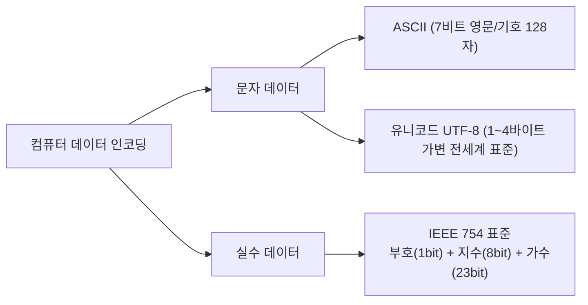

> [!abstract] 핵심 요약
> **컴퓨터(Computer)**는 원시적인 **데이터(Data)**를 입력받아 정해진 절차(소프트웨어 레시피)에 따라 **처리(Process)**하여 인간과 시스템에 의미 있는 **정보(Information)**를 창출하고 저장·출력하는 전자기계 시스템이다.
> 하드웨어는 **CPU, 주기억장치(RAM/ROM), 보조기억장치, 입출력장치**로 구성되며, 모든 데이터는 물리적 트랜지스터의 ON/OFF 상태를 반영한 **2진수(Binary System)** 기반의 보수 연산(2's Complement)과 표준 부동소수점(IEEE 754) 체계로 인코딩된다.

---

## 1. 컴퓨터의 개념과 동작 원리 (하드웨어와 소프트웨어의 상호작용)

컴퓨터의 동작 메커니즘은 주방에서 요리가 만들어지는 과정과 정확히 일치한다.



| 컴퓨터 구성 요소 | 주방 비유 | 물리적 역할 및 기술적 특징 | 주요 예시 |
| :-- | :-- | :-- | :-- |
| **중앙처리장치 (CPU / AP)** | 주방장 | 명령어 해석, 산술논리연산(ALU), 제어 신호 발생 | Intel Core, Apple Silicon M시리즈, Qualcomm Snapdragon |
| **주기억장치 (Main Memory)** | 조리 작업대 | CPU가 현재 실행 중인 프로그램과 데이터를 임시 상주 (초고속 접근, 휘발성) | DRAM (DDR4, DDR5), SRAM (CPU 캐시) |
| **보조기억장치 (Secondary Storage)** | 식자재 창고 | 전원이 차단되어도 데이터를 영구 보존하는 대용량 저장소 (비휘발성) | NVMe SSD, SATA HDD, USB Flash, SD Card |
| **입력장치 (Input Devices)** | 식자재 반입구 | 외부 세계의 물리적 신호나 사용자 입력을 디지털 데이터로 변환 | 키보드, 마우스, 터치스크린, 광센서, 자이로스코프, GPS |
| **출력장치 (Output Devices)** | 요리 서빙대 | 컴퓨터 내부에서 처리된 디지털 정보를 인간이 인식 가능한 형태로 변환 | OLED/LCD 모니터, 3D 프린터 (의족·시제품 제작), 스피커 |
| **소프트웨어 (Software)** | 요리 레시피 | 하드웨어 자원을 제어하고 특정 목적의 계산을 수행하는 명령어의 집합 | 시스템 SW (OS, 드라이버) 및 응용 SW (브라우저, 앱) |

---

## 2. 하드웨어 핵심 서브시스템 심층 분석



### 1) 메모리 분류와 물리적 특성

<Tabs>
  <Tab label="1. RAM (Random Access Memory)">
    <strong>임의 접근 메모리 (RAM)</strong><br/>
    주소에 상관없이 동일한 시간 내에 데이터를 읽고 쓸 수 있는 주기억장치.
    <ul>
      <li><strong>DRAM (Dynamic RAM)</strong>: 커패시터(Capacitor)의 전하 충전 여부로 비트를 저장. 시간이 지나면 방전되므로 주기적인 재충전(Refresh) 회로가 필요하며, 구조가 단순하여 대용량 주기억장치에 채택.</li>
      <li><strong>SRAM (Static RAM)</strong>: 플립플롭(Flip-Flop) 회로로 구성되어 전원이 공급되는 한 데이터가 유지됨. 재충전이 필요 없고 극도로 빠르지만 회로 면적이 커 CPU 내부 캐시 메모리(L1/L2/L3)에 국한되어 사용.</li>
    </ul>
  </Tab>
  <Tab label="2. ROM (Read Only Memory)">
    <strong>읽기 전용 메모리 (ROM)</strong><br/>
    전원이 차단되어도 데이터가 소멸되지 않는 비휘발성 메모리로, 부팅 펌웨어(BIOS/UEFI) 저장에 사용.
    <ul>
      <li><strong>Mask ROM</strong>: 제조 공정 단계에서 회로 패턴으로 데이터를 고정하여 영구 수정 불가.</li>
      <li><strong>PROM</strong>: 전용 라이터기로 사용자가 단 1회에 한해 데이터를 기록.</li>
      <li><strong>EPROM / EEPROM</strong>: 자외선(EPROM) 또는 전기적 신호(EEPROM)로 데이터를 지우고 재기록 가능 (플래시 메모리의 기술적 모태).</li>
    </ul>
  </Tab>
  <Tab label="3. 스마트 센서 입력 시스템">
    <strong>현대 모바일 및 임베디드 센서</strong><br/>
    <ul>
      <li><strong>빛 센서 (Ambient Light Sensor)</strong>: 주변 조도를 측정하여 디스플레이 밝기를 자동 조절하고 주머니 내부 감지 시 화면 OFF.</li>
      <li><strong>자이로 센서 & 가속도 센서</strong>: 기기의 각속도와 3축 기울기를 측정하여 화면 회전 및 제스처 인식.</li>
      <li><strong>GPS & 생체인식 센서</strong>: 위성 삼각측량을 통한 정밀 위치 추적, 지문/홍채/안면 3D 스캔 기반 보안 인증.</li>
    </ul>
  </Tab>
</Tabs>

---

## 3. 컴퓨터의 역사적 발전 단계 (1940년대 ~ 현대)



---

## 4. 데이터의 표현 단위와 물리적 척도

컴퓨터 내부의 최소 정보 단위는 이진 상태(0 또는 1)를 나타내는 **비트(Bit)**이다.

$$1 \text{ Byte} = 8 \text{ Bits} \quad (2^8 = 256 \text{가지 상태 표현})$$

$$\text{Word} = \text{CPU가 한 번의 버스 사이클로 처리할 수 있는 레지스터 크기} \quad (32\text{-bit CPU} \rightarrow 4\text{ Bytes}, \ 64\text{-bit CPU} \rightarrow 8\text{ Bytes})$$

### 대용량 데이터 단위 환산표 ($2^{10} = 1,024$ 배율)
$$\text{KB} (2^{10}) \rightarrow \text{MB} (2^{20}) \rightarrow \text{GB} (2^{30}) \rightarrow \text{TB} (2^{40}) \rightarrow \text{PB} (2^{50}) \rightarrow \text{EB} (2^{60})$$

---

## 5. 실시간 진법 변환 및 2의 보수(2's Complement) 계산기

컴퓨터는 뺄셈을 가산기(Adder) 회로 하나로 통합 처리하기 위해 음수를 **2의 보수(2's Complement)** 형태로 저장한다:

$$\text{1의 보수: 모든 비트를 반전 } (0 \leftrightarrow 1)$$
$$\text{2의 보수} = \text{1의 보수} + 1$$

```html preview
<div style="font-family:system-ui,-apple-system,sans-serif;padding:20px;background:var(--card);color:var(--card-foreground);border:1px solid var(--border);border-radius:var(--radius)">
  <div style="font-size:16px;font-weight:700;margin-bottom:14px;color:var(--primary);display:flex;align-items:center;gap:8px">
    <span>🔢 8비트 정수 진법 변환 및 2의 보수 계산 시뮬레이터</span>
  </div>

  <div style="display:grid;grid-template-columns:1fr 1fr;gap:12px;margin-bottom:16px">
    <div>
      <label style="font-size:12px;font-weight:600;color:var(--muted-foreground);display:block;margin-bottom:4px">10진 정수 입력 (-128 ~ 127)</label>
      <input id="decInput" type="number" min="-128" max="127" value="-42" style="width:100%;padding:8px;background:var(--background);color:var(--foreground);border:1px solid var(--border);border-radius:var(--radius);font-size:14px;font-weight:700" />
    </div>
    <div>
      <label style="font-size:12px;font-weight:600;color:var(--muted-foreground);display:block;margin-bottom:4px">16진수 표현 (Hexadecimal)</label>
      <div id="hexDisplay" style="padding:8px;background:var(--background);border:1px solid var(--border);border-radius:var(--radius);font-size:14px;font-family:monospace;font-weight:700;color:var(--chart-2)">
        0xD6
      </div>
    </div>
  </div>

  <div style="padding:12px;background:var(--background);border:1px solid var(--border);border-radius:var(--radius);margin-bottom:14px">
    <div style="font-size:12px;font-weight:700;color:var(--primary);margin-bottom:8px">8비트 2진수 메모리 비트맵:</div>
    <div id="bitsContainer" style="display:flex;gap:6px;justify-content:center"></div>
  </div>

  <div style="background:var(--background);padding:12px;border:1px solid var(--border);border-radius:var(--radius);font-size:12px;line-height:1.6">
    <div style="font-weight:700;color:var(--chart-1);margin-bottom:4px">보수 변환 단계별 추론:</div>
    <div id="stepExplanation" style="font-family:monospace;color:var(--foreground)"></div>
  </div>

  <script>
    var input = document.getElementById('decInput');
    var hexOut = document.getElementById('hexDisplay');
    var bitsCont = document.getElementById('bitsContainer');
    var stepExp = document.getElementById('stepExplanation');

    function updateBits() {
      var val = parseInt(input.value);
      if (isNaN(val)) val = 0;
      if (val < -128) val = -128;
      if (val > 127) val = 127;
      input.value = val;

      var byteVal = (val < 0) ? (256 + val) : val;
      var binStr = byteVal.toString(2).padStart(8, '0');
      var hexStr = '0x' + byteVal.toString(16).toUpperCase().padStart(2, '0');
      hexOut.textContent = hexStr;

      bitsCont.innerHTML = '';
      for (var i = 0; i < 8; i++) {
        var b = binStr[i];
        var box = document.createElement('div');
        box.style.cssText = 'width:32px;height:38px;display:flex;flex-direction:column;align-items:center;justify-content:center;border-radius:4px;border:1px solid ' + (i === 0 ? 'var(--destructive)' : 'var(--border)') + ';background:' + (b === '1' ? 'var(--primary)' : 'var(--card)') + ';color:' + (b === '1' ? '#fff' : 'var(--card-foreground)');
        box.innerHTML = '<span style="font-size:14px;font-weight:800">' + b + '</span><span style="font-size:8px;opacity:0.8">' + (i === 0 ? 'MSB' : '2^' + (7 - i)) + '</span>';
        bitsCont.appendChild(box);
      }

      if (val >= 0) {
        stepExp.textContent = "양수 " + val + "은 2진수 " + binStr + "로 직접 부호-절댓값 표현됩니다 (최상위 비트 MSB=0).";
      } else {
        var absVal = Math.abs(val);
        var absBin = absVal.toString(2).padStart(8, '0');
        var onesComp = absBin.split('').map(function(c){return c==='0'?'1':'0';}).join('');
        stepExp.textContent = "1. 절대값 |" + val + "| = " + absVal + " -> " + absBin + "\\n" +
                              "2. 1의 보수 (비트 반전) -> " + onesComp + "\\n" +
                              "3. 2의 보수 (+1 가산)  -> " + binStr + " (" + hexStr + ")";
      }
    }

    input.addEventListener('input', updateBits);
    updateBits();
  </script>
</div>
```

---

## 6. 문자 및 실수 데이터 인코딩 표준



### IEEE 754 32비트 단정밀도(Single Precision) 부동소수점 구조

$$V = (-1)^s \times (1.M) \times 2^{E - 127}$$

- **부호 비트 (Sign, 1 bit)**: $0 \rightarrow$ 양수, $1 \rightarrow$ 음수
- **지수부 (Exponent, 8 bits)**: 지수값에 바이어스(Bias) 127을 더하여 음수 지수를 부호 없이 양수로 변환 저장 ($0 \sim 255$)
- **가수부 (Mantissa / Fraction, 23 bits)**: $1.M$ 형태로 정규화된 유효 숫자의 소수점 이하 비트 저장
