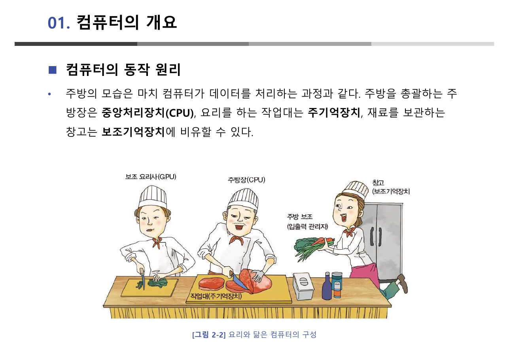
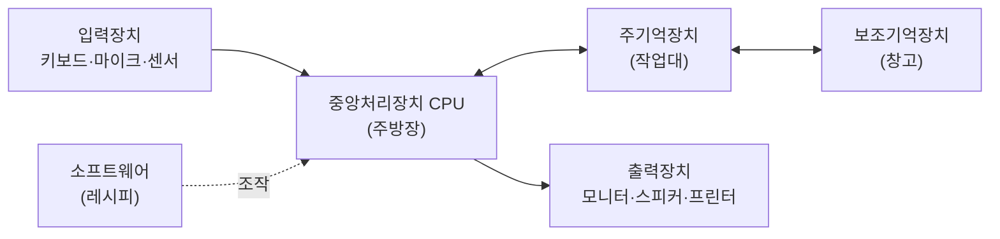
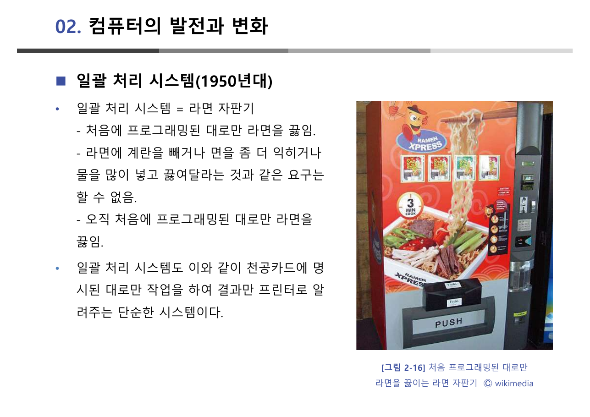
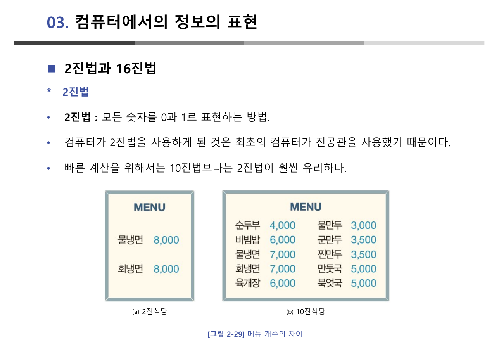
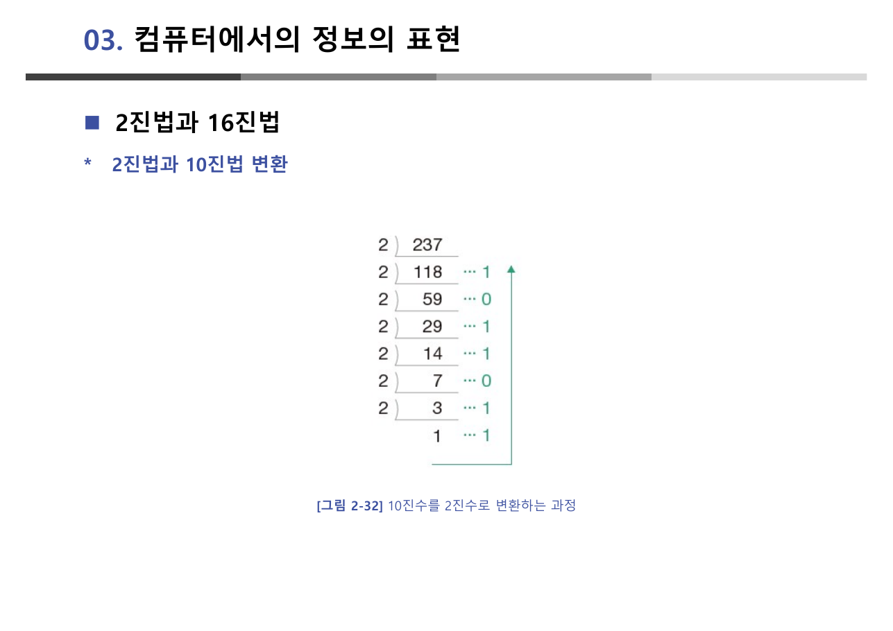
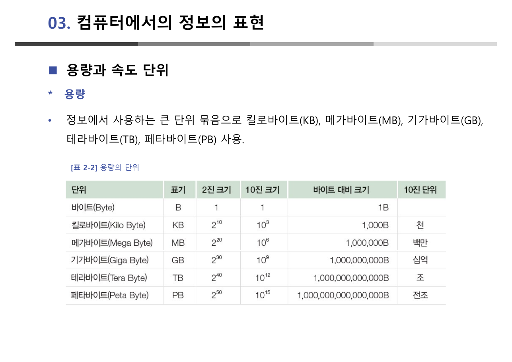
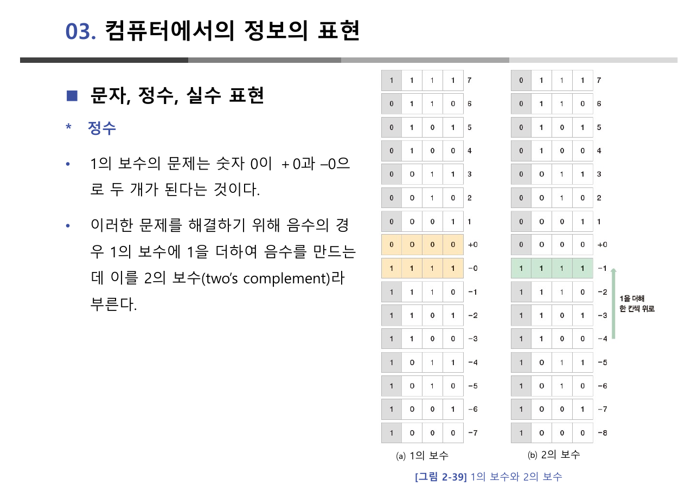
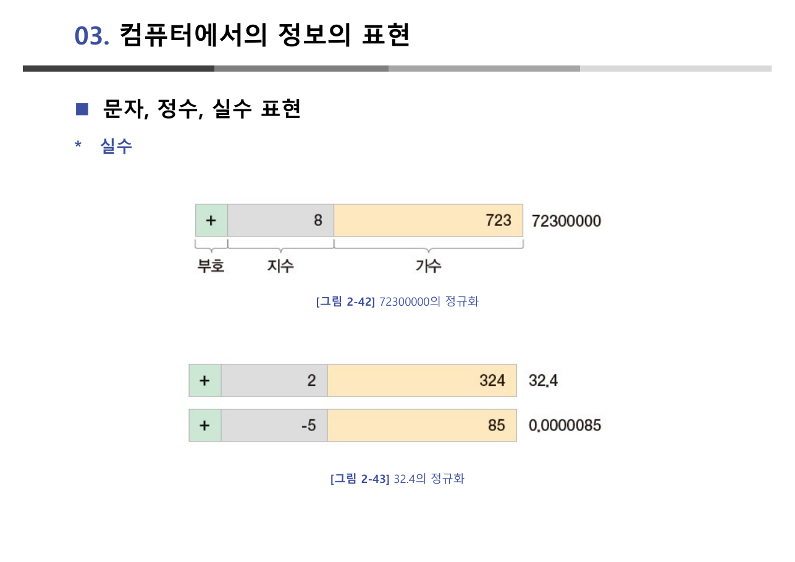
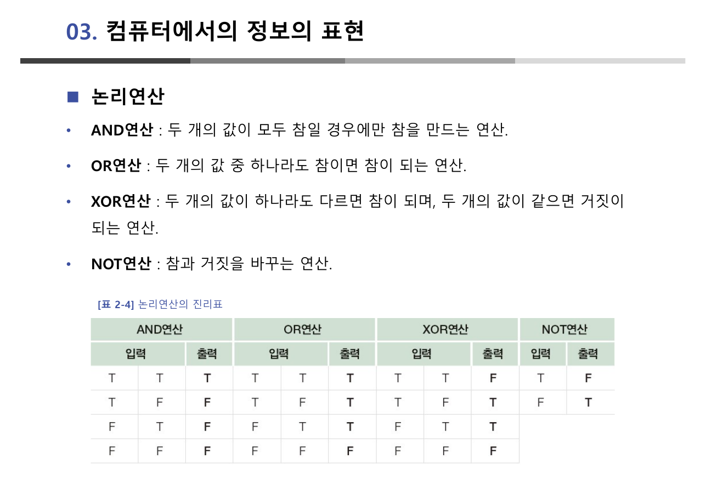

> [!abstract] 이 강의자료는 비유로 쓰였다
> 62쪽을 통틀어 **새로운 개념이 나올 때마다 먼저 주방이나 식당이 나온다.** 컴퓨터의 구성은 주방(6쪽), 일괄 처리 시스템은 라면 자판기(25쪽), 대화형 시스템은 테이블이 하나뿐인 식당(27쪽), 다중 프로그래밍은 규모가 큰 식당(28쪽), 시분할은 영화 필름(29쪽), 2진법은 메뉴가 둘뿐인 식당(44쪽), 논리연산은 은희와 서린의 부산 여행(58~60쪽)이다.
>
> 그래서 이 정리는 슬라이드 순서를 따라가지 않고 **비유가 성립하는 구간과 비유가 끊기는 구간**으로 나누어 읽는다. 비유는 1·2절(하드웨어·역사)에서 거의 전부를 감당하지만, 3절(정보의 표현)에 들어서면 갑자기 사라지고 나눗셈과 보수와 진리표가 남는다. 그 전환점이 이 장의 뼈대다.

---

## 주방 한 장으로 설명되는 컴퓨터

원본은 컴퓨터를 한 문장으로 정의한다 — **"데이터를 처리하여 의미 있는 자료, 즉 정보를 만드는 장치"**(4쪽). 데이터가 들어가고, 처리되고, 정보가 나온다. 그리고 곧바로 그림 2-2의 주방이 등장한다.



| 주방 | 컴퓨터 | 원본의 설명 |
| --- | --- | --- |
| 주방을 총괄하는 **주방장** | 중앙처리장치(CPU) | 명령에 따라 데이터를 계산하고 주변장치에 입출력 명령을 내림 |
| 요리를 하는 **작업대** | 주기억장치 | 지금 다루는 것을 올려놓는 자리 |
| 재료를 보관하는 **창고** | 보조기억장치 | 느리지만 싸고 크고, 전원과 무관하게 영구 보관 |
| **레시피** | 소프트웨어 | 하드웨어를 조작하여 원하는 정보를 만들어내는 것 |



비유의 힘은 **위계를 한 번에 알려준다**는 데 있다. 작업대는 좁고 빠르고, 창고는 넓고 느리다. 왜 주기억장치와 보조기억장치를 굳이 나누어 두는지, 왜 창고에서 재료를 꺼내 작업대에 올려야 하는지가 설명 없이 전달된다.

### 비유가 감당하지 못하는 각주들

하지만 8~19쪽은 비유 없이 항목을 나열한다. 여기가 이 장에서 가장 사고가 잦은 구간이다.

> [!warning] 원본 8쪽 — CPU의 영문 표기가 틀렸다
> 원본은 중앙처리장치를 **"Centurial Processing Unit"** 이라고 적었다. 올바른 표기는 **Central Processing Unit** 이다. `Centurial`은 "백년의"라는 뜻의 단어로, CPU와 무관하다.

같은 절에 개념이 스스로 어긋나는 곳도 하나 있다.

> [!warning] 원본 16쪽 — ROM 설명이 스스로 모순된다
> 16쪽은 ROM을 "**읽기만 가능하며 … 데이터를 한 번 저장하면 내용을 바꿀 수 없음**"이라고 정의해 놓고, 바로 아래 종류를 나열하면서 **EPROM은 "여러 번 쓰고 지울 수 있음"** 이라고 적는다. 앞의 정의가 EPROM을 배제해 버린다.
>
> 실제로는 ROM의 "Read Only"는 *동작 중에는 읽기 전용*이라는 뜻이고, 쓰기·지우기는 별도의 절차(전용 장비·자외선 등)로 이루어진다. 마스크 ROM → PROM(한 번) → EPROM(여러 번)의 나열은 **"바꾸기가 얼마나 어려운가"의 순서**로 읽어야 정확하다.
>
> 같은 쪽에 "데이터를 **보관하는 보관하는** 장점"이라는 단어 중복 오타도 있다.

RAM은 반대로 정확하게 정리되어 있다(15쪽). 요점은 두 가지다.

- **Random Access** — 저장된 위치와 상관없이 같은 속도로 읽을 수 있다는 뜻이다. "무작위로 저장한다"가 아니다.
- **휘발성/비휘발성의 교환 조건** — 휘발성 메모리는 전원이 없으면 사라지지만 접근이 빠르고, 비휘발성은 보관되지만 느리다. 그래서 각각 주기억장치와 보조기억장치에 배치된다. 창고와 작업대의 분리가 여기서 물리적 근거를 얻는다.

입력장치 절(10~12쪽)에서 원본이 굳이 **센서 입력장치**를 따로 떼어 놓은 것도 눈여겨볼 만하다. 빛 센서·이미지 센서·지문인식 센서·GPS 센서·자이로 센서 — 이 목록은 [10장 아두이노](./10.%20아두이노%20디지털·아날로그%20입출력.md)에서 그대로 다시 등장한다. 스마트폰이 하는 일을 5V 보드 위에서 직접 만들어 보는 것이 그 장의 내용이다.

---

## 역사도 식당으로 설명된다

20~35쪽의 발전사는 연도별 나열처럼 보이지만, 실제로는 **"사용자가 컴퓨터에 얼마나 끼어들 수 있는가"** 하나의 축으로 정렬되어 있다. 그리고 그 축의 각 지점마다 식당 비유가 붙는다.



| 시기 | 시스템 | 원본의 비유 | 사용자가 끼어들 수 있는가 |
| --- | --- | --- | --- |
| 1940년대 | 에니악, 하드 와이어링 | (없음) | 전선을 다시 꽂아야 함 |
| 1950년대 | 일괄 처리 시스템 | **라면 자판기** | 불가능 — 천공카드에 적힌 대로만 |
| 1960년대 초 | 대화형 시스템 | **테이블이 하나뿐인 식당** | 가능 — 중간 입력·중간 확인 |
| 1960년대 후 | 다중 프로그래밍·시분할 | **규모가 큰 식당**, **영화 필름** | 가능 + 여러 사람이 동시에 |
| 1970년대 | 개인용 컴퓨터 | (없음) | 각자 한 대씩 |
| 1990년대 | 인터넷과 WWW | (없음) | 서로 연결됨 |

라면 자판기 비유가 특히 정확하다. 원본은 "라면에 계란을 빼거나 면을 좀 더 익히거나 물을 많이 넣고 끓여달라는 것과 같은 요구는 할 수 없음"이라고 쓴다. 일괄 처리 시스템의 본질은 속도가 아니라 **중간에 말을 걸 수 없다는 것**이다. 그래서 1960년대 초 키보드와 모니터가 등장한 사건이 "대화형"이라는 이름을 얻는다.

영화 필름 비유(29쪽)도 짚어둘 만하다. 정지 사진을 빠르게 넘기면 움직이는 것처럼 보이듯, CPU가 시간을 잘게 쪼개 여러 작업에 나누면 동시에 실행되는 것처럼 보인다. **"보인다"는 것이 핵심**이다. 시분할 시스템은 진짜 동시 실행이 아니다.

> [!note] 비유가 갈라지는 지점 — 병렬 처리
> 이 장에서는 다루지 않지만, [2장 컴퓨팅 사고](./02.%20컴퓨팅%20사고와%20문제%20해결.md)의 14쪽은 같은 식당 비유를 다르게 쓴다. 거기서는 **주방장을 한 명 더 채용하고 주방을 하나 더 만드는 것**이 병렬 처리이고, 그것이 듀얼 코어다. 즉 시분할(한 주방장이 번갈아)과 병렬 처리(주방이 두 개)는 같은 식당 비유 안에서 정확히 구분된다.

한 가지 사실 관계는 원본이 흐릿하게 적었다. 34쪽은 "1960년대 미국 ARPA에서는 서로 호환되지 않는 랜들을 하나로 묶기 위한 연구"라고 하는데, 33쪽 마지막에는 "매킨토시를 판매하기 시작하였**따**"라는 오타가 있다.

---

## 여기서 비유가 끝난다 — 왜 0과 1인가

36쪽부터 3절이 시작되고, 비유는 딱 한 번만 더 등장한다.



원본의 논리는 이렇다. 메뉴가 두 개뿐인 식당은 회전율이 좋다. 마찬가지로 컴퓨터는 상태가 두 개뿐일 때 가장 빠르다. 그리고 44쪽은 역사적 이유를 하나 더 붙인다 — **"최초의 컴퓨터가 진공관을 사용했기 때문"**. 진공관은 켜짐과 꺼짐 두 상태만 안정적으로 구분할 수 있었다.

이 문장 이후로 비유는 사라진다. 남는 것은 나눗셈이다.

### 10진수를 2진수로, 그리고 16진수로

원본은 같은 수 **237**로 두 번 시범을 보인다(46쪽·48쪽). 이 반복이 의도적이라는 점이 중요하다.



2로 계속 나누면서 나머지를 적고, **아래에서 위로** 읽으면 `11101101`이 된다. 16으로 나누면 몫 14, 나머지 13 — 즉 `ED`가 된다(48쪽).

> [!tip] 원본이 나란히 놓기만 하고 말하지 않은 것 (보충 설명)
> 원본 46쪽과 48쪽은 같은 수 237을 각각 2진수 `11101101`, 16진수 `ED`로 바꾼다. 두 결과를 붙여 보면 **`1110`이 `E`이고 `1101`이 `D`** 다. 16진수 한 자리가 2진수 네 자리와 정확히 대응하므로, 16진법은 2진수를 네 자리씩 묶어 읽는 속기법이다.
>
> 원본 47쪽이 "1바이트가 표현할 수 있는 수는 0에서 최대 255까지이다. 255를 좀 더 적은 숫자로 표현하기 위해서 사용하는 진법이 16진법"이라고 쓴 이유가 여기 있다. 이 대응 관계 자체는 슬라이드에 명시되어 있지 않은 보충 설명이다.

아래 변환기는 원본의 두 예시(237)를 기본값으로 두고, 나눗셈의 자취를 그대로 보여준다.

```html preview h=560px
<div style="font-family:system-ui,-apple-system,sans-serif;padding:20px;color:var(--foreground)">
  <label for="dv" style="font-size:13px;font-weight:600">10진수 <span id="dvv" style="color:var(--chart-1);font-size:22px;font-weight:700">237</span></label>
  <input id="dv" type="range" min="0" max="255" step="1" value="237" style="width:100%;accent-color:var(--primary)" />
  <p style="font-size:12.5px;color:var(--muted-foreground);margin:6px 0 14px">
    원본 46쪽·48쪽은 같은 수 237을 두 번 변환한다. 슬라이더를 옮겨 나눗셈의 자취를 확인해 보라.
  </p>

  <div style="display:flex;gap:18px;flex-wrap:wrap">
    <div style="flex:1;min-width:230px">
      <div style="font-size:13px;font-weight:600;margin-bottom:6px">2로 나누기</div>
      <div id="b2" style="font-family:ui-monospace,SFMono-Regular,Menlo,monospace;font-size:12.5px;line-height:1.75;background:var(--card);border:1px solid var(--border);border-radius:var(--radius);padding:10px 12px"></div>
    </div>
    <div style="flex:1;min-width:230px">
      <div style="font-size:13px;font-weight:600;margin-bottom:6px">16으로 나누기</div>
      <div id="b16" style="font-family:ui-monospace,SFMono-Regular,Menlo,monospace;font-size:12.5px;line-height:1.75;background:var(--card);border:1px solid var(--border);border-radius:var(--radius);padding:10px 12px"></div>
    </div>
  </div>

  <div style="margin-top:16px;font-size:13px;font-weight:600">네 자리씩 묶어 보기</div>
  <div id="nib" style="display:flex;gap:14px;margin-top:8px;flex-wrap:wrap"></div>

  <div id="msg" style="margin-top:14px;padding:11px 13px;background:var(--card);border:1px solid var(--border);border-radius:var(--radius);font-size:13px;line-height:1.7"></div>

  <script>
    var HEX = '0123456789ABCDEF';
    var sl = document.getElementById('dv');
    function trace(n, base) {
      var rows = [], q = n;
      if (q === 0) rows.push([0, 0, 0]);
      while (q > 0) { rows.push([q, Math.floor(q / base), q % base]); q = Math.floor(q / base); }
      return rows;
    }
    function render() {
      var n = parseInt(sl.value, 10);
      document.getElementById('dvv').textContent = n;

      [[2, 'b2'], [16, 'b16']].forEach(function (cfg) {
        var base = cfg[0], rows = trace(n, base);
        document.getElementById(cfg[1]).innerHTML = rows.map(function (r) {
          return '<div>' + r[0] + ' ÷ ' + base + ' = 몫 <b>' + r[1] + '</b>, 나머지 <b style="color:var(--chart-1)">' +
            HEX[r[2]] + '</b></div>';
        }).join('') + '<div style="margin-top:6px;color:var(--muted-foreground)">아래에서 위로 읽으면 → <b style="color:var(--chart-2)">' +
          rows.map(function (r) { return HEX[r[2]]; }).reverse().join('') + '</b></div>';
      });

      var bin = n.toString(2).padStart(8, '0');
      var hi = bin.slice(0, 4), lo = bin.slice(4);
      document.getElementById('nib').innerHTML = [[hi, 'var(--chart-1)'], [lo, 'var(--chart-2)']].map(function (p) {
        return '<div style="text-align:center;border:1px solid var(--border);border-radius:var(--radius);padding:8px 14px;background:var(--card)">' +
          '<div style="font-family:ui-monospace,Menlo,monospace;font-size:17px;letter-spacing:2px">' + p[0] + '</div>' +
          '<div style="font-size:11px;color:var(--muted-foreground);margin:2px 0">↓</div>' +
          '<div style="font-size:20px;font-weight:700;color:' + p[1] + '">' + HEX[parseInt(p[0], 2)] + '</div></div>';
      }).join('');

      document.getElementById('msg').innerHTML =
        '10진수 <b>' + n + '</b> = 2진수 <b style="color:var(--chart-2)">' + n.toString(2) +
        '</b> = 16진수 <b style="color:var(--chart-1)">' + n.toString(16).toUpperCase() + '</b><br>' +
        '<span style="color:var(--muted-foreground)">8비트로 적으면 ' + bin + ' 이고, 네 자리씩 끊으면 각각 16진수 한 자리가 된다. ' +
        '1바이트가 담을 수 있는 범위가 0~255인 것과 16진수 두 자리(00~FF)의 범위가 같은 이유다.</span>';
    }
    sl.addEventListener('input', render);
    render();
  </script>
</div>
```

### 용량과 속도의 단위 — 원본 표에 오류가 있다

37~43쪽은 비트·바이트·워드, 킬로바이트 이상의 단위, 그리고 클록·틱·헤르츠·bps·rpm을 정리한다.



> [!caution] 원본 40쪽 [표 2-2] — 2진 표기와 10진 표기가 섞여 있다
> 표는 킬로바이트를 **2진 크기 $2^{10}$** 로 적어 놓고, 같은 행의 **바이트 대비 크기는 "1,000Byte"** 로 적었다. $2^{10} = 1{,}024$ 이므로 두 값이 일치하지 않는다. 메가·기가·테라 행도 마찬가지로 $2^{20}$과 1,000,000Byte, $2^{30}$과 1,000,000,000Byte를 나란히 놓았다.
>
> 실무에서 이 차이는 실제로 문제가 된다. 저장장치 제조사는 1TB를 $10^{12}$바이트로 쓰고 운영체제는 $2^{40}$바이트로 세기 때문에, 1TB 디스크가 약 931GB로 보인다. 표를 볼 때는 **왼쪽 열(2진)과 오른쪽 열(10진)이 서로 다른 약속**임을 알고 읽어야 한다.

워드(39쪽)의 정의는 정확하다 — **컴퓨터가 한 번에 처리할 수 있는 데이터의 크기**. 32비트 CPU에서는 1워드가 32비트, 64비트 CPU에서는 64비트다. 38쪽은 이것을 "작은 컵보다 큰 컵으로 물을 채우는 것이 빠르다"는 비유로 설명하는데, 이 비유는 조심해서 받아야 한다. 워드가 두 배가 된다고 실행 속도가 두 배가 되지는 않는다. 한 번에 옮기는 양이 늘어날 뿐이고, 실제 성능은 클록·캐시·명령어 구조가 함께 결정한다.

---

## 문자·정수·실수 — 같은 비트열을 다르게 읽는 세 가지 약속

49쪽부터 56쪽까지는 하나의 물음에 대한 세 가지 답이다. **0과 1밖에 없는데 글자와 음수와 소수점을 어떻게 담는가.**

### 문자 — 대응표를 하나 정해 둔다

아스키코드는 문자와 숫자를 하나씩 대응시키는 **7비트 코드**다(49쪽). 그림 2-35는 `89 79 85`라는 세 숫자가 `YOU`로 읽히는 과정을 보여준다.

유니코드(51쪽)는 같은 발상을 전 세계 문자로 확장한 산업 표준이다. 아스키가 영문자·기호·숫자만 다루는 데 비해 유니코드는 한글을 포함한 모든 문자를 일관되게 표현한다.

> [!note] [7장](./07.%20C%20언어의%20변수·연산자·제어문·함수.md)과 이어지는 지점
> C의 `char` 형이 1바이트인 것, 그리고 값의 범위가 −128~127인 것이 여기서 결정된다. 아스키코드가 0~127만 쓰므로 부호 있는 1바이트로도 전부 담을 수 있다. 7장 변수와배열 9쪽이 "char 형을 1바이트 크기의 정수형으로 취급해도 상관없음"이라고 쓰는 근거다.

### 정수 — 0과 1을 뒤집어 음수를 만든다

52쪽은 1의 보수를, 53쪽은 2의 보수를 소개한다. 논리는 단순하다.

1. 양수는 2진법을 그대로 쓴다.
2. **모든 자리의 0과 1을 뒤집으면** 1의 보수, 즉 음수가 된다.
3. 1의 보수에는 문제가 있다 — **0이 +0과 −0 두 개**가 된다.
4. 그래서 1의 보수에 1을 더한다. 이것이 2의 보수이고, 0이 하나로 합쳐진다.



> [!warning] 원본 53쪽 [그림 2-39](a) — 1의 보수 표의 맨 윗줄이 잘못되어 있다
> (a) 1의 보수 열의 첫 행은 **`1 1 1 1`이 7로** 적혀 있다. 4비트 1의 보수에서 +7은 **`0111`** 이고, `1111`은 **−0** 이다. 실제로 같은 표의 아래쪽에 `1111`이 −0으로 한 번 더 나오므로, `1111`이 표 안에서 7과 −0 두 값을 동시에 갖게 된다.
>
> (b) 2의 보수 열의 첫 행은 `0111 = 7`로 올바르게 적혀 있다. 두 열을 나란히 놓고 비교할 때 첫 줄만 어긋나 있으므로, **(b)를 기준으로 (a)를 읽어야** 표의 의도가 통한다.
>
> 이 오류가 오히려 요점을 드러낸다. 1의 보수의 진짜 문제는 "0이 두 개"라는 것이고, 그 두 개 중 하나가 바로 `1111`이다.

아래 도구는 4비트에서 1의 보수와 2의 보수를 직접 만들어 본다. 원본 표를 그대로 재현하되, 위에서 지적한 첫 줄을 바로잡은 값을 쓴다.

```html preview h=520px
<div style="font-family:system-ui,-apple-system,sans-serif;padding:20px;color:var(--foreground)">
  <div style="display:flex;gap:10px;align-items:center;flex-wrap:wrap;margin-bottom:12px">
    <span style="font-size:13px;font-weight:600">4비트 양수를 고르세요</span>
    <div id="btns" style="display:flex;gap:6px;flex-wrap:wrap"></div>
  </div>

  <div style="display:flex;gap:16px;flex-wrap:wrap">
    <div style="flex:1;min-width:250px;border:1px solid var(--border);border-radius:var(--radius);padding:12px 14px;background:var(--card)">
      <div style="font-size:13px;font-weight:700;margin-bottom:8px">만드는 과정</div>
      <div id="steps" style="font-family:ui-monospace,Menlo,monospace;font-size:13px;line-height:2"></div>
    </div>
    <div style="flex:1;min-width:250px;border:1px solid var(--border);border-radius:var(--radius);padding:12px 14px;background:var(--card)">
      <div style="font-size:13px;font-weight:700;margin-bottom:8px">4비트 전체 지도</div>
      <div id="map" style="font-family:ui-monospace,Menlo,monospace;font-size:11.5px;line-height:1.85"></div>
    </div>
  </div>

  <div id="zero" style="margin-top:14px;padding:11px 13px;border:1px solid var(--border);border-radius:var(--radius);font-size:13px;line-height:1.7"></div>

  <script>
    var cur = 7;
    function b4(v) { return ((v & 15) >>> 0).toString(2).padStart(4, '0'); }
    function draw() {
      document.getElementById('btns').innerHTML = [1,2,3,4,5,6,7].map(function (v) {
        var on = v === cur;
        return '<button data-v="' + v + '" style="cursor:pointer;font:inherit;font-size:12.5px;padding:4px 10px;border-radius:var(--radius);' +
          'border:1px solid ' + (on ? 'var(--chart-1)' : 'var(--border)') + ';background:' + (on ? 'var(--chart-1)' : 'transparent') +
          ';color:' + (on ? 'var(--primary-foreground)' : 'var(--foreground)') + '">' + v + '</button>';
      }).join('');
      Array.prototype.forEach.call(document.querySelectorAll('#btns button'), function (b) {
        b.addEventListener('click', function () { cur = parseInt(b.getAttribute('data-v'), 10); draw(); });
      });

      var pos = b4(cur), ones = b4(~cur), twos = b4((~cur) + 1);
      document.getElementById('steps').innerHTML =
        '<div>+' + cur + ' 그대로 &nbsp;→&nbsp; <b style="color:var(--chart-2)">' + pos + '</b></div>' +
        '<div style="color:var(--muted-foreground)">0과 1을 모두 뒤집는다</div>' +
        '<div>1의 보수 &nbsp;→&nbsp; <b style="color:var(--chart-3)">' + ones + '</b> &nbsp;(−' + cur + ')</div>' +
        '<div style="color:var(--muted-foreground)">여기에 1을 더한다</div>' +
        '<div>2의 보수 &nbsp;→&nbsp; <b style="color:var(--chart-1)">' + twos + '</b> &nbsp;(−' + cur + ')</div>';

      var rows = '';
      for (var v = 7; v >= 1; v--) {
        var mark = v === cur;
        rows += '<div style="' + (mark ? 'background:var(--border);border-radius:4px;padding:0 4px' : 'padding:0 4px') + '">' +
          b4(v) + ' = +' + v + ' &nbsp;|&nbsp; ' + b4(~v) + ' = −' + v + ' (1의 보수) &nbsp;|&nbsp; ' + b4((~v) + 1) + ' = −' + v + ' (2의 보수)</div>';
      }
      document.getElementById('map').innerHTML = rows +
        '<div style="margin-top:6px;color:var(--chart-1)">0000 = +0 &nbsp;|&nbsp; 1111 = −0 &nbsp;(1의 보수에만 존재)</div>';

      document.getElementById('zero').innerHTML =
        '1의 보수에서는 <b>0000(+0)</b> 과 <b style="color:var(--chart-1)">1111(−0)</b> 이 모두 0을 뜻한다. ' +
        '같은 값에 표현이 둘이면 비교와 덧셈 회로가 두 경우를 모두 다뤄야 한다. ' +
        '2의 보수는 −0에 1을 더해 <b>0000</b>으로 넘겨 버리므로 0이 하나뿐이고, 남은 <b>1000</b> 자리를 −8에 배정해 표현 가능한 음수가 하나 늘어난다. ' +
        '<span style="color:var(--muted-foreground)">원본 53쪽이 "이러한 문제를 해결하기 위해"라고 쓴 그 문제가 이것이다.</span>';
    }
    draw();
  </script>
</div>
```

### 실수 — 자릿수를 먼저 맞춘다

54~56쪽의 실수 표현은 **정규화(normalization)** 라는 한 단계로 요약된다. 원본의 정의는 "숫자를 일정한 단위로 맞추는 작업"이고, 구체적으로는 **"0 다음의 소수점 첫째 자리에 0이 아닌 수가 오도록 자릿수를 맞추는 작업"** 이다(55쪽).



원본이 든 예를 그대로 옮기면 다음과 같다.

| 원래 수 | 정규화 결과 | 가수(mantissa) | 지수(exponent) |
| --- | --- | --- | --- |
| 72,300,000 | $0.723 \times 10^{8}$ | 723 | 8 |
| 32.4 | $0.324 \times 10^{2}$ | 324 | 2 |
| 0.0000085 | $0.85 \times 10^{-5}$ | 85 | −5 |

정규화를 하고 나면 **가수와 지수 두 개만 저장하면 된다**(55쪽). 아주 큰 수와 아주 작은 수를 같은 크기의 그릇에 담을 수 있게 되는 것이 정규화의 목적이다.

> [!note] 7장으로 이어진다
> C의 `float`가 4바이트로 약 $\pm3.4\times10^{38}$ 까지 담는 것([7장 변수와배열 7쪽](./07.%20C%20언어의%20변수·연산자·제어문·함수.md))이 바로 이 구조 덕분이다. 4바이트는 32비트인데, 32비트로 $10^{38}$을 세는 것은 불가능하다. 가수와 지수를 나누어 저장하기 때문에 가능한 범위다. 대신 정밀도는 소수 아래 일곱 자리 정도로 제한된다 — 범위를 얻고 정밀도를 내준 거래다.

---

## 논리연산 — 은희와 서린은 부산에 가는가

57~61쪽에서 비유가 마지막으로 한 번 돌아온다. 원본은 AND·OR·XOR을 **두 친구의 승낙**으로 설명한다.

| 연산 | 원본의 상황(58~60쪽) | 참이 되는 조건 |
| --- | --- | --- |
| **AND** | 은희와 서린이 **꼭 함께해야만** 부산에 간다 | 둘 다 승낙할 때만 |
| **OR** | **한 사람이라도** 승낙하면 간다 | 둘 다 거절할 때만 거짓 |
| **XOR** | 공짜 티켓이 **두 장뿐**이다. 혼자 가기는 싫고 셋이 갈 수는 없다 | 정확히 한 명만 승낙할 때 |
| **NOT** | (비유 없음) | 참과 거짓을 뒤집는다 |

XOR의 상황 설정이 특히 잘 만들어져 있다. "둘 다 간다고 하거나, 둘 다 안 간다고 하면 부산을 가지 못한다" — 이 문장이 XOR의 정의($A \ne B$일 때만 참) 그 자체다.



```html preview h=520px
<div style="font-family:system-ui,-apple-system,sans-serif;padding:20px;color:var(--foreground)">
  <div style="display:flex;gap:26px;flex-wrap:wrap;align-items:center;margin-bottom:16px">
    <label style="display:flex;gap:9px;align-items:center;font-size:14px;cursor:pointer">
      <input id="ea" type="checkbox" style="width:17px;height:17px;accent-color:var(--chart-1)" /> <b>은희</b>가 승낙
    </label>
    <label style="display:flex;gap:9px;align-items:center;font-size:14px;cursor:pointer">
      <input id="eb" type="checkbox" style="width:17px;height:17px;accent-color:var(--chart-2)" /> <b>서린</b>이 승낙
    </label>
  </div>

  <div id="cards" style="display:flex;gap:12px;flex-wrap:wrap"></div>

  <div style="margin-top:18px;font-size:13px;font-weight:600">진리표 — 지금 선택한 줄이 강조된다</div>
  <div style="overflow-x:auto">
    <table id="tt" style="border-collapse:collapse;margin-top:8px;font-size:13px;min-width:420px">
      <thead><tr id="th"></tr></thead>
      <tbody id="tb"></tbody>
    </table>
  </div>

  <script>
    var A = document.getElementById('ea'), B = document.getElementById('eb');
    var OPS = [
      ['AND', function (a, b) { return a && b; }, 'var(--chart-1)', '둘 다 참일 때만 참'],
      ['OR', function (a, b) { return a || b; }, 'var(--chart-2)', '하나라도 참이면 참'],
      ['XOR', function (a, b) { return a !== b; }, 'var(--chart-3)', '서로 다를 때만 참'],
      ['NOT 은희', function (a) { return !a; }, 'var(--chart-5)', '참과 거짓을 뒤집음']
    ];
    function cell(v) { return v ? '<b style="color:var(--chart-1)">1</b>' : '<span style="color:var(--muted-foreground)">0</span>'; }
    function render() {
      var a = A.checked, b = B.checked;
      document.getElementById('cards').innerHTML = OPS.map(function (op) {
        var r = op[1](a, b);
        return '<div style="flex:1;min-width:150px;border:1px solid ' + (r ? op[2] : 'var(--border)') +
          ';border-radius:var(--radius);padding:11px 13px;background:var(--card)">' +
          '<div style="font-size:12px;color:var(--muted-foreground)">' + op[3] + '</div>' +
          '<div style="font-size:14px;font-weight:700;margin:3px 0 6px">' + op[0] + '</div>' +
          '<div style="font-size:26px;font-weight:800;color:' + (r ? op[2] : 'var(--muted-foreground)') + '">' +
          (r ? '1' : '0') + '</div>' +
          '<div style="font-size:12px;color:var(--muted-foreground);margin-top:3px">' +
          (op[0] === 'NOT 은희' ? (r ? '은희는 안 간다' : '은희는 간다') : (r ? '부산에 간다' : '부산에 못 간다')) + '</div></div>';
      }).join('');

      document.getElementById('th').innerHTML =
        ['은희 A', '서린 B', 'A AND B', 'A OR B', 'A XOR B', 'NOT A'].map(function (h) {
          return '<th style="text-align:left;padding:6px 12px;border-bottom:1px solid var(--border);font-weight:600">' + h + '</th>';
        }).join('');

      var rows = '';
      [[false, false], [false, true], [true, false], [true, true]].forEach(function (p) {
        var on = p[0] === a && p[1] === b;
        rows += '<tr style="' + (on ? 'background:var(--card)' : '') + '">' +
          [p[0], p[1], p[0] && p[1], p[0] || p[1], p[0] !== p[1], !p[0]].map(function (v) {
            return '<td style="padding:5px 12px;border-bottom:1px solid var(--border);font-family:ui-monospace,Menlo,monospace">' + cell(v) + '</td>';
          }).join('') + '</tr>';
      });
      document.getElementById('tb').innerHTML = rows;
    }
    A.addEventListener('change', render);
    B.addEventListener('change', render);
    render();
  </script>
</div>
```

> [!note] 원본 61쪽의 XOR 문장은 조심해서 읽어야 한다
> 61쪽 요약은 XOR을 "두 개의 값이 **하나라도 다르면** 참"이라고 적었다. 값이 두 개일 때 "하나라도 다르다"는 곧 "서로 다르다"와 같으므로 결과는 맞지만, 입력이 셋 이상인 경우로 확장하면 이 문장은 성립하지 않는다. 60쪽 본문의 "**두 조건이 서로 다를 때에만** 결과가 참"이 정확한 표현이다.
>
> [7장 연산자 5쪽](./07.%20C%20언어의%20변수·연산자·제어문·함수.md)의 비트 연산자 표도 비슷하게 OR를 "둘 중 **하나만** 1이면 1"이라고 적어 XOR처럼 읽힐 여지를 남겼다. 두 자료를 함께 볼 때는 이 장 61쪽의 정의를 기준으로 삼는 편이 안전하다.

논리연산이 왜 이 장의 마지막인지도 분명하다. 57쪽은 두 가지 쓸모를 든다 — **컴퓨터의 회로를 구성**하거나, **프로그래밍에서 조건에 따라 다른 작업**을 하거나. 앞쪽 것은 이 장에서 끝나지만, 뒤쪽 것은 [3장의 선택 구조](./03.%20알고리즘과%20프로그래밍%20언어.md)와 [4장의 복합 조건](./04.%20순서도%20작성%20실습.md)으로 그대로 이어진다.

---

## 정리

> [!tip] 이 장의 골격
>
> 1. **1·2절은 비유로 쓰였다.** 주방(구성), 라면 자판기(일괄 처리), 한 테이블 식당(대화형), 큰 식당(다중 프로그래밍), 영화 필름(시분할). 발전사의 축은 연도가 아니라 **사용자가 끼어들 수 있는 정도**다.
> 2. **3절에서 비유가 끝난다.** 2진 식당이 마지막이고, 그 뒤로는 나눗셈·보수·정규화·진리표가 남는다. 개념이 아니라 **절차**로 넘어가는 지점이다.
> 3. **같은 비트열을 다르게 읽는 세 가지 약속** — 아스키/유니코드(문자), 2의 보수(정수), 정규화된 가수·지수(실수). 각각이 [7장 C 언어의 데이터 형식](./07.%20C%20언어의%20변수·연산자·제어문·함수.md)에서 `char`·`int`·`float`로 되돌아온다.
> 4. **원본에 오류가 다섯 군데 있다.** 8쪽 `Centurial`, 16쪽 ROM 정의의 자기모순과 단어 중복, 33쪽 "시작하였따", 40쪽 표의 $2^{10}$과 1,000Byte 혼용, 53쪽 1의 보수 표 첫 줄.

이 장이 "컴퓨터가 무엇으로 이루어져 있고 무엇을 어떻게 담는가"를 다뤘다면, 다음 장은 **그 기계를 빌려 문제를 푸는 사람 쪽**을 다룬다. [컴퓨팅 사고와 문제 해결](./02.%20컴퓨팅%20사고와%20문제%20해결.md)에서 다시 주방이 등장하는데, 이번에는 컴퓨터를 설명하기 위해서가 아니라 **우리가 이미 컴퓨터처럼 생각하고 있었다**는 것을 보이기 위해서다.

---

### 근거 자료

강의 원본 `컴퓨터의 이해와 정보의 표현.pdf`(62쪽, 한빛아카데미 Chapter 02)에 근거한다. 인용한 슬라이드는 6쪽(주방 비유), 25쪽(라면 자판기), 40쪽(용량 단위 표), 44쪽(2진 식당), 46쪽(2진 변환), 48쪽(16진 변환), 53쪽(보수 대조표), 56쪽(정규화 예), 61쪽(논리연산 진리표)이다.

인터렉티브에 사용한 수치는 모두 원본 값 그대로다 — 진법 변환기의 기본값 237은 46·48쪽의 예시, 정규화 표의 72,300,000·32.4·0.0000085는 56쪽 [그림 2-42]·[그림 2-43]에서 가져왔고 파이썬으로 $0.723\times10^{8}$·$0.324\times10^{2}$·$0.85\times10^{-5}$가 원값과 일치함을 확인했다. 보수 지도는 53쪽 [그림 2-39]를 재현하되 본문에 기록한 첫 줄 오류를 바로잡은 값을 쓴다. 진리표는 61쪽 [표 2-4]와 대조했다.

이 장에서 발견한 원본 오류는 본문의 Callout 다섯 곳에 각각 쪽수와 함께 기록했다.
