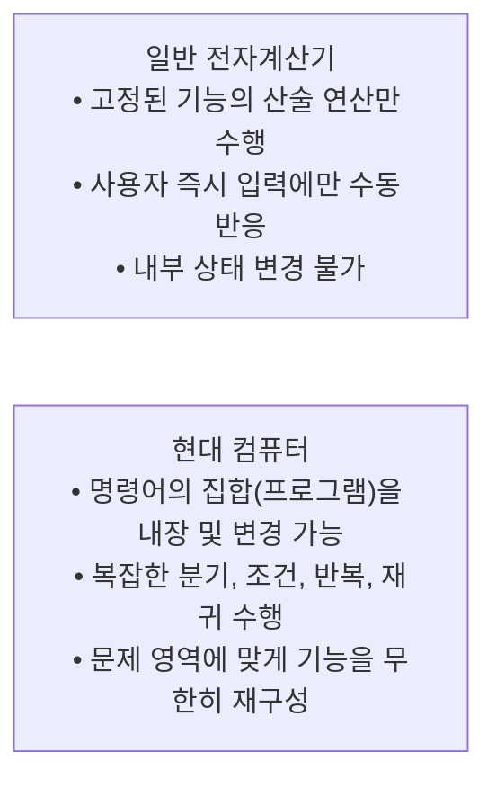
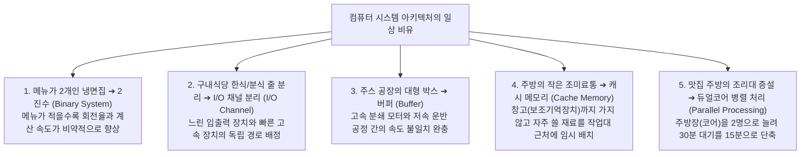
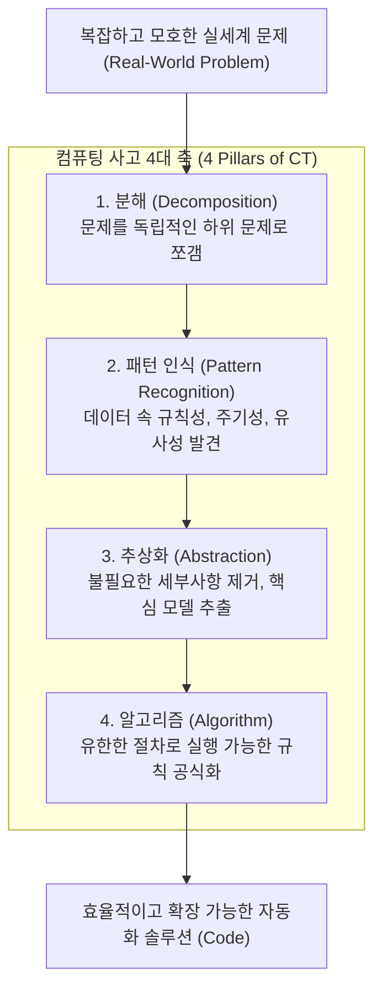

> [!abstract] 핵심 요약
> **컴퓨팅 사고(Computational Thinking, CT)**는 컴퓨터 과학의 기본 개념과 원리를 차용하여 복잡한 문제를 해결하고, 시스템을 설계하며, 인간의 사고를 구조화하는 보편적 문제 해결 패러다임이다.
> CT의 4대 핵심 축은 **분해(Decomposition), 패턴 인식(Pattern Recognition), 추상화(Abstraction), 알고리즘 설계(Algorithm)**이며, 컴퓨터 시스템의 핵심 메커니즘(캐시, 버퍼, 채널 분리, 병렬처리)은 모두 일상생활의 최적화 원리와 완벽하게 맞닿아 있다.

---

## 1. 컴퓨터 vs 일반 계산기 (Programmability의 본질)

컴퓨터가 단순한 전자계산기(Electronic Calculator)와 근본적으로 구별되는 단 하나의 이유는 **프로그래밍 가능성(Programmability)**이다.



---

## 2. 일상 속 실물 비유로 이해하는 5대 컴퓨터 아키텍처 원리

교안에서 제시하는 실생활 사례들은 컴퓨터 내부의 하드웨어/운영체제 최적화 기법과 1:1로 대응된다.



| 일상 사례 | 컴퓨터 시스템 메커니즘 | 기술적 상세 원리 및 하드웨어 구현 |
| :-- | :-- | :-- |
| **메뉴가 2개뿐인 단일 식당** | **2진수 (Binary Representation)** | 10진수($0\sim9$) 회로보다 전압의 ON($1$)/OFF($0$) 2단계 판별이 전기 노이즈에 강하고 연산 속도가 극대화됨 |
| **구내식당의 한식/분식 배식대 분리** | **입출력 채널 분리 (I/O Multiplexing)** | 저속 주변기기(키보드, 마우스)와 고속 저장장치(NVMe)가 시스템 버스를 독점하지 않도록 독립 컨트롤러 채널 구성 |
| **주스 공장의 사과 집하 박스** | **버퍼링 (Buffering / Spooling)** | CPU와 I/O 디바이스의 데이터 전송률(Data Rate) 격차를 메우기 위해 메모리 큐(Queue)에 데이터를 임시 적재 |
| **조리대 위의 작은 조미료통** | **L1/L2 캐시 (Temporal/Spatial Locality)** | 시간적/공간적 참조 국소성(Locality)을 활용하여 대용량 DRAM 접근 지연시간을 줄이기 위해 초고속 SRAM 캐시 활용 |
| **맛집 주방장 2명 채용 및 주방 증설** | **멀티코어 병렬 처리 (Dual-Core CPU)** | 단일 코어의 클록 주파수 증대(Power Wall 한계) 대신 멀티스레드/멀티코어로 동시 작업(Throughput) 배가 |

---

## 3. 컴퓨팅 사고(CT)의 4대 핵심 구성 요소



### 1) 추상화 (Abstraction)와 일반화 (Generalization)
- **개념**: 문제 해결에 불필요한 노이즈와 세부사항을 제거하고, 핵심적인 본질과 공통 속성만을 추출하여 단순화하는 작업.
- **실제 사례**: 
  - **서울 실제 지형도 vs 지하철 노선도**: 실제 지형의 굴곡, 도로망, 고도 등 불필요한 정보를 제거하고 '역 간의 연결 관계(Graph Topology)'라는 본질만 남겨 가독성을 극대화한 대표적 추상화 모델.
  - **픽토그램 / 네온사인**: 사물의 복잡한 외형을 기하학적 선과 면으로 단순화하여 직관적 의미 전달.

### 2) 분해 (Decomposition)와 분할 정복 (Divide and Conquer)
- **개념**: 거대하고 다루기 힘든 문제를 개별적으로 해결 가능한 최소 단위의 작은 하위 문제들로 쪼개는 분석 기법.
- **실제 사례**:
  - **짜장면 조리 공정 분해**: 전체 요리 과정을 [1. 재료 손질] $\rightarrow$ [2. 면 삶기] $\rightarrow$ [3. 춘장 소스 볶기] $\rightarrow$ [4. 소스 붓기 및 서빙]으로 분해하여 각 단계를 모듈화.
  - **이진 탐색(Binary Search)**: 8개의 정렬된 데이터에서 탐색 대상을 절반씩($8 \rightarrow 4 \rightarrow 2 \rightarrow 1$) 분해하여 $O(\log n)$ 시간에 해결.

### 3) 패턴 인식 (Pattern Recognition)
- **개념**: 분해된 데이터나 현상 사이에서 반복되는 규칙성, 대칭성, 경향성을 찾아내어 이미 검증된 해법을 재사용하는 과정.
- **실제 사례**:
  - **RGB 컬러 패턴**: 인간이 인식하는 수천만 가지의 색상이 모두 빛의 3원색($R, G, B$)의 세기 조합($0\sim255$)이라는 규칙성을 발견하여 디지털 이미지로 표현.
  - **요일별 방문자 통계**: 식당의 일별 방문자 수를 분석하여 일요일마다 주기적으로 피크가 발생하는 패턴을 감지하고 식자재 발주 최적화.

### 4) 알고리즘 (Algorithm)
- **개념**: 추상화된 모델과 발견된 패턴을 바탕으로, 입력이 주어졌을 때 명확하고 유한한 절차를 통해 정확한 출력을 도출하는 컴퓨터 실행 가능한 명령어 집합.

---

## 4. 실시간 컴퓨팅 사고(CT) 4단계 문제 해결 시뮬레이터

```html preview
<div style="font-family:system-ui,-apple-system,sans-serif;padding:20px;background:var(--card);color:var(--card-foreground);border:1px solid var(--border);border-radius:var(--radius)">
  <div style="font-size:16px;font-weight:700;margin-bottom:14px;color:var(--primary);display:flex;align-items:center;gap:8px">
    <span>🧩 실세계 문제에 대한 컴퓨팅 사고 4단계 분해 분석기</span>
  </div>

  <div style="margin-bottom:14px">
    <label style="font-size:12px;font-weight:600;color:var(--muted-foreground);display:block;margin-bottom:4px">분석할 실세계 문제 시나리오 선택</label>
    <select id="ctScenarioSel" style="width:100%;padding:8px;background:var(--background);color:var(--foreground);border:1px solid var(--border);border-radius:var(--radius);font-size:13px">
      <option value="subway">1. 내비게이션 최단 경로 탐색 시스템 구축</option>
      <option value="cleaning">2. 자율주행 로봇청소기 청소 알고리즘</option>
      <option value="recommend">3. OTT 동영상 플랫폼 개인 맞춤형 영화 추천</option>
    </select>
  </div>

  <div style="display:grid;grid-template-columns:1fr 1fr;gap:10px;margin-bottom:14px">
    <div style="padding:10px;background:var(--background);border:1px solid var(--border);border-radius:var(--radius)">
      <div style="font-size:11px;font-weight:700;color:var(--chart-1)">① 분해 (Decomposition)</div>
      <div id="dText" style="font-size:12px;color:var(--foreground);margin-top:4px;line-height:1.4"></div>
    </div>
    <div style="padding:10px;background:var(--background);border:1px solid var(--border);border-radius:var(--radius)">
      <div style="font-size:11px;font-weight:700;color:var(--chart-2)">② 패턴 인식 (Pattern Recognition)</div>
      <div id="pText" style="font-size:12px;color:var(--foreground);margin-top:4px;line-height:1.4"></div>
    </div>
    <div style="padding:10px;background:var(--background);border:1px solid var(--border);border-radius:var(--radius)">
      <div style="font-size:11px;font-weight:700;color:var(--chart-3)">③ 추상화 (Abstraction)</div>
      <div id="aText" style="font-size:12px;color:var(--foreground);margin-top:4px;line-height:1.4"></div>
    </div>
    <div style="padding:10px;background:var(--background);border:1px solid var(--border);border-radius:var(--radius)">
      <div style="font-size:11px;font-weight:700;color:var(--chart-4)">④ 알고리즘 (Algorithm)</div>
      <div id="alText" style="font-size:12px;color:var(--foreground);margin-top:4px;line-height:1.4"></div>
    </div>
  </div>

  <script>
    var sel = document.getElementById('ctScenarioSel');
    var dt = document.getElementById('dText');
    var pt = document.getElementById('pText');
    var at = document.getElementById('aText');
    var alt = document.getElementById('alText');

    var ctData = {
      'subway': {
        d: '전체 교통망을 [교차로/정류장], [도로 구간], [실시간 통행 속도], [환승 소요 시간]의 독립 서브 요소로 분해.',
        p: '출퇴근 시간대 정체 구간의 주기적 패턴, 특정 요일 및 기상 상태에 따른 도로 평균 주행 속도 규칙성 식별.',
        a: '도로의 실제 곡률, 건물 모양 등 불필요한 시각 정보를 제거하고 [노드(교차로)]와 가중치 [간선(소요시간)] 그래프로 모델링.',
        al: '다익스트라(Dijkstra) 또는 A* 최단 경로 탐색 알고리즘을 적용하여 출발지에서 목적지까지의 최소 비용 경로 도출.'
      },
      'cleaning': {
        d: '청소 작업을 [방 구조 스캔], [장애물 감지], [격자 격벽 탐색], [배터리 잔량 모니터링 및 충전 복귀]로 하위 분해.',
        p: '벽면 충돌 시 90도 회전, 장애물 회피 시 주변 우회 반경 등의 반복 이동 패턴 도출.',
        a: '가구의 재질이나 색상 등 비본질적 속성을 배제하고, 2차원 공간을 0(통행가능), 1(장애물)의 2D 점유 격자 그리드(Occupancy Grid)로 추상화.',
        al: '스네이크(지그재그) 완전 탐색 알고리즘과 충돌 감지 인터럽트 루틴 결합.'
      },
      'recommend': {
        d: '추천 문제를 [사용자 시청 이력 수집], [영화 장르/감독/배우 메타데이터 추출], [유사도 계산], [랭킹 정렬]로 분해.',
        p: '특정 장르(SF, 액션)를 선호하는 사용자들이 동일한 부류의 영화를 시청하는 협업 필터링 패턴 식별.',
        a: '영화의 음성, 영상 전체를 직접 비교하지 않고 평점 벡터(Vector)와 키워드 태그 행렬로 차원 축소 및 추상화.',
        al: '코사인 유사도(Cosine Similarity) 계산 알고리즘을 실행하여 상위 N개 추천 리스트 생성.'
      }
    };

    function updateCT() {
      var item = ctData[sel.value];
      dt.textContent = item.d;
      pt.textContent = item.p;
      at.textContent = item.a;
      alt.textContent = item.al;
    }

    sel.addEventListener('change', updateCT);
    updateCT();
  </script>
</div>
```
