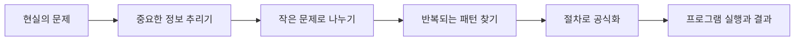

컴퓨터는 빠르게 계산하고 정확히 기억하지만, 무엇을 계산할지와 절차를 정하는 일은 사람이 해야 한다. 자료는 프로그래밍과 알고리즘을 컴퓨터에 작업을 지시하는 방법으로 소개한다.

> [!NOTE]
> 강의 순서는 컴퓨터와 인간의 차이 → 컴퓨팅 사고의 개념과 사례 → 추상화·분해·패턴인식·알고리즘이다.

---

## 1. 문제를 프로그램으로 바꾸기

프로그래밍은 문제 해결을 위한 명령어 모음을 작성하는 과정이다. 로봇청소기의 이동 경로, 내비게이션의 최단 경로, 스마트 TV의 추천은 모두 알고리즘을 실행해 결과를 내는 사례로 제시된다.



---

## 2. 컴퓨팅 사고의 네 요소

<Tabs>
  <Tab label="추상화">세부사항을 제거하고 문제에 필요한 공통 특징만 남긴다. 공통 특성을 일반화해 개념으로 만든다.</Tab>
  <Tab label="분해">복잡한 문제를 해결하기 쉬운 작은 문제로 나누고, 각 결과를 결합한다.</Tab>
  <Tab label="패턴인식">데이터를 특징별로 묶어 반복되는 규칙을 찾는다. RGB의 세 색, 수열, 요일 규칙이 사례다.</Tab>
  <Tab label="알고리즘">문제를 해결하는 일련의 절차나 방법을 공식화해 표현한다. 다음 장의 설계·분석으로 이어진다.</Tab>
</Tabs>

| 요소 | 질문 | 자료 속 사례 |
| --- | --- | --- |
| 추상화 | 무엇을 버리고 무엇을 남길까? | 코뿔소의 공통 형태 |
| 분해 | 어떤 단위로 쪼갤까? | 짜장면 만들기, 타일 붙이기 |
| 패턴인식 | 무엇이 반복될까? | RGB, 수열, 요일 |
| 알고리즘 | 어떤 순서로 실행할까? | 경로 찾기, 추천 |

```html preview
<div style="font-family:system-ui,sans-serif;padding:20px;color:var(--foreground)">
  <label for="amt" style="font-size:14px;font-weight:600">사고 과정</label>
  <div id="out" style="font-size:30px;font-weight:700;color:var(--chart-1);margin:6px 0">1단계</div>
  <input id="amt" type="range" min="1" max="4" step="1" value="1"
    style="width:100%;accent-color:var(--primary)" />
  <p style="font-size:13px;color:var(--muted-foreground)">원본 자료의 순서를 움직여 해당 단계의 핵심을 확인한다.</p>
  <script>
    var amt = document.getElementById('amt');
    var out = document.getElementById('out');
    amt.addEventListener('input', function () {
      out.textContent = Number(amt.value).toLocaleString() + '단계';
    });
  </script>
</div>
```

> [!TIP]
> 네 요소는 일회성 체크리스트가 아니라 순환한다. 분해한 데이터에서 다시 패턴을 찾고, 알고리즘을 실행한 뒤 결과를 보고 추상화를 수정할 수 있다.

<details>
<summary>학습 점검</summary>

1. 계산기와 컴퓨터의 차이는 프로그래밍 가능성이다.
2. 알고리즘은 문제를 해결하기 위한 동작을 하나로 모은 것이다.
3. 추상화와 분해는 문제를 단순화하지만, 패턴인식과 알고리즘은 반복 규칙과 실행 순서를 구체화한다.

</details>

<!-- source: 컴퓨팅 사고와 문제해결.pdf; examples and four-element definitions preserved -->