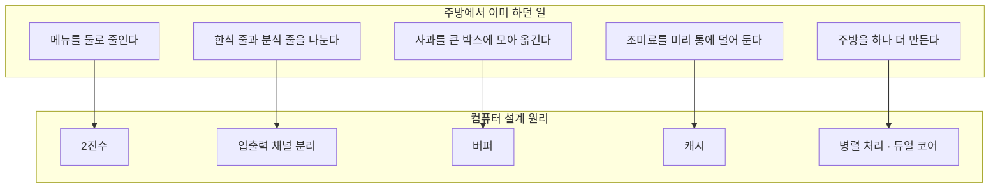
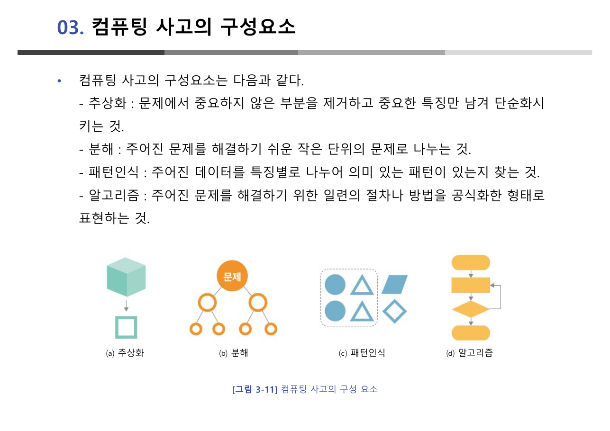
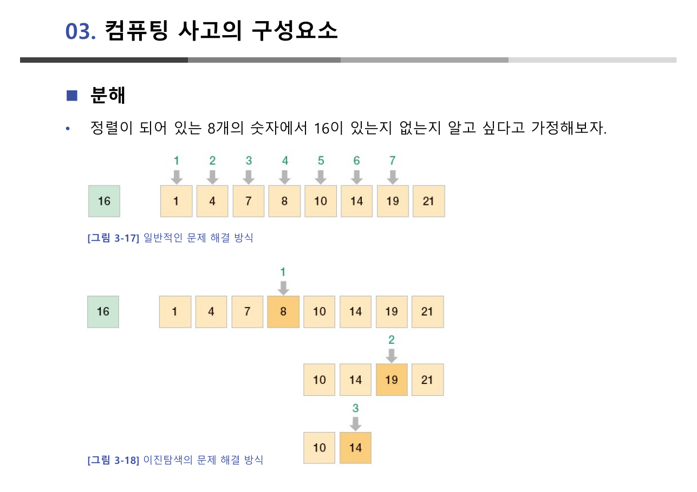
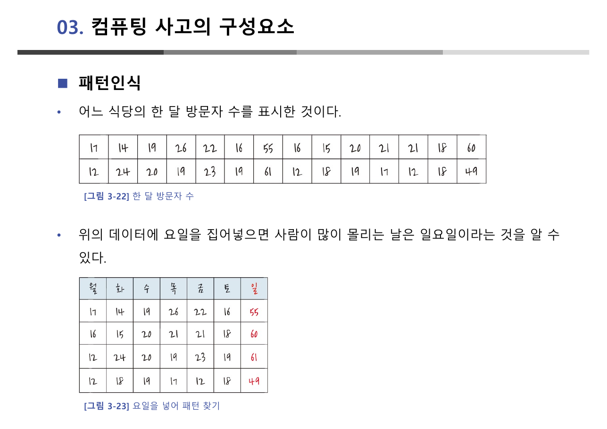
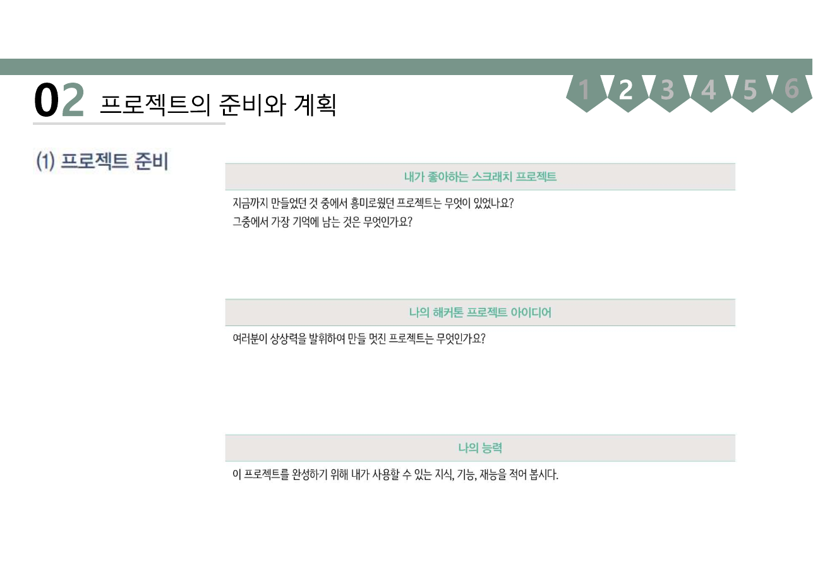
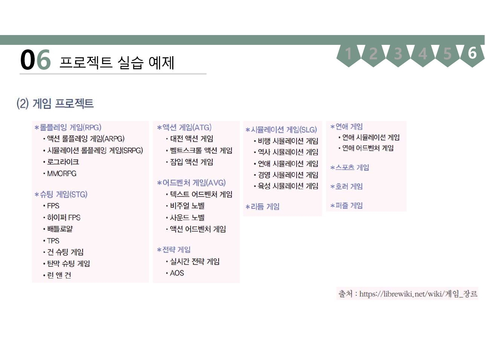

> [!abstract] 이 장은 새로운 사고법을 가르치지 않는다
> "컴퓨팅 사고"라는 이름을 처음 들으면 컴퓨터를 위해 따로 배워야 하는 낯선 사고법처럼 들린다. 그런데 원본 29쪽 중 10~14쪽은 **컴퓨터 이야기를 아예 하지 않는다.** 냉면집, 구내식당 줄서기, 주스 공장의 박스, 조미료 통, 소문난 맛집의 주방이 차례로 나온다. 그리고 각각의 끝에 2진수·채널 분리·버퍼·캐시·병렬 처리라는 이름이 붙는다.
>
> 이 장의 논지는 그러므로 **"컴퓨터처럼 생각하라"가 아니라 "당신이 이미 하고 있던 생각이 컴퓨터의 설계 원리다"** 이다. 그리고 마지막 27쪽에서 딱 한 번, 비유가 아니라 **실제 숫자 28개**로 그것을 증명한다. 이 정리는 그 증명을 중심에 놓는다.
>
> 함께 다루는 `스크래치.pdf`(15쪽)는 같은 교재의 17장 "컴퓨팅 사고 프로젝트"로, 이 사고를 **학습지 양식**으로 바꾼 자료다. 생각을 절차로 만들면 어떤 모양이 되는지를 보여준다.

---

## 프로그래밍은 계산기와 무엇이 다른가

원본은 컴퓨팅 사고를 곧바로 정의하지 않고, 먼저 계산기와 컴퓨터를 갈라놓는다(4쪽).

> 컴퓨터가 일반 계산기와 다른 점이 있다면 **'프로그래밍' 할 수 있다는 점**이다.

그리고 5쪽에서 그 의미를 비유로 확장한다 — "프로그래밍이 가능하다는 것은 **블록으로 만든 인형처럼 원하는 모양으로 다양하게 변형할 수 있다**는 의미이다." 계산기는 만들어진 대로만 쓰고, 컴퓨터는 다시 조립할 수 있다.

여기서 알고리즘의 첫 정의가 나온다(6쪽). 로봇청소기가 방의 크기를 재고 장애물을 인식하고 경로를 찾는 **전체 과정**이 알고리즘이고, 요약하면 "어떤 문제를 해결하기 위한 동작들을 하나로 모은 것"이다.

그 다음이 컴퓨팅 사고의 정의(9쪽)다.

> 컴퓨터가 인간의 문제를 해결하기 위해서는 **주어진 작업을 어떤 순서와 어떤 방법으로 풀지 결정**해야 하는데, 이렇게 문제를 해결하기 위해 논리적이고 창의적으로 생각하는 것을 '컴퓨팅 사고'라고 부른다.

원본은 이 개념을 처음 언급한 인물로 **지네트 윙(Jeannette Wing)** 박사를 슬라이드에 함께 싣는다. 정의 자체는 짧지만 안에 두 개의 물음이 들어 있다 — **어떤 순서로** 그리고 **어떤 방법으로**. 순서를 정하는 일은 [3장의 순서도와 제어 구조](./03.%20알고리즘과%20프로그래밍%20언어.md)로, 방법을 고르는 일은 이 장의 네 요소로 갈라진다.

---

## 주방에서 끌어낸 다섯 가지 설계 원리

10~14쪽은 이 장에서 가장 밀도 높은 다섯 쪽이다. 각 장면이 컴퓨터 구조의 한 개념과 정확히 대응한다.

| 원본의 장면 | 대응 개념 | 원본이 짚은 이유 |
| --- | --- | --- |
| 메뉴가 2개인 냉면집(10쪽) | **2진수** | 메뉴가 간단할수록 회전율이 좋다 |
| 구내식당의 줄서기(11쪽) | **입출력 채널의 분리** | 한식 줄과 분식 줄을 나누면 느린 쪽 때문에 빠른 쪽이 기다리지 않는다 |
| 주스 공장의 박스(12쪽) | **버퍼** | 속도가 크게 다른 두 장치 사이에 끼어 속도 차이를 완화 |
| 조미료 통(13쪽) | **캐시** | 앞으로 쓸 것이라 예상되는 것을 미리 덜어 놓음 |
| 소문난 맛집의 주방(14쪽) | **병렬 처리** | 주방을 하나 더 만들면 30분이 15분이 된다 → 듀얼 코어 |



버퍼와 캐시의 구분이 특히 잘 잡혀 있다. 둘 다 "중간에 무언가를 담아 둔다"는 점은 같지만 목적이 다르다.

- **버퍼**(주스 공장의 박스) — 두 장치의 **속도 차이를 메우기 위해** 담아 둔다. 이미 만들어진 것을 넘기기 전에 모아 두는 것이다.
- **캐시**(조미료 통) — **앞으로 쓸 것이라 예상해서** 미리 가져다 놓는다. 예측이 맞으면 창고까지 가지 않아도 된다.

> [!note] [1장](./01.%20컴퓨터의%20이해와%20정보의%20표현.md)의 주방과 이 장의 주방
> 1장 6쪽의 주방은 **컴퓨터의 부품**(주방장=CPU, 작업대=주기억장치, 창고=보조기억장치)을 설명했다. 이 장의 주방은 **운영 방식**(줄서기, 박스, 조미료 통, 주방 증설)을 설명한다. 같은 무대에서 부품 이야기와 운영 이야기를 나누어 하는 구성이다.
>
> 그래서 이 장 14쪽의 "주방을 하나 더 만든다"는 1장 30쪽의 시분할 시스템과 정확히 대비된다. 시분할은 **주방장 한 명이 시간을 쪼개는 것**이고, 병렬 처리는 **주방을 하나 더 짓는 것**이다. 겉보기 효과는 비슷하지만 자원이 늘었는지 아닌지가 다르다.

---

## 네 개의 요소 — 그중 하나만 새롭다

16쪽이 컴퓨팅 사고의 구성요소를 넷으로 정리한다.



| 요소 | 원본의 정의(16쪽) | 이 장에서 든 예 |
| --- | --- | --- |
| **추상화** | 중요하지 않은 부분을 제거하고 중요한 특징만 남겨 단순화 | 다각형 코뿔소, 지하철 노선도, 음식 픽토그램 |
| **분해** | 문제를 해결하기 쉬운 작은 단위로 나눔 | 짜장면 만들기, 타일 붙이기, 이진 탐색 |
| **패턴인식** | 데이터를 특징별로 나누어 의미 있는 패턴을 찾음 | 걷는 사람, RGB, 수열, 한 달 방문자 수 |
| **알고리즘** | 절차나 방법을 공식화한 형태로 표현 | (다음 장으로 넘김) |

### 추상화 — 지하철 노선도가 서울 지도보다 쓸모 있는 이유

17~19쪽은 추상화의 예를 셋 든다. 그중 18쪽의 **서울 지도와 지하철 노선도** 대비가 가장 강하다.

지하철 노선도는 거리도 방향도 실제와 다르다. 정확도만 따지면 서울 지도가 압도적으로 낫다. 그런데도 **지하철을 탈 때는 노선도가 낫다.** 이유는 하나다. 그 순간 필요한 정보는 "어느 역에서 갈아타는가"뿐이고, 노선도는 그 하나만 남기고 전부 버렸기 때문이다.

원본은 여기에 한 문장을 덧붙인다(17쪽) — "추상화를 통하여 만들어진 공통의 특성을 추려내어 만들어진 개념을 **일반화**라 부른다." 추상화가 하나의 대상에서 군더더기를 걷어내는 일이라면, 일반화는 여럿에서 공통점을 뽑아내는 일이다.

### 분해 — 나누는 것 자체가 답이 되는 경우

20~23쪽이 분해다. 짜장면 만들기(20쪽)와 타일 붙이기(21쪽)는 "큰 문제를 작은 문제로"라는 일반적 설명이지만, 22~23쪽에서 갑자기 구체적이 된다.

> 컴퓨터에서 전체 문제를 작은 문제로 분해하여 해결한 후 해결된 작은 문제를 결합하여 큰 문제를 해결하는 방식을 **분할정복(divide and conquer)** 이라 부른다. (22쪽)

그리고 23쪽에서 정렬된 8개 숫자 중에 16이 있는지 찾는 문제를 두 방식으로 푼다.



원본의 데이터는 `1, 4, 7, 8, 10, 14, 19, 21` 이고 찾는 값은 `16`이다. 없는 값이라는 점이 중요하다 — 없다는 사실을 확인하는 데 몇 번이 드는지를 비교하는 것이기 때문이다.

```html preview h=620px
<div style="font-family:system-ui,-apple-system,sans-serif;padding:20px;color:var(--foreground)">
  <div style="display:flex;gap:10px;flex-wrap:wrap;align-items:center;margin-bottom:14px">
    <span style="font-size:13px;font-weight:600">찾을 값</span>
    <div id="ks" style="display:flex;gap:6px;flex-wrap:wrap"></div>
  </div>

  <div style="font-size:13px;font-weight:700;margin-bottom:6px">① 앞에서부터 하나씩 — 원본 [그림 3-17]</div>
  <div id="linRow" style="display:flex;gap:6px;flex-wrap:wrap"></div>
  <div id="linMsg" style="font-size:12.5px;color:var(--muted-foreground);margin-top:6px"></div>

  <div style="font-size:13px;font-weight:700;margin:18px 0 6px">② 절반씩 잘라가며 — 원본 [그림 3-18]</div>
  <div id="binRows"></div>
  <div id="binMsg" style="font-size:12.5px;color:var(--muted-foreground);margin-top:6px"></div>

  <div id="sum" style="margin-top:16px;padding:11px 13px;background:var(--card);border:1px solid var(--border);border-radius:var(--radius);font-size:13px;line-height:1.7"></div>

  <script>
    var A = [1, 4, 7, 8, 10, 14, 19, 21];
    var key = 16;
    function box(v, mode) {
      var bg = 'transparent', bd = 'var(--border)', fg = 'var(--foreground)';
      if (mode === 'hit') { bg = 'var(--chart-1)'; bd = 'var(--chart-1)'; fg = 'var(--primary-foreground)'; }
      if (mode === 'seen') { bd = 'var(--chart-3)'; fg = 'var(--chart-3)'; }
      if (mode === 'dim') { fg = 'var(--muted-foreground)'; }
      return '<div style="min-width:38px;text-align:center;padding:7px 8px;border:1px solid ' + bd +
        ';background:' + bg + ';color:' + fg + ';border-radius:var(--radius);font-family:ui-monospace,Menlo,monospace;font-size:13.5px">' + v + '</div>';
    }
    function render() {
      document.getElementById('ks').innerHTML = [4, 10, 16, 21].map(function (v) {
        var on = v === key;
        return '<button data-k="' + v + '" style="cursor:pointer;font:inherit;font-size:12.5px;padding:4px 11px;border-radius:var(--radius);border:1px solid ' +
          (on ? 'var(--chart-1)' : 'var(--border)') + ';background:' + (on ? 'var(--chart-1)' : 'transparent') +
          ';color:' + (on ? 'var(--primary-foreground)' : 'var(--foreground)') + '">' + v + '</button>';
      }).join('');
      Array.prototype.forEach.call(document.querySelectorAll('#ks button'), function (b) {
        b.addEventListener('click', function () { key = parseInt(b.getAttribute('data-k'), 10); render(); });
      });

      // 순차 — 정렬되어 있으므로 찾는 값보다 커지면 멈춘다 (원본 그림 3-17의 화살표 개수와 같은 규칙)
      var seen = 0, found = -1;
      for (var i = 0; i < A.length; i++) {
        seen++;
        if (A[i] === key) { found = i; break; }
        if (A[i] > key) break;
      }
      document.getElementById('linRow').innerHTML = A.map(function (v, i) {
        return box(v, i === found ? 'hit' : (i < seen ? 'seen' : 'dim'));
      }).join('');
      document.getElementById('linMsg').textContent =
        seen + '번 비교' + (found >= 0 ? ' 후 찾음' : ' 후 "없다"고 판정 — 정렬되어 있으므로 ' + A[seen - 1] + ' 을 넘어서면 더 볼 필요가 없다');

      // 이진 — 원본 그림 3-18은 짝수 개일 때 뒤쪽 가운데를 고른다
      var lo = 0, hi = A.length - 1, rows = '', step = 0, bfound = -1;
      while (lo <= hi) {
        var m = Math.ceil((lo + hi) / 2);
        step++;
        rows += '<div style="display:flex;gap:6px;flex-wrap:wrap;align-items:center;margin-bottom:6px">' +
          '<span style="font-size:12px;color:var(--muted-foreground);min-width:38px">' + step + '회</span>' +
          A.map(function (v, i) {
            if (i < lo || i > hi) return box(v, 'dim');
            return box(v, i === m ? (A[m] === key ? 'hit' : 'seen') : null);
          }).join('') + '</div>';
        if (A[m] === key) { bfound = m; break; }
        if (key < A[m]) hi = m - 1; else lo = m + 1;
      }
      document.getElementById('binRows').innerHTML = rows;
      document.getElementById('binMsg').textContent =
        step + '번 비교' + (bfound >= 0 ? ' 후 찾음' : ' 후 "없다"고 판정 — 남은 구간이 비었다');

      document.getElementById('sum').innerHTML =
        '찾는 값 <b>' + key + '</b> — 하나씩 보면 <b style="color:var(--chart-3)">' + seen + '회</b>, 절반씩 자르면 <b style="color:var(--chart-1)">' + step + '회</b>.<br>' +
        '<span style="color:var(--muted-foreground)">원본 23쪽이 든 예(16을 찾는 경우)는 7회 대 3회다. ' +
        '자료가 8개일 때 3회, 16개면 4회, 1024개여도 10회 — 절반씩 자르는 일이 몇 번 가능한지가 곧 비교 횟수다.</span>';
    }
    render();
  </script>
</div>
```

> [!important] 원본 [그림 3-18]이 가운데를 고르는 방식
> 원본은 8개 중 **4번째(8)** 를 먼저 보고, 그다음 남은 `10 14 19 21` 중 **3번째(19)** 를 본 뒤, `10 14` 중 **2번째(14)** 를 본다. 즉 짝수 개가 남으면 **뒤쪽 가운데**를 고른다.
>
> 같은 강의의 [6장 이진 탐색 순서도](./06.%20탐색과%20정렬%20알고리즘.md)는 `m ← (l + h) / 2`를 쓰므로 **앞쪽 가운데**를 고른다. 둘 다 올바른 이진 탐색이고 비교 횟수의 상한도 같지만, 같은 입력에서 방문하는 원소가 달라진다. 위 인터렉티브는 원본 23쪽의 그림을 재현하기 위해 뒤쪽 가운데 규칙을 썼다.

### 패턴인식 — 이 장에서 유일하게 데이터로 증명하는 대목

24~27쪽이 패턴인식이다. 걷는 사람의 동작(24쪽), RGB(25쪽), 수열(26쪽)은 모두 "패턴이 있다"는 것을 그림으로 보여줄 뿐이다. 그런데 27쪽에서 처음으로 **실제 숫자**가 나온다.



원본 [그림 3-22]는 28개의 숫자를 그냥 늘어놓는다. 그 상태에서는 규칙이 보이지 않는다. [그림 3-23]은 **같은 숫자를 7개씩 끊어 요일을 붙인다.** 그러자 원본의 문장이 성립한다 — "사람이 많이 몰리는 날은 **일요일**이라는 것을 알 수 있다."

데이터를 하나도 바꾸지 않았다. 배열만 바꿨다. 이것이 패턴인식이 하는 일 전부다.

```html preview h=600px
<div style="font-family:system-ui,-apple-system,sans-serif;padding:20px;color:var(--foreground)">
  <div style="display:flex;gap:10px;align-items:center;flex-wrap:wrap;margin-bottom:14px">
    <span style="font-size:13px;font-weight:600">한 줄에 몇 개씩 끊을까?</span>
    <div id="wbtn" style="display:flex;gap:6px;flex-wrap:wrap"></div>
  </div>

  <div id="grid" style="overflow-x:auto"></div>
  <div id="stat" style="margin-top:14px"></div>
  <div id="say" style="margin-top:14px;padding:11px 13px;background:var(--card);border:1px solid var(--border);border-radius:var(--radius);font-size:13px;line-height:1.7"></div>

  <script>
    // 원본 27쪽 [그림 3-22]의 28개 값을 읽은 순서 그대로
    var D = [17, 14, 19, 26, 22, 16, 55, 16, 15, 20, 21, 21, 18, 60,
             12, 24, 20, 19, 23, 19, 61, 12, 18, 19, 17, 12, 18, 49];
    var DAY = ['월', '화', '수', '목', '금', '토', '일'];
    var w = 28;
    function render() {
      document.getElementById('wbtn').innerHTML = [28, 5, 6, 7, 8].map(function (v) {
        var on = v === w;
        return '<button data-w="' + v + '" style="cursor:pointer;font:inherit;font-size:12.5px;padding:4px 11px;border-radius:var(--radius);border:1px solid ' +
          (on ? 'var(--chart-1)' : 'var(--border)') + ';background:' + (on ? 'var(--chart-1)' : 'transparent') +
          ';color:' + (on ? 'var(--primary-foreground)' : 'var(--foreground)') + '">' + (v === 28 ? '한 줄로' : v + '개') + '</button>';
      }).join('');
      Array.prototype.forEach.call(document.querySelectorAll('#wbtn button'), function (b) {
        b.addEventListener('click', function () { w = parseInt(b.getAttribute('data-w'), 10); render(); });
      });

      var mx = Math.max.apply(null, D);
      var html = '<div style="display:grid;grid-template-columns:repeat(' + Math.min(w, 28) + ',minmax(34px,1fr));gap:4px;min-width:' + (Math.min(w, 28) * 38) + 'px">';
      if (w === 7) {
        html = '<div style="display:grid;grid-template-columns:repeat(7,minmax(44px,1fr));gap:4px;min-width:330px">' +
          DAY.map(function (d) {
            return '<div style="text-align:center;font-size:12px;font-weight:700;color:' + (d === '일' ? 'var(--chart-1)' : 'var(--muted-foreground)') + '">' + d + '</div>';
          }).join('');
      }
      D.forEach(function (v, i) {
        var col = i % w;
        var hot = (w === 7 && col === 6);
        var t = v / mx;
        html += '<div title="' + (i + 1) + '일차" style="text-align:center;padding:6px 2px;border-radius:var(--radius);font-family:ui-monospace,Menlo,monospace;font-size:12.5px;' +
          'border:1px solid ' + (hot ? 'var(--chart-1)' : 'var(--border)') + ';' +
          'background:' + (hot ? 'var(--chart-1)' : 'transparent') + ';' +
          'color:' + (hot ? 'var(--primary-foreground)' : (t > 0.7 ? 'var(--chart-2)' : 'var(--foreground)')) + '">' + v + '</div>';
      });
      html += '</div>';
      document.getElementById('grid').innerHTML = html;

      if (w === 7) {
        var means = DAY.map(function (d, c) {
          var s = 0, n = 0;
          for (var r = 0; r < 4; r++) { s += D[r * 7 + c]; n++; }
          return s / n;
        });
        var mm = Math.max.apply(null, means);
        document.getElementById('stat').innerHTML =
          '<div style="font-size:12.5px;font-weight:600;margin-bottom:6px">요일별 평균</div>' +
          '<div style="display:flex;gap:6px;align-items:flex-end;height:110px">' +
          means.map(function (m, c) {
            var hot = c === 6;
            return '<div style="flex:1;text-align:center">' +
              '<div style="font-size:11.5px;color:var(--muted-foreground);margin-bottom:3px">' + m.toFixed(2) + '</div>' +
              '<div style="height:' + (m / mm * 74) + 'px;background:' + (hot ? 'var(--chart-1)' : 'var(--chart-2)') + ';border-radius:3px 3px 0 0"></div>' +
              '<div style="font-size:12px;margin-top:3px;' + (hot ? 'font-weight:700;color:var(--chart-1)' : '') + '">' + DAY[c] + '</div></div>';
          }).join('') + '</div>';
        document.getElementById('say').innerHTML =
          '일요일 평균 <b style="color:var(--chart-1)">56.25명</b>, 나머지 요일은 <b>14.25 ~ 20.75명</b>. ' +
          '일요일 네 번의 값은 55·60·61·49로, 다른 어떤 요일의 최댓값(26)보다도 크다.<br>' +
          '<span style="color:var(--muted-foreground)">숫자는 하나도 바뀌지 않았다. 7개씩 끊었을 뿐이다.</span>';
      } else {
        document.getElementById('stat').innerHTML = '';
        document.getElementById('say').innerHTML =
          (w === 28
            ? '원본 [그림 3-22]의 상태다. 큰 값(55·60·61·49)이 눈에 띄기는 하지만 <b>왜</b> 큰지는 보이지 않는다.'
            : '<b>' + w + '개씩</b> 끊으면 큰 값들이 세로로 정렬되지 않는다. 주기가 맞지 않기 때문이다.') +
          '<br><span style="color:var(--muted-foreground)">7개씩 끊었을 때만 열이 맞는다 — 데이터의 주기가 7이라는 뜻이고, 그 7이 곧 요일이다.</span>';
      }
    }
    render();
  </script>
</div>
```

> [!tip] 이 인터렉티브가 원본을 넘어서는 부분 (보충 설명)
> 원본은 7개씩 끊은 결과만 보여준다. 위 도구는 5개·6개·8개로도 끊어 볼 수 있게 했는데, **7일 때만 큰 값들이 한 열에 정렬된다.** 데이터의 주기를 모르는 상태에서 패턴을 찾는다는 것은 결국 "몇으로 접어야 열이 맞는가"를 찾는 일이고, 그 답이 맞았을 때 비로소 "일요일"이라는 의미가 붙는다. 원본 데이터의 값은 그대로 사용했고, 요일별 평균은 파이썬으로 계산해 표와 대조했다.

### 알고리즘 — 이 장은 이름만 부르고 넘긴다

28쪽은 알고리즘을 "정해진 일련의 절차나 방법을 공식화한 형태로 표현한 것"이라 정의하고 곧바로 다음 장으로 넘긴다 — "알고리즘은 다음 Chapter 04에서 자세히 다룬다."

네 요소 중 셋(추상화·분해·패턴인식)은 **무엇을 볼 것인가**에 관한 것이고, 알고리즘 하나만 **어떻게 적을 것인가**에 관한 것이다. 앞의 셋으로 문제를 다듬고 나서야 적을 것이 생긴다. 그래서 장을 나눈 것이다.

---

## 생각을 절차로 만들면 학습지가 된다

`스크래치.pdf`(15쪽)는 같은 교재 17장 "컴퓨팅 사고 프로젝트"다. 앞의 29쪽이 **개념**이었다면 이쪽은 **양식**이다. 각 슬라이드가 빈칸이 있는 학습지 한 장씩으로 되어 있다.

원본 2쪽은 이 방식의 이름을 밝힌다.

> **해커톤(Hackathon)** — 해커(Hacker)와 마라톤(Marathon)의 합성어. 학습자가 스스로 자기 활동을 선택하고 계획하며 유의미한 목적적 방향으로 설정해 가는 문제 해결의 학습 방법. **계획하기 – 제작하기 – 공유하기**



15쪽 전체는 여섯 단계로 나뉜다. 슬라이드 오른쪽 상단의 1~6 표식이 현재 단계를 가리킨다.

| 단계 | 제목 | 무엇을 적게 하는가 |
| --- | --- | --- |
| 02 | 프로젝트의 준비와 계획 | 내가 좋아하는 프로젝트, 해커톤 아이디어, **나의 능력** (3쪽) |
| — | 아이디어 표현 | 포스트잇으로 전체 구조를 벽에 붙이기, 결과를 **출력 화면**으로 그리기 (5·6쪽) |
| 03 | 프로젝트 제작 | 추가 자원 찾기, 스크래치 스튜디오에 프로젝트 추가 (7쪽) |
| 04 | 프로젝트 검토와 평가 | 3~4명 피드백 팀, 검토 학습지, 인터뷰 그룹 평가표 (8·11쪽) |
| 05 | 프로젝트의 발표와 공유 | 디자인 저널 돌아보기, 다음에 만들고 싶은 것 (13쪽) |
| 06 | 프로젝트 실습 예제 | 재난·사고 예방 주제, 게임 장르 분류 (14·15쪽) |

주목할 곳은 **6쪽**이다.

> 알고리즘을 **순서도로 표현하듯이** 프로젝트의 결과를 **출력 화면**으로 나타내면 아이디어가 훨씬 효과적으로 드러난다.

이 한 문장이 앞 29쪽과 [3장](./03.%20알고리즘과%20프로그래밍%20언어.md)을 잇는다. 순서도가 알고리즘의 추상화이듯, 출력 화면 스케치는 프로젝트의 추상화다. 둘 다 **만들기 전에 결과를 미리 그려보는 일**이다.



14쪽과 15쪽은 주제를 고르지 못한 학습자를 위한 목록이다. 14쪽은 재난·사고 예방(손가락 끼임, 어두운 곳에서 넘어짐, 학교 안전사고, 교통사고, 지진, 태풍·홍수)을 각각 두세 개의 Case로 쪼개 놓았는데, **이 쪼개기 자체가 20쪽에서 배운 분해**다. 15쪽은 게임을 RPG·슈팅·액션·어드벤처·전략·시뮬레이션·리듬·연애·스포츠·호러·퍼즐로 분류하고 출처(librewiki)를 밝혔다 — **이쪽은 24쪽에서 배운 패턴인식**이다.

> [!note] 이 자료의 파일 이름과 내용
> 파일 이름은 `스크래치.pdf`이지만 **스크래치 블록의 사용법은 한 장도 나오지 않는다.** 스크래치 3.0 교재의 17장이라는 출처(PDF 메타데이터의 `스크래치 3.0 PPT -17장-컴퓨팅 사고 프로젝트`)만 남아 있고, 내용은 전적으로 프로젝트 진행 절차다. 블록 코딩 자체는 이 강의에서 [8장 앱 인벤터](./08.%20앱%20인벤터%20기초%20프로젝트.md)가 담당한다.

---

## 정리

> [!tip] 이 장의 골격
>
> 1. **컴퓨팅 사고는 새 사고법이 아니다.** 냉면집·구내식당·주스 공장·조미료 통·맛집 주방이 각각 2진수·채널 분리·버퍼·캐시·병렬 처리에 대응한다(10~14쪽). 이름이 붙기 전에 이미 하고 있던 판단들이다.
> 2. **네 요소 중 셋은 보는 법, 하나는 적는 법이다.** 추상화·분해·패턴인식으로 문제를 다듬고, 알고리즘으로 적는다. 적는 법은 [3장](./03.%20알고리즘과%20프로그래밍%20언어.md)에 넘긴다.
> 3. **분해의 끝에 분할정복과 이진 탐색이 있다.** 8개에서 16을 찾을 때 7회 대 3회(23쪽). 이 예가 [6장](./06.%20탐색과%20정렬%20알고리즘.md)에서 순서도와 코드로 되돌아온다.
> 4. **27쪽이 이 장의 증명이다.** 28개 숫자를 7로 접으면 일요일이 드러난다. 데이터를 바꾸지 않고 배열만 바꾸는 것 — 그것이 패턴인식이다.
> 5. **스크래치 15쪽은 이 사고를 양식으로 만든 것이다.** 계획–제작–공유의 여섯 단계와 빈칸이 있는 학습지. 6쪽의 "출력 화면으로 나타내기"가 순서도와 같은 역할을 한다.

다음 장은 이 장이 미뤄 둔 **알고리즘을 실제로 적는 방법** — 자연어·순서도·의사 코드·프로그래밍 언어 네 가지와, 적어 놓은 알고리즘 중 어느 것이 더 나은지 재는 기준을 다룬다.

---

### 근거 자료

강의 원본 두 편에 근거한다.

- `컴퓨팅 사고와 문제해결.pdf`(29쪽, 한빛아카데미 Chapter 03) — 인용한 슬라이드는 16쪽(구성 요소), 23쪽(순차·이진 탐색 비교), 27쪽(한 달 방문자 수)이다.
- `스크래치.pdf`(15쪽, 같은 계열 교재 17장 "컴퓨팅 사고 프로젝트") — 인용한 슬라이드는 3쪽(프로젝트 준비 학습지), 15쪽(게임 장르 분류)이다. 이 자료는 1·3·4·11~15쪽이 텍스트가 전혀 추출되지 않는 이미지 슬라이드여서 렌더 이미지를 직접 확인해 정리했다.

인터렉티브에 사용한 수치는 모두 원본 값 그대로다. 탐색 비교는 23쪽의 배열 `1 4 7 8 10 14 19 21`과 찾는 값 16을 쓰고, 원본 [그림 3-18]이 뒤쪽 가운데를 고르는 규칙을 따라 8 → 19 → 14의 방문 순서를 그대로 재현했다(파이썬으로 대조). 방문자 데이터 28개는 [그림 3-22]에서 읽은 순서 그대로이며, 7개씩 끊었을 때 [그림 3-23]의 4주 × 7일 표와 일치함을 확인했고 요일별 평균(일요일 56.25, 나머지 14.25~20.75)도 파이썬으로 계산했다.

이 두 자료에서는 명백한 오탈자를 발견하지 못했다. 다만 원본 [그림 3-18]의 가운데 선택 규칙이 같은 강의 [6장](./06.%20탐색과%20정렬%20알고리즘.md)의 순서도와 다르다는 점을 본문에 기록해 두었다.
