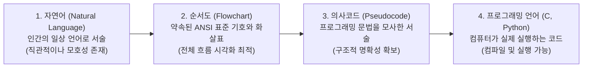
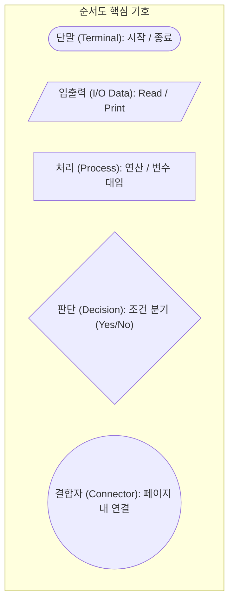

> [!abstract] 핵심 요약
> **알고리즘(Algorithm)**은 문제를 해결하기 위한 일련의 명확한 처리 절차를 의미한다. 
> 알고리즘은 **자연어 $\rightarrow$ 순서도(Flowchart) $\rightarrow$ 의사코드(Pseudocode) $\rightarrow$ 소스 코드(Programming Language)**로 구체화되며, 모든 복잡한 소프트웨어 로직은 **순차(Sequence), 선택(Selection), 반복(Iteration)**의 3대 제어 구조의 조합으로 완전히 표현될 수 있다.

---

## 1. 알고리즘의 4대 표현 기법 비교



---

## 2. ANSI 표준 순서도(Flowchart) 기호 체계



| 기호 명칭 | 형상 | 주 용도 및 기능 설명 | 표준 표현 예시 |
| :-- | :-- | :-- | :-- |
| **단말 (Terminal)** | 타원 / 둥근 사각형 | 알고리즘의 **시작(Start)**과 **종료(End)**를 나타냄 | `Start`, `End` |
| **입출력 (I/O Data)** | 평행사변형 | 외부로부터의 데이터 입력(`Read`) 및 화면 출력(`Print`) | `Input N`, `Print SUM` |
| **처리 (Process)** | 직사각형 | 산술 연산, 데이터 이동, 변수 초기화 및 값 대입 | `SUM = SUM + i`, `i = i + 1` |
| **판단 (Decision)** | 마름모 | 조건식을 평가하여 참(`Yes`/`True`)과 거짓(`No`/`False`)으로 흐름 분기 | `i <= N ?`, `A > B ?` |
| **결합자 (Connector)** | 작은 원 | 복잡한 순서도에서 선이 교차하지 않도록 동일 지점을 연결 | `(A)`, `(1)` |

---

## 3. 알고리즘의 3대 기본 제어 구조 (Control Structures)

<Tabs>
  <Tab label="1. 순차 구조 (Sequence)">
    <strong>명령어가 위에서 아래로 차례대로 실행되는 구조</strong>
    ```mermaid
    flowchart TD
        A["Step 1: x = 10"] --> B["Step 2: y = 20"] --> C["Step 3: sum = x + y"]
    ```
  </Tab>
  <Tab label="2. 선택/분기 구조 (Selection)">
    <strong>조건의 진위 여부에 따라 실행 경로를 다르게 선택하는 구조</strong>
    ```mermaid
    flowchart TD
        COND{"score >= 80 ?"}
        COND -- Yes --> PASS["result = 'Pass'"]
        COND -- No --> FAIL["result = 'Fail'"]
        PASS --> END_IF["다음 단계"]
        FAIL --> END_IF
    ```
  </Tab>
  <Tab label="3. 반복 구조 (Iteration / Loop)">
    <strong>조건이 만족되는 동안 특정 처리 블록을 반복 실행하는 구조</strong>
    ```mermaid
    flowchart TD
        INIT["i = 1, sum = 0"] --> LOOP_COND{"i <= N ?"}
        LOOP_COND -- Yes --> ACC["sum = sum + i<br/>i = i + 1"]
        ACC --> LOOP_COND
        LOOP_COND -- No --> PRINT["Print sum"]
    ```
  </Tab>
</Tabs>

---

## 4. 실전 기본 알고리즘 패턴 4선

### 1) 두 변수의 값 교환 (Swap with Temporary Variable)
임시 변수 $Z$를 매개체로 두 변수 $X, Y$의 값을 안전하게 맞바꾼다.
```text
Algorithm Swap(X, Y)
  Z = X     // X의 기존 값을 임시 저장
  X = Y     // Y의 값을 X에 덮어씀
  Y = Z     // 보관해둔 원래 X의 값을 Y에 저장
```

### 2) 1부터 $N$까지의 합 누적 ($\sum_{i=1}^N i$)
```text
Algorithm SumAccumulate(N)
  SUM = 0
  i = 1
  While i <= N Do
    SUM = SUM + i
    i = i + 1
  End While
  Print SUM
```

### 3) $N$개 수 중 최댓값 탐색 (Max Finding)
```text
Algorithm FindMax(A, N)
  MAX = A[0]
  For i = 1 To N - 1 Do
    If A[i] > MAX Then
      MAX = A[i]
    End If
  End For
  Return MAX
```

---

## 5. 실시간 1~N 누적합 순서도 단계별 실행기

```html preview
<div style="font-family:system-ui,-apple-system,sans-serif;padding:20px;background:var(--card);color:var(--card-foreground);border:1px solid var(--border);border-radius:var(--radius)">
  <div style="font-size:16px;font-weight:700;margin-bottom:14px;color:var(--primary);display:flex;align-items:center;gap:8px">
    <span>🔄 1부터 N까지 누적합 알고리즘 실시간 트레이스 시뮬레이터</span>
  </div>

  <div style="display:flex;gap:10px;align-items:center;margin-bottom:14px">
    <label style="font-size:12px;font-weight:600;color:var(--muted-foreground)">목표 N 값 설정 (1~20):</label>
    <input id="nLimit" type="number" min="1" max="20" value="5" style="width:80px;padding:6px;background:var(--background);color:var(--foreground);border:1px solid var(--border);border-radius:var(--radius);font-weight:700" />
    <button id="runBtn" style="padding:6px 14px;background:var(--primary);color:#fff;border:none;border-radius:var(--radius);font-size:12px;font-weight:700;cursor:pointer">단계별 실행 (Trace)</button>
  </div>

  <div style="display:grid;grid-template-columns:1fr 1fr;gap:12px;margin-bottom:12px">
    <div style="padding:10px;background:var(--background);border:1px solid var(--border);border-radius:var(--radius)">
      <div style="font-size:11px;color:var(--muted-foreground)">현재 루프 카운터 (i)</div>
      <div id="iDisplay" style="font-size:18px;font-weight:800;color:var(--chart-1);margin-top:2px">1</div>
    </div>
    <div style="padding:10px;background:var(--background);border:1px solid var(--border);border-radius:var(--radius)">
      <div style="font-size:11px;color:var(--muted-foreground)">현재 누적합 (SUM)</div>
      <div id="sumDisplay" style="font-size:18px;font-weight:800;color:var(--chart-2);margin-top:2px">0</div>
    </div>
  </div>

  <div style="background:var(--background);padding:12px;border:1px solid var(--border);border-radius:var(--radius);max-height:160px;overflow-y:auto">
    <div style="font-size:11px;font-weight:700;color:var(--primary);margin-bottom:6px">메모리 상태 트레이스 테이블:</div>
    <div id="traceLog" style="font-family:monospace;font-size:11px;line-height:1.6;color:var(--foreground);white-space:pre-wrap"></div>
  </div>

  <script>
    var nIn = document.getElementById('nLimit');
    var btn = document.getElementById('runBtn');
    var iOut = document.getElementById('iDisplay');
    var sumOut = document.getElementById('sumDisplay');
    var log = document.getElementById('traceLog');

    function simulate() {
      var n = parseInt(nIn.value) || 5;
      var sum = 0;
      var lines = ["[초기화] SUM = 0, i = 1, N = " + n];
      
      for (var i = 1; i <= n; i++) {
        var prevSum = sum;
        sum += i;
        lines.push("[Loop " + i + "] Condition(i <= " + n + "): Yes ➔ SUM = " + prevSum + " + " + i + " = " + sum + ", Next i = " + (i + 1));
      }
      lines.push("[종료] Condition(i <= " + n + "): No (i=" + (n + 1) + ") ➔ 반복 탈출, 최종 출력 SUM = " + sum);

      iOut.textContent = n + 1;
      sumOut.textContent = sum;
      log.textContent = lines.join("\\n");
    }

    btn.addEventListener('click', simulate);
    nIn.addEventListener('input', simulate);
    simulate();
  </script>
</div>
```
