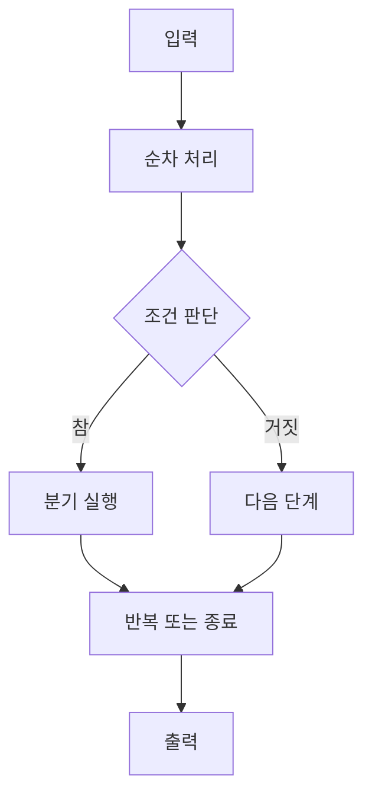

알고리즘은 주어진 문제를 해결하는 방법과 절차를 기술한 것이다. 자료는 자연어·순서도·의사 코드·프로그래밍 언어라는 네 표현을 거쳐 실제 실행으로 옮기는 흐름을 제시한다.

> [!IMPORTANT]
> 순서도작성_예와 알고리즘연습 자료는 텍스트 추출이 희소해 제목과 절차를 과장하지 않았다. 원본에 보이는 순서도 연습은 이 노트의 구조·분기·반복 점검으로만 일반화했다.

---

## 1. 알고리즘을 표현하고 조건을 확인하기

- 자연어: 사람이 읽는 일상 언어.
- 순서도: 약속된 기호와 선으로 전체 흐름을 한눈에 표현.
- 의사 코드: 프로그래밍 언어를 흉내 내어 구현으로 옮기기 쉬운 표현.
- 프로그래밍 언어: 컴퓨터에 작업을 지시하는 실제 언어.

알고리즘은 **입력**, **출력**, **유한성**, **명확성**, **수행 가능성**을 가져야 한다.



<Tabs>
  <Tab label="설계">현재 상태와 목표 상태를 명확히 정하고 순차·선택·반복 구조를 배치한다.</Tab>
  <Tab label="분석">여러 해법을 비교해 실행 시간과 기억 공간이 작은 방법을 선택한다.</Tab>
  <Tab label="표현">자연어에서 순서도·의사 코드·프로그래밍 언어로 점차 정밀하게 바꾼다.</Tab>
</Tabs>

---

## 2. 시간·공간 복잡도

자료는 실제 실행 시간을 직접 재기보다 실행문이 몇 번 수행되는지로 시간 복잡도를 설명한다. 빅 오 표기에서 O(n)은 입력 크기에 비례하고 O(n²)은 제곱으로 증가하므로, 같은 문제라면 O(n)이 더 좋은 성장률을 갖는다. 공간 복잡도는 문제 해결에 필요한 기억 공간을 측정한다.

| 분석 축 | 질문 | 예 |
| --- | --- | --- |
| 시간 | 입력이 커질 때 실행 횟수가 얼마나 늘까? | O(n), O(n²) |
| 공간 | 저장 공간이 얼마나 필요할까? | 합계 저장 방식 비교 |

```html preview
<div style="font-family:system-ui,sans-serif;padding:20px;color:var(--foreground)">
  <label for="amt" style="font-size:14px;font-weight:600">강의 단계</label>
  <div id="out" style="font-size:30px;font-weight:700;color:var(--chart-1);margin:6px 0">1단계</div>
  <input id="amt" type="range" min="1" max="4" step="1" value="1"
    style="width:100%;accent-color:var(--primary)" />
  <p style="font-size:13px;color:var(--muted-foreground)">원본 자료의 순서를 움직여 해당 단계의 핵심을 확인한다.</p>
  <script>
    var amt = document.getElementById('amt');
    var out = document.getElementById('out');
    amt.addEventListener('input', function () {
      out.textContent = Number(amt.value).toLocaleString() + '단계';
    });
  </script>
</div>
```

> [!CAUTION]
> “빠르다”는 한 번의 실행 시간만 뜻하지 않는다. 자료의 정의처럼 입력 크기에 따른 증가율과 사용하는 공간을 함께 봐야 한다.

---

## 3. 프로그래밍 언어와 번역기

컴파일러는 소스코드 전체를 기계어로 번역한 다음 실행하고, 인터프리터는 소스코드를 한 행씩 번역하며 실행한다. 자료는 C++를 객체지향 언어의 예로, Java와 JavaScript를 번역 방식 비교의 예로 든다.

<details>
<summary>문제 해결 절차</summary>

문제 이해 → 해결 방법 설계 → 알고리즘 표현 → 프로그래밍 언어로 구현 → 실행·검증 → 결과와 오류 수정의 순서로 정리한다.

</details>

<!-- source: Chapter 04. 알고리즘과 프로그래밍 언어.pdf and sparse flowchart practice decks -->