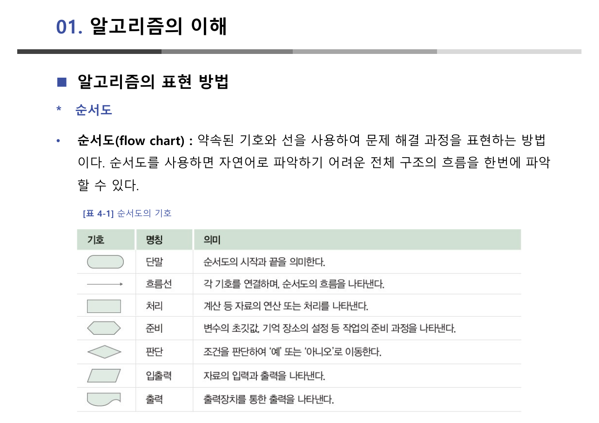
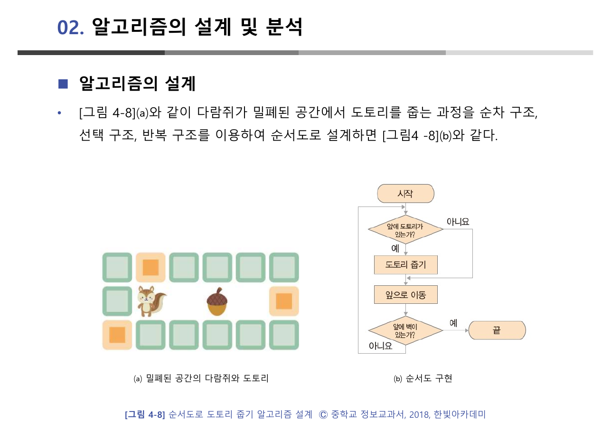
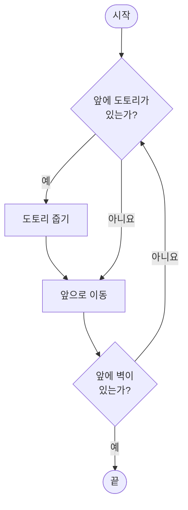
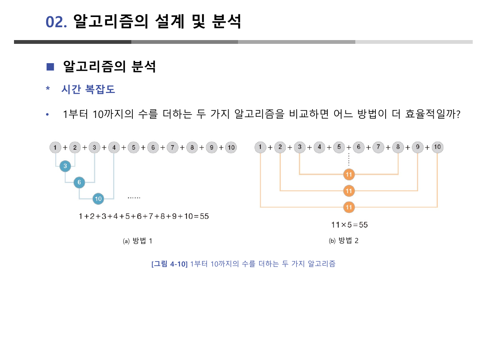
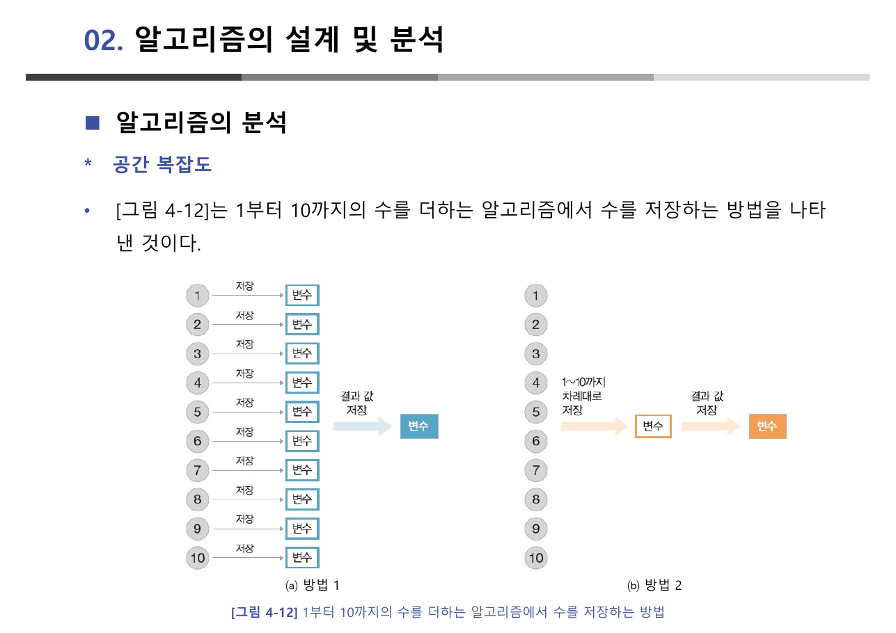
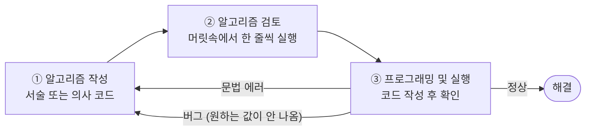
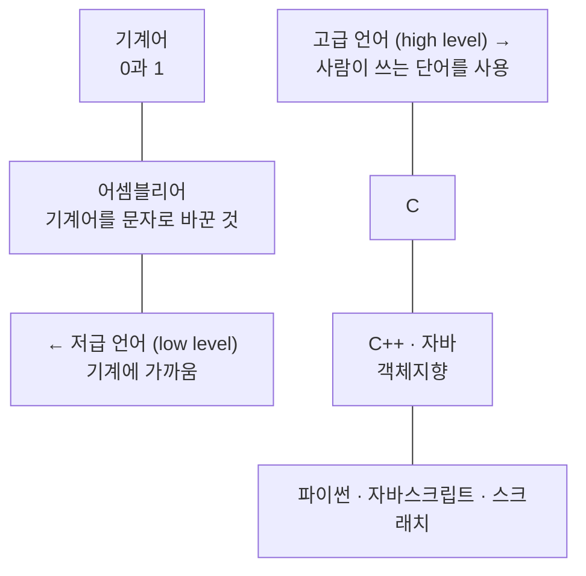
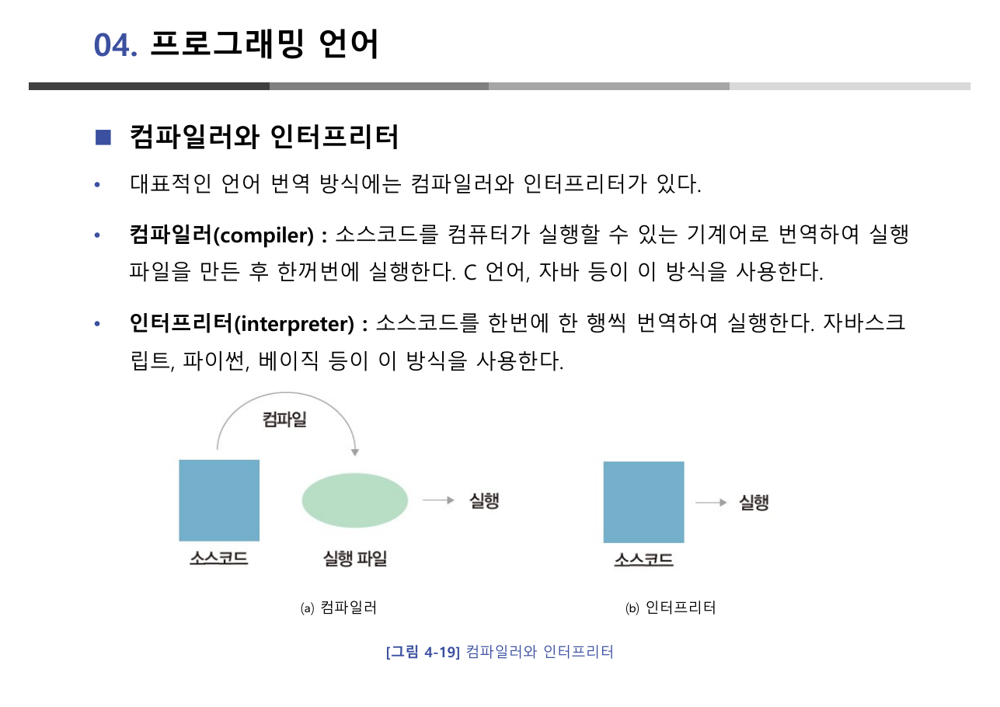

> [!abstract] 이 장의 축은 "번역"이다
> [2장](./02.%20컴퓨팅%20사고와%20문제%20해결.md)은 알고리즘을 정의만 하고 넘겼다. 이 장은 그것을 받아 **하나의 알고리즘을 네 번 옮겨 적는다.** X와 Y의 값을 Z를 이용해 맞바꾸는 다섯 줄짜리 절차가 6쪽에서 자연어로, 8쪽에서 순서도로, 9쪽에서 의사 코드로 나타나고, 10쪽에서 "의사 코드를 작성하면 특정한 프로그래밍 언어로 쉽게 변환할 수 있다"는 문장으로 끝난다.
>
> 네 번 옮겨 적을 수 있다면 **어느 것으로 적을지는 선택**이 된다. 그리고 선택이 생기면 곧바로 다음 물음이 따라온다 — **어느 것이 더 나은가.** 2절(14~24쪽)이 그 물음에 시간 복잡도와 공간 복잡도로 답한다. 그런데 이 대목에서 원본이 같은 라벨을 서로 다른 두 쌍의 알고리즘에 붙여 놓아 혼동이 생긴다. 그 어긋남이 이 장에서 가장 주의 깊게 읽어야 할 곳이다.

---

## 같은 다섯 줄을 네 가지 언어로

5쪽이 표현 방법 네 가지를 나열한다 — **자연어, 순서도, 의사 코드, 프로그래밍 언어**. 그리고 6~10쪽이 같은 예제로 넷을 차례로 보인다.

원본이 고른 예제는 **Z를 사용하여 X와 Y의 값을 바꾸는 알고리즘**이다. 초깃값은 X=3, Y=5다.

| 표현 | 원본의 서술 | 특징 |
| --- | --- | --- |
| **자연어**(6쪽) | "X의 값을 Z에 대입한다. Y의 값을 X에 대입한다. Z의 값을 Y에 대입한다." | 누구나 읽지만, 문장마다 해석의 여지가 남는다 |
| **순서도**(8쪽) | 같은 절차를 기호와 화살표로 | "전체 구조의 흐름을 한번에 파악"할 수 있다 |
| **의사 코드**(9쪽) | `START / X=3, Y=5 / Z=X / X=Y / Y=Z / PRINT X, Y / END` | 프로그래밍 언어를 흉내 낸 서술 |
| **프로그래밍 언어**(10쪽) | (원본은 코드를 싣지 않고 정의만) | 컴퓨터에게 실제로 지시하는 언어 |

원본은 순서도의 장단점을 균형 있게 적어 두었다(8쪽) — 흐름을 빠르게 파악할 수 있다는 장점과 **"복잡한 프로그램을 순서도로 작성하기 까다롭다"** 는 단점이다. 실제로 [4장의 실습](./04.%20순서도%20작성%20실습.md)에서 조건이 두 개만 겹쳐도 순서도가 급격히 커지는 것을 확인하게 된다.

> [!important] 이 예제가 왜 하필 "값 바꾸기"인가
> 세 번의 대입으로 두 값을 맞바꾸는 이 절차는 **Z가 없으면 실패한다.** 원본은 여기서 그 사실을 말하지 않고 정답만 보여주지만, [4장 순서도 실습 10쪽](./04.%20순서도%20작성%20실습.md)이 정확히 **Z 없이 시도했을 때 두 값이 모두 같아져 버리는 과정**을 한 단계씩 보여준다. 그리고 [7장 함수 7쪽](./07.%20C%20언어의%20변수·연산자·제어문·함수.md)에서는 같은 실패가 C의 매개변수 전달 방식 때문에 다시 나타난다.
>
> 즉 이 다섯 줄은 이 강의 전체에서 세 번 등장하는 예제다. 3장에서는 정답으로, 4장에서는 실패 사례로, 7장에서는 함수 경계를 넘을 때의 함정으로.

### 순서도의 기호는 약속이다

7쪽 [표 4-1]이 순서도 기호를 정리한다.



| 기호 | 이름 | 뜻 |
| --- | --- | --- |
| 둥근 모서리 | **단말** | 시작과 끝 |
| 화살표 | **흐름선** | 처리의 흐름 |
| 직사각형 | **처리** | 계산·대입 |
| 사다리꼴에 가까운 도형 | **준비** | 반복의 초기 설정 |
| 마름모 | **판단** | 조건에 따라 갈라짐 |
| 평행사변형 | **입출력** | 자료의 입력과 출력 |
| 물결 밑변 도형 | **출력** | 서류·화면 출력 |

이 일곱 개가 [4장](./04.%20순서도%20작성%20실습.md)·[5장](./05.%20배열%20위의%20기본%20알고리즘.md)·[6장](./06.%20탐색과%20정렬%20알고리즘.md)에서 쓰이는 어휘 전부다. 특히 **준비 기호**는 반복 구조에서만 쓰이는데, "i를 0부터 n−1까지" 같은 반복 범위 선언이 여기 들어간다.

### 알고리즘이 되기 위한 다섯 가지 조건

11쪽은 알고리즘의 조건을 다섯 개로 정리한다. 이 목록은 짧지만 각 항목이 서로 다른 종류의 요구다.

| 조건 | 원본의 서술 | 무엇을 배제하는가 |
| --- | --- | --- |
| **입력** | 입력되는 자료가 **0개 이상** 존재 | (없어도 된다 — 예: 원주율 계산) |
| **출력** | 결과 값이 **1개 이상** 나온다 | 아무것도 내놓지 않는 절차 |
| **유한성** | 알고리즘은 **종료**되어야 한다 | 무한 루프 |
| **명확성** | 명령이 모호하지 않아야 한다 | "적당히 섞는다" 같은 지시 |
| **수행 가능성** | 명령이 수행 가능해야 한다 | "가장 큰 소수를 구한다" 같은 지시 |

입력이 **0개 이상**인데 출력은 **1개 이상**이라는 비대칭이 눈에 띈다. 아무것도 받지 않는 알고리즘은 있어도, 아무것도 내놓지 않는 알고리즘은 없다. 12쪽의 레시피 비유가 이것을 받는다 — **알고리즘이 레시피이고, 프로그래밍이 조리하는 과정이며, 완성된 요리가 프로그램**이다. 레시피는 요리를 내놓기 위해 존재한다.

---

## 세 개의 제어 구조로 다람쥐를 움직이기

15쪽은 알고리즘의 명령 순서를 결정하는 **제어 구조**를 셋으로 정리한다 — **순차 구조, 선택 구조, 반복 구조**. 그리고 16쪽에서 셋을 한꺼번에 쓰는 예를 든다.



밀폐된 공간에 다람쥐와 도토리가 흩어져 있다. 다람쥐는 앞으로만 이동한다. 원본 [그림 4-8](b)의 순서도는 다음과 같이 읽힌다.



세 구조가 어디에 있는지 짚어 두면 이렇다.

- **순차** — `도토리 줍기` → `앞으로 이동`. 위에서 아래로 한 번씩.
- **선택** — `앞에 도토리가 있는가?`. 예면 줍고, 아니면 건너뛴다. 두 갈래가 다시 하나로 합쳐진다.
- **반복** — `앞에 벽이 있는가?`가 아니요일 때 위로 돌아가는 화살표. 이 되돌림이 반복을 만든다.

주목할 점은 **반복의 조건이 "벽"** 이라는 것이다. 몇 번 반복할지 미리 알 수 없고, 벽에 닿아야 끝난다. [4장 반복 구조](./04.%20순서도%20작성%20실습.md)의 분류로 말하면 횟수가 정해진 반복이 아니라 조건이 만족될 때까지 도는 반복이다.

---

## 어느 알고리즘이 더 나은가 — 그리고 원본의 라벨 혼동

17쪽부터가 이 장의 두 번째 축이다. 원본은 내비게이션 두 개를 나란히 놓고(17쪽) 묻는다. 같은 출발지와 도착지인데 왜 서로 다른 경로를 알려주는가. 그리고 18쪽이 답한다.

> 프로그램을 실행하여 결과가 나올 때까지의 **실행 시간이 짧고** 컴퓨팅 기기의 **기억 장소를 적게 사용**하는 것을 효율적인 알고리즘이라고 한다.

두 개의 잣대가 여기서 나온다 — **시간 복잡도**와 **공간 복잡도**.

### 시간 — 1부터 10까지 더하는 두 방법

19쪽은 시간 복잡도를 실용적으로 정의한다. "실제 컴퓨터의 실행 시간을 측정하기는 어렵기 때문에 **알고리즘의 실행문이 몇 번 실행되는지 횟수**를 표시하는 방법을 사용한다." 시계 대신 횟수를 센다.



- **방법 1** — `1+2=3`, `3+3=6`, `6+4=10` … 앞에서부터 하나씩 더한다. 원본은 이 방법의 덧셈 횟수를 **9회**로 센다.
- **방법 2** — `1+10`, `2+9`, `3+8`, `4+7`, `5+6`. 다섯 쌍이 모두 **11**이 되므로 `11 × 5 = 55`. 원본은 이 방법의 곱셈 횟수를 **1회**로 센다.

### 공간 — 그런데 여기서 "방법 1·2"의 뜻이 바뀐다



23쪽 [그림 4-12]도 **방법 1**과 **방법 2**라는 같은 이름을 쓴다. 그런데 내용이 다르다.

- **[그림 4-12] 방법 1** — 1부터 10까지를 각각 별도의 변수 `su1`~`su10`에 담고 `hap`을 따로 둔다. **변수 11개**.
- **[그림 4-12] 방법 2** — `hap`에 계속 누적하고 `i`로 세어 나간다. **변수 2개**.

> [!caution] 원본 20쪽과 23쪽의 "방법 1·방법 2"는 서로 다른 것을 가리킨다
> 20쪽의 두 방법은 **더하는 순서**에 관한 것(하나씩 vs 짝지어)이고, 23쪽의 두 방법은 **값을 어디에 담는가**에 관한 것(변수 11개 vs 2개)이다. 두 축은 서로 독립이어서, 20쪽의 방법 2를 쓰면서 23쪽의 방법 1처럼 저장할 수도 있다.
>
> 그런데 원본은 두 그림에 같은 라벨을 붙이고 23쪽 본문에서 "1부터 10까지의 수를 더하는 알고리즘에서 수를 저장하는 방법"이라고만 적어, **20쪽의 두 알고리즘을 각각 저장 방식까지 포함해 이어 붙인 것처럼** 읽힌다. 실제로는 그렇지 않다.
>
> 아래 인터렉티브는 두 축을 분리해 각각 고를 수 있게 했다. 원본의 수치(덧셈 9회, 곱셈 1회, 변수 11개, 변수 2개)는 그대로 쓰되 조합을 자유롭게 바꿔 본다.

```html preview h=600px
<div style="font-family:system-ui,-apple-system,sans-serif;padding:20px;color:var(--foreground)">
  <div style="display:flex;gap:22px;flex-wrap:wrap;margin-bottom:14px">
    <div style="flex:1;min-width:220px">
      <div style="font-size:12.5px;font-weight:700;margin-bottom:6px">더하는 순서 <span style="font-weight:400;color:var(--muted-foreground)">(원본 20쪽)</span></div>
      <div id="tbtn" style="display:flex;gap:6px;flex-wrap:wrap"></div>
    </div>
    <div style="flex:1;min-width:220px">
      <div style="font-size:12.5px;font-weight:700;margin-bottom:6px">값을 담는 방식 <span style="font-weight:400;color:var(--muted-foreground)">(원본 23쪽)</span></div>
      <div id="sbtn" style="display:flex;gap:6px;flex-wrap:wrap"></div>
    </div>
  </div>

  <div style="margin-bottom:12px">
    <label for="nn" style="font-size:12.5px;font-weight:600">더할 마지막 수 n = <span id="nv" style="color:var(--chart-1);font-weight:700">10</span></label>
    <input id="nn" type="range" min="2" max="100" step="2" value="10" style="width:100%;accent-color:var(--primary)" />
  </div>

  <div style="display:flex;gap:14px;flex-wrap:wrap">
    <div style="flex:1;min-width:200px;border:1px solid var(--border);border-radius:var(--radius);padding:12px 14px;background:var(--card)">
      <div style="font-size:12px;color:var(--muted-foreground)">연산 횟수 (시간)</div>
      <div id="ops" style="font-size:30px;font-weight:800;color:var(--chart-1);margin:4px 0"></div>
      <div id="opsWhy" style="font-size:12.5px;line-height:1.6"></div>
    </div>
    <div style="flex:1;min-width:200px;border:1px solid var(--border);border-radius:var(--radius);padding:12px 14px;background:var(--card)">
      <div style="font-size:12px;color:var(--muted-foreground)">변수 개수 (공간)</div>
      <div id="mem" style="font-size:30px;font-weight:800;color:var(--chart-2);margin:4px 0"></div>
      <div id="memWhy" style="font-size:12.5px;line-height:1.6"></div>
    </div>
  </div>

  <div style="margin-top:16px;font-size:12.5px;font-weight:600">n을 키우면 어떻게 되는가</div>
  <svg id="plot" viewBox="0 0 640 200" width="100%" role="img" aria-label="n에 따른 연산 횟수와 변수 개수의 증가"></svg>

  <div id="note" style="margin-top:10px;padding:11px 13px;border:1px solid var(--border);border-radius:var(--radius);font-size:13px;line-height:1.7"></div>

  <script>
    var tMode = 1, sMode = 1;
    var nEl = document.getElementById('nn');
    function mkBtns(id, labels, cur, cb) {
      document.getElementById(id).innerHTML = labels.map(function (t, i) {
        var on = (i + 1) === cur;
        return '<button data-i="' + (i + 1) + '" style="cursor:pointer;font:inherit;font-size:12px;padding:5px 10px;border-radius:var(--radius);border:1px solid ' +
          (on ? 'var(--chart-1)' : 'var(--border)') + ';background:' + (on ? 'var(--chart-1)' : 'transparent') +
          ';color:' + (on ? 'var(--primary-foreground)' : 'var(--foreground)') + ';text-align:left">' + t + '</button>';
      }).join('');
      Array.prototype.forEach.call(document.querySelectorAll('#' + id + ' button'), function (b) {
        b.addEventListener('click', function () { cb(parseInt(b.getAttribute('data-i'), 10)); });
      });
    }
    function ops(n, mode) { return mode === 1 ? n - 1 : 1; }
    function mem(n, mode) { return mode === 1 ? n + 1 : 2; }
    function render() {
      var n = parseInt(nEl.value, 10);
      document.getElementById('nv').textContent = n;
      mkBtns('tbtn', ['방법 1 — 하나씩 더하기', '방법 2 — 짝지어 곱하기'], tMode, function (v) { tMode = v; render(); });
      mkBtns('sbtn', ['방법 1 — 수마다 변수 하나', '방법 2 — 누적 변수 하나'], sMode, function (v) { sMode = v; render(); });

      var o = ops(n, tMode), m = mem(n, sMode);
      document.getElementById('ops').textContent = o + '회';
      document.getElementById('opsWhy').innerHTML = tMode === 1
        ? '앞에서부터 하나씩 더하므로 덧셈 <b>n − 1 = ' + o + '</b>회.<br><span style="color:var(--muted-foreground)">n에 비례해 늘어난다 → O(n)</span>'
        : '(1+' + n + ') × ' + (n / 2) + ' — 짝의 합이 모두 같으므로 곱셈 <b>1</b>회.<br><span style="color:var(--muted-foreground)">n이 아무리 커져도 그대로 → O(1)</span>';
      document.getElementById('mem').textContent = m + '개';
      document.getElementById('memWhy').innerHTML = sMode === 1
        ? '1부터 n까지를 변수 하나씩에 담고 합계 변수를 더한다 → <b>n + 1 = ' + m + '</b>개.<br><span style="color:var(--muted-foreground)">원본 23쪽 (a)는 n=10일 때 11개</span>'
        : '합계와 세는 값 둘만 있으면 된다 → <b>2</b>개.<br><span style="color:var(--muted-foreground)">원본 23쪽 (b)</span>';

      var W = 640, H = 200, PAD = 36, NMAX = 100;
      var ymax = NMAX + 1;
      function X(v) { return PAD + (v / NMAX) * (W - PAD - 14); }
      function Y(v) { return H - 26 - (v / ymax) * (H - 44); }
      var p1 = '', p2 = '', p3 = '';
      for (var k = 2; k <= NMAX; k += 2) {
        p1 += (k === 2 ? 'M' : 'L') + X(k).toFixed(1) + ',' + Y(k - 1).toFixed(1) + ' ';
        p2 += (k === 2 ? 'M' : 'L') + X(k).toFixed(1) + ',' + Y(1).toFixed(1) + ' ';
        p3 += (k === 2 ? 'M' : 'L') + X(k).toFixed(1) + ',' + Y(k + 1).toFixed(1) + ' ';
      }
      document.getElementById('plot').innerHTML =
        '<line x1="' + PAD + '" y1="' + (H - 26) + '" x2="' + (W - 8) + '" y2="' + (H - 26) + '" stroke="var(--border)"/>' +
        '<line x1="' + PAD + '" y1="10" x2="' + PAD + '" y2="' + (H - 26) + '" stroke="var(--border)"/>' +
        '<path d="' + p3 + '" fill="none" stroke="var(--chart-4)" stroke-width="2" stroke-dasharray="4 3"/>' +
        '<path d="' + p1 + '" fill="none" stroke="var(--chart-1)" stroke-width="2.5"/>' +
        '<path d="' + p2 + '" fill="none" stroke="var(--chart-2)" stroke-width="2.5"/>' +
        '<circle cx="' + X(n) + '" cy="' + Y(ops(n, tMode)) + '" r="4.5" fill="var(--chart-1)"/>' +
        '<circle cx="' + X(n) + '" cy="' + Y(mem(n, sMode)) + '" r="4.5" fill="var(--chart-2)"/>' +
        '<text x="' + (W - 12) + '" y="' + (H - 10) + '" text-anchor="end" font-size="11" fill="var(--muted-foreground)">n = 100</text>' +
        '<text x="' + (PAD + 6) + '" y="20" font-size="11" fill="var(--chart-4)">변수 n+1개 / 덧셈 n−1회</text>' +
        '<text x="' + (PAD + 6) + '" y="' + (H - 34) + '" font-size="11" fill="var(--chart-2)">상수 — 곱셈 1회 / 변수 2개</text>';

      document.getElementById('note').innerHTML =
        (tMode === 2 && sMode === 2
          ? '<b style="color:var(--chart-2)">시간도 공간도 상수</b>다. 두 축에서 모두 이긴 조합이지만, 이 짝짓기 공식이 통하는 것은 <b>연속된 수의 합</b>이라는 특수한 문제이기 때문이다.'
          : (tMode === 1 && sMode === 1
            ? '<b style="color:var(--chart-4)">시간도 공간도 n에 비례</b>한다. 원본이 개선의 출발점으로 삼은 조합이다.'
            : '두 축이 <b>서로 독립</b>이라는 것이 이 조합에서 드러난다. 더하는 순서를 바꾸는 일과 값을 어디에 담는가는 별개의 결정이다.')) +
        '<br><span style="color:var(--muted-foreground)">원본 20쪽·23쪽은 n = 10 한 경우만 보인다. n을 키워야 두 방법의 차이가 상수와 비례로 갈린다는 것이 보인다.</span>';
    }
    nEl.addEventListener('input', render);
    render();
  </script>
</div>
```

### 빅 오 표기법 — 이 강의가 처음 이름을 부르는 곳

21쪽의 "여기서 잠깐"이 빅 오 표기법을 소개한다. 정의는 짧다.

> **입력되는 값의 크기에 따라 알고리즘이 처리되는 횟수가 얼마나 증가하는지**를 나타낸다. `O(n)`은 수행 횟수도 n만큼 커지고, `O(n²)`은 n²만큼 커진다. **O(n)이 O(n²)보다 시간 복잡도가 더 좋은 알고리즘**이다.

이 소개는 의도적으로 얕다. 상수와 저차항을 왜 버리는지, $c$와 $n_0$를 어떻게 잡는지 같은 정식 정의는 다루지 않는다. 그 부분은 상급 과목인 [알고리즘 설계와 분석 2장](../../../06_algorithms-graphics/algorithm-design-analysis/notes/02.%20알고리즘%20효율성%20분석과%20점근적%20표기법.md)에서 증명과 함께 전개된다. 이 장에서 필요한 것은 **"n을 키웠을 때 얼마나 빨리 나빠지는가"라는 물음의 존재**뿐이다.

24쪽의 "여기서 잠깐"이 좋은 알고리즘의 조건을 세 개 더 붙인다. 시간·공간 복잡도 외에 **신뢰성**(정밀도가 높고 올바른 결과), **일반성**(특수한 상황뿐 아니라 다양한 상황에서 사용), **확장성**(수정이 간단하고 다른 알고리즘과 결합하기 쉬움)이다. 11쪽의 다섯 조건이 "알고리즘인가"를 판정한다면, 이 세 조건은 "쓸 만한가"를 판정한다.

---

## 스무고개 — 문제 하나를 끝까지 밀고 가기

26~29쪽은 3절이다. 앞에서 배운 것을 하나의 문제에 적용한다.

**스무고개** — 출제자가 1에서 10까지의 숫자 중 하나를 생각하고, 참가자가 맞힌다. 참가자가 말한 숫자가 생각한 숫자보다 작으면 '작다', 크면 '크다'라고 알려준다.

원본 [그림 4-14](27쪽)는 이 게임을 네 개의 판단으로 분해한다.

| 단계 | 판단 | 결과 |
| --- | --- | --- |
| ❶ | 출제자가 특정 숫자를 생각 | (5) |
| ❷ | 참가자 숫자 **=** 출제자 숫자? | 프로그램 종료 |
| ❸ | ❷가 아닌 경우, 참가자 숫자 **>** 출제자 숫자? | '크다' 출력 |
| ❹ | ❸이 아닌 경우 | '작다' 출력 |

세 갈래 비교(같다/크다/작다)가 **두 번의 이지선다**로 풀려 나가는 구조다. 이 구조가 [6장 이진 탐색](./06.%20탐색과%20정렬%20알고리즘.md)의 `x[m] == k` → `k < x[m]` → 나머지와 정확히 같다. 원본이 26쪽에서 [그림 4-13]에 "스무고개 **문제 분해**"라는 제목을 붙인 것은 [2장 20~23쪽의 분해](./02.%20컴퓨팅%20사고와%20문제%20해결.md)를 이어받는다는 뜻이다.

29쪽은 문제 해결 과정 전체를 세 단계 + 되돌림으로 정리한다.



② 단계의 표현이 인상적이다 — **"마치 내가 컴퓨터가 된 듯 한 줄씩 실행해보는 것"**. 이것이 [4·5·6장](./04.%20순서도%20작성%20실습.md)의 실습 자료가 하는 일 전부다. 순서도 옆에 반복 회차별 값의 표를 붙여 놓은 것이 바로 "머릿속에서 돌려본" 기록이다.

29쪽은 또 두 종류의 오류를 구분한다. **문법 에러**는 에러 종류를 파악해 수정하면 되고, **문법 에러가 없는데도 원하는 값이 안 나오는 것**은 코드 에러, 즉 **버그(bug)** 이며 이를 없애는 과정이 **디버깅(debugging)** 이다.

---

## 언어의 층 — 기계어에서 파이썬까지

31~37쪽이 4절이다. 축은 **"사람에게 가까운가, 기계에 가까운가"** 하나다.



- **어셈블리어**(32쪽) — 기계어를 사람이 이해할 수 있는 문자 형태로 바꾼 것. 원본은 냉정하게 덧붙인다. "숫자를 문자로 바꾸었을 뿐이어서 사람이 이해하기 어려운 구조로 되어 있다."
- **저급 언어**(32쪽) — 기계어와 어셈블리어처럼 기계에 가까워 사람이 이해하기 힘든 언어.
- **고급 언어**(33쪽) — 사람이 사용하는 단어를 써서 이해하기 쉽게 만든 언어. **기계어와 어셈블리어를 제외한 대부분**이 여기 속한다.
- **객체지향 언어**(34쪽) — "데이터를 담는 통과 통에 담긴 데이터를 처리할 수 있는 함수(메소드)를 하나로 묶어 놓은 것". C를 객체지향으로 바꾼 것이 C++이다.

"저급/고급"이 품질 평가가 아니라 **추상화의 층위**를 가리킨다는 점을 놓치기 쉽다. 저급 언어가 나쁜 언어가 아니라 기계에 가까운 언어다.

### 컴파일러와 인터프리터 — 그리고 자바 서술의 오류



| 방식 | 원본의 정의(35쪽) | 예로 든 언어 |
| --- | --- | --- |
| **컴파일러** | 소스코드를 기계어로 번역하여 **실행 파일을 만든 후 한꺼번에 실행** | C 언어, 자바 |
| **인터프리터** | 소스코드를 **한번에 한 행씩** 번역하여 실행 | 자바스크립트, 파이썬, 베이직 |

36쪽은 이것을 레시피 비유로 다시 설명한다. 인터프리터는 한 줄 읽고 그 일을 하고 다시 한 줄 읽는 요리사이고, 컴파일러는 레시피 전체를 먼저 자기 말로 옮겨 적은 다음 그 사본만 보고 요리하는 요리사다.

37쪽 [표 4-2]는 자바와 자바스크립트를 항목별로 대조한다.

| 구분 | 자바(컴파일러) | 자바스크립트(인터프리터) |
| --- | --- | --- |
| 변수 | 변수를 **선언해야** 한다 | 변수를 선언할 **필요가 없다** |
| 실행 | **컴파일 후** 실행된다 | **한 줄씩** 실행된다 |
| 장점 | 오류 찾기와 코드 최적화, 분할 컴파일에 의한 공동 작업 | 실행이 편리하다 |
| 사용 프로그램 | **대형** 프로그램 | **간단한** 프로그램 |

> [!caution] 원본 35쪽 — 자바를 "기계어로 번역"한다고 서술한 것은 정확하지 않다
> 원본은 컴파일러를 "소스코드를 컴퓨터가 실행할 수 있는 **기계어로 번역**하여 실행 파일을 만든 후 한꺼번에 실행"이라 정의하고, 그 예로 **C 언어와 자바**를 함께 든다.
>
> C는 이 설명이 맞다. 그러나 **자바는 기계어가 아니라 바이트코드(bytecode)로 컴파일**되고, 그 바이트코드를 자바 가상 머신(JVM)이 실행한다. 그래서 같은 `.class` 파일이 윈도우에서도 리눅스에서도 돈다 — C로 만든 실행 파일은 그럴 수 없다.
>
> 37쪽 표가 자바의 장점으로 든 "분할 컴파일에 의한 공동 작업"은 맞는 서술이므로, 35쪽의 "기계어" 한 단어만 "실행 가능한 중간 형태"로 바꾸어 읽으면 나머지 설명은 그대로 성립한다.

언어의 목록에는 눈에 덜 띄는 항목도 하나 섞여 있다.

> [!note] 스크래치는 어느 쪽인가
> 31쪽은 프로그래밍 언어의 예로 "기계어, 어셈블리어, C, C++, 자바, 파이썬, **스크래치**"를 나란히 든다. 블록을 끼워 맞추는 것도 프로그래밍 언어라는 뜻이다. [8·9장의 앱 인벤터](./08.%20앱%20인벤터%20기초%20프로젝트.md)도 같은 계열이고, 거기서는 블록의 **모양 자체가 문법 검사**를 대신한다 — 끼워지지 않는 블록은 문법에 맞지 않는 문장이다.

---

## 정리

> [!tip] 이 장의 골격
>
> 1. **하나의 알고리즘을 네 번 옮겨 적는다.** 자연어 → 순서도 → 의사 코드 → 프로그래밍 언어(6~10쪽). 뒤로 갈수록 모호함이 줄고 기계에 가까워진다.
> 2. **알고리즘의 조건은 다섯이고, 좋은 알고리즘의 조건은 셋이 더 붙는다.** 입력 0개 이상·출력 1개 이상·유한성·명확성·수행 가능성(11쪽), 그리고 신뢰성·일반성·확장성(24쪽).
> 3. **제어 구조는 셋뿐이다.** 순차·선택·반복. 다람쥐 도토리 줍기 순서도 한 장에 셋이 모두 들어 있다(16쪽).
> 4. **효율은 두 축으로 잰다.** 시간(연산 횟수)과 공간(변수 개수). 원본이 두 축에 같은 "방법 1·2" 라벨을 붙여 놓았지만 **20쪽과 23쪽의 방법 1·2는 서로 다른 것**이다.
> 5. **언어는 층으로 되어 있다.** 기계어–어셈블리어(저급) / C 이상(고급), 그리고 번역 방식이 컴파일러와 인터프리터로 갈린다. 자바를 "기계어로 번역"한다는 35쪽 서술은 바로잡아 읽어야 한다.

이제 도구가 갖춰졌다. 다음 장부터는 **순서도를 직접 그리는 실습**이 이어진다. [4장](./04.%20순서도%20작성%20실습.md)이 순차·선택·반복 세 구조를 각각 한 장의 예제로 훈련하고, 그 과정에서 이 장 6쪽의 "값 바꾸기"가 왜 Z를 필요로 했는지가 밝혀진다.

---

### 근거 자료

강의 원본 `Chapter 04. 알고리즘과 프로그래밍 언어.pdf`(38쪽, 한빛아카데미)에 근거한다. 인용한 슬라이드는 7쪽([표 4-1] 순서도 기호), 16쪽([그림 4-8] 다람쥐 순서도), 20쪽([그림 4-10] 두 가지 덧셈 방법), 23쪽([그림 4-12] 두 가지 저장 방법), 35쪽([그림 4-19] 컴파일러와 인터프리터)이다. 6·8·9쪽의 값 바꾸기 예제, 27쪽 [그림 4-14] 스무고개 패턴, 37쪽 [표 4-2]는 렌더 이미지를 확인해 본문 표로 옮겼다.

인터렉티브에 사용한 수치는 원본 값 그대로다. n = 10일 때 방법 1의 덧셈 9회, 방법 2의 곱셈 1회(1+10을 5쌍 = 11×5 = 55), 저장 방법 1의 변수 11개, 방법 2의 변수 2개를 파이썬으로 확인해 20·23쪽의 그림과 대조했다. n을 일반화한 식(덧셈 n−1회, 변수 n+1개)은 원본이 명시하지 않은 보충 확장이며 본문에 그 사실을 밝혔다.

이 장에서 발견한 원본의 문제는 두 가지다 — 20쪽과 23쪽이 같은 "방법 1·방법 2" 라벨을 서로 다른 대상에 쓴 점, 그리고 35쪽이 자바를 기계어로 컴파일한다고 서술한 점. 각각 본문의 Callout에 기록했다.
