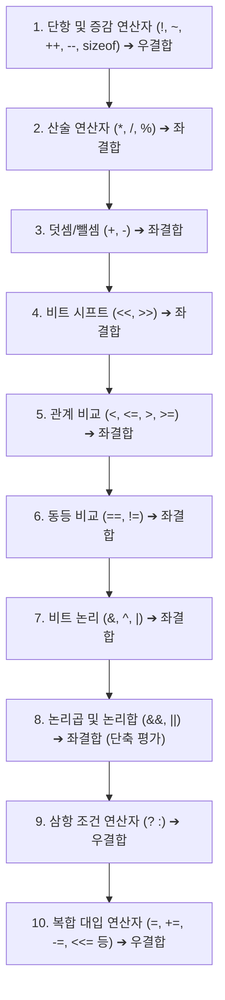

> [!abstract] 핵심 요약
> C 언어의 핵심 제어 구조는 **조건문(`if`, `switch`)**과 **반복문(`for`, `while`, `do-while`)**으로 구성된다. 
> 연산자는 **산술, 증감, 관계, 논리, 비트, 삼항, 대입 연산자**의 우선순위와 결합 법칙에 따라 평가되며, 특히 비트 시프트(`<<`, `>>`)와 전위/후위 증감(`++x`, `x++`)은 하드웨어 레지스터와 메모리 포인터 제어의 핵심 메커니즘을 이룬다.

---

## 1. C 연산자 우선순위와 결합 법칙 (Precedence & Associativity)



---

## 2. 전위 증감(Pre-increment) vs 후위 증감(Post-increment)의 차이

```c
int a = 5, b = 5;
int x = ++a; // a를 먼저 6으로 증가시킨 후 x에 6 대입 (전위: 선 증가, 후 대입)
int y = b++; // y에 현재 b값 5를 먼저 대입한 후 b를 6으로 증가 (후위: 선 대입, 후 증가)
```

| 증감 형식 | 수식 | 동작 순서 | 실행 후 변수값 |
| :-- | :-- | :-- | :-- |
| **전위 증감 (`++x`, `--x`)** | `y = ++x;` | 1. $x = x + 1$ 실행 $\rightarrow$ 2. 변경된 $x$값을 $y$에 대입 | $x = 6, y = 6$ |
| **후위 증감 (`x++`, `x--`)** | `y = x++;` | 1. 기존 $x$값을 $y$에 대입 $\rightarrow$ 2. $x = x + 1$ 실행 | $x = 6, y = 5$ |

---

## 3. C 제어 구조 (Control Flow) 상세 비교

<Tabs>
  <Tab label="1. for vs while vs do-while 반복문">
    <ul>
      <li><strong><code>for(초기식; 조건식; 증감식)</code></strong>: 반복 횟수가 명확할 때 사용. (초기식 $\rightarrow$ 조건식 검사 $\rightarrow$ 본문 $\rightarrow$ 증감식 $\rightarrow$ 조건식 순환)</li>
      <li><strong><code>while(조건식)</code></strong>: 조건에 따른 반복 제어 (선조건 검사, 조건이 처음부터 거짓이면 0회 실행).</li>
      <li><strong><code>do { ... } while(조건식);</code></strong>: 후조건 검사 (조건식의 참/거짓 여부와 무관하게 <strong>최소 1회 무조건 실행</strong> 보장).</li>
    </ul>
  </Tab>
  <Tab label="2. switch-case 다중 분기">
    정수형 수식(또는 문자형)의 값에 따라 해당하는 <code>case</code> 레이블로 직접 점프(Jump Table 기반 고속 분기).
    <pre><code class="language-c">switch (menu) {
    case 1: printf("짜장면"); break;
    case 2: printf("짬뽕");   break;
    default: printf("기타 메뉴"); break;
}</code></pre>
    <em>주의: <code>break</code> 문이 누락되면 다음 case 블록까지 연속 실행되는 <strong>Fall-through</strong> 현상이 발생함.</em>
  </Tab>
  <Tab label="3. break vs continue 제어">
    <ul>
      <li><strong><code>break</code></strong>: 현재 실행 중인 가장 안쪽의 반복문이나 switch 블록을 즉시 완전히 탈출.</li>
      <li><strong><code>continue</code></strong>: 반복문의 나머지 문장을 건너뛰고, for문의 경우 <em>증감식</em>, while문의 경우 <em>조건식 검사</em>로 즉시 점프.</li>
    </ul>
  </Tab>
</Tabs>

---

## 4. 실시간 비트 연산자(Bitwise Operations) 인터랙티브 계산기

비트 시프트 연산자는 정수의 $2^k$ 배속 곱셈 및 나눗셈을 하드웨어 수준에서 초고속으로 수행한다:

$$x \ll k = x \times 2^k \quad (\text{Left Shift: 상위 비트 밀려남, 하위 0 채움})$$
$$x \gg k = \lfloor x \div 2^k \rfloor \quad (\text{Right Shift: 하위 비트 밀려남, 상위 부호 비트 복사})$$

```html preview
<div style="font-family:system-ui,-apple-system,sans-serif;padding:20px;background:var(--card);color:var(--card-foreground);border:1px solid var(--border);border-radius:var(--radius)">
  <div style="font-size:16px;font-weight:700;margin-bottom:14px;color:var(--primary);display:flex;align-items:center;gap:8px">
    <span>⚡ C 비트 연산자 (&, |, ^, <<, >>) 실시간 비트맵 분석기</span>
  </div>

  <div style="display:grid;grid-template-columns:1fr 1fr 1fr;gap:10px;margin-bottom:14px">
    <div>
      <label style="font-size:11px;font-weight:600;color:var(--muted-foreground)">정수 A (0~255)</label>
      <input id="opA" type="number" min="0" max="255" value="12" style="width:100%;padding:6px;background:var(--background);color:var(--foreground);border:1px solid var(--border);border-radius:var(--radius);font-weight:700" />
    </div>
    <div>
      <label style="font-size:11px;font-weight:600;color:var(--muted-foreground)">비트 연산자 선택</label>
      <select id="opType" style="width:100%;padding:6px;background:var(--background);color:var(--foreground);border:1px solid var(--border);border-radius:var(--radius);font-weight:700">
        <option value="AND">A & B (비트 AND)</option>
        <option value="OR">A | B (비트 OR)</option>
        <option value="XOR">A ^ B (비트 XOR)</option>
        <option value="SHL">A &lt;&lt; B (Left Shift)</option>
        <option value="SHR">A &gt;&gt; B (Right Shift)</option>
      </select>
    </div>
    <div>
      <label style="font-size:11px;font-weight:600;color:var(--muted-foreground)">피연산자 B (0~15)</label>
      <input id="opB" type="number" min="0" max="15" value="2" style="width:100%;padding:6px;background:var(--background);color:var(--foreground);border:1px solid var(--border);border-radius:var(--radius);font-weight:700" />
    </div>
  </div>

  <div style="display:grid;grid-template-columns:repeat(3, 1fr);gap:8px;margin-bottom:12px;text-align:center">
    <div style="padding:8px;background:var(--background);border:1px solid var(--border);border-radius:var(--radius)">
      <div style="font-size:10px;color:var(--muted-foreground)">A (2진수)</div>
      <div id="binA" style="font-family:monospace;font-size:12px;font-weight:700;color:var(--chart-1)">00001100</div>
    </div>
    <div style="padding:8px;background:var(--background);border:1px solid var(--border);border-radius:var(--radius)">
      <div style="font-size:10px;color:var(--muted-foreground)">B (2진수)</div>
      <div id="binB" style="font-family:monospace;font-size:12px;font-weight:700;color:var(--chart-2)">00000010</div>
    </div>
    <div style="padding:8px;background:var(--background);border:1px solid var(--primary);border-radius:var(--radius)">
      <div style="font-size:10px;color:var(--muted-foreground)">연산 결과 (Result)</div>
      <div id="binRes" style="font-family:monospace;font-size:12px;font-weight:800;color:var(--primary)">00000000</div>
    </div>
  </div>

  <div style="padding:10px;background:var(--background);border:1px solid var(--border);border-radius:var(--radius);font-size:12px;line-height:1.5">
    <span style="font-weight:700;color:var(--chart-3)">계산 결과: </span>
    <span id="resText" style="font-family:monospace;font-weight:700;color:var(--foreground)"></span>
  </div>

  <script>
    var inA = document.getElementById('opA');
    var inB = document.getElementById('opB');
    var opSel = document.getElementById('opType');
    var bA = document.getElementById('binA');
    var bB = document.getElementById('binB');
    var bR = document.getElementById('binRes');
    var rTxt = document.getElementById('resText');

    function calcBitwise() {
      var a = parseInt(inA.value) || 0;
      var b = parseInt(inB.value) || 0;
      var op = opSel.value;
      var res = 0;

      if (op === 'AND') res = a & b;
      else if (op === 'OR') res = a | b;
      else if (op === 'XOR') res = a ^ b;
      else if (op === 'SHL') res = (a << b) & 255;
      else if (op === 'SHR') res = a >> b;

      bA.textContent = (a & 255).toString(2).padStart(8, '0');
      bB.textContent = (b & 255).toString(2).padStart(8, '0');
      bR.textContent = (res & 255).toString(2).padStart(8, '0');
      rTxt.textContent = a + " " + op + " " + b + " = " + res + " (10진수)";
    }

    inA.addEventListener('input', calcBitwise);
    inB.addEventListener('input', calcBitwise);
    opSel.addEventListener('change', calcBitwise);
    calcBitwise();
  </script>
</div>
```
