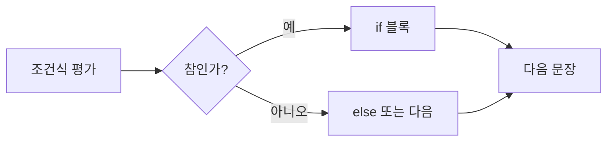

C 문법 자료는 조건에 따라 실행을 선택하는 문장과 반복을 제어하는 문장부터 시작해, 연산 결과를 조건식에 연결한다.

> [!NOTE]
> if·switch는 선택, for·while·do…while은 반복을 담당한다. 연산자는 이 제어 구조의 조건과 계산을 만든다.

---

## 1. 선택 제어

- if: 조건식이 참일 때만 문장을 실행한다.
- if~else: 참과 거짓에 각각 다른 문장을 실행한다.
- switch~case: 정수 조건값에 따라 여러 경우 중 하나를 선택한다.



---

## 2. 반복 제어

for는 초기값·조건식·증감식을 한 형식에 모으고, while은 조건을 먼저 검사하며, do…while은 본문을 한 번 실행한 뒤 조건을 검사한다. break는 반복을 탈출하고 continue는 다음 반복으로 건너뛴다.

<Tabs>
  <Tab label="for">반복 횟수나 인덱스가 분명할 때 초기화 → 조건 검사 → 본문 → 증감 순서를 사용한다.</Tab>
  <Tab label="while">반복 전에 조건이 거짓이면 본문이 실행되지 않는다.</Tab>
  <Tab label="do-while">본문이 최소 한 번 실행되어야 할 때 사용한다.</Tab>
</Tabs>

---

## 3. 연산자 층위

| 종류 | 자료의 역할 | 예 |
| --- | --- | --- |
| 산술 | 수치 계산 | + - * / % |
| 대입·증감 | 값 저장·1씩 증가/감소 | =, +=, ++, -- |
| 관계 | 참·거짓 비교 | >, <, == |
| 논리 | 조건 결합·부정 | &&, ||, ! |
| 비트 | 정수의 각 비트를 연산 | 비트 단위 AND·OR 등 |

```html preview
<div style="font-family:system-ui,sans-serif;padding:20px;color:var(--foreground)">
  <label for="amt" style="font-size:14px;font-weight:600">제어 구조 순서</label>
  <div id="out" style="font-size:30px;font-weight:700;color:var(--chart-1);margin:6px 0">1단계</div>
  <input id="amt" type="range" min="1" max="3" step="1" value="1"
    style="width:100%;accent-color:var(--primary)" />
  <p style="font-size:13px;color:var(--muted-foreground)">원본 자료의 순서를 움직여 해당 단계의 핵심을 확인한다.</p>
  <script>
    var amt = document.getElementById('amt');
    var out = document.getElementById('out');
    amt.addEventListener('input', function () {
      out.textContent = Number(amt.value).toLocaleString() + '단계';
    });
  </script>
</div>
```

> [!WARNING]
> 관계·논리 연산의 결과는 조건식에서 참/거짓으로 쓰인다. 산술 결과와 혼동하면 if와 반복의 실행 경로가 달라진다.

<details>
<summary>실행 점검</summary>

a가 100과 200 사이인지 검사하려면 (a > 100) && (a < 200)처럼 두 관계식을 논리 AND로 묶는다. 반복문에서는 종료 조건과 break 위치를 함께 확인한다.

</details>

<!-- source: 문법.pdf and 연산자.pdf; syntax names and operator categories preserved -->