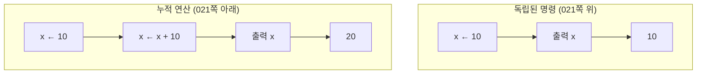
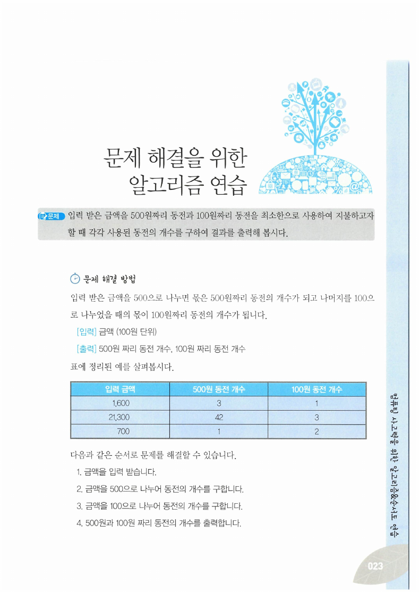
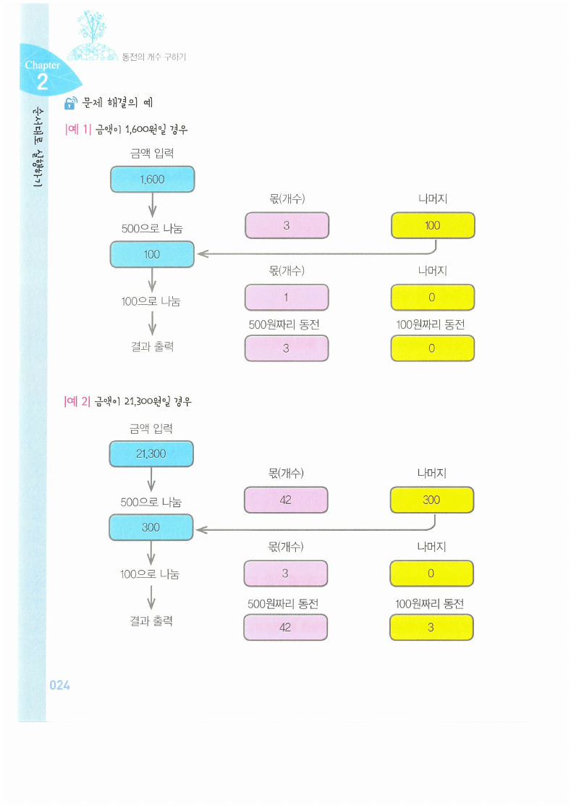
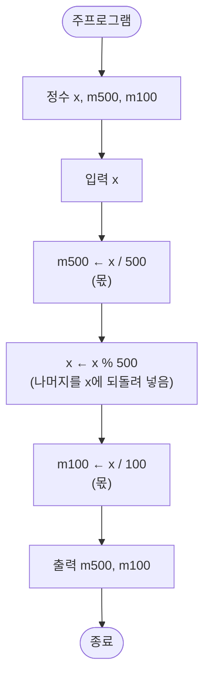
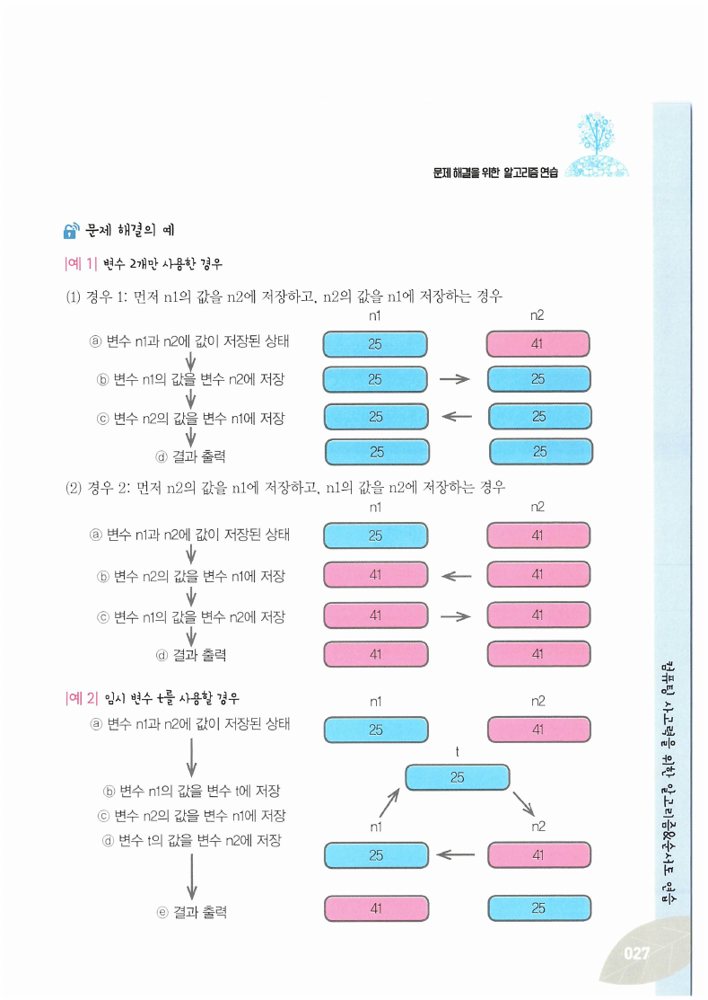
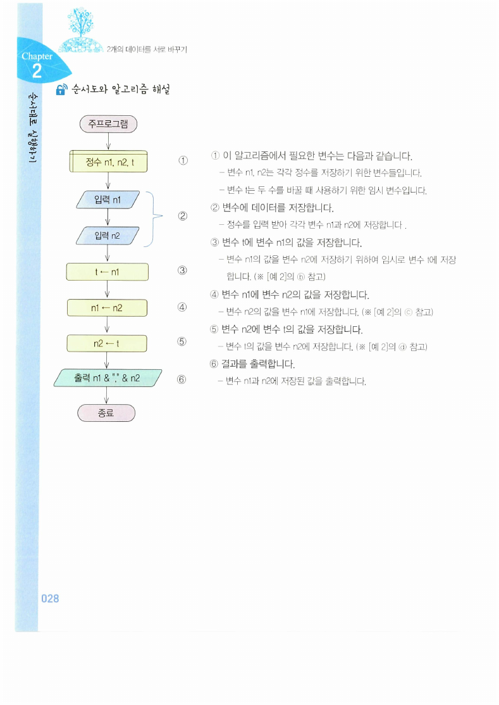
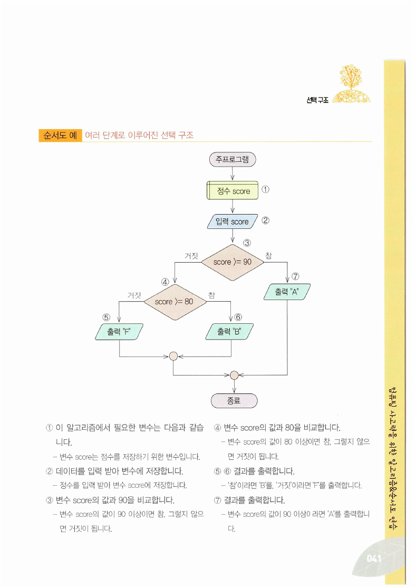
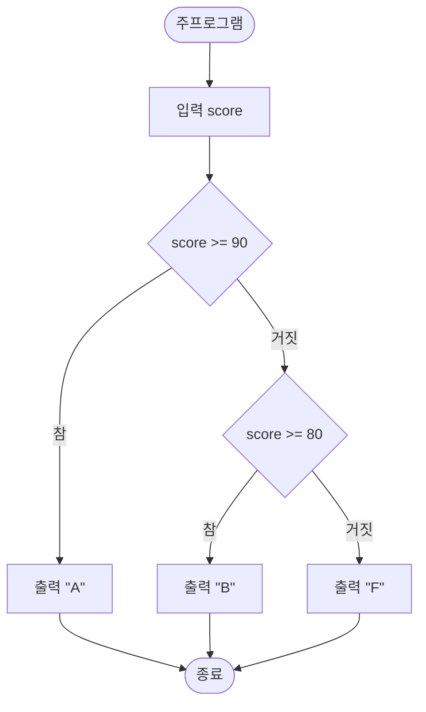
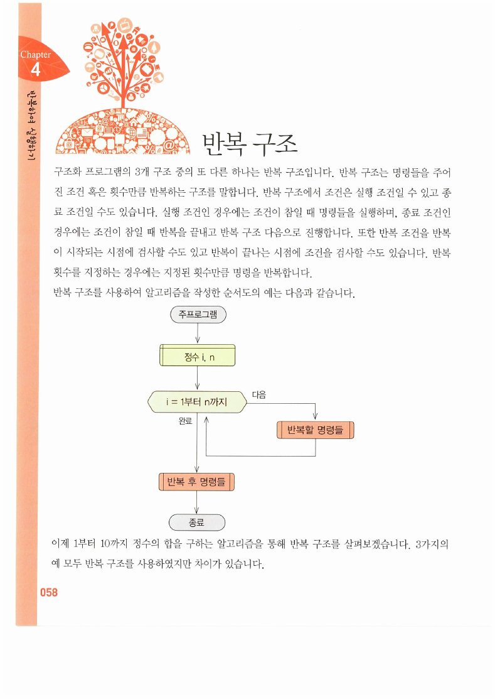
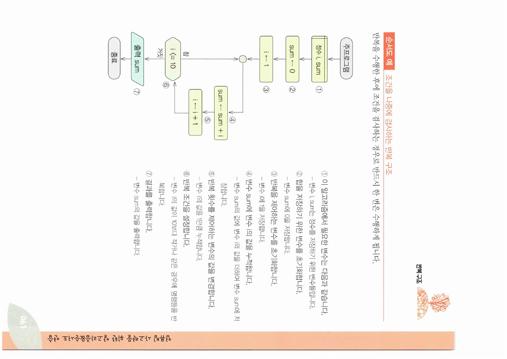

> [!abstract] 이 자료는 순서도 그리는 법을 가르치지 않는다
> [3장](./03.%20알고리즘과%20프로그래밍%20언어.md)이 순서도의 기호와 세 제어 구조를 이미 정의했다. 이 발췌본 34장이 하는 일은 그다음이다 — **머리로 생각한 절차를 순서도로 옮겨 적었을 때 어긋나는 곳**을 골라 모아 놓았다.
>
> 어긋나는 곳이 셋이다.
>
> 1. **나눗셈은 답을 두 개 내놓는다.** 동전 교환 문제(023~025쪽)에서 몫과 나머지를 각각 어디에 쓸지 헷갈리면 답이 틀린다. 원본조차 여기서 한 번 틀렸다.
> 2. **두 변수를 그냥 바꾸면 둘 다 같아진다.** 026~028쪽이 실패 과정을 한 단계씩 보여준다.
> 3. **반복은 조건을 어디서 검사하느냐에 따라 0회일 수도 있다.** 058~061쪽의 세 형태가 이 차이를 만든다.
>
> 이 셋은 모두 "당연히 될 줄 알았는데 안 되는" 종류다. 그래서 이 정리는 자료의 절 순서 대신 **세 번의 배신**을 뼈대로 삼는다.

읽기에 앞서 이 자료가 교재의 어느 구간을 잘라낸 것인지 확인해 둔다.

> [!note] 이 발췌본의 범위
> 쪽 번호가 인쇄된 교재 스캔이며, 남아 있는 것은 **018~030쪽(Chapter 2 순차 구조), 034~050쪽(Chapter 3 조건에 따라 실행하기), 058~061쪽(Chapter 4 반복에 따라 실행하기)** 이다. 031~033쪽과 051~057쪽은 발췌에서 빠져 있다. 아래 쪽 번호는 모두 **교재 인쇄 쪽수**로 적는다.

---

## 준비 운동 — 화살표는 왼쪽으로만 간다

Chapter 2는 순차 구조부터 시작한다. 020쪽의 정의는 짧다 — **"프로그램이 표현된 순서대로 실행되는 것"**. 별도의 기호가 없고, 아무 언급이 없으면 위에서 아래로 흐른다.

019쪽의 첫 예제가 이 자료의 표기법을 전부 소개한다.

| 기호 | 예 | 뜻 |
| --- | --- | --- |
| 노란 사각형(겹선) | `정수 x, y` | 변수 선언 |
| 파란 평행사변형 | `입력 x` | 입력 |
| 노란 사각형 | `y ← x + 5` | 처리(대입) |
| 초록 평행사변형 | `출력 y` | 출력 |
| 둥근 상자 | `주프로그램` / `종료` | 시작과 끝 |

021쪽이 처음으로 걸리는 곳을 짚는다.



`x ← x + 10`은 수학에서는 성립할 수 없는 등식이다. 그러나 순서도의 화살표는 **등호가 아니라 대입**이고, 방향이 있다. 오른쪽을 계산해서 왼쪽에 넣는다. 원본이 이 예제를 "누적 연산인 경우 – 변수에 연산한 결과를 다시 저장하는 경우"라는 긴 제목으로 부른 이유다.

022쪽은 여기에 변수 하나를 더한다 — `x ← 10` 다음 `y ← x + 10`. 제목이 **"명령을 수행한 결과가 다음 명령에 영향을 끼치는 경우"** 다. 순차 구조에서 순서가 중요한 이유가 이 한 문장에 있다. 이 관찰이 곧 첫 번째 배신으로 이어진다.

---

## 첫 번째 배신 — 나눗셈은 답을 두 개 내놓는다

023~025쪽이 이 자료에서 가장 실용적인 문제다.

> **문제** — 금액을 입력받아 500원짜리와 100원짜리 동전이 각각 몇 개 필요한지 구하시오.



원본은 표로 세 경우를 보인다.

| 금액 | 500원짜리 | 100원짜리 |
| --- | --- | --- |
| 1,600원 | 3개 | 1개 |
| 21,300원 | 42개 | 3개 |
| 700원 | 1개 | 2개 |

핵심은 **한 번의 나눗셈이 두 개의 답을 낸다**는 것이다. `1600 ÷ 500`은 몫 3과 나머지 100을 동시에 내놓는데, **몫은 동전 개수가 되고 나머지는 다음 단계의 입력**이 된다. 둘의 역할이 완전히 다르다.



> [!warning] 원본 024쪽 [예 1] — 100원짜리 동전 개수가 0으로 잘못 적혀 있다
> [예 1]은 1,600원을 500으로 나누어 몫 3·나머지 100을 얻고, 그 100을 다시 100으로 나누어 **몫 1·나머지 0**을 얻는다. 여기까지는 맞다. 그런데 마지막 결과 칸에 **"100원짜리 동전 = 0"** 이라고 적혀 있다. 023쪽 표는 1개라고 하고, 025쪽 순서도도 `m100 ← x / 100`(몫)을 쓰므로 **1이 맞다.**
>
> 무엇을 착각했는지도 그림에 그대로 남아 있다. 이 자료는 몫을 분홍, 나머지를 노랑으로 칠하는데, 결과 칸의 500원 자리는 분홍(몫 3, 맞음)이고 100원 자리는 **노랑** — 즉 **몫이 아니라 나머지 0을 옮겨 적었다.**
>
> 바로 아래 [예 2]는 21,300원 → 42개·3개로 올바르게 적혀 있어, 오류가 [예 1]에만 있다. 이 실수 자체가 이 문제의 함정이 무엇인지를 정확히 보여준다.

025쪽 순서도는 다음 순서로 되어 있다.



두 번째 상자 `x ← x % 500`이 021쪽에서 연습한 **누적 대입**과 같은 모양이다. 자기 자신을 갱신해서 다음 단계로 넘긴다. 순차 구조 절이 왜 `x ← x + 10`부터 시작했는지가 여기서 드러난다.

```html preview h=560px
<div style="font-family:system-ui,-apple-system,sans-serif;padding:20px;color:var(--foreground)">
  <div style="display:flex;gap:10px;align-items:center;flex-wrap:wrap;margin-bottom:10px">
    <span style="font-size:13px;font-weight:600">원본의 예</span>
    <div id="pre" style="display:flex;gap:6px;flex-wrap:wrap"></div>
  </div>
  <label for="amt" style="font-size:13px;font-weight:600">금액 <span id="amtv" style="color:var(--chart-1);font-size:20px;font-weight:700">1,600</span>원</label>
  <input id="amt" type="range" min="0" max="30000" step="100" value="1600" style="width:100%;accent-color:var(--primary)" />

  <div id="steps" style="margin-top:16px"></div>

  <div style="margin-top:16px;font-size:13px;font-weight:600">동전</div>
  <div id="coins" style="display:flex;gap:6px;flex-wrap:wrap;margin-top:8px;max-height:120px;overflow:auto"></div>

  <div id="msg" style="margin-top:14px;padding:11px 13px;background:var(--card);border:1px solid var(--border);border-radius:var(--radius);font-size:13px;line-height:1.7"></div>

  <script>
    var el = document.getElementById('amt');
    function chip(label, v, color) {
      return '<div style="border:1px solid ' + color + ';border-radius:var(--radius);padding:6px 12px;min-width:70px;text-align:center">' +
        '<div style="font-size:11px;color:var(--muted-foreground)">' + label + '</div>' +
        '<div style="font-size:19px;font-weight:700;color:' + color + '">' + v + '</div></div>';
    }
    function render() {
      var x = parseInt(el.value, 10);
      document.getElementById('amtv').textContent = x.toLocaleString();
      document.getElementById('pre').innerHTML = [1600, 21300, 700].map(function (v) {
        var on = v === x;
        return '<button data-v="' + v + '" style="cursor:pointer;font:inherit;font-size:12.5px;padding:4px 10px;border-radius:var(--radius);border:1px solid ' +
          (on ? 'var(--chart-1)' : 'var(--border)') + ';background:' + (on ? 'var(--chart-1)' : 'transparent') +
          ';color:' + (on ? 'var(--primary-foreground)' : 'var(--foreground)') + '">' + v.toLocaleString() + '원</button>';
      }).join('');
      Array.prototype.forEach.call(document.querySelectorAll('#pre button'), function (b) {
        b.addEventListener('click', function () { el.value = b.getAttribute('data-v'); render(); });
      });

      var m500 = Math.floor(x / 500), r500 = x % 500;
      var m100 = Math.floor(r500 / 100), r100 = r500 % 100;
      document.getElementById('steps').innerHTML =
        '<div style="display:flex;gap:10px;flex-wrap:wrap;align-items:center;margin-bottom:10px">' +
        '<span style="font-size:12.5px;font-family:ui-monospace,Menlo,monospace">' + x.toLocaleString() + ' ÷ 500</span>' +
        chip('몫 → 500원 개수', m500, 'var(--chart-1)') +
        chip('나머지 → 다음 단계로', r500, 'var(--chart-3)') + '</div>' +
        '<div style="display:flex;gap:10px;flex-wrap:wrap;align-items:center">' +
        '<span style="font-size:12.5px;font-family:ui-monospace,Menlo,monospace">' + r500 + ' ÷ 100</span>' +
        chip('몫 → 100원 개수', m100, 'var(--chart-1)') +
        chip('나머지 → 남는 돈', r100, 'var(--chart-3)') + '</div>';

      var c = '';
      for (var i = 0; i < Math.min(m500, 60); i++) c += '<div title="500원" style="width:30px;height:30px;border-radius:50%;background:var(--chart-1);color:var(--primary-foreground);font-size:10px;display:flex;align-items:center;justify-content:center">500</div>';
      if (m500 > 60) c += '<div style="font-size:12px;color:var(--muted-foreground);align-self:center">…외 ' + (m500 - 60) + '개</div>';
      for (var j = 0; j < m100; j++) c += '<div title="100원" style="width:26px;height:26px;border-radius:50%;background:var(--chart-2);color:var(--primary-foreground);font-size:10px;display:flex;align-items:center;justify-content:center;align-self:center">100</div>';
      document.getElementById('coins').innerHTML = c || '<span style="font-size:12.5px;color:var(--muted-foreground)">없음</span>';

      document.getElementById('msg').innerHTML =
        '500원 <b style="color:var(--chart-1)">' + m500 + '개</b> + 100원 <b style="color:var(--chart-2)">' + m100 + '개</b> = ' +
        (m500 * 500 + m100 * 100).toLocaleString() + '원' +
        (r100 ? ', 남는 돈 <b style="color:var(--chart-3)">' + r100 + '원</b>' : '') + '<br>' +
        '<span style="color:var(--muted-foreground)">각 단계에서 <b>몫</b>은 답이 되고 <b>나머지</b>는 다음 단계의 입력이 된다. ' +
        '원본 024쪽 [예 1]이 마지막에 몫 대신 나머지를 옮겨 적어 100원짜리를 0개로 만든 것이 정확히 이 자리에서의 혼동이다.</span>';
    }
    el.addEventListener('input', render);
    render();
  </script>
</div>
```

> [!tip] 같은 나눗셈이 다른 데서 또 쓰인다
> `x % y == 0`으로 나누어떨어지는지 판정하는 문제가 042~044쪽에 있고, 나머지를 계속 앞으로 밀어 넣어 최대공약수를 구하는 유클리드 알고리즘이 [6장](./06.%20탐색과%20정렬%20알고리즘.md)에 있다. 몫과 나머지를 나누어 쓰는 이 한 가지 기술이 세 문제를 관통한다.

---

## 두 번째 배신 — 두 변수를 그냥 바꾸면 둘 다 같아진다

026쪽이 문제를 던진다. `n1 = 25`, `n2 = 41`을 서로 바꾸시오. 그리고 곧바로 답을 예고한다 — **"주어진 2개의 변수(n1, n2)만으로는 각 변수에 저장된 값을 서로 바꿀 수 없습니다."**

027쪽이 왜 안 되는지를 한 단계씩 보인다.



`n1 ← n2`를 실행하는 순간 n1에 있던 25가 **덮여서 사라진다.** 그다음 `n2 ← n1`을 하면 이미 41이 된 n1을 n2에 넣는 것이므로 둘 다 41이 된다. 021쪽의 "누적 연산"이 도움이 되던 그 성질 — 대입이 왼쪽을 덮어쓴다는 성질 — 이 여기서는 정확히 해를 끼친다.



028쪽의 해법은 세 줄이다. `t ← n1`, `n1 ← n2`, `n2 ← t`. **덮이기 전에 옮겨 둔다**는 것이 전부다.

```html preview h=540px
<div style="font-family:system-ui,-apple-system,sans-serif;padding:20px;color:var(--foreground)">
  <div style="display:flex;gap:8px;flex-wrap:wrap;margin-bottom:14px">
    <button id="bad" style="cursor:pointer;font:inherit;font-size:12.5px;padding:5px 12px;border-radius:var(--radius);border:1px solid var(--border);background:transparent;color:var(--foreground)">임시 변수 없이 (027쪽)</button>
    <button id="good" style="cursor:pointer;font:inherit;font-size:12.5px;padding:5px 12px;border-radius:var(--radius);border:1px solid var(--border);background:transparent;color:var(--foreground)">임시 변수 t 사용 (028쪽)</button>
    <button id="step" style="cursor:pointer;font:inherit;font-size:12.5px;padding:5px 12px;border-radius:var(--radius);border:1px solid var(--chart-1);background:var(--chart-1);color:var(--primary-foreground)">다음 단계 ▶</button>
    <button id="rst" style="cursor:pointer;font:inherit;font-size:12.5px;padding:5px 12px;border-radius:var(--radius);border:1px solid var(--border);background:transparent;color:var(--foreground)">처음으로</button>
  </div>

  <div id="vars" style="display:flex;gap:14px;flex-wrap:wrap;margin-bottom:14px"></div>
  <div id="code" style="font-family:ui-monospace,Menlo,monospace;font-size:13px;line-height:2;background:var(--card);border:1px solid var(--border);border-radius:var(--radius);padding:12px 14px"></div>
  <div id="say" style="margin-top:14px;padding:11px 13px;border:1px solid var(--border);border-radius:var(--radius);font-size:13px;line-height:1.7"></div>

  <script>
    var useTmp = false, pc = 0;
    var st = { n1: 25, n2: 41, t: null };
    var PROG_BAD = [
      ['n1 ← n2', function (s) { s.n1 = s.n2; }],
      ['n2 ← n1', function (s) { s.n2 = s.n1; }]
    ];
    var PROG_GOOD = [
      ['t  ← n1', function (s) { s.t = s.n1; }],
      ['n1 ← n2', function (s) { s.n1 = s.n2; }],
      ['n2 ← t', function (s) { s.n2 = s.t; }]
    ];
    function prog() { return useTmp ? PROG_GOOD : PROG_BAD; }
    function reset() { st = { n1: 25, n2: 41, t: null }; pc = 0; draw(); }
    function vbox(name, v, color) {
      return '<div style="border:1px solid ' + (v === null ? 'var(--border)' : color) + ';border-radius:var(--radius);padding:9px 16px;text-align:center;min-width:76px;background:var(--card)">' +
        '<div style="font-size:11.5px;color:var(--muted-foreground)">' + name + '</div>' +
        '<div style="font-size:24px;font-weight:800;color:' + (v === null ? 'var(--muted-foreground)' : color) + '">' + (v === null ? '—' : v) + '</div></div>';
    }
    function draw() {
      [['bad', !useTmp], ['good', useTmp]].forEach(function (p) {
        var b = document.getElementById(p[0]);
        b.style.borderColor = p[1] ? 'var(--chart-1)' : 'var(--border)';
        b.style.background = p[1] ? 'var(--chart-1)' : 'transparent';
        b.style.color = p[1] ? 'var(--primary-foreground)' : 'var(--foreground)';
      });
      var boxes = vbox('n1', st.n1, 'var(--chart-1)') + vbox('n2', st.n2, 'var(--chart-2)');
      if (useTmp) boxes += vbox('t (임시)', st.t, 'var(--chart-4)');
      document.getElementById('vars').innerHTML = boxes;

      var P = prog();
      document.getElementById('code').innerHTML = P.map(function (row, i) {
        var done = i < pc, now = i === pc;
        return '<div style="' + (now ? 'background:var(--border);border-radius:4px;padding:0 6px;' : 'padding:0 6px;') +
          (done ? 'color:var(--muted-foreground)' : '') + '">' + (now ? '▶ ' : '&nbsp;&nbsp;') + row[0] + '</div>';
      }).join('');

      var done = pc >= P.length;
      var ok = st.n1 === 41 && st.n2 === 25;
      document.getElementById('say').innerHTML = done
        ? (ok
          ? '<b style="color:var(--chart-2)">성공.</b> n1 = 41, n2 = 25. 임시 변수 t가 <b>덮이기 전에</b> 25를 받아 두었기 때문이다.'
          : '<b style="color:var(--destructive)">실패.</b> n1 = ' + st.n1 + ', n2 = ' + st.n2 + ' — 둘 다 41이 되었다. ' +
            '첫 줄 <code>n1 ← n2</code>에서 n1의 25가 <b>덮여서 사라졌고</b>, 사라진 값을 둘째 줄이 되돌릴 방법이 없다.')
        : (pc === 0
          ? '「다음 단계」를 눌러 한 줄씩 실행해 보라. 대입 <code>←</code>은 오른쪽을 계산해 왼쪽에 <b>덮어쓴다</b>.'
          : '방금 <code>' + P[pc - 1][0] + '</code> 를 실행했다.');
    }
    document.getElementById('bad').addEventListener('click', function () { useTmp = false; reset(); });
    document.getElementById('good').addEventListener('click', function () { useTmp = true; reset(); });
    document.getElementById('rst').addEventListener('click', reset);
    document.getElementById('step').addEventListener('click', function () {
      var P = prog();
      if (pc < P.length) { P[pc][1](st); pc++; draw(); }
    });
    draw();
  </script>
</div>
```

> [!important] 이 세 줄이 이 강의에서 세 번 나온다
>
> - [3장 6·8·9쪽](./03.%20알고리즘과%20프로그래밍%20언어.md) — **정답**으로만 제시된다. `Z=X, X=Y, Y=Z`.
> - 이 장 026~028쪽 — **왜 Z가 필요한지**를 실패 과정으로 보인다.
> - [7장 함수 7쪽](./07.%20C%20언어의%20변수·연산자·제어문·함수.md) — 세 줄을 **함수 안에 넣으면 다시 실패한다.** 값으로 전달(call by value)하면 함수 안의 복사본만 바뀌기 때문이다. 임시 변수를 써도 소용없고, 이번에는 주소를 넘겨야 한다.
>
> 같은 문제가 난이도를 높이며 세 번 돌아오는 셈이다.

### 값이 세 개면 순환이 된다

029~030쪽은 변수를 셋으로 늘린다. `n1 ← n2`, `n2 ← n3` 식으로 값을 한 칸씩 밀면 맨 앞의 값이 밀려 나간다. 원본은 이것을 "값의 이동"이라 부른다.

밀려 나가는 값을 버리는 것이 곧 알고리즘이 되는 경우가 있다. [6장의 유클리드 알고리즘](./06.%20탐색과%20정렬%20알고리즘.md)이 `n1 ← n2`, `n2 ← n3(나머지)`를 반복하는 구조인데, 밀려 나간 값은 더 이상 필요 없기 때문에 버려도 된다. 반면 두 값을 **맞바꾸려는** 경우에는 밀려 나간 값이 반드시 필요하고, 그래서 임시 변수가 있어야 한다. **같은 대입 연산이 목적에 따라 도구가 되기도 함정이 되기도 한다.**

---

## 선택 구조 — 조건 하나에서 조건 여럿까지

Chapter 3(034~050쪽)이 조건을 다룬다. 034쪽의 관계 연산자 표가 출발점이다.

| 연산자 | 뜻 |
| --- | --- |
| `>` `<` | 크다 / 작다 |
| `>=` `<=` | 크거나 같다 / 작거나 같다 |
| `=` | 같다 |
| `!=` | 같지 않다 |

035쪽의 첫 예제는 `x > 0` 하나로 갈라지는 순서도다. 참이면 "양수임", 거짓이면 "양수가 아님". 두 갈래가 다시 **작은 원(결합점)** 에서 합쳐진다는 점이 이 자료의 표기 규칙이다.

036~037쪽이 **복합 조건**으로 넘어간다. 논리곱·논리합·논리부정의 진리표를 제시하고, 예제로 `x >= 10 And x <= 20`을 든다. "10과 20 사이인가"라는 하나의 질문이 두 개의 비교로 쪼개지는 것이다.

> [!note] [1장 61쪽의 진리표](./01.%20컴퓨터의%20이해와%20정보의%20표현.md)와 같은 표다
> 1장은 논리연산을 **회로와 데이터의 관점**에서(은희와 서린의 부산 여행), 이 장은 **제어 흐름의 관점**에서 다룬다. 같은 진리표가 "비트를 어떻게 계산하는가"와 "어느 가지로 갈 것인가"라는 두 쓰임을 갖는다는 뜻이다.

038~041쪽이 선택 구조의 세 형태를 차례로 보인다.

| 형태 | 예제(쪽) | 특징 |
| --- | --- | --- |
| 참일 때만 실행 | `score >= 70` → "합격입니다"(039쪽) | 거짓이면 **아무것도 출력하지 않는다** |
| 참·거짓에 각각 실행 | `m < n` → 두 가지 메시지(040쪽) | 양쪽 모두 출력 |
| 여러 단계로 이루어진 선택 | 등급 판정(041쪽) | 판단 상자 안에 판단 상자 |



041쪽의 등급 판정은 다음과 같이 읽힌다.



여기서 중요한 것은 **두 번째 판단이 첫 번째의 '거짓' 가지 안에 들어 있다**는 점이다. 그래서 `score >= 80`을 검사할 때는 이미 90 미만이라는 것이 보장된다. 조건을 `80 <= score < 90`처럼 쓸 필요가 없다. 중첩이 조건 하나를 절약해 준다.

> [!note] 원본이 C·D 등급을 건너뛴 것
> 041쪽은 A(90 이상), B(80 이상), F(그 외) 셋만 다룬다. C와 D가 없는 것은 오류가 아니라 **구조를 보이는 데 필요한 최소 단계**만 남긴 것이다. 같은 모양을 한 번 더 중첩하면 C가, 또 한 번이면 D가 생긴다.

042~050쪽은 선택 구조를 쓰는 문제 셋이다.

| 문제(쪽) | 조건 | 요점 |
| --- | --- | --- |
| 나누어떨어지는가(042~044) | `x % y = 0` | 나머지 연산이 다시 등장한다. 903 ÷ 43 → 나머지 0(예), 673 ÷ 34 → 나머지 27(아니오) |
| 더 작은 수 찾기(045~047) | `m < n` | `small` 변수를 하나 두고 **어느 쪽이든 담아 둔다**. 두 값이 같으면(4, 4) 어느 쪽을 담아도 답은 같다 |
| 순서대로 나열하기(048~050) | `n1 > n2` | 순서가 틀렸을 때만 **바꾼다**. 026쪽의 세 줄 교환이 조건 안으로 들어간다 |

마지막 문제(048~050쪽)가 앞의 둘을 합친 것이다. 원본도 그것을 밝힌다 — **"※ 관련 알고리즘 : 2개의 숫자를 서로 바꾸기(26쪽 참고)"**. 그리고 이 구조가 그대로 [5장 버블 정렬 한 패스](./05.%20배열%20위의%20기본%20알고리즘.md)의 안쪽이 된다. 이웃한 두 값을 비교해 순서가 틀렸으면 바꾸는 일을 배열 전체에 대해 반복하면 정렬이 된다.

---

## 세 번째 배신 — 반복은 0회일 수도 있다

Chapter 4(058~061쪽)는 네 쪽뿐이지만 반복 구조의 세 형태를 모두 담고 있다. 셋 다 같은 일을 한다 — **1부터 10까지 더하기**. 답도 같다. 다른 것은 **조건을 어디서 검사하는가**뿐이다.





| 형태(쪽) | 순서도 | 원본의 설명 |
| --- | --- | --- |
| **횟수를 지정**(059) | 육각형 준비 기호 `i = 1부터 10까지` | 초깃값·종료값·증감치를 앞부분에서 모두 설정 |
| **조건을 먼저 검사**(060) | `i ← 1` 후 마름모 `i <= 10` | "처음부터 조건을 만족하지 않을 때에는 **한 번도 수행하지 않을 수** 있습니다" |
| **조건을 나중에 검사**(061) | 본문 실행 후 마름모 | 조건과 무관하게 **최소 한 번은 실행**된다 |

세 번째 배신이 여기 있다. 반복이라고 하면 "여러 번 도는 것"을 떠올리지만, **앞에서 검사하는 반복은 0회일 수 있고 뒤에서 검사하는 반복은 최소 1회다.** 원본 060쪽이 이 사실을 명시적으로 적어 두었다.

```html preview h=580px
<div style="font-family:system-ui,-apple-system,sans-serif;padding:20px;color:var(--foreground)">
  <div style="display:flex;gap:16px;flex-wrap:wrap;align-items:center;margin-bottom:14px">
    <div>
      <label for="init" style="font-size:12.5px;font-weight:600">i의 초깃값 = <span id="iv" style="color:var(--chart-1);font-weight:700">1</span></label>
      <input id="init" type="range" min="1" max="14" step="1" value="1" style="width:220px;accent-color:var(--primary)" />
    </div>
    <div style="font-size:12.5px;color:var(--muted-foreground)">반복 조건은 두 형태 모두 <code>i &lt;= 10</code></div>
  </div>

  <div style="display:flex;gap:16px;flex-wrap:wrap">
    <div style="flex:1;min-width:250px;border:1px solid var(--border);border-radius:var(--radius);padding:12px 14px;background:var(--card)">
      <div style="font-size:13px;font-weight:700;margin-bottom:4px">조건을 <span style="color:var(--chart-1)">먼저</span> 검사 <span style="font-weight:400;color:var(--muted-foreground)">(060쪽)</span></div>
      <div style="font-family:ui-monospace,Menlo,monospace;font-size:12px;line-height:1.8;color:var(--muted-foreground)">sum ← 0<br/>i ← 초깃값<br/><b style="color:var(--foreground)">while (i &lt;= 10) {</b><br/>&nbsp;&nbsp;sum ← sum + i<br/>&nbsp;&nbsp;i ← i + 1<br/>}</div>
      <div id="preR" style="margin-top:10px"></div>
    </div>
    <div style="flex:1;min-width:250px;border:1px solid var(--border);border-radius:var(--radius);padding:12px 14px;background:var(--card)">
      <div style="font-size:13px;font-weight:700;margin-bottom:4px">조건을 <span style="color:var(--chart-2)">나중에</span> 검사 <span style="font-weight:400;color:var(--muted-foreground)">(061쪽)</span></div>
      <div style="font-family:ui-monospace,Menlo,monospace;font-size:12px;line-height:1.8;color:var(--muted-foreground)">sum ← 0<br/>i ← 초깃값<br/><b style="color:var(--foreground)">do {</b><br/>&nbsp;&nbsp;sum ← sum + i<br/>&nbsp;&nbsp;i ← i + 1<br/><b style="color:var(--foreground)">} while (i &lt;= 10)</b></div>
      <div id="postR" style="margin-top:10px"></div>
    </div>
  </div>

  <div id="verdict" style="margin-top:14px;padding:11px 13px;border:1px solid var(--border);border-radius:var(--radius);font-size:13px;line-height:1.7"></div>

  <script>
    var el = document.getElementById('init');
    function runPre(start) {
      var sum = 0, i = start, n = 0, seq = [];
      while (i <= 10) { sum += i; seq.push(i); i++; n++; if (n > 60) break; }
      return { sum: sum, n: n, seq: seq };
    }
    function runPost(start) {
      var sum = 0, i = start, n = 0, seq = [];
      do { sum += i; seq.push(i); i++; n++; if (n > 60) break; } while (i <= 10);
      return { sum: sum, n: n, seq: seq };
    }
    function card(r, color) {
      return '<div style="font-size:12.5px">실행 횟수 <b style="color:' + color + ';font-size:18px">' + r.n + '</b>회</div>' +
        '<div style="font-size:12.5px">sum = <b style="color:' + color + ';font-size:18px">' + r.sum + '</b></div>' +
        '<div style="font-size:11.5px;color:var(--muted-foreground);margin-top:4px;font-family:ui-monospace,Menlo,monospace">' +
        (r.seq.length ? '더한 값: ' + r.seq.join(' + ') : '더한 값 없음') + '</div>';
    }
    function render() {
      var s = parseInt(el.value, 10);
      document.getElementById('iv').textContent = s;
      var a = runPre(s), b = runPost(s);
      document.getElementById('preR').innerHTML = card(a, 'var(--chart-1)');
      document.getElementById('postR').innerHTML = card(b, 'var(--chart-2)');
      document.getElementById('verdict').innerHTML = (a.n === b.n)
        ? '초깃값이 <b>' + s + '</b>이면 두 형태의 결과가 같다. 처음부터 조건이 참이므로 검사 위치가 결과를 바꾸지 않는다.' +
          '<br><span style="color:var(--muted-foreground)">원본 059~061쪽의 세 예제가 모두 i를 1부터 시작해 sum = 55를 얻는 이유다.</span>'
        : '초깃값이 <b>' + s + '</b>이면 조건 <code>i &lt;= 10</code>이 <b>처음부터 거짓</b>이다. ' +
          '앞에서 검사하는 쪽은 <b style="color:var(--chart-1)">' + a.n + '회</b>(한 번도 실행하지 않음), ' +
          '뒤에서 검사하는 쪽은 <b style="color:var(--chart-2)">' + b.n + '회</b> 실행하고 sum이 <b>' + b.sum + '</b>이 된다.' +
          '<br><span style="color:var(--muted-foreground)">"조건을 확인하기 전에 일단 실행"하기 때문이다. 반복 횟수가 0이 될 수 있는가 없는가 — 두 형태를 가르는 유일한 차이다.</span>';
    }
    el.addEventListener('input', render);
    render();
  </script>
</div>
```

> [!note] 이 세 형태가 C에서 그대로 이름을 얻는다
> [7장 문법 자료](./07.%20C%20언어의%20변수·연산자·제어문·함수.md)에서 059쪽은 `for`, 060쪽은 `while`, 061쪽은 `do~while`이 된다. 순서도로 먼저 배우고 문법으로 다시 만나는 구성이다. 그래서 7장의 do~while 설명("조건식이 거짓이든 참이든 무조건 한 번은 실행")이 이 장 061쪽의 문장과 거의 같다.

059쪽 순서도의 육각형 **준비 기호**가 [3장 [표 4-1]](./03.%20알고리즘과%20프로그래밍%20언어.md)에서 정의한 그 기호다. 반복 범위를 한 상자에 적어 넣는 이 표기가 [5장·6장](./05.%20배열%20위의%20기본%20알고리즘.md)의 배열 알고리즘에서 계속 쓰인다 — 그리고 **그 상자 안의 범위를 잘못 적어서 생기는 오류**가 5장에 실제로 하나 있다.

---

## 정리

> [!tip] 이 장의 골격
>
> 1. **대입은 등호가 아니다.** `x ← x + 10`이 성립하는 이유이자, 두 변수를 그냥 바꿀 수 없는 이유이기도 하다. 같은 성질이 도구가 되기도 함정이 되기도 한다(021·027쪽).
> 2. **나눗셈은 몫과 나머지 둘을 낸다.** 몫은 답이 되고 나머지는 다음 단계의 입력이 된다. 원본조차 024쪽 [예 1]에서 이 둘을 바꿔 적었다.
> 3. **교환에는 임시 변수가 필요하다.** `t ← n1, n1 ← n2, n2 ← t`. 이 세 줄이 [3장](./03.%20알고리즘과%20프로그래밍%20언어.md)·이 장·[7장](./07.%20C%20언어의%20변수·연산자·제어문·함수.md)에 각각 정답·실패·함수 경계 문제로 등장한다.
> 4. **선택 구조는 중첩할 수 있고, 중첩은 조건을 절약한다.** `score >= 90`이 거짓인 가지 안에서는 `score >= 80` 하나만 물으면 된다(041쪽).
> 5. **반복은 검사 위치가 실행 횟수를 결정한다.** 앞에서 검사하면 0회일 수 있고, 뒤에서 검사하면 최소 1회다(060·061쪽).

다음 장부터는 이 다섯 가지가 **배열 위에서** 쓰인다. [5장](./05.%20배열%20위의%20기본%20알고리즘.md)은 반복 하나로 배열을 한 번 훑어 할 수 있는 일들을 모으고, 거기서 반복 범위를 잘못 적으면 어떻게 되는지를 원본의 실제 오류로 확인한다.

---

### 근거 자료

강의 원본 `순서도작성_예.pdf`(34쪽)에 근거한다. 쪽 번호가 인쇄된 교재 스캔이며, 남아 있는 범위는 018~030쪽·034~050쪽·058~061쪽이다(031~033·051~057쪽 결락). 이 자료는 34쪽 **전체가 텍스트 추출이 되지 않는 이미지 페이지**여서 렌더 이미지를 한 장씩 확인해 정리했다.

인용한 슬라이드는 023쪽(동전 교환 표), 024쪽(동전 교환 계산 과정), 027쪽(교환 실패), 028쪽(임시 변수를 쓴 교환), 041쪽(중첩 선택 구조), 059쪽(횟수를 지정한 반복), 061쪽(조건을 나중에 검사하는 반복)이다.

인터렉티브에 사용한 수치는 모두 원본 값 그대로다. 동전 교환의 기본 예 1,600 / 21,300 / 700원과 그 답(3·1, 42·3, 1·2)은 023쪽 표와 파이썬 계산으로 대조했고, 교환 예제의 25·41은 026~029쪽, 반복 예제의 `sum` 1~10 = 55는 059~061쪽 값이다.

이 자료에서 발견한 원본 오류는 **024쪽 [예 1]의 100원짜리 동전 개수 표기(0 → 1)** 한 건이며, 본문 Callout에 기록했다.
