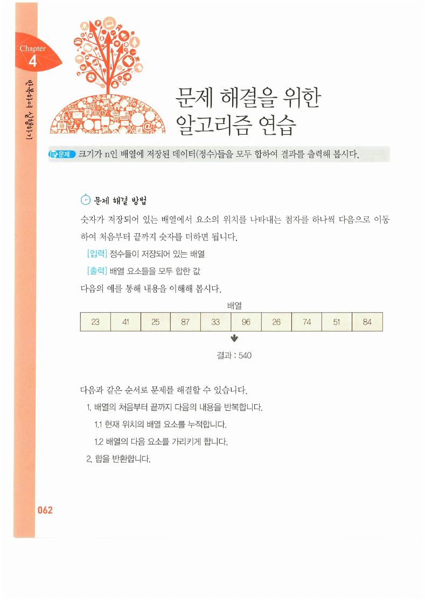
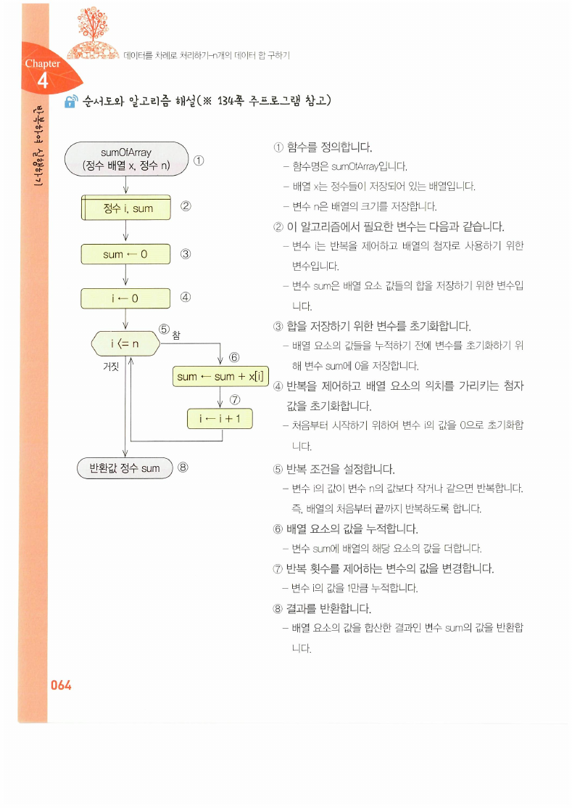
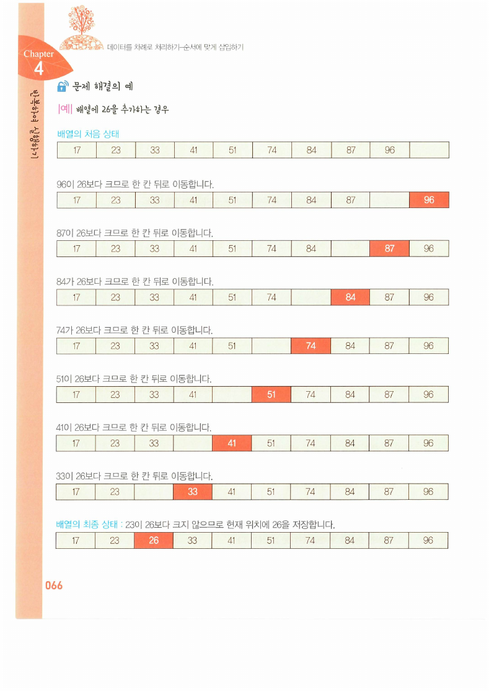
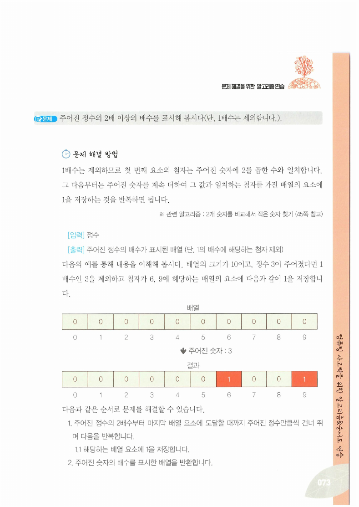
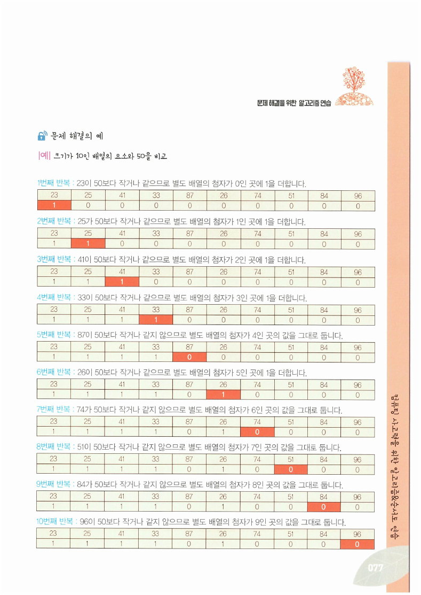
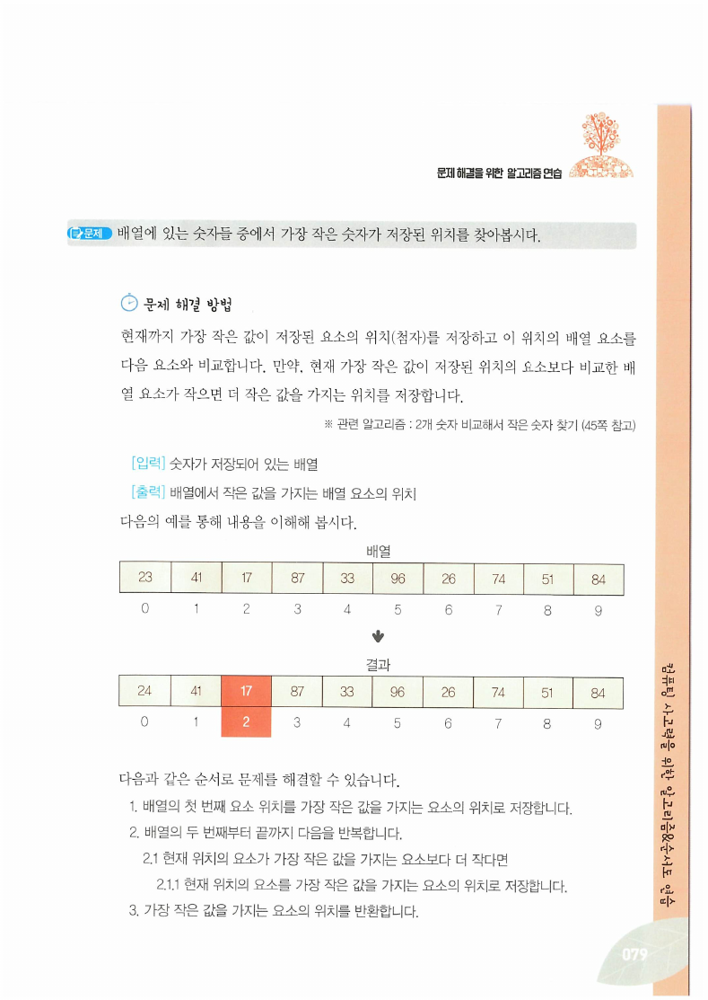
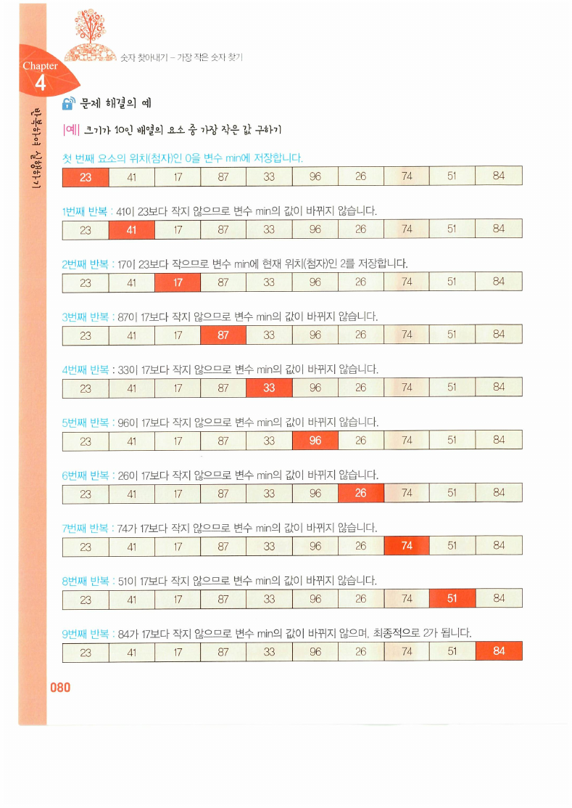
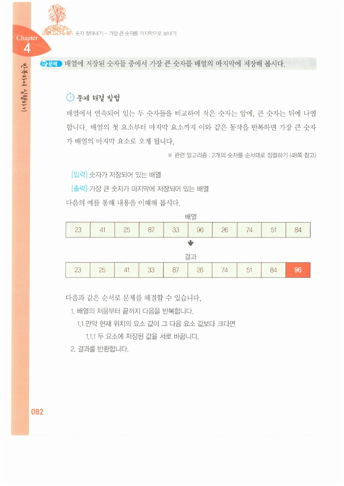

> [!abstract] 이 자료의 알고리즘은 전부 같은 모양이다
> 23장에 아홉 개의 문제가 들어 있는데, 순서도를 겹쳐 보면 거의 같다. **반복 상자 하나, 그 안에 처리 한두 개.** 배열을 처음부터 끝까지 한 번 훑는다는 점이 모두 같고, 훑으면서 무엇을 하느냐만 다르다.
>
> | 훑으면서 하는 일 | 문제 |
> | --- | --- |
> | 더한다 | 합계(062~064쪽), 1부터 n까지의 합(068~069쪽) |
> | 밀어낸다 | 정렬된 배열에 삽입(065~067쪽) |
> | 값을 순환시킨다 | 피보나치 수열(070~072쪽) |
> | 표시한다 | 배수 표시(073~075쪽), 임계값 표시(076~078쪽) |
> | 기억해 둔다 | 최솟값의 위치(079~081쪽) |
> | 이웃과 비교해 바꾼다 | 최댓값을 뒤로 보내기(082~084쪽) |
>
> 형태가 같다는 것은 **틀릴 수 있는 곳도 같다**는 뜻이다. 이 자료에서 실제로 틀린 곳 두 군데가 모두 그 자리에 있다 — **반복의 경계**와 **배열의 값**. 그래서 이 정리는 각 문제를 나열하는 대신 "한 번 훑기"라는 하나의 골격을 세우고, 그 골격이 어디서 부러지는지를 따라간다.

읽기에 앞서 이 자료가 교재의 어느 구간인지 확인해 둔다.

> [!note] 이 발췌본의 범위
> 쪽 번호가 인쇄된 교재 스캔이며, **062~084쪽**이 남아 있다. [4장 순서도 작성 실습](./04.%20순서도%20작성%20실습.md)이 018~061쪽이었으므로 이 자료는 바로 그 뒤를 잇는다. 아래 쪽 번호는 모두 교재 인쇄 쪽수다.

---

## 골격 — 훑으면서 하나의 값을 키워 간다

062쪽의 첫 문제가 골격 전체를 보여준다.

> **문제** — 배열에 저장된 숫자들의 합을 구해 봅시다.



배열은 `23 41 25 87 33 96 26 74 51 84`이고 합은 **540**이다. 063쪽은 이것을 열 번의 반복으로 풀어 놓는다.

| 반복 | 더하는 값 | sum |
| --- | --- | --- |
| 1 | 23 | 23 |
| 2 | 41 | 64 |
| 3 | 25 | 89 |
| 4 | 87 | 176 |
| 5 | 33 | 209 |
| 6 | 96 | 305 |
| 7 | 26 | 331 |
| 8 | 74 | 405 |
| 9 | 51 | 456 |
| 10 | 84 | 540 |

여기서 **sum이 하나뿐**이라는 점이 골격이다. 배열은 열 칸이지만 결과를 담는 그릇은 하나이고, 반복이 돌 때마다 그 하나가 갱신된다. [4장 021쪽의 누적 대입](./04.%20순서도%20작성%20실습.md) `x ← x + 10`이 여기서 `sum ← sum + x[i]`가 된 것이다.

068~069쪽의 "1부터 n까지의 합"은 같은 골격에서 배열만 빠진 것이다. 원본도 이를 밝힌다 — **"※ 관련 알고리즘 : 순서도 예 – 누적 연산인 경우(21쪽 참고)"**. 입력 5 → 15, 10 → 55, 100 → 5050. 이 값 55는 [3장 20쪽의 두 방법](./03.%20알고리즘과%20프로그래밍%20언어.md)이 다투던 바로 그 값이고, 여기서는 방법 1(하나씩 더하기)을 택한다.

---

## 골격이 부러지는 첫 자리 — 반복의 경계

064쪽이 합계 알고리즘의 순서도다.



> [!warning] 원본 064쪽 — 반복 조건 `i <= n`은 배열 범위를 벗어난다
> 순서도는 `i ← 0`으로 시작해 `i <= n`인 동안 `sum ← sum + x[i]`를 반복하고 `i ← i + 1`을 한다. 해설 ④도 "변수 i의 값이 변수 n의 값보다 **작거나 같으면** 반복합니다"라고 적었다.
>
> 배열 첨자가 `0`부터 `n−1`까지인데 i가 `0`부터 `n`까지 돌면 **n+1번 반복하고, 마지막에 존재하지 않는 `x[n]`을 읽는다.** n = 10이면 11번 도는 셈이다. 그런데 바로 앞 063쪽의 예는 **10번**만 반복한다. 순서도와 예가 어긋난다.
>
> 올바른 조건은 `i < n` 이다. 같은 책의 다른 순서도들은 이것을 정확히 지킨다.
>
> - 075쪽 `markMultiple` — `j = 2*i부터 n까지`
> - 078쪽 `compareElement` — **`i = 0부터 n−1까지`**
> - 084쪽 `maximumToLast` — **`i = 0부터 n−2까지`** (해설에 "n의 값이 10이면 0부터 8까지 9번 반복"이라고 명시)
>
> 즉 이 책의 표준 표기는 준비 기호에 범위를 적는 `i = 0부터 n−1까지` 방식이고, 064쪽만 마름모 판단으로 조건을 적으면서 부등호를 틀렸다.

아래 도구로 두 조건의 차이를 확인할 수 있다. 배열은 062쪽의 값 그대로다.

```html preview h=560px
<div style="font-family:system-ui,-apple-system,sans-serif;padding:20px;color:var(--foreground)">
  <div style="display:flex;gap:8px;flex-wrap:wrap;margin-bottom:14px">
    <button id="bug" style="cursor:pointer;font:inherit;font-size:12.5px;padding:5px 12px;border-radius:var(--radius);border:1px solid var(--border);background:transparent;color:var(--foreground)">원본 064쪽 — i &lt;= n</button>
    <button id="fix" style="cursor:pointer;font:inherit;font-size:12.5px;padding:5px 12px;border-radius:var(--radius);border:1px solid var(--border);background:transparent;color:var(--foreground)">올바른 조건 — i &lt; n</button>
    <button id="go" style="cursor:pointer;font:inherit;font-size:12.5px;padding:5px 12px;border-radius:var(--radius);border:1px solid var(--chart-1);background:var(--chart-1);color:var(--primary-foreground)">한 번 더 ▶</button>
    <button id="rs" style="cursor:pointer;font:inherit;font-size:12.5px;padding:5px 12px;border-radius:var(--radius);border:1px solid var(--border);background:transparent;color:var(--foreground)">처음으로</button>
  </div>

  <div id="arr" style="display:flex;gap:4px;flex-wrap:wrap;margin-bottom:6px"></div>
  <div id="idx" style="display:flex;gap:4px;flex-wrap:wrap;margin-bottom:14px"></div>

  <div style="display:flex;gap:14px;flex-wrap:wrap">
    <div style="flex:1;min-width:160px;border:1px solid var(--border);border-radius:var(--radius);padding:11px 13px;background:var(--card)">
      <div style="font-size:11.5px;color:var(--muted-foreground)">i</div>
      <div id="iv" style="font-size:26px;font-weight:800;color:var(--chart-3)"></div>
    </div>
    <div style="flex:1;min-width:160px;border:1px solid var(--border);border-radius:var(--radius);padding:11px 13px;background:var(--card)">
      <div style="font-size:11.5px;color:var(--muted-foreground)">sum</div>
      <div id="sv" style="font-size:26px;font-weight:800;color:var(--chart-1)"></div>
    </div>
    <div style="flex:1;min-width:160px;border:1px solid var(--border);border-radius:var(--radius);padding:11px 13px;background:var(--card)">
      <div style="font-size:11.5px;color:var(--muted-foreground)">반복 횟수</div>
      <div id="cv" style="font-size:26px;font-weight:800;color:var(--chart-2)"></div>
    </div>
  </div>

  <div id="msg" style="margin-top:14px;padding:11px 13px;border:1px solid var(--border);border-radius:var(--radius);font-size:13px;line-height:1.7"></div>

  <script>
    var X = [23, 41, 25, 87, 33, 96, 26, 74, 51, 84];
    var N = X.length;
    var buggy = true, i = 0, sum = 0, cnt = 0, halted = false;
    function cond() { return buggy ? (i <= N) : (i < N); }
    function reset() { i = 0; sum = 0; cnt = 0; halted = false; draw(); }
    function draw() {
      [['bug', buggy], ['fix', !buggy]].forEach(function (p) {
        var b = document.getElementById(p[0]);
        b.style.borderColor = p[1] ? 'var(--chart-1)' : 'var(--border)';
        b.style.background = p[1] ? 'var(--chart-1)' : 'transparent';
        b.style.color = p[1] ? 'var(--primary-foreground)' : 'var(--foreground)';
      });
      var cells = '', idxs = '';
      for (var k = 0; k <= N; k++) {
        var exists = k < N;
        var here = k === i && cond() && !halted;
        cells += '<div style="min-width:40px;text-align:center;padding:7px 6px;border-radius:var(--radius);font-family:ui-monospace,Menlo,monospace;font-size:13px;' +
          'border:1px solid ' + (here ? 'var(--chart-1)' : (exists ? 'var(--border)' : 'var(--destructive)')) + ';' +
          'background:' + (here ? 'var(--chart-1)' : 'transparent') + ';' +
          'color:' + (here ? 'var(--primary-foreground)' : (exists ? 'var(--foreground)' : 'var(--destructive)')) + '">' +
          (exists ? X[k] : '?') + '</div>';
        idxs += '<div style="min-width:40px;text-align:center;font-size:11px;color:' + (exists ? 'var(--muted-foreground)' : 'var(--destructive)') + '">' + k + '</div>';
      }
      document.getElementById('arr').innerHTML = cells;
      document.getElementById('idx').innerHTML = idxs;
      document.getElementById('iv').textContent = i;
      document.getElementById('sv').textContent = sum;
      document.getElementById('cv').textContent = cnt + '회';

      var msg;
      if (halted) {
        msg = '<b style="color:var(--destructive)">배열 밖을 읽었다.</b> 첨자 ' + N + '번 칸은 존재하지 않는다. ' +
          '실제 언어에서는 쓰레기 값을 읽거나(C) 예외로 멈춘다(파이썬·자바). ' +
          '<b>' + cnt + '회</b> 반복했고 sum이 ' + sum + '에서 더는 신뢰할 수 없게 되었다.';
      } else if (!cond()) {
        msg = '반복 종료. <b>' + cnt + '회</b> 반복했고 sum = <b style="color:var(--chart-1)">' + sum + '</b>. ' +
          (cnt === 10 ? '원본 063쪽 표와 일치한다.' : '');
      } else if (i === N) {
        msg = '<b style="color:var(--destructive)">위험.</b> 조건 <code>i &lt;= n</code>이 아직 참이라 <b>' + N + '번 칸</b>을 읽으려 한다. ' +
          '한 번 더 눌러 보라.';
      } else {
        msg = 'x[' + i + '] = ' + X[i] + ' 를 더할 차례다. ' +
          '<span style="color:var(--muted-foreground)">「한 번 더」를 눌러 진행한다.</span>';
      }
      document.getElementById('msg').innerHTML = msg;
    }
    document.getElementById('bug').addEventListener('click', function () { buggy = true; reset(); });
    document.getElementById('fix').addEventListener('click', function () { buggy = false; reset(); });
    document.getElementById('rs').addEventListener('click', reset);
    document.getElementById('go').addEventListener('click', function () {
      if (halted || !cond()) { draw(); return; }
      if (i >= N) { halted = true; cnt++; draw(); return; }
      sum += X[i]; i++; cnt++; draw();
    });
    reset();
  </script>
</div>
```

> [!important] 이 실수가 흔한 이유
> 사람이 세는 방식은 "첫 번째부터 열 번째까지"이고, 배열이 세는 방식은 "0번부터 9번까지"다. `n`이 **개수**를 뜻하는지 **마지막 첨자**를 뜻하는지가 흐릿하면 부등호가 하나 어긋난다. 실제로 이 책 안에서도 두 뜻이 섞여 있다 — 073쪽은 "배열의 크기가 10"(개수)이라 하고, 075쪽 해설은 "n이 20이면 0부터 20까지에 해당"(마지막 첨자)이라 한다. 두 쪽 사이에서 `n`의 뜻이 바뀐다.
>
> [7장 배열](./07.%20C%20언어의%20변수·연산자·제어문·함수.md)의 "배열을 4개 선언할 때는 첨자를 1~4가 아닌 **0~3**을 사용"이라는 문장이 이 혼동의 뿌리를 가리킨다.

---

## 밀어내기 — 삽입은 자리를 만드는 일이다

065~067쪽은 **정렬된 배열에 새 값을 순서에 맞게 끼워 넣는** 문제다. 원본의 예는 `17 23 33 41 51 74 84 87 96`(9개)에 26을 넣는 것이다.



원본의 절차가 곧 요령이다.

> 주어진 숫자를 정렬되어 있는 배열의 **마지막 요소부터 차례로 비교**하며, 주어진 숫자보다 크면 비교한 배열 요소를 **뒤로 이동**시키는 동작을 반복하다가 배열 요소가 주어진 숫자보다 작거나 같아지면 **현재의 위치에 주어진 숫자를 저장**합니다.

앞에서부터 자리를 찾으면 안 된다. 자리를 먼저 찾아 놓아도 그 자리에 값을 넣는 순간 원래 있던 값이 [4장 027쪽의 교환 실패](./04.%20순서도%20작성%20실습.md)처럼 덮여 사라지기 때문이다. **뒤에서부터 미는 것은 항상 빈 칸으로 옮기는 것**이어서 아무것도 잃지 않는다.

066쪽의 추적을 그대로 옮기면 96 → 87 → 84 → 74 → 51 → 41 → 33이 차례로 한 칸씩 뒤로 가고, 23에서 멈춘 뒤 그 다음 칸에 26이 들어간다. 결과는 `17 23 26 33 41 51 74 84 87 96`이다.

067쪽 순서도의 반복 조건은 두 개가 And로 묶여 있다 — **현재 위치가 첫 번째 요소가 되거나** 배열 요소가 주어진 숫자보다 크지 않을 때까지. [4장 036쪽의 복합 조건](./04.%20순서도%20작성%20실습.md)이 실제로 필요해지는 첫 자리다. 두 조건 중 하나라도 깨지면 멈춰야 하는데, 하나만 검사하면 배열 앞쪽으로 넘어가 버린다.

> [!note] 이 알고리즘의 이름
> 이 절차 전체를 배열의 모든 원소에 대해 되풀이하면 **삽입 정렬**이 된다. [6장 삽입 정렬](./06.%20탐색과%20정렬%20알고리즘.md)의 안쪽 반복이 정확히 이 065~067쪽이다. 이 자료는 정렬이라는 말을 꺼내지 않고 부품만 먼저 만들어 둔다.

---

## 값의 순환 — 피보나치는 변수 세 개짜리 컨베이어다

070~072쪽의 피보나치 수열은 이 자료에서 가장 짧은 순서도인데, 앞 장과의 연결이 가장 뚜렷하다.

071쪽 그림이 `f1`, `f2`, `f3` 세 상자를 놓고 화살표로 값을 밀어 나간다.

| 회차 | f1 | f2 | f3 = f1 + f2 |
| --- | --- | --- | --- |
| 1 | 1 | 1 | 2 |
| 2 | 1 | 2 | 3 |
| 3 | 2 | 3 | 5 |
| 4 | 3 | 5 | 8 |
| 5 | 5 | 8 | 13 |
| 6 | 8 | 13 | 21 |
| 7 | 13 | 21 | 34 |
| 8 | 21 | 34 | 55 |
| 9 | 34 | 55 | — |

072쪽 순서도의 갱신 부분은 `f3 ← f1 + f2`, `f1 ← f2`, `f2 ← f3` 세 줄이고, 해설 ⑦은 이렇게 적는다 — **"덧셈 연산자를 사용한 피연산자를 순환하여 연산하기(※ 29쪽 참고)"**. 원본이 직접 [4장 029~030쪽의 값의 이동](./04.%20순서도%20작성%20실습.md)을 가리킨다.

여기서 임시 변수가 필요 없는 이유가 분명해진다. **f1의 옛 값은 더 이상 쓰이지 않으므로 덮여도 된다.** 두 값을 맞바꿀 때는 임시 변수가 필요했지만, 한 방향으로 밀어낼 때는 필요 없다. 같은 대입 세 줄이 목적에 따라 갈린다.

070쪽 표는 입력에 따른 결과를 셋 든다.

| 입력 n | 출력 |
| --- | --- |
| 10 | 1, 1, 2, 3, 5, 8 |
| 30 | 1, 1, 2, 3, 5, 8, 13, 21 |
| 50 | 1, 1, 2, 3, 5, 8, 13, 21, 34 |

반복 조건이 `f1 < n`이므로 **출력되는 마지막 값은 n을 넘지 않는 최대 항**이다. n = 50에서 34까지만 나오는 것은 다음 항 55가 조건을 깨기 때문이다.

> [!note] 원본 070쪽 표의 사소한 조판 오류
> 입력 10의 결과가 `1, 1, 2, 3, 5 8` 로 적혀 있다 — **5와 8 사이 쉼표가 빠졌다.** 값 자체는 맞다.

---

## 표시하기 — 답을 배열에 적어 둔다

073~078쪽의 두 문제는 결과를 **원래 배열 옆의 또 다른 배열에 0과 1로 적는다**. 이 방식이 뒤에서 크게 쓰인다.

### 배수 표시 (073~075쪽)



크기 10인 0으로 채운 배열에 3이 주어지면 첨자 **6, 9**에 1을 적는다. 1배수인 3은 제외하므로 **2배수부터** 시작한다. 074쪽은 n = 19로 범위를 넓혀 6, 9, 12, 15, 18을 표시한다.

075쪽 순서도의 반복 상자가 이 알고리즘의 전부다 — **`j = 2*i부터 n까지 i씩 증가`**. 한 칸씩이 아니라 **i칸씩 건너뛴다**는 것이 여기서 처음 나오는 기술이다.

> [!tip] 이것이 에라토스테네스의 체다
> 이 절차를 i = 2, 3, 4 …에 대해 반복하면 남는 것이 소수다. [6장](./06.%20탐색과%20정렬%20알고리즘.md)이 정확히 그 반복을 씌워 소수를 구한다. 이 자료는 부품만 만들고 이름을 붙이지 않는다 — 삽입 정렬 때와 같은 방식이다.

### 임계값 표시 (076~078쪽)



배열 `23 25 41 33 87 26 74 51 84 96`의 각 요소를 50과 비교해 작거나 같으면 별도 배열의 같은 위치에 1을 더한다. 결과는 `1 1 1 1 0 1 0 0 0 0`이다.

078쪽 순서도의 함수명은 **`compareElement`** 이고 매개변수가 넷이다 — `정수 배열 x, 정수 배열 r, 정수 n, 정수 k`. 반복 범위는 `i = 0부터 n−1까지`로 **정확히** 적혀 있다.

해설 ⑤에 붙은 괄호가 흥미롭다 — "배열 r의 요소에 배열 x의 해당 요소와 같은 위치에 1을 더합니다(**※ 더하지 않고 1을 저장해도 됩니다.**)". 이번 문제에서는 각 위치를 한 번씩만 방문하므로 `r[i] ← r[i] + 1`과 `r[i] ← 1`이 같다. 그런데 굳이 **더하기**로 써 둔 이유가 [6장 순위 매기기](./06.%20탐색과%20정렬%20알고리즘.md)에서 드러난다. 거기서는 같은 위치를 여러 번 방문하며 **몇 번 이겼는지를 세어야** 하고, 그때는 반드시 더하기여야 한다. 이 함수는 재사용을 염두에 두고 설계된 것이다.

---

## 기억해 두기 — 최솟값은 값이 아니라 위치다

079~081쪽의 문제 진술이 정확하다.

> 배열에 있는 숫자들 중에서 가장 작은 숫자가 **저장된 위치**를 찾아봅시다.



> [!warning] 원본 079쪽 — 결과 배열의 첫 요소가 `24`로 잘못 인쇄되어 있다
> 위쪽 "배열" 행은 `23 41 17 87 33 96 26 74 51 84`인데, 아래쪽 "결과" 행은 첫 칸이 **`24`** 로 적혀 있다. 이 알고리즘은 배열을 바꾸지 않고 최솟값의 **위치**만 반환하므로, 결과 행의 값은 입력과 같아야 한다.
>
> 바로 다음 080쪽의 추적 그림이 같은 배열을 열 번 보여주는데 **전부 23**이므로, 079쪽 한 곳만 오식이다. 결과 행에서 실제로 의미 있는 표시는 첨자 **2**(값 17)가 강조되어 있다는 점이며, 그것은 맞다.



080쪽 추적의 요점은 **min에 값이 아니라 첨자가 들어간다**는 것이다. 첫 요소의 위치 0을 min에 넣고 시작해, 더 작은 값을 만나면 그 **위치**를 min에 저장한다. 2번째 반복에서 17을 만나 min이 2가 되고, 그 뒤로는 바뀌지 않는다.

081쪽 순서도의 반복 범위도 `i = 1부터 n−1까지`로 정확하다. 0번은 이미 초깃값으로 썼으므로 1부터 시작하는 것이다.

> [!note] 원본 081쪽 — 함수명 철자
> 순서도의 단말 기호에는 **`findMinimun`** 이라고 적혀 있다. 해설 ①은 "함수명은 **findMinimum**입니다"라고 쓰므로, 그림 쪽의 마지막 글자가 오타다.

값이 아니라 위치를 반환하는 설계는 [6장 선택 정렬](./06.%20탐색과%20정렬%20알고리즘.md)에서 값을 발휘한다. 최솟값을 앞으로 보내려면 **어디 있는지**를 알아야 교환할 수 있기 때문이다. 값만 알아서는 정렬을 만들 수 없다.

---

## 이웃과 비교해 바꾸기 — 정렬의 한 걸음

082~084쪽이 이 자료의 마지막 문제이자 [6장](./06.%20탐색과%20정렬%20알고리즘.md)으로 넘어가는 다리다.

> **문제** — 배열의 요소 중 가장 큰 값을 마지막 요소에 저장해 봅시다.



배열 `23 41 25 87 33 96 26 74 51 84`에 대해 이웃한 두 값을 왼쪽부터 아홉 번 비교하며, 앞이 더 크면 바꾼다.

| 회차 | 비교 | 결과 |
| --- | --- | --- |
| 1 | 23 vs 41 | 그대로 |
| 2 | 41 vs 25 | 바꿈 |
| 3 | 41 vs 87 | 그대로 |
| 4 | 87 vs 33 | 바꿈 |
| 5 | 87 vs 96 | 그대로 |
| 6~9 | 96 vs 26·74·51·84 | 매번 바꿈 |

최종 결과는 `23 25 41 33 87 26 74 51 84 96`이다. **96이 맨 뒤로 밀려갔다.** 한 번 커진 값을 계속 데리고 가기 때문에, 한 바퀴만 돌아도 최댓값의 자리는 확정된다.

084쪽 순서도의 함수명은 **`maximumToLast`** 이고, 반복 범위가 `i = 0부터 n−2까지`다. 해설도 "n의 값이 10이면 0부터 8까지 9번 반복"이라고 못 박는다. **마지막 원소는 짝이 없으므로 n−2에서 멈춘다** — 064쪽에서 틀렸던 그 경계를 여기서는 정확히 잡았다.

```html preview h=580px
<div style="font-family:system-ui,-apple-system,sans-serif;padding:20px;color:var(--foreground)">
  <div style="display:flex;gap:8px;flex-wrap:wrap;margin-bottom:14px">
    <button id="one" style="cursor:pointer;font:inherit;font-size:12.5px;padding:5px 12px;border-radius:var(--radius);border:1px solid var(--chart-1);background:var(--chart-1);color:var(--primary-foreground)">한 번 비교 ▶</button>
    <button id="all" style="cursor:pointer;font:inherit;font-size:12.5px;padding:5px 12px;border-radius:var(--radius);border:1px solid var(--border);background:transparent;color:var(--foreground)">끝까지</button>
    <button id="rst2" style="cursor:pointer;font:inherit;font-size:12.5px;padding:5px 12px;border-radius:var(--radius);border:1px solid var(--border);background:transparent;color:var(--foreground)">처음으로</button>
  </div>

  <div id="row" style="display:flex;gap:4px;flex-wrap:wrap;margin-bottom:6px"></div>
  <div id="marks" style="display:flex;gap:4px;flex-wrap:wrap;height:18px;margin-bottom:12px"></div>

  <div id="log" style="font-size:12.5px;line-height:1.9;max-height:170px;overflow:auto;background:var(--card);border:1px solid var(--border);border-radius:var(--radius);padding:10px 12px"></div>
  <div id="fin" style="margin-top:12px;padding:11px 13px;border:1px solid var(--border);border-radius:var(--radius);font-size:13px;line-height:1.7"></div>

  <script>
    var A0 = [23, 41, 25, 87, 33, 96, 26, 74, 51, 84];
    var A = A0.slice(), i = 0, logs = [];
    function reset() { A = A0.slice(); i = 0; logs = []; draw(); }
    function draw() {
      document.getElementById('row').innerHTML = A.map(function (v, k) {
        var act = (k === i || k === i + 1) && i < A.length - 1;
        var last = i >= A.length - 1 && k === A.length - 1;
        return '<div style="min-width:42px;text-align:center;padding:8px 6px;border-radius:var(--radius);font-family:ui-monospace,Menlo,monospace;font-size:13.5px;' +
          'border:1px solid ' + (last ? 'var(--chart-2)' : (act ? 'var(--chart-1)' : 'var(--border)')) + ';' +
          'background:' + (last ? 'var(--chart-2)' : (act ? 'var(--chart-1)' : 'transparent')) + ';' +
          'color:' + ((last || act) ? 'var(--primary-foreground)' : 'var(--foreground)') + '">' + v + '</div>';
      }).join('');
      document.getElementById('marks').innerHTML = A.map(function (v, k) {
        return '<div style="min-width:42px;text-align:center;font-size:11px;color:var(--muted-foreground)">' +
          ((k === i && i < A.length - 1) ? '↑ i' : ((k === i + 1 && i < A.length - 1) ? '↑ i+1' : '')) + '</div>';
      }).join('');
      document.getElementById('log').innerHTML = logs.length ? logs.join('') :
        '<span style="color:var(--muted-foreground)">「한 번 비교」를 눌러 진행한다. 반복 범위는 i = 0부터 n−2까지, 즉 0~8의 9회다.</span>';
      document.getElementById('fin').innerHTML = (i >= A.length - 1)
        ? '9회 비교가 끝났다. 최댓값 <b style="color:var(--chart-2)">96</b>이 마지막 칸에 있다. ' +
          '결과 배열: <code>' + A.join(' ') + '</code><br>' +
          '<span style="color:var(--muted-foreground)">원본 083쪽의 결과와 같다. 이 한 바퀴를 배열을 줄여 가며 되풀이하면 버블 정렬이 된다.</span>'
        : '<span style="color:var(--muted-foreground)">비교 ' + (i + 1) + '회차 — x[' + i + '] 와 x[' + (i + 1) + '] 을 견준다.</span>';
    }
    function step() {
      if (i >= A.length - 1) return false;
      var a = A[i], b = A[i + 1], sw = a > b;
      if (sw) { A[i] = b; A[i + 1] = a; }
      logs.push('<div><b>' + (i + 1) + '번째</b> : ' + a + ' vs ' + b + ' → ' +
        (sw ? '<b style="color:var(--chart-1)">바꿈</b>' : '<span style="color:var(--muted-foreground)">그대로 둠</span>') + '</div>');
      i++;
      return true;
    }
    document.getElementById('one').addEventListener('click', function () { step(); draw(); });
    document.getElementById('all').addEventListener('click', function () { while (step()) { } draw(); });
    document.getElementById('rst2').addEventListener('click', reset);
    reset();
  </script>
</div>
```

---

## 정리

> [!tip] 이 장의 골격
>
> 1. **아홉 문제가 모두 "배열을 한 번 훑는다".** 훑으면서 더하거나(합계), 밀거나(삽입), 순환시키거나(피보나치), 표시하거나(배수·임계값), 기억하거나(최솟값 위치), 이웃과 바꾼다(최댓값 보내기).
> 2. **그래서 승부는 반복의 경계에서 갈린다.** 064쪽의 `i <= n`이 틀렸고, 078쪽의 `0부터 n−1까지`와 084쪽의 `0부터 n−2까지`는 맞다. 같은 책 안에서 갈렸다.
> 3. **덮어쓰기가 도구가 되는 곳과 함정이 되는 곳이 다르다.** 삽입은 뒤에서부터 밀어 아무것도 잃지 않고, 피보나치는 옛 값을 버려도 되므로 임시 변수가 없다. [4장 027쪽의 교환](./04.%20순서도%20작성%20실습.md)만이 임시 변수를 요구했다.
> 4. **답을 배열에 적어 두면 재사용된다.** `compareElement`가 굳이 `r[i] ← r[i] + 1`로 쓰인 이유는 [6장 순위 매기기](./06.%20탐색과%20정렬%20알고리즘.md)에서 밝혀진다.
> 5. **여기서 만든 것은 모두 부품이다.** 삽입 → 삽입 정렬, 배수 표시 → 에라토스테네스의 체, 최솟값 위치 → 선택 정렬, 최댓값 보내기 → 버블 정렬. 이름은 다음 장에서 붙는다.

[6장](./06.%20탐색과%20정렬%20알고리즘.md)은 이 부품들에 이름을 붙이고, 여기에 하나를 더한다 — **미리 정렬해 두면 나중이 싸진다**는 발상이다.

---

### 근거 자료

강의 원본 `알고리즘연습1.pdf`(23쪽, 교재 062~084쪽 발췌)에 근거한다. 이 자료는 **23쪽 전체가 텍스트 추출이 되지 않는 이미지 페이지**여서 렌더 이미지를 한 장씩 확인해 정리했다.

인용한 슬라이드는 062쪽(합계 문제와 배열), 064쪽(합계 순서도), 066쪽(삽입 과정), 073쪽(배수 표시 문제), 077쪽(임계값 표시 추적), 079쪽(최솟값 위치 문제), 080쪽(최솟값 추적), 082쪽(최댓값 보내기 한 패스)이다.

인터렉티브에 사용한 수치는 모두 원본 값 그대로다. 배열 `23 41 25 87 33 96 26 74 51 84`와 합계 540, 반복별 누적합(23·64·89·176·209·305·331·405·456·540)은 062~063쪽 값이며 파이썬으로 대조했다. 최댓값 보내기 한 패스의 결과 `23 25 41 33 87 26 74 51 84 96`도 파이썬 시뮬레이션이 083쪽 그림과 완전히 일치함을 확인했다. 삽입·피보나치·배수 표시·임계값 표시의 수치는 각각 066·071·074·077쪽 표에서 옮겼다.

이 자료에서 발견한 원본 오류는 세 건이다 — **064쪽 반복 조건 `i <= n`**(같은 책 078·084쪽과 상충), **079쪽 결과 배열 첫 요소 `24`**(입력은 23, 080쪽과 상충), **081쪽 함수명 `findMinimun`**(해설은 findMinimum). 그리고 070쪽 표의 쉼표 누락 한 곳을 함께 적어 두었다. 각각 본문 Callout에 쪽수와 근거를 밝혔다.
