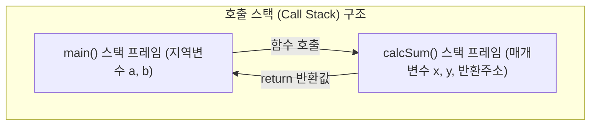

변수(Variable)는 데이터를 저장하는 이름 붙은 메모리 공간이며, 배열(Array)은 동일한 타입의 변수들을 연속된 공간에 묶어놓은 자료형이다. 함수(Function)는 특정 기능을 수행하는 독립적인 코드 블록으로 재사용성과 모듈화를 가능하게 한다.

> [!IMPORTANT]
>
> - **배열 인덱스**: 0부터 시작($0 \sim N-1$). 범위를 벗어난 인덱스 접근은 쓰레기 값 읽기 또는 세그멘테이션 오류 유발.
> - **값에 의한 호출(Call by Value)**: 실인자의 값을 복사하여 매개변수에 전달하므로, 피호출 함수 내부에서 매개변수를 수정해도 호출자 변수의 원본은 변하지 않는다.

---

## 1. 1차원 배열 메모리 & 인덱스 인터랙티브 시각화

배열 크기와 인덱스를 조작하며 연속된 메모리 주소 상에서 각 원소가 어떻게 저장되고 참조되는지 직관적으로 파악할 수 있다.

```html preview
<div style="font-family:system-ui,-apple-system,sans-serif;padding:18px;background:var(--card);color:var(--card-foreground);border:1px solid var(--border);border-radius:var(--radius);max-width:100%">
  <!-- 배열 인덱스 조작 바 -->
  <div style="display:flex;gap:12px;align-items:center;margin-bottom:14px;flex-wrap:wrap">
    <label for="arr-idx-range" style="font-size:13px;font-weight:600">접근 인덱스 (0 ~ 4):</label>
    <input id="arr-idx-range" type="range" min="0" max="4" value="2" style="width:140px;accent-color:var(--primary)" />
    <span id="arr-idx-badge" style="font-size:13px;font-weight:700;color:var(--primary);padding:3px 8px;background:var(--border);border-radius:4px">arr[2]</span>
    <input id="arr-edit-val" type="number" value="77" style="width:70px;padding:5px 8px;border:1px solid var(--border);border-radius:var(--radius);background:var(--background);color:var(--foreground);font-size:13px" />
    <button id="arr-btn-set" style="padding:6px 12px;background:var(--chart-1);color:#fff;border:none;border-radius:var(--radius);font-weight:600;cursor:pointer;font-size:12px">값 대입</button>
  </div>

  <!-- 배열 시각화 슬롯 -->
  <div id="arr-slots" style="display:flex;gap:8px;justify-content:center;margin-bottom:16px;overflow-x:auto;padding:10px 0"></div>

  <!-- 메모리 상세 카드 -->
  <div style="background:var(--background);border:1px solid var(--border);border-radius:var(--radius);padding:12px;font-size:12px;line-height:1.6">
    <div><strong>기본 주소 (Base Address):</strong> <code style="color:var(--chart-1)">0x1000</code> (int형, 각 4 Bytes 차지)</div>
    <div><strong>계산된 물리 주소:</strong> <span id="arr-mem-addr" style="font-family:monospace;font-weight:700;color:var(--chart-2)">0x1008</span> (<code id="arr-formula">0x1000 + 2 * 4</code>)</div>
    <div id="arr-desc" style="color:var(--muted-foreground);margin-top:4px">배열의 인덱스 연산 `arr[i]`는 내부적으로 `*(arr + i)` 포인터 주소 연산으로 변환되어 즉시 참조됩니다.</div>
  </div>
</div>

<script>
(function() {
  var arrData = [10, 25, 77, 42, 99];
  var baseAddr = 0x1000;
  var elemSize = 4; // 4 bytes for int

  var range = document.getElementById('arr-idx-range');
  var badge = document.getElementById('arr-idx-badge');
  var editVal = document.getElementById('arr-edit-val');
  var btnSet = document.getElementById('arr-btn-set');
  var slots = document.getElementById('arr-slots');
  var memAddr = document.getElementById('arr-mem-addr');
  var formula = document.getElementById('arr-formula');

  function render() {
    var curIdx = parseInt(range.value, 10);
    badge.textContent = 'arr[' + curIdx + ']';
    editVal.value = arrData[curIdx];

    var calcAddr = baseAddr + curIdx * elemSize;
    memAddr.textContent = '0x' + calcAddr.toString(16).toUpperCase();
    formula.textContent = '0x' + baseAddr.toString(16).toUpperCase() + ' + ' + curIdx + ' * ' + elemSize;

    slots.innerHTML = '';
    arrData.forEach(function(val, idx) {
      var isSelected = (idx === curIdx);
      var box = document.createElement('div');
      box.style.width = '70px';
      box.style.border = '2px solid ' + (isSelected ? 'var(--chart-1)' : 'var(--border)');
      box.style.borderRadius = '6px';
      box.style.background = isSelected ? 'var(--chart-1)' : 'var(--card)';
      box.style.color = isSelected ? '#fff' : 'var(--foreground)';
      box.style.textAlign = 'center';
      box.style.padding = '8px 4px';
      box.style.cursor = 'pointer';

      box.innerHTML = '<div style="font-size:10px;opacity:0.8">arr[' + idx + ']</div>' +
                      '<div style="font-size:18px;font-weight:700;margin:4px 0">' + val + '</div>' +
                      '<div style="font-size:9px;font-family:monospace;opacity:0.7">0x' + (baseAddr + idx * elemSize).toString(16).toUpperCase() + '</div>';

      box.addEventListener('click', function() {
        range.value = idx;
        render();
      });

      slots.appendChild(box);
    });
  }

  range.addEventListener('input', render);
  btnSet.addEventListener('click', function() {
    var idx = parseInt(range.value, 10);
    var v = parseInt(editVal.value, 10) || 0;
    arrData[idx] = v;
    render();
  });

  render();
})();
</script>
```

---

## 2. 변수 유효 범위 (Scope)와 생명주기 (Lifetime)

| 변수 종류 | 선언 위치 | 유효 범위 (Scope) | 메모리 영역 & 생명주기 |
| :--- | :--- | :--- | :--- |
| **지역 변수 (Local)** | 함수 또는 블록 `{}` 내부 | 선언된 블록 내부에서만 유효 | **스택(Stack)** / 블록 진입 시 생성, 탈출 시 소멸 |
| **전역 변수 (Global)** | 모든 함수 외부 | 프로그램 전체 소스 파일 | **데이터(Data/BSS)** / 프로그램 시작 시 생성, 종료 시 소멸 |
| **매개 변수 (Parameter)** | 함수 정의의 소괄호 `()` 내부 | 함수 내부에서 지역 변수처럼 취급 | **스택(Stack)** / 함수 호출 시 전달, 반환 시 소멸 |

---

## 3. 함수 호출과 Call Stack 프레임


