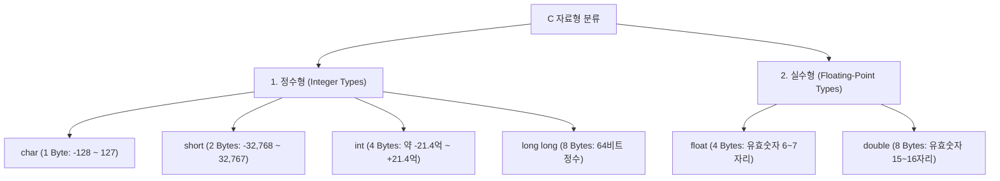
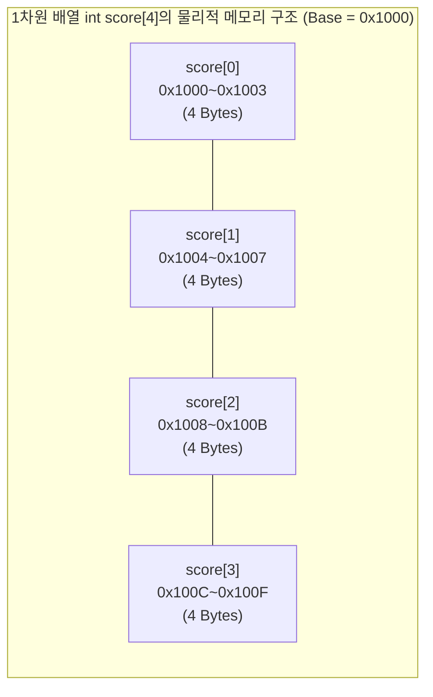
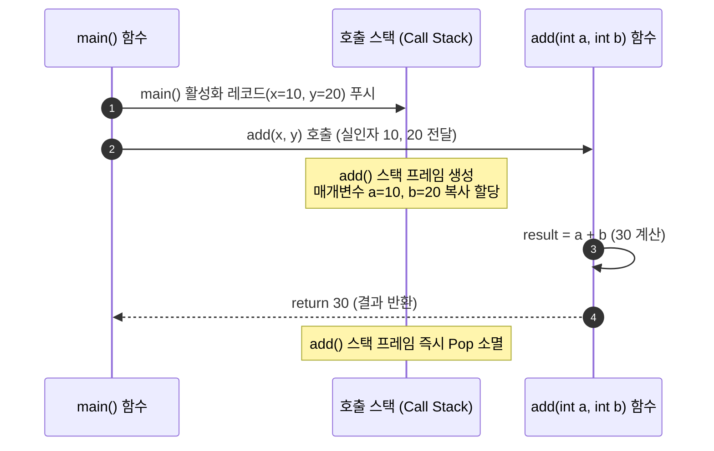

> [!abstract] 핵심 요약
> **변수(Variable)**는 데이터 값을 저장하기 위해 이름을 부여한 메모리 공간이며, **배열(Array)**은 동일한 자료형의 원소들이 메모리에 연속적으로 할당된 고정 길이 컨테이너이다.
> 함수는 입출력이 명확한 단위 기능의 **모듈화(Modularization)**를 제공하며, 함수 호출 시 런타임에 **스택 프레임(Stack Frame)**이 동적으로 생성(Push)되고 반환 시 해제(Pop)된다.

---

## 1. C 기본 자료형과 메모리 점유 크기



---

## 2. 1차원 및 2차원 배열의 연속 메모리 선형화

배열의 가장 핵심적인 특징은 **모든 원소가 메모리 공간상에 빈틈없이 연속(Contiguous)하여 저장**된다는 점이다.



### 2차원 배열의 행 우선(Row-Major) 메모리 주소 계산 공식

$M \times N$ 크기의 2차원 배열 `int arr[M][N]`에서 원소 `arr[i][j]`의 실제 메모리 바이트 주소는 다음과 같이 계산된다:

$$\text{Address}(\text{arr}[i][j]) = \text{Base Address} + (i \times N + j) \times \text{sizeof(Type)}$$

- $\text{Base Address}$: 배열의 시작 주소 (`&arr[0][0]`)
- $i$: 행 인덱스 ($0 \le i < M$)
- $j$: 열 인덱스 ($0 \le j < N$)
- $N$: 전체 열(Column)의 개수
- $\text{sizeof(Type)}$: 단위 원소의 바이트 크기 (예: `int`는 4 Bytes)

---

## 3. 함수의 스택 프레임과 매개변수 전달 (Call by Value)



---

## 4. 실시간 2차원 배열 행 우선(Row-Major) 메모리 주소 계산기

```html preview
<div style="font-family:system-ui,-apple-system,sans-serif;padding:20px;background:var(--card);color:var(--card-foreground);border:1px solid var(--border);border-radius:var(--radius)">
  <div style="font-size:16px;font-weight:700;margin-bottom:14px;color:var(--primary);display:flex;align-items:center;gap:8px">
    <span>📐 2차원 배열 (M×N) 행 우선 메모리 선형화 주소 계산기</span>
  </div>

  <div style="display:grid;grid-template-columns:repeat(4, 1fr);gap:8px;margin-bottom:14px">
    <div>
      <label style="font-size:11px;font-weight:600;color:var(--muted-foreground)">행 개수 (M)</label>
      <input id="rowsIn" type="number" min="1" max="5" value="3" style="width:100%;padding:6px;background:var(--background);color:var(--foreground);border:1px solid var(--border);border-radius:var(--radius);font-weight:700" />
    </div>
    <div>
      <label style="font-size:11px;font-weight:600;color:var(--muted-foreground)">열 개수 (N)</label>
      <input id="colsIn" type="number" min="1" max="5" value="4" style="width:100%;padding:6px;background:var(--background);color:var(--foreground);border:1px solid var(--border);border-radius:var(--radius);font-weight:700" />
    </div>
    <div>
      <label style="font-size:11px;font-weight:600;color:var(--muted-foreground)">타깃 행 (i)</label>
      <input id="targetI" type="number" min="0" max="4" value="1" style="width:100%;padding:6px;background:var(--background);color:var(--foreground);border:1px solid var(--border);border-radius:var(--radius);font-weight:700" />
    </div>
    <div>
      <label style="font-size:11px;font-weight:600;color:var(--muted-foreground)">타깃 열 (j)</label>
      <input id="targetJ" type="number" min="0" max="4" value="2" style="width:100%;padding:6px;background:var(--background);color:var(--foreground);border:1px solid var(--border);border-radius:var(--radius);font-weight:700" />
    </div>
  </div>

  <div style="padding:12px;background:var(--background);border:1px solid var(--border);border-radius:var(--radius);margin-bottom:12px">
    <div style="font-size:11px;font-weight:700;color:var(--chart-1);margin-bottom:8px">2D 그리드 및 메모리 오프셋 시각화:</div>
    <div id="gridContainer" style="display:grid;gap:4px"></div>
  </div>

  <div style="padding:10px;background:var(--background);border:1px solid var(--primary);border-radius:var(--radius);font-size:12px">
    <span style="font-weight:700;color:var(--primary)">주소 계산 수식: </span>
    <span id="formulaText" style="font-family:monospace;font-weight:700;color:var(--foreground)"></span>
  </div>

  <script>
    var rIn = document.getElementById('rowsIn');
    var cIn = document.getElementById('colsIn');
    var tiIn = document.getElementById('targetI');
    var tjIn = document.getElementById('targetJ');
    var grid = document.getElementById('gridContainer');
    var fOut = document.getElementById('formulaText');

    function renderGrid() {
      var R = parseInt(rIn.value) || 3;
      var C = parseInt(cIn.value) || 4;
      var ti = parseInt(tiIn.value) || 0;
      var tj = parseInt(tjIn.value) || 0;

      if (ti >= R) ti = R - 1;
      if (tj >= C) tj = C - 1;

      grid.style.gridTemplateColumns = 'repeat(' + C + ', 1fr)';
      grid.innerHTML = '';

      var baseAddr = 0x1000;
      var elementSize = 4; // int 4 bytes

      for (var i = 0; i < R; i++) {
        for (var j = 0; j < C; j++) {
          var isTarget = (i === ti && j === tj);
          var offset = (i * C + j);
          var addr = baseAddr + offset * elementSize;
          var hexAddr = '0x' + addr.toString(16).toUpperCase();

          var cell = document.createElement('div');
          cell.style.cssText = 'padding:6px;text-align:center;border-radius:4px;border:1px solid ' + (isTarget ? 'var(--primary)' : 'var(--border)') + ';background:' + (isTarget ? 'var(--primary)' : 'var(--card)') + ';color:' + (isTarget ? '#fff' : 'var(--card-foreground)');
          cell.innerHTML = '<div style="font-size:11px;font-weight:700">[' + i + '][' + j + ']</div><div style="font-size:9px;opacity:0.8">' + hexAddr + '</div>';
          grid.appendChild(cell);
        }
      }

      var targetOffset = ti * C + tj;
      var targetAddr = baseAddr + targetOffset * elementSize;
      fOut.textContent = "Address(arr[" + ti + "][" + tj + "]) = 0x1000 + (" + ti + " × " + C + " + " + tj + ") × 4 = 0x1000 + " + (targetOffset * 4) + " = 0x" + targetAddr.toString(16).toUpperCase() + " (선형 오프셋 인덱스: " + targetOffset + ")";
    }

    rIn.addEventListener('input', renderGrid);
    cIn.addEventListener('input', renderGrid);
    tiIn.addEventListener('input', renderGrid);
    tjIn.addEventListener('input', renderGrid);
    renderGrid();
  </script>
</div>
```
