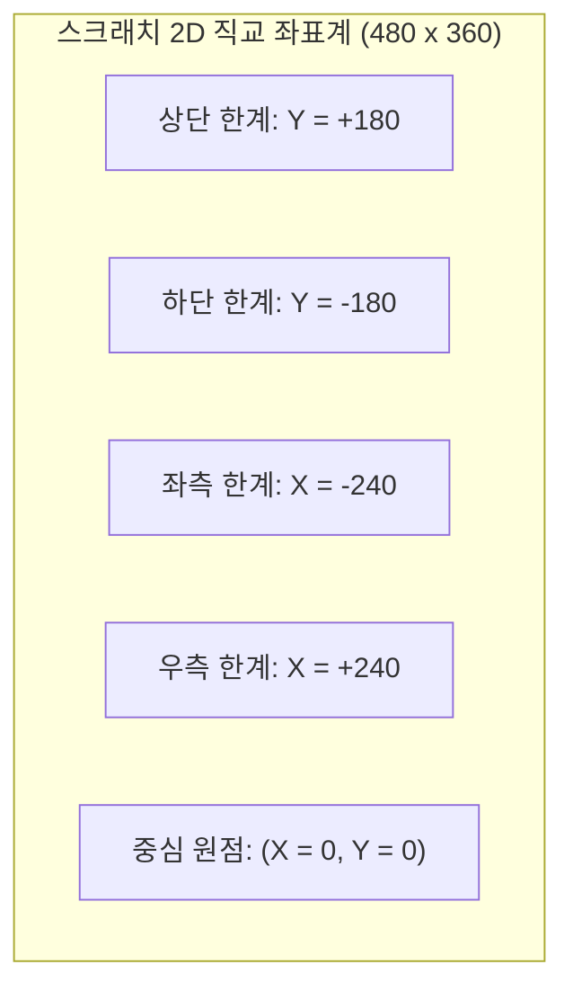
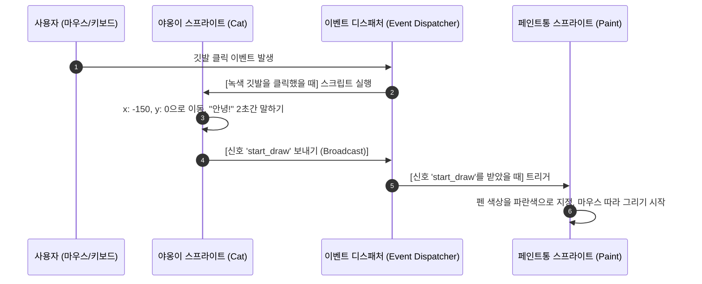

> [!abstract] 핵심 요약
> **스크래치(Scratch)**는 MIT 미디어랩에서 개발한 블록 기반 시각적 프로그래밍 언어로, 문법 오류(Syntax Error)를 원천 차단하고 논리적 제어 구조 설계에 집중할 수 있도록 돕는다.
> 프로그램 실행은 순차적 메인 함수가 아닌 사용자의 입력이나 시스템 신호에 반응하는 **이벤트 기반 프로그래밍(Event-Driven Programming)**과 스프라이트 간의 **메시지 브로드캐스팅(Message Broadcasting)** 메커니즘을 기반으로 동작한다.

---

## 1. 스크래치 3.0 무대(Stage) 2D 직교 좌표계

스크래치의 메인 무대는 중심점 $(0, 0)$을 기준으로 가로 480 픽셀, 세로 360 픽셀의 데카르트 직교 좌표계(Cartesian Coordinates)로 구성된다.



$$\text{X축 범위}: -240 \le X \le +240 \quad (\text{총 } 480 \text{ 픽셀})$$
$$\text{Y축 범위}: -180 \le Y \le +180 \quad (\text{총 } 360 \text{ 픽셀})$$

---

## 2. 이벤트 기반 아키텍처와 메시지 브로드캐스팅



---

## 3. 실시간 스크래치 인터랙티브 캔버스 & 펜 그리기 시뮬레이터

```html preview
<div style="font-family:system-ui,-apple-system,sans-serif;padding:20px;background:var(--card);color:var(--card-foreground);border:1px solid var(--border);border-radius:var(--radius)">
  <div style="font-size:16px;font-weight:700;margin-bottom:14px;color:var(--primary);display:flex;align-items:center;gap:8px">
    <span>🐱 스크래치 무대(480×360) 좌표 추적 및 펜(Pen) 드로잉 시뮬레이터</span>
  </div>

  <div style="display:flex;gap:8px;margin-bottom:10px;align-items:center;flex-wrap:wrap">
    <button id="flagBtn" style="padding:6px 12px;background:#22c55e;color:#fff;border:none;border-radius:var(--radius);font-size:12px;font-weight:700;cursor:pointer">🚩 깃발 클릭 (Start)</button>
    <button id="clearBtn" style="padding:6px 12px;background:var(--destructive);color:#fff;border:none;border-radius:var(--radius);font-size:12px;font-weight:700;cursor:pointer">모두 지우기</button>
    <div style="font-size:12px;color:var(--muted-foreground);margin-left:auto">
      <span>현재 좌표: </span>
      <span id="coordDisplay" style="font-family:monospace;font-weight:700;color:var(--primary)">X: 0, Y: 0</span>
    </div>
  </div>

  <div style="position:relative;width:100%;height:220px;background:var(--background);border:1px solid var(--border);border-radius:var(--radius);overflow:hidden;cursor:crosshair">
    <canvas id="scratchCanvas" width="480" height="220" style="width:100%;height:100%;display:block"></canvas>
    <div id="catSprite" style="position:absolute;top:50%;left:50%;transform:translate(-50%,-50%);font-size:24px;pointer-events:none;transition:left 0.1s, top 0.1s">🐱</div>
  </div>

  <div style="margin-top:10px;font-size:11px;color:var(--muted-foreground)">
    💡 캔버스 위에서 마우스를 드래그하면 펜 블록(Pen Down)이 실행되어 선을 그리며, 스크래치 2D 좌표계 $(X, Y)$로 실시간 변환됩니다.
  </div>

  <script>
    var canvas = document.getElementById('scratchCanvas');
    var ctx = canvas.getContext('2d');
    var cat = document.getElementById('catSprite');
    var coordOut = document.getElementById('coordDisplay');
    var flag = document.getElementById('flagBtn');
    var clr = document.getElementById('clearBtn');

    var isDrawing = false;
    var prevX = 0, prevY = 0;

    function toScratchCoord(canvasX, canvasY) {
      var rect = canvas.getBoundingClientRect();
      var normX = (canvasX / rect.width) * 480 - 240;
      var normY = 110 - (canvasY / rect.height) * 220;
      return { x: Math.round(normX), y: Math.round(normY) };
    }

    function clearCanvas() {
      ctx.clearRect(0, 0, canvas.width, canvas.height);
      ctx.strokeStyle = '#3b82f6';
      ctx.lineWidth = 3;
      ctx.lineCap = 'round';
    }

    canvas.addEventListener('mousedown', function(e) {
      isDrawing = true;
      var rect = canvas.getBoundingClientRect();
      prevX = (e.clientX - rect.left) * (canvas.width / rect.width);
      prevY = (e.clientY - rect.top) * (canvas.height / rect.height);
    });

    canvas.addEventListener('mousemove', function(e) {
      var rect = canvas.getBoundingClientRect();
      var curX = (e.clientX - rect.left) * (canvas.width / rect.width);
      var curY = (e.clientY - rect.top) * (canvas.height / rect.height);

      var sc = toScratchCoord(e.clientX - rect.left, e.clientY - rect.top);
      coordOut.textContent = "X: " + sc.x + ", Y: " + sc.y;

      cat.style.left = (e.clientX - rect.left) + 'px';
      cat.style.top = (e.clientY - rect.top) + 'px';

      if (isDrawing) {
        ctx.beginPath();
        ctx.moveTo(prevX, prevY);
        ctx.lineTo(curX, curY);
        ctx.stroke();
        prevX = curX;
        prevY = curY;
      }
    });

    window.addEventListener('mouseup', function() { isDrawing = false; });
    clr.addEventListener('click', clearCanvas);
    flag.addEventListener('click', function() {
      clearCanvas();
      cat.style.left = '50%';
      cat.style.top = '50%';
      coordOut.textContent = "X: 0, Y: 0";
    });

    clearCanvas();
  </script>
</div>
```
