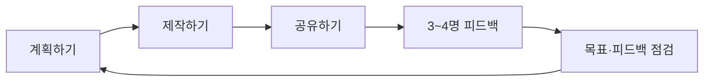

스크래치 자료는 학습자가 아이디어를 선택하고 계획한 뒤 제작·공유·피드백을 반복하는 프로젝트 학습을 제시한다. 텍스트 추출이 희소한 알고리즘연습 자료는 상세 문제를 추정하지 않고 프로젝트 절차의 근거로만 포함했다.

---

## 1. 계획에서 결과 화면까지

- 아이디어를 말로만 두지 말고 포스트잇으로 구조와 과정을 펼친다.
- 알고리즘을 순서도로 나타내듯 결과 화면을 먼저 그려 아이디어를 구체화한다.
- 필요한 추가 자원을 찾고, 완성한 스크래치 소스를 개발 스튜디오에 공유한다.



<Tabs>
  <Tab label="계획">목표, 화면, 순서도를 먼저 정하고 필요한 자원을 확인한다.</Tab>
  <Tab label="제작">스크래치 블록으로 알고리즘을 구현하고 결과 화면을 만든다.</Tab>
  <Tab label="공유·개선">스튜디오에 공유하고 피드백 팀의 검토를 다음 계획에 반영한다.</Tab>
</Tabs>

```html preview
<div style="font-family:system-ui,sans-serif;padding:20px;color:var(--foreground)">
  <label for="amt" style="font-size:14px;font-weight:600">프로젝트 루프</label>
  <div id="out" style="font-size:30px;font-weight:700;color:var(--chart-1);margin:6px 0">1단계</div>
  <input id="amt" type="range" min="1" max="5" step="1" value="1"
    style="width:100%;accent-color:var(--primary)" />
  <p style="font-size:13px;color:var(--muted-foreground)">원본 자료의 순서를 움직여 해당 단계의 핵심을 확인한다.</p>
  <script>
    var amt = document.getElementById('amt');
    var out = document.getElementById('out');
    amt.addEventListener('input', function () {
      out.textContent = Number(amt.value).toLocaleString() + '단계';
    });
  </script>
</div>
```

> [!TIP]
> 피드백은 평가로 끝나지 않는다. 원래 목표와 검토 내용을 다시 확인해 다음 제작 단계의 입력으로 사용한다.

<details>
<summary>산출물 체크리스트</summary>

아이디어 보드 → 순서도 또는 화면 설계 → 블록 프로그램 → 공유 링크/작품 → 피드백 기록 → 다음 단계 계획.

</details>

<!-- source: 스크래치.pdf and sparse algorithm practice decks; project-cycle steps preserved -->