> [!abstract] 이 자료는 새 부품을 거의 만들지 않는다
> [5장](./05.%20배열%20위의%20기본%20알고리즘.md)의 아홉 문제는 각각 독립적이었다. 이 38장은 다르다. 순서도마다 **다른 쪽을 가리키는 각주**가 달려 있다.
>
> | 이 장의 알고리즘 | 순서도가 가리키는 부품 |
> | --- | --- |
> | 최대공약수(090~092쪽) | ※ 29쪽 — 피연산자를 순환하여 연산하기 |
> | 에라토스테네스의 체(093~095쪽) | ※ 73쪽 — `markMultiple` |
> | 순위 매기기(096~098쪽) | ※ 76쪽 — `compareElement` |
> | 순차 탐색(104~106쪽) | ※ 62쪽 — n개의 데이터 합 구하기 |
> | 이진 탐색(107~110쪽) | ※ 45쪽 — 2개 숫자를 비교하여 작은 숫자 찾기 |
> | 선택 정렬(119~121쪽) | ※ 79쪽 `findMinimum` + ※ 26쪽 두 숫자 바꾸기 |
> | 삽입 정렬(122~124쪽) | ※ 65쪽 `insertElement` |
> | 버블 정렬(125~127쪽) | ※ 82쪽 `maximumToLast` |
>
> **여덟 개 중 하나도 예외가 없다.** 이 장의 실제 주제는 탐색도 정렬도 아니고 **조립**이다. 그래서 이 정리는 알고리즘을 하나씩 소개하는 대신, 세 개의 조립 방식 — *한 부품을 반복해서 부르기*, *비교 한 번을 아껴 쓰기*, *같은 부품으로 세 가지 정렬 만들기* — 로 나누어 읽는다.

읽기에 앞서 이 자료가 교재의 어느 구간인지 확인해 둔다.

> [!note] 이 발췌본의 범위
> 쪽 번호가 인쇄된 교재 스캔이며 **090~127쪽**이 남아 있다. [5장](./05.%20배열%20위의%20기본%20알고리즘.md)이 062~084쪽이었으므로 085~089쪽은 발췌에서 빠져 있다. 아래 쪽 번호는 모두 교재 인쇄 쪽수다.

---

## 조립 방식 ① — 한 부품을 되풀이해서 부른다

### 최대공약수 — 값을 밀어내는 일이 알고리즘이 된다

090쪽의 문제는 **유클리드 호제법**으로 두 수의 최대공약수를 구하는 것이다. 예는 8652와 2766이고 답은 6이다.

원본의 설명 한 문장이 알고리즘 전체다.

> **피연산자를 순환하면서 나머지 연산을 하는 동작을 피연산자가 0이 될 때까지 반복**하면 최대공약수를 얻을 수 있습니다. (※ 관련 알고리즘 : 피연산자를 순환하여 연산하기(29쪽 참고))

여기 나오는 "피연산자를 순환"이 [4장 029~030쪽의 값의 이동](./04.%20순서도%20작성%20실습.md)이고, [5장 피보나치](./05.%20배열%20위의%20기본%20알고리즘.md)가 같은 부품을 덧셈으로 쓴 것이었다. 이번에는 나머지 연산으로 쓴다. **밀려 나간 값을 버려도 되는 구조**라는 점이 셋 모두에서 같다.

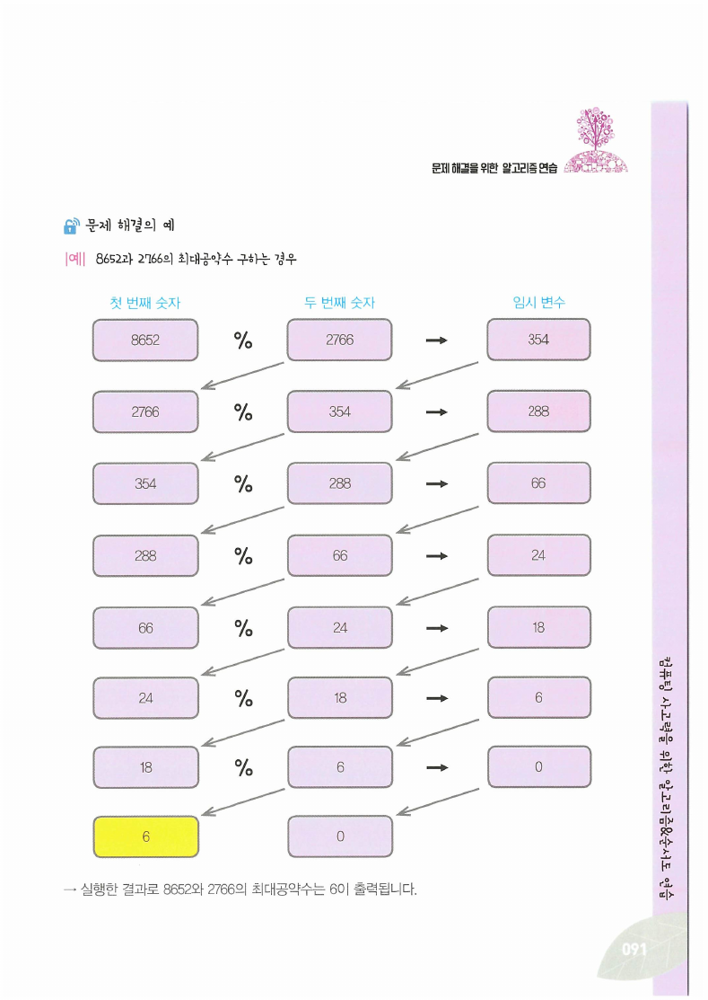

| 회차 | n1 | n2 | n3 = n1 % n2 |
| --- | --- | --- | --- |
| 1 | 8652 | 2766 | 354 |
| 2 | 2766 | 354 | 288 |
| 3 | 354 | 288 | 66 |
| 4 | 288 | 66 | 24 |
| 5 | 66 | 24 | 18 |
| 6 | 24 | 18 | 6 |
| 7 | 18 | 6 | **0** |

나머지가 0이 되는 순간 **그 직전의 나눈 수**가 답이다. 8652에서 시작해 일곱 번 만에 6에 도달한다.

```html preview h=560px
<div style="font-family:system-ui,-apple-system,sans-serif;padding:20px;color:var(--foreground)">
  <div style="display:flex;gap:16px;flex-wrap:wrap;margin-bottom:14px">
    <div><label for="aa" style="font-size:12.5px;font-weight:600">첫 번째 수 <span id="av" style="color:var(--chart-1);font-weight:700">8652</span></label>
      <input id="aa" type="range" min="2" max="10000" step="1" value="8652" style="width:230px;accent-color:var(--primary)" /></div>
    <div><label for="bb" style="font-size:12.5px;font-weight:600">두 번째 수 <span id="bv" style="color:var(--chart-2);font-weight:700">2766</span></label>
      <input id="bb" type="range" min="2" max="10000" step="1" value="2766" style="width:230px;accent-color:var(--primary)" /></div>
    <button id="orig" style="align-self:end;cursor:pointer;font:inherit;font-size:12.5px;padding:5px 12px;border-radius:var(--radius);border:1px solid var(--border);background:transparent;color:var(--foreground)">원본 예로 되돌리기</button>
  </div>

  <div style="overflow-x:auto">
    <table style="border-collapse:collapse;font-size:13px;min-width:400px;width:100%">
      <thead><tr>
        <th style="text-align:left;padding:6px 12px;border-bottom:1px solid var(--border)">회차</th>
        <th style="text-align:right;padding:6px 12px;border-bottom:1px solid var(--border)">n1</th>
        <th style="text-align:right;padding:6px 12px;border-bottom:1px solid var(--border)">n2</th>
        <th style="text-align:right;padding:6px 12px;border-bottom:1px solid var(--border)">n3 = n1 % n2</th>
      </tr></thead>
      <tbody id="tb"></tbody>
    </table>
  </div>
  <div id="out" style="margin-top:14px;padding:11px 13px;background:var(--card);border:1px solid var(--border);border-radius:var(--radius);font-size:13px;line-height:1.7"></div>

  <script>
    var A = document.getElementById('aa'), B = document.getElementById('bb');
    function render() {
      var a = parseInt(A.value, 10), b = parseInt(B.value, 10);
      document.getElementById('av').textContent = a.toLocaleString();
      document.getElementById('bv').textContent = b.toLocaleString();
      var n1 = a, n2 = b, rows = '', k = 0, g = a;
      if (n2 === 0) { g = n1; }
      while (n2 !== 0 && k < 40) {
        var n3 = n1 % n2;
        k++;
        rows += '<tr><td style="padding:5px 12px;border-bottom:1px solid var(--border)">' + k + '</td>' +
          '<td style="text-align:right;padding:5px 12px;border-bottom:1px solid var(--border);font-family:ui-monospace,Menlo,monospace">' + n1 + '</td>' +
          '<td style="text-align:right;padding:5px 12px;border-bottom:1px solid var(--border);font-family:ui-monospace,Menlo,monospace">' + n2 + '</td>' +
          '<td style="text-align:right;padding:5px 12px;border-bottom:1px solid var(--border);font-family:ui-monospace,Menlo,monospace;' +
          (n3 === 0 ? 'color:var(--chart-1);font-weight:700' : '') + '">' + n3 + '</td></tr>';
        g = n2;
        n1 = n2; n2 = n3;
      }
      document.getElementById('tb').innerHTML = rows;
      document.getElementById('out').innerHTML =
        '최대공약수 = <b style="color:var(--chart-1);font-size:18px">' + g + '</b> — <b>' + k + '회</b> 반복.<br>' +
        '<span style="color:var(--muted-foreground)">각 회차에서 하는 일은 <code>n1 ← n2</code>, <code>n2 ← n3</code> 두 줄뿐이다. ' +
        '밀려 나간 n1의 옛 값은 다시 쓰이지 않으므로 임시 변수가 필요 없다 — ' +
        '[4장]의 두 값 맞바꾸기와 정반대의 상황이다.</span>';
    }
    A.addEventListener('input', render);
    B.addEventListener('input', render);
    document.getElementById('orig').addEventListener('click', function () { A.value = 8652; B.value = 2766; render(); });
    render();
  </script>
</div>
```

### 에라토스테네스의 체 — 5장의 `markMultiple`을 √n번 부른다

093~095쪽의 소수 구하기는 이 장에서 가장 짧은 순서도다. 095쪽 `sieveOfEratosthenes`의 본체는 **딱 한 줄**이다.

```text
i = 2부터 Sqrt(n)까지:
    markMultiple(x, i, n)
```

`markMultiple`은 [5장 075쪽](./05.%20배열%20위의%20기본%20알고리즘.md)에서 만든 "2배수부터 시작해 i칸씩 건너뛰며 1을 적는" 함수 그대로다. 이 장이 새로 더한 것은 두 가지뿐이다.

1. **바깥 반복**을 2부터 씌운다.
2. 그 반복을 **$\sqrt{n}$ 에서 멈춘다.**

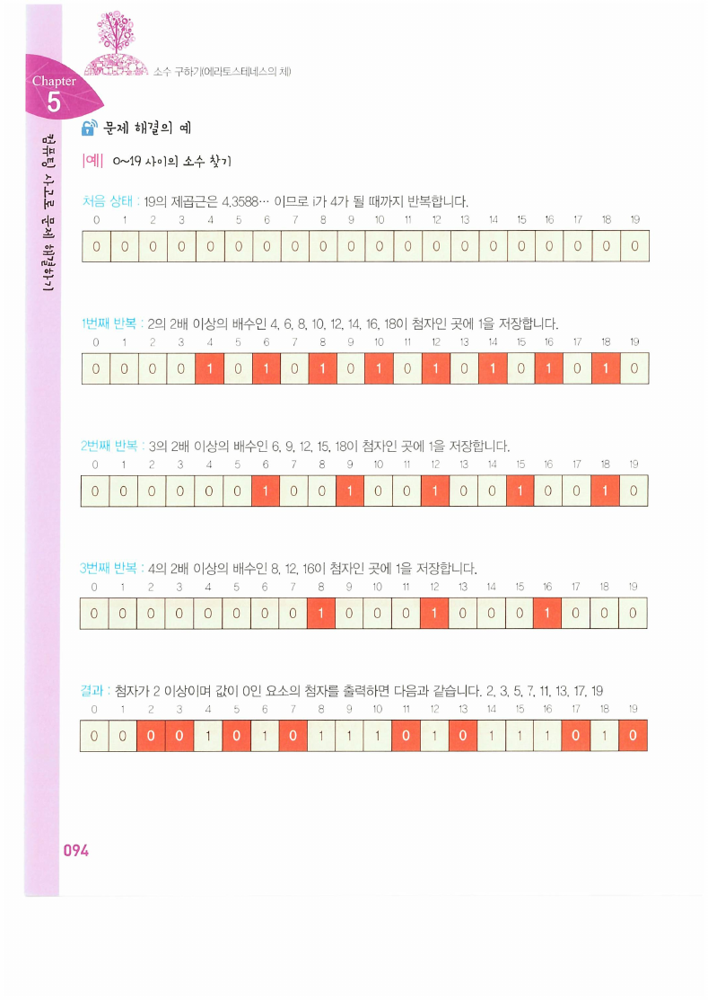

원본의 예는 n = 19다. $\sqrt{19} \approx 4.3589$ 이므로 i는 **2, 3, 4** 세 번만 돈다.

| 반복 | 표시하는 첨자 |
| --- | --- |
| 1회 (i = 2) | 4, 6, 8, 10, 12, 14, 16, 18 |
| 2회 (i = 3) | 6, 9, 12, 15, 18 |
| 3회 (i = 4) | 8, 12, 16 |

결과 배열에서 값이 0인 첨자가 소수다 — **2, 3, 5, 7, 11, 13, 17, 19**. 0과 1은 제외한다.

```html preview h=560px
<div style="font-family:system-ui,-apple-system,sans-serif;padding:20px;color:var(--foreground)">
  <div style="display:flex;gap:14px;align-items:center;flex-wrap:wrap;margin-bottom:12px">
    <label for="nn2" style="font-size:12.5px;font-weight:600">n = <span id="nv2" style="color:var(--chart-1);font-weight:700">19</span></label>
    <input id="nn2" type="range" min="4" max="120" step="1" value="19" style="flex:1;min-width:200px;accent-color:var(--primary)" />
  </div>
  <div id="rounds"></div>
  <div id="res" style="margin-top:12px"></div>
  <div id="why" style="margin-top:12px;padding:11px 13px;background:var(--card);border:1px solid var(--border);border-radius:var(--radius);font-size:13px;line-height:1.7"></div>

  <script>
    var el = document.getElementById('nn2');
    function cell(v, state) {
      var bg = 'transparent', bd = 'var(--border)', fg = 'var(--foreground)';
      if (state === 'new') { bg = 'var(--chart-1)'; bd = 'var(--chart-1)'; fg = 'var(--primary-foreground)'; }
      if (state === 'old') { fg = 'var(--muted-foreground)'; }
      if (state === 'prime') { bd = 'var(--chart-2)'; fg = 'var(--chart-2)'; }
      return '<div style="min-width:26px;text-align:center;padding:3px 2px;border:1px solid ' + bd + ';background:' + bg +
        ';color:' + fg + ';border-radius:4px;font-family:ui-monospace,Menlo,monospace;font-size:11.5px">' + v + '</div>';
    }
    function render() {
      var n = parseInt(el.value, 10);
      document.getElementById('nv2').textContent = n;
      var mark = [], k;
      for (k = 0; k <= n; k++) mark.push(0);
      var lim = Math.floor(Math.sqrt(n));
      var html = '', round = 0;
      for (var i = 2; i <= lim; i++) {
        round++;
        var fresh = [];
        for (var j = 2 * i; j <= n; j += i) { if (!mark[j]) fresh.push(j); mark[j] = 1; }
        html += '<div style="font-size:12px;color:var(--muted-foreground);margin:8px 0 3px">' + round +
          '회 (i = ' + i + ') — 새로 표시: ' + (fresh.length ? fresh.join(', ') : '없음') + '</div>' +
          '<div style="display:flex;gap:3px;flex-wrap:wrap">' +
          mark.map(function (m, idx) { return cell(idx, m ? (fresh.indexOf(idx) >= 0 ? 'new' : 'old') : null); }).join('') + '</div>';
      }
      document.getElementById('rounds').innerHTML = html || '<div style="font-size:12.5px;color:var(--muted-foreground)">√n이 2보다 작아 반복이 없다.</div>';

      var primes = [];
      for (k = 2; k <= n; k++) if (!mark[k]) primes.push(k);
      document.getElementById('res').innerHTML =
        '<div style="font-size:12.5px;font-weight:600;margin-bottom:4px">결과 — 값이 0인 첨자(0과 1 제외)</div>' +
        '<div style="display:flex;gap:3px;flex-wrap:wrap">' +
        mark.map(function (m, idx) { return cell(idx, m ? 'old' : (idx >= 2 ? 'prime' : 'old')); }).join('') + '</div>' +
        '<div style="margin-top:6px;font-size:12.5px">소수 <b style="color:var(--chart-2)">' + primes.join(', ') + '</b></div>';

      document.getElementById('why').innerHTML =
        '√' + n + ' ≈ <b>' + Math.sqrt(n).toFixed(4) + '</b> 이므로 바깥 반복은 i = 2부터 <b>' + lim + '</b>까지 <b>' + Math.max(0, lim - 1) + '회</b>다.<br>' +
        '<span style="color:var(--muted-foreground)">√n을 넘는 i의 배수는 이미 더 작은 약수 쪽에서 지워졌기 때문에 볼 필요가 없다. ' +
        '이 한 줄의 절약이 체 알고리즘의 전부이고, 안쪽에서 실제로 표시하는 일은 [5장 075쪽]의 markMultiple이 그대로 한다.</span>';
    }
    el.addEventListener('input', render);
    render();
  </script>
</div>
```

### 순위 매기기 — `compareElement`를 n번 부른다

096~098쪽은 배열의 각 요소가 몇 등인지를 구한다. 예의 배열과 답은 이렇다.

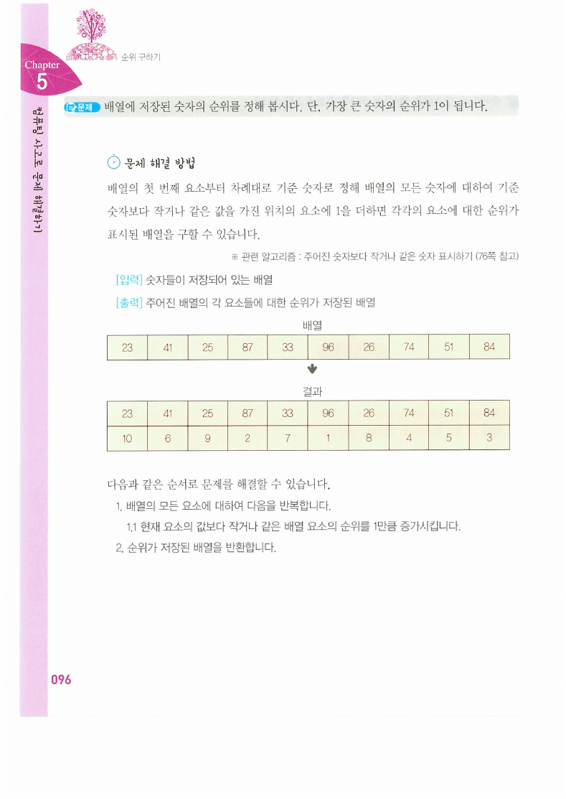

| 값 | 23 | 41 | 25 | 87 | 33 | 96 | 26 | 74 | 51 | 84 |
| --- | --- | --- | --- | --- | --- | --- | --- | --- | --- | --- |
| 순위 | 10 | 6 | 9 | 2 | 7 | 1 | 8 | 4 | 5 | 3 |

098쪽 `ranking` 순서도의 본체도 한 줄이다 — `i = 0부터 n−1까지: compareElement(x, r, n, x[i])`.

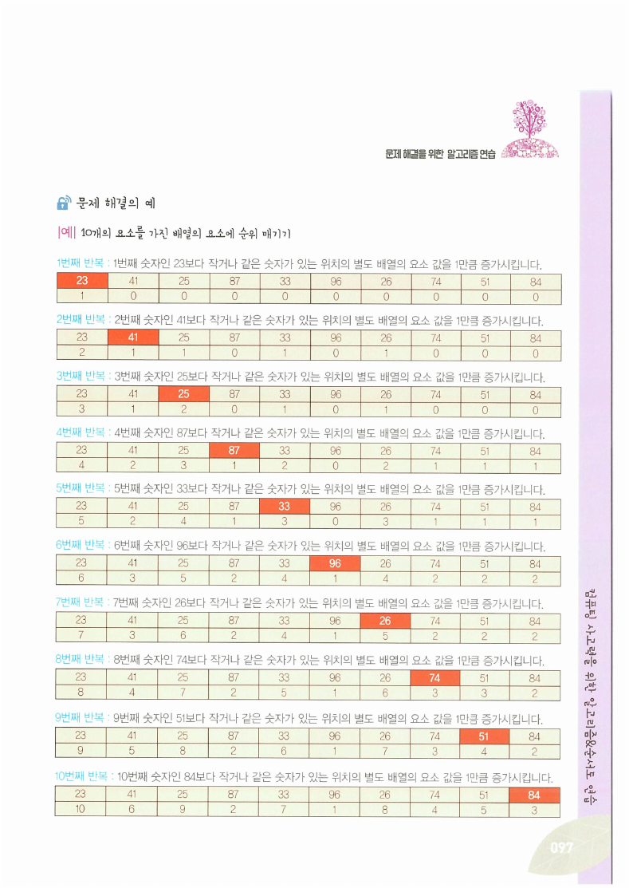

> [!important] [5장 078쪽의 괄호 주석이 여기서 회수된다](./05.%20배열%20위의%20기본%20알고리즘.md)
> `compareElement`는 "배열 x의 요소가 기준 숫자 k보다 작거나 같으면 별도 배열 r의 같은 위치에 **1을 더한다**"는 함수였다. 5장 078쪽 해설은 괄호로 "**※ 더하지 않고 1을 저장해도 됩니다**"라고 적었는데, 그 문제에서는 각 위치를 한 번씩만 방문하므로 실제로 같았다.
>
> 여기서는 다르다. `compareElement`를 **n번 부르므로 같은 위치가 n번 방문된다.** 그때마다 1을 더해야 "나보다 크거나 같은 값이 몇 개인가"가 쌓인다. **저장이었다면 전부 1이 되어 순위가 나오지 않는다.**
>
> 즉 5장의 그 괄호는 "이 문제에서는 상관없다"는 뜻이었지 "아무래도 좋다"는 뜻이 아니었다. 부품을 만들 때 **나중의 쓰임을 남겨 둔 설계**다.

097쪽 추적을 읽으면 누적 방식이 분명해진다. 1회차는 기준이 23(가장 작은 값)이므로 자기 자신만 1이 되고, 2회차는 기준이 41이므로 23·41·25·33·26 다섯 자리가 올라간다. 열 번을 다 돌면 **가장 작은 23은 열 번 모두 조건을 만족해 10이 되고, 가장 큰 96은 자기 차례에만 만족해 1이 된다.** 내림차순 순위가 이렇게 만들어진다.

---

## 조립 방식 ② — 비교 한 번을 아껴 쓴다

099~110쪽이 탐색이다. 원본은 코드보다 먼저 **상자 그림**으로 두 방식을 대비시킨다.

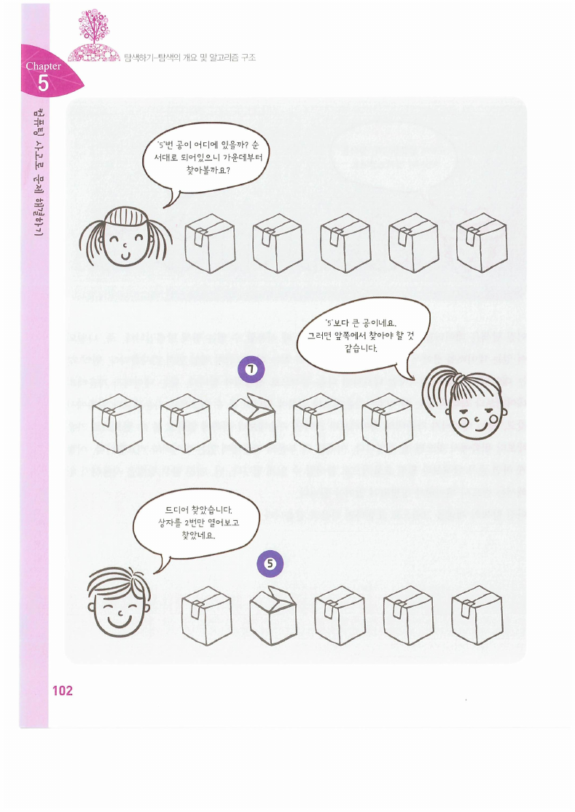

상자가 다섯 개 있고 그 안의 공 번호를 맞혀야 한다. **아무렇게나 놓여 있으면** 앞에서부터 하나씩 열 수밖에 없다(100~101쪽, 네 번). **번호 순으로 놓여 있으면** 가운데를 열어 7을 보고 "5보다 크니 앞쪽"이라 판단해 두 번 만에 찾는다(102쪽).

정렬이 탐색을 싸게 만든다 — 이것이 이 장의 두 번째 조립 방식이자, [2장 23쪽](./02.%20컴퓨팅%20사고와%20문제%20해결.md)에서 이미 한 번 나왔던 이야기다.

### 순차 탐색 (104~106쪽)

104쪽은 순차 탐색이 [5장 062쪽의 합계 알고리즘](./05.%20배열%20위의%20기본%20알고리즘.md)과 관련된다고 밝힌다. 실제로 골격이 같다 — 배열을 한 번 훑는다. 다른 점은 **찾으면 도중에 멈춘다**는 것뿐이다.

배열 `23 41 25 87 33 96 26 74 51 84`에서 51을 찾으면 105쪽의 추적대로 아홉 번 만에 첨자 8을 얻는다.

106쪽 순서도의 반복 조건이 복합 조건이다 — **"배열의 끝에 도달하지 못했거나 찾고자 하는 숫자를 찾지 못했다면 계속 반복"**. 두 가지 이유로 반복이 끝날 수 있으므로, 반복이 끝난 뒤 ⑥에서 **어느 쪽으로 끝났는지를 한 번 더 판정**해야 한다. 찾았으면 `loc`에 위치를, 못 찾았으면 `−1`을 넣는다.

> [!note] 원본 106쪽 — 대문자와 소문자가 섞여 있다
> 함수 정의는 `sequentialSearch(정수 배열 x, 정수 n, **정수 k**)`로 소문자 k를 매개변수로 받는데, 반복 조건 상자에는 `x[i] != **K**`로 **대문자 K**가 적혀 있다. 마지막 판정 상자는 다시 소문자 `x[i] = k`다. 대소문자를 구분하는 언어로 옮기면 컴파일되지 않는다.

### 이진 탐색 (107~110쪽)

107쪽은 이진 탐색이 [4장 045쪽 "2개의 숫자를 비교하여 작은 숫자 찾기"](./04.%20순서도%20작성%20실습.md)와 관련된다고 밝힌다. 그리고 절차를 세 줄로 요약한다 — 가운데와 비교해서 **작으면 앞쪽, 크면 뒤쪽, 같으면 찾은 것.**

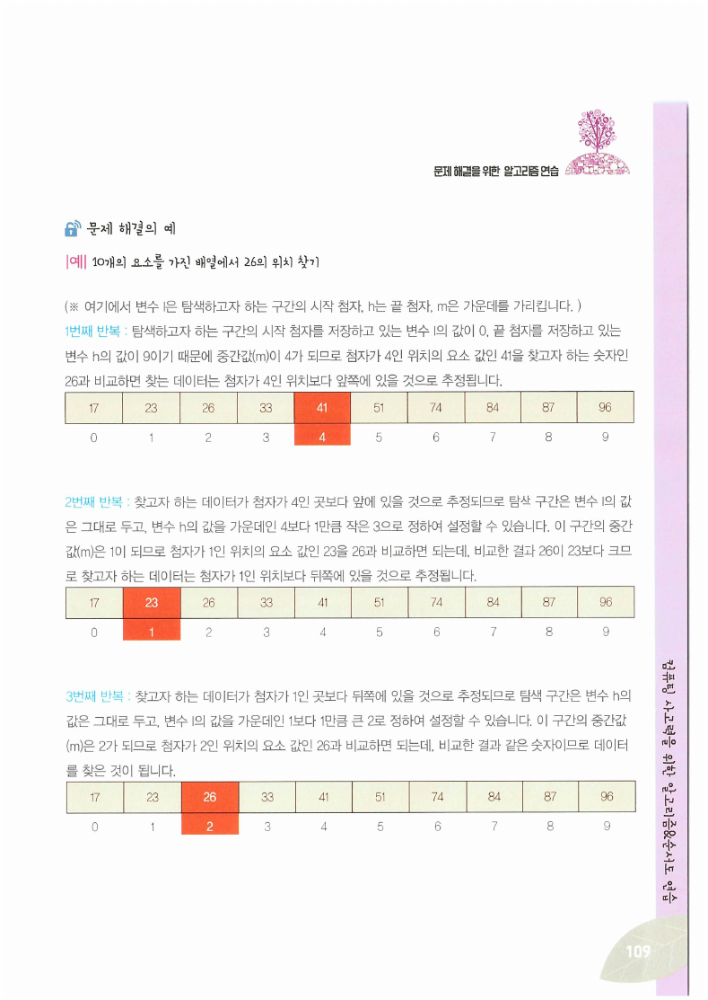

배열 `17 23 26 33 41 51 74 84 87 96`에서 26을 찾는 과정이다.

| 회차 | l | h | m = (l+h)/2 | x[m] | 판단 |
| --- | --- | --- | --- | --- | --- |
| 1 | 0 | 9 | 4 | 41 | 26 < 41 → 앞쪽 |
| 2 | 0 | 3 | 1 | 23 | 26 > 23 → 뒤쪽 |
| 3 | 2 | 3 | 2 | 26 | 찾음 |

110쪽 순서도의 갱신이 **`h ← m − 1`** 과 **`l ← m + 1`** 이라는 점이 중요하다. 가운데는 이미 비교했으므로 다음 구간에서 빼야 한다. `h ← m`으로 적으면 구간이 줄지 않아 무한 반복이 된다.

```html preview h=620px
<div style="font-family:system-ui,-apple-system,sans-serif;padding:20px;color:var(--foreground)">
  <div style="display:flex;gap:10px;align-items:center;flex-wrap:wrap;margin-bottom:12px">
    <span style="font-size:13px;font-weight:600">찾을 값</span>
    <div id="kb" style="display:flex;gap:5px;flex-wrap:wrap"></div>
  </div>

  <div style="font-size:12.5px;font-weight:700;margin-bottom:6px">① 순차 탐색 — 정렬되지 않은 배열 (원본 105쪽의 배열)</div>
  <div id="seqRow" style="display:flex;gap:4px;flex-wrap:wrap"></div>
  <div id="seqMsg" style="font-size:12.5px;color:var(--muted-foreground);margin-top:5px"></div>

  <div style="font-size:12.5px;font-weight:700;margin:16px 0 6px">② 이진 탐색 — 같은 값을 정렬해 둔 배열 (원본 109쪽)</div>
  <div id="binRows"></div>
  <div id="binMsg" style="font-size:12.5px;color:var(--muted-foreground);margin-top:5px"></div>

  <div id="cmp" style="margin-top:14px;padding:11px 13px;background:var(--card);border:1px solid var(--border);border-radius:var(--radius);font-size:13px;line-height:1.7"></div>

  <script>
    var RAW = [23, 41, 25, 87, 33, 96, 26, 74, 51, 84];
    var SORTED = RAW.slice().sort(function (a, b) { return a - b; });
    var key = 26;
    function box(v, mode, w) {
      var bg = 'transparent', bd = 'var(--border)', fg = 'var(--foreground)';
      if (mode === 'hit') { bg = 'var(--chart-1)'; bd = 'var(--chart-1)'; fg = 'var(--primary-foreground)'; }
      if (mode === 'seen') { bd = 'var(--chart-3)'; fg = 'var(--chart-3)'; }
      if (mode === 'dim') { fg = 'var(--muted-foreground)'; }
      return '<div style="min-width:' + (w || 38) + 'px;text-align:center;padding:6px 5px;border:1px solid ' + bd +
        ';background:' + bg + ';color:' + fg + ';border-radius:var(--radius);font-family:ui-monospace,Menlo,monospace;font-size:13px">' + v + '</div>';
    }
    function render() {
      document.getElementById('kb').innerHTML = [17, 26, 51, 96, 50].map(function (v) {
        var on = v === key;
        return '<button data-k="' + v + '" style="cursor:pointer;font:inherit;font-size:12.5px;padding:4px 10px;border-radius:var(--radius);border:1px solid ' +
          (on ? 'var(--chart-1)' : 'var(--border)') + ';background:' + (on ? 'var(--chart-1)' : 'transparent') +
          ';color:' + (on ? 'var(--primary-foreground)' : 'var(--foreground)') + '">' + v + (v === 50 ? ' (없는 값)' : '') + '</button>';
      }).join('');
      Array.prototype.forEach.call(document.querySelectorAll('#kb button'), function (b) {
        b.addEventListener('click', function () { key = parseInt(b.getAttribute('data-k'), 10); render(); });
      });

      var seen = 0, at = -1;
      for (var i = 0; i < RAW.length; i++) { seen++; if (RAW[i] === key) { at = i; break; } }
      document.getElementById('seqRow').innerHTML = RAW.map(function (v, i) {
        return box(v, i === at ? 'hit' : (i < seen ? 'seen' : 'dim'));
      }).join('');
      document.getElementById('seqMsg').textContent = seen + '회 비교' + (at >= 0 ? ' → 첨자 ' + at + ' (위치 ' + (at + 1) + '번째)' : ' → 끝까지 훑고 loc에 −1');

      var lo = 0, hi = SORTED.length - 1, rows = '', step = 0, bat = -1;
      while (lo <= hi) {
        var m = Math.floor((lo + hi) / 2);
        step++;
        rows += '<div style="display:flex;gap:4px;flex-wrap:wrap;align-items:center;margin-bottom:5px">' +
          '<span style="font-size:11.5px;color:var(--muted-foreground);min-width:82px">' + step + '회 l=' + lo + ' h=' + hi + '</span>' +
          SORTED.map(function (v, i) {
            if (i < lo || i > hi) return box(v, 'dim');
            return box(v, i === m ? (SORTED[m] === key ? 'hit' : 'seen') : null);
          }).join('') + '</div>';
        if (SORTED[m] === key) { bat = m; break; }
        if (key < SORTED[m]) hi = m - 1; else lo = m + 1;
      }
      document.getElementById('binRows').innerHTML = rows;
      document.getElementById('binMsg').textContent = step + '회 비교' + (bat >= 0 ? ' → 첨자 ' + bat : ' → 구간이 비어 loc에 −1');

      document.getElementById('cmp').innerHTML =
        '값 <b>' + key + '</b> — 순차 <b style="color:var(--chart-3)">' + seen + '회</b>, 이진 <b style="color:var(--chart-1)">' + step + '회</b>.<br>' +
        '<span style="color:var(--muted-foreground)">이진 탐색은 정렬을 요구한다. 한 번만 찾을 것이면 정렬 비용이 더 크지만, ' +
        '같은 배열을 여러 번 찾을 것이면 한 번 정렬해 두는 편이 싸다 — 그래서 이 장의 나머지 절반이 정렬이다.</span>';
    }
    render();
  </script>
</div>
```

---

## 조립 방식 ③ — 같은 틀에 부품만 갈아 끼운다

111~127쪽이 정렬이다. 112쪽이 정렬을 정의하고 세 방법을 예고한다 — **선택, 삽입, 버블**.

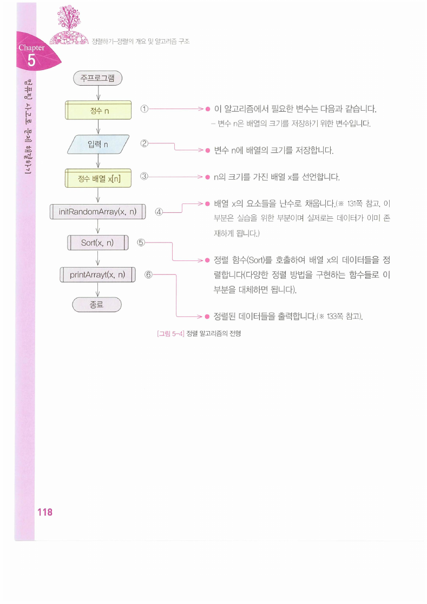

118쪽 [그림 5-4]가 이 절의 설계를 못 박는다. 주프로그램의 골격은 고정이고, **`Sort(x, n)` 자리에 어떤 함수를 넣느냐만 다르다.**

> [!note] 원본 118쪽 — 출력 함수 이름에 오타가 있다
> 순서도의 마지막 처리 상자가 **`printArrayt(x, n)`** 으로 적혀 있다. 해설 ⑥은 "정렬된 데이터들을 출력합니다"라고만 하고, 133쪽 주프로그램을 참조하라고 한다. 끝의 `t`는 군더더기로 보인다.

세 정렬은 비유도 나란히 제시된다.

| 정렬 | 비유(112~117쪽) | 부품 |
| --- | --- | --- |
| **선택** | 남은 공 중 **가장 작은 것을 골라** 줄 끝에 붙인다 | `findMinimum`(79쪽) + 두 숫자 바꾸기(26쪽) |
| **삽입** | 공 하나를 집어 **이미 정렬된 줄의 알맞은 자리에 끼운다** | `insertElement`(65쪽) |
| **버블** | 물에 뜨는 힘이 강한 방울일수록 **먼저 위로 떠오른다** | `maximumToLast`(82쪽) |

버블의 비유가 특히 정확하다. 116쪽 본문은 "가장 큰 데이터를 위로 띄워(**실제 프로그램에서는 마지막으로 보냄**)"라고 괄호로 덧붙인다. 비유의 방향(위)과 구현의 방향(뒤)이 반대라는 것을 스스로 밝히는 셈이다.

### 선택 정렬 (119~121쪽)

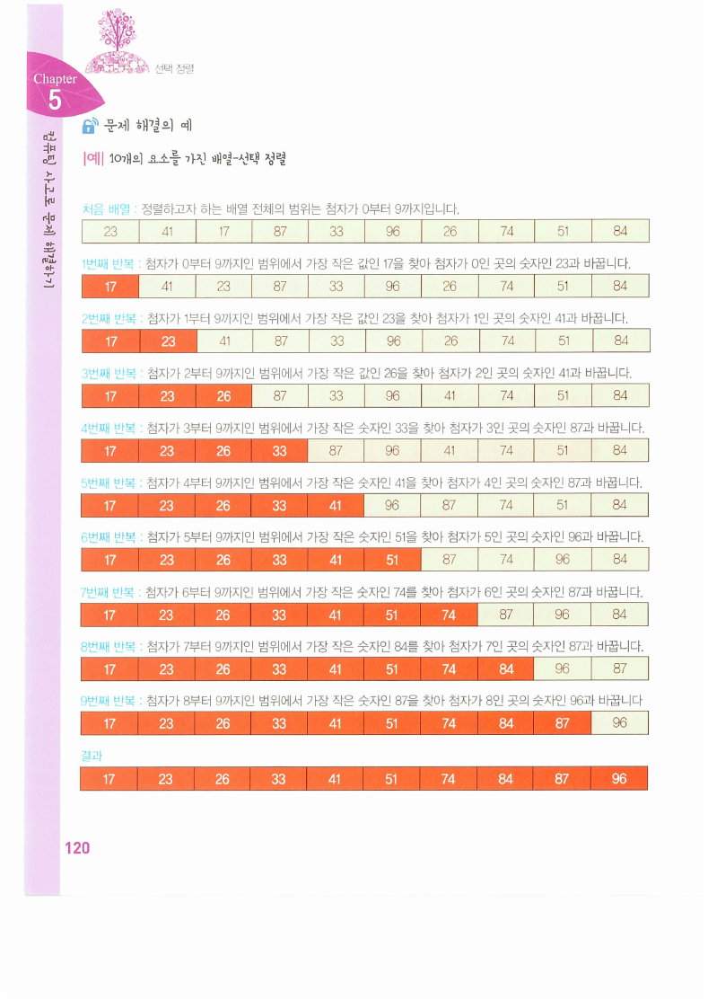

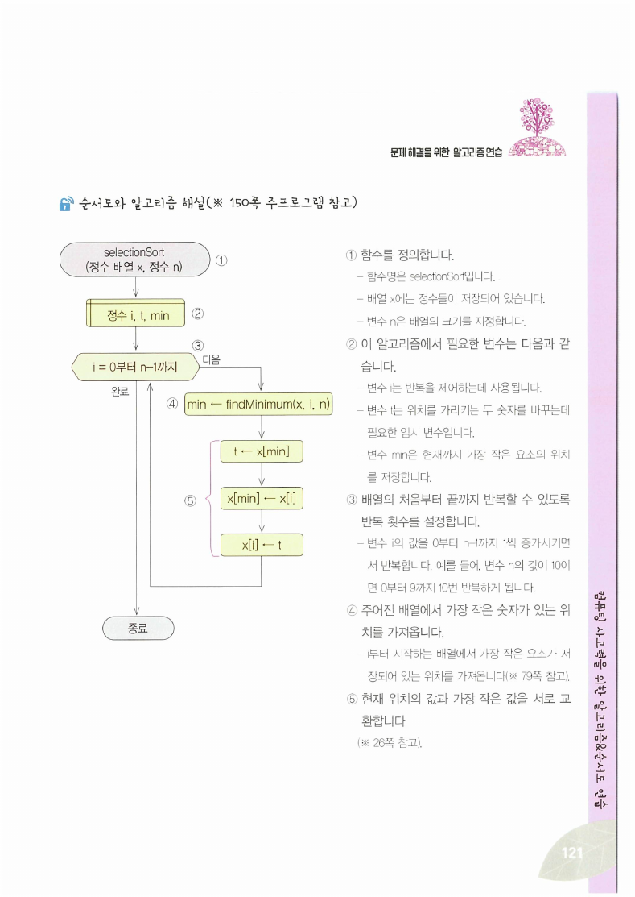

121쪽 순서도의 본체는 네 줄이다.

```text
i = 0부터 n−1까지:
    min ← findMinimum(x, i, n)      ← 79쪽
    t ← x[min];  x[min] ← x[i];  x[i] ← t      ← 26쪽
```

[5장 081쪽의 `findMinimum`이 값이 아니라 위치를 반환하도록 설계된 이유](./05.%20배열%20위의%20기본%20알고리즘.md)가 여기서 드러난다. 교환하려면 **어디 있는지**를 알아야 한다. 그리고 그 교환은 [4장 028쪽의 세 줄](./04.%20순서도%20작성%20실습.md)이 그대로 들어온 것이다.

배열 `23 41 17 87 33 96 26 74 51 84`에 대한 아홉 번의 결과는 다음과 같다.

| 회차 | 결과 |
| --- | --- |
| 1 | `17 41 23 87 33 96 26 74 51 84` |
| 2 | `17 23 41 87 33 96 26 74 51 84` |
| 3 | `17 23 26 87 33 96 41 74 51 84` |
| 4 | `17 23 26 33 87 96 41 74 51 84` |
| 5 | `17 23 26 33 41 96 87 74 51 84` |
| 6 | `17 23 26 33 41 51 87 74 96 84` |
| 7 | `17 23 26 33 41 51 74 87 96 84` |
| 8 | `17 23 26 33 41 51 74 84 96 87` |
| 9 | `17 23 26 33 41 51 74 84 87 96` |

> [!note] 반복 범위 `0부터 n−1까지`에 대하여
> 마지막 회차(i = n−1)는 원소가 하나만 남은 구간에서 최솟값을 찾아 자기 자신과 교환한다 — 결과는 옳지만 하는 일이 없다. `n−2`까지만 돌아도 같다. 오류는 아니고, [5장 084쪽의 `maximumToLast`가 `0부터 n−2까지`로 적은 것](./05.%20배열%20위의%20기본%20알고리즘.md)과 대비된다.

### 삽입 정렬 (122~124쪽)

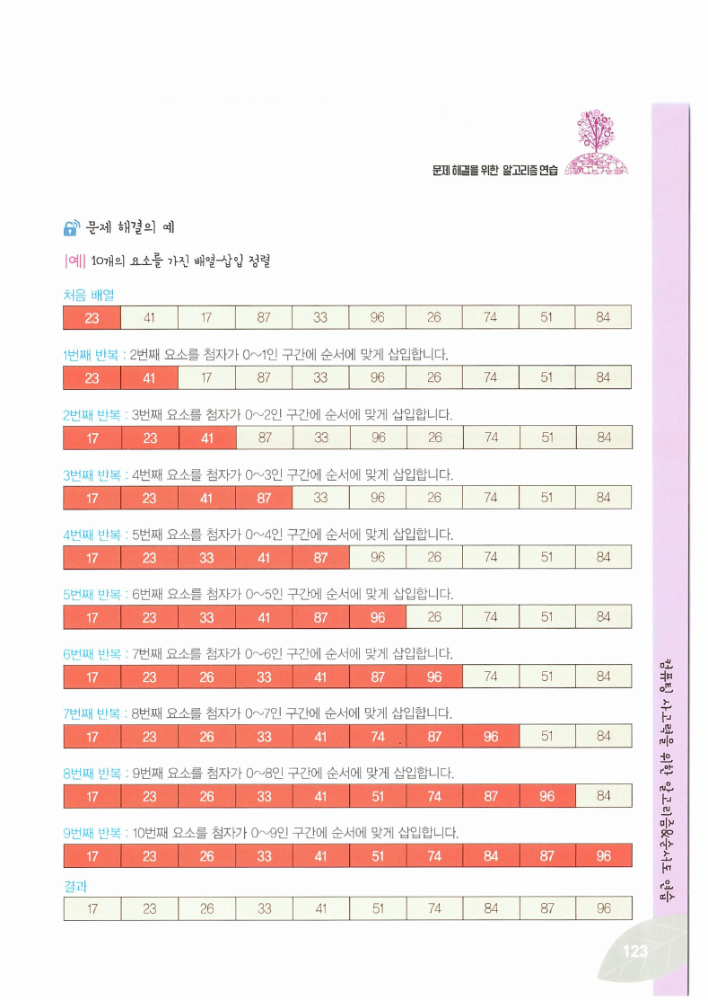

124쪽 순서도는 더 짧다.

```text
i = 1부터 n−1까지:
    insertElement(x, i−1, x[i])      ← 65쪽
```

해설 ③이 왜 1부터 시작하는지를 설명한다 — **"첫 번째인 경우에는 요소가 하나이므로 순서대로 할 필요가 없기 때문"**. 원소 한 개짜리 배열은 이미 정렬되어 있다는 관찰이다.

123쪽 추적에서는 **왼쪽 구간이 항상 정렬되어 있다**는 것이 눈에 보인다. 회차마다 그 구간이 한 칸씩 자라고, 오른쪽에서 하나를 집어 알맞은 자리에 끼운다.

### 버블 정렬 (125~127쪽)

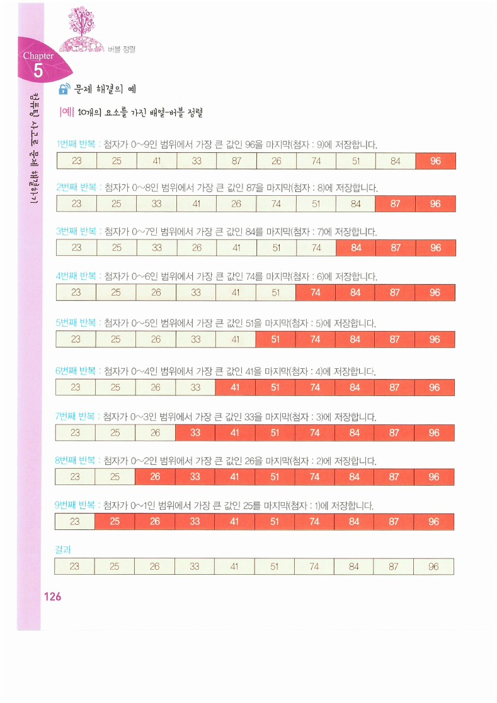

126쪽 추적의 설명문이 알고리즘을 그대로 말한다 — "1번째 반복: 첨자가 **0~9인 범위**에서 가장 큰 값인 96을 마지막(첨자 9)에 저장합니다", "2번째 반복: 첨자가 **0~8인 범위**에서 …". **범위가 매번 한 칸씩 줄어든다.**

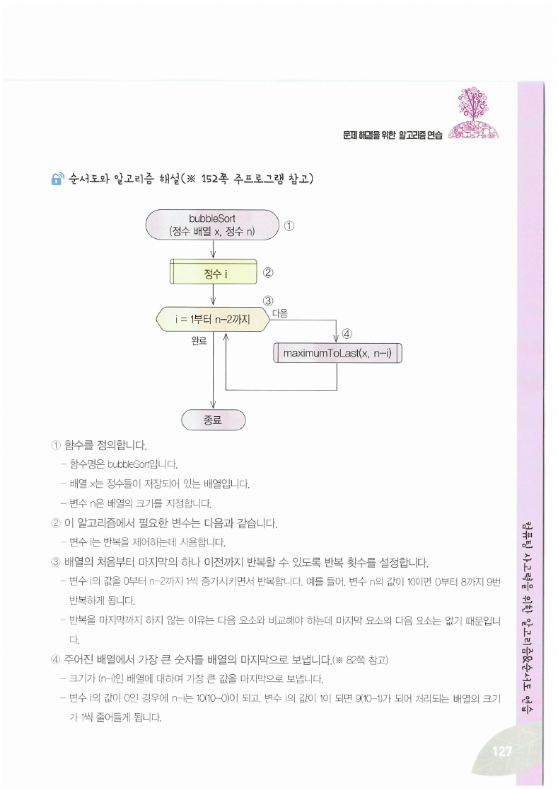

> [!warning] 원본 127쪽 — 순서도의 반복 시작값이 해설과 어긋난다
> 순서도의 반복 상자에는 **`i = 1부터 n−2까지`** 라고 적혀 있다. 그런데 바로 옆 해설은 이렇게 쓴다.
>
> - ③ "변수 i의 값을 **0부터 n−2까지** 1씩 증가시키면서 반복합니다. 예를 들어 변수 n의 값이 10이면 **0부터 8까지 9번** 반복하게 됩니다."
> - ④ "변수 i의 값이 **0인 경우에 n−i는 10(10−0)** 이 되고 …"
>
> 해설이 맞다. `maximumToLast(x, n−i)`를 부르므로 첫 회차에 배열 전체(n−0 = 10)를 대상으로 해야 하는데, i를 1부터 시작하면 첫 회차의 범위가 9가 되어 **마지막 원소가 처음부터 제외된다.** 126쪽 추적의 1회차도 "첨자가 0~9인 범위"라고 명시한다.
>
> 즉 **순서도 상자의 `1부터`가 `0부터`여야 한다.** [5장 064쪽에서도 반복의 경계가 틀렸던 것](./05.%20배열%20위의%20기본%20알고리즘.md)과 같은 종류의 실수이며, 이 두 권을 통틀어 확인된 반복 경계 오류는 이것으로 두 건이다.

아래에서 세 정렬을 같은 입력으로 나란히 돌려 볼 수 있다. 입력과 각 회차의 결과는 원본 120·123·126쪽 값 그대로다.

```html preview h=640px
<div style="font-family:system-ui,-apple-system,sans-serif;padding:20px;color:var(--foreground)">
  <div style="display:flex;gap:6px;flex-wrap:wrap;margin-bottom:12px" id="sb"></div>
  <div style="display:flex;gap:8px;flex-wrap:wrap;margin-bottom:14px">
    <button id="one2" style="cursor:pointer;font:inherit;font-size:12.5px;padding:5px 12px;border-radius:var(--radius);border:1px solid var(--chart-1);background:var(--chart-1);color:var(--primary-foreground)">한 회차 ▶</button>
    <button id="all2" style="cursor:pointer;font:inherit;font-size:12.5px;padding:5px 12px;border-radius:var(--radius);border:1px solid var(--border);background:transparent;color:var(--foreground)">끝까지</button>
    <button id="rs3" style="cursor:pointer;font:inherit;font-size:12.5px;padding:5px 12px;border-radius:var(--radius);border:1px solid var(--border);background:transparent;color:var(--foreground)">처음으로</button>
  </div>
  <div id="hist"></div>
  <div id="note3" style="margin-top:12px;padding:11px 13px;background:var(--card);border:1px solid var(--border);border-radius:var(--radius);font-size:13px;line-height:1.7"></div>

  <script>
    // 원본 120·123쪽의 입력 / 126쪽 버블 정렬의 입력
    var IN_SEL = [23, 41, 17, 87, 33, 96, 26, 74, 51, 84];
    var IN_BUB = [23, 41, 25, 87, 33, 96, 26, 74, 51, 84];
    var kind = 'sel', arr = IN_SEL.slice(), pass = 0, snaps = [];
    var META = {
      sel: { name: '선택 정렬 (원본 120쪽)', src: IN_SEL, part: 'findMinimum + 두 숫자 바꾸기' },
      ins: { name: '삽입 정렬 (원본 123쪽)', src: IN_SEL, part: 'insertElement' },
      bub: { name: '버블 정렬 (원본 126쪽)', src: IN_BUB, part: 'maximumToLast' }
    };
    function reset() { arr = META[kind].src.slice(); pass = 0; snaps = []; draw(); }
    function step() {
      var n = arr.length;
      if (kind === 'sel') {
        if (pass >= n - 1) return false;
        var mi = pass;
        for (var j = pass; j < n; j++) if (arr[j] < arr[mi]) mi = j;
        var t = arr[mi]; arr[mi] = arr[pass]; arr[pass] = t;
        pass++;
      } else if (kind === 'ins') {
        if (pass >= n - 1) return false;
        var i = pass + 1, v = arr[i], k = i - 1;
        while (k >= 0 && arr[k] > v) { arr[k + 1] = arr[k]; k--; }
        arr[k + 1] = v;
        pass++;
      } else {
        if (pass >= n - 1) return false;
        for (var q = 0; q < n - 1 - pass; q++) if (arr[q] > arr[q + 1]) { var s = arr[q]; arr[q] = arr[q + 1]; arr[q + 1] = s; }
        pass++;
      }
      snaps.push({ p: pass, a: arr.slice(), fixed: kind === 'ins' ? pass + 1 : pass });
      return true;
    }
    function draw() {
      document.getElementById('sb').innerHTML = ['sel', 'ins', 'bub'].map(function (k) {
        var on = k === kind;
        return '<button data-k="' + k + '" style="cursor:pointer;font:inherit;font-size:12.5px;padding:5px 11px;border-radius:var(--radius);border:1px solid ' +
          (on ? 'var(--chart-1)' : 'var(--border)') + ';background:' + (on ? 'var(--chart-1)' : 'transparent') +
          ';color:' + (on ? 'var(--primary-foreground)' : 'var(--foreground)') + '">' + META[k].name + '</button>';
      }).join('');
      Array.prototype.forEach.call(document.querySelectorAll('#sb button'), function (b) {
        b.addEventListener('click', function () { kind = b.getAttribute('data-k'); reset(); });
      });

      var rows = '<div style="font-size:12px;color:var(--muted-foreground);margin-bottom:3px">시작</div>' +
        '<div style="display:flex;gap:4px;flex-wrap:wrap;margin-bottom:8px">' +
        META[kind].src.map(function (v) {
          return '<div style="min-width:38px;text-align:center;padding:5px 4px;border:1px solid var(--border);border-radius:var(--radius);font-family:ui-monospace,Menlo,monospace;font-size:12.5px">' + v + '</div>';
        }).join('') + '</div>';
      snaps.forEach(function (s) {
        rows += '<div style="font-size:12px;color:var(--muted-foreground);margin-bottom:3px">' + s.p + '번째 반복</div>' +
          '<div style="display:flex;gap:4px;flex-wrap:wrap;margin-bottom:8px">' +
          s.a.map(function (v, i) {
            var done = (kind === 'bub') ? (i >= s.a.length - s.p) : (i < s.fixed);
            return '<div style="min-width:38px;text-align:center;padding:5px 4px;border:1px solid ' + (done ? 'var(--chart-1)' : 'var(--border)') +
              ';background:' + (done ? 'var(--chart-1)' : 'transparent') + ';color:' + (done ? 'var(--primary-foreground)' : 'var(--foreground)') +
              ';border-radius:var(--radius);font-family:ui-monospace,Menlo,monospace;font-size:12.5px">' + v + '</div>';
          }).join('') + '</div>';
      });
      document.getElementById('hist').innerHTML = rows;

      var doneAll = pass >= arr.length - 1;
      document.getElementById('note3').innerHTML =
        '<b>' + META[kind].name + '</b> — 부품: <code>' + META[kind].part + '</code><br>' +
        (doneAll
          ? '정렬 완료. 강조된 칸이 <b>자리가 확정된 부분</b>이다. ' +
            (kind === 'sel' ? '선택 정렬은 <b>앞에서부터</b> 확정된다.'
              : kind === 'ins' ? '삽입 정렬은 <b>앞쪽 구간이 항상 정렬 상태</b>이지만 최종 위치는 아직 아니다.'
                : '버블 정렬은 <b>뒤에서부터</b> 확정된다.')
          : '<span style="color:var(--muted-foreground)">「한 회차」를 눌러 진행한다. 회차마다 하는 일은 부품 함수를 한 번 부르는 것뿐이다.</span>');
    }
    document.getElementById('one2').addEventListener('click', function () { step(); draw(); });
    document.getElementById('all2').addEventListener('click', function () { while (step()) { } draw(); });
    document.getElementById('rs3').addEventListener('click', reset);
    reset();
  </script>
</div>
```

> [!note] 원본이 정렬마다 다른 입력을 쓴다
> 선택·삽입 정렬(120·123쪽)은 `23 41 **17** 87 …`을, 버블 정렬(126쪽)은 `23 41 **25** 87 …`을 쓴다. 세 번째 값이 다르다. 세 방법을 같은 입력으로 비교하려는 자료가 아니라, 각각을 따로 익히게 하려는 자료이기 때문이다. 위 도구도 원본 값을 그대로 살려 정렬 종류에 따라 입력이 바뀐다.

---

## 정리

> [!tip] 이 장의 골격
>
> 1. **여덟 알고리즘이 전부 앞 장의 부품을 부른다.** 순서도마다 달린 "※ N쪽 참고"가 그 목록이다. 새로 만든 것은 바깥 반복과 종료 조건뿐이다.
> 2. **값을 밀어내는 한 가지 기술이 세 곳에 쓰인다.** [4장 029쪽 값의 이동](./04.%20순서도%20작성%20실습.md) → [5장 피보나치](./05.%20배열%20위의%20기본%20알고리즘.md) → 이 장 유클리드 호제법. 밀려 나간 값이 필요 없을 때만 성립한다.
> 3. **`compareElement`의 "더하기"가 여기서 회수된다.** 순위 매기기는 같은 위치를 n번 방문하며 세어야 하므로 저장이 아니라 누적이어야 한다.
> 4. **정렬은 탐색을 싸게 만든다.** 상자 다섯 개에서 네 번 대 두 번(100~102쪽), 배열 열 개에서 아홉 번 대 세 번(105·109쪽). 여러 번 찾을 것이면 정렬해 두는 편이 싸다.
> 5. **세 정렬은 같은 틀에 부품만 갈아 끼운 것이다.** 118쪽 [그림 5-4]의 `Sort` 자리에 `selectionSort`·`insertionSort`·`bubbleSort` 중 하나를 넣는다.
> 6. **원본 127쪽의 반복 시작값이 틀렸다.** 순서도는 `1부터`, 해설과 추적은 `0부터`. 해설이 맞다.

여기까지가 순서도로 하는 알고리즘 훈련의 끝이다. [7장](./07.%20C%20언어의%20변수·연산자·제어문·함수.md)부터는 같은 것을 **실제 프로그래밍 언어의 문법**으로 적는다 — 순서도의 준비 기호가 `for`가 되고, 마름모가 `if`가 되고, 여기서 부른 함수들이 진짜 함수 정의가 된다.

---

### 근거 자료

강의 원본 `알고리즘연습2.pdf`(38쪽, 교재 090~127쪽 발췌)에 근거한다. 이 자료는 **38쪽 전체가 텍스트 추출이 되지 않는 이미지 페이지**여서 렌더 이미지를 한 장씩 확인해 정리했다.

인용한 슬라이드는 091쪽(유클리드 호제법 표), 094쪽(소수 체 세 번의 반복), 096쪽(순위 매기기 문제와 결과), 097쪽(순위 누적 과정), 102쪽(상자 이진 탐색), 109쪽(이진 탐색 추적), 118쪽([그림 5-4] 정렬 알고리즘의 전형), 120쪽(선택 정렬 과정), 121쪽(selectionSort 순서도), 123쪽(삽입 정렬 과정), 126쪽(버블 정렬 과정), 127쪽(bubbleSort 순서도)이다.

인터렉티브에 사용한 수치는 모두 원본 값 그대로이며 파이썬으로 대조했다.

- 유클리드 호제법 8652·2766의 일곱 회차(354·288·66·24·18·6·0)와 답 6 — 091쪽과 일치.
- 소수 체 n = 19, √19 ≈ 4.3589, 세 번의 반복, 소수 2·3·5·7·11·13·17·19 — 094쪽과 일치.
- 순위 `10 6 9 2 7 1 8 4 5 3` — 096·097쪽과 일치.
- 이진 탐색 26의 세 회차(m = 4·1·2, x[m] = 41·23·26) — 109쪽과 일치.
- 세 정렬의 회차별 결과 — 120·123·126쪽의 표와 전부 일치함을 시뮬레이션으로 확인. 입력 배열도 원본대로 선택·삽입은 `…17…`, 버블은 `…25…`를 쓴다.

이 자료에서 발견한 원본 오류는 세 건이다 — **127쪽 bubbleSort 순서도의 반복 시작값 `1부터`**(해설과 추적은 `0부터`), **106쪽 `sequentialSearch`의 대소문자 혼용 `K`/`k`**, **118쪽 `printArrayt` 오타**. 각각 본문 Callout에 근거와 함께 기록했다. 그 밖에 108쪽 문제 진술의 예(23)와 109쪽 추적의 예(26)가 서로 다른 값을 쓰는 점, 121쪽 선택 정렬의 반복 범위가 `n−1`까지여서 마지막 회차가 무의미한 점을 함께 적어 두었다.
