> [!abstract] 이 장은 네 개의 발췌본을 하나로 읽는다
> 슬라이드 오른쪽 아래 쪽 번호를 보면 이 자료들이 원래 얼마나 큰 덩어리였는지 드러난다.
>
> | 파일 | 남은 장수 | 원래 분량 | 다루는 교재 장 |
> | --- | --- | --- | --- |
> | `변수와배열.pdf` | 12장 | **72장 중** | 3장(변수), 4장(데이터 형식), 8장(배열) |
> | `연산자.pdf` | 5장 | **47장 중** | 4장(연산자) |
> | `문법.pdf` | 9장 | **36장 중** | 5장(조건문), 6장(반복문) |
> | `함수.pdf` | 7장 | **48장 중** | 10장(함수) |
>
> **203장에서 33장.** 여섯 장 중 한 장꼴로 남았다. 그러니 이 자료를 읽는 일은 "C 문법을 배우는 것"이 아니라 **무엇이 남았고 왜 그것이 남았는지를 읽는 것**에 가깝다.
>
> 남은 33장을 늘어놓으면 하나의 선이 보인다. **그릇을 준비하고**(변수·데이터 형식·배열), **그릇에 담긴 것을 다루고**(연산자), **다루는 순서를 정하고**(조건·반복), **묶어서 이름을 붙인다**(함수). 그리고 마지막 한 장 — 함수 자료의 7쪽 — 에서 [4장에서 실패했던 두 변수 교환](./04.%20순서도%20작성%20실습.md)이 그대로 되돌아온다. 그 되돌아옴이 이 장의 결말이다.

---

## 그릇 — 요리를 하기 전에 그릇을 꺼낸다

`변수와배열.pdf` 1쪽이 이 강의의 비유를 정한다.

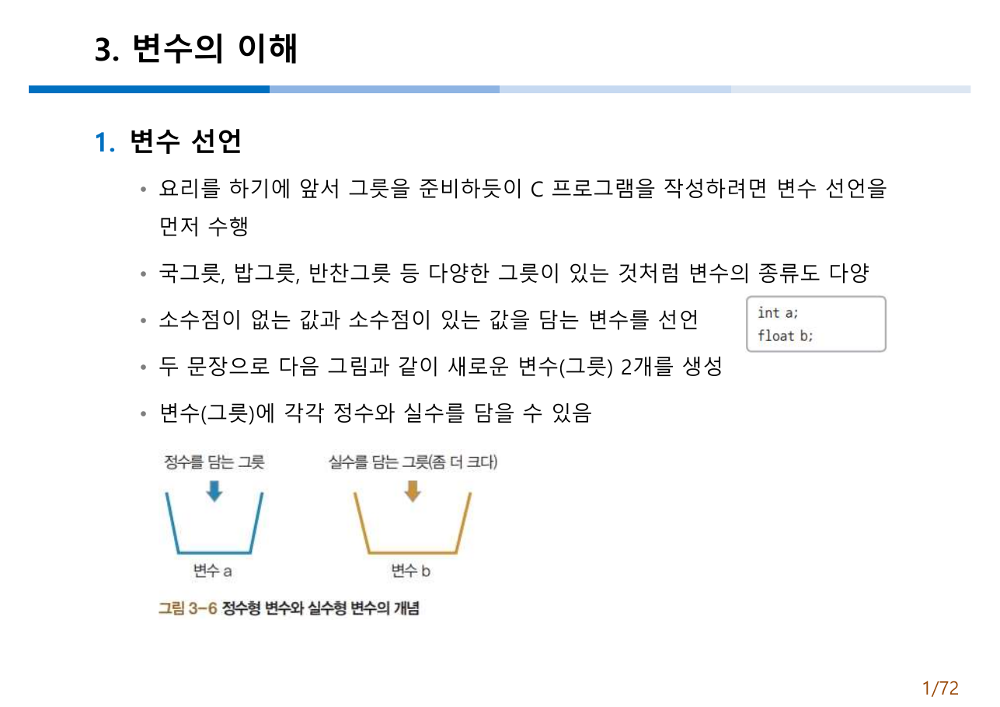

> 요리를 하기에 앞서 그릇을 준비하듯이 C 프로그램을 작성하려면 **변수 선언을 먼저 수행**한다. 국그릇, 밥그릇, 반찬그릇 등 다양한 그릇이 있는 것처럼 **변수의 종류도 다양**하다.

[1장의 주방 비유](./01.%20컴퓨터의%20이해와%20정보의%20표현.md)가 여기서도 이어진다. 그리고 그림 3-6의 두 그릇 중 실수 그릇이 **더 크게** 그려져 있다. 나중에 나올 `float`(4바이트)와 `int`(4바이트)는 사실 같은 크기지만, 담을 수 있는 범위가 다르다는 인상을 먼저 심어 준다.

2~3쪽은 선언 방식의 문법적 세부를 다룬다. 같은 종류면 `int a, b;`처럼 콤마로 이어 쓸 수 있고, 3쪽의 "여기서 잠깐"이 한 가지를 바로잡는다.

> 한 줄에 하나의 데이터 형식만 선언할 수 있다고 했으나 엄밀하게 말하면 '한 줄'이 아니라 **'한 문장'**이라고 해야 옳음. 세미콜론(;)으로 구분된 것은 완전히 분리된 문장으로 취급된다.

C가 줄바꿈이 아니라 **세미콜론**으로 문장을 끊는다는 사실을 이 한 문장이 알려준다.

4~5쪽은 대입 연산자의 규칙을 둘로 정리한다.

- **왼쪽에는 변수만** 올 수 있다.
- **오른쪽에는 상수·변수·계산값·함수** 등 무엇이든 올 수 있다.

이 비대칭이 [4장 021쪽에서 `x ← x + 10`이 성립한 이유](./04.%20순서도%20작성%20실습.md)와 같다. 대입은 등호가 아니라 방향이 있는 동작이다.

### 데이터 형식 — 세 개의 표

6·7·9쪽이 표 세 개로 그릇의 목록을 준다.

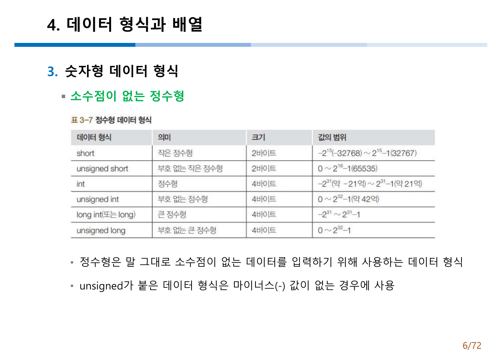

| 데이터 형식 | 크기 | 값의 범위 |
| --- | --- | --- |
| `short` | 2바이트 | $-2^{15}(-32768) \sim 2^{15}-1(32767)$ |
| `unsigned short` | 2바이트 | $0 \sim 2^{16}-1(65535)$ |
| `int` | 4바이트 | $-2^{31}$(약 −21억) $\sim 2^{31}-1$(약 21억) |
| `unsigned int` | 4바이트 | $0 \sim 2^{32}-1$(약 42억) |
| `long int`(또는 `long`) | 4바이트 | $-2^{31} \sim 2^{31}-1$ |
| `unsigned long` | 4바이트 | $0 \sim 2^{32}-1$ |

| 데이터 형식 | 크기 | 값의 범위 | 정밀도 |
| --- | --- | --- | --- |
| `float` | 4바이트 | 약 $-3.4\times10^{38} \sim 3.4\times10^{38}$ | 소수 아래 약 7자리 |
| `double` | 8바이트 | 약 $-1.79\times10^{308} \sim 1.79\times10^{308}$ | 소수 아래 약 16자리 |
| `long double` | 8바이트 | 약 $-1.79\times10^{308} \sim 1.79\times10^{308}$ | — |

| 데이터 형식 | 크기 | 값의 범위 |
| --- | --- | --- |
| `char` | 1바이트 | $-2^{7}(-128) \sim 2^{7}-1(127)$ |
| `unsigned char` | 1바이트 | $0 \sim 2^{8}-1(255)$ |

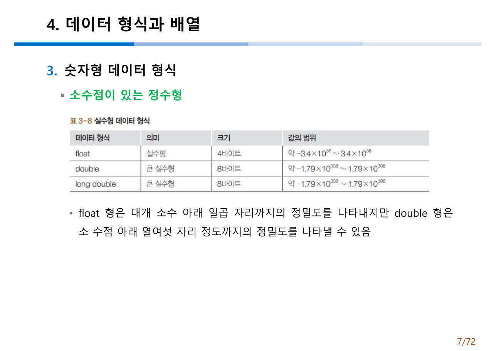

> [!warning] 원본 변수와배열 7쪽 — 소제목이 "소수점이 있는 **정수형**"으로 되어 있다
> 표 제목은 **[표 3-8] 실수형 데이터 형식**이고 내용도 `float`·`double`인데, 슬라이드 소제목만 "소수점이 있는 **정수형**"이라고 적혀 있다. 6쪽의 "소수점이 없는 정수형"을 복사해 고치다 만 것으로 보인다. **실수형**이 맞다.

이 세 표가 [1장 3절](./01.%20컴퓨터의%20이해와%20정보의%20표현.md)의 결론과 정확히 맞물린다.

- `char`가 1바이트인데 **아스키코드가 0~127**만 쓰므로(변수와배열 8쪽) 부호 있는 1바이트로도 전부 담긴다.
- `float`가 4바이트로 $10^{38}$까지 닿는 것은 [1장 55쪽의 정규화](./01.%20컴퓨터의%20이해와%20정보의%20표현.md) — 가수와 지수를 나누어 저장하기 때문이다. 대신 정밀도가 7자리로 제한된다. **범위를 얻고 정밀도를 내준 거래**가 표의 두 열에 그대로 드러나 있다.
- `int`의 범위가 $-2^{31} \sim 2^{31}-1$로 **음수 쪽이 하나 더 많은** 것은 [1장 53쪽의 2의 보수](./01.%20컴퓨터의%20이해와%20정보의%20표현.md) 때문이다. 원본은 이 연결을 명시하지 않는다.

```html preview h=580px
<div style="font-family:system-ui,-apple-system,sans-serif;padding:20px;color:var(--foreground)">
  <div style="margin-bottom:12px">
    <label for="mag" style="font-size:12.5px;font-weight:600">담으려는 정수의 크기 (10의 거듭제곱) — 현재 <span id="magv" style="color:var(--chart-1);font-weight:700">100</span></label>
    <input id="mag" type="range" min="0" max="12" step="1" value="2" style="width:100%;accent-color:var(--primary)" />
  </div>
  <div style="display:flex;gap:14px;flex-wrap:wrap;align-items:center;margin-bottom:12px">
    <label style="display:flex;gap:8px;align-items:center;font-size:13px;cursor:pointer">
      <input id="neg" type="checkbox" checked style="width:16px;height:16px;accent-color:var(--chart-1)" /> 음수도 담아야 함
    </label>
    <span style="font-size:12px;color:var(--muted-foreground)">체크를 풀면 unsigned 형이 후보에 들어온다</span>
  </div>
  <div id="fits"></div>
  <div id="tip" style="margin-top:14px;padding:11px 13px;background:var(--card);border:1px solid var(--border);border-radius:var(--radius);font-size:13px;line-height:1.7"></div>

  <script>
    // 원본 [표 3-7]·[표 3-10]의 값 그대로
    var T = [
      { n: 'char', b: 1, lo: -128, hi: 127, u: false },
      { n: 'unsigned char', b: 1, lo: 0, hi: 255, u: true },
      { n: 'short', b: 2, lo: -32768, hi: 32767, u: false },
      { n: 'unsigned short', b: 2, lo: 0, hi: 65535, u: true },
      { n: 'int', b: 4, lo: -2147483648, hi: 2147483647, u: false },
      { n: 'unsigned int', b: 4, lo: 0, hi: 4294967295, u: true },
      { n: 'long int', b: 4, lo: -2147483648, hi: 2147483647, u: false },
      { n: 'unsigned long', b: 4, lo: 0, hi: 4294967295, u: true }
    ];
    var el = document.getElementById('mag'), neg = document.getElementById('neg');
    function render() {
      var e = parseInt(el.value, 10);
      var v = Math.pow(10, e);
      var want = neg.checked ? -v : v;
      document.getElementById('magv').textContent = (neg.checked ? '±' : '') + v.toLocaleString();
      var any = false;
      document.getElementById('fits').innerHTML = T.map(function (t) {
        if (t.u && neg.checked) {
          return '<div style="display:flex;gap:10px;align-items:center;padding:6px 10px;border-bottom:1px solid var(--border);font-size:12.5px;color:var(--muted-foreground)">' +
            '<b style="min-width:130px;font-family:ui-monospace,Menlo,monospace">' + t.n + '</b>' +
            '<span style="min-width:60px">' + t.b + '바이트</span><span>음수를 담을 수 없음</span></div>';
        }
        var ok = (want >= t.lo) && (v <= t.hi);
        if (ok) any = true;
        return '<div style="display:flex;gap:10px;align-items:center;padding:6px 10px;border-bottom:1px solid var(--border);font-size:12.5px;' +
          (ok ? '' : 'color:var(--muted-foreground)') + '">' +
          '<b style="min-width:130px;font-family:ui-monospace,Menlo,monospace;color:' + (ok ? 'var(--chart-1)' : 'inherit') + '">' + t.n + '</b>' +
          '<span style="min-width:60px">' + t.b + '바이트</span>' +
          '<span style="min-width:150px">' + t.lo.toLocaleString() + ' ~ ' + t.hi.toLocaleString() + '</span>' +
          '<span>' + (ok ? '<b style="color:var(--chart-1)">담긴다</b>' : '넘친다') + '</span></div>';
      }).join('');
      document.getElementById('tip').innerHTML = any
        ? '가장 작은 그릇부터 고르는 것이 <b>공간 복잡도</b>를 줄이는 일이다 — [3장]에서 잰 그 두 번째 잣대다.<br>' +
          '<span style="color:var(--muted-foreground)">음수 쪽 경계가 양수 쪽보다 하나 더 큰 것(−128 대 127, −2³¹ 대 2³¹−1)은 [1장 53쪽] 2의 보수 때문이다. ' +
          '−0을 없애면서 남은 자리 하나가 음수에 배정된다.</span>'
        : '<b style="color:var(--destructive)">이 표의 어떤 정수형에도 담기지 않는다.</b> ' +
          '<span style="color:var(--muted-foreground)">원본 표의 정수형은 최대 4바이트(약 42억)까지다. 더 큰 수는 실수형(float·double)이나 다른 표현을 써야 한다.</span>';
    }
    el.addEventListener('input', render);
    neg.addEventListener('change', render);
    render();
  </script>
</div>
```

### 배열 — 그릇을 한 줄로 붙인다

10~12쪽이 배열이다. 정의는 짧다 — **"여러 개의 변수를 나란히 연결하는 개념"**. 박스를 한 줄로 붙이고 이름(`aa`)을 붙인 뒤 첨자로 구분한다.

11쪽의 표가 요점을 압축한다.

| 구분 | 변수 | 배열 |
| --- | --- | --- |
| 선언 예 | `int a, b, c, d;` | `int aa[4];` |
| 사용할 수 있는 형식 예 | `a, b, c, d` | `aa[0], aa[1], aa[2], aa[3]` |

그리고 굵게 짚는다 — **"배열을 4개 선언할 때는 첨자를 1~4가 아닌 0~3을 사용"**.

> [!important] [5장 064쪽의 오류가 여기에서 예고된다](./05.%20배열%20위의%20기본%20알고리즘.md)
> 개수는 4이고 마지막 첨자는 3이다. 이 한 칸의 어긋남이 순서도의 반복 조건을 `i <= n`으로 쓰게 만들었고, 그 결과 존재하지 않는 `x[n]`을 읽게 되었다. 이 슬라이드가 그 함정을 정확히 가리키고 있다.

12쪽은 배열이 왜 유용한지를 못 박는다 — **"배열의 첨자가 순서대로 변할 수 있도록 반복문과 함께 활용해야만 배열의 효율성이 극대화"**.

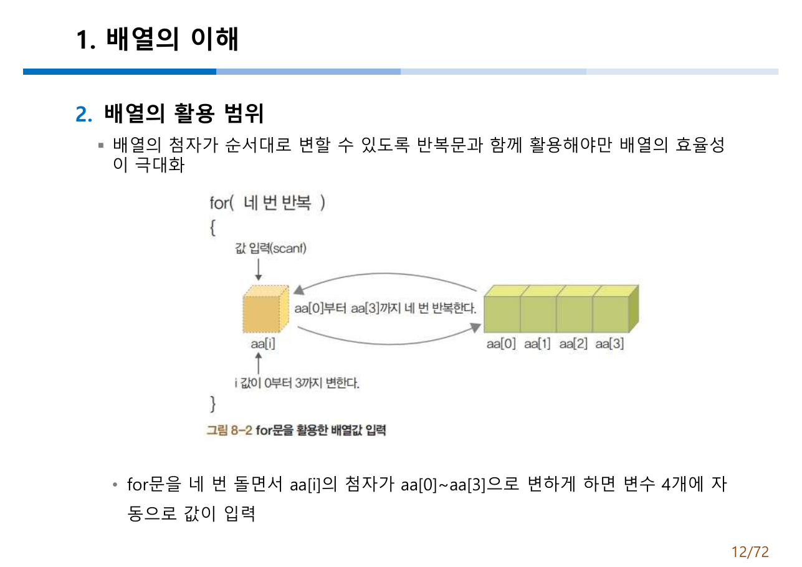

배열 하나와 반복문 하나. 이 둘의 결합이 [5장·6장의 모든 알고리즘](./05.%20배열%20위의%20기본%20알고리즘.md)이었다.

---

## 연산 — 다섯 종류의 연산자

`연산자.pdf`는 다섯 장이지만 연산자 전 종류를 훑는다.

| 종류(쪽) | 연산자 | 원본이 짚은 것 |
| --- | --- | --- |
| **산술**(1) | `+ - * / %` | 나머지 `%`가 목록에 포함 |
| **대입·증감**(2) | `= += -= *= /= %=`, `++ --` | 축약 대입과 1씩 증감 |
| **관계**(3) | `> < >= <= == !=` | 결과는 참(1) 또는 거짓(0) |
| **논리**(4) | `&&` `\|\|` `!` | 여러 조건을 복합적으로 |
| **비트**(5) | `& \| ^ ~ << >>` | 2진수로 변환한 뒤 자리별 연산 |

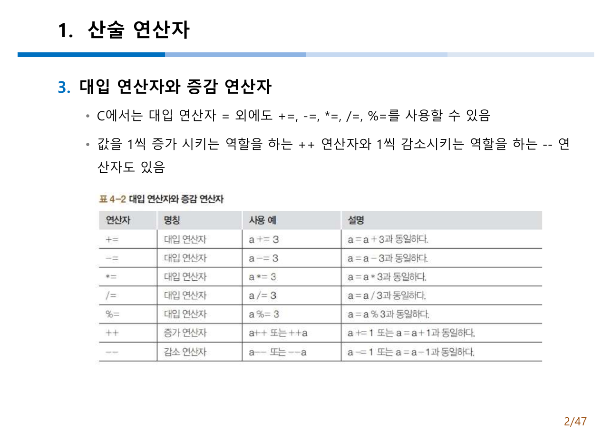

3쪽의 두 문장이 관계 연산자의 위치를 정해 준다.

> 조건문(if)이나 반복문(for, while)에서 사용하며 **단독으로 사용하는 경우는 별로 없음.** 일반적으로 **참은 1로, 거짓은 0으로** 표시한다.

관계 연산자는 그 자체가 목적이 아니라 **제어문에 넣을 재료**다. 그래서 다음 자료(`문법.pdf`)가 곧바로 이어진다.

4쪽의 예제는 [4장 036쪽의 복합 조건](./04.%20순서도%20작성%20실습.md)과 같은 문제를 C로 적은 것이다. "a가 100과 200 사이"를 `(a > 100) && (a < 200)`으로 쪼갠다.

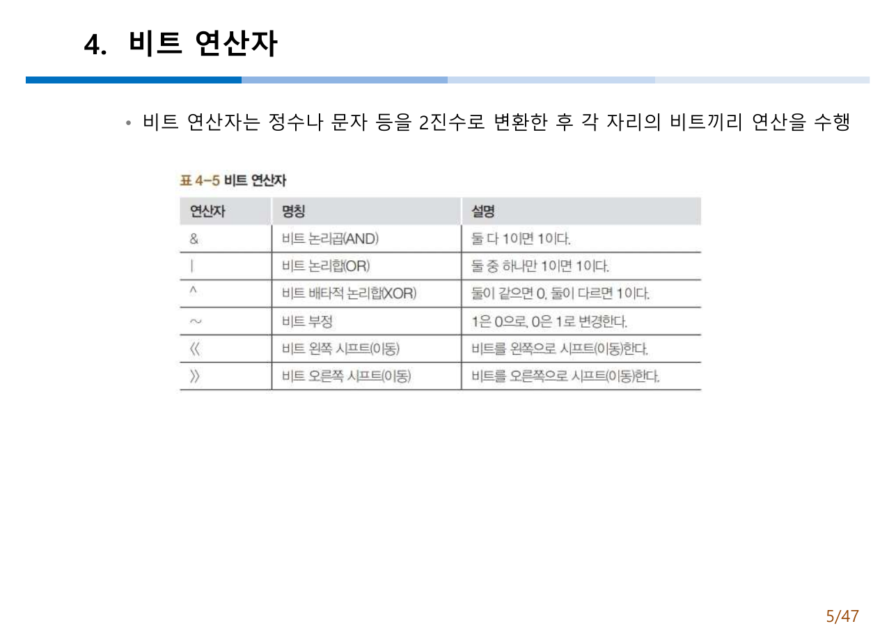

> [!note] 원본 연산자 5쪽의 OR 설명은 조심해서 읽어야 한다
> 비트 연산자 표는 논리합(`|`)을 "**둘 중 하나만 1이면 1**이다"로 적었다. 문자 그대로 읽으면 "정확히 하나만"이 되어 바로 아래 줄의 배타적 논리합(`^`, "둘이 다르면 1")과 구별되지 않는다.
>
> [1장 61쪽의 정의](./01.%20컴퓨터의%20이해와%20정보의%20표현.md)가 정확하다 — **"OR연산: 두 개의 값 중 하나라도 참이면 참이 되는 연산"**. 둘 다 1이어도 결과는 1이다. 두 자료를 함께 볼 때는 1장의 진리표를 기준으로 삼는 편이 안전하다.

비트 연산자가 [1장 3절](./01.%20컴퓨터의%20이해와%20정보의%20표현.md)의 회수 지점이다. 5쪽의 설명 — "정수나 문자 등을 **2진수로 변환한 후** 각 자리의 비트끼리 연산" — 은 1장에서 배운 진법 변환과 논리연산이 실제로 언어에 들어와 있다는 뜻이다.

---

## 흐름 — 갈라지는 두 방법, 도는 세 방법

`문법.pdf` 9장은 제어문만 다룬다. 그리고 슬라이드마다 **C 문법과 순서도를 나란히** 놓는다.

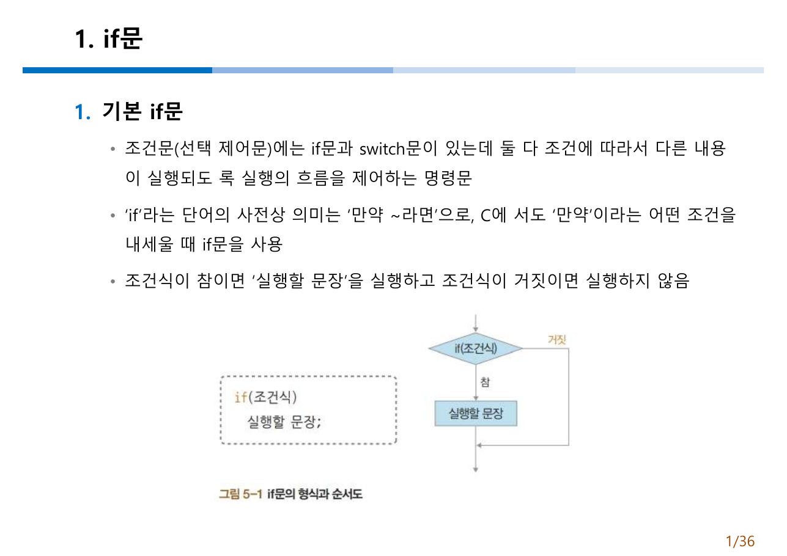

[4장에서 그린 마름모가 여기서 `if`가 된다.](./04.%20순서도%20작성%20실습.md) 순서도를 먼저 배운 이유가 이 대응에 있다.

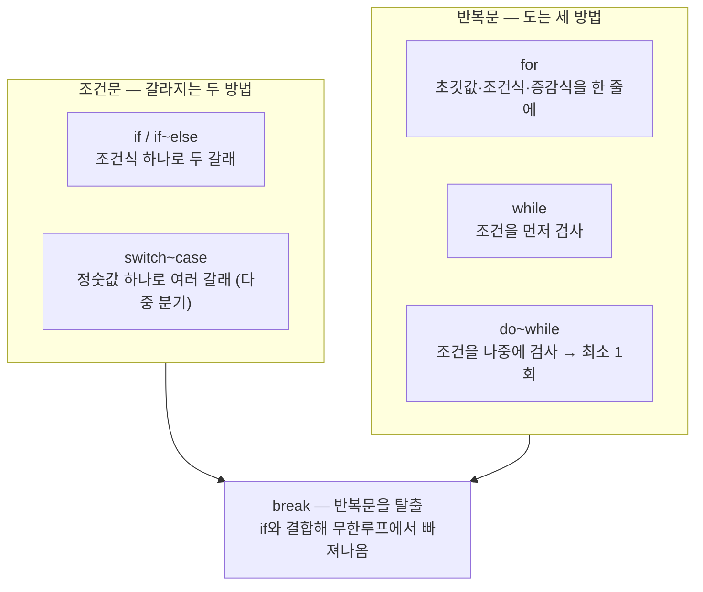
```mermaid
flowchart TB
  subgraph 갈라지기["조건문 — 갈라지는 두 방법"]
    IF["if / if~else<br/>조건식 하나로 두 갈래"]
    SW["switch~case<br/>정숫값 하나로 여러 갈래 (다중 분기)"]
  end
  subgraph 돌기["반복문 — 도는 세 방법"]
    FOR["for<br/>초깃값·조건식·증감식을 한 줄에"]
    WH["while<br/>조건을 먼저 검사"]
    DW["do~while<br/>조건을 나중에 검사 → 최소 1회"]
  end
  갈라지기 --> BRK["break — 반복문을 탈출<br/>if와 결합해 무한루프에서 빠져나옴"]
  돌기 --> BRK
```

### 갈라지기 — if와 switch

1~2쪽이 `if`와 `if~else`를, 3쪽이 `switch~case`를 다룬다. 3쪽의 정의가 둘의 차이를 정한다.

> 여러 개 중에 하나를 선택을 **'다중 분기'** 라고 함. 이 구문은 switch의 **조건값(정숫값)** 에 따라 case문을 실행한다.

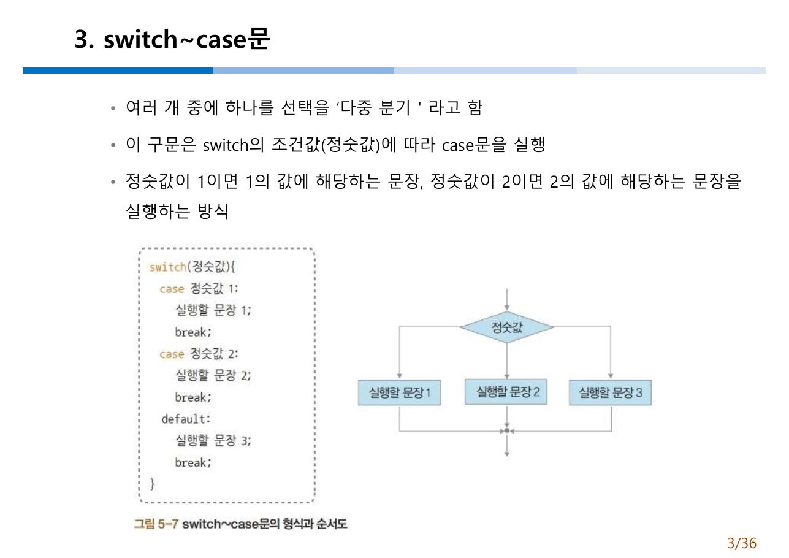

`if`의 조건식은 참/거짓 둘 중 하나지만, `switch`는 **정숫값 하나로 여러 갈래**를 낸다. [4장 041쪽의 등급 판정](./04.%20순서도%20작성%20실습.md)처럼 `if`를 여러 겹 중첩하는 대신 한 번에 갈라 놓는 방식이다.

### 돌기 — for, while, do~while

4~5쪽이 `for`다. 5쪽이 `for`의 다섯 요소를 번호로 짚는다.

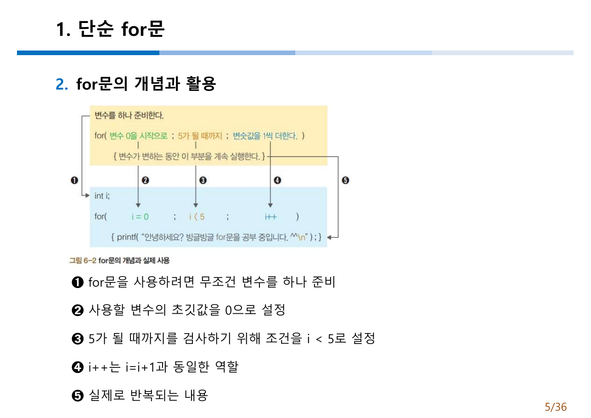

| 번호 | 원본의 설명 |
| --- | --- |
| ➊ | for문을 사용하려면 무조건 **변수를 하나 준비** |
| ➋ | 사용할 변수의 **초깃값을 0으로** 설정 |
| ➌ | 5가 될 때까지를 검사하기 위해 조건을 **`i < 5`** 로 설정 |
| ➍ | `i++`는 `i = i + 1`과 동일한 역할 |
| ➎ | 실제로 반복되는 내용 |

그리고 4쪽이 실행 순서를 적는다 — **➊, ➋를 수행한 뒤 ➌, ➍, ➋ 순서로 반복**. 초기화는 한 번뿐이고 조건 검사와 증감이 매 회 도는 구조다.

> [!tip] ➌의 조건이 `i <= 5`가 아니라 `i < 5`다
> 초깃값이 0이므로 다섯 번 돌려면 `i < 5`여야 한다. [5장 064쪽이 `i <= n`으로 잘못 적었던 그 자리](./05.%20배열%20위의%20기본%20알고리즘.md)를 이 슬라이드는 정확히 짚고 있다. 순서도에서 틀린 것을 문법 자료가 바로잡고 있는 셈이다.

6~7쪽이 `while`이다. 6쪽은 `for`와 나란히 놓고 비교하고, 7쪽은 무한루프를 다룬다 — `for( ; ; )`와 `while(1)`이 같은 역할이라는 것이다.

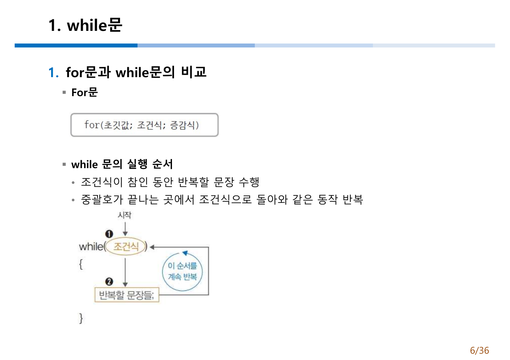

8쪽이 `do~while`이고, 설명이 [4장 061쪽과 거의 같은 문장](./04.%20순서도%20작성%20실습.md)이다.

> while문의 경우 처음의 조건식이 거짓이면 '반복할 문장들'을 한 번도 실행하지 않음. 하지만 do~while문에서는 조건식을 확인하기 전에 일단 '반복할 문장들'을 실행하므로 **조건식이 거짓이든 참이든 무조건 한 번은 실행**.

9쪽의 `break`가 마지막이다. "무한루프를 돌다 특정 조건을 만족하면 프로그램을 종료하는 역할" — 즉 `while(1)`과 `if`+`break`의 조합이다. [6장 106쪽 순차 탐색의 "찾으면 멈춘다"](./06.%20탐색과%20정렬%20알고리즘.md)가 C에서는 이렇게 적힌다.

---

## 자판기 — 함수는 반복을 이름으로 바꾼다

`함수.pdf`의 1쪽이 왜 함수가 필요한지를 그림 한 장으로 말한다.

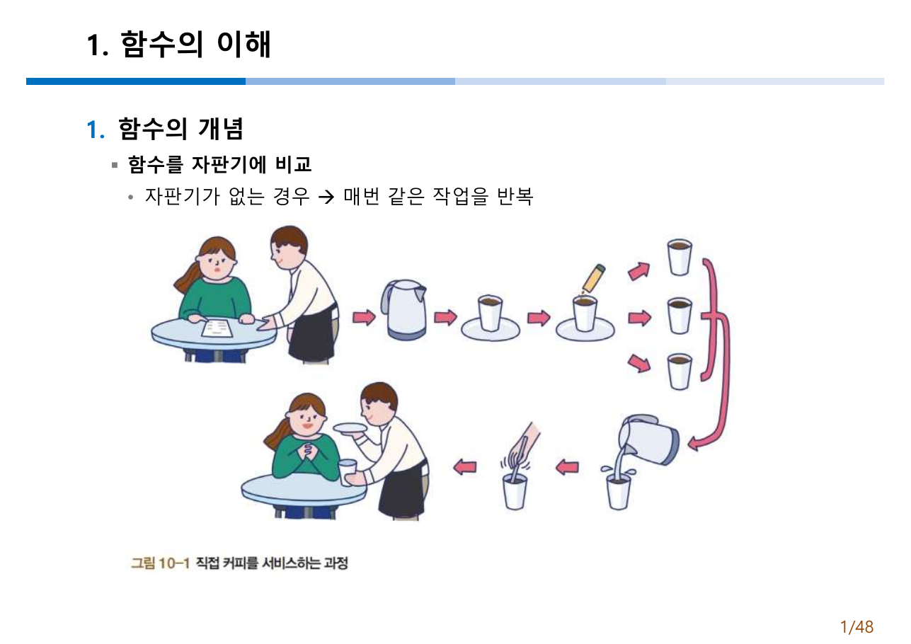

물을 끓이고, 컵을 놓고, 커피를 넣고, 물을 붓고, 젓고, 내놓는다. 손님이 올 때마다. 2쪽이 자판기로 대체한다.

> 함수는 **'매개변수'** 를 입력받은 후 그 매개변수를 가공하고 처리한 후 **'반환값'** 을 돌려줌. (커피 자판기를 예로 들면 '동전 넣기'과 '버튼 입력'이라는 매개변수를 받아서 커피를 탄 후 반환값으로 '커피'를 돌려줌)

3~4쪽이 반환값의 유무로 함수를 둘로 나눈다.

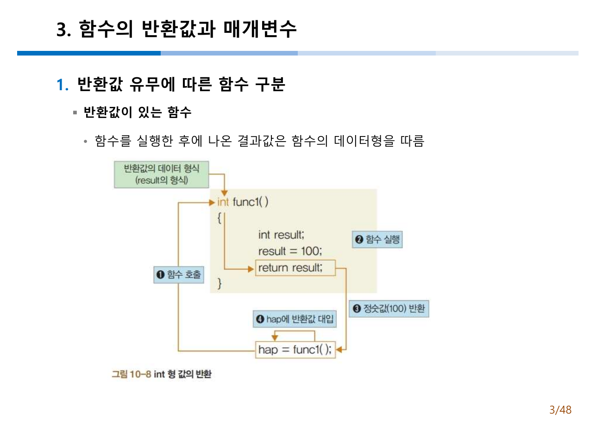

3쪽 [그림 10-8]은 `int func1()`이 `result = 100`을 만들어 `return result`하고, 호출한 쪽의 `hap = func1();`이 그 100을 받는 네 단계를 화살표로 보인다. **반환값의 데이터 형식이 곧 함수의 데이터형**이다.

4쪽은 반환할 것이 없는 경우다 — `void`로 표시하고, 호출할 때는 함수 이름만 쓴다.

> [!note] [6장의 순서도 함수들이 여기서 문법을 얻는다](./06.%20탐색과%20정렬%20알고리즘.md)
> `findMinimum`은 위치를 돌려주므로 반환값이 있는 함수이고, `markMultiple`과 `compareElement`는 배열에 표시만 하고 돌려줄 것이 없으므로 `void` 함수다. 순서도에서 단말 기호가 "반환 값 정수 sum"인지 그냥 "종료"인지로 갈렸던 그 차이가 C에서는 `int`와 `void`가 된다.

### 그리고 마지막 장에서 4장이 되돌아온다

5~7쪽이 매개변수 전달 방식이다. 여기가 이 발췌본 33장의 결말이다.

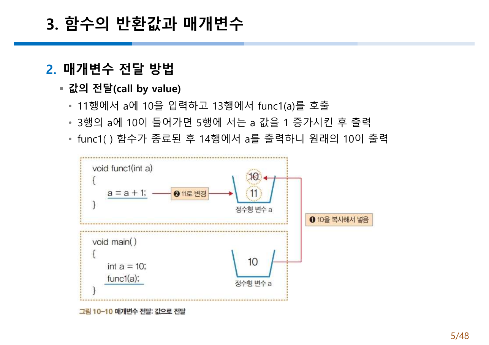

5쪽의 코드는 짧다. `a`에 10을 넣고 `func1(a)`를 부른다. 함수 안에서 `a`를 1 증가시켜 11을 출력하지만, **함수가 끝난 뒤 밖에서 `a`를 출력하면 원래의 10이 나온다.** 원본의 설명이 이 결과를 그대로 적는다.

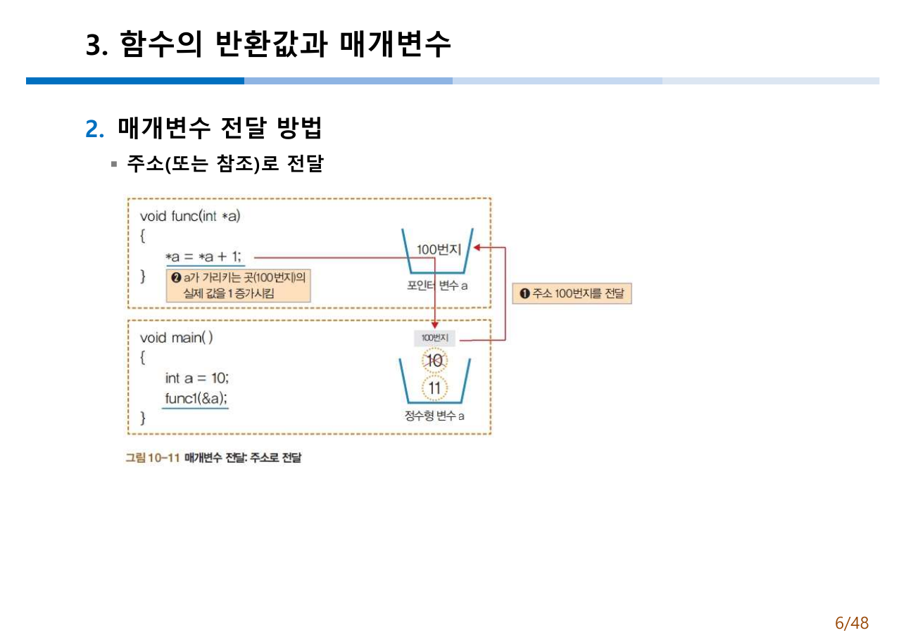

6쪽이 해법이다. `void func(int *a)`로 받고 `func(&a)`로 넘긴다. 값이 아니라 **주소**를 넘기므로 함수 안의 `*a` 갱신이 바깥에 반영된다.

> [!note] 원본 함수 6쪽 — 함수 이름이 어긋나 있다
> 정의는 `void func(int *a)`인데 호출은 `func1(&a);`로 되어 있다. 5쪽의 `func1`을 복사해 오면서 정의 쪽만 이름을 바꾼 것으로 보인다. 둘 중 하나로 통일해야 컴파일된다.

![두 문자 변수의 교환 — [4장]의 그 문제가 되돌아온다 (원본 함수 7쪽)](../assets/ch07-f07-값전달-교환실패.png)

7쪽이 마지막 슬라이드다. 그리고 다루는 문제가 **`x`와 `y`의 값을 바꾸는 것**이다. `int x = 'A', y = 'Z';`로 시작해 함수를 부르고, 함수 안에서는 임시 변수 `temp`를 써서 제대로 교환하지만 — **함수 밖에서는 여전히 A와 Z 그대로다.**

```html preview h=600px
<div style="font-family:system-ui,-apple-system,sans-serif;padding:20px;color:var(--foreground)">
  <div style="display:flex;gap:8px;flex-wrap:wrap;margin-bottom:14px">
    <button id="byval" style="cursor:pointer;font:inherit;font-size:12.5px;padding:5px 12px;border-radius:var(--radius);border:1px solid var(--border);background:transparent;color:var(--foreground)">값으로 전달 (원본 7쪽)</button>
    <button id="byref" style="cursor:pointer;font:inherit;font-size:12.5px;padding:5px 12px;border-radius:var(--radius);border:1px solid var(--border);background:transparent;color:var(--foreground)">주소로 전달 (원본 6쪽 방식)</button>
    <button id="st3" style="cursor:pointer;font:inherit;font-size:12.5px;padding:5px 12px;border-radius:var(--radius);border:1px solid var(--chart-1);background:var(--chart-1);color:var(--primary-foreground)">다음 줄 ▶</button>
    <button id="rs4" style="cursor:pointer;font:inherit;font-size:12.5px;padding:5px 12px;border-radius:var(--radius);border:1px solid var(--border);background:transparent;color:var(--foreground)">처음으로</button>
  </div>

  <div style="display:flex;gap:16px;flex-wrap:wrap">
    <div style="flex:1;min-width:210px;border:1px solid var(--border);border-radius:var(--radius);padding:11px 13px;background:var(--card)">
      <div style="font-size:12px;color:var(--muted-foreground);margin-bottom:6px">main의 변수</div>
      <div id="outer" style="display:flex;gap:10px"></div>
    </div>
    <div style="flex:1;min-width:210px;border:1px dashed var(--border);border-radius:var(--radius);padding:11px 13px">
      <div style="font-size:12px;color:var(--muted-foreground);margin-bottom:6px">함수 안의 매개변수</div>
      <div id="inner" style="display:flex;gap:10px"></div>
    </div>
  </div>

  <div id="src" style="margin-top:14px;font-family:ui-monospace,Menlo,monospace;font-size:12.5px;line-height:1.95;background:var(--card);border:1px solid var(--border);border-radius:var(--radius);padding:11px 13px"></div>
  <div id="fin2" style="margin-top:12px;padding:11px 13px;border:1px solid var(--border);border-radius:var(--radius);font-size:13px;line-height:1.7"></div>

  <script>
    var ref = false, pc = 0;
    var S;
    function reset() {
      S = { x: 'A', y: 'Z', px: null, py: null, temp: null, entered: false };
      pc = 0; draw();
    }
    var VAL = [
      ["main:  swap(x, y);  // 값이 복사된다", function (s) { s.entered = true; s.px = s.x; s.py = s.y; }],
      ["  temp = a;", function (s) { s.temp = s.px; }],
      ["  a = b;", function (s) { s.px = s.py; }],
      ["  b = temp;", function (s) { s.py = s.temp; }],
      ["main:  printf(x, y);  // 함수가 끝났다", function (s) { s.entered = false; }]
    ];
    var REF = [
      ["main:  swap(&x, &y);  // 주소가 넘어간다", function (s) { s.entered = true; }],
      ["  temp = *a;", function (s) { s.temp = s.x; }],
      ["  *a = *b;", function (s) { s.x = s.y; }],
      ["  *b = temp;", function (s) { s.y = s.temp; }],
      ["main:  printf(x, y);  // 함수가 끝났다", function (s) { s.entered = false; }]
    ];
    function prog() { return ref ? REF : VAL; }
    function chip(n, v, color) {
      return '<div style="text-align:center;border:1px solid ' + (v === null ? 'var(--border)' : color) +
        ';border-radius:var(--radius);padding:7px 14px;min-width:62px">' +
        '<div style="font-size:11px;color:var(--muted-foreground)">' + n + '</div>' +
        '<div style="font-size:22px;font-weight:800;color:' + (v === null ? 'var(--muted-foreground)' : color) + '">' + (v === null ? '—' : v) + '</div></div>';
    }
    function draw() {
      [['byval', !ref], ['byref', ref]].forEach(function (p) {
        var b = document.getElementById(p[0]);
        b.style.borderColor = p[1] ? 'var(--chart-1)' : 'var(--border)';
        b.style.background = p[1] ? 'var(--chart-1)' : 'transparent';
        b.style.color = p[1] ? 'var(--primary-foreground)' : 'var(--foreground)';
      });
      document.getElementById('outer').innerHTML = chip('x', S.x, 'var(--chart-1)') + chip('y', S.y, 'var(--chart-2)');
      document.getElementById('inner').innerHTML = S.entered
        ? (ref
          ? chip('*a → x', S.x, 'var(--chart-1)') + chip('*b → y', S.y, 'var(--chart-2)') + chip('temp', S.temp, 'var(--chart-4)')
          : chip('a (사본)', S.px, 'var(--chart-1)') + chip('b (사본)', S.py, 'var(--chart-2)') + chip('temp', S.temp, 'var(--chart-4)'))
        : '<span style="font-size:12.5px;color:var(--muted-foreground)">아직 함수 안이 아니다</span>';

      var P = prog();
      document.getElementById('src').innerHTML = P.map(function (r, i) {
        var now = i === pc, done = i < pc;
        return '<div style="' + (now ? 'background:var(--border);border-radius:4px;padding:0 6px;' : 'padding:0 6px;') +
          (done ? 'color:var(--muted-foreground)' : '') + '">' + (now ? '▶ ' : '&nbsp;&nbsp;') + r[0] + '</div>';
      }).join('');

      var done = pc >= P.length;
      var ok = S.x === 'Z' && S.y === 'A';
      document.getElementById('fin2').innerHTML = done
        ? (ok
          ? '<b style="color:var(--chart-2)">교환 성공.</b> x = Z, y = A. 함수가 <b>주소</b>를 받았으므로 main의 변수 자체를 고쳤다.'
          : '<b style="color:var(--destructive)">교환 실패.</b> x = A, y = Z — 그대로다. ' +
            '함수 안에서는 <b>사본</b>을 제대로 바꿨지만, 함수가 끝나면서 사본이 사라졌다.<br>' +
            '<span style="color:var(--muted-foreground)">[4장 027쪽]에서는 임시 변수가 없어서 실패했고, 여기서는 임시 변수가 있는데도 실패한다. 원인이 다르다.</span>')
        : (pc === 0
          ? '「다음 줄」을 눌러 한 줄씩 실행해 보라. 원본 7쪽은 <code>int x = \'A\', y = \'Z\';</code> 로 시작한다.'
          : '방금 <code>' + P[pc - 1][0] + '</code> 를 실행했다.');
    }
    document.getElementById('byval').addEventListener('click', function () { ref = false; reset(); });
    document.getElementById('byref').addEventListener('click', function () { ref = true; reset(); });
    document.getElementById('rs4').addEventListener('click', reset);
    document.getElementById('st3').addEventListener('click', function () {
      var P = prog();
      if (pc < P.length) { P[pc][1](S); pc++; draw(); }
    });
    reset();
  </script>
</div>
```

> [!important] 같은 문제가 세 번, 매번 다른 이유로 실패한다
>
> - [3장 6·8·9쪽](./03.%20알고리즘과%20프로그래밍%20언어.md) — Z를 쓰는 정답만 제시된다.
> - [4장 027쪽](./04.%20순서도%20작성%20실습.md) — **임시 변수가 없어서** 실패한다. 첫 대입이 값을 덮는다.
> - 이 자료 7쪽 — **임시 변수가 있는데도** 실패한다. 함수가 받은 것이 원본이 아니라 사본이기 때문이다.
>
> 두 번째 실패의 해법은 임시 변수였고, 세 번째 실패의 해법은 주소 전달이다. **같은 증상에 다른 원인, 다른 처방.** 이 발췌본이 왜 하필 이 예제로 끝나는지가 여기서 분명해진다.

다만 이 마지막 슬라이드에는 표기 문제가 두 가지 겹쳐 있다.

> [!warning] 원본 함수 7쪽 — 소제목과 그림 제목이 서로 다르다
> 슬라이드 소제목은 **"주소(또는 참조)로 전달"** 인데, 아래 그림 제목은 **[그림 10-12] '값으로 전달'을 통한 교환**이고 코드도 값 전달이다(교환이 실패하는 예). 6쪽에서 이어지는 소제목을 그대로 두고 내용만 바꾼 것으로 보인다. **그림 제목이 맞다.**
>
> 같은 슬라이드에 하나 더 있다. 코드는 `int x = 'A', y = 'Z';`로 **`int`** 를 쓰는데, 아래 그림은 x와 y를 **문자형 변수**라고 표시한다. `char`가 자연스럽지만, 변수와배열 9쪽이 "char 형을 1바이트 크기의 정수형으로 취급해도 상관없음"이라 했듯 `int`에 문자 상수를 담는 것 자체는 성립한다. 표기가 엇갈릴 뿐이다.

---

## 정리

> [!tip] 이 장의 골격
>
> 1. **203장에서 33장이 남았다.** 남은 것들이 그리는 선은 그릇 → 연산 → 흐름 → 자판기다. 문법 항목을 빠짐없이 다루려는 자료가 아니라, **앞 여섯 장에서 순서도로 배운 것을 언어로 옮기는 최소 세트**다.
> 2. **데이터 형식 표 세 개가 [1장 3절](./01.%20컴퓨터의%20이해와%20정보의%20표현.md)의 결론이다.** `char`의 1바이트는 아스키 0~127에서, `int`의 비대칭 범위는 2의 보수에서, `float`의 넓은 범위와 낮은 정밀도는 정규화에서 온다.
> 3. **배열은 첨자가 0부터**이고, 반복문과 함께 써야 값을 한다. 이 두 문장이 [5·6장 전체](./05.%20배열%20위의%20기본%20알고리즘.md)의 전제였다.
> 4. **제어문은 갈라지는 둘, 도는 셋.** `if`/`switch`, `for`/`while`/`do~while`. [4장 058~061쪽의 세 반복 순서도](./04.%20순서도%20작성%20실습.md)가 여기서 이름을 얻는다.
> 5. **마지막 슬라이드가 4장의 교환 문제로 돌아온다.** 임시 변수를 써도 함수 경계를 넘으면 실패하고, 주소를 넘겨야 성립한다.
> 6. **원본 오류 세 건.** 변수와배열 7쪽의 "소수점이 있는 정수형", 함수 6쪽의 `func`/`func1` 불일치, 함수 7쪽의 소제목과 그림 제목 불일치. 연산자 5쪽의 OR 서술도 조심해서 읽어야 한다.

여기까지가 텍스트 기반 프로그래밍이다. 다음 두 장은 같은 개념 — 변수, 조건, 이벤트 — 을 **블록을 끼워 맞추는 방식**으로 다시 만난다. [8장 앱 인벤터](./08.%20앱%20인벤터%20기초%20프로젝트.md)에서는 문법 오류라는 것이 아예 존재하지 않는데, 맞지 않는 블록은 끼워지지 않기 때문이다.

---

### 근거 자료

강의 원본 네 편에 근거한다.

- `변수와배열.pdf`(12쪽, 원본 72장 중 발췌) — 교재 3장(변수)·4장(데이터 형식)·8장(배열)
- `연산자.pdf`(5쪽, 원본 47장 중 발췌) — 교재 4장
- `문법.pdf`(9쪽, 원본 36장 중 발췌) — 교재 5장(조건문)·6장(반복문)
- `함수.pdf`(7쪽, 원본 48장 중 발췌) — 교재 10장

인용한 슬라이드는 변수와배열 1쪽(그릇 비유), 6쪽([표 3-7] 정수형), 7쪽([표 3-8] 실수형), 9쪽([표 3-10] 문자형), 12쪽([그림 8-2] for문과 배열); 연산자 2쪽(대입·증감), 5쪽(비트 연산자); 문법 1쪽(if의 형식과 순서도), 3쪽(switch~case), 5쪽(for문); 함수 1쪽(자판기 비유), 5쪽(값으로 전달), 6쪽(주소로 전달), 7쪽([그림 10-12] 값 전달을 통한 교환)이다.

인터렉티브에 사용한 수치는 모두 원본 표 그대로다. 데이터 형식 도구의 범위는 [표 3-7]과 [표 3-10]의 값(`char` −128~127, `unsigned char` 0~255, `short` −32768~32767, `unsigned short` 0~65535, `int`·`long int` $-2^{31} \sim 2^{31}-1$, `unsigned int`·`unsigned long` $0 \sim 2^{32}-1$)을 그대로 쓰고 파이썬으로 대조했다. 매개변수 전달 도구의 `x = 'A'`, `y = 'Z'`는 함수 7쪽의 코드 값이다.

이 자료들에서 발견한 원본 오류는 세 건 — **변수와배열 7쪽 소제목 "소수점이 있는 정수형"**(실수형이 맞음), **함수 6쪽의 정의 `func`와 호출 `func1` 불일치**, **함수 7쪽 소제목("주소로 전달")과 그림 제목·코드("값으로 전달") 불일치** — 이며 각각 본문 Callout에 기록했다. 연산자 5쪽의 논리합 서술이 배타적 논리합처럼 읽힐 여지가 있는 점도 함께 적어 두었다.
