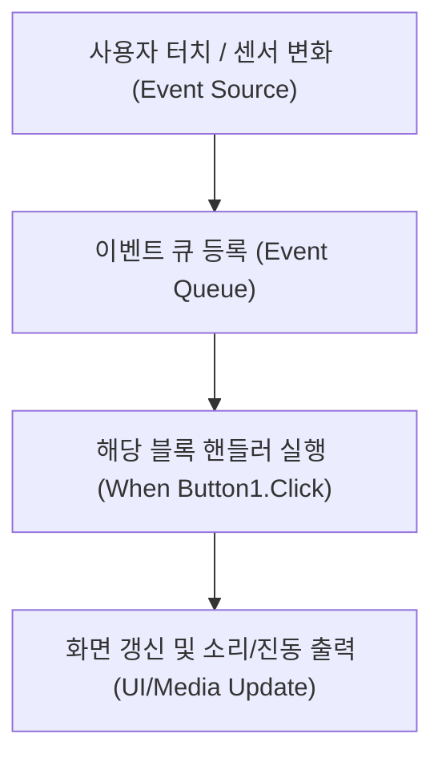

MIT 앱 인벤터(App Inventor)는 스마트폰의 센서(터치, 가속도계, 음성 인식 등)와 UI 컴포넌트를 블록 조립 방식으로 결합하여 안드로이드 네이티브 앱을 제작하는 **이벤트 기반 모바일 개발 플랫폼**이다.

> [!IMPORTANT]
>
> - **컴포넌트 디자이너**: 버튼, 레이블, 캔버스 등 눈에 보이는 컴포넌트와 사운드, 가속도센서, TTS 등 보이지 않는(Non-visible) 컴포넌트를 배치.
> - **블록 에디터**: `When [Component].[Event] do` 형태의 이벤트 핸들러 블록으로 동작 로직을 구현.

---

## 1. 가상 스마트폰 드로잉 앱 (PaintPot) 인터랙티브 시뮬레이터

아래 가상 스마트폰 화면에서 색상(빨강, 파랑, 초록, 지우개)과 굵기를 선택하고 캔버스 위를 마우스로 드래그하면 모바일 이벤트(`Touched`, `Dragged`)가 실시간으로 동작한다.

```html preview
<div style="font-family:system-ui,-apple-system,sans-serif;padding:18px;background:var(--card);color:var(--card-foreground);border:1px solid var(--border);border-radius:var(--radius);max-width:100%">
  <!-- 상단 스마트폰 툴바 (색상 & 지우개) -->
  <div style="display:flex;gap:8px;align-items:center;margin-bottom:12px;flex-wrap:wrap">
    <button id="paint-red" style="width:28px;height:28px;border-radius:50%;background:#e53e3e;border:2px solid #fff;cursor:pointer"></button>
    <button id="paint-blue" style="width:28px;height:28px;border-radius:50%;background:#3182ce;border:2px solid #fff;cursor:pointer"></button>
    <button id="paint-green" style="width:28px;height:28px;border-radius:50%;background:#38a169;border:2px solid #fff;cursor:pointer"></button>
    <button id="paint-eraser" style="padding:4px 10px;background:var(--border);color:var(--foreground);border:none;border-radius:var(--radius);cursor:pointer;font-size:12px">지우개</button>
    <button id="paint-clear" style="padding:4px 10px;background:transparent;border:1px solid var(--border);color:var(--muted-foreground);border-radius:var(--radius);cursor:pointer;font-size:12px">전체 지우기</button>
    <div style="display:flex;align-items:center;gap:6px;margin-left:auto">
      <span style="font-size:11px;color:var(--muted-foreground)">굵기:</span>
      <input id="paint-size" type="range" min="2" max="20" value="4" style="width:70px;accent-color:var(--primary)" />
    </div>
  </div>

  <!-- 가상 스마트폰 캔버스 -->
  <div style="background:#ffffff;border:2px solid var(--border);border-radius:12px;padding:6px;box-shadow:0 4px 12px rgba(0,0,0,0.1);display:flex;justify-content:center">
    <canvas id="paint-canvas" width="400" height="180" style="background:#ffffff;border-radius:8px;cursor:crosshair;touch-action:none;display:block"></canvas>
  </div>

  <!-- 앱 인벤터 이벤트 로그 -->
  <div style="margin-top:10px;font-family:monospace;font-size:11px;color:var(--muted-foreground)">
    트리거된 블록 이벤트: <code id="paint-event-log" style="color:var(--chart-2);font-weight:700">Canvas1.Initialize</code>
  </div>
</div>

<script>
(function() {
  var canvas = document.getElementById('paint-canvas');
  var ctx = canvas.getContext('2d');
  var evLog = document.getElementById('paint-event-log');
  var curColor = '#e53e3e';
  var isDrawing = false;
  var lastX = 0, lastY = 0;

  var sizeSlider = document.getElementById('paint-size');

  function getPos(e) {
    var rect = canvas.getBoundingClientRect();
    var clientX = e.touches ? e.touches[0].clientX : e.clientX;
    var clientY = e.touches ? e.touches[0].clientY : e.clientY;
    return {
      x: clientX - rect.left,
      y: clientY - rect.top
    };
  }

  function startDraw(e) {
    isDrawing = true;
    var pos = getPos(e);
    lastX = pos.x; lastY = pos.y;
    evLog.textContent = 'When Canvas1.Touched(x=' + Math.round(pos.x) + ', y=' + Math.round(pos.y) + ')';
    ctx.beginPath();
    ctx.arc(pos.x, pos.y, sizeSlider.value / 2, 0, Math.PI * 2);
    ctx.fillStyle = curColor;
    ctx.fill();
  }

  function draw(e) {
    if (!isDrawing) return;
    var pos = getPos(e);
    evLog.textContent = 'When Canvas1.Dragged(prevX=' + Math.round(lastX) + ', x=' + Math.round(pos.x) + ')';
    ctx.beginPath();
    ctx.moveTo(lastX, lastY);
    ctx.lineTo(pos.x, pos.y);
    ctx.strokeStyle = curColor;
    ctx.lineWidth = sizeSlider.value;
    ctx.lineCap = 'round';
    ctx.stroke();
    lastX = pos.x; lastY = pos.y;
  }

  function stopDraw() {
    isDrawing = false;
  }

  canvas.addEventListener('mousedown', startDraw);
  canvas.addEventListener('mousemove', draw);
  window.addEventListener('mouseup', stopDraw);

  canvas.addEventListener('touchstart', function(e) { e.preventDefault(); startDraw(e); });
  canvas.addEventListener('touchmove', function(e) { e.preventDefault(); draw(e); });
  canvas.addEventListener('touchend', stopDraw);

  document.getElementById('paint-red').addEventListener('click', function() { curColor = '#e53e3e'; evLog.textContent = 'When ButtonRed.Click -> Set Canvas1.PaintColor to Red'; });
  document.getElementById('paint-blue').addEventListener('click', function() { curColor = '#3182ce'; evLog.textContent = 'When ButtonBlue.Click -> Set Canvas1.PaintColor to Blue'; });
  document.getElementById('paint-green').addEventListener('click', function() { curColor = '#38a169'; evLog.textContent = 'When ButtonGreen.Click -> Set Canvas1.PaintColor to Green'; });
  document.getElementById('paint-eraser').addEventListener('click', function() { curColor = '#ffffff'; evLog.textContent = '지우개 모드 활성화 (흰색 브러시)'; });
  document.getElementById('paint-clear').addEventListener('click', function() {
    ctx.clearRect(0, 0, canvas.width, canvas.height);
    evLog.textContent = 'Call Canvas1.Clear() (캔버스 초기화)';
  });
})();
</script>
```

---

## 2. 앱 인벤터 컴포넌트 구조

| 컴포넌트 유형 | 화면 표시 여부 | 주요 기능 및 예시 |
| :--- | :--- | :--- |
| **UI 컴포넌트** | 보임 (Visible) | `Button`, `Label`, `TextBox`, `Image`, `ListView` |
| **레이아웃** | 보임 (Visible) | `HorizontalArrangement` (가로 배치), `TableArrangement` |
| **그리기/애니메이션** | 보임 (Visible) | `Canvas` (터치 좌표 감지, 선/원 그리기), `ImageSprite` |
| **미디어/센서** | **보이지 않음 (Non-Visible)** | `Sound`, `Player`, `SpeechRecognizer`, `AccelerometerSensor` |

---

## 3. 이벤트 기반 아키텍처 (Event-Driven)


