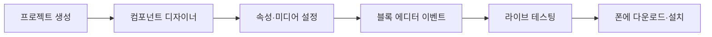

앱 인벤터 수업은 컴포넌트 디자이너에서 화면을 만들고 블록 에디터에서 이벤트 동작을 조립한 뒤 라이브 테스팅으로 확인하는 순서다.

> [!IMPORTANT]
> 간단한 대화형 인공지능.pdf와 음성검색.pdf는 텍스트 추출이 희소해 제목·기능 이상의 내용을 단정하지 않았다. 두 프로젝트에서 확인 가능한 앱 인벤터 개발 루프만 연결한다.

---

## 1. 공통 개발 루프



<Tabs>
  <Tab label="디자이너">보이는 컴포넌트와 보이지 않는 컴포넌트를 배치하고 속성을 설정한다.</Tab>
  <Tab label="블록">이벤트가 발생했을 때 실행할 명령 블록을 연결한다.</Tab>
  <Tab label="테스트">폰 또는 에뮬레이터로 클릭·흔들기·드래그 동작을 확인한다.</Tab>
</Tabs>

---

## 2. 안녕 야옹이

고양이 이미지를 터치하면 야옹 소리를 내고 폰을 진동시킨다. 폰을 흔들어도 같은 소리를 낸다. Button, Sound, Image 같은 컴포넌트를 화면과 보이지 않는 영역에 추가하고, Button.Click 이벤트에 소리와 진동 블록을 연결한다.

---

## 3. 페인트 통

PaintPot은 색깔 버튼, Canvas, HorizontalArrangement, Camera를 사용한다. 빨강·파랑·초록 버튼으로 페인트 색을 고르고, Canvas의 Touched와 Dragged 이벤트로 선과 점을 그린다. 지우기, 점 크기 조절, 사진 위 그리기 기능을 이벤트 블록으로 연결한다.

```html preview
<div style="font-family:system-ui,sans-serif;padding:20px;color:var(--foreground)">
  <label for="amt" style="font-size:14px;font-weight:600">앱 프로젝트 단계</label>
  <div id="out" style="font-size:30px;font-weight:700;color:var(--chart-1);margin:6px 0">1단계</div>
  <input id="amt" type="range" min="1" max="3" step="1" value="1"
    style="width:100%;accent-color:var(--primary)" />
  <p style="font-size:13px;color:var(--muted-foreground)">원본 자료의 순서를 움직여 해당 단계의 핵심을 확인한다.</p>
  <script>
    var amt = document.getElementById('amt');
    var out = document.getElementById('out');
    amt.addEventListener('input', function () {
      out.textContent = Number(amt.value).toLocaleString() + '단계';
    });
  </script>
</div>
```

> [!WARNING]
> 컴포넌트 이름을 의미 있게 바꾸면 블록을 읽기 쉽다. 자료는 라이브 테스팅 연결과 미디어 파일 업로드를 별도 단계로 강조한다.

<details>
<summary>이벤트 설계 점검</summary>

화면 입력(클릭·흔들기·터치·드래그) → 이벤트 처리기 → 소리·진동·그리기 명령 → 실제 기기 결과의 순서로 점검한다.

</details>

<!-- source: App Inventor project PDFs; sparse AI/voice decks retained as bounded evidence -->