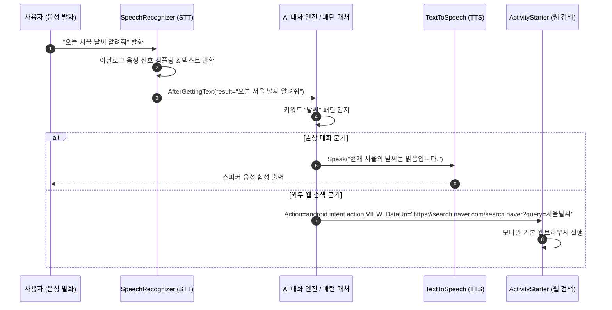

> [!abstract] 핵심 요약
> **앱 인벤터(MIT App Inventor 2)**는 웹 브라우저 기반으로 안드로이드 모바일 애플리케이션을 시각적으로 설계 및 제작하는 개발 플랫폼이다.
> 음성 인터페이스는 마이크로 입력된 아날로그 음성 파형을 텍스트로 변환하는 **음성 인식(STT, Speech-to-Text)**과 문자열을 인공 음성으로 합성하는 **음성 합성(TTS, Text-to-Speech)**의 양방향 파이프라인으로 구성된다.

---

## 1. 음성인식(STT) 및 음성합성(TTS) 파이프라인 아키텍처



---

## 2. 앱 인벤터 핵심 컴포넌트와 블록 구조

| 컴포넌트 명칭 | 카테고리 | 핵심 메서드 및 이벤트 | 기능 설명 |
| :-- | :-- | :-- | :-- |
| **`Button`** | 사용자 인터페이스 | `when Button.Click do` | 음성 인식 시작 트리거 버튼 |
| **`SpeechRecognizer`** | 미디어 (보이지 않는 컴포넌트) | `GetText()`, `when .AfterGettingText do` | 구글 음성 인식 엔진을 호출하여 음성을 문자열로 반환 |
| **`TextToSpeech`** | 미디어 (보이지 않는 컴포넌트) | `Speak(message)`, `Pitch`, `SpeechRate` | 텍스트 문자열을 음성으로 합성하여 출력 |
| **`ActivityStarter`** | 연결 (Connectivity) | `StartActivity()`, `DataUri` | 안드로이드 인텐트(Intent)를 호출하여 외부 웹 브라우저/지도 앱 연동 |

---

## 3. 실시간 대화형 AI 음성/텍스트 챗봇 시뮬레이터

```html preview
<div style="font-family:system-ui,-apple-system,sans-serif;padding:20px;background:var(--card);color:var(--card-foreground);border:1px solid var(--border);border-radius:var(--radius)">
  <div style="font-size:16px;font-weight:700;margin-bottom:14px;color:var(--primary);display:flex;align-items:center;gap:8px">
    <span>🤖 대화형 AI 챗봇 및 키워드 라우팅 시뮬레이터</span>
  </div>

  <div id="chatBox" style="height:180px;background:var(--background);border:1px solid var(--border);border-radius:var(--radius);padding:10px;overflow-y:auto;display:flex;flex-direction:column;gap:8px;margin-bottom:12px">
    <div style="align-self:flex-start;background:var(--card);padding:6px 12px;border-radius:12px;font-size:12px;border:1px solid var(--border)">
      🤖 안녕하세요! 무엇이든 물어보세요. (예: "안녕", "날씨", "이름", "검색 [단어]")
    </div>
  </div>

  <div style="display:flex;gap:8px">
    <input id="chatInput" type="text" placeholder="메시지를 입력하거나 음성 명령을 흉내내보세요..." style="flex:1;padding:8px;background:var(--background);color:var(--foreground);border:1px solid var(--border);border-radius:var(--radius);font-size:13px" />
    <button id="sendBtn" style="padding:8px 16px;background:var(--primary);color:#fff;border:none;border-radius:var(--radius);font-size:12px;font-weight:700;cursor:pointer">전송</button>
  </div>

  <script>
    var inTxt = document.getElementById('chatInput');
    var sBtn = document.getElementById('sendBtn');
    var box = document.getElementById('chatBox');

    function addMsg(sender, text, isUser) {
      var d = document.createElement('div');
      d.style.cssText = 'align-self:' + (isUser ? 'flex-end' : 'flex-start') + ';background:' + (isUser ? 'var(--primary)' : 'var(--card)') + ';color:' + (isUser ? '#fff' : 'var(--card-foreground)') + ';padding:6px 12px;border-radius:12px;font-size:12px;border:1px solid var(--border);max-width:80%';
      d.textContent = text;
      box.appendChild(d);
      box.scrollTop = box.scrollHeight;
    }

    function processAI(userMsg) {
      var reply = "";
      var lower = userMsg.toLowerCase();

      if (lower.includes("안녕") || lower.includes("하이") || lower.includes("hello")) {
        reply = "반갑습니다! 오늘 어떤 학습을 도와드릴까요?";
      } else if (lower.includes("이름") || lower.includes("누구")) {
        reply = "저는 앱 인벤터 기반의 지능형 대화 에이전트입니다.";
      } else if (lower.includes("날씨")) {
        reply = "현재 계신 곳의 날씨는 쾌청하며 기온은 약 22도입니다.";
      } else if (lower.startsWith("검색 ")) {
        var query = userMsg.replace("검색 ", "").trim();
        reply = "ActivityStarter를 통해 '" + query + "' 검색 쿼리를 웹 브라우저로 전송합니다: https://search.naver.com?q=" + encodeURIComponent(query);
      } else {
        reply = "말씀하신 내용을 완벽히 이해하지 못했습니다. 키워드를 포함하여 다시 말씀해주세요.";
      }

      setTimeout(function() {
        addMsg("AI", "🤖 " + reply, false);
      }, 300);
    }

    function handleSend() {
      var txt = inTxt.value.trim();
      if (!txt) return;
      addMsg("User", "👤 " + txt, true);
      inTxt.value = "";
      processAI(txt);
    }

    sBtn.addEventListener('click', handleSend);
    inTxt.addEventListener('keydown', function(e) {
      if (e.key === 'Enter') handleSend();
    });
  </script>
</div>
```
