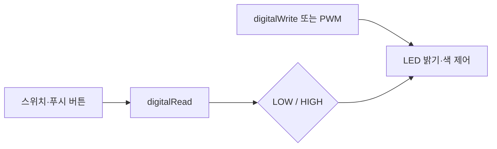

아두이노 실습은 출력 장치인 LED를 제어한 뒤 스위치와 푸시 버튼 입력을 읽어 다시 출력으로 반응시키는 순서다.

> [!NOTE]
> LED는 전류를 빛 에너지로 바꾸는 다이오드이며 긴 다리가 애노드(+), 짧은 다리가 캐소드(-)다.

---

## 1. 출력에서 입력으로



<Tabs>
  <Tab label="디지털 출력">digitalWrite()로 LOW(0)와 HIGH(1)를 보내 LED를 끄고 켠다.</Tab>
  <Tab label="PWM">PWM으로 LED 밝기를 단계적으로 제어한다.</Tab>
  <Tab label="입력">digitalRead()로 스위치 상태를 읽고 조건에 따라 LED를 제어한다.</Tab>
</Tabs>

---

## 2. 출력 실습 순서

자료는 LED 깜박임 → PWM 밝기 → 여러 LED → 시프트레지스터 → RGB LED → 릴레이 순서로 확장한다. RGB는 세 색 채널을 조합하고, 시프트레지스터는 여러 LED 상태를 확장하는 장치다.

## 3. 입력 실습 순서

점퍼 케이블 스위치 → 푸시 버튼 → 3색 RGB LED로 진행한다. 내부 풀업 저항에서는 스위치가 닫히면 LOW, 열리면 HIGH가 되고, 풀다운 저항에서는 반대로 닫힘이 HIGH, 열림이 LOW가 된다.

```html preview
<div style="font-family:system-ui,sans-serif;padding:20px;color:var(--foreground)">
  <label for="amt" style="font-size:14px;font-weight:600">아두이노 실습 단계</label>
  <div id="out" style="font-size:30px;font-weight:700;color:var(--chart-1);margin:6px 0">1단계</div>
  <input id="amt" type="range" min="1" max="6" step="1" value="1"
    style="width:100%;accent-color:var(--primary)" />
  <p style="font-size:13px;color:var(--muted-foreground)">원본 자료의 순서를 움직여 해당 단계의 핵심을 확인한다.</p>
  <script>
    var amt = document.getElementById('amt');
    var out = document.getElementById('out');
    amt.addEventListener('input', function () {
      out.textContent = Number(amt.value).toLocaleString() + '단계';
    });
  </script>
</div>
```

| 입력 회로 | 닫힘(On) | 열림(Off) |
| --- | --- | --- |
| 풀업 | LOW | HIGH |
| 풀다운 | HIGH | LOW |

> [!CAUTION]
> LED 극성과 저항·GND 연결을 먼저 확인한다. 버튼 입력은 풀업/풀다운 기준에 따라 논리값이 반대이므로 코드의 조건을 회로와 함께 읽어야 한다.

<details>
<summary>코드 읽기</summary>

pinMode(13, OUTPUT)은 LED 핀, pinMode(12, INPUT)은 입력 핀을 선언한다. digitalRead(12) 결과를 변수에 저장한 뒤 if로 digitalWrite(13, HIGH/LOW)를 선택한다.

</details>

<!-- source: Arduino output/input PDFs; ordered lab sequence and pull-up/pull-down semantics preserved -->