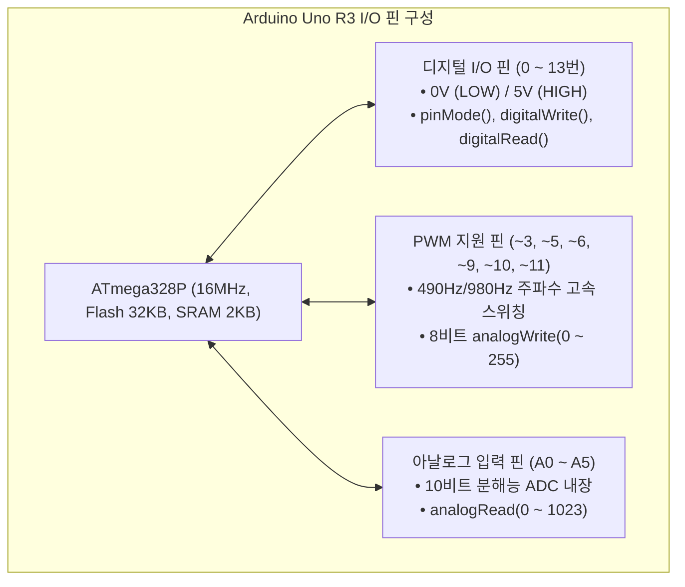

> [!abstract] 핵심 요약
> **피지컬 컴퓨팅(Physical Computing)**은 센서(Sensor)로 물리적 세계의 신호를 감지하고 액추에이터(Actuator)로 현실 세계에 반응하는 임베디드 시스템이다.
> 아두이노 우노(Arduino Uno)는 **디지털 I/O(0/5V)**, **8비트 PWM(Pulse Width Modulation, 0~255) 의사 아날로그 출력**, 그리고 **10비트 ADC(Analog-to-Digital Converter, 0~1023) 아날로그 입력**을 제공한다.

---

## 1. 아두이노 우노(ATmega328P) I/O 핀 아키텍처



---

## 2. 하드웨어 회로 이론 및 수식적 모델링

### 1) 옴의 법칙과 LED 전류 제한 저항 계산
LED에 과전류가 흘러 소손되는 것을 방지하기 위해 직렬 저항 $R$을 반드시 연결해야 한다.

$$R = \frac{V_{\text{CC}} - V_{\text{LED}}}{I_{\text{LED}}} = \frac{5\text{V} - 2.0\text{V}}{20\text{mA}} = \frac{3\text{V}}{0.02\text{A}} = 150\,\Omega \quad (\text{안전 마진 고려 표준 } 220\,\Omega \text{ 또는 } 330\,\Omega \text{ 사용})$$

### 2) 10비트 ADC 전압 변환 공식 ($0 \sim 1023$)
$$V_{\text{in}} = \text{analogRead}(\text{pin}) \times \frac{5.0\text{V}}{1023} = \text{analogRead}(\text{pin}) \times 0.004887\text{V}$$

### 3) 8비트 PWM 듀티 사이클(Duty Cycle)과 유효 전압
$$D = \frac{\text{Value}}{255} \times 100\% \implies V_{\text{avg}} = 5\text{V} \times \frac{\text{Value}}{255}$$

---

## 3. 실시간 아두이노 PWM LED 밝기 및 ADC 가변저항 시뮬레이터

```html preview
<div style="font-family:system-ui,-apple-system,sans-serif;padding:20px;background:var(--card);color:var(--card-foreground);border:1px solid var(--border);border-radius:var(--radius)">
  <div style="font-size:16px;font-weight:700;margin-bottom:14px;color:var(--primary);display:flex;align-items:center;gap:8px">
    <span>💡 아두이노 PWM(0~255) 및 ADC(0~1023) 실시간 회로 시뮬레이터</span>
  </div>

  <div style="margin-bottom:16px">
    <div style="display:flex;justify-content:space-between;font-size:12px;font-weight:600;margin-bottom:4px">
      <span>가변저항 (Potentiometer) 회전 각도 ➔ ADC 입력 (0~1023):</span>
      <span id="adcVal" style="color:var(--chart-1);font-weight:700">512</span>
    </div>
    <input id="adcSlider" type="range" min="0" max="1023" step="1" value="512" style="width:100%;accent-color:var(--chart-1)" />
  </div>

  <div style="display:grid;grid-template-columns:1fr 1fr 1fr;gap:10px;margin-bottom:14px;text-align:center">
    <div style="padding:10px;background:var(--background);border:1px solid var(--border);border-radius:var(--radius)">
      <div style="font-size:11px;color:var(--muted-foreground)">측정 입력 전압 (V_in)</div>
      <div id="vInDisplay" style="font-size:16px;font-weight:700;color:var(--chart-2);margin-top:2px">2.50 V</div>
    </div>
    <div style="padding:10px;background:var(--background);border:1px solid var(--border);border-radius:var(--radius)">
      <div style="font-size:11px;color:var(--muted-foreground)">PWM 출력값 (0~255)</div>
      <div id="pwmDisplay" style="font-size:16px;font-weight:700;color:var(--chart-3);margin-top:2px">128 (50.2%)</div>
    </div>
    <div style="padding:10px;background:var(--background);border:1px solid var(--border);border-radius:var(--radius);display:flex;flex-direction:column;align-items:center;justify-content:center">
      <div style="font-size:11px;color:var(--muted-foreground)">LED 가상 발광 상태</div>
      <div id="ledLight" style="width:24px;height:24px;border-radius:50%;background:#ef4444;margin-top:4px;box-shadow:0 0 10px #ef4444;transition:opacity 0.1s"></div>
    </div>
  </div>

  <div style="padding:10px;background:var(--background);border:1px solid var(--border);border-radius:var(--radius);font-family:monospace;font-size:11px;line-height:1.5;color:var(--foreground)">
    <div style="color:var(--primary);font-weight:700">실행 중인 아두이노 C++ 코드:</div>
    int sensorVal = analogRead(A0);       // <span id="codeAdc">512</span> (0~1023)<br/>
    int brightness = map(sensorVal, 0, 1023, 0, 255); // <span id="codePwm">128</span> (PWM 변환)<br/>
    analogWrite(9, brightness);           // 9번 핀 LED 듀티 사이클 제어
  </div>

  <script>
    var slider = document.getElementById('adcSlider');
    var adcOut = document.getElementById('adcVal');
    var vOut = document.getElementById('vInDisplay');
    var pwmOut = document.getElementById('pwmDisplay');
    var led = document.getElementById('ledLight');
    var cAdc = document.getElementById('codeAdc');
    var cPwm = document.getElementById('codePwm');

    function updateHardware() {
      var adc = parseInt(slider.value);
      var vin = (adc * (5.0 / 1023.0)).toFixed(2);
      var pwm = Math.round(adc * (255.0 / 1023.0));
      var duty = ((pwm / 255.0) * 100).toFixed(1);

      adcOut.textContent = adc;
      vOut.textContent = vin + " V";
      pwmOut.textContent = pwm + " (" + duty + "%)";
      cAdc.textContent = adc;
      cPwm.textContent = pwm;

      var opacity = (pwm / 255.0);
      led.style.opacity = Math.max(0.1, opacity);
      led.style.boxShadow = "0 0 " + Math.round(opacity * 20) + "px #ef4444";
    }

    slider.addEventListener('input', updateHardware);
    updateHardware();
  </script>
</div>
```
