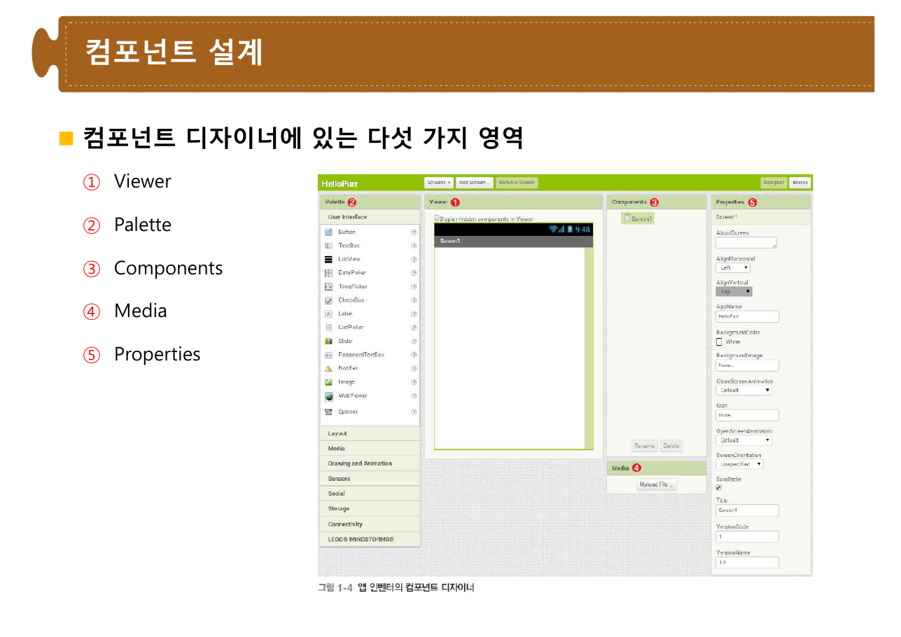
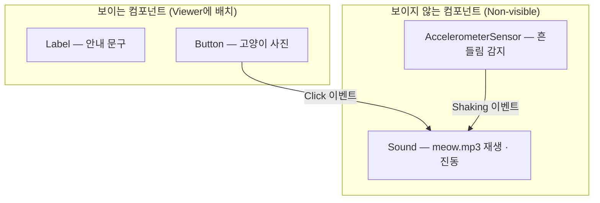
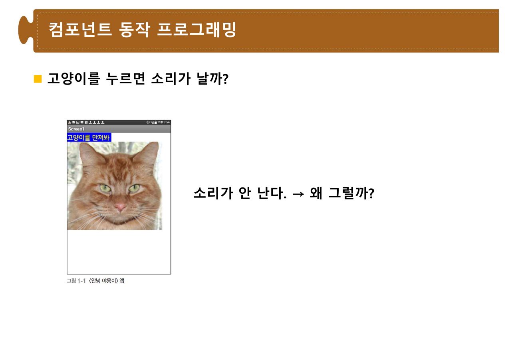
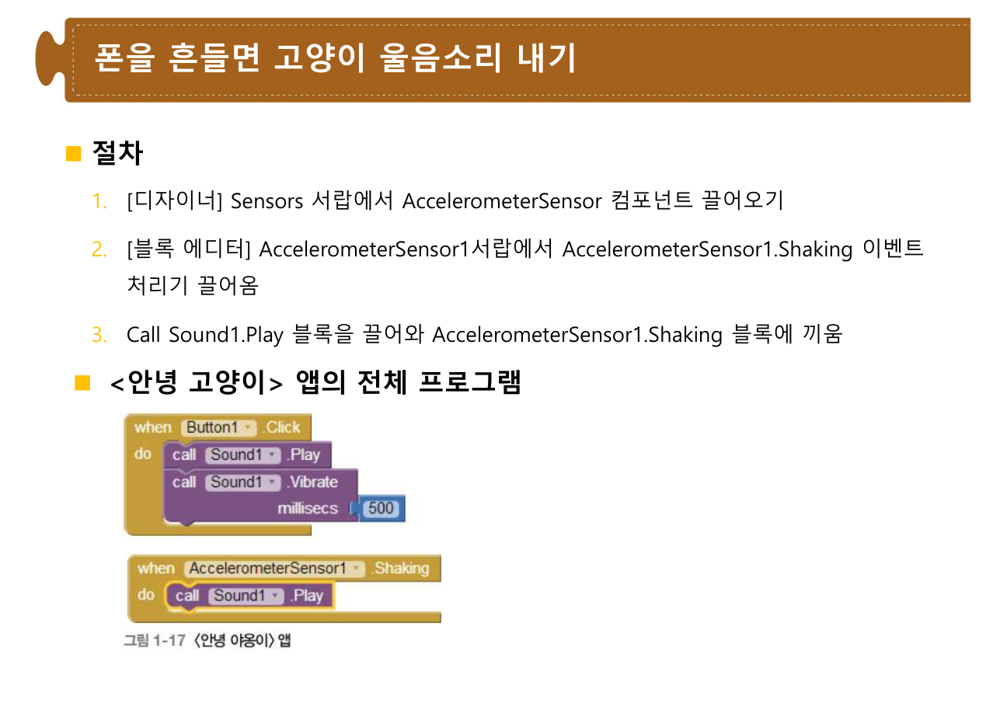
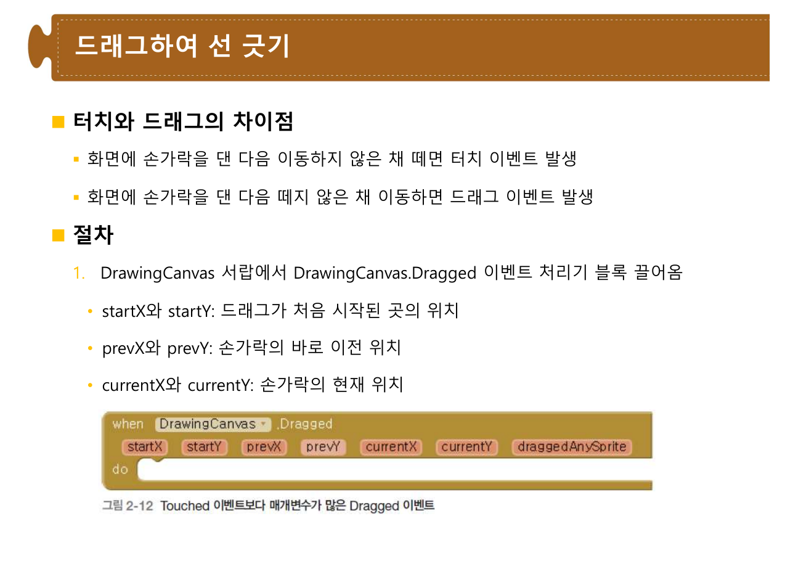
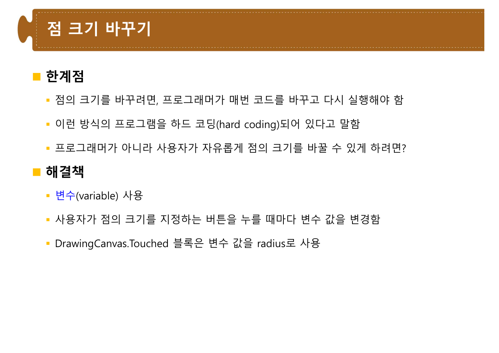
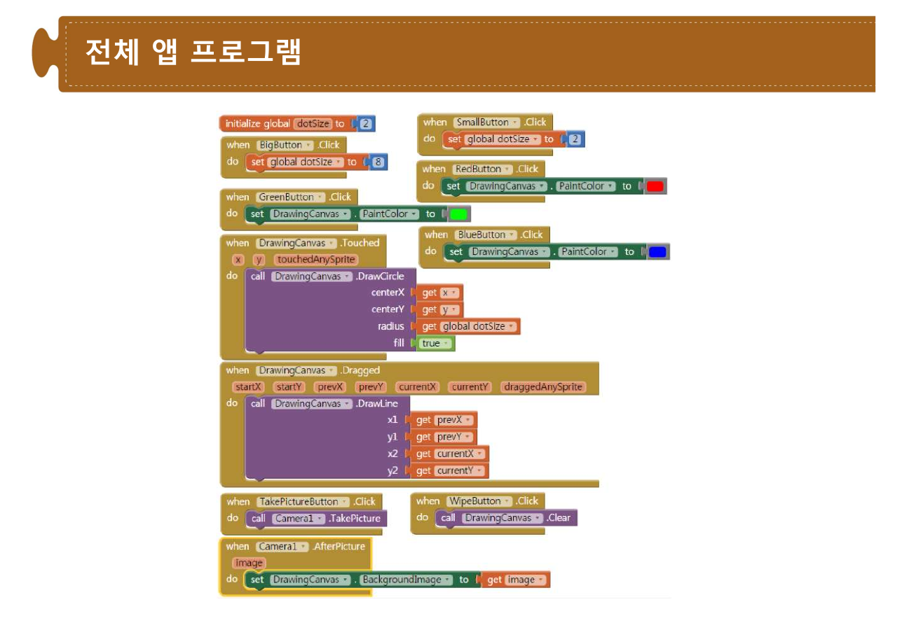

> [!abstract] 앱 인벤터에는 문법 오류가 없다
> [7장](./07.%20C%20언어의%20변수·연산자·제어문·함수.md)에서 세미콜론을 빠뜨리면 컴파일이 안 됐다. 앱 인벤터에서는 그런 일이 일어나지 않는다. **모양이 맞지 않는 블록은 애초에 끼워지지 않기 때문**이다. 문법이 도구에 흡수되어 버렸다.
>
> 그렇다면 무엇이 남는가. 이 두 프로젝트가 답하는 것이 그것이다. 남는 것은 **구조에 관한 결정**이다.
>
> - 화면에 보일 것과 보이지 않을 것을 어떻게 가를 것인가 (야옹이 11쪽 — 보이지 않는 컴포넌트)
> - 화면을 다 만들었는데 왜 아무 일도 일어나지 않는가 (야옹이 14쪽 — **"소리가 안 난다. → 왜 그럴까?"**)
> - 이벤트가 넘겨주는 값을 어떻게 받을 것인가 (페인트 통 13·17쪽 — 매개변수를 가진 이벤트 처리기)
> - 숫자를 코드에 박아 둘 것인가, 변수에 담을 것인가 (페인트 통 23쪽 — 하드 코딩의 한계)
>
> 네 개의 결정이 이 57장의 뼈대다. 그리고 마지막 결정이 [7장에서 배운 변수](./07.%20C%20언어의%20변수·연산자·제어문·함수.md)가 왜 필요한지를 텍스트 언어보다 더 뚜렷하게 보여준다.

---

## 무대 — 세 가지 요소와 다섯 개의 영역

〈안녕 야옹이〉 4~6쪽이 개발 환경을 세운다. `http://ai2.appinventor.mit.edu`에 구글 계정으로 접속하고, 프로젝트 이름은 `HelloPurr`로 한다(공백 허용 안 됨).

5쪽이 이 도구의 성격을 한 줄로 말한다 — **"앱 인벤터는 클라우드 방식. 앱 프로그램은 서버에 저장됨 → 인터넷이 가능한 어디에서든 접근 가능."**

6쪽의 세 가지 주요 요소가 개발의 세 국면과 대응한다.

| 요소 | 하는 일 |
| --- | --- |
| **컴포넌트 디자이너** | 앱 화면(사용자 인터페이스) 설계 |
| **블록 에디터** | 앱의 동작 프로그래밍 |
| **안드로이드 폰** | 개발 도중 제대로 작동하는지 검사 (없으면 에뮬레이터) |



8쪽의 다섯 영역 — **Viewer, Palette, Components, Media, Properties** — 이 이 도구의 작업 흐름 그 자체다. Palette에서 끌어와 Viewer에 놓으면 Components에 등록되고, Properties에서 속성을 바꾸고, Media에 파일을 올린다.

7쪽은 컴포넌트를 **요리책의 재료**에 비유한다. [7장 변수와배열 1쪽의 그릇 비유](./07.%20C%20언어의%20변수·연산자·제어문·함수.md)와 같은 계열이다. 그리고 나열된 목록이 흥미롭다 — `Button`, `Label`, `Canvas`, `AccelerometerSensor`, `SpeechToText`, `SpeechRecognizer`, `Twitter`, `BluetoothClient`, `TinyWebDB` … 버튼과 트위터가 같은 층위에 있다. **폰이 할 수 있는 모든 일이 하나의 재료 목록**으로 평평해진다.

---

## 첫 번째 결정 — 보이는 것과 보이지 않는 것

9~11쪽이 〈안녕 야옹이〉의 화면을 만든다.

| 단계 | 컴포넌트 | 설정 |
| --- | --- | --- |
| 9쪽 | `Label` | Text를 "고양이를 만져봐"로, BackgroundColor·TextColor·FontSize 설정 |
| 10쪽 | `Button` | Image 속성에 `kitty.png` 업로드, **Text 속성은 공백으로** |
| 11쪽 | `Sound` | Source 속성에 `meow.mp3` 지정 |

10쪽의 마지막 지시가 눈에 띈다 — **"Text 속성을 공백으로"**. 고양이 사진을 버튼으로 쓰려면 버튼 위에 글자가 없어야 한다. **버튼이라는 부품을 그림으로 위장시키는 것**이고, 사용자는 자기가 버튼을 누르는지 모른다.

11쪽에서 결정적인 구분이 나온다. `Sound` 컴포넌트를 끌어오면 화면이 아니라 **Non-visible components 영역**에 나타난다.



이 이분법이 화면 설계의 축이다. **자리를 차지하는 것과 능력만 제공하는 것.** 소리를 내는 능력, 흔들림을 감지하는 능력, 데이터를 저장하는 능력은 화면에 보일 이유가 없다. [7장의 함수](./07.%20C%20언어의%20변수·연산자·제어문·함수.md)가 화면에 아무것도 그리지 않으면서 일을 하는 것과 같다.

---

## 두 번째 결정 — 화면만으로는 아무 일도 일어나지 않는다

14쪽이 이 프로젝트의 전환점이다. 화면을 다 만들고 라이브 테스팅으로 폰에서 열어 고양이를 누른다.



> **소리가 안 난다. → 왜 그럴까?**

슬라이드 한 장 전체가 이 물음이다. 답은 15쪽에 있다 — **"소리를 내려면, 블록 에디터에서 프로그래밍을 해야 한다."**

이 배치가 좋은 교수법이다. 컴포넌트를 배치하는 일은 **명사를 준비하는 일**이고, 동사는 아직 하나도 쓰이지 않았다. 그래서 앱은 잘 생겼지만 아무것도 하지 않는다.

15쪽이 블록 에디터의 두 서랍을 소개한다.

| 서랍 | 내용 |
| --- | --- |
| **Built-in** | 앱 인벤터가 제공하는 블록 (Control, Logic, Math, Text, Variables, Color …) |
| **Screen1** | 이 앱이 **사용하고 있는 컴포넌트**가 제공하는 블록 |

두 번째가 중요하다. `Button1`을 화면에 놓았기 때문에 `Button1` 서랍이 생긴 것이고, 놓지 않았다면 없다. **디자이너에서 한 일이 블록 에디터의 어휘를 결정한다.**

17~18쪽이 첫 블록을 조립한다 — `when Button1.Click do call Sound1.Play`. 이것이 이벤트 기반 프로그래밍의 최소 단위다.

> [!important] [4장·7장의 제어 흐름과 무엇이 다른가](./07.%20C%20언어의%20변수·연산자·제어문·함수.md)
> C 프로그램은 `main`에서 시작해 위에서 아래로 흐르고, `if`와 `for`로 갈라지고 돈다. **시작점이 있다.**
>
> 앱 인벤터의 블록에는 시작점이 없다. `when Button1.Click`은 언제 실행될지 모르고, 어쩌면 한 번도 실행되지 않는다. 프로그램은 **일어날 수 있는 일들의 목록**이고, 순서를 정하는 것은 사용자다.
>
> [10장 아두이노](./10.%20아두이노%20디지털·아날로그%20입출력.md)의 `void loop()`가 세 번째 모형을 보여준다. 거기서는 시작점도 있고 무한 반복도 있다. 세 가지 실행 모형을 한 학기에 모두 만나는 셈이다.

20~22쪽이 진동을 더한다. `call Sound1.Vibrate` 블록의 `millisecs` 홈에 Math 서랍의 숫자 블록 **500**을 끼운다. 여기서 **홈(socket)** 이라는 개념이 처음 나온다 — 블록이 값을 요구하는 자리이고, [7장의 함수 매개변수](./07.%20C%20언어의%20변수·연산자·제어문·함수.md)에 해당한다.

23쪽이 두 번째 이벤트를 추가한다. `AccelerometerSensor` 컴포넌트를 끌어오고 `AccelerometerSensor1.Shaking` 이벤트 처리기에 `call Sound1.Play`를 끼운다.



완성된 프로그램은 **최상위 블록 두 개**다.

```text
when Button1.Click do
    call Sound1.Play
    call Sound1.Vibrate  millisecs 500

when AccelerometerSensor1.Shaking do
    call Sound1.Play
```

두 블록 사이에는 아무 연결도 없다. 서로를 부르지 않고, 순서도 없다. **같은 `Sound1`을 공유할 뿐이다.**

> [!note] 원본 야옹이 23쪽 — 앱 이름 표기가 흔들린다
> 이 슬라이드의 제목은 "**〈안녕 고양이〉** 앱의 전체 프로그램"인데, 아래 그림 캡션은 "[그림 1-14] **〈안녕 야옹이〉** 앱의 전체 프로그램"이다. 나머지 26장은 모두 〈안녕 야옹이〉를 쓴다.

24~25쪽은 배포를 다룬다. `.apk`(실행 파일)와 `.aia`(소스 파일)의 구분, '출처를 알 수 없는 앱' 설정, QR 코드로 공유하기, 그리고 Gallery에 게시하기. **소스와 실행 파일이 다른 확장자로 갈리는 것**은 [3장 35쪽의 컴파일러](./03.%20알고리즘과%20프로그래밍%20언어.md)가 소스코드로부터 실행 파일을 만든다고 한 그 구분이다.

---

## 세 번째 결정 — 이벤트가 값을 건네줄 때

〈페인트 통〉(PaintPot)이 두 번째 프로젝트다. 2쪽이 맥락을 준다 — 1970년대의 2차원 그래픽 프로그램은 "매우 어렵고 조잡한 그래픽 화면"이었는데, 앱 인벤터에서는 쉽게 된다.

만들 기능은 여섯 가지다(3쪽).

1. 가상의 페인트 통에 손가락을 담가 색깔 선택
2. 손가락으로 화면에 선을 그림
3. 화면을 찍어 점을 그림
4. 버튼을 클릭하여 화면을 깨끗이 지움
5. 버튼을 클릭하여 점의 크기 조절
6. 카메라로 사진을 찍고 그 위에 그림을 그림

6~11쪽의 화면 설계에서 새로운 것은 **`HorizontalArrangement`** 다(9쪽). 버튼 세 개를 한 줄에 놓기 위한 컴포넌트이고, Width를 `Fill parent`로 하면 화면 전체 너비를 차지한다. 색깔 버튼들이 그 안으로 들어가면 **부속 컴포넌트**가 된다.

7쪽의 지시 하나가 특히 실용적이다.

> `Button1`이던 버튼 이름을 **`RedButton`으로 바꿈.** 컴포넌트에게 **의미 있는 이름**을 붙여주면 프로그램을 이해하는 데 크게 도움이 됨.

`Button1`, `Button2`, `Button3`으로 두면 어느 것이 빨강인지 블록만 보고는 알 수 없다. [6장에서 `findMinimum`·`markMultiple`처럼 함수에 이름을 붙였던 것](./06.%20탐색과%20정렬%20알고리즘.md)과 같은 종류의 규율이다.

### 이벤트가 매개변수를 가진다

13~18쪽이 이 프로젝트의 핵심 발견이다. `DrawingCanvas.Touched` 이벤트 처리기를 끌어오면 **`x`와 `y`라는 매개변수가 딸려 있다** — 사용자가 터치한 곳의 좌표다.



17쪽이 터치와 드래그를 구분하고, `Dragged` 이벤트가 넘겨주는 여섯 개의 값을 나열한다.

| 이벤트 | 매개변수 | 뜻 |
| --- | --- | --- |
| `Touched` | `x`, `y` | 터치한 지점 |
| `Dragged` | `startX`, `startY` | 드래그가 **처음 시작된** 곳 |
| | `prevX`, `prevY` | 손가락의 **바로 이전** 위치 |
| | `currentX`, `currentY` | 손가락의 **현재** 위치 |

선을 그으려면 두 점이 필요하다. 그리고 **어느 두 점을 고르느냐가 결과를 바꾼다.**

```html preview h=560px
<div style="font-family:system-ui,-apple-system,sans-serif;padding:20px;color:var(--foreground)">
  <div style="display:flex;gap:8px;flex-wrap:wrap;margin-bottom:12px">
    <button id="mPrev" style="cursor:pointer;font:inherit;font-size:12.5px;padding:5px 12px;border-radius:var(--radius);border:1px solid var(--chart-1);background:var(--chart-1);color:var(--primary-foreground)">prevX,prevY → currentX,currentY</button>
    <button id="mStart" style="cursor:pointer;font:inherit;font-size:12.5px;padding:5px 12px;border-radius:var(--radius);border:1px solid var(--border);background:transparent;color:var(--foreground)">startX,startY → currentX,currentY</button>
    <button id="clr" style="cursor:pointer;font:inherit;font-size:12.5px;padding:5px 12px;border-radius:var(--radius);border:1px solid var(--border);background:transparent;color:var(--foreground)">지우기</button>
  </div>
  <p style="font-size:12.5px;color:var(--muted-foreground);margin:0 0 10px">
    아래 사각형 안에서 마우스를 <b>누른 채로 끌어</b> 보라(터치 화면이면 손가락으로 끌면 된다). 원본 페인트 통 18쪽의 <code>DrawLine</code> 블록이 어느 매개변수를 받느냐에 따라 결과가 달라진다.
  </p>
  <svg id="cv" viewBox="0 0 640 300" width="100%" style="border:1px solid var(--border);border-radius:var(--radius);background:var(--card);touch-action:none;cursor:crosshair" role="img" aria-label="드래그로 선을 그리는 실험 영역"></svg>
  <div id="say2" style="margin-top:12px;padding:11px 13px;border:1px solid var(--border);border-radius:var(--radius);font-size:13px;line-height:1.7"></div>

  <script>
    var cv = document.getElementById('cv');
    var mode = 'prev', drawing = false, start = null, prev = null, segs = [];
    function pt(e) {
      var r = cv.getBoundingClientRect();
      var cx = (e.touches ? e.touches[0].clientX : e.clientX) - r.left;
      var cy = (e.touches ? e.touches[0].clientY : e.clientY) - r.top;
      return { x: cx / r.width * 640, y: cy / r.height * 300 };
    }
    function paint() {
      cv.innerHTML = segs.map(function (s) {
        return '<line x1="' + s.a.x.toFixed(1) + '" y1="' + s.a.y.toFixed(1) + '" x2="' + s.b.x.toFixed(1) +
          '" y2="' + s.b.y.toFixed(1) + '" stroke="var(--chart-1)" stroke-width="3" stroke-linecap="round"/>';
      }).join('') + (start ? '<circle cx="' + start.x.toFixed(1) + '" cy="' + start.y.toFixed(1) +
        '" r="4" fill="var(--chart-2)"/>' : '');
      document.getElementById('say2').innerHTML = mode === 'prev'
        ? '<b style="color:var(--chart-1)">prev → current</b> — 매 순간의 짧은 선분이 이어져 <b>손가락이 지나간 자취</b>가 남는다. 원본 18쪽이 이 조합을 쓴다.'
        : '<b style="color:var(--chart-1)">start → current</b> — 언제나 <b>처음 누른 점</b>에서 지금 위치까지 선을 긋는다. 부채꼴 모양이 되며, 자유 곡선을 그릴 수 없다.<br>' +
          '<span style="color:var(--muted-foreground)">같은 이벤트, 같은 블록, 매개변수만 바꿔 끼웠을 뿐인데 그림 도구의 성격이 달라진다.</span>';
    }
    function down(e) { e.preventDefault(); drawing = true; start = pt(e); prev = start; paint(); }
    function move(e) {
      if (!drawing) return;
      e.preventDefault();
      var cur = pt(e);
      segs.push({ a: mode === 'prev' ? prev : start, b: cur });
      prev = cur;
      paint();
    }
    function up() { drawing = false; }
    cv.addEventListener('mousedown', down); cv.addEventListener('mousemove', move);
    window.addEventListener('mouseup', up);
    cv.addEventListener('touchstart', down); cv.addEventListener('touchmove', move);
    window.addEventListener('touchend', up);
    function setMode(m) {
      mode = m; segs = []; start = null;
      [['mPrev', 'prev'], ['mStart', 'start']].forEach(function (p) {
        var b = document.getElementById(p[0]);
        var on = p[1] === m;
        b.style.borderColor = on ? 'var(--chart-1)' : 'var(--border)';
        b.style.background = on ? 'var(--chart-1)' : 'transparent';
        b.style.color = on ? 'var(--primary-foreground)' : 'var(--foreground)';
      });
      paint();
    }
    document.getElementById('mPrev').addEventListener('click', function () { setMode('prev'); });
    document.getElementById('mStart').addEventListener('click', function () { setMode('start'); });
    document.getElementById('clr').addEventListener('click', function () { segs = []; start = null; paint(); });
    paint();
  </script>
</div>
```

14~16쪽은 점을 찍는 쪽이다. `DrawCircle` 명령은 네 개의 홈을 갖는다 — `centerX`, `centerY`, `radius`, `fill`. 앞의 둘에는 이벤트가 준 `x`·`y`를 끼우고, `radius`에는 **숫자 5**를 끼운다. 이 5가 다음 결정의 씨앗이 된다.

19~21쪽은 색 바꾸기와 사진 찍기다. 사진 찍기는 이벤트가 **두 개**로 나뉜다 — `TakePictureButton.Click`에서 `Camera1.TakePicture`를 부르고, 사진이 찍힌 뒤에 발생하는 `Camera1.AfterPicture`에서 결과 이미지를 배경으로 설정한다. **명령을 내리는 자리와 결과를 받는 자리가 다르다.** 카메라 앱이 열렸다 닫히는 동안 우리 앱은 기다릴 수 없기 때문이다.

---

## 네 번째 결정 — 하드 코딩을 변수로 바꾸다

22~27쪽이 이 두 프로젝트를 통틀어 가장 중요한 대목이다.

22쪽이 질문을 던진다. 점의 크기는 언제 정해지는가? `DrawingCanvas.Touched`가 실행될 때 `radius`가 5이므로 반지름 5인 원이 그려진다. **5를 10으로 바꾸고 라이브 테스팅으로 실험해 보자.**



23쪽이 그 방식의 한계를 이름 붙여 지적한다.

> **한계점** — 점의 크기를 바꾸려면, **프로그래머가 매번 코드를 바꾸고 다시 실행**해야 함. 이런 방식의 프로그램을 **하드 코딩(hard coding)** 되어 있다고 말함. 프로그래머가 아니라 **사용자가** 자유롭게 점의 크기를 바꿀 수 있게 하려면?
>
> **해결책** — **변수(variable) 사용.** 사용자가 점의 크기를 지정하는 버튼을 누를 때마다 변수 값을 변경함. `DrawingCanvas.Touched` 블록은 변수 값을 `radius`로 사용.

24~26쪽이 실행한다.

| 단계 | 블록 |
| --- | --- |
| 24쪽 | `initialize global dotSize to 2` — 전역 변수 선언과 초깃값 |
| 25쪽 | `DrawingCanvas.Touched`의 `radius` 홈에 `get global dotSize` 끼우기 |
| 26쪽 | `SmallButton.Click` → `set global dotSize to 2` / `BigButton.Click` → `set global dotSize to 8` |

> [!important] 변수의 존재 이유를 이보다 뚜렷하게 보이기 어렵다
> [7장 변수와배열 1쪽](./07.%20C%20언어의%20변수·연산자·제어문·함수.md)은 변수를 **그릇**으로 소개했다. 값을 담는 자리라는 것이다. 틀린 설명은 아니지만, 왜 상수 대신 그릇이 필요한지는 말하지 않는다.
>
> 여기서는 이유가 분명하다. **값을 정하는 시점과 값을 쓰는 시점이 다르기 때문**이다. `dotSize`를 정하는 것은 `BigButton.Click`이고 쓰는 것은 `DrawingCanvas.Touched`인데, 이 둘은 **서로를 부르지 않는** 별개의 이벤트 처리기다. 두 블록이 값을 주고받을 유일한 통로가 전역 변수다.
>
> 이벤트 기반 프로그래밍에서 변수는 편의가 아니라 **필수 배관**이다.



28쪽의 완성된 프로그램은 최상위 블록 **열 개**다.

```text
initialize global dotSize to 2                    ← 변수 하나

when DrawingCanvas.Touched (x, y)                 ← 점 찍기
    call DrawingCanvas.DrawCircle
        centerX = get x, centerY = get y
        radius  = get global dotSize
when DrawingCanvas.Dragged (…, prevX, prevY, currentX, currentY)
    call DrawingCanvas.DrawLine  x1=prevX y1=prevY x2=currentX y2=currentY
when RedButton.Click    → set DrawingCanvas.PaintColor to 빨강
when BlueButton.Click   → set DrawingCanvas.PaintColor to 파랑
when GreenButton.Click  → set DrawingCanvas.PaintColor to 초록
when WipeButton.Click   → call DrawingCanvas.Clear
when SmallButton.Click  → set global dotSize to 2
when BigButton.Click    → set global dotSize to 8
when TakePictureButton.Click → call Camera1.TakePicture
when Camera1.AfterPicture (image)
    → set DrawingCanvas.BackgroundImage to get image
```

```html preview h=600px
<div style="font-family:system-ui,-apple-system,sans-serif;padding:20px;color:var(--foreground)">
  <div style="display:flex;gap:8px;flex-wrap:wrap;align-items:center;margin-bottom:12px">
    <span style="font-size:12.5px;font-weight:600">점 크기 버튼</span>
    <button id="small" style="cursor:pointer;font:inherit;font-size:12.5px;padding:5px 14px;border-radius:var(--radius);border:1px solid var(--border);background:transparent;color:var(--foreground)">작은 점 (2)</button>
    <button id="big" style="cursor:pointer;font:inherit;font-size:12.5px;padding:5px 14px;border-radius:var(--radius);border:1px solid var(--border);background:transparent;color:var(--foreground)">큰 점 (8)</button>
    <span style="font-size:12.5px;font-weight:600;margin-left:10px">색</span>
    <span id="cbtn" style="display:flex;gap:5px"></span>
    <button id="wipe" style="cursor:pointer;font:inherit;font-size:12.5px;padding:5px 12px;border-radius:var(--radius);border:1px solid var(--border);background:transparent;color:var(--foreground)">지우기</button>
  </div>

  <div style="display:flex;gap:10px;flex-wrap:wrap;margin-bottom:10px">
    <div style="border:1px solid var(--chart-4);border-radius:var(--radius);padding:7px 14px">
      <div style="font-size:11px;color:var(--muted-foreground)">global dotSize</div>
      <div id="dsv" style="font-size:22px;font-weight:800;color:var(--chart-4)">2</div>
    </div>
    <div style="flex:1;min-width:200px;font-size:12.5px;color:var(--muted-foreground);align-self:center">
      캔버스를 <b>클릭</b>하면 Touched → DrawCircle(radius = dotSize), <b>드래그</b>하면 Dragged → DrawLine.
      점 크기 버튼은 그림을 그리지 않고 <b>변수만 바꾼다</b>.
    </div>
  </div>

  <svg id="pc" viewBox="0 0 640 260" width="100%" style="border:1px solid var(--border);border-radius:var(--radius);background:var(--card);touch-action:none;cursor:crosshair" role="img" aria-label="페인트 통 앱의 동작을 흉내 낸 캔버스"></svg>
  <div id="ev" style="margin-top:10px;font-family:ui-monospace,Menlo,monospace;font-size:12px;line-height:1.75;max-height:96px;overflow:auto;color:var(--muted-foreground)"></div>

  <script>
    var pc = document.getElementById('pc');
    var COLORS = [['빨강', 'var(--chart-1)'], ['파랑', 'var(--chart-2)'], ['초록', 'var(--chart-3)']];
    var dotSize = 2, color = 'var(--chart-1)', shapes = [], logs = [];
    var dragging = false, moved = false, prev = null;
    function log(s) { logs.unshift('when ' + s); if (logs.length > 12) logs.pop(); render(); }
    function pos(e) {
      var r = pc.getBoundingClientRect();
      var cx = (e.touches ? e.touches[0].clientX : e.clientX) - r.left;
      var cy = (e.touches ? e.touches[0].clientY : e.clientY) - r.top;
      return { x: cx / r.width * 640, y: cy / r.height * 260 };
    }
    function render() {
      document.getElementById('dsv').textContent = dotSize;
      [['small', 2], ['big', 8]].forEach(function (p) {
        var b = document.getElementById(p[0]);
        var on = dotSize === p[1];
        b.style.borderColor = on ? 'var(--chart-4)' : 'var(--border)';
        b.style.background = on ? 'var(--chart-4)' : 'transparent';
        b.style.color = on ? 'var(--primary-foreground)' : 'var(--foreground)';
      });
      document.getElementById('cbtn').innerHTML = COLORS.map(function (c) {
        var on = c[1] === color;
        return '<button data-c="' + c[1] + '" style="cursor:pointer;font:inherit;font-size:12px;padding:5px 11px;border-radius:var(--radius);border:2px solid ' +
          (on ? 'var(--foreground)' : 'var(--border)') + ';background:' + c[1] + ';color:var(--primary-foreground)">' + c[0] + '</button>';
      }).join('');
      Array.prototype.forEach.call(document.querySelectorAll('#cbtn button'), function (b) {
        b.addEventListener('click', function () { color = b.getAttribute('data-c'); log(b.textContent + 'Button.Click → set PaintColor'); });
      });
      pc.innerHTML = shapes.map(function (s) {
        return s.t === 'c'
          ? '<circle cx="' + s.x.toFixed(1) + '" cy="' + s.y.toFixed(1) + '" r="' + s.r + '" fill="' + s.col + '"/>'
          : '<line x1="' + s.a.x.toFixed(1) + '" y1="' + s.a.y.toFixed(1) + '" x2="' + s.b.x.toFixed(1) + '" y2="' + s.b.y.toFixed(1) +
            '" stroke="' + s.col + '" stroke-width="' + (s.r * 2) + '" stroke-linecap="round"/>';
      }).join('');
      document.getElementById('ev').innerHTML = logs.join('<br>') || 'when …  (아직 아무 이벤트도 발생하지 않았다)';
    }
    pc.addEventListener('mousedown', function (e) { e.preventDefault(); dragging = true; moved = false; prev = pos(e); });
    pc.addEventListener('mousemove', function (e) {
      if (!dragging) return;
      var p = pos(e);
      shapes.push({ t: 'l', a: prev, b: p, col: color, r: dotSize });
      if (!moved) { log('DrawingCanvas.Dragged → DrawLine'); moved = true; }
      prev = p; render();
    });
    window.addEventListener('mouseup', function () {
      if (dragging && !moved && prev) {
        shapes.push({ t: 'c', x: prev.x, y: prev.y, col: color, r: dotSize });
        log('DrawingCanvas.Touched → DrawCircle(radius = ' + dotSize + ')');
      }
      dragging = false; render();
    });
    document.getElementById('small').addEventListener('click', function () { dotSize = 2; log('SmallButton.Click → set global dotSize to 2'); });
    document.getElementById('big').addEventListener('click', function () { dotSize = 8; log('BigButton.Click → set global dotSize to 8'); });
    document.getElementById('wipe').addEventListener('click', function () { shapes = []; log('WipeButton.Click → DrawingCanvas.Clear'); });
    render();
  </script>
</div>
```

> [!note] 원본 26쪽의 값과 24쪽의 초깃값
> 26쪽은 `SmallButton`에 **2**, `BigButton`에 **8**을 넣는다. 24쪽의 초깃값도 **2**다. 위 도구는 이 세 값을 그대로 쓴다. 22쪽에서 실험해 보라고 한 5와 10은 하드 코딩 시절의 값이며, 변수로 바꾼 뒤에는 쓰이지 않는다.

---

## 정리

> [!tip] 이 장의 골격
>
> 1. **문법이 도구에 흡수되면 구조에 관한 결정만 남는다.** 블록은 맞지 않으면 끼워지지 않으므로 문법 오류가 없다.
> 2. **컴포넌트는 보이는 것과 보이지 않는 것으로 갈린다.** Sound와 AccelerometerSensor는 능력만 제공하고 자리를 차지하지 않는다.
> 3. **화면만으로는 아무 일도 일어나지 않는다.** 야옹이 14쪽의 "소리가 안 난다"가 명사와 동사를 갈라 놓는다.
> 4. **이벤트는 값을 건네준다.** `Touched`는 두 개, `Dragged`는 여섯 개. 어느 매개변수를 홈에 끼우느냐가 도구의 성격을 바꾼다.
> 5. **변수는 편의가 아니라 배관이다.** 서로를 부르지 않는 이벤트 처리기끼리 값을 주고받을 유일한 통로이며, 페인트 통 23쪽이 그것을 "하드 코딩의 한계"라는 이름으로 설명한다.

다음 장은 같은 도구로 **컴포넌트 목록의 뒤쪽** — `SpeechRecognizer`, `TextToSpeech`, `ActivityStarter`, `TinyDB` — 을 쓴다. 그리고 이 장에서 배운 전역 변수가 거기서 **데이터베이스**로 확장된다.

---

### 근거 자료

강의 원본 두 편에 근거한다.

- `01. 안녕 야옹이.pdf`(27쪽) — 인용한 슬라이드는 8쪽([그림 1-4] 컴포넌트 디자이너), 14쪽("소리가 안 난다"), 23쪽([그림 1-14] 전체 프로그램)이다.
- `02. 페인트 통.pdf`(30쪽) — 인용한 슬라이드는 17쪽([그림 2-12] Dragged 이벤트의 매개변수), 23쪽(하드 코딩의 한계와 해결책), 28쪽(전체 앱 프로그램)이다.

인터렉티브에 사용한 수치는 모두 원본 값 그대로다. `dotSize`의 초깃값 2(24쪽), `SmallButton`의 2와 `BigButton`의 8(26쪽), `Vibrate`의 500밀리초(야옹이 22쪽), `DrawCircle`의 기본 `radius` 5(페인트 통 16쪽)를 슬라이드에서 확인했다. 드래그 실험의 두 조합(`prev→current`와 `start→current`)에서 원본이 채택한 것은 앞의 것이며, 28쪽 전체 블록 그림에서 확인했다.

이 두 자료에서 발견한 원본 표기 문제는 한 건 — **야옹이 23쪽의 제목이 〈안녕 고양이〉로 되어 있는 점**(같은 슬라이드의 그림 캡션과 나머지 26장은 〈안녕 야옹이〉)이며 본문에 기록했다.
