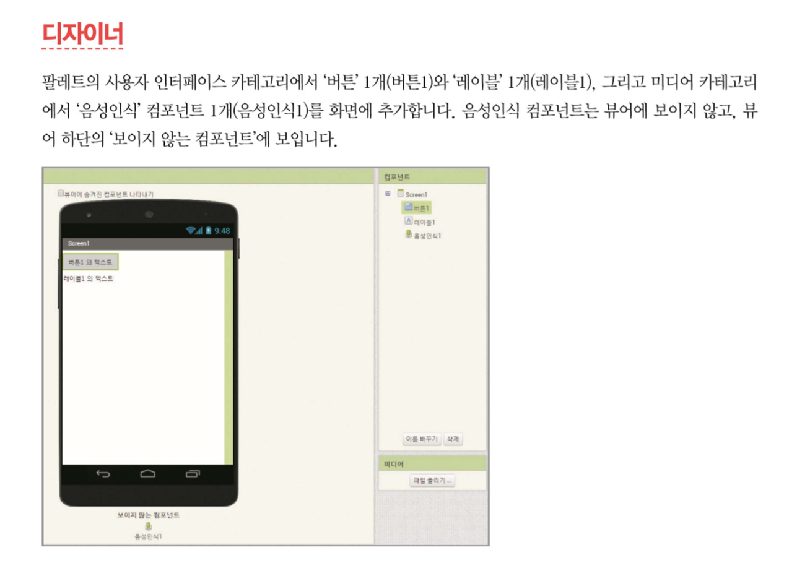
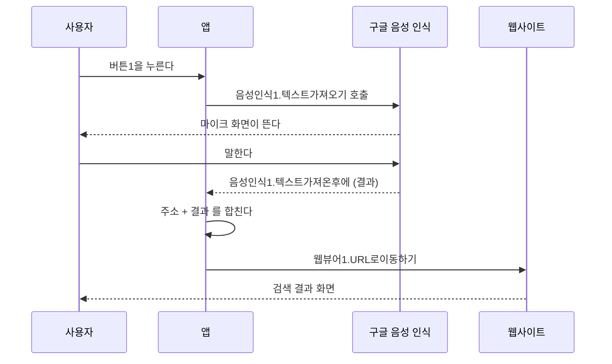
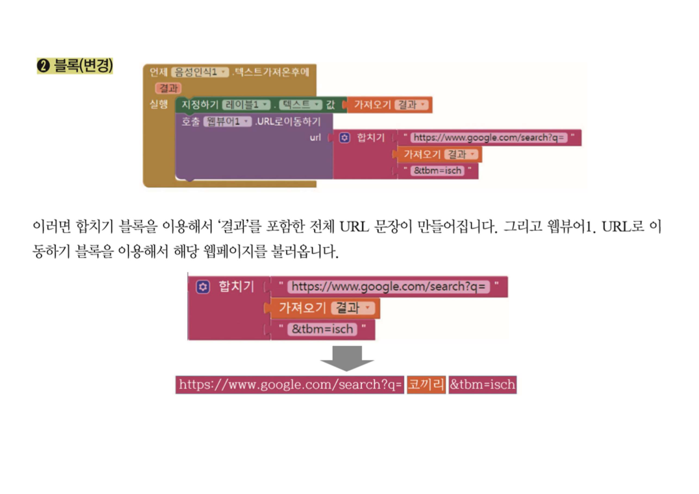
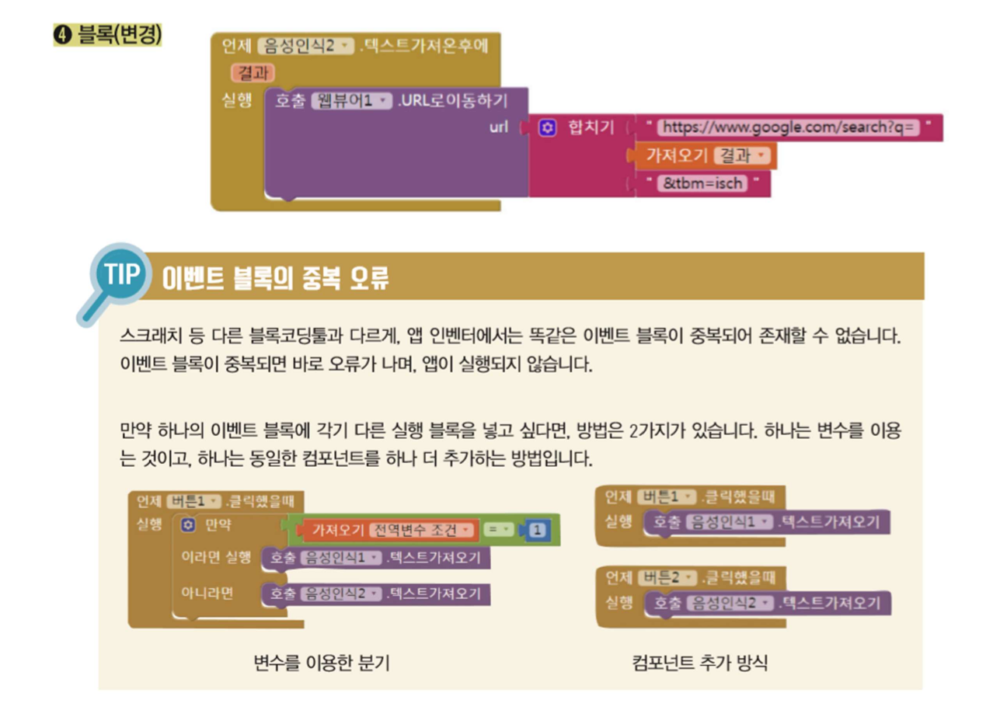
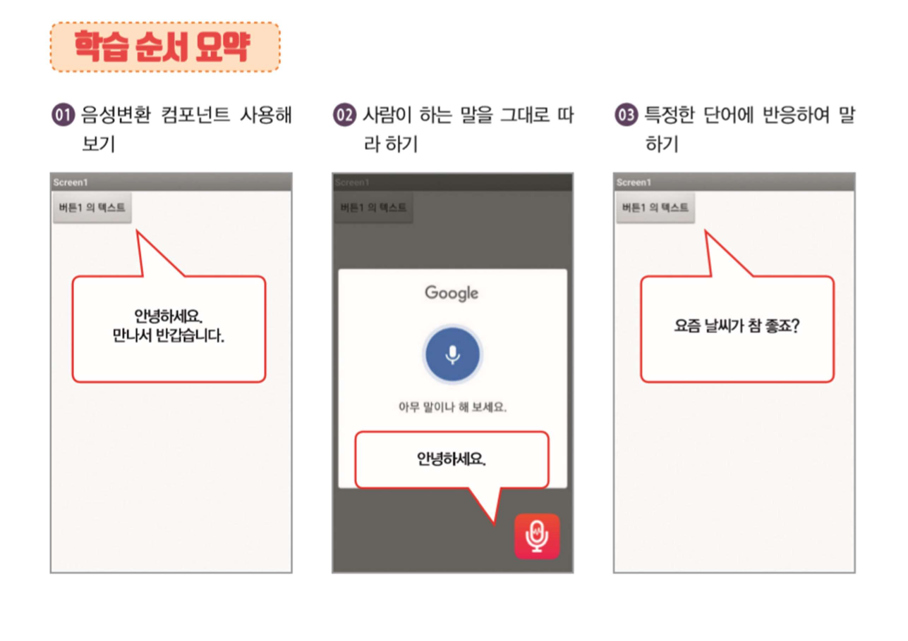
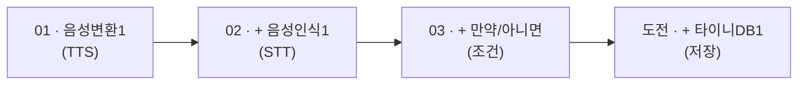
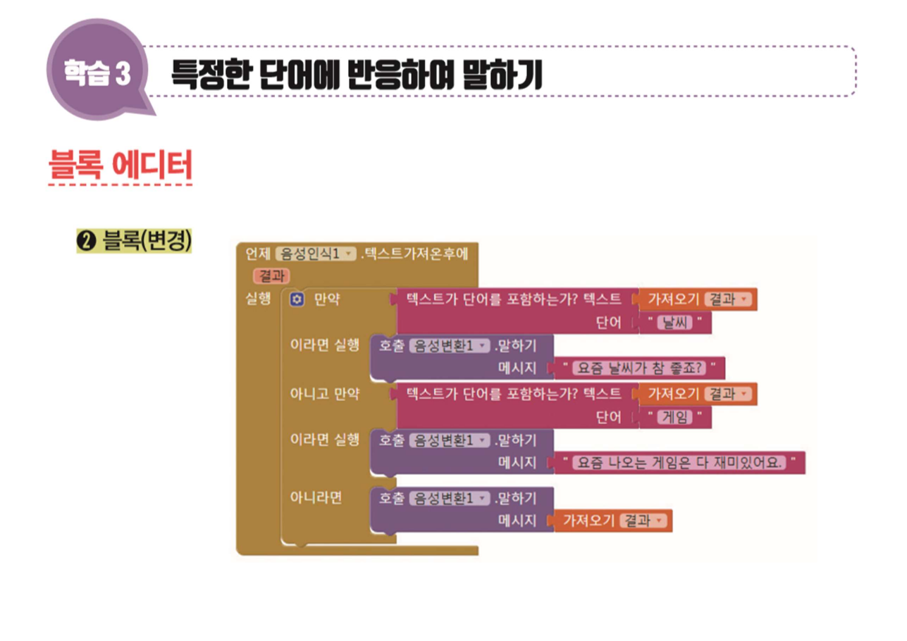
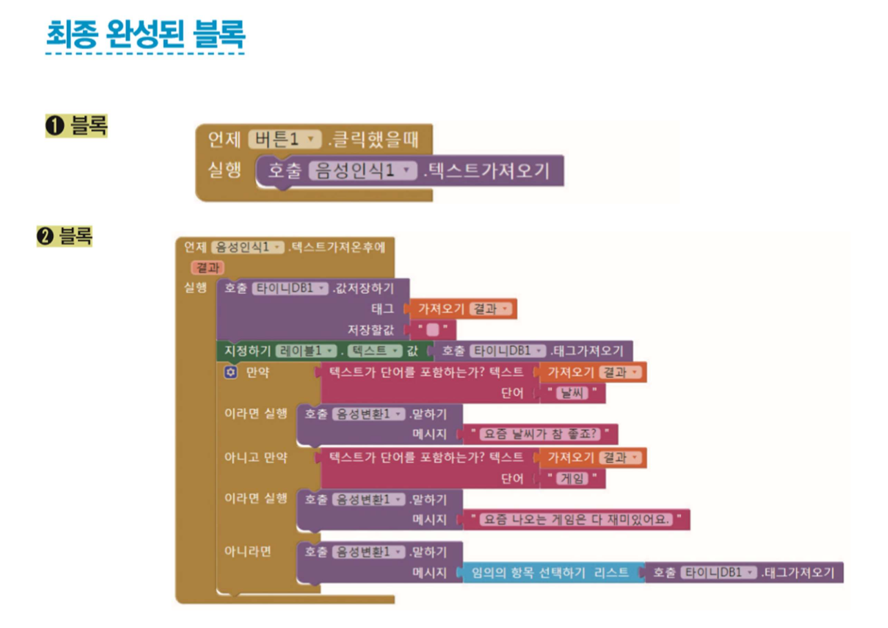

> [!abstract] 두 프로젝트가 나눠 가진 하나의 물음
> 파일 이름에 "인공지능"이 들어 있지만, 이 58장이 실제로 다루는 것은 훨씬 소박하다. **음성 인식 컴포넌트가 말을 알아듣고 나면, 남는 것은 문자열 하나다.** 그 문자열로 무엇을 할 것인가 — 두 프로젝트가 서로 다른 답을 내놓는다.
>
> - 〈음성 검색〉(36장) — **문자열을 URL에 이어 붙인다.** 구글 이미지 검색, 유튜브, 동의어 사전 세 곳으로 보낸다. 앱이 하는 일은 문자열 연결 하나뿐이고, 실제 검색은 웹사이트가 한다.
> - 〈간단한 대화형 인공지능〉(22장) — **문자열을 조건에 걸어 본다.** '날씨'가 들어 있으면 이 말, '게임'이 들어 있으면 저 말, 그 밖에는 이제까지 들은 말 중 하나를 무작위로 되돌려준다.
>
> 두 번째 프로젝트의 마지막 단계가 이 장의 결말이다. 조건 두 개와 데이터베이스 하나로 "학습하는" 챗봇이 되는데, **무엇이 지능이고 무엇이 착시인지**를 스스로 드러내는 구조로 되어 있다.

---

## 문자열 하나가 오가는 파이프

〈음성 검색〉의 5쪽이 컴포넌트 세 개로 시작한다.



> 팔레트의 사용자 인터페이스 카테고리에서 '버튼' 1개(버튼1)와 '레이블' 1개(레이블1), 그리고 미디어 카테고리에서 **'음성인식' 컴포넌트 1개**(음성인식1)를 화면에 추가합니다. 음성인식 컴포넌트는 뷰어에 보이지 않고, 뷰어 하단의 **'보이지 않는 컴포넌트'** 에 보입니다.

[8장에서 `Sound`가 그랬듯](./08.%20앱%20인벤터%20기초%20프로젝트.md) 음성 인식도 능력만 제공하고 자리를 차지하지 않는다. 그리고 이 프로젝트는 **한국어판 앱 인벤터**를 쓰므로 블록 이름이 우리말이다 — `음성인식1.텍스트가져오기`, `웹뷰어1.URL로이동하기`, `합치기`.

음성 인식의 동작이 두 블록으로 나뉜다는 점이 중요하다.



**부르는 자리와 받는 자리가 다르다.** [8장 페인트 통 20쪽의 카메라](./08.%20앱%20인벤터%20기초%20프로젝트.md)와 같은 구조다. 음성 인식이 끝나는 데 시간이 걸리므로 앱은 기다릴 수 없고, 끝났을 때 발생하는 이벤트를 따로 받아야 한다.

### URL은 문자열이다

14쪽이 이 프로젝트의 발견이다. 구글 이미지 검색 페이지의 주소창을 들여다보면 이런 모양이다.

```text
https://www.google.com/search?q=코끼리&tbm=isch
└─────── 고정된 앞부분 ───────┘ └─┘ └───┘
                              검색어  이미지 검색 지정
```

검색어 자리만 갈아 끼우면 어떤 단어로든 검색할 수 있다. 그러면 **음성으로 받은 문자열을 그 자리에 넣으면 된다.** 그것이 이 앱의 전부다.



24~31쪽이 같은 기술을 두 번 더 반복하는데, **URL의 모양이 매번 다르다.**

| 검색 대상 | URL 구조 | 조립 방식 |
| --- | --- | --- |
| 구글 이미지 | `https://www.google.com/search?q=` + 결과 + `&tbm=isch` | 앞·뒤 두 조각 사이에 끼움 |
| 유튜브 | `https://www.youtube.com/results?search_query=` + 결과 | 뒤에 붙이기만 |
| 동의어 사전 | `https://korean.abcthesaurus.com/search_thesaurus/` + 결과 + `.html` | **경로**의 일부로 끼움 |

세 번째가 특히 다르다. 앞의 둘은 `?`와 `&`로 이어지는 **질의 문자열(query string)** 이고, 세 번째는 검색어가 **주소 경로 자체**에 들어간다. 웹사이트마다 규칙이 다르다는 것을 이 세 예가 말해 준다.

```html preview h=580px
<div style="font-family:system-ui,-apple-system,sans-serif;padding:20px;color:var(--foreground)">
  <label for="word" style="font-size:13px;font-weight:600">음성 인식 결과 (원본의 예는 <b>코끼리</b>)</label>
  <input id="word" type="text" value="코끼리" style="width:100%;font:inherit;font-size:15px;padding:8px 11px;margin:6px 0 14px;border:1px solid var(--border);border-radius:var(--radius);background:var(--card);color:var(--foreground)" />

  <div id="rows"></div>

  <div style="margin-top:16px;font-size:12.5px;font-weight:600">블록으로 보면</div>
  <div id="blk" style="margin-top:8px;font-family:ui-monospace,Menlo,monospace;font-size:12.5px;line-height:1.9;background:var(--card);border:1px solid var(--border);border-radius:var(--radius);padding:11px 13px"></div>

  <div id="tipx" style="margin-top:12px;padding:11px 13px;border:1px solid var(--border);border-radius:var(--radius);font-size:13px;line-height:1.7"></div>

  <script>
    // 원본 음성검색 14·25·31쪽의 URL 그대로
    var URLS = [
      { n: '구글 이미지 검색', pre: 'https://www.google.com/search?q=', post: '&tbm=isch', src: '14쪽', c: 'var(--chart-1)' },
      { n: '유튜브 검색', pre: 'https://www.youtube.com/results?search_query=', post: '', src: '25쪽', c: 'var(--chart-2)' },
      { n: '동의어 검색', pre: 'https://korean.abcthesaurus.com/search_thesaurus/', post: '.html', src: '31쪽', c: 'var(--chart-3)' }
    ];
    var inp = document.getElementById('word');
    function esc(s) { return s.replace(/&/g, '&amp;').replace(/</g, '&lt;').replace(/>/g, '&gt;'); }
    function render() {
      var w = inp.value || '…';
      document.getElementById('rows').innerHTML = URLS.map(function (u) {
        return '<div style="border:1px solid var(--border);border-left:3px solid ' + u.c +
          ';border-radius:var(--radius);padding:9px 12px;margin-bottom:8px;background:var(--card)">' +
          '<div style="font-size:12px;color:var(--muted-foreground);margin-bottom:4px">' + u.n +
          ' <span style="opacity:.7">— 원본 ' + u.src + '</span></div>' +
          '<div style="font-family:ui-monospace,Menlo,monospace;font-size:12.5px;word-break:break-all;line-height:1.7">' +
          '<span style="color:var(--muted-foreground)">' + esc(u.pre) + '</span>' +
          '<b style="color:' + u.c + '">' + esc(w) + '</b>' +
          '<span style="color:var(--muted-foreground)">' + esc(u.post) + '</span></div></div>';
      }).join('');

      document.getElementById('blk').innerHTML =
        '언제 <b>음성인식1</b>.텍스트가져온후에 (결과)<br>' +
        '&nbsp;&nbsp;실행  호출 <b>웹뷰어1</b>.URL로이동하기<br>' +
        '&nbsp;&nbsp;&nbsp;&nbsp;&nbsp;&nbsp;url ← <b style="color:var(--chart-4)">합치기</b> [ "' +
        esc(URLS[0].pre) + '" , <b style="color:var(--chart-1)">가져오기 결과</b> , "' + esc(URLS[0].post) + '" ]';

      document.getElementById('tipx').innerHTML =
        '세 URL 모두 <b>앞 조각 + 결과 + 뒤 조각</b>이다. 다른 것은 조각의 내용뿐이고, 블록 구조는 완전히 같다.<br>' +
        '<span style="color:var(--muted-foreground)">앱이 하는 일은 문자열을 이어 붙이는 것 하나이며, 검색은 전부 웹사이트가 한다. ' +
        '이 프로젝트가 "인공지능"에 가장 가까운 대목은 음성 인식인데, 그것조차 구글의 서비스를 부르는 것이다.</span>';
    }
    inp.addEventListener('input', render);
    render();
  </script>
</div>
```

---

## 이벤트 블록은 중복될 수 없다 — 두 가지 우회

19~24쪽이 두 번째 버튼(유튜브 검색)을 추가하면서 이 도구의 규칙 하나에 부딪힌다.



> **TIP — 이벤트 블록의 중복 오류**
> 스크래치 등 다른 블록코딩툴과 다르게, 앱 인벤터에서는 **똑같은 이벤트 블록이 중복되어 존재할 수 없습니다.** 이벤트 블록이 중복되면 바로 오류가 나며, 앱이 실행되지 않습니다.

버튼 두 개가 각각 다른 검색을 하려면 결과를 받는 자리도 둘이어야 하는데, `음성인식1.텍스트가져온후에` 블록은 하나만 있을 수 있다. 원본이 두 가지 우회를 제시한다.

| 방법 | 구조 | 대가 |
| --- | --- | --- |
| **변수를 이용한 분기** | 버튼마다 전역 변수 `조건`에 다른 값을 넣고, 이벤트 처리기 안에서 `만약 조건 = 1`로 갈라짐 | 컴포넌트는 하나, 대신 이벤트 처리기 안이 복잡해짐 |
| **컴포넌트 추가** | `음성인식2`를 하나 더 만들어 각자의 이벤트 처리기를 가짐 | 블록은 단순, 대신 컴포넌트가 늘어남 |

이 프로젝트는 **두 번째**를 택한다. 21쪽의 컴포넌트 목록이 `음성인식1`, `음성인식2`로 늘고, 30쪽에서 세 번째 버튼을 더할 때 `음성인식3`이 또 생긴다.

> [!note] 이것은 [8장에서 변수를 도입했던 것](./08.%20앱%20인벤터%20기초%20프로젝트.md)과 반대 방향의 선택이다
> 페인트 통 23쪽에서는 하드 코딩된 숫자를 **변수로 바꿔** 유연성을 얻었다. 여기서는 변수 분기를 쓸 수도 있었는데 **컴포넌트를 복제하는** 쪽을 택했다.
>
> 어느 쪽이 낫다고 말할 수 없다. 검색처가 셋이면 컴포넌트 셋이 읽기 쉽지만, 열이 되면 감당하기 어렵다. **자료가 두 방법을 나란히 보여준 뒤 하나를 고르는 형식**을 취한 것이 좋은 설계다.

그런데 이 대목의 슬라이드 두 장은 나란히 놓고 보아야 뜻이 통한다.

> [!important] 24쪽과 26쪽이 같은 이름의 블록을 두 번 보인다
> 24쪽의 **❹ 블록(변경)** 은 `음성인식2`의 처리기인데 URL이 아직 **`&tbm=isch`가 붙은 이미지 검색**이다. `음성인식1`의 블록을 복제한 직후의 상태다.
>
> 25쪽에서 유튜브의 실제 URL을 확인하고, 26쪽의 **❹ 블록(변경)** 에서 비로소 `https://www.youtube.com/results?search_query=`로 바뀐다.
>
> 두 슬라이드가 같은 번호와 같은 라벨을 달고 있어 24쪽만 보면 오류처럼 읽히지만, **복제 → URL 확인 → 수정**의 3단계를 나눈 것이다. 27쪽의 '최종 완성된 블록'에는 유튜브 URL이 올바르게 들어 있다.

27쪽의 최종 블록은 넷이다 — 버튼 두 개의 클릭 처리기와 음성인식 두 개의 결과 처리기. [8장 야옹이 23쪽처럼](./08.%20앱%20인벤터%20기초%20프로젝트.md) 서로를 부르지 않는 독립된 블록들이고, 이어 주는 것은 `웹뷰어1`이라는 공유 컴포넌트다.

29~33쪽은 같은 절차를 세 번째로 반복한다. 이때부터 원본은 손을 놓는다 — **"이제부터는 블록의 출처(위치)는 따로 설명하지 않습니다."** 그리고 블록을 스스로 찾는 요령을 대신 알려준다(대화형 인공지능 5쪽).

> **블록 출처(위치) 찾기** — 블록에 **선택항목이 있는지** 확인합니다.
> ① 선택항목이 **없다면** 대부분 공통블록에 있는 블록입니다. **블록의 색상**으로 카테고리를 찾습니다.
> ② 선택항목이 **있다면** 대부분 컴포넌트 블록입니다. 첫 번째 선택항목이 **컴포넌트의 이름**입니다.

블록의 **모양과 색이 곧 타입 정보**라는 뜻이다. [7장에서 `int`와 `char`를 선언으로 구분했던 것](./07.%20C%20언어의%20변수·연산자·제어문·함수.md)이 여기서는 시각적으로 처리된다.

---

## 챗봇 — 세 단계로 지능을 흉내 내기

〈간단한 대화형 인공지능〉 2쪽이 학습 순서를 세 단계로 요약한다.



| 단계 | 제목 | 앱이 하는 일 |
| --- | --- | --- |
| **01** | 음성변환 컴포넌트 사용해 보기 | 정해진 문장을 **말한다** ("안녕하세요. 만나서 반갑습니다.") |
| **02** | 사람이 하는 말을 그대로 따라 하기 | 들은 것을 **되풀이한다** |
| **03** | 특정한 단어에 반응하여 말하기 | 단어를 **가려 듣고** 다르게 답한다 |

한 단계씩 컴포넌트가 하나씩 는다.



### 01 — 말하는 쪽부터

4쪽이 `음성변환`(TextToSpeech) 컴포넌트를 미디어 카테고리에서 끌어온다. 역시 **보이지 않는 컴포넌트**다. 버튼을 누르면 `음성변환1.말하기 메시지 "안녕하세요. 만나서 반갑습니다."` 가 실행된다.

먼저 **출력**을 만드는 순서가 눈에 띈다. [8장 야옹이](./08.%20앱%20인벤터%20기초%20프로젝트.md)도 소리를 먼저 냈다. 앱이 무언가를 하는 것을 확인한 뒤에 입력을 붙인다.

### 02 — 앵무새

8쪽이 `음성인식`(SpeechRecognizer)을 추가한다. 이제 컴포넌트가 셋이다 — 버튼1, 음성변환1, 음성인식1. 그리고 블록은 이렇게 된다.

```text
언제 버튼1.클릭했을때
    호출 음성인식1.텍스트가져오기

언제 음성인식1.텍스트가져온후에 (결과)
    호출 음성변환1.말하기  메시지 ← 가져오기 결과
```

들은 것을 그대로 말한다. **아무 판단도 없다.** 그런데 이것만으로도 대화하는 것처럼 보인다는 점이 이 단계의 교훈이다.

### 03 — 조건 두 개

11쪽이 판단을 넣는다.



| 조건 | 대답 |
| --- | --- |
| 결과에 **"날씨"** 가 들어 있으면 | "요즘 날씨가 참 좋죠?" |
| 결과에 **"게임"** 이 들어 있으면 | "요즘 나오는 게임은 다 재미있어요." |
| 그 밖에는 | 들은 말을 그대로 되풀이 (앵무새) |

`텍스트가 단어를 포함하는가?` 블록 하나가 판단의 전부다. [4장 038~041쪽의 선택 구조](./04.%20순서도%20작성%20실습.md)와 [7장의 `if~else if~else`](./07.%20C%20언어의%20변수·연산자·제어문·함수.md)가 여기서는 `만약 / 아니고 만약 / 아니라면` 세 갈래로 나타난다.

### 도전 — 들은 것을 기억하면 "학습"이 된다

14~17쪽이 마지막이다. `타이니DB`(TinyDB) 컴포넌트를 추가하고, 두 곳을 고친다.

1. 결과를 받자마자 **태그로 저장한다** — `호출 타이니DB1.값저장하기 태그 ← 결과, 저장할값 ← ""`
2. 아무 조건에도 걸리지 않았을 때 **저장된 태그 중 하나를 무작위로 꺼내 말한다** — `임의의 항목 선택하기 리스트 ← 호출 타이니DB1.태그가져오기`



16쪽의 실행 화면이 결과를 보여준다. 레이블에는 이제까지 들은 문장들이 쌓여 있다 — *(게임 좋아해요, 밥은 먹었어요, 배가 고파요, 안녕하세요, 오늘 날씨 좋지요, 오늘 날씨가 어때요, 저는 파란색이 좋아요, 친구는 있어요)*. 사용자가 "앱인벤터 재미있어요"라고 말하면 날씨도 게임도 아니므로, 저장된 것 중 하나 — 그림에서는 "오늘 날씨 좋지요" — 를 골라 대답한다.

```html preview h=620px
<div style="font-family:system-ui,-apple-system,sans-serif;padding:20px;color:var(--foreground)">
  <div style="display:flex;gap:8px;flex-wrap:wrap;margin-bottom:10px">
    <span style="font-size:12.5px;font-weight:600;align-self:center">단계</span>
    <div id="stg" style="display:flex;gap:5px;flex-wrap:wrap"></div>
  </div>

  <div style="display:flex;gap:8px;margin-bottom:12px;flex-wrap:wrap">
    <input id="say3" type="text" placeholder="말을 걸어 보세요" value="오늘 날씨가 어때요"
      style="flex:1;min-width:200px;font:inherit;font-size:14px;padding:8px 11px;border:1px solid var(--border);border-radius:var(--radius);background:var(--card);color:var(--foreground)" />
    <button id="send" style="cursor:pointer;font:inherit;font-size:13px;padding:8px 16px;border-radius:var(--radius);border:1px solid var(--chart-1);background:var(--chart-1);color:var(--primary-foreground)">🎤 말하기</button>
  </div>
  <div style="display:flex;gap:5px;flex-wrap:wrap;margin-bottom:12px" id="samples"></div>

  <div id="chat" style="min-height:150px;max-height:190px;overflow:auto;border:1px solid var(--border);border-radius:var(--radius);padding:11px 13px;background:var(--card);font-size:13.5px;line-height:1.85"></div>

  <div style="margin-top:12px;font-size:12px;font-weight:600">타이니DB1의 태그 목록 <span id="dbn" style="color:var(--muted-foreground);font-weight:400"></span></div>
  <div id="db" style="margin-top:5px;display:flex;gap:5px;flex-wrap:wrap;min-height:26px"></div>

  <div id="expl" style="margin-top:12px;padding:11px 13px;border:1px solid var(--border);border-radius:var(--radius);font-size:13px;line-height:1.7"></div>

  <script>
    var stage = 3; // 2: 앵무새, 3: 조건, 4: 조건+DB
    var STAGES = [[2, '02 따라 하기'], [3, '03 단어에 반응'], [4, '도전 · 기억하기']];
    var SAMPLES = ['오늘 날씨가 어때요', '게임 좋아해요', '밥은 먹었어요', '앱인벤터 재미있어요'];
    var db = [], chat = [];
    function reply(txt) {
      if (stage >= 4) { if (db.indexOf(txt) < 0) db.push(txt); }
      if (stage >= 3) {
        if (txt.indexOf('날씨') >= 0) return { m: '요즘 날씨가 참 좋죠?', why: '결과가 <b>"날씨"</b>를 포함 → 첫 번째 만약' };
        if (txt.indexOf('게임') >= 0) return { m: '요즘 나오는 게임은 다 재미있어요.', why: '결과가 <b>"게임"</b>을 포함 → 아니고 만약' };
      }
      if (stage >= 4 && db.length) {
        var pick = db[Math.floor(Math.random() * db.length)];
        return { m: pick, why: '어느 조건에도 걸리지 않음 → <b>임의의 항목 선택하기</b>(타이니DB1.태그가져오기)' };
      }
      return { m: txt, why: stage >= 3 ? '어느 조건에도 걸리지 않음 → 들은 말을 그대로 되풀이' : '판단 없이 <b>들은 말을 그대로</b> 되풀이' };
    }
    function render() {
      document.getElementById('stg').innerHTML = STAGES.map(function (s) {
        var on = s[0] === stage;
        return '<button data-s="' + s[0] + '" style="cursor:pointer;font:inherit;font-size:12px;padding:5px 11px;border-radius:var(--radius);border:1px solid ' +
          (on ? 'var(--chart-1)' : 'var(--border)') + ';background:' + (on ? 'var(--chart-1)' : 'transparent') +
          ';color:' + (on ? 'var(--primary-foreground)' : 'var(--foreground)') + '">' + s[1] + '</button>';
      }).join('');
      Array.prototype.forEach.call(document.querySelectorAll('#stg button'), function (b) {
        b.addEventListener('click', function () { stage = parseInt(b.getAttribute('data-s'), 10); chat = []; db = []; render(); });
      });
      document.getElementById('samples').innerHTML = SAMPLES.map(function (s) {
        return '<button data-t="' + s + '" style="cursor:pointer;font:inherit;font-size:12px;padding:4px 10px;border-radius:var(--radius);border:1px solid var(--border);background:transparent;color:var(--muted-foreground)">' + s + '</button>';
      }).join('');
      Array.prototype.forEach.call(document.querySelectorAll('#samples button'), function (b) {
        b.addEventListener('click', function () { document.getElementById('say3').value = b.getAttribute('data-t'); });
      });
      document.getElementById('chat').innerHTML = chat.length ? chat.join('') :
        '<span style="color:var(--muted-foreground)">아직 대화가 없다. 말을 걸어 보라.</span>';
      document.getElementById('chat').scrollTop = 9999;
      document.getElementById('dbn').textContent = stage >= 4 ? '(' + db.length + '개)' : '— 이 단계에서는 저장하지 않는다';
      document.getElementById('db').innerHTML = (stage >= 4 && db.length)
        ? db.map(function (t) {
          return '<span style="font-size:11.5px;padding:3px 9px;border:1px solid var(--chart-4);color:var(--chart-4);border-radius:999px">' + t + '</span>';
        }).join('')
        : '<span style="font-size:12px;color:var(--muted-foreground)">' + (stage >= 4 ? '비어 있음' : '—') + '</span>';
    }
    document.getElementById('send').addEventListener('click', function () {
      var t = document.getElementById('say3').value.trim();
      if (!t) return;
      var r = reply(t);
      chat.push('<div style="margin-bottom:7px"><b>나</b> : ' + t + '</div>' +
        '<div style="margin-bottom:11px"><b style="color:var(--chart-1)">앱</b> : ' + r.m +
        '<div style="font-size:11.5px;color:var(--muted-foreground);margin-top:2px">' + r.why + '</div></div>');
      document.getElementById('expl').innerHTML = stage >= 4
        ? '들은 말은 모두 <b>태그</b>로 저장된다. 저장할 값은 빈 문자열이고 <b>태그 자체가 데이터</b>다 — 목록을 통째로 꺼내려고 그렇게 쓴 것이다.<br>' +
          '<span style="color:var(--muted-foreground)">"학습"처럼 보이지만 실제로는 <b>기억 + 무작위 선택</b>이다. 대답이 문맥에 맞을 때가 있는 것은 사용자가 넣어 준 문장들이기 때문이다.</span>'
        : (stage === 3
          ? '조건은 <b>두 개</b>뿐이다 — "날씨"와 "게임". 나머지는 전부 앵무새로 떨어진다.'
          : '판단이 하나도 없다. 그런데도 대화하는 것처럼 보인다.');
      render();
    });
    document.getElementById('say3').addEventListener('keydown', function (e) {
      if (e.key === 'Enter') document.getElementById('send').click();
    });
    render();
  </script>
</div>
```

> [!important] 저장할 값이 비어 있고 태그가 데이터다
> 17쪽의 블록을 자세히 보면 `타이니DB1.값저장하기`의 **태그**에 음성 인식 결과가 들어가고 **저장할값**은 빈 문자열이다. 거꾸로 쓴 것처럼 보이지만 의도가 있다.
>
> `타이니DB1.태그가져오기`는 **저장된 모든 태그를 리스트로** 돌려준다. 반면 값을 꺼내려면 태그를 하나씩 알아야 한다. 문장 전체를 태그로 삼으면 **한 번의 호출로 전체 목록**을 얻을 수 있고, 그래야 `임의의 항목 선택하기`에 바로 넘길 수 있다.
>
> 데이터베이스의 키(key)를 데이터로 쓰는 이 요령은 정석은 아니지만, 이 앱이 필요로 하는 유일한 연산이 "전부 꺼내기"이므로 성립한다.

그러면 이 앱이 실제로 갖춘 능력은 어디까지인가.

> [!note] 이 앱은 무엇을 학습하는가
> 조건 두 개는 프로그래머가 미리 적어 둔 것이고, 나머지 대답은 **사용자가 이전에 한 말**이다. 앱이 스스로 만들어 낸 문장은 하나도 없다.
>
> 그런데도 대화가 그럴듯한 이유가 있다. 사용자는 자기가 넣은 말들 사이에서 답을 받으므로 화제가 크게 벗어나지 않는다. 16쪽의 예에서 "앱인벤터 재미있어요"에 "오늘 날씨 좋지요"라고 답한 것은 **문맥이 맞아서가 아니라 목록에 있어서**다.
>
> 이것이 이 프로젝트가 "인공지능"이라는 이름 아래 실제로 가르치는 것이다 — **지능처럼 보이는 것과 지능은 다르며, 그 차이를 블록 열 개로 직접 확인할 수 있다.** [2장이 컴퓨팅 사고를 주방 비유로 되돌렸듯](./02.%20컴퓨팅%20사고와%20문제%20해결.md), 이 장은 인공지능을 조건문과 딕셔너리로 되돌린다.

---

## 정리

> [!tip] 이 장의 골격
>
> 1. **음성 인식이 끝나면 남는 것은 문자열 하나다.** 부르는 블록(`텍스트가져오기`)과 받는 블록(`텍스트가져온후에`)이 나뉘어 있고, 그 사이의 시간을 앱은 기다리지 않는다.
> 2. **검색 앱의 전부는 문자열 연결이다.** 세 URL의 구조는 서로 다르지만(질의 문자열 둘, 경로 하나) 블록 구조는 `앞 조각 + 결과 + 뒤 조각`으로 같다.
> 3. **같은 이벤트 블록은 하나만 존재할 수 있다.** 우회는 둘 — 변수로 분기하거나 컴포넌트를 복제하거나. 이 프로젝트는 복제를 택했다.
> 4. **챗봇은 세 단계로 자란다.** 말하기(TTS) → 따라 하기(STT) → 가려 듣기(조건). 그리고 도전 단계에서 기억(TinyDB)이 붙는다.
> 5. **"학습"의 정체는 기억 + 무작위 선택이다.** 앱이 지어낸 문장은 하나도 없고, 대답이 그럴듯한 것은 사용자가 넣은 말들 사이에서 고르기 때문이다.

다음 장은 화면을 떠난다. [10장 아두이노](./10.%20아두이노%20디지털·아날로그%20입출력.md)에서는 같은 입력–처리–출력 구조가 5V 보드 위의 전압으로 나타나고, `void loop()`라는 세 번째 실행 모형을 만난다.

---

### 근거 자료

강의 원본 두 편에 근거한다. 두 자료 모두 **전체가 텍스트 추출이 되지 않는 이미지 슬라이드**여서 렌더 이미지를 한 장씩 확인해 정리했다.

- `음성검색.pdf`(36쪽) — 인용한 슬라이드는 14쪽(구글 이미지 검색 URL 합치기), 24쪽(이벤트 블록의 중복 오류 TIP), 27쪽(최종 완성된 블록)이다. 5·19·21·25·26·30·31쪽의 디자이너 화면과 블록도 확인해 본문 표로 옮겼다.
- `간단한 대화형 인공지능.pdf`(22쪽) — 인용한 슬라이드는 2쪽(학습 순서 요약), 11쪽(조건 분기 블록), 17쪽(최종 완성된 블록)이다. 4·5·8·16쪽도 확인했다.

인터렉티브에 사용한 값은 모두 원본 그대로다. 세 URL(`https://www.google.com/search?q=`+결과+`&tbm=isch`, `https://www.youtube.com/results?search_query=`+결과, `https://korean.abcthesaurus.com/search_thesaurus/`+결과+`.html`)은 각각 14·25·31쪽에서, 검색어 예 "코끼리"는 25쪽에서, 챗봇의 두 조건("날씨" → "요즘 날씨가 참 좋죠?", "게임" → "요즘 나오는 게임은 다 재미있어요.")과 무작위 회상 구조는 11·17쪽에서, 예시 문장들은 16쪽 실행 화면의 태그 목록에서 가져왔다.

이 두 자료에서 명백한 오류는 발견하지 못했다. 다만 음성검색 24쪽과 26쪽이 **같은 "❹ 블록(변경)" 라벨로 서로 다른 URL을 보이는** 점(복제 직후와 수정 후의 두 단계)은 24쪽만 보면 오류로 읽히므로 본문에 근거와 함께 밝혀 두었다.
