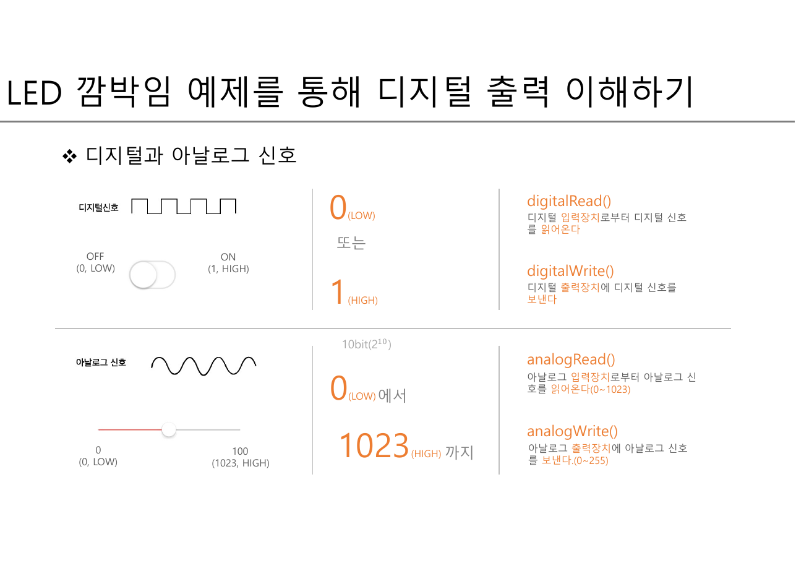
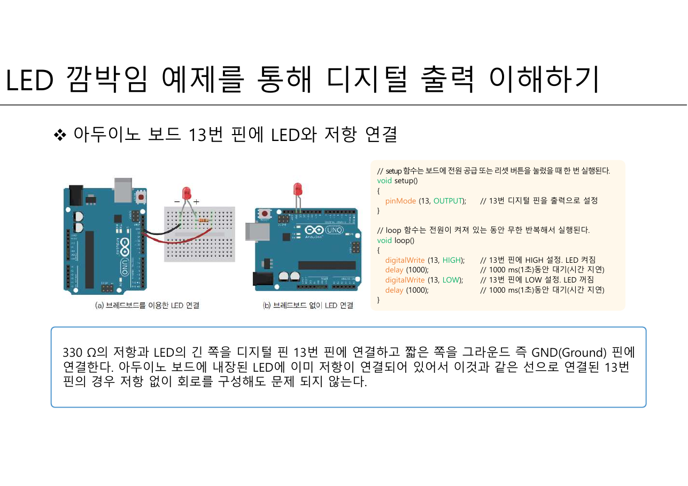
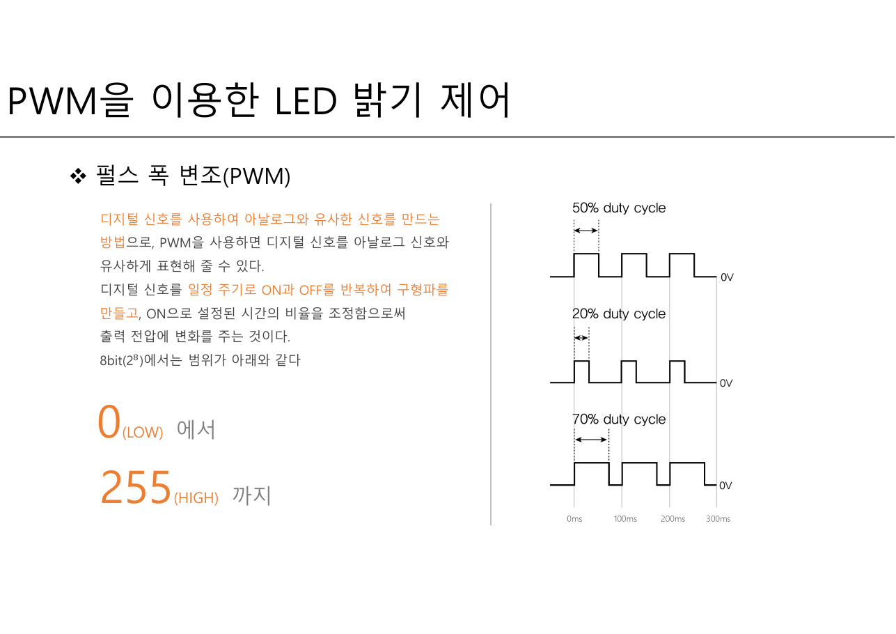
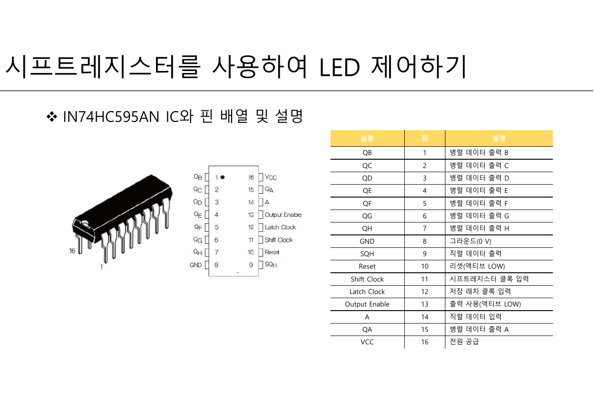
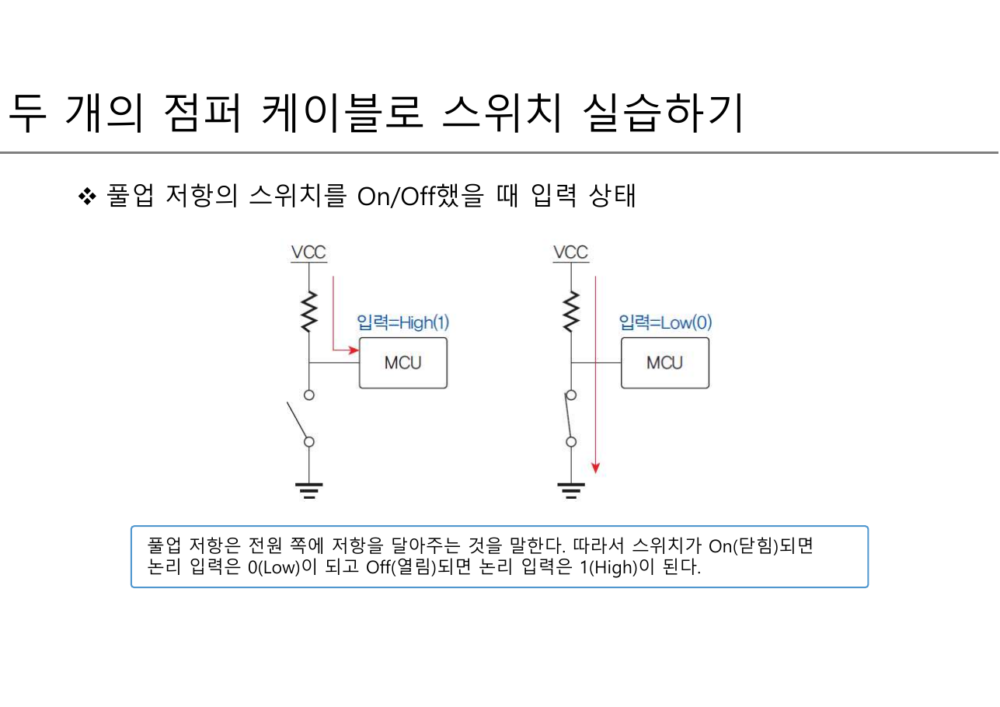
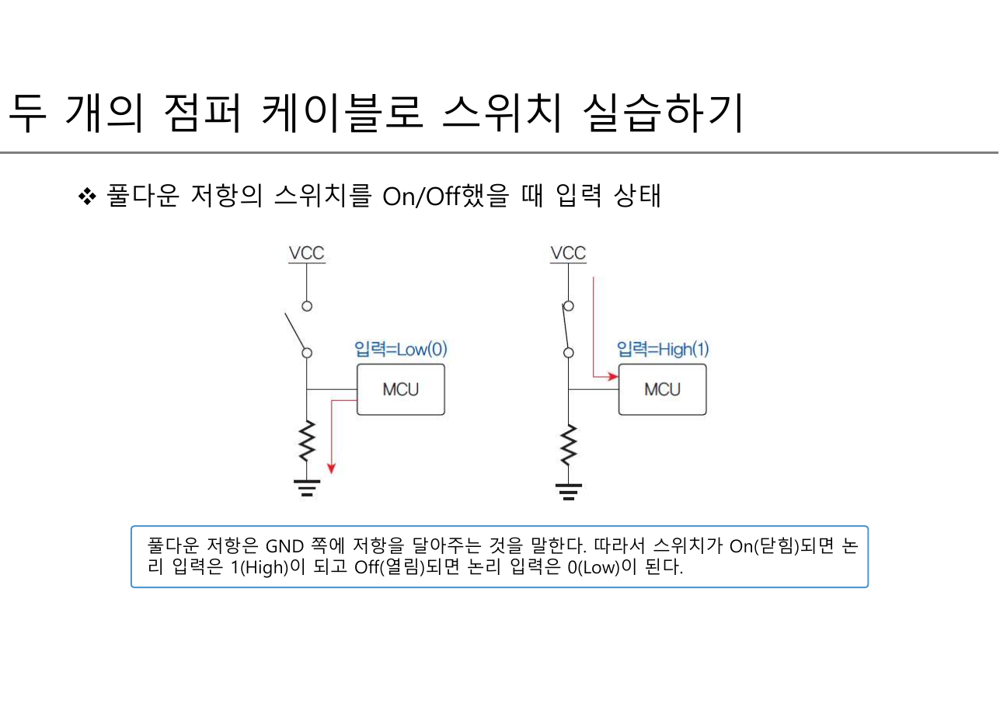
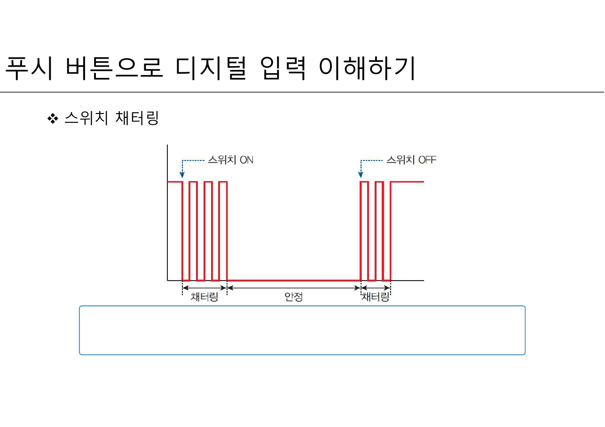
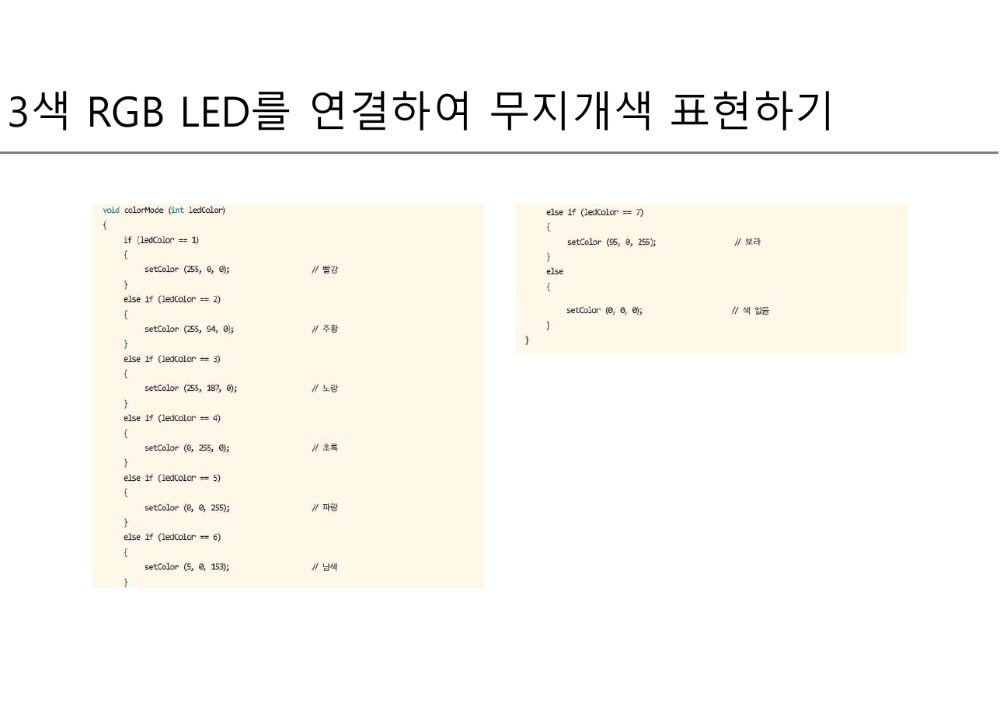

> [!abstract] 핀은 두 값만 낼 수 있는데 세상은 연속이다
> 아두이노의 디지털 핀이 할 수 있는 일은 두 가지뿐이다 — **5V를 내보내거나(HIGH), 0V로 두거나(LOW).** 그런데 우리가 만들고 싶은 것은 "조금 어두운 빨강"이나 "천천히 밝아지는 LED"처럼 **중간값**이다.
>
> 이 두 자료 34장은 그 어긋남을 세 번 다룬다.
>
> | 어긋남 | 해법 | 쪽 |
> | --- | --- | --- |
> | 밝기는 연속인데 핀은 0/1뿐 | **PWM** — 시간을 잘게 쪼개 켜진 비율을 조절 | 출력 11·13·14 |
> | LED는 8개인데 쓸 수 있는 핀이 모자람 | **시프트레지스터** — 3개의 핀으로 8개를 제어 | 출력 15~17 |
> | 스위치를 안 눌렀을 때 핀의 값이 정해지지 않음 | **풀업·풀다운 저항** — 기본값을 못박음 | 입력 4·5 |
>
> 그리고 마지막에 하나가 더 있다. 물리적인 접점은 **깨끗한 0/1을 주지 않는다**(입력 8·9쪽 — 채터링). 소프트웨어가 물리 세계를 만나는 지점이 여기다.
>
> [1장 29쪽의 영화 필름 비유](./01.%20컴퓨터의%20이해와%20정보의%20표현.md)가 여기서 되살아난다. 정지 사진을 빠르게 넘기면 움직이는 것처럼 보이듯, **켜고 끄기를 빠르게 반복하면 중간 밝기처럼 보인다.**

---

## 두 개의 값, 두 개의 축

출력 자료 5쪽이 이 강의의 좌표계를 한 장에 담는다.



| | 입력 | 출력 |
| --- | --- | --- |
| **디지털** | `digitalRead()` — 0(LOW) 또는 1(HIGH) | `digitalWrite()` — 0 또는 1 |
| **아날로그** | `analogRead()` — **0 ~ 1023** (10비트) | `analogWrite()` — **0 ~ 255** (8비트) |

읽기와 쓰기의 범위가 다르다는 점이 중요하다. **읽을 때는 10비트($2^{10}$ = 1024단계), 쓸 때는 8비트($2^{8}$ = 256단계)** 다. [1장 37~39쪽의 비트·바이트](./01.%20컴퓨터의%20이해와%20정보의%20표현.md)가 여기서 하드웨어의 실제 해상도로 나타난다.

### 첫 프로그램 — 두 개의 함수만 있다

6쪽이 LED 깜박임 예제다. 회로는 330Ω 저항과 LED를 13번 핀과 GND 사이에 놓는 것이고, 코드는 열 줄이 안 된다.



```c
// setup 함수는 보드에 전원 공급 또는 리셋 버튼을 눌렀을 때 한 번 실행된다.
void setup()
{
   pinMode (13, OUTPUT);     // 13번 디지털 핀을 출력으로 설정
}

// loop 함수는 전원이 켜져 있는 동안 무한 반복해서 실행된다.
void loop()
{
   digitalWrite (13, HIGH);  // 13번 핀에 HIGH 설정. LED 켜짐
   delay (1000);             // 1000 ms(1초)동안 대기(시간 지연)
   digitalWrite (13, LOW);   // 13번 핀에 LOW 설정. LED 꺼짐
   delay (1000);
}
```

> [!important] 세 번째 실행 모형
> 이 강의에서 실행 방식을 세 번 만난다.
>
> | 모형 | 시작 | 끝 | 어디서 |
> | --- | --- | --- | --- |
> | **순차 실행** | `main`의 첫 줄 | 마지막 줄 | [7장 C 프로그램](./07.%20C%20언어의%20변수·연산자·제어문·함수.md) |
> | **이벤트 구동** | 시작점 없음 | 끝 없음 | [8·9장 앱 인벤터](./08.%20앱%20인벤터%20기초%20프로젝트.md) |
> | **setup + loop** | `setup` 한 번 | **끝나지 않는다** | 이 장 |
>
> 7쪽이 이 모형을 명시적으로 그린다 — `setup`의 구문 1·2는 최초 한 번만, `loop`의 구문 3~7은 3→4→5→6→7→3→4… 로 **무한 반복**. [4장 060쪽의 while 반복](./04.%20순서도%20작성%20실습.md)에서 조건이 영원히 참인 경우이고, [7장 문법 7쪽의 `while(1)`](./07.%20C%20언어의%20변수·연산자·제어문·함수.md)이 언어가 아니라 **실행 환경 자체에 박혀 있는** 셈이다.

6쪽의 회로 설명에 실용적인 조언이 하나 붙어 있다 — **"아두이노 보드에 내장된 LED에 이미 저항이 연결되어 있어서 이것과 같은 선으로 연결된 13번 핀의 경우 저항 없이 회로를 구성해도 문제 되지 않는다."** 13번 핀만 특별하다는 뜻이고, 다른 핀에서는 저항이 필요하다.

3~4쪽은 LED 자체를 설명한다. **애노드(긴 다리, +)** 와 **캐소드(짧은 다리, −)** 의 구분, 그리고 "한쪽 방향으로만 전류가 흐르도록 제어하는 반도체 소자"라는 다이오드의 정의다. 방향이 있는 부품이므로 거꾸로 꽂으면 켜지지 않는다.

---

## 첫 번째 어긋남 — 밝기는 연속이다

11쪽이 밝기 조절 예제(`03.Analog → Fading`)를 보여준다. 9번 핀에 LED를 연결하고 다음을 반복한다.

```c
int ledPin = 9;
void loop()
{
  // fadeValue 변수를 선언하고 최솟값에서 최댓값까지 5씩 늘린다.
  for (int fadeValue = 0; fadeValue <= 255; fadeValue += 5)
  { analogWrite (ledPin, fadeValue);  delay (30); }

  for (int fadeValue = 255; fadeValue >= 0; fadeValue -= 5)
  { analogWrite (ledPin, fadeValue);  delay (30); }
}
```

> [!note] 원본 출력 11쪽 — 두 번째 for문의 주석이 첫 번째와 같다
> 두 번째 반복문 위의 주석이 "fadeValue 변수를 선언하고 **최솟값에서 최댓값까지** 5씩 **줄인다**"로 되어 있다. 코드는 255에서 0으로 내려가므로 **"최댓값에서 최솟값까지"** 가 맞다. 첫 번째 주석을 복사해 "늘린다"만 "줄인다"로 고친 것으로 보인다.

13쪽이 원리를 설명한다.



> **디지털 신호를 사용하여 아날로그와 유사한 신호를 만드는 방법.** 디지털 신호를 **일정 주기로 ON과 OFF를 반복하여 구형파**를 만들고, ON으로 설정된 시간의 비율을 조정함으로써 출력 전압에 변화를 주는 것이다.

슬라이드 오른쪽 그림이 100ms 주기에서 **50% · 20% · 70%** 세 가지 듀티 사이클을 보인다. 그리고 8비트($2^8$)에서 범위는 **0(LOW)에서 255(HIGH)까지**다.

14쪽이 함수를 정리한다 — `analogWrite(PWM 핀의 번호, 제어할 값 0~255)`. 그리고 한 줄을 덧붙인다. **"PWM을 통해 제어할 경우 pinMode 설정 불필요."** 실제로 11쪽의 `setup()`은 비어 있다.

```html preview h=600px
<div style="font-family:system-ui,-apple-system,sans-serif;padding:20px;color:var(--foreground)">
  <div style="display:flex;gap:10px;align-items:center;flex-wrap:wrap;margin-bottom:10px">
    <span style="font-size:12.5px;font-weight:600">원본 13쪽의 예</span>
    <div id="dp" style="display:flex;gap:5px"></div>
    <button id="fade" style="cursor:pointer;font:inherit;font-size:12px;padding:4px 11px;border-radius:var(--radius);border:1px solid var(--border);background:transparent;color:var(--foreground)">Fading 예제 재생 ▶</button>
  </div>
  <label for="pw" style="font-size:12.5px;font-weight:600">analogWrite 값 = <span id="pwv" style="color:var(--chart-1);font-weight:700">128</span> / 255</label>
  <input id="pw" type="range" min="0" max="255" step="1" value="128" style="width:100%;accent-color:var(--primary)" />

  <div style="display:flex;gap:16px;flex-wrap:wrap;margin:14px 0">
    <div style="flex:1;min-width:180px;text-align:center;border:1px solid var(--border);border-radius:var(--radius);padding:12px;background:var(--card)">
      <div style="font-size:11.5px;color:var(--muted-foreground);margin-bottom:8px">LED가 보이는 밝기</div>
      <div id="bulb" style="width:74px;height:74px;border-radius:50%;margin:0 auto;border:1px solid var(--border)"></div>
      <div id="pct" style="font-size:12.5px;margin-top:8px"></div>
    </div>
    <div style="flex:2;min-width:250px">
      <svg id="wave" viewBox="0 0 480 150" width="100%" role="img" aria-label="PWM 구형파 파형"></svg>
    </div>
  </div>

  <div id="note4" style="padding:11px 13px;background:var(--card);border:1px solid var(--border);border-radius:var(--radius);font-size:13px;line-height:1.7"></div>

  <script>
    var sl = document.getElementById('pw'), timer = null;
    function draw() {
      var v = parseInt(sl.value, 10);
      var duty = v / 255;
      document.getElementById('pwv').textContent = v;
      document.getElementById('dp').innerHTML = [[51, '20%'], [128, '50%'], [178, '70%']].map(function (p) {
        var on = Math.abs(v - p[0]) < 3;
        return '<button data-v="' + p[0] + '" style="cursor:pointer;font:inherit;font-size:12px;padding:4px 10px;border-radius:var(--radius);border:1px solid ' +
          (on ? 'var(--chart-1)' : 'var(--border)') + ';background:' + (on ? 'var(--chart-1)' : 'transparent') +
          ';color:' + (on ? 'var(--primary-foreground)' : 'var(--foreground)') + '">' + p[1] + '</button>';
      }).join('');
      Array.prototype.forEach.call(document.querySelectorAll('#dp button'), function (b) {
        b.addEventListener('click', function () { sl.value = b.getAttribute('data-v'); draw(); });
      });

      var bulb = document.getElementById('bulb');
      bulb.style.background = 'var(--chart-1)';
      bulb.style.opacity = (0.06 + duty * 0.94).toFixed(3);
      document.getElementById('pct').innerHTML = '듀티 사이클 <b style="color:var(--chart-1)">' + (duty * 100).toFixed(1) + '%</b>';

      var W = 480, H = 150, base = 118, top = 26, per = 100, cycles = 4;
      var d = '', x = 20;
      for (var c = 0; c < cycles; c++) {
        var onW = per * duty, offW = per - onW;
        d += (c === 0 ? 'M' + x + ',' + base : 'L' + x + ',' + base);
        d += ' L' + x + ',' + top + ' L' + (x + onW).toFixed(1) + ',' + top + ' L' + (x + onW).toFixed(1) + ',' + base;
        x += per;
        d += ' L' + x + ',' + base;
      }
      var avgY = base - duty * (base - top);
      document.getElementById('wave').innerHTML =
        '<line x1="14" y1="' + base + '" x2="' + (W - 6) + '" y2="' + base + '" stroke="var(--border)"/>' +
        '<line x1="14" y1="' + avgY.toFixed(1) + '" x2="' + (W - 6) + '" y2="' + avgY.toFixed(1) +
        '" stroke="var(--chart-2)" stroke-width="1.5" stroke-dasharray="5 4"/>' +
        '<path d="' + d + '" fill="none" stroke="var(--chart-1)" stroke-width="2.2"/>' +
        '<text x="' + (W - 8) + '" y="' + (avgY - 6).toFixed(1) + '" text-anchor="end" font-size="11" fill="var(--chart-2)">평균 ' +
        (5 * duty).toFixed(2) + ' V</text>' +
        '<text x="16" y="' + (top - 8) + '" font-size="11" fill="var(--muted-foreground)">5V (HIGH)</text>' +
        '<text x="16" y="' + (base + 16) + '" font-size="11" fill="var(--muted-foreground)">0V (LOW) · 주기 100ms</text>';

      document.getElementById('note4').innerHTML =
        '핀이 내는 전압은 <b>여전히 0V 아니면 5V</b>다. 달라진 것은 <b>켜져 있는 시간의 비율</b>뿐이고, ' +
        '눈과 LED가 그 빠른 깜박임을 평균해서 <b style="color:var(--chart-2)">' + (5 * duty).toFixed(2) + 'V</b>처럼 느낀다.<br>' +
        '<span style="color:var(--muted-foreground)">[1장 29쪽]의 영화 필름과 같은 착시다. ' +
        '원본 13쪽이 든 20%·50%·70%가 각각 1.00V·2.50V·3.50V에 해당한다.</span>';
    }
    document.getElementById('fade').addEventListener('click', function () {
      if (timer) { clearInterval(timer); timer = null; this.textContent = 'Fading 예제 재생 ▶'; return; }
      this.textContent = '멈추기 ■';
      var v = 0, dir = 5;
      sl.value = 0; draw();
      timer = setInterval(function () {
        v += dir;
        if (v >= 255) { v = 255; dir = -5; }
        else if (v <= 0) { v = 0; dir = 5; }
        sl.value = v; draw();
      }, 30);
    });
    sl.addEventListener('input', draw);
    draw();
  </script>
</div>
```

> [!tip] Fading 예제의 실제 속도 (보충 계산)
> `fadeValue`가 0에서 255까지 5씩 늘면 **52단계**이고 각 단계가 `delay(30)`이므로 올라가는 데 **1,560ms**, 내려오는 데 다시 1,560ms — 한 주기가 약 **3.1초**다. 원본은 이 계산을 하지 않으므로 보충 설명이며, 위 인터렉티브의 재생 버튼도 같은 값(0~255, 5씩, 30ms)으로 돈다.

12쪽은 다른 방향의 확장이다. 2~9번 핀에 LED 8개를 배열 `Led_pin[8] = {2,3,4,5,6,7,8,9}`로 두고 `for`문으로 훑는다. **핀 번호를 배열에 담고 반복문으로 도는 것** — [7장 변수와배열 12쪽이 "배열은 반복문과 함께 써야 효율이 극대화된다"고 한 그 형태](./07.%20C%20언어의%20변수·연산자·제어문·함수.md)가 물리 세계에 그대로 적용된다. `delay(500)`이므로 8개를 순서대로 켜는 데 4초, 끄는 데 다시 4초가 걸린다.

> [!note] 원본 출력 자료의 슬라이드 순서
> 2쪽 목차는 ①LED 깜박임 ②PWM ③여러 개의 LED ④시프트레지스터 ⑤RGB LED ⑥릴레이 순인데, 실제 슬라이드는 11쪽(PWM 예제) → 12쪽(여러 개의 LED) → 13쪽(PWM 원리) 순으로 배치되어 PWM이 12쪽을 사이에 두고 갈라져 있다. 읽을 때는 11 → 13 → 14 → 12 순으로 보는 편이 자연스럽다.

---

## 두 번째 어긋남 — 핀이 모자란다

15~17쪽이 시프트레지스터(74HC595)를 다룬다. 문제는 단순하다. LED 8개를 각각 제어하려면 핀 8개가 필요한데, 아두이노 우노의 디지털 핀은 14개뿐이고 다른 용도도 있다.



해법은 **직렬을 병렬로 바꾸는 것**이다. 데이터를 한 비트씩 밀어 넣고, 다 넣은 뒤 한꺼번에 내보낸다.

| 핀(74HC595) | 이름 | 아두이노 쪽 | 하는 일 |
| --- | --- | --- | --- |
| 14 | `A` (직렬 데이터 입력) | `dataPin` = 11 | 비트 하나를 준다 |
| 11 | `Shift Clock` | `clockPin` = 12 | 한 칸 밀어 넣으라는 신호 |
| 12 | `Latch Clock` | `latchPin` = 8 | 지금까지 밀어 넣은 8비트를 **출력에 확정** |
| 15, 1~7 | `QA`~`QH` | LED 8개 | 병렬 출력 |

17쪽의 코드가 이 세 핀만으로 8개를 제어한다.

```c
void loop()
{
  for (int number = 0; number < 256; number++)
  {
        digitalWrite (latchPin, LOW);
        shiftOut (dataPin, clockPin, MSBFIRST, number);
        digitalWrite (latchPin, HIGH);
        delay (100);
  }
}
```

`number`가 0부터 255까지 오르면서 **그 수의 8비트 2진 표현이 그대로 LED 8개의 켜짐/꺼짐 패턴**이 된다. [1장 46쪽에서 237을 `11101101`로 바꿨던 것](./01.%20컴퓨터의%20이해와%20정보의%20표현.md)이 여기서는 눈에 보이는 불빛이 된다.

`MSBFIRST`는 **최상위 비트부터** 밀어 넣으라는 뜻이다. 반대로 하면 같은 수가 좌우 뒤집힌 패턴으로 나타난다.

```html preview h=520px
<div style="font-family:system-ui,-apple-system,sans-serif;padding:20px;color:var(--foreground)">
  <label for="num" style="font-size:12.5px;font-weight:600">number = <span id="numv" style="color:var(--chart-1);font-weight:700">237</span> <span style="font-weight:400;color:var(--muted-foreground)">(원본 코드는 0부터 255까지 100ms 간격으로 센다)</span></label>
  <input id="num" type="range" min="0" max="255" step="1" value="237" style="width:100%;accent-color:var(--primary)" />
  <div style="display:flex;gap:8px;flex-wrap:wrap;margin:10px 0 16px">
    <button id="run" style="cursor:pointer;font:inherit;font-size:12.5px;padding:5px 12px;border-radius:var(--radius);border:1px solid var(--border);background:transparent;color:var(--foreground)">0부터 세기 ▶</button>
    <div id="ord" style="display:flex;gap:5px"></div>
  </div>

  <div style="text-align:center;margin-bottom:6px">
    <div id="leds" style="display:inline-flex;gap:12px"></div>
  </div>
  <div style="text-align:center;font-size:11.5px;color:var(--muted-foreground)" id="labels"></div>

  <div id="bits" style="margin-top:16px;padding:11px 13px;background:var(--card);border:1px solid var(--border);border-radius:var(--radius);font-size:13px;line-height:1.8"></div>

  <script>
    var el = document.getElementById('num'), msb = true, t2 = null;
    function draw() {
      var n = parseInt(el.value, 10);
      document.getElementById('numv').textContent = n;
      var bin = n.toString(2).padStart(8, '0');
      var order = msb ? bin.split('') : bin.split('').reverse();
      document.getElementById('ord').innerHTML = [[true, 'MSBFIRST'], [false, 'LSBFIRST']].map(function (p) {
        var on = p[0] === msb;
        return '<button data-m="' + p[0] + '" style="cursor:pointer;font:inherit;font-size:12px;padding:5px 10px;border-radius:var(--radius);border:1px solid ' +
          (on ? 'var(--chart-1)' : 'var(--border)') + ';background:' + (on ? 'var(--chart-1)' : 'transparent') +
          ';color:' + (on ? 'var(--primary-foreground)' : 'var(--foreground)') + '">' + p[1] + '</button>';
      }).join('');
      Array.prototype.forEach.call(document.querySelectorAll('#ord button'), function (b) {
        b.addEventListener('click', function () { msb = b.getAttribute('data-m') === 'true'; draw(); });
      });

      document.getElementById('leds').innerHTML = order.map(function (b) {
        return '<div style="width:32px;height:32px;border-radius:50%;border:1px solid var(--border);background:' +
          (b === '1' ? 'var(--chart-1)' : 'transparent') + ';opacity:' + (b === '1' ? 1 : 0.35) + '"></div>';
      }).join('');
      document.getElementById('labels').innerHTML = ['QA', 'QB', 'QC', 'QD', 'QE', 'QF', 'QG', 'QH']
        .map(function (q) { return '<span style="display:inline-block;width:44px">' + q + '</span>'; }).join('');

      document.getElementById('bits').innerHTML =
        '10진 <b>' + n + '</b> = 2진 <b style="font-family:ui-monospace,Menlo,monospace;color:var(--chart-2)">' + bin +
        '</b> = 16진 <b style="color:var(--chart-3)">' + n.toString(16).toUpperCase().padStart(2, '0') + '</b><br>' +
        '<span style="color:var(--muted-foreground)">' + (msb
          ? '<b>MSBFIRST</b> — 최상위 비트부터 밀어 넣으므로 QA가 2진수의 <b>맨 왼쪽</b> 자리다. 원본 17쪽 코드가 이 방식이다.'
          : '<b>LSBFIRST</b> — 최하위 비트부터 밀어 넣으므로 불빛 패턴이 <b>좌우로 뒤집힌다</b>. 같은 수, 다른 그림.') +
        '<br>핀 셋(data · clock · latch)만으로 출력 여덟 개를 제어한다.</span>';
    }
    document.getElementById('run').addEventListener('click', function () {
      if (t2) { clearInterval(t2); t2 = null; this.textContent = '0부터 세기 ▶'; return; }
      this.textContent = '멈추기 ■';
      var v = 0; el.value = 0; draw();
      t2 = setInterval(function () { v = (v + 1) % 256; el.value = v; draw(); }, 100);
    });
    el.addEventListener('input', draw);
    draw();
  </script>
</div>
```

18~19쪽의 RGB LED와 20~22쪽의 릴레이가 출력 자료의 나머지다. RGB는 **캐소드 공통(Cathode Common) 형** — 세 색의 −극이 하나로 묶여 있고, 각 색의 +를 PWM 핀으로 따로 제어한다. 릴레이는 반대로 **작은 전류로 큰 전류를 여닫는** 부품이며, 21쪽이 접점 구성에 따라 SPST·SPDT·DPST·DPDT로 분류한다.

> [!note] 원본 출력 19쪽의 `redOff, greenOff, blueOff`
> `int redOff, greenOff, blueOff;` 를 전역 변수로 선언만 하고 값을 넣지 않은 채 `analogWrite(redPin, redOff)`로 LED를 끈다. C에서 **전역 변수는 0으로 자동 초기화**되므로 동작은 하지만, 코드만 읽어서는 왜 꺼지는지 알기 어렵다. `analogWrite(redPin, 0)`이 더 분명하다.

---

## 세 번째 어긋남 — 안 눌렀을 때의 값

입력 자료 3쪽의 코드에 처음 보는 두 줄이 있다.

```c
pinMode (12, INPUT);        // 12번 핀 입력 선언
digitalWrite (12, HIGH);    // 12번 핀 내부 풀업저항 활성화
```

**입력 핀에 `digitalWrite`를 한다.** 값을 내보내려는 것이 아니라 **내부 풀업 저항을 켜는** 관용 표현이다(요즘은 `pinMode(12, INPUT_PULLUP)`으로 쓴다).

왜 필요한가. 스위치가 열려 있으면 핀은 아무 데도 연결되지 않아 **값이 정해지지 않는다.** 0인지 1인지 알 수 없고, 주변 잡음에 따라 흔들린다. 저항으로 어느 한쪽에 살짝 묶어 두어야 기본값이 생긴다.





| 방식 | 저항의 위치 | 스위치 On(닫힘) | 스위치 Off(열림) |
| --- | --- | --- | --- |
| **풀업** | **전원(VCC) 쪽** | **0 (Low)** | 1 (High) |
| **풀다운** | **GND 쪽** | **1 (High)** | 0 (Low) |

풀업에서는 논리가 뒤집힌다는 점이 함정이다. 3쪽의 코드가 `if (sw_input == LOW)`로 "눌렀을 때"를 검사하는 이유가 여기 있다.

```html preview h=520px
<div style="font-family:system-ui,-apple-system,sans-serif;padding:20px;color:var(--foreground)">
  <div style="display:flex;gap:8px;flex-wrap:wrap;align-items:center;margin-bottom:14px">
    <div id="pm" style="display:flex;gap:6px"></div>
    <label style="display:flex;gap:8px;align-items:center;font-size:13.5px;cursor:pointer;margin-left:10px">
      <input id="sw" type="checkbox" style="width:17px;height:17px;accent-color:var(--chart-1)" /> 스위치를 <b>누른다</b> (On · 닫힘)
    </label>
  </div>

  <div style="display:flex;gap:16px;flex-wrap:wrap">
    <svg id="cir" viewBox="0 0 240 220" width="230" role="img" aria-label="풀업 또는 풀다운 회로도"></svg>
    <div style="flex:1;min-width:230px">
      <div style="border:1px solid var(--border);border-radius:var(--radius);padding:12px 14px;background:var(--card);margin-bottom:10px">
        <div style="font-size:11.5px;color:var(--muted-foreground)">digitalRead(12)가 돌려주는 값</div>
        <div id="rd" style="font-size:30px;font-weight:800"></div>
      </div>
      <div style="border:1px solid var(--border);border-radius:var(--radius);padding:12px 14px;background:var(--card)">
        <div style="font-size:11.5px;color:var(--muted-foreground);margin-bottom:5px">13번 LED</div>
        <div style="display:flex;gap:10px;align-items:center">
          <div id="led2" style="width:34px;height:34px;border-radius:50%;border:1px solid var(--border)"></div>
          <code id="cond" style="font-size:12.5px"></code>
        </div>
      </div>
    </div>
  </div>

  <div id="msg5" style="margin-top:14px;padding:11px 13px;border:1px solid var(--border);border-radius:var(--radius);font-size:13px;line-height:1.7"></div>

  <script>
    var up = true, sw = document.getElementById('sw');
    function draw() {
      document.getElementById('pm').innerHTML = [[true, '풀업 (원본 4쪽)'], [false, '풀다운 (원본 5쪽)']].map(function (p) {
        var on = p[0] === up;
        return '<button data-u="' + p[0] + '" style="cursor:pointer;font:inherit;font-size:12.5px;padding:5px 12px;border-radius:var(--radius);border:1px solid ' +
          (on ? 'var(--chart-1)' : 'var(--border)') + ';background:' + (on ? 'var(--chart-1)' : 'transparent') +
          ';color:' + (on ? 'var(--primary-foreground)' : 'var(--foreground)') + '">' + p[1] + '</button>';
      }).join('');
      Array.prototype.forEach.call(document.querySelectorAll('#pm button'), function (b) {
        b.addEventListener('click', function () { up = b.getAttribute('data-u') === 'true'; draw(); });
      });

      var closed = sw.checked;
      var val = up ? (closed ? 0 : 1) : (closed ? 1 : 0);
      var lit = up ? (val === 0) : (val === 1);

      var res = up
        ? '<rect x="108" y="34" width="16" height="40" fill="none" stroke="var(--chart-3)" stroke-width="2"/>'
        : '<rect x="108" y="146" width="16" height="40" fill="none" stroke="var(--chart-3)" stroke-width="2"/>';
      var swg = closed
        ? '<line x1="116" y1="' + (up ? 108 : 96) + '" x2="116" y2="' + (up ? 146 : 134) + '" stroke="var(--chart-1)" stroke-width="2.5"/>'
        : '<line x1="116" y1="' + (up ? 108 : 96) + '" x2="140" y2="' + (up ? 138 : 126) + '" stroke="var(--chart-1)" stroke-width="2.5"/>';
      document.getElementById('cir').innerHTML =
        '<text x="116" y="20" text-anchor="middle" font-size="12" fill="var(--muted-foreground)">VCC (5V)</text>' +
        '<line x1="86" y1="26" x2="146" y2="26" stroke="var(--foreground)" stroke-width="2"/>' +
        '<line x1="116" y1="26" x2="116" y2="' + (up ? 34 : 96) + '" stroke="var(--foreground)" stroke-width="1.5"/>' +
        res + swg +
        '<line x1="116" y1="' + (up ? 74 : 186) + '" x2="116" y2="' + (up ? 96 : 200) + '" stroke="var(--foreground)" stroke-width="1.5"/>' +
        '<line x1="116" y1="' + (up ? 146 : 134) + '" x2="116" y2="' + (up ? 200 : 146) + '" stroke="var(--foreground)" stroke-width="1.5"/>' +
        '<line x1="86" y1="200" x2="146" y2="200" stroke="var(--foreground)" stroke-width="2"/>' +
        '<text x="116" y="216" text-anchor="middle" font-size="12" fill="var(--muted-foreground)">GND</text>' +
        '<line x1="116" y1="' + (up ? 96 : 110) + '" x2="196" y2="' + (up ? 96 : 110) + '" stroke="var(--chart-2)" stroke-width="2"/>' +
        '<rect x="176" y="' + (up ? 80 : 94) + '" width="52" height="32" fill="var(--card)" stroke="var(--chart-2)"/>' +
        '<text x="202" y="' + (up ? 100 : 114) + '" text-anchor="middle" font-size="11" fill="var(--foreground)">핀 12</text>' +
        '<text x="150" y="' + (up ? 88 : 102) + '" font-size="11" fill="var(--chart-2)">' + (val ? 'HIGH' : 'LOW') + '</text>';

      document.getElementById('rd').innerHTML = val
        ? '<span style="color:var(--chart-1)">1 (HIGH)</span>' : '<span style="color:var(--chart-2)">0 (LOW)</span>';
      var l = document.getElementById('led2');
      l.style.background = lit ? 'var(--chart-1)' : 'transparent';
      l.style.opacity = lit ? 1 : 0.3;
      document.getElementById('cond').textContent = up
        ? 'if (sw_input == LOW) → ' + (lit ? '참' : '거짓')
        : 'if (buttonState == HIGH) → ' + (lit ? '참' : '거짓');

      document.getElementById('msg5').innerHTML = up
        ? '<b>풀업</b> — 저항이 <b>전원 쪽</b>에 있어 스위치가 열려 있으면 핀이 5V로 끌려 올라가 <b>1</b>이다. 스위치를 닫으면 GND로 직접 연결되어 <b>0</b>이 된다.<br>' +
          '<span style="color:var(--muted-foreground)">"누르면 0" — 논리가 뒤집힌다. 원본 입력 3쪽이 <code>if (sw_input == LOW)</code>로 검사하는 이유다.</span>'
        : '<b>풀다운</b> — 저항이 <b>GND 쪽</b>에 있어 스위치가 열려 있으면 핀이 0V로 끌려 내려가 <b>0</b>이다. 닫으면 <b>1</b>이 된다.<br>' +
          '<span style="color:var(--muted-foreground)">"누르면 1" — 직관과 맞는다. 원본 입력 7쪽의 푸시 버튼 예제가 이 방식이고, 그래서 <code>if (buttonState == HIGH)</code>로 검사한다.</span>';
    }
    sw.addEventListener('change', draw);
    draw();
  </script>
</div>
```

6쪽이 푸시 버튼의 물리적 구조를 설명한다. 커넥터가 넷인데 **1-2번과 3-4번은 항상 연결**되어 있고, 누르면 **1-4번과 2-3번이 연결**된다. 결과적으로 누르면 네 핀이 모두 이어진다. 브레드보드에 꽂을 때 어느 두 다리를 쓰느냐가 회로를 결정하므로, 이 구조를 모르면 눌러도 반응이 없거나 항상 눌린 것처럼 동작한다.

### 접점은 깨끗한 0/1을 주지 않는다

8~9쪽이 이 자료의 마지막 문제다.



금속 접점이 붙는 순간 아주 짧은 시간 동안 여러 번 튄다. 사람에게는 한 번 누른 것이지만 마이크로컨트롤러는 **수십 번의 상승·하강**을 본다. 8쪽의 코드가 해법을 보인다.

```c
long lastDebounceTime = 0;   // 버튼 입력값이 변경된 최근 시간
long debounceDelay = 50;     // 디바운싱 시간

int reading = digitalRead (buttonPin);
if (reading != lastButtonState)
{ lastDebounceTime = millis(); }              // 값이 바뀌면 시계를 다시 잰다

// 디바운싱 값이 50을 넘기면, 읽은 스위치 상태를 현재 스위치 상태로 간주
if ( (millis() - lastDebounceTime) > debounceDelay )
{
  if (reading != buttonState)
  { buttonState = reading;
    if (buttonState == HIGH) { ledState = !ledState; } }
}
digitalWrite (ledPin, ledState);
lastButtonState = reading;
```

핵심은 **값이 바뀔 때마다 시계를 다시 재는 것**이다. 튀는 동안에는 계속 초기화되어 50ms를 넘기지 못하고, 신호가 안정된 뒤에야 상태를 확정한다.

> [!important] 소프트웨어가 물리 세계와 만나는 지점
> [5·6장의 알고리즘](./05.%20배열%20위의%20기본%20알고리즘.md)에서 배열의 값은 읽는 순간 확정되어 있었다. 잡음도 없고, 같은 칸을 두 번 읽으면 같은 값이 나왔다.
>
> 물리 세계는 다르다. **같은 스위치를 같은 순간에 읽어도 값이 다를 수 있다.** 채터링은 버그가 아니라 금속의 성질이고, 그래서 고칠 수 있는 것은 회로가 아니라 **읽는 방식**이다. `millis()`로 시간을 재고 안정될 때까지 기다리는 이 열 줄이, 알고리즘 자료 전체에 없던 종류의 코드다.

덧붙여, 이 대목의 슬라이드 자체에도 빈자리가 하나 있다.

> [!note] 원본 입력 9쪽의 설명 상자가 비어 있다
> "스위치 채터링"이라는 제목과 파형 그림, 그리고 **아무것도 적히지 않은 파란 상자** 하나가 슬라이드의 전부다. 강의 중에 말로 설명했을 것으로 보인다. 파형을 보면 신호가 HIGH에서 시작해 LOW로 떨어지며 여러 번 튀는데, 이는 8쪽의 회로가 아니라 **풀업 방식**의 파형이다.

### 그리고 다시 아날로그로

10~12쪽이 두 자료를 합친다. RGB LED에 푸시 버튼을 더해, 누를 때마다 무지개 일곱 색이 차례로 나오게 한다.



```html preview h=560px
<div style="font-family:system-ui,-apple-system,sans-serif;padding:20px;color:var(--foreground)">
  <div style="display:flex;gap:10px;align-items:center;flex-wrap:wrap;margin-bottom:14px">
    <button id="press" style="cursor:pointer;font:inherit;font-size:13px;padding:8px 18px;border-radius:var(--radius);border:1px solid var(--chart-1);background:var(--chart-1);color:var(--primary-foreground)">푸시 버튼 누르기</button>
    <div style="font-size:12.5px">ledMode = <b id="lm" style="color:var(--chart-1)">0</b> <span style="color:var(--muted-foreground)">(8이 되면 0으로 되돌아간다)</span></div>
  </div>

  <div style="display:flex;gap:18px;flex-wrap:wrap;align-items:center">
    <div style="text-align:center">
      <div id="rgb" style="width:96px;height:96px;border-radius:50%;border:1px solid var(--border)"></div>
      <div id="rgbn" style="font-size:12.5px;margin-top:8px;font-weight:600"></div>
    </div>
    <div style="flex:1;min-width:230px">
      <div id="bars"></div>
    </div>
  </div>

  <div style="margin-top:16px;overflow-x:auto">
    <table style="border-collapse:collapse;font-size:12.5px;min-width:380px">
      <thead><tr>
        <th style="text-align:left;padding:5px 12px;border-bottom:1px solid var(--border)">ledMode</th>
        <th style="text-align:left;padding:5px 12px;border-bottom:1px solid var(--border)">색</th>
        <th style="text-align:right;padding:5px 12px;border-bottom:1px solid var(--border)">R</th>
        <th style="text-align:right;padding:5px 12px;border-bottom:1px solid var(--border)">G</th>
        <th style="text-align:right;padding:5px 12px;border-bottom:1px solid var(--border)">B</th>
      </tr></thead>
      <tbody id="tb2"></tbody>
    </table>
  </div>

  <script>
    // 원본 입력 12쪽 colorMode() 함수의 값 그대로
    var C = [
      [0, '색 없음', 0, 0, 0], [1, '빨강', 255, 0, 0], [2, '주황', 255, 94, 0], [3, '노랑', 255, 187, 0],
      [4, '초록', 0, 255, 0], [5, '파랑', 0, 0, 255], [6, '남색', 5, 0, 153], [7, '보라', 95, 0, 255]
    ];
    var mode = 0;
    function draw() {
      var c = C[mode];
      document.getElementById('lm').textContent = mode;
      document.getElementById('rgb').style.background = 'rgb(' + c[2] + ',' + c[3] + ',' + c[4] + ')';
      document.getElementById('rgb').style.boxShadow = (c[2] + c[3] + c[4] > 0)
        ? '0 0 26px rgba(' + c[2] + ',' + c[3] + ',' + c[4] + ',0.55)' : 'none';
      document.getElementById('rgbn').textContent = c[1] + ' (' + c[2] + ', ' + c[3] + ', ' + c[4] + ')';
      document.getElementById('bars').innerHTML = [['redPin', c[2], 'var(--chart-1)'], ['greenPin', c[3], 'var(--chart-3)'], ['bluePin', c[4], 'var(--chart-2)']].map(function (p) {
        return '<div style="display:flex;gap:9px;align-items:center;margin-bottom:7px">' +
          '<code style="font-size:11.5px;min-width:66px">' + p[0] + '</code>' +
          '<div style="flex:1;height:13px;background:var(--border);border-radius:7px;overflow:hidden">' +
          '<div style="width:' + (p[1] / 255 * 100) + '%;height:100%;background:' + p[2] + '"></div></div>' +
          '<b style="font-size:12px;min-width:32px;text-align:right">' + p[1] + '</b></div>';
      }).join('');
      document.getElementById('tb2').innerHTML = C.map(function (r) {
        var on = r[0] === mode;
        return '<tr style="' + (on ? 'background:var(--card)' : '') + '">' +
          '<td style="padding:4px 12px;border-bottom:1px solid var(--border)' + (on ? ';font-weight:700;color:var(--chart-1)' : '') + '">' + r[0] + '</td>' +
          '<td style="padding:4px 12px;border-bottom:1px solid var(--border)">' + r[1] + '</td>' +
          ['', '', ''].map(function (_, i) {
            return '<td style="text-align:right;padding:4px 12px;border-bottom:1px solid var(--border);font-family:ui-monospace,Menlo,monospace">' + r[i + 2] + '</td>';
          }).join('') + '</tr>';
      }).join('');
    }
    document.getElementById('press').addEventListener('click', function () {
      mode = (mode + 1) % 8;   // 원본: ledMode++; if (ledMode == 8) ledMode = 0;
      draw();
    });
    draw();
  </script>
</div>
```

일곱 색 중 다섯이 **두 색을 섞은 값**이다. 주황 `(255, 94, 0)`, 노랑 `(255, 187, 0)`, 남색 `(5, 0, 153)`, 보라 `(95, 0, 255)`. 빨강·초록·파랑 세 개의 PWM 채널이 각각 256단계를 가지므로 만들 수 있는 색은 $256^3$ = 약 1,678만 가지다. [2장 25쪽이 "RGB는 빛의 패턴"이라고 했던 것](./02.%20컴퓨팅%20사고와%20문제%20해결.md)이 여기서 실제 전압 세 개가 된다.

그리고 이 다섯 색은 **PWM 없이는 만들 수 없다.** `digitalWrite`만으로는 각 채널이 0 아니면 255이므로 빨강·초록·파랑·노랑·자홍·청록·흰색·검정 여덟 가지뿐이다. 처음의 어긋남으로 되돌아온 셈이다 — **0과 1로 그 사이를 만드는 일.**

---

## 정리

> [!tip] 이 장의 골격
>
> 1. **핀은 HIGH와 LOW만 낸다.** 그래서 이 장의 모든 기법은 "두 값으로 그 사이를 만드는 법"이다.
> 2. **PWM은 시간의 비율이다.** 전압은 여전히 0V/5V를 오가고, 켜진 시간의 비율만 바뀐다. `analogWrite`는 0~255(8비트), `analogRead`는 0~1023(10비트).
> 3. **시프트레지스터는 직렬을 병렬로 바꾼다.** 핀 셋(data·clock·latch)으로 출력 여덟 개. 한 바이트의 비트 패턴이 그대로 불빛이 된다.
> 4. **입력에는 기본값이 필요하다.** 풀업이면 누를 때 0, 풀다운이면 누를 때 1. 풀업에서 논리가 뒤집히는 것이 첫 번째 함정이다.
> 5. **접점은 깨끗한 신호를 주지 않는다.** 채터링은 고칠 수 없고 읽는 방식을 바꿔야 한다 — `millis()`로 50ms를 재는 디바운싱.
> 6. **`setup` + `loop`는 이 강의의 세 번째 실행 모형**이다. 시작이 한 번, 본체는 끝나지 않는다.

이것으로 `coding-basics` 열 편이 끝난다. 첫 장의 물음 — **"데이터를 처리하여 정보를 만드는 장치"란 무엇인가**([1장 4쪽](./01.%20컴퓨터의%20이해와%20정보의%20표현.md)) — 이 마지막 장에서 손에 잡히는 형태로 돌아온다. 스위치를 눌러 데이터를 넣고, `if`로 처리하고, LED로 내보낸다. 입력·처리·출력이 5V 보드 한 장 위에 다 있다.

---

### 근거 자료

강의 원본 두 편에 근거한다.

- `1. 아두이노 출력.pdf`(22쪽) — 인용한 슬라이드는 5쪽(디지털·아날로그 신호와 네 함수), 6쪽(Blink 회로와 코드), 13쪽(PWM과 듀티 사이클), 15쪽(74HC595 핀 배열)이다. 3·4·7·11·12·14·17·18~22쪽도 확인했다. 1쪽은 텍스트가 전혀 없는 표지 슬라이드다.
- `2. 아두이노 입력 이해하기.pdf`(12쪽) — 인용한 슬라이드는 4쪽(풀업 저항), 5쪽(풀다운 저항), 9쪽(스위치 채터링), 12쪽(무지개 색 코드)이다. 3·6·7·8·10·11쪽도 확인했다. 1쪽은 표지다.

인터렉티브에 사용한 수치는 모두 원본 값 그대로다.

- PWM 도구의 20%·50%·70% 듀티 사이클과 100ms 주기는 출력 13쪽 그림에서, 0~255 범위는 13·14쪽에서 가져왔다. 재생 기능은 11쪽 Fading 예제의 `fadeValue += 5` / `delay(30)`을 그대로 쓴다(파이썬으로 52단계·1,560ms를 확인했고, 이 계산 자체는 원본에 없는 보충 설명이다).
- 시프트레지스터 도구의 기본값 237은 [1장 46·48쪽](./01.%20컴퓨터의%20이해와%20정보의%20표현.md)의 예이고, 0~255를 100ms 간격으로 세는 동작과 `MSBFIRST`는 출력 17쪽 코드 그대로다.
- 풀업·풀다운 진리표는 입력 4·5쪽 설명문 그대로이며, 조건식 `if (sw_input == LOW)`(3쪽)와 `if (buttonState == HIGH)`(7쪽)도 원본 코드에서 가져왔다.
- 무지개 일곱 색의 RGB 값(빨강 255·0·0, 주황 255·94·0, 노랑 255·187·0, 초록 0·255·0, 파랑 0·0·255, 남색 5·0·153, 보라 95·0·255)과 `ledMode`가 8에서 0으로 돌아가는 동작은 입력 12쪽 `colorMode()` 함수 그대로다.

이 두 자료에서 발견한 원본 문제는 세 건 — **출력 11쪽 두 번째 for문의 주석이 "최솟값에서 최댓값까지"로 잘못 적힌 점**, **출력 19쪽이 초기화하지 않은 전역 변수로 LED를 끄는 점**(동작은 하지만 의도가 드러나지 않음), **입력 9쪽 채터링 슬라이드의 설명 상자가 비어 있는 점**이며, 각각 본문에 기록했다. 출력 자료의 슬라이드 순서가 목차와 어긋나는 점(11 → 12 → 13)도 함께 적어 두었다.
