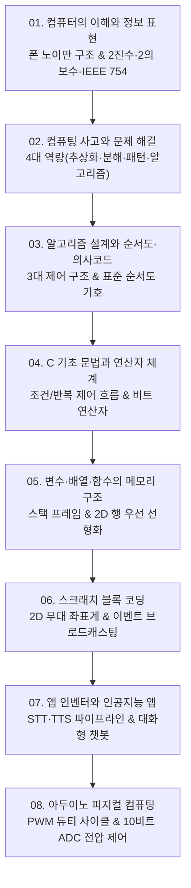

# 📚 코딩 기초 (Coding Basics) 전체 강의 로드맵

컴퓨터의 본질과 하드웨어·소프트웨어 아키텍처부터 2진 데이터 인코딩, 컴퓨팅 사고(CT), 순서도·의사코드 설계, C 언어 기초 문법 및 포인터 메모리 구조, 블록 코딩(Scratch), 모바일 AI(App Inventor), 그리고 아두이노(Arduino) 피지컬 컴퓨팅까지 완벽하게 총괄합니다.

---

## 🗺️ 강의 목차 (Curriculum Overview)

---

## 📑 개별 정리 문서 목록

1. [01. 컴퓨터의 이해와 정보 표현](file:///Users/um-yunsang/work/edu/ComputerScience/01_programming-foundations/coding-basics/notes/01.%20%EC%BB%B4%ED%93%A8%ED%84%B0%EC%9D%98%20%EC%9D%B4%ED%95%B4%EC%99%80%20%EC%A0%95%EB%B3%B4%20%ED%91%9C%ED%98%84.md)
   - 폰 노이만 아키텍처, 1940년대 진공관~현대 GUI 역사, 8비트 2의 보수 & IEEE 754 부동소수점 시뮬레이터
2. [02. 컴퓨팅 사고와 문제 해결](file:///Users/um-yunsang/work/edu/ComputerScience/01_programming-foundations/coding-basics/notes/02.%20%EC%BB%B4%ED%93%A8%ED%8C%85%20%EC%82%AC%EA%B3%A0%EC%99%80%20%EB%AC%B8%EC%A0%9C%20%ED%95%B4%EA%B2%B0.md)
   - Programmability의 본질, 캐시·버퍼·병렬처리 일상 비유 모델, CT 4대 축(추상화·분해·패턴·알고리즘) 분석기
3. [03. 알고리즘 설계와 순서도·의사코드](file:///Users/um-yunsang/work/edu/ComputerScience/01_programming-foundations/coding-basics/notes/03.%20%EC%95%8C%EA%B3%A0%EB%A6%AC%EC%A6%98%20%EC%84%A4%EA%B3%84%EC%99%80%20%EC%88%9C%EC%84%9C%EB%8F%84%C2%B7%EC%9D%98%EC%82%AC%EC%BD%94%EB%93%9C.md)
   - ANSI 표준 순서도 기호 체계, 순차·선택·반복 3대 구조, 1~N 누적합 실시간 트레이스 시뮬레이터
4. [04. C 기초 문법과 연산자 체계](file:///Users/um-yunsang/work/edu/ComputerScience/01_programming-foundations/coding-basics/notes/04.%20C%20%EA%B8%B0%EC%B4%88%20%EB%AC%B8%EB%B2%95%EA%B3%BC%20%EC%97%B0%EC%82%B0%EC%9E%90%20%EC%B2%B4%EA%B3%84.md)
   - 전위/후위 증감, 단축 평가, `for/while/do-while/switch`, 8비트 비트 연산자 비트맵 계산기
5. [05. 변수·배열·함수의 메모리 구조와 모듈화](file:///Users/um-yunsang/work/edu/ComputerScience/01_programming-foundations/coding-basics/notes/05.%20%EB%B3%80%EC%88%98%C2%B7%EB%B0%B0%EC%97%B4%C2%B7%ED%95%A8%EC%88%98%EC%9D%98%20%EB%A9%94%EB%AA%A8%EB%A6%AC%20%EA%B5%AC%EC%A1%B0%EC%99%80%20%EB%AA%A8%EB%93%88%ED%99%94.md)
   - 자료형 크기, Call-by-Value 스택 프레임, 2차원 배열 행 우선(Row-Major) 주소 계산 시뮬레이터
6. [06. 스크래치 블록 코딩과 이벤트 기반 프로그래밍](file:///Users/um-yunsang/work/edu/ComputerScience/01_programming-foundations/coding-basics/notes/06.%20%EC%8A%A4%ED%81%AC%EB%9E%98%EC%B9%98%20%EB%B8%94%EB%A1%9D%20%EC%BD%94%EB%94%A9%EA%B3%BC%20%EC%9D%B4%EB%B2%A4%ED%8A%B8%20%EA%B8%B0%EB%B0%98%20%ED%94%84%EB%A1%9C%EA%B7%B8%EB%9E%98%EB%ming.md)
   - 2D 무대 좌표계($480 \times 360$), 이벤트 브로드캐스팅, 실시간 캔버스 드로잉 시뮬레이터
7. [07. 앱 인벤터와 인공지능·음성인식 모바일 앱](file:///Users/um-yunsang/work/edu/ComputerScience/01_programming-foundations/coding-basics/notes/07.%20%EC%95%B1%20%EC%9D%B8%EB%B2%A4%ED%84%B0%EC%99%80%20%EC%9D%B8%EA%B3%B5%EC%A7%80%EB%8A%A5%C2%B7%EC%9D%8C%EC%84%B1%EC%9D%B8%EC%8B%9D%20%EB%AA%A8%EB%B0%94%EC%9D%BC%20%EC%95%B1.md)
   - SpeechRecognizer(STT) & TextToSpeech(TTS) 파이프라인, 대화형 AI 챗봇 시뮬레이터
8. [08. 아두이노 피지컬 컴퓨팅과 디지털·아날로그 IO](file:///Users/um-yunsang/work/edu/ComputerScience/01_programming-foundations/coding-basics/notes/08.%20%EC%95%84%EB%91%90%EC%9D%B4%EB%85%B8%20%ED%94%BC%EC%A7%80%EC%BB%AC%20%EC%BB%B4%ED%93%A8%ED%8C%85%EA%B3%BC%20%EB%94%94%EC%A7%80%ED%84%B8%C2%B7%EC%95%84%EB%82%A0%EB%A1%9C%EA%B7%B8%20IO.md)
   - ATmega328P 핀 아키텍처, 옴의 법칙 LED 저항 계산, 8비트 PWM LED & 10비트 ADC 가변저항 시뮬레이터
