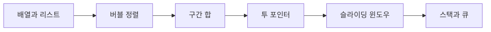

> [!abstract] 이 과목은
> 알고리즘 문제 풀이 정리. 강의자료 없이 문제 풀이 노트만 있다. 학기: extracurricular.

## 학습 경로

번호는 강의 진도 순이다. 앞 문서를 읽었다는 전제로 다음 문서가 쓰인다.

## 정리문서

모두 `notes/` 에 있다. 총 6편.

| 문서 | 다루는 내용 |
| :-- | :-- |
| [배열과 리스트](<./notes/1. 배열과 리스트.md>) | — |
| [버블 정렬](<./notes/1. 버블 정렬.md>) | — |
| [구간 합](<./notes/2. 구간 합.md>) | — |
| [투 포인터](<./notes/3. 투 포인터.md>) | — |
| [슬라이딩 윈도우](<./notes/4. 슬라이딩 윈도우.md>) | — |
| [스택과 큐](<./notes/5. 스택과 큐.md>) | — |

## 관련 과목

> [!note] 아직 비어 있다
> 다른 과목과의 관계는 지식그래프 4단계에서 관계 타입(`prerequisite` · `elaborates` · `contrasts` · `applies` · `evidences`)과 함께 채운다. 근거 없이 미리 이어두지 않는다.
