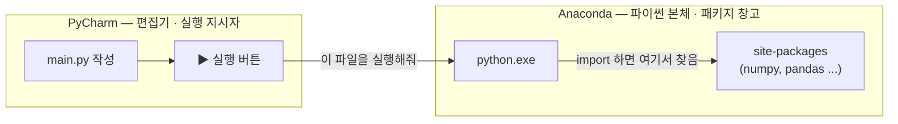
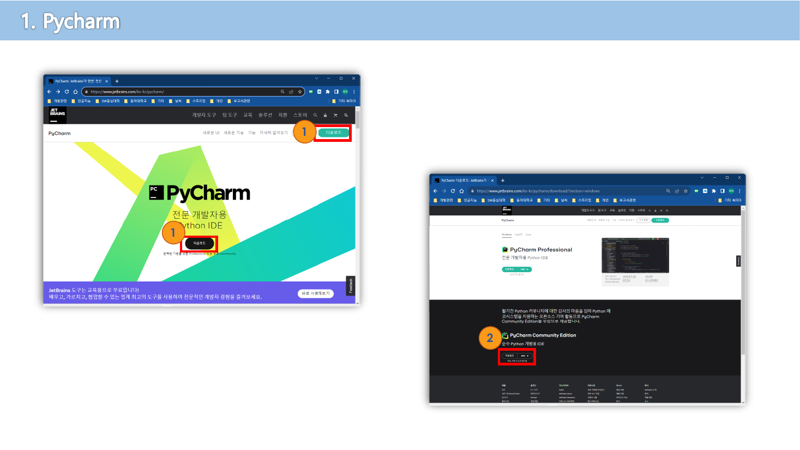
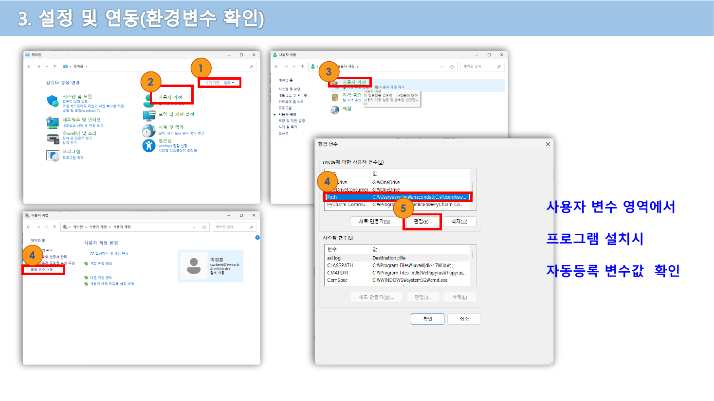
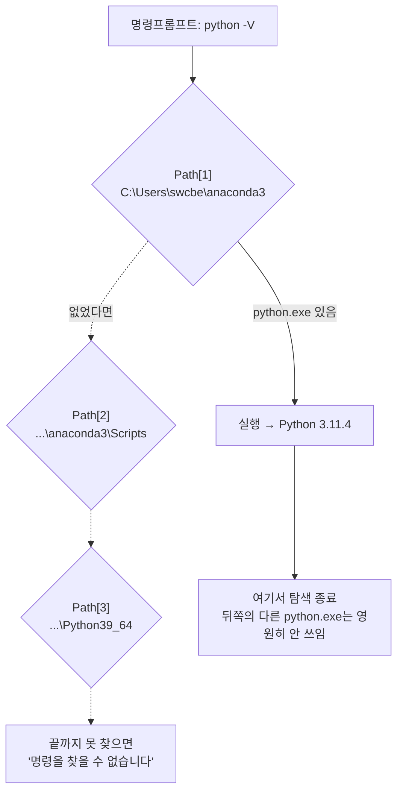
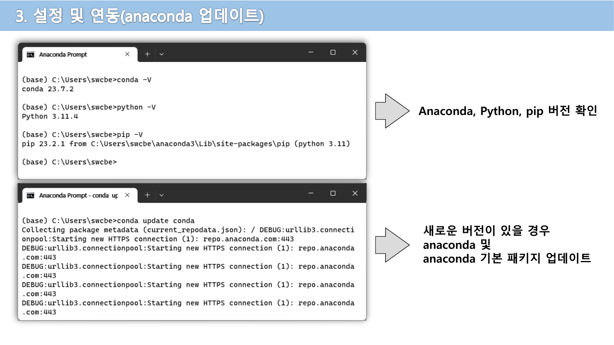
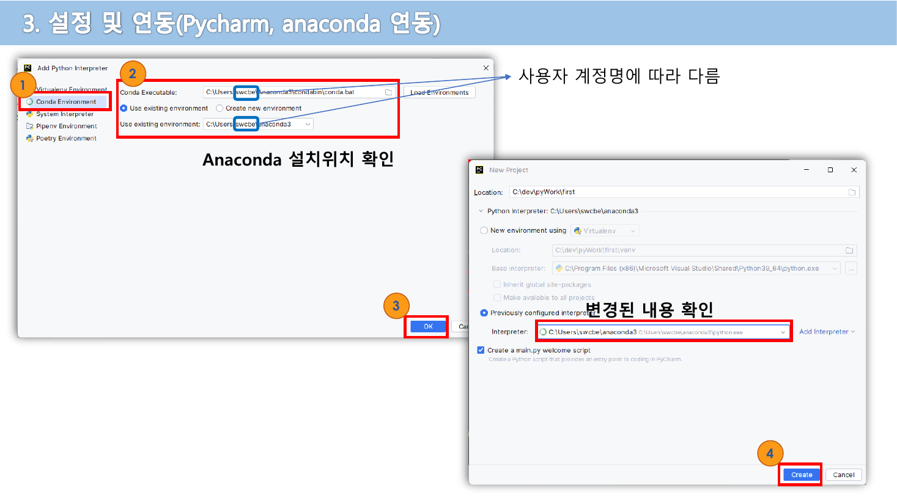
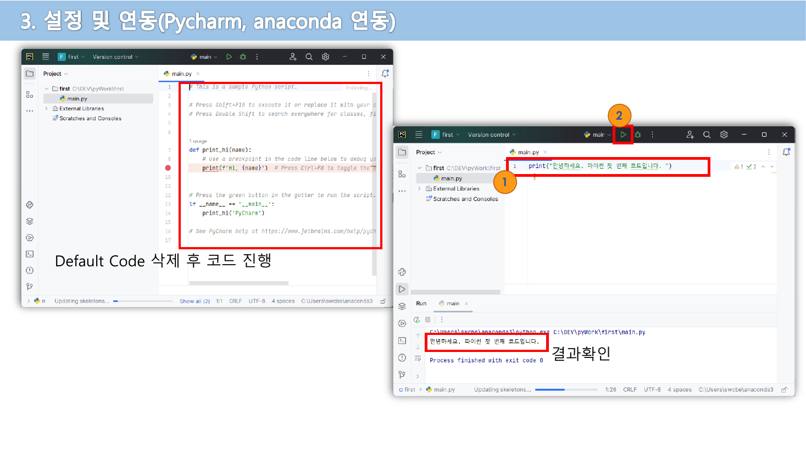
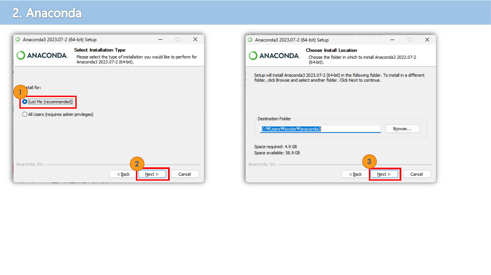

> [!abstract] 이 자료에는 설명이 거의 없다 — 화면만 19장 있다
> 1주차-2 자료는 19쪽 중 텍스트가 200자를 넘는 쪽이 **단 두 쪽**(5쪽·10쪽)뿐이고, 나머지는 전부 클릭 순서를 번호로 표시한 스크린샷이다. 세 쪽(3·7·9쪽)은 아예 글자가 0자다.
>
> 그래서 이 정리는 "무엇을 클릭하는가"를 옮겨 적지 않는다. 대신 19장이 **함께 가리키고 있는 하나의 값**을 추적한다 — 실행 버튼을 눌렀을 때 실제로 뜨는 `python.exe`의 경로다. 마지막 19쪽 실행 로그 한 줄이 그 답을 보여주고, 18쪽이 그 답이 틀어지는 지점을 보여준다.

읽기 전에 한 가지 짚어 둘 것이 있다.

> [!caution] 원본 오류 — 표지의 과목명이 다르다
> 1쪽 표지는 **"코딩 기초와 문제해결 / 1주차-2 : 개발 환경설정 (pycharm, anaconda)"** 이라고 적혀 있다. 그러나 2주차 이후 모든 자료의 표지는 **"데이터 구조"** 다. 같은 교수(박경훈)의 다른 과목 자료를 그대로 가져다 쓴 것으로 보인다. PDF 메타데이터의 생성 시각도 이 파일만 `2024-03-12`이고 나머지 주차 자료는 전부 다른 날짜다.
>
> 내용 자체는 어느 파이썬 과목에나 유효하므로 문제가 되지 않지만, 자료 목록에서 이 파일을 찾을 때 과목명으로 검색하면 걸리지 않는다.

---

## 1. 두 개의 프로그램이 나눠 갖는 역할

2쪽은 설치할 프로그램을 딱 둘만 적는다.

| 원본 2쪽 | 주소 |
| --- | --- |
| 1. Pycharm | `https://www.jetbrains.com/ko-kr/pycharm/` |
| 2. Anaconda | `https://www.anaconda.com/` |

둘 다 "파이썬을 쓰기 위한 것"이지만 하는 일이 겹치지 않는다. 이 구분을 먼저 세워두지 않으면 뒤의 17장이 그냥 클릭 나열로 보인다.



PyCharm은 **파이썬을 갖고 있지 않다.** 코드를 쓰는 창과, "이 파일을 저 실행 파일에게 넘겨라"라는 지시만 담당한다. 실제로 코드를 해석하고 돌리는 것은 Anaconda가 설치해 준 `python.exe`다.

그래서 19장의 설치 화면은 결국 두 질문에 답하는 과정이다.

1. `python.exe`를 **어디에** 놓을 것인가 (Anaconda 설치 화면들)
2. PyCharm에게 그 위치를 **어떻게 알려줄** 것인가 (18쪽 연동 화면)



원본 3쪽. 이 쪽은 `pdftotext` 기준 **0자**다. 오른쪽 화면의 ②가 가리키는 것은 **PyCharm Community Edition** — 유료판(Professional)이 아니라 무료판을 받는다는 지시다.

---

## 2. 설치 체크박스가 실제로 남기는 흔적

5쪽과 10쪽은 이 자료에서 유일하게 문장이 있는 두 쪽이다. 두 쪽 모두 설치 마법사의 체크박스 목록을 그대로 옮기고 각각에 한 줄 설명을 붙였다.

### PyCharm 쪽 (원본 5쪽)

| 체크박스 | 원본 설명 |
| --- | --- |
| Create Desktop Shortcut | 바탕화면에 PyCharm 바로가기 아이콘 생성 |
| Update Context Menu | 특정폴더 지정한 마우스 우 클릭 할 때 컨텍스트 메뉴 생성 |
| Create Associations | 확장자 `.py` 파일에 대한 pycharm ide와 연결 |
| Update PATH Variable(restart needed) | 명령프롬프트에서 Pycharm에 직접 접근할 수 있는 환경변수 자동지정 |

원본은 마지막에 한 줄을 덧붙인다 — **"해당 두 영역은 체크를 해 두는 것이 좋음."**

### Anaconda 쪽 (원본 10쪽)

| 체크박스 | 원본 설명 |
| --- | --- |
| Create start menu shortcuts | 시작메뉴에 바로가기 아이콘 생성 |
| Add Anaconda3 to my PATH environment variable | 명령프롬프트에서 anaconda를 직접 실행할 수 있도록 환경변수 자동 등록 |
| Register Anaconda3 as my default Python 3.11 | Anaconda를 기본 파이썬으로 설정 |
| Clear the package cache upon completion | 설치 완료 후 설치 때 생성된 패키지 캐쉬파일 모두 삭제 |

여기도 마지막 줄은 **"체크 해 주는 것이 좋음."**

네 개 중 둘(`Add ... to PATH`, `Register ... as my default Python`)은 성격이 다르다. 나머지 둘이 편의 기능인 데 반해, 이 둘은 **"이름만 불렀을 때 어느 프로그램이 응답하는가"** 를 바꾼다. 아래 인터랙티브로 각 항목이 어디에 흔적을 남기는지 갈라 보자.

```html preview
<div id="opt-root">
  <style>
    #opt-root{font-family:system-ui,-apple-system,"Segoe UI",sans-serif;color:var(--foreground);background:var(--card);
      border:1px solid var(--border);border-radius:10px;padding:16px}
    #opt-root h4{margin:0 0 4px;font-size:14px}
    #opt-root .sub{font-size:12px;opacity:.7;margin-bottom:12px}
    #opt-root .grid{display:grid;grid-template-columns:1fr;gap:8px}
    #opt-root label{display:flex;gap:10px;align-items:flex-start;padding:9px 11px;border:1px solid var(--border);
      border-radius:7px;cursor:pointer;font-size:13px;line-height:1.45}
    #opt-root label.on{border-color:var(--chart-1)}
    #opt-root .tag{font-size:10px;padding:1px 6px;border-radius:99px;border:1px solid var(--border);white-space:nowrap;opacity:.85}
    #opt-root .tag.deep{border-color:var(--chart-1);color:var(--chart-1)}
    #opt-root .out{margin-top:14px;border-top:1px dashed var(--border);padding-top:12px}
    #opt-root code{font-family:ui-monospace,SFMono-Regular,Menlo,monospace;font-size:12px;
      background:var(--muted,transparent);padding:1px 4px;border-radius:4px}
    #opt-root .line{font-family:ui-monospace,SFMono-Regular,Menlo,monospace;font-size:12px;
      padding:6px 8px;border-left:3px solid var(--chart-2);margin:6px 0;word-break:break-all}
    #opt-root .none{opacity:.55;font-size:12.5px}
  </style>
  <h4>설치 체크박스 → 시스템에 남는 흔적</h4>
  <div class="sub">원본 5쪽(PyCharm)·10쪽(Anaconda)의 8개 항목. 켜 보면 어느 것이 PATH를 건드리는지 갈린다.</div>
  <div class="grid" id="opt-list"></div>
  <div class="out">
    <div style="font-size:12px;opacity:.75;margin-bottom:6px">사용자 환경변수 <code>Path</code> 에 추가되는 항목</div>
    <div id="opt-path"></div>
    <div style="font-size:12px;opacity:.75;margin:10px 0 6px">그 밖의 흔적</div>
    <div id="opt-misc"></div>
  </div>
</div>
<script>
(function(){
  var OPTS=[
    {id:"pc-desk", app:"PyCharm",  t:"Create Desktop Shortcut", d:"바탕화면에 PyCharm 바로가기 아이콘 생성", deep:false, misc:"바탕화면에 .lnk 바로가기 파일 1개"},
    {id:"pc-ctx",  app:"PyCharm",  t:"Update Context Menu", d:"폴더 우클릭 시 컨텍스트 메뉴 생성", deep:false, misc:"탐색기 우클릭 메뉴 항목 등록"},
    {id:"pc-assoc",app:"PyCharm",  t:"Create Associations (.py)", d:".py 파일을 PyCharm과 연결", deep:false, misc:".py 더블클릭 시 PyCharm이 열림 — 실행이 아니라 편집"},
    {id:"pc-path", app:"PyCharm",  t:"Update PATH Variable", d:"명령프롬프트에서 PyCharm 직접 접근", deep:true,  path:"C:\\Program Files\\JetBrains\\PyCharm Community\\bin", misc:"재부팅 필요(restart needed)"},
    {id:"an-menu", app:"Anaconda", t:"Create start menu shortcuts", d:"시작메뉴 바로가기 생성", deep:false, misc:"Anaconda Prompt 검색으로 찾을 수 있게 됨(원본 13쪽)"},
    {id:"an-path", app:"Anaconda", t:"Add Anaconda3 to my PATH", d:"명령프롬프트에서 anaconda 직접 실행", deep:true, path:"C:\\Users\\swcbe\\anaconda3;C:\\Users\\swcbe\\anaconda3\\Scripts", misc:"conda·python·pip 이름이 전역에서 해석됨"},
    {id:"an-def",  app:"Anaconda", t:"Register Anaconda3 as my default Python 3.11", d:"Anaconda를 기본 파이썬으로 설정", deep:true, path:"(레지스트리 등록 — 다른 도구가 '기본 파이썬'을 물을 때 응답)", misc:"PyCharm이 인터프리터 후보를 자동 탐지할 때 잡히는 근거"},
    {id:"an-cache",app:"Anaconda", t:"Clear the package cache upon completion", d:"설치 때 생긴 패키지 캐시 삭제", deep:false, misc:"디스크 회수 — 원본 9쪽 기준 4.9GB 설치본에서 캐시분 정리"}
  ];
  var st={}; OPTS.forEach(function(o){ st[o.id]= (o.id==="pc-path"||o.id==="pc-assoc"||o.id!=="an-cache"); });
  var list=document.getElementById("opt-list");
  OPTS.forEach(function(o){
    var l=document.createElement("label");
    l.innerHTML='<input type="checkbox" '+(st[o.id]?"checked":"")+'>'+
      '<span><b>'+o.t+'</b><br><span style="opacity:.75">'+o.d+'</span></span>'+
      '<span class="tag '+(o.deep?"deep":"")+'" style="margin-left:auto">'+(o.deep?"이름 해석에 영향":o.app)+'</span>';
    l.querySelector("input").addEventListener("change",function(e){ st[o.id]=e.target.checked; l.classList.toggle("on",st[o.id]); render(); });
    l.classList.toggle("on",st[o.id]);
    list.appendChild(l);
  });
  function render(){
    var p=document.getElementById("opt-path"), m=document.getElementById("opt-misc");
    p.innerHTML=""; m.innerHTML="";
    var any=false;
    OPTS.forEach(function(o){
      if(st[o.id] && o.path){ any=true; var d=document.createElement("div"); d.className="line"; d.textContent=o.path; p.appendChild(d); }
    });
    if(!any){ p.innerHTML='<div class="none">추가되는 항목 없음 — 전체 경로를 매번 직접 입력해야 한다</div>'; }
    OPTS.forEach(function(o){
      if(st[o.id] && o.misc){ var d=document.createElement("div"); d.style.fontSize="12.5px"; d.style.margin="4px 0"; d.style.opacity=".9";
        d.textContent="· "+o.misc; m.appendChild(d); }
    });
    if(!m.children.length){ m.innerHTML='<div class="none">없음</div>'; }
  }
  render();
})();
</script>
```

> [!note] 보충 — 원본에 없는 설명
> Anaconda 배포판 자체는 설치 마법사에서 `Add Anaconda3 to my PATH environment variable` 항목에 "not recommended"라는 경고를 붙여 두고, 대신 시작메뉴의 **Anaconda Prompt** 를 쓰기를 권한다. 원본 10쪽은 반대로 "체크 해 주는 것이 좋음"이라고 적었다. 강의 목적(명령프롬프트에서 바로 `conda -V`를 쳐 보게 하는 것)에는 원본 쪽이 편하지만, 시스템에 다른 파이썬이 이미 있는 경우 충돌의 원인이 되기도 한다. 이 문단은 원본에 없는 보충이다.

---

## 3. PATH — 이름 하나로 프로그램을 찾아내는 규칙

12쪽은 설치가 끝난 뒤 **환경 변수 창을 열어 확인하는** 장면이다. 원본이 붙인 설명은 세 줄뿐이다 — "사용자 변수 영역에서 / 프로그램 설치시 / 자동등록 변수값 확인".



빨간 상자 안의 값이 `C:\Users\swcbe\anaconda3;C:\Users\sw...` 로 시작한다. 앞 절의 체크박스가 남긴 바로 그 흔적이다.

PATH가 하는 일은 단순하다. 명령프롬프트에 `python` 이라고 **이름만** 쳤을 때, 운영체제는 PATH에 적힌 폴더를 **왼쪽부터 차례로** 뒤져 `python.exe` 를 찾고, **처음 발견한 것을 실행한 뒤 탐색을 멈춘다.**



마지막 상자가 이 장의 핵심이다. **PATH는 목록이 아니라 우선순위다.** 컴퓨터에 파이썬이 셋 깔려 있어도 이름으로 부르면 언제나 하나만 응답한다. 뒤의 5절에서 이 성질이 정확히 문제를 일으킨다.

---

## 4. 세 줄로 하는 검증

14쪽은 Anaconda Prompt에서 명령 세 개를 쳐서 결과를 보여준다. 설치가 "됐는지"가 아니라 **"어느 것이 잡혔는지"** 를 확인하는 절차다.



원본 화면에 찍힌 값을 그대로 옮기면 이렇다.

| 명령 | 출력 | 이 줄이 확인해 주는 것 |
| --- | --- | --- |
| `conda -V` | `conda 23.7.2` | 패키지 관리자가 PATH에서 잡힌다 |
| `python -V` | `Python 3.11.4` | 이름 `python`이 Anaconda 쪽으로 해석된다 |
| `pip -V` | `pip 23.2.1 from C:\Users\swcbe\anaconda3\Lib\site-packages\pip (python 3.11)` | **경로까지 찍힌다** — 어느 파이썬에 딸린 pip인지 드러난다 |

세 줄 중 실질적인 정보는 세 번째다. `pip -V` 는 버전만이 아니라 **자기가 어느 `site-packages` 밑에 사는지** 를 함께 출력한다. 즉 `pip install` 로 받은 패키지가 어느 파이썬에서 `import` 되는지가 이 한 줄에 적혀 있다.

이어지는 14·15쪽은 갱신 명령들을 보여준다.

```text
conda update conda          # 패키지 관리자 자신을 갱신 (14쪽)
conda update python         # Anaconda 라이브러리의 Python 갱신 (15쪽)
python -m pip install --upgrade pip   # pip 갱신 (15쪽)
conda update --all          # 전체 갱신 (15쪽)
```

`python -m pip ...` 라는 형태에 주목할 만하다. `pip` 를 이름으로 부르지 않고 **"이 파이썬아, 네 안의 pip 모듈을 돌려라"** 라고 지시하는 방식이라, 3절의 PATH 우선순위 문제를 우회한다. 원본은 이 차이를 설명하지 않고 명령만 보여준다.

16쪽은 여기서 한 걸음 더 나간다.

> 본인이 자주 사용하는 패키지는 매번 프로젝트 생성시 마다 설치해야 하는 번거로움 발생 한다. … 아래 패키지들은 예시이고 본인의 상황에 맞게 설정하면 된다.
>
> Anaconda에서 제공하는 다운로드 기본 채널에 패키지가 존재하지 않는 경우 오류 발생 — `https://anaconda.org` 에서 해당 패키지 검색 후 공식문서에서 제시한 설치 과정에 따라 설치

**채널**이라는 개념이 여기서 딱 한 번 등장한다. `conda install` 은 아무 데서나 받아오는 것이 아니라 정해진 저장소 목록을 뒤지며, 거기 없으면 실패한다. `pip` 가 PyPI 하나만 보는 것과 다른 지점이다.

---

## 5. 함정은 18쪽에 있다

여기까지는 순조롭다. 명령프롬프트에서 `python` 은 Anaconda를 가리키고, 패키지도 거기 깔린다. 그런데 PyCharm은 **PATH를 쓰지 않는다.** 프로젝트마다 인터프리터를 따로 기억한다.



원본 18쪽 오른쪽 `New Project` 창을 자세히 보면, **서로 다른 파이썬 두 개가 한 화면에 있다.**

| 화면 속 항목 | 값 |
| --- | --- |
| `New environment using Virtualenv` → **Base interpreter** | `C:\Program Files (x86)\Microsoft Visual Studio\Shared\Python39_64\python.exe` |
| `Previously configured interpreter` → **Interpreter** | `C:\Users\swcbe\anaconda3` — `C:\Users\swcbe\anaconda3\python.exe` |

위쪽은 Visual Studio가 딸려 설치한 **Python 3.9**, 아래쪽은 방금 설치한 **Anaconda의 Python 3.11**이다. 원본이 빨간 상자와 "변경된 내용 확인"이라는 주석을 붙인 곳은 아래쪽이다. 즉 이 한 번의 선택이 앞의 열일곱 장을 유효하게 만든다.

아래 인터랙티브는 이 선택이 실제 실행 명령을 어떻게 바꾸는지 보여준다. 값은 모두 원본 14·18·19쪽 화면에서 그대로 가져왔다.

```html preview
<div id="itp-root">
  <style>
    #itp-root{font-family:system-ui,-apple-system,"Segoe UI",sans-serif;color:var(--foreground);background:var(--card);
      border:1px solid var(--border);border-radius:10px;padding:16px}
    #itp-root h4{margin:0 0 4px;font-size:14px}
    #itp-root .sub{font-size:12px;opacity:.7;margin-bottom:12px}
    #itp-root .pick{display:flex;gap:8px;flex-wrap:wrap;margin-bottom:14px}
    #itp-root button{font:inherit;font-size:12.5px;padding:7px 12px;border-radius:7px;cursor:pointer;
      border:1px solid var(--border);background:transparent;color:var(--foreground);text-align:left}
    #itp-root button.sel{border-color:var(--chart-1);color:var(--chart-1)}
    #itp-root .term{font-family:ui-monospace,SFMono-Regular,Menlo,monospace;font-size:12px;line-height:1.7;
      border:1px solid var(--border);border-radius:8px;padding:11px 13px;white-space:pre-wrap;word-break:break-all}
    #itp-root .k{color:var(--chart-1)}
    #itp-root .g{color:var(--chart-2)}
    #itp-root .warn{margin-top:11px;font-size:12.5px;line-height:1.6;border-left:3px solid var(--chart-3);padding-left:10px}
  </style>
  <h4>PyCharm ▶ 실행 버튼을 눌렀을 때 실제로 뜨는 명령</h4>
  <div class="sub">원본 18쪽에 함께 등장하는 두 인터프리터 중 무엇을 고르느냐에 따라 갈린다.</div>
  <div class="pick" id="itp-pick"></div>
  <div class="term" id="itp-term"></div>
  <div class="warn" id="itp-warn"></div>
</div>
<script>
(function(){
  var CASES=[
    {name:"Previously configured interpreter\n(anaconda3)",
     label:"anaconda3 (원본이 고른 쪽)",
     exe:"C:\\Users\\swcbe\\anaconda3\\python.exe",
     ver:"Python 3.11.4",
     pkg:"C:\\Users\\swcbe\\anaconda3\\Lib\\site-packages",
     warn:"명령프롬프트에서 <code>conda install</code> 로 받은 패키지가 그대로 <code>import</code> 된다. 14쪽의 <code>pip -V</code> 가 가리킨 site-packages와 같은 곳이다."},
    {name:"New environment using Virtualenv\n(Base: Python39_64)",
     label:"Visual Studio의 Python39_64",
     exe:"C:\\dev\\pyWork\\first\\venv\\Scripts\\python.exe",
     ver:"Python 3.9.x  (Base: C:\\Program Files (x86)\\Microsoft Visual Studio\\Shared\\Python39_64)",
     pkg:"C:\\dev\\pyWork\\first\\venv\\Lib\\site-packages  (비어 있음)",
     warn:"버전이 3.11이 아니라 3.9이고, site-packages도 프로젝트 안의 빈 폴더다. 앞의 17장에서 한 <b>모든 설치와 갱신이 이 프로젝트에는 반영되지 않는다.</b> 원본 18쪽이 이 값을 빨간 상자로 덮어 고쳐 놓은 이유다."}
  ];
  var cur=0;
  var pick=document.getElementById("itp-pick");
  CASES.forEach(function(c,i){
    var b=document.createElement("button"); b.textContent=c.label;
    b.addEventListener("click",function(){ cur=i; render(); });
    pick.appendChild(b);
  });
  function render(){
    Array.prototype.forEach.call(pick.children,function(b,i){ b.classList.toggle("sel",i===cur); });
    var c=CASES[cur];
    document.getElementById("itp-term").innerHTML =
      '<span class="g">Run:</span> <span class="k">'+c.exe+'</span> C:\\DEV\\pyWork\\first\\main.py\n'+
      '안녕하세요. 파이썬 첫 번째 코드입니다.\n'+
      '<span class="g">Process finished with exit code 0</span>\n\n'+
      '해석기 버전 : '+c.ver+'\n'+
      'import 대상 : '+c.pkg;
    document.getElementById("itp-warn").innerHTML=c.warn;
  }
  render();
})();
</script>
```

---

## 6. 19쪽 — 한 줄짜리 답

마지막 19쪽에서 원본은 기본 생성된 예제 코드를 지우고(`Default Code 삭제 후 코드 진행`) 한 줄만 남긴다.

```python
print("안녕하세요. 파이썬 첫 번째 코드입니다. ")
```



그리고 실행 창 맨 윗줄에 이렇게 찍힌다.

```text
C:\Users\swcbe\anaconda3\python.exe C:\DEV\pyWork\first\main.py
안녕하세요. 파이썬 첫 번째 코드입니다.

Process finished with exit code 0
```

`print` 한 줄이 중요한 게 아니다. **그 위의 경로가 `anaconda3\python.exe` 로 찍혔다는 사실**이 19장의 결론이다. 앞 절의 인터프리터를 잘못 골랐다면 이 자리에 `venv\Scripts\python.exe` 가 찍혔을 것이고, 겉보기 출력은 똑같았을 것이다. 그래서 이 확인은 출력이 아니라 **첫 줄**을 봐야 한다.

---

## 7. 설치 화면에 남는 값들

원본 곳곳의 화면에 찍힌 구체적인 값을 한자리에 모은다. 앞으로 자기 컴퓨터의 값과 비교할 기준선이 된다.

| 항목 | 원본 화면의 값 | 나온 쪽 |
| --- | --- | --- |
| Anaconda 설치 유형 | `Just Me (recommended)` | 9쪽 |
| Anaconda 설치 위치 | `C:\Users\swcbe\anaconda3` | 9쪽 |
| 필요 용량 / 남은 용량 | `4.9 GB` / `58.9 GB` | 9쪽 |
| conda 버전 | `23.7.2` | 14쪽 |
| Python 버전 | `3.11.4` | 14쪽 |
| pip 버전 | `23.2.1` | 14쪽 |
| 프로젝트 위치 | `C:\dev\pyWork\first` | 18쪽 |
| 실행된 인터프리터 | `C:\Users\swcbe\anaconda3\python.exe` | 19쪽 |



`Just Me` 를 고르면 설치 경로가 `C:\Program Files` 가 아니라 **사용자 폴더 밑**으로 잡힌다(원본 9쪽 오른쪽 화면). 관리자 권한이 없어도 되고, PATH도 시스템 변수가 아니라 **사용자 변수**에 등록된다 — 12쪽에서 "사용자 변수 영역에서 … 확인"이라고 적은 이유가 여기 있다. 원본은 이 인과를 설명하지 않지만, 두 화면을 나란히 놓으면 드러난다.

---

## 8. 재부팅이 두 번 언급되는 이유

원본은 재부팅을 두 번 짚는다.

- 6쪽 — "설치 후 바로 재부팅 해도 무방하지만, anaconda 설치 이후에 재부팅"
- 11쪽 — "체크를 모두 해제 하고 'Finish' 마침 / 설치 완료 후 재부팅 권장"

이유는 5쪽 체크박스 이름에 이미 적혀 있다. `Update PATH Variable(restart needed)` — **환경 변수는 프로그램이 시작할 때 한 번 읽힌다.** 이미 열려 있던 명령프롬프트나 탐색기는 갱신된 PATH를 모른다. 그래서 두 프로그램을 다 설치한 뒤 한 번에 재부팅하라는 것이다.

---

## 이 준비가 실제로 쓰이는 곳

이 과목의 나머지 자료는 전부 이 환경 위에서 돌아간다. 특히,

- 노드 클래스를 직접 정의하고 `None` 으로 끝을 표시하는 방식 — [02. 리스트](./02.%20%EB%A6%AC%EC%8A%A4%ED%8A%B8%20%E2%80%94%20%EB%81%9D%EC%9D%84%20%EC%96%B4%EB%96%BB%EA%B2%8C%20%ED%91%9C%EC%8B%9C%ED%95%A0%20%EA%B2%83%EC%9D%B8%EA%B0%80.md)
- 파이썬 `list` 자료형을 스택·큐로 그대로 쓰는 절 — [04. 스택](./04.%20%EC%8A%A4%ED%83%9D%20%E2%80%94%20%EC%B6%9C%EC%9E%85%EA%B5%AC%EA%B0%80%20%ED%95%98%EB%82%98%EB%9D%BC%EB%8A%94%20%EC%A0%9C%EC%95%BD%EC%9D%B4%20%EB%A7%8C%EB%93%9C%EB%8A%94%20%EA%B2%83.md)
- `collections` 패키지의 `deque` 를 불러 쓰는 절 — [06. 큐와 데크](./06.%20%ED%81%90%EC%99%80%20%EB%8D%B0%ED%81%AC%20%E2%80%94%20%EA%B5%90%EC%9E%AC%EA%B0%80%20%EA%B3%B5%EC%A7%9C%EB%9D%BC%20%ED%95%9C%20%EC%9E%90%EB%A6%AC%EB%A5%BC%20%EC%8B%A4%EC%8A%B5%EC%9D%80%20%EB%AC%B8%EC%A0%9C%EC%A0%90%EC%9D%B4%EB%9D%BC%20%EB%B6%80%EB%A5%B8%EB%8B%A4.md)

`collections` 는 표준 라이브러리라 별도 설치가 필요 없지만, 그것이 "어느 파이썬의 표준 라이브러리인가"는 여전히 이 장에서 정한 값에 달려 있다.

---

## 근거 자료

| 원본 쪽 | 내용 | 이 문서에서 쓰인 곳 |
| --- | --- | --- |
| 1 | 표지 (과목명 "코딩 기초와 문제해결") | 머리말 Callout |
| 2 | 설치할 두 프로그램과 주소 | 1절 |
| 3 · 4 | PyCharm 다운로드 (3쪽 텍스트 0자) | 1절 · 인용 |
| 5 | PyCharm 설치 옵션 4종 설명 | 2절 |
| 6 | 재부팅 시점 안내 | 8절 |
| 7 · 8 | Anaconda 다운로드 (7쪽 텍스트 0자) | — |
| 9 | 설치 유형·위치·용량 (텍스트 0자) | 7절 · 인용 |
| 10 | Anaconda 설치 옵션 4종 설명 | 2절 |
| 11 | 설치 마무리와 재부팅 권장 | 8절 |
| 12 | 사용자 변수 `Path` 확인 | 3절 · 인용 |
| 13 | Anaconda Prompt 검색·실행 | 2절 인터랙티브 |
| 14 | `conda -V` · `python -V` · `pip -V` / `conda update conda` | 4절 · 인용 |
| 15 | `conda update python` · `pip` 갱신 · `conda update --all` | 4절 |
| 16 | 패키지 사전 설치와 채널 오류 | 4절 |
| 17 | PyCharm 실행 및 작업공간 지정 | — |
| 18 | 인터프리터 연동 (두 파이썬이 한 화면에) | 5절 · 인용 |
| 19 | 첫 코드 실행과 결과 | 6절 · 인용 |

- 원본 파일: `sources/1주차_2.pdf` (19쪽, 2024-03-12 생성)
- 텍스트 0자 페이지: 3 · 7 · 9쪽 — 모두 스크린샷 전용 페이지이며, 손글씨 필기는 없었다
