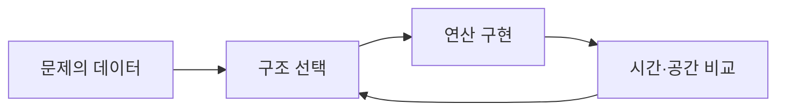

자료구조는 데이터를 메모리에 저장하고 탐색·접근·삽입·삭제·갱신을 효율적으로 수행하기 위한 설계다. 첫 자료는 PyCharm과 Anaconda 설치, PATH 설정, 재부팅 순서를 안내한다.

> [!NOTE]
> 설치 자료의 실제 체크 항목은 PyCharm·Anaconda의 바로가기와 PATH, 기본 Python 등록이다. 운영체제별 화면은 원본에서 직접 확인할 때만 적용한다.

---

## 1. 자료구조가 다루는 연산

| 연산 | 질문 |
| --- | --- |
| 탐색 | 원하는 항목이 어디 있는가? |
| 접근 | 항목의 값을 어떻게 읽는가? |
| 삽입·삭제 | 구조를 깨뜨리지 않고 추가·제거할 수 있는가? |
| 갱신 | 기존 값을 새 값으로 바꿀 수 있는가? |



<Tabs>
  <Tab label="PyCharm">IDE를 설치하고 프로젝트를 실행하는 개발 환경이다.</Tab>
  <Tab label="Anaconda">Python 3.11 등록과 패키지 환경을 관리한다.</Tab>
  <Tab label="검증">PATH와 기본 인터프리터가 의도한 환경을 가리키는지 확인한다.</Tab>
</Tabs>

```html preview
<div style="font-family:system-ui,sans-serif;padding:20px;color:var(--foreground)">
<label for="amt" style="font-size:14px;font-weight:600">1주차 자료</label>
<div id="out" style="font-size:30px;font-weight:700;color:var(--chart-1);margin:6px 0">1단계</div>
<input id="amt" type="range" min="1" max="3" step="1" value="1" style="width:100%;accent-color:var(--primary)" />
<p style="font-size:13px;color:var(--muted-foreground)">원본 주차 순서를 움직여 현재 자료의 핵심을 확인한다.</p>
<script>
var amt=document.getElementById('amt'); var out=document.getElementById('out');
amt.addEventListener('input',function(){out.textContent=Number(amt.value).toLocaleString()+'단계';});
</script>
</div>
```

<details>
<summary>설치 순서 점검</summary>

PyCharm 설치 옵션 선택 → Anaconda 설치 옵션 선택 → 두 프로그램 설치 완료 → Anaconda 이후 재부팅 → 사용자 변수에서 PATH 확인.

</details>

> [!WARNING]
> 환경변수 체크는 설치 화면의 선택 사항이다. 이미 관리되는 개발 환경에서는 기존 PATH를 덮어쓰지 않도록 현재 설정을 먼저 확인한다.

<!-- source: 1주차_2.pdf; setup sequence and data-structure operations preserved -->