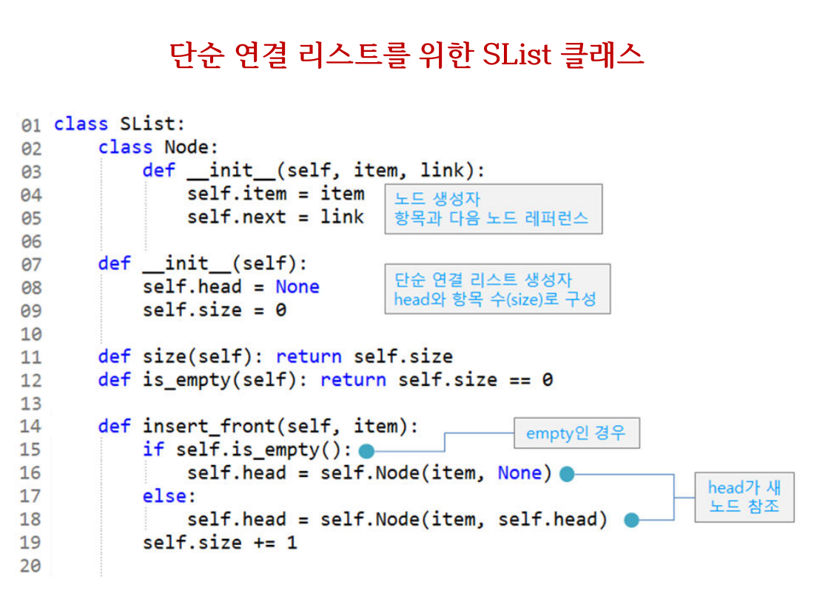
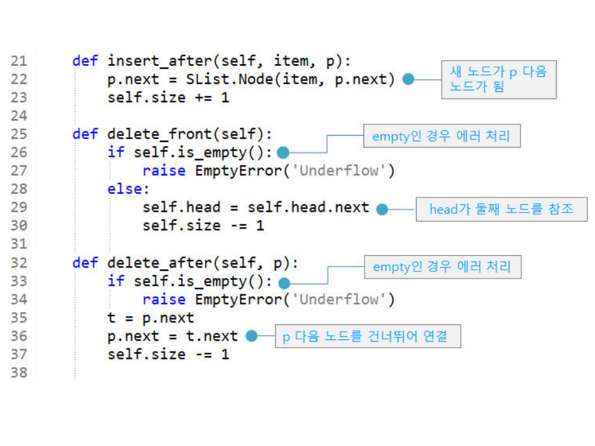
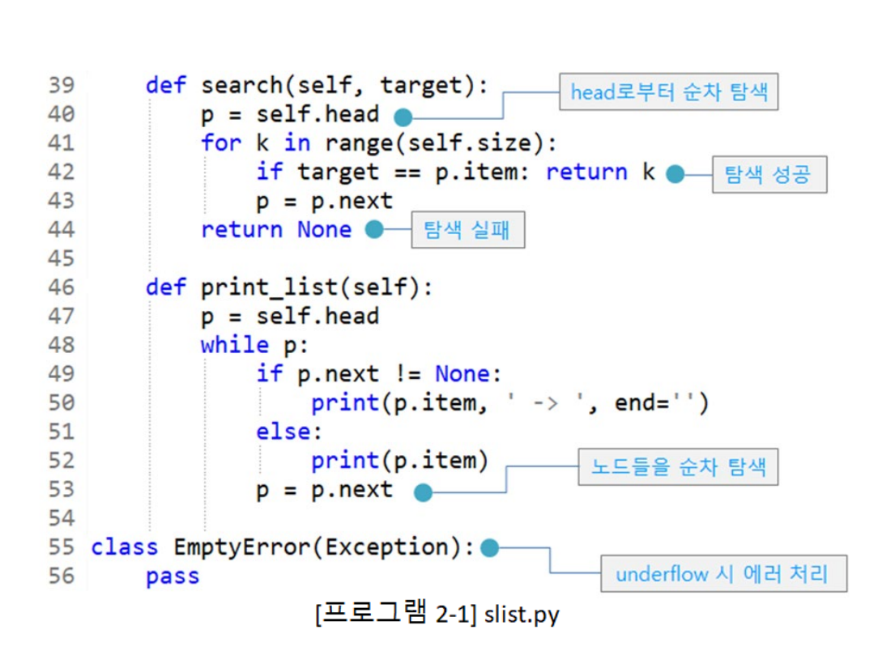
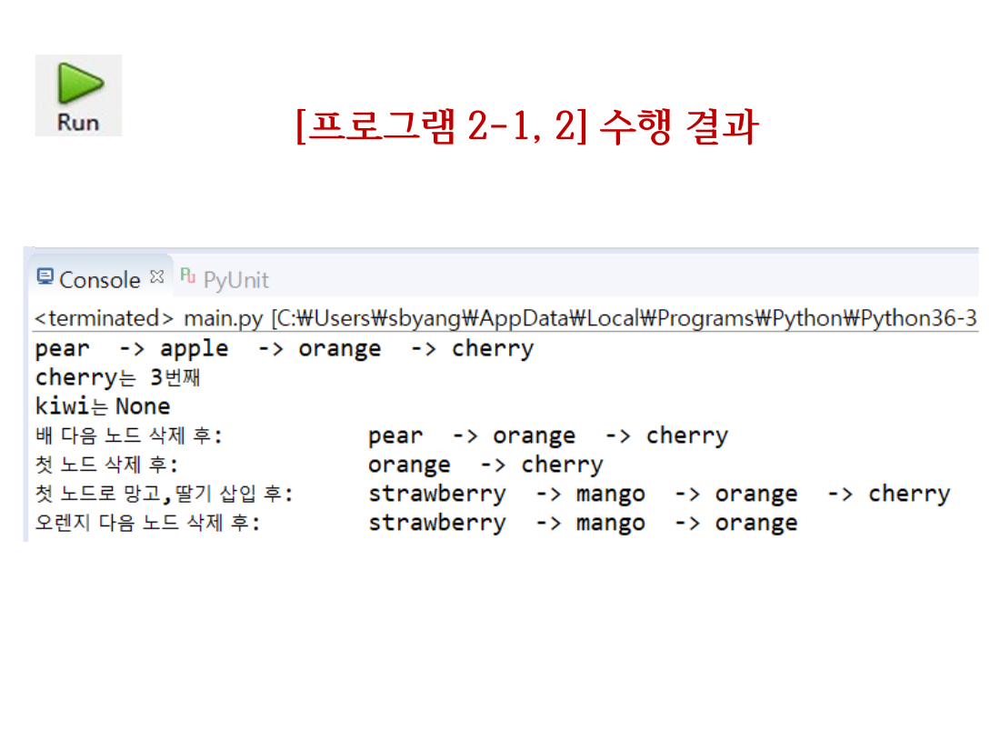
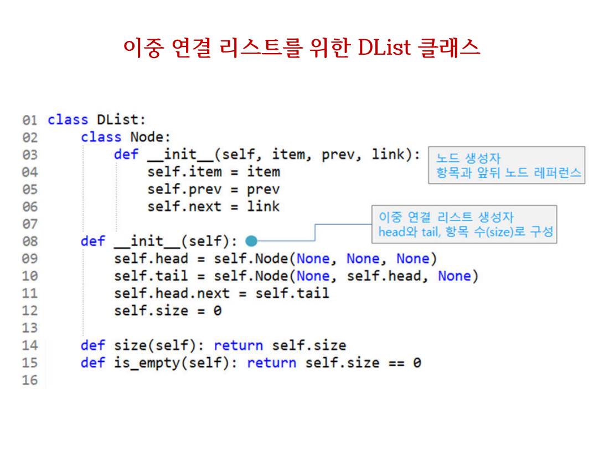
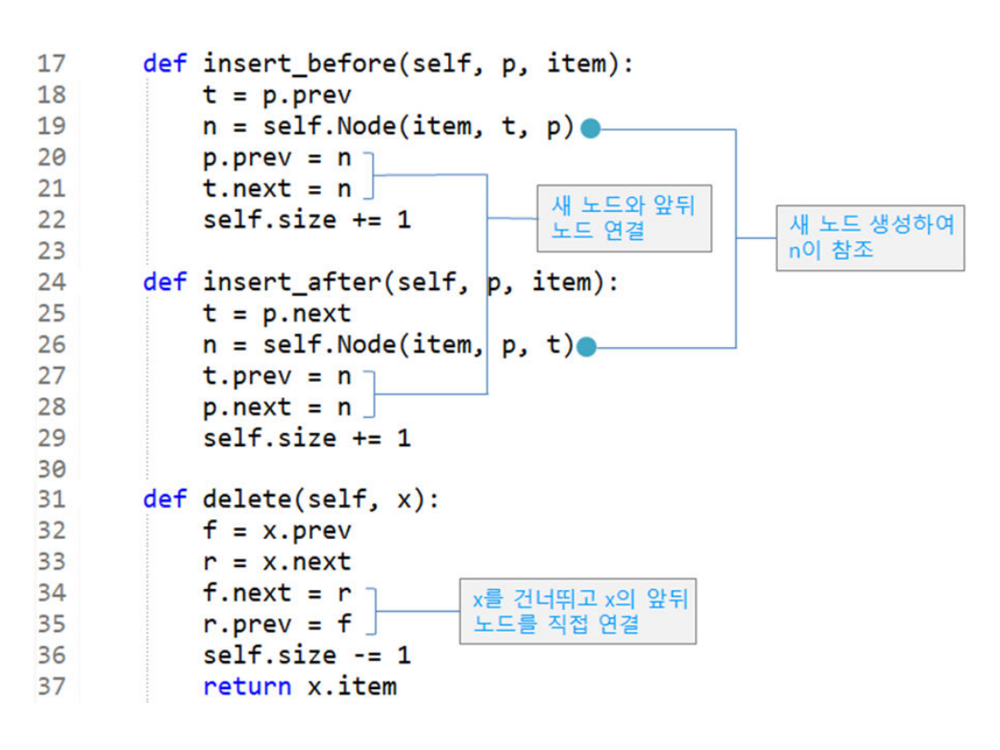
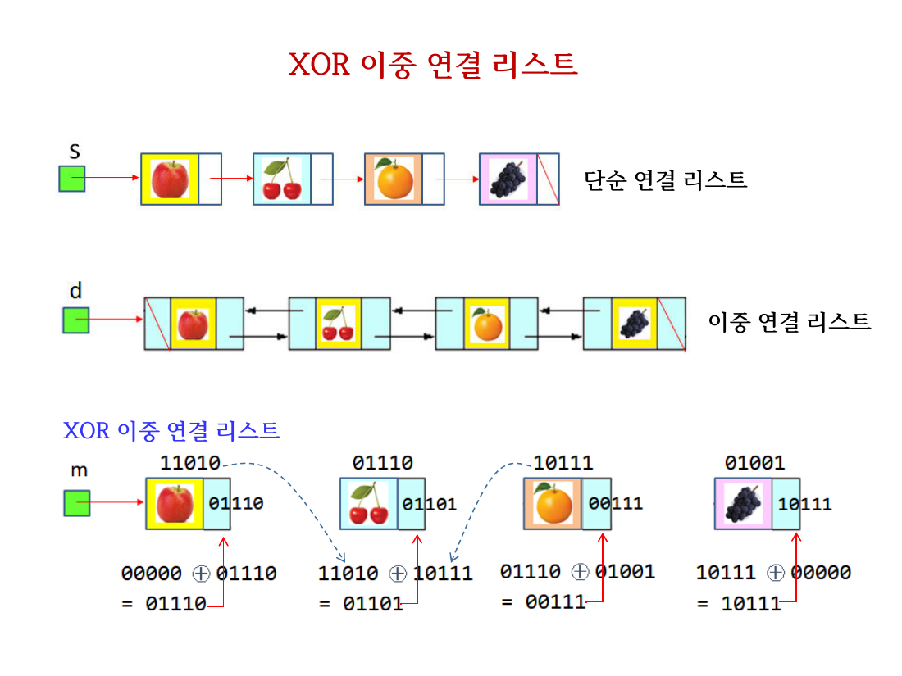
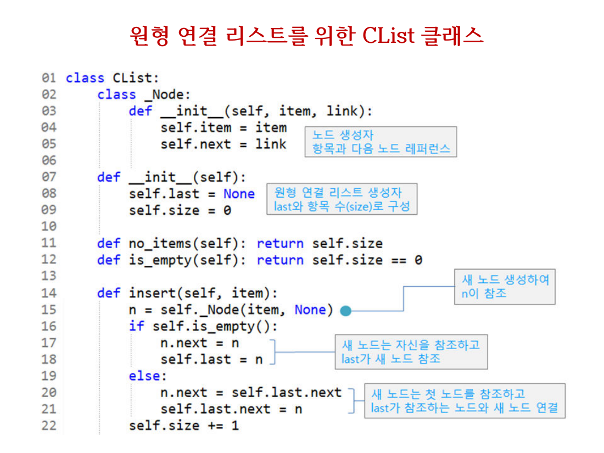
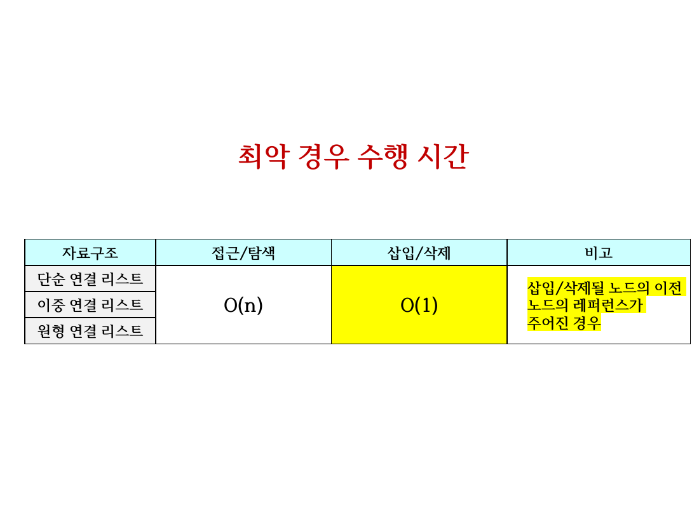
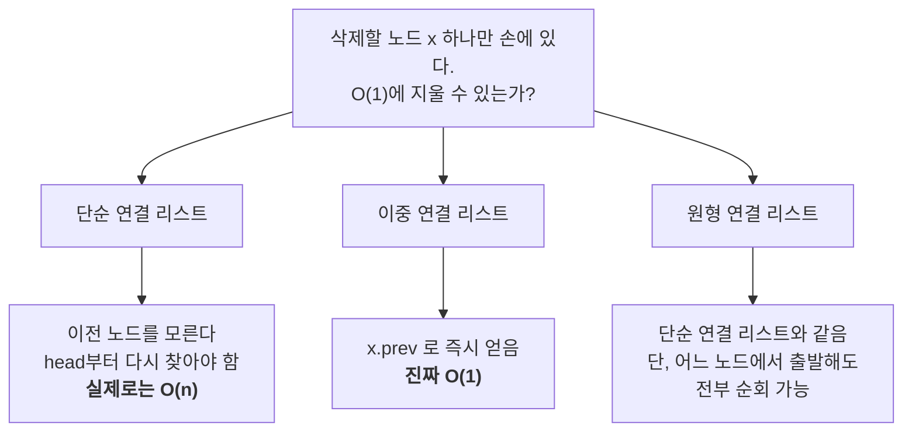

> [!abstract] 45쪽에서 진짜 내용이 있는 곳
> 이 자료는 교재 **Part 2 「리스트」** 를 그대로 옮긴 45쪽짜리다. 그런데 텍스트 밀도를 보면 이야기가 달라진다 — 45쪽 중 34쪽이 100자 미만이고, **7·8·19·34쪽은 0자**다. 그 네 쪽은 전부 **코드 화면 캡처**이고, 세 클래스(`SList`·`DList`·`CList`)의 핵심 메소드가 거기에 들어 있다. 슬라이드 문장만 읽으면 "삽입/삭제 O(1), 탐색 O(n)"이라는 결론만 남고 그 결론이 왜 성립하는지는 통째로 빠진다.
>
> 그래서 이 정리는 **코드 화면 네 쪽을 본문으로 끌어올려** 읽는다. 그리고 세 클래스를 나란히 놓았을 때 드러나는 하나의 질문을 척추로 삼는다 — **리스트의 끝을 무엇으로 표시하는가.**

---

## 1. 리스트라는 말이 가리키는 네 가지

3쪽의 정의는 아주 넓다.

> 일반적인 리스트(List)는 일련의 동일한 타입의 항목(item)들 나열된 것
>
> 예: 학생 명단, 시험 성적, 서점의 신간 서적, 상점의 판매 품목, 넷플리스 순위, 빌보드 차트, 버킷 리스트 등

그리고 곧바로 구현 네 가지를 나열한다 — **파이썬 리스트 / 단순 연결 리스트 / 이중 연결 리스트 / 원형 연결 리스트**. 나머지 42쪽은 뒤의 셋을 다룬다.

5쪽은 왜 파이썬 리스트로 만족하지 않는지를 세 문장으로 답한다.

| 원본 5쪽의 주장 | 무엇과 비교한 것인가 |
| --- | --- |
| 연결 리스트에서는 삽입이나 삭제 시 노드들의 **이동이 필요 없음** | 배열은 중간에 끼워 넣으면 뒤를 전부 민다 |
| 배열(자바, C, C++ 언어)의 경우 최초에 **크기를 예측**해야 하므로 대부분 빈 공간을 가지나, 연결 리스트는 빈 공간이 없음 | 정적 배열의 과다 할당 |
| 연결 리스트에서는 탐색하려면 **항상 첫 노드부터** 차례로 방문: 순차 탐색(Sequential Search) | 배열의 랜덤 접근 |

앞의 둘은 얻는 것, 마지막 하나는 잃는 것이다. 이 거래가 45쪽 내내 반복된다.

---

## 2. 세 클래스가 실제로 다른 지점

교재는 세 절을 따로 두고 각각 클래스를 하나씩 보여준다. 그런데 세 클래스의 코드를 **출력 메소드만 잘라 나란히 놓으면** 차이가 한눈에 드러난다.

```python
# SList.print_list  (원본 8쪽, 46~53행)
p = self.head
while p:                       # ← None을 만나면 끝
    ...
    p = p.next

# DList.print_list  (원본 20쪽, 39~49행)
p = self.head.next
while p != self.tail:          # ← 꼬리 더미 노드를 만나면 끝
    ...
    p = p.next

# CList.print_list  (원본 35쪽, 41~50행)
f = self.last.next
p = f
while p.next != f:             # ← 처음 그 자리로 돌아오면 끝
    ...
    p = p.next
```

세 줄의 `while` 조건이 이 장 전체다. 나머지 차이 — 노드에 레퍼런스가 몇 개인지, 더미 노드가 있는지, `head`를 쓰는지 `last`를 쓰는지 — 는 **전부 이 종료 조건을 성립시키기 위해 따라온 것**이다.

| | 단순 연결 리스트 `SList` | 이중 연결 리스트 `DList` | 원형 연결 리스트 `CList` |
| --- | --- | --- | --- |
| 노드의 레퍼런스 | `next` 1개 | `prev` · `next` 2개 | `next` 1개 |
| 리스트가 붙잡는 것 | `head` | `head` · `tail` (둘 다 더미) | `last` 1개 |
| 빈 리스트 | `head = None` | 더미 둘만 서로 연결 | `last = None` |
| **끝의 표시** | **`None`** | **더미 노드 `tail`** | **끝이 없음 — 한 바퀴** |
| 순회 시작점 | `head` | `head.next` | `last.next` |
| 조심할 것 | `None` 역참조 | 더미를 항목으로 착각 | **무한 루프** |

32쪽이 원형 리스트의 장점으로 든 문장 — *"리스트가 empty가 아니면 프로그램에서 None 조건을 검사하지 않아도 되는 장점"* — 과 바로 다음 문장 — *"무한 루프가 발생할 수 있음에 유의할 필요"* — 는 같은 결정의 앞뒷면이다. `None`을 없앤 대가로 멈출 근거도 함께 없앤 것이다.

아래 인터랙티브는 세 순회를 같은 데이터 위에서 나란히 돌린다. 항목은 원본 14쪽 실행 결과의 값을 그대로 썼다.

```html preview
<div id="lp-root">
  <style>
    #lp-root{font-family:system-ui,-apple-system,"Segoe UI",sans-serif;color:var(--foreground);background:var(--card);
      border:1px solid var(--border);border-radius:10px;padding:16px}
    #lp-root h4{margin:0 0 4px;font-size:14px}
    #lp-root .sub{font-size:12px;opacity:.7;margin-bottom:12px}
    #lp-root .bar{display:flex;gap:8px;flex-wrap:wrap;align-items:center;margin-bottom:14px}
    #lp-root button{font:inherit;font-size:12.5px;padding:6px 12px;border-radius:7px;cursor:pointer;
      border:1px solid var(--border);background:transparent;color:var(--foreground)}
    #lp-root button.sel{border-color:var(--chart-1);color:var(--chart-1)}
    #lp-root svg{width:100%;height:auto;display:block}
    #lp-root .code{font-family:ui-monospace,SFMono-Regular,Menlo,monospace;font-size:12px;line-height:1.65;
      border-left:3px solid var(--border);padding:6px 0 6px 10px;margin-top:12px;white-space:pre}
    #lp-root .code .hot{color:var(--chart-1);font-weight:600}
    #lp-root .say{font-size:12.5px;margin-top:10px;line-height:1.6;min-height:2.6em}
    #lp-root .out{font-family:ui-monospace,SFMono-Regular,Menlo,monospace;font-size:12.5px;margin-top:8px}
  </style>
  <h4>세 리스트의 순회 — 무엇을 보고 멈추는가</h4>
  <div class="sub">항목은 원본 14쪽 실행 결과의 <code>pear → apple → orange → cherry</code>. 단계 버튼으로 한 노드씩 진행한다.</div>
  <div class="bar">
    <span id="lp-kinds"></span>
    <button id="lp-step">▶ 한 단계</button>
    <button id="lp-reset">처음으로</button>
    <span id="lp-badge" style="font-size:12px;opacity:.75"></span>
  </div>
  <svg id="lp-svg" viewBox="0 0 700 150" role="img" aria-label="연결 리스트 순회 시각화"></svg>
  <div class="code" id="lp-code"></div>
  <div class="say" id="lp-say"></div>
  <div class="out" id="lp-out"></div>
</div>
<script>
(function(){
  var ITEMS=["pear","apple","orange","cherry"];
  var KINDS=[
    {k:"SList", label:"SList (None)", head:true, dummy:false, circ:false},
    {k:"DList", label:"DList (더미 tail)", head:true, dummy:true, circ:false},
    {k:"CList", label:"CList (한 바퀴)", head:false, dummy:false, circ:true}
  ];
  var cur=0, idx=0, done=false, out=[];
  var kb=document.getElementById("lp-kinds");
  KINDS.forEach(function(K,i){
    var b=document.createElement("button"); b.textContent=K.label; b.style.marginRight="6px";
    b.addEventListener("click",function(){ cur=i; reset(); }); kb.appendChild(b);
  });
  document.getElementById("lp-step").addEventListener("click",step);
  document.getElementById("lp-reset").addEventListener("click",reset);
  function reset(){ idx=0; done=false; out=[]; render(); }
  function step(){
    if(done){ return; }
    var K=KINDS[cur];
    if(idx<ITEMS.length){ out.push(ITEMS[idx]); idx++; }
    if(idx>=ITEMS.length){ done=true; }
    render();
  }
  function esc(s){ return s.replace(/&/g,"&amp;").replace(/</g,"&lt;"); }
  function render(){
    Array.prototype.forEach.call(kb.children,function(b,i){ b.classList.toggle("sel",i===cur); });
    var K=KINDS[cur];
    var svg=document.getElementById("lp-svg"), s="";
    var n=ITEMS.length, w=112, x0=40, y=54;
    // 노드 박스
    for(var i=0;i<n;i++){
      var x=x0+i*w, on=(i===idx-1);
      s+='<rect x="'+x+'" y="'+y+'" width="86" height="38" rx="6" fill="none" stroke="'+(on?"var(--chart-1)":"var(--border)")+'" stroke-width="'+(on?2.2:1.2)+'"/>';
      s+='<text x="'+(x+43)+'" y="'+(y+24)+'" text-anchor="middle" font-size="13" fill="'+(on?"var(--chart-1)":"var(--foreground)")+'">'+ITEMS[i]+'</text>';
      if(i<n-1){ s+='<path d="M'+(x+86)+' '+(y+19)+' L'+(x+w)+' '+(y+19)+'" stroke="var(--border)" stroke-width="1.4" marker-end="url(#lpar)"/>'; }
    }
    var lastX=x0+(n-1)*w;
    if(K.k==="SList"){
      s+='<text x="'+(lastX+108)+'" y="'+(y+24)+'" font-size="13" fill="var(--chart-3)">None</text>';
      s+='<path d="M'+(lastX+86)+' '+(y+19)+' L'+(lastX+100)+' '+(y+19)+'" stroke="var(--chart-3)" stroke-width="1.4" marker-end="url(#lpar3)"/>';
      s+='<text x="'+x0+'" y="'+(y-14)+'" font-size="12" fill="var(--chart-2)">head</text>';
    } else if(K.k==="DList"){
      s+='<rect x="'+(lastX+w)+'" y="'+y+'" width="60" height="38" rx="6" fill="none" stroke="var(--chart-3)" stroke-dasharray="4 3"/>';
      s+='<text x="'+(lastX+w+30)+'" y="'+(y+24)+'" text-anchor="middle" font-size="12" fill="var(--chart-3)">tail</text>';
      s+='<path d="M'+(lastX+86)+' '+(y+19)+' L'+(lastX+w)+' '+(y+19)+'" stroke="var(--border)" stroke-width="1.4" marker-end="url(#lpar)"/>';
      s+='<text x="'+x0+'" y="'+(y-14)+'" font-size="12" fill="var(--chart-2)">head.next</text>';
    } else {
      s+='<path d="M'+(lastX+86)+' '+(y+19)+' C '+(lastX+150)+' '+(y+90)+', '+(x0-70)+' '+(y+90)+', '+x0+' '+(y+30)+'" fill="none" stroke="var(--chart-2)" stroke-width="1.4" marker-end="url(#lpar2)"/>';
      s+='<text x="'+lastX+'" y="'+(y-14)+'" font-size="12" fill="var(--chart-2)">last</text>';
      s+='<text x="'+x0+'" y="'+(y-14)+'" font-size="12" fill="var(--chart-2)">last.next (= f)</text>';
    }
    s+='<defs>'+
       '<marker id="lpar" markerWidth="7" markerHeight="7" refX="6" refY="3" orient="auto"><path d="M0 0 L6 3 L0 6 z" fill="var(--border)"/></marker>'+
       '<marker id="lpar2" markerWidth="7" markerHeight="7" refX="6" refY="3" orient="auto"><path d="M0 0 L6 3 L0 6 z" fill="var(--chart-2)"/></marker>'+
       '<marker id="lpar3" markerWidth="7" markerHeight="7" refX="6" refY="3" orient="auto"><path d="M0 0 L6 3 L0 6 z" fill="var(--chart-3)"/></marker>'+
       '</defs>';
    svg.innerHTML=s;

    var codes={
      SList:["p = self.head","while p:","    print(p.item)","    p = p.next"],
      DList:["p = self.head.next","while p != self.tail:","    print(p.item)","    p = p.next"],
      CList:["f = self.last.next; p = f","while p.next != f:","    print(p.item)","    p = p.next"]
    };
    var hot = done?1:(idx===0?0:2);
    document.getElementById("lp-code").innerHTML = codes[K.k].map(function(l,i){
      return (i===hot? '<span class="hot">'+esc(l)+'</span>' : esc(l));
    }).join("\n");

    var say;
    if(idx===0){ say="시작점을 잡았다. "+(K.k==="SList"?"<code>head</code> 는 첫 항목 노드를 직접 가리킨다.":K.k==="DList"?"<code>head</code> 는 더미이므로 <code>head.next</code> 부터 시작한다.":"<code>last.next</code> 가 첫 항목이다. 이 자리를 <code>f</code> 로 기억해 둔다."); }
    else if(!done){ say="<b>"+ITEMS[idx-1]+"</b> 출력. 조건이 아직 참이므로 계속 간다."; }
    else { say = K.k==="SList" ? "마지막 노드의 <code>next</code> 가 <b>None</b> 이라 <code>while p:</code> 가 거짓이 되어 멈춘다."
          : K.k==="DList" ? "다음 노드가 더미 <b>tail</b> 과 같아져 멈춘다. 더미가 <code>None</code> 검사를 대신한 것이다."
          : "다음 노드가 시작점 <b>f</b> 와 같아져 멈춘다. <span style='color:var(--chart-3)'>이 비교를 빠뜨리면 영원히 돈다.</span>"; }
    document.getElementById("lp-say").innerHTML=say;
    document.getElementById("lp-out").textContent = out.length? "출력: "+out.join("  ->  ") : "";
    document.getElementById("lp-badge").textContent = done? "순회 종료 ("+out.length+"개)" : (idx+" / "+ITEMS.length);
  }
  reset();
})();
</script>
```

---

## 3. 단순 연결 리스트 — `None`이 끝이라는 약속

### 클래스 전문

원본 6·7·8쪽이 `slist.py` 전체(56행)를 세 장에 나눠 담고 있다. 6쪽만 제목이 있고 7·8쪽은 **텍스트가 0자**다.



```python
class SList:
    class Node:
        def __init__(self, item, link):
            self.item = item          # 노드 생성자: 항목과 다음 노드 레퍼런스
            self.next = link

    def __init__(self):
        self.head = None              # head와 항목 수(size)로 구성
        self.size = 0

    def size(self): return self.size
    def is_empty(self): return self.size == 0

    def insert_front(self, item):
        if self.is_empty():
            self.head = self.Node(item, None)
        else:
            self.head = self.Node(item, self.head)
        self.size += 1
```

이어지는 7쪽(0자)이 삽입·삭제 넷 중 셋을 담는다.



```python
    def insert_after(self, item, p):
        p.next = SList.Node(item, p.next)   # 새 노드가 p 다음 노드가 됨
        self.size += 1

    def delete_front(self):
        if self.is_empty():
            raise EmptyError('Underflow')   # empty인 경우 에러 처리
        else:
            self.head = self.head.next      # head가 둘째 노드를 참조
            self.size -= 1

    def delete_after(self, p):
        if self.is_empty():
            raise EmptyError('Underflow')
        t = p.next
        p.next = t.next                     # p 다음 노드를 건너뛰어 연결
        self.size -= 1
```

그리고 8쪽(0자)이 탐색과 출력이다.



```python
    def search(self, target):
        p = self.head
        for k in range(self.size):
            if target == p.item: return k   # 탐색 성공
            p = p.next
        return None                         # 탐색 실패

    def print_list(self):
        p = self.head
        while p:
            if p.next != None:
                print(p.item, ' -> ', end='')
            else:
                print(p.item)
            p = p.next

class EmptyError(Exception):
    pass
```

### 코드에서 걸리는 두 곳

> [!caution] 원본 오류 ① — `delete_after`의 방어가 엉뚱한 곳을 막는다
> `delete_after(p)` 가 검사하는 것은 `self.is_empty()` 다. 그러나 이 메소드가 실제로 터지는 상황은 **리스트가 비었을 때가 아니라 `p`가 마지막 노드일 때**다. 그때 `t = p.next` 가 `None` 이 되고, 다음 줄 `p.next = t.next` 에서 `None.next` 를 읽어 `AttributeError` 가 난다.
>
> 필요한 검사는 `if p.next is None: raise ...` 다. 같은 자료 12쪽의 [그림 2-5]는 `p` 뒤에 노드 `t`가 **반드시 있는** 그림만 그려 두어 이 경우를 보여주지 않는다.
>
> 13쪽 `main.py` 가 이 버그를 밟지 않는 이유는 우연이다 — 두 번의 호출 `s.delete_after(s.head)` 와 `s.delete_after(s.head.next.next)` 모두 뒤에 노드가 남아 있는 위치를 골랐다.

같은 클래스에 하나 더 있다.

> [!note] 원본 오류 ② — `insert_front`의 분기는 두 갈래가 같은 일을 한다
>
> ```python
> if self.is_empty():
>     self.head = self.Node(item, None)
> else:
>     self.head = self.Node(item, self.head)
> ```
>
> 리스트가 비어 있으면 `self.head` 는 이미 `None` 이다. 따라서 `self.Node(item, self.head)` 한 줄이 두 경우를 모두 처리한다. 틀린 코드는 아니지만, **`None` 을 특별한 값으로 취급해야 한다는 인상**을 준다는 점에서 이 장의 주제와 어긋난다. `None` 이 "끝"을 뜻한다는 약속을 지키면 분기가 사라진다.

또 하나 눈에 띄는 것은 같은 클래스 안에서 노드를 만드는 표기가 두 가지라는 점이다 — `insert_front` 는 `self.Node(...)`, `insert_after` 는 `SList.Node(...)`. 동작은 같다.

### 실행 결과로 확인하기

13쪽 `main.py` 와 14쪽 콘솔 출력은 위 코드가 실제로 어떻게 도는지를 끝까지 보여준다. 각 줄을 손으로 따라가 보면 전부 맞는다.



| main.py 호출 | 결과 리스트 | 원본 출력 |
| --- | --- | --- |
| `insert_front('orange')` | `orange` | |
| `insert_front('apple')` | `apple → orange` | |
| `insert_after('cherry', s.head.next)` | `apple → orange → cherry` | |
| `insert_front('pear')` | `pear → apple → orange → cherry` | `pear -> apple -> orange -> cherry` |
| `search('cherry')` | 인덱스 3 | `cherry는 3번째` |
| `search('kiwi')` | 없음 | `kiwi는 None` |
| `delete_after(s.head)` | `pear → orange → cherry` | `배 다음 노드 삭제 후: pear -> orange -> cherry` |
| `delete_front()` | `orange → cherry` | `첫 노드 삭제 후: orange -> cherry` |
| `insert_front('mango')`, `insert_front('strawberry')` | `strawberry → mango → orange → cherry` | `첫 노드로 망고,딸기 삽입 후: …` |
| `delete_after(s.head.next.next)` | `strawberry → mango → orange` | `오렌지 다음 노드 삭제 후: …` |

> [!tip] `cherry는 3번째` 를 어떻게 읽을 것인가
> `search` 는 0부터 세는 **인덱스**를 돌려준다. cherry는 `pear · apple · orange · cherry` 중 네 번째 항목이지만 인덱스는 3이다. 원본은 이 값을 `'cherry는 %d번째'` 라는 서식에 그대로 꽂았다. 코드가 틀린 것은 아니고, **한국어 "번째"와 0-기반 인덱스가 어긋난** 표현이다.
>
> 덧붙여, 14쪽 콘솔 맨 윗줄은 `main.py [C:\Users\sbyang\AppData\Local\Programs\Python\Python36-32\python.exe]` 다. 교재 저자가 **Python 3.6**에서 돌린 화면이며, 이 강의가 [01장](./01.%20%EA%B0%9C%EB%B0%9C%20%ED%99%98%EA%B2%BD%20%E2%80%94%20%EC%96%B4%EB%8A%90%20python.exe%EA%B0%80%20%EC%8B%A4%ED%96%89%EB%90%98%EB%8A%94%EA%B0%80.md)에서 맞춘 Anaconda Python 3.11과는 다른 인터프리터다.

15쪽이 정리하는 수행 시간은 이렇다.

- `search()` — 첫 노드부터 순차적 방문: **O(n)**
- 삽입/삭제 — 각각 O(1)개의 레퍼런스 갱신: **O(1)**
- 단, `insert()` 나 `delete()` 에 **이전 노드 `p`의 레퍼런스가 주어지지 않으면** head부터 `p`를 찾아야 하므로 O(n)

마지막 단서가 44쪽 표의 노란색 "비고" 칸과 정확히 같은 내용이다. 7절에서 다시 본다.

16쪽은 응용을 늘어놓는다 — 스택과 큐(Part 3), 해싱의 체이닝(Part 6), 트리(Part 4), 그래프의 인접 리스트, 매우 큰 수의 산술 연산, **비트코인의 블록체인**.

---

## 4. 이중 연결 리스트 — 더미 두 개를 세워 두는 이유

17쪽의 정의는 짧다. 이중 연결 리스트는 각 노드가 레퍼런스 2개를 가지고 이전·다음 노드를 가리킨다. 그리고 왜 그렇게 하는지도 한 문장으로 답한다.

> 단순 연결 리스트는 삽입이나 삭제할 때 **이전 노드를 가리키는 레퍼런스를 알아야 하고**, 역방향으로는 탐색할 수 없음

3절의 `delete_after(p)` 가 `p` 를 요구했던 이유가 이것이다. 대가도 명시한다 — *"노드마다 추가 메모리 사용"*.



```python
class DList:
    class Node:
        def __init__(self, item, prev, link):
            self.item = item
            self.prev = prev
            self.next = link

    def __init__(self):
        self.head = self.Node(None, None, None)
        self.tail = self.Node(None, self.head, None)
        self.head.next = self.tail
        self.size = 0
```

여기서 만들어진 두 노드는 **항목이 없다**. `item` 이 `None` 이고 리스트 길이에도 세지 않는다. 21쪽 [그림 2-8]이 이 세 줄을 ①②로 표시해 보여준다 — ① `tail` 을 만들면서 그 `prev` 를 `head` 로, ② 그다음 `head.next` 를 `tail` 로.

빈 리스트인데도 노드가 둘 있다는 것이 낭비처럼 보이지만, 이 둘 덕분에 **모든 항목 노드는 앞뒤에 반드시 이웃이 있다**. 그래서 삽입·삭제 코드에 `None` 검사가 한 줄도 없다.



```python
    def insert_before(self, p, item):
        t = p.prev
        n = self.Node(item, t, p)     # 새 노드 생성하여 n이 참조
        p.prev = n
        t.next = n                    # 새 노드와 앞뒤 노드 연결
        self.size += 1

    def insert_after(self, p, item):
        t = p.next
        n = self.Node(item, p, t)
        t.prev = n
        p.next = n
        self.size += 1

    def delete(self, x):
        f = x.prev
        r = x.next
        f.next = r                    # x를 건너뛰고 x의 앞뒤 노드를 직접 연결
        r.prev = f
        self.size -= 1
        return x.item
```

`delete(x)` 가 **삭제할 노드 자신** 하나만 받는다는 점이 단순 연결 리스트와 결정적으로 다르다. 이전 노드를 몰라도 `x.prev` 로 찾을 수 있기 때문이다. 이것이 27쪽의 결론과 [중간고사 예상문제 5번](#8-중간고사-예상문제와-맞춰-보기)의 답이 되는 성질이다.

> [!caution] 원본 불일치 — 같은 세 줄이 두 쪽에서 다르게 적혀 있다
> 18쪽 [프로그램 2-3]은 `self.head` · `self.tail` · `self.Node` 로 쓰고, 21쪽 [그림 2-8]의 코드 발췌는 **같은 09~11행**을 `self._head` · `self._tail` · `self._Node` 로 쓴다. 밑줄 하나 차이지만 파이썬에서는 다른 이름이다. 33쪽 `CList` 는 또 클래스 이름을 `_Node` 로 선언한다(`class _Node:`).
>
> 원서 코드가 밑줄 접두를 쓰고 슬라이드로 옮기면서 일부만 지운 것으로 보인다. 셋 중 어느 쪽을 따라도 되지만 **한 파일 안에서는 섞으면 안 된다.**

표기만의 문제가 아닌 것도 있다.

> [!caution] 원본 오류 — `DList.delete()` 에는 underflow 검사가 없다
> `SList.delete_front` 와 `delete_after` 는 모두 `if self.is_empty(): raise EmptyError('Underflow')` 로 시작한다. 그런데 `DList.delete(x)` 에는 그 줄이 없다. 20쪽 끝에 `class EmptyError(Exception)` 를 정의해 두고도 `DList` 안에서는 **한 번도 `raise` 하지 않는다.**
>
> 빈 리스트에서 `delete(d.head.next)` 를 부르면 `x` 가 더미 `tail` 이 되어, 예외 대신 **두 더미의 연결이 조용히 망가진다.** 26쪽 실행 결과가 마지막에 `리스트 비어있음` 을 출력하는 것은 `print_list` 쪽의 `is_empty()` 검사 덕분이지 `delete` 가 막아 준 것이 아니다.

또 하나 — **인자 순서가 `SList` 와 반대다.**

| | 시그니처 |
| --- | --- |
| `SList.insert_after` | `(self, item, p)` — 항목이 먼저 |
| `DList.insert_after` | `(self, p, item)` — 위치가 먼저 |

같은 이름의 메소드를 두 클래스에서 옮겨 다니며 쓸 때 실수하기 딱 좋은 지점이다.

27쪽의 수행 시간은 예상대로다 — 삽입/삭제 **O(1)**, 탐색은 head 또는 tail로부터 **O(n)**. 그리고 28쪽의 응용 목록에 이 자료구조의 성격이 잘 드러난다.

> 텍스트 편집기 undo/redo · 웹페이지 이동 · **데크 자료구조** · 사진 슬라이드쇼 · 뮤직 플레이어 · 운영체제의 스레드 스케줄러 · 이항 힙(Binomial Heap)이나 피보나치 힙(Fibonacci Heap)

앞의 다섯은 전부 **"앞으로 갔다가 뒤로 돌아오는"** 동작이다. 데크는 [06장](./06.%20%ED%81%90%EC%99%80%20%EB%8D%B0%ED%81%AC%20%E2%80%94%20%EA%B5%90%EC%9E%AC%EA%B0%80%20%EA%B3%B5%EC%A7%9C%EB%9D%BC%20%ED%95%9C%20%EC%9E%90%EB%A6%AC%EB%A5%BC%20%EC%8B%A4%EC%8A%B5%EC%9D%80%20%EB%AC%B8%EC%A0%9C%EC%A0%90%EC%9D%B4%EB%9D%BC%20%EB%B6%80%EB%A5%B8%EB%8B%A4.md)에서 다시 만난다.

---

## 5. XOR 이중 연결 리스트 — 레퍼런스 하나로 양방향

29·30쪽은 교재의 곁가지지만 이 장에서 가장 밀도 높은 두 쪽이다. 텍스트는 각각 34자·18자뿐이고 내용은 전부 그림 안에 있다.



발상은 이렇다. 이중 연결 리스트는 노드마다 레퍼런스를 두 개 쓴다. 그런데 **`prev ⊕ next` 하나만 저장해도** 양방향으로 다닐 수 있다 — 어디서 왔는지만 알면, XOR의 성질 $(a \oplus b) \oplus a = b$ 로 나머지 한쪽이 복원되기 때문이다.

원본이 쓴 네 노드의 주소와 저장값은 이렇다(전부 5비트).

| 노드 | 주소 | 저장하는 값 | 계산 |
| --- | --- | --- | --- |
| apple | `11010` | `01110` | `00000 ⊕ 01110` |
| cherry | `01110` | `01101` | `11010 ⊕ 10111` |
| orange | `10111` | `00111` | `01110 ⊕ 01001` |
| grape | `01001` | `10111` | `10111 ⊕ 00000` |

네 줄 모두 직접 계산해 원본 그림과 대조했고 전부 일치한다. 양 끝의 `00000` 은 "없는 이웃"을 뜻한다.

아래에서 실제로 걸어 볼 수 있다. 30쪽의 순방향·역방향 두 줄이 이 하나의 규칙으로 설명된다.

```html preview
<div id="xr-root">
  <style>
    #xr-root{font-family:system-ui,-apple-system,"Segoe UI",sans-serif;color:var(--foreground);background:var(--card);
      border:1px solid var(--border);border-radius:10px;padding:16px}
    #xr-root h4{margin:0 0 4px;font-size:14px}
    #xr-root .sub{font-size:12px;opacity:.7;margin-bottom:12px}
    #xr-root .bar{display:flex;gap:8px;flex-wrap:wrap;margin-bottom:14px;align-items:center}
    #xr-root button{font:inherit;font-size:12.5px;padding:6px 12px;border-radius:7px;cursor:pointer;
      border:1px solid var(--border);background:transparent;color:var(--foreground)}
    #xr-root button.sel{border-color:var(--chart-1);color:var(--chart-1)}
    #xr-root button:disabled{opacity:.4;cursor:default}
    #xr-root table{width:100%;border-collapse:collapse;font-size:12.5px}
    #xr-root th,#xr-root td{border:1px solid var(--border);padding:6px 8px;text-align:center}
    #xr-root th{font-weight:600;opacity:.85}
    #xr-root td.mono,#xr-root th.mono{font-family:ui-monospace,SFMono-Regular,Menlo,monospace}
    #xr-root tr.here td{border-color:var(--chart-1);color:var(--chart-1)}
    #xr-root .calc{font-family:ui-monospace,SFMono-Regular,Menlo,monospace;font-size:13px;margin-top:13px;
      border-left:3px solid var(--chart-2);padding:8px 0 8px 11px;line-height:1.75;white-space:pre-wrap}
    #xr-root .note{font-size:12.5px;opacity:.85;margin-top:9px;line-height:1.6}
  </style>
  <h4>XOR 이중 연결 리스트 순회기</h4>
  <div class="sub">원본 29·30쪽의 주소값 그대로. 이전 노드 주소와 현재 노드의 저장값을 XOR 하면 다음 노드가 나온다.</div>
  <div class="bar">
    <button id="xr-fwd" class="sel">순방향</button>
    <button id="xr-bwd">역방향</button>
    <button id="xr-step">▶ 한 걸음</button>
    <button id="xr-reset">처음으로</button>
  </div>
  <table>
    <thead><tr><th>노드</th><th class="mono">주소</th><th class="mono">저장값 (prev ⊕ next)</th></tr></thead>
    <tbody id="xr-body"></tbody>
  </table>
  <div class="calc" id="xr-calc"></div>
  <div class="note" id="xr-note"></div>
</div>
<script>
(function(){
  var N=[
    {n:"apple", a:0b11010},
    {n:"cherry",a:0b01110},
    {n:"orange",a:0b10111},
    {n:"grape", a:0b01001}
  ];
  function b(x){ var s=x.toString(2); while(s.length<5) s="0"+s; return s; }
  N.forEach(function(o,i){
    var p = i>0? N[i-1].a : 0;
    var q = i<N.length-1? N[i+1].a : 0;
    o.v = p ^ q;
  });
  var fwd=true, pos=0, prev=0, log=[];
  var bF=document.getElementById("xr-fwd"), bB=document.getElementById("xr-bwd");
  bF.onclick=function(){ fwd=true; reset(); };
  bB.onclick=function(){ fwd=false; reset(); };
  document.getElementById("xr-step").onclick=stepOn;
  document.getElementById("xr-reset").onclick=reset;
  function reset(){
    pos = fwd?0:N.length-1;
    prev = 0;
    log=[];
    render();
  }
  function stepOn(){
    var cur=N[pos];
    var nxt = prev ^ cur.v;
    if(nxt===0){ log.push({txt:b(prev)+" ⊕ "+b(cur.v)+" = 00000  →  이웃 없음. 끝.", end:true}); render(true); return; }
    log.push({txt:b(prev)+" ⊕ "+b(cur.v)+" = "+b(nxt)+"   ("+cur.n+" 에서 "+(N.filter(function(o){return o.a===nxt;})[0]||{n:"?"}).n+" 으로)"});
    prev = cur.a;
    for(var i=0;i<N.length;i++){ if(N[i].a===nxt){ pos=i; break; } }
    render();
  }
  function render(ended){
    bF.classList.toggle("sel",fwd); bB.classList.toggle("sel",!fwd);
    var tb=document.getElementById("xr-body"); tb.innerHTML="";
    N.forEach(function(o,i){
      var tr=document.createElement("tr");
      if(i===pos) tr.className="here";
      tr.innerHTML="<td>"+o.n+(i===pos?" ◀ 현재":"")+"</td><td class='mono'>"+b(o.a)+"</td><td class='mono'>"+b(o.v)+"</td>";
      tb.appendChild(tr);
    });
    document.getElementById("xr-calc").textContent =
      log.length? log.map(function(l){return l.txt;}).join("\n")
                : "이전 노드 주소 prev = 00000 (없음) 에서 출발.\n한 걸음 눌러 prev ⊕ 저장값 을 계산해 보자.";
    document.getElementById("xr-note").innerHTML = ended
      ? "끝에 닿았다. <b>같은 저장값 하나로 양방향이 모두 나왔다</b> — 방향을 바꾸는 것은 데이터가 아니라 <code>prev</code> 에 무엇을 넣고 출발하느냐다."
      : "노드가 붙잡는 값은 <b>하나</b>다. 그런데도 걸어온 쪽을 알고 있으면 갈 쪽이 계산된다.";
  }
  reset();
})();
</script>
```

> [!warning] 이 기법이 파이썬에서는 성립하지 않는다 (원본에 없는 보충)
> XOR 리스트는 **주소를 정수로 다룰 수 있는 언어**(C 계열)에서나 가능하다. 파이썬의 레퍼런스는 XOR 할 수 없고, 설령 주소를 꺼내 XOR 하더라도 **가비지 컬렉터가 그 노드를 참조 없는 객체로 보고 회수한다.** 교재가 29·30쪽을 개념 그림으로만 두고 코드를 싣지 않은 이유다.

---

## 6. 원형 연결 리스트 — 끝을 없앤 대가

31쪽의 정의는 한 줄이다. 원형 연결 리스트는 **마지막 노드가 첫 노드와 연결된 단순 연결 리스트**이며, `last` 는 `head` 와 같은 역할을 한다.

여기서 이름이 `head` 가 아니라 `last` 인 것이 핵심이다.

> 마지막 노드와 첫 노드를 **O(1) 시간에 접근** (32쪽)

`last` 하나만 붙잡으면 첫 노드는 `last.next` 로 즉시 얻는다. 반대로 `head` 를 붙잡았다면 마지막 노드를 찾으러 한 바퀴를 돌아야 한다. 레퍼런스 하나로 양쪽 끝을 다 잡기 위한 선택이다.



```python
class CList:
    class _Node:
        def __init__(self, item, link):
            self.item = item
            self.next = link

    def __init__(self):
        self.last = None
        self.size = 0

    def no_items(self): return self.size
    def is_empty(self): return self.size == 0

    def insert(self, item):
        n = self._Node(item, None)
        if self.is_empty():
            n.next = n                 # 새 노드는 자신을 참조하고
            self.last = n              # last가 새 노드 참조
        else:
            n.next = self.last.next    # 새 노드는 첫 노드를 참조하고
            self.last.next = n         # last가 참조하는 노드와 새 노드 연결
        self.size += 1
```

`n.next = n` — 원소가 하나뿐인 원형 리스트에서 그 노드는 **자기 자신의 다음 노드**다. `None` 이 등장하지 않는 대신 이런 모양이 나온다.

34쪽(0자)의 `first()` 와 `delete()` 도 같은 성질을 쓴다.

```python
    def first(self):
        if self.is_empty():
            raise EmptyError('Underflow')
        f = self.last.next
        return f.item

    def delete(self):
        if self.is_empty():
            raise EmptyError('Underflow')
        x = self.last.next
        if self.size == 1:
            self.last = None           # empty 리스트가 됨
        else:
            self.last.next = x.next    # last가 참조하는 노드가 두 번째 노드를 연결
        self.size -= 1
        return x.item
```

`size == 1` 을 따로 처리하는 이유는 자기 자신을 가리키는 노드를 지울 때 `last` 자체를 무효로 만들어야 하기 때문이다. **끝이 없는 구조에서 "마지막 하나"는 여전히 특수한 경우다.**

`insert` 가 `last` 를 갱신하지 않는다는 것도 눈여겨볼 만하다. 새 노드는 `last` **뒤**에 들어가므로 언제나 **첫 항목**이 된다. 39쪽 실행 결과가 `apple -> orange -> cherry -> pear` 인 것은, 삽입 순서가 `pear → cherry → orange → apple` 이었다는 뜻이다.

39쪽 출력에서 확인되는 것들.

```text
apple  -> orange  -> cherry  -> pear
s의 길이 = 4
s의 첫 항목 : apple
첫 노드 삭제 후: orange  -> cherry  -> pear
s의 길이 = 3
s의 첫 항목 : orange
첫 노드 삭제 후: cherry  -> pear
첫 노드 삭제 후: pear
첫 노드 삭제 후: 리스트 비어있음
```

마지막 줄이 `size == 1` 분기가 제대로 돌았다는 증거다.

40쪽 수행 시간은 다른 둘과 같다 — 삽입/삭제 **O(1)**, 탐색 **O(n)**. 41쪽 응용 목록은 이렇다.

> 운영체제 CPU 스케줄러 · 이항 힙, 피보나치 힙(Part 7) · **큐 자료구조 — front, rear 대신 1개의 last로 구현**(Part 3 연습문제) · 게임 – Josephus 문제

세 번째 항목이 [06장 큐](./06.%20%ED%81%90%EC%99%80%20%EB%8D%B0%ED%81%AC%20%E2%80%94%20%EA%B5%90%EC%9E%AC%EA%B0%80%20%EA%B3%B5%EC%A7%9C%EB%9D%BC%20%ED%95%9C%20%EC%9E%90%EB%A6%AC%EB%A5%BC%20%EC%8B%A4%EC%8A%B5%EC%9D%80%20%EB%AC%B8%EC%A0%9C%EC%A0%90%EC%9D%B4%EB%9D%BC%20%EB%B6%80%EB%A5%B8%EB%8B%A4.md)와 직접 이어진다. 첫 노드와 마지막 노드를 둘 다 O(1)에 잡을 수 있다면, 큐의 `front` 와 `rear` 를 레퍼런스 하나로 대신할 수 있다.

---

## 7. 45쪽이 남기는 표 한 장

44쪽은 셋을 한 표에 넣는다. 세 행의 값이 **전부 같다**.



| 자료구조 | 접근/탐색 | 삽입/삭제 | 비고 |
| --- | --- | --- | --- |
| 단순 연결 리스트 | O(n) | O(1) | 삽입/삭제될 노드의 **이전 노드의 레퍼런스가 주어진 경우** |
| 이중 연결 리스트 | O(n) | O(1) | 〃 |
| 원형 연결 리스트 | O(n) | O(1) | 〃 |

표만 보면 셋 사이에 아무 차이가 없다. 차이는 노란색으로 강조된 **비고 칸의 조건이 얼마나 쉽게 충족되는가**에 있다.



44쪽 표의 O(1)은 **가정 위에 놓인 값**이고, 이중 연결 리스트만 그 가정을 스스로 만족시킨다. 15쪽이 이미 같은 말을 했고, 27쪽이 같은 말을 반복했다.

42·43쪽의 요약도 결국 이 한 줄로 수렴한다.

> 단순 연결 리스트는 항목을 접근하기 위해서 순차 탐색을 해야 하고, **삽입할 때에 반드시 이전 노드를 가리키는 레퍼런스를 알아야 함**

---

## 8. 중간고사 예상문제와 맞춰 보기

`[데이터구조]2024년1학기중간고사예상문제.pdf` 의 20문항 중 절반이 이 장 범위다. 답의 근거가 되는 원본 쪽을 붙여 둔다.

| 문항 | 묻는 것 | 근거 |
| --- | --- | --- |
| 3 | 연결 리스트 설명 중 **옳지 않은 것** — ④ "배열보다 메모리를 덜 사용한다" | 5쪽은 배열의 *빈 공간*이 없다고만 했다. 노드마다 레퍼런스를 얹으므로 항목당 메모리는 오히려 늘어난다. 17쪽도 이중 연결 리스트에 대해 "노드마다 추가 메모리 사용"이라고 못 박는다 |
| 4 | 연결 리스트의 응용이 **아닌** 것 — ② 운영체제의 파일 시스템 | 16쪽 목록(스택·큐, 체이닝, 인접 리스트)에 파일 시스템은 없다. 파일 시스템은 트리다(9주차 2쪽) |
| 5 | 이중 연결 리스트에서 더 효율적인 연산 — ③ **레퍼런스가 주어진 노드의 삭제** | 4절 `delete(x)` 가 `x` 하나만 받는다. 나머지 셋은 셋 다 같은 비용 |
| 6 | 원형 연결 리스트 설명 중 옳지 않은 것 — ④ "마지막 노드의 레퍼런스가 None이 아니라서 순회하기 어렵다" | 32쪽은 반대로 *None 조건을 검사하지 않아도 되는 장점*이라고 적었다 |
| 7 | 원형 연결 리스트의 응용이 **아닌** 것 — ④ 정렬 | 41쪽 목록에 정렬은 없다 |
| 8 | 웹 브라우저 앞/뒤 이동 — ② 이중 연결 리스트 | 28쪽 응용 목록의 "웹페이지 이동" |
| 9 | 앞·뒤 양쪽에서 삽입·삭제 — ② 이중 연결 리스트 | 28쪽의 "데크 자료구조". [06장](./06.%20%ED%81%90%EC%99%80%20%EB%8D%B0%ED%81%AC%20%E2%80%94%20%EA%B5%90%EC%9E%AC%EA%B0%80%20%EA%B3%B5%EC%A7%9C%EB%9D%BC%20%ED%95%9C%20%EC%9E%90%EB%A6%AC%EB%A5%BC%20%EC%8B%A4%EC%8A%B5%EC%9D%80%20%EB%AC%B8%EC%A0%9C%EC%A0%90%EC%9D%B4%EB%9D%BC%20%EB%B6%80%EB%A5%B8%EB%8B%A4.md) 43쪽도 "데크를 이중 연결 리스트로 구현하는 것이 편리"라고 적는다 |
| 10 | 교차로 신호 처리 — ③ 원형 연결 리스트 | 41쪽 "운영체제 CPU 스케줄러"와 같은 성격. 정해진 순서를 무한히 반복한다 |

예상문제 4쪽의 주관식은 `"Ulsan"과 "Jeju" 사이에 "Busan" 삽입` / `"Ulsan" 삭제` 를 **코드가 아니라 그림과 글로** 쓰라고 한다. 이 장의 9~12쪽([그림 2-2]~[그림 2-5])과 22~24쪽([그림 2-9]~[그림 2-11])이 그 답안의 형식을 그대로 보여준다 — 화살표에 ①②③ 번호를 붙여 **순서**를 표시하는 방식이다.

> [!tip] 순서가 왜 채점 대상인가
> 4절의 `insert_before` 를 보면 `p.prev = n` 과 `t.next = n` 이 각각 한 줄이다. 이 둘을 새 노드 `n` 의 `prev`·`next` 를 채우기 **전에** 실행하면, `t` 로 가는 길이 끊긴 상태에서 `t` 를 찾아야 하는 상황이 된다. 원본이 그림마다 번호를 붙인 이유가 이것이다.

---

## 다른 장과의 연결

- 이 코드가 돌아가는 파이썬 환경 — [01. 개발 환경](./01.%20%EA%B0%9C%EB%B0%9C%20%ED%99%98%EA%B2%BD%20%E2%80%94%20%EC%96%B4%EB%8A%90%20python.exe%EA%B0%80%20%EC%8B%A4%ED%96%89%EB%90%98%EB%8A%94%EA%B0%80.md)
- 같은 세 형태를 교수의 주차별 실습 자료로 다시 짜 보는 장 — [03. 직접 짜 보면 달라지는 것](./03.%20%EC%A7%81%EC%A0%91%20%EC%A7%9C%20%EB%B3%B4%EB%A9%B4%20%EB%8B%AC%EB%9D%BC%EC%A7%80%EB%8A%94%20%EA%B2%83%20%E2%80%94%20%EA%B5%90%EC%88%98%EA%B0%80%20%EB%82%A8%EA%B8%B4%20%EB%8B%A4%EC%84%AF%20%EA%B0%9C%EC%9D%98%20Q.md)
- 16쪽이 예고한 "Part 3의 스택과 큐" — [04. 스택](./04.%20%EC%8A%A4%ED%83%9D%20%E2%80%94%20%EC%B6%9C%EC%9E%85%EA%B5%AC%EA%B0%80%20%ED%95%98%EB%82%98%EB%9D%BC%EB%8A%94%20%EC%A0%9C%EC%95%BD%EC%9D%B4%20%EB%A7%8C%EB%93%9C%EB%8A%94%20%EA%B2%83.md) · [06. 큐와 데크](./06.%20%ED%81%90%EC%99%80%20%EB%8D%B0%ED%81%AC%20%E2%80%94%20%EA%B5%90%EC%9E%AC%EA%B0%80%20%EA%B3%B5%EC%A7%9C%EB%9D%BC%20%ED%95%9C%20%EC%9E%90%EB%A6%AC%EB%A5%BC%20%EC%8B%A4%EC%8A%B5%EC%9D%80%20%EB%AC%B8%EC%A0%9C%EC%A0%90%EC%9D%B4%EB%9D%BC%20%EB%B6%80%EB%A5%B8%EB%8B%A4.md)
- 16쪽이 예고한 "Part 4의 트리" — [07. 트리와 이진 트리](./07.%20%ED%8A%B8%EB%A6%AC%20%E2%80%94%20%EC%9E%90%EC%8B%9D%EC%9D%B4%20%EB%91%98%EC%9D%84%20%EB%84%98%EC%9C%BC%EB%A9%B4%20%EA%B0%90%EB%8B%B9%EC%9D%B4%20%EC%95%88%20%EB%90%9C%EB%8B%A4.md)

---

## 근거 자료

| 원본 쪽 | 내용 | 이 문서에서 쓰인 곳 |
| --- | --- | --- |
| 3 | 리스트의 정의와 네 가지 구현 | 1절 |
| 4 · 5 | 단순 연결 리스트 정의 / 배열과의 비교 | 1절 |
| **6 · 7 · 8** | `slist.py` 전문 (7·8쪽 텍스트 0자) | 3절 · 인용 3장 |
| 9~12 | [그림 2-2]~[그림 2-5] 삽입·삭제 도해 | 3절 · 8절 |
| 13 · 14 | `main.py` 와 수행 결과 | 3절 · 인용 |
| 15 | 단순 연결 리스트 수행 시간 | 3절 · 7절 |
| 16 | 단순 연결 리스트의 응용 | 3절 |
| 17 | 이중 연결 리스트 정의와 대가 | 4절 |
| **18 · 19 · 20** | `dlist.py` 전문 (19쪽 텍스트 0자) | 4절 · 인용 2장 |
| 21 | [그림 2-8] DList 객체 생성 (`_head` 표기) | 4절 Callout |
| 22~24 | [그림 2-9]~[그림 2-11] 삽입·삭제 도해 | 8절 |
| 25 · 26 | `main.py` 와 수행 결과 | 4절 |
| 27 · 28 | 수행 시간 / 응용 | 4절 |
| **29 · 30** | XOR 이중 연결 리스트와 그 순회 | 5절 · 인용 · 인터랙티브 |
| 31 · 32 | 원형 연결 리스트 정의와 장단점 | 2절 · 6절 |
| **33 · 34 · 35** | `clist.py` 전문 (34쪽 텍스트 0자) | 6절 · 인용 |
| 36 · 37 | [그림 2-14] · [그림 2-15] 삽입·삭제 | 6절 |
| 38 · 39 | `main.py` 와 수행 결과 | 6절 |
| 40 · 41 | 수행 시간 / 응용 | 6절 |
| 42 · 43 | 요약 | 7절 |
| **44** | 최악 경우 수행 시간 표 | 7절 · 인용 |

- 원본 파일: `sources/2주차_리스트.pdf` (45쪽), `sources/[데이터구조]2024년1학기중간고사예상문제.pdf` (문항 3~10)
- 텍스트 0자 페이지: **7 · 8 · 19 · 34쪽** — 모두 코드 화면이며, 이 문서의 3·4·6절 코드 블록이 그 내용이다
