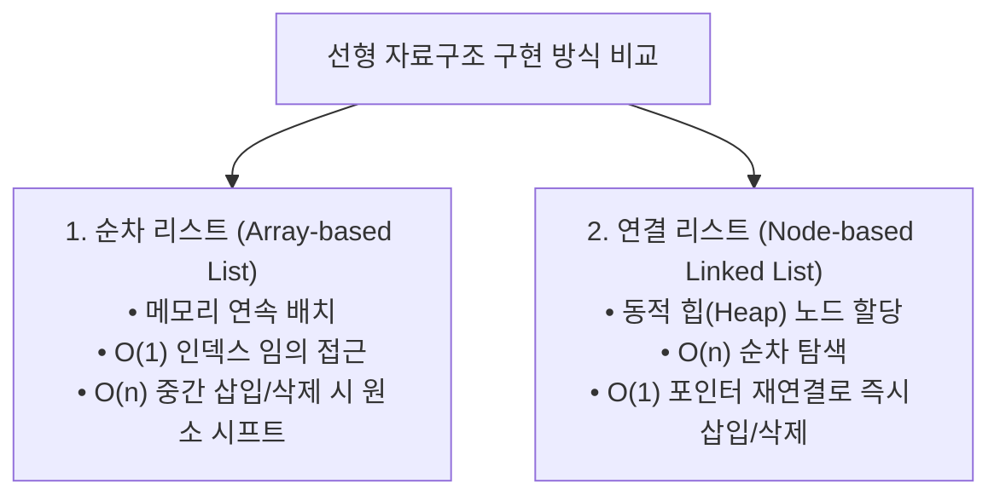
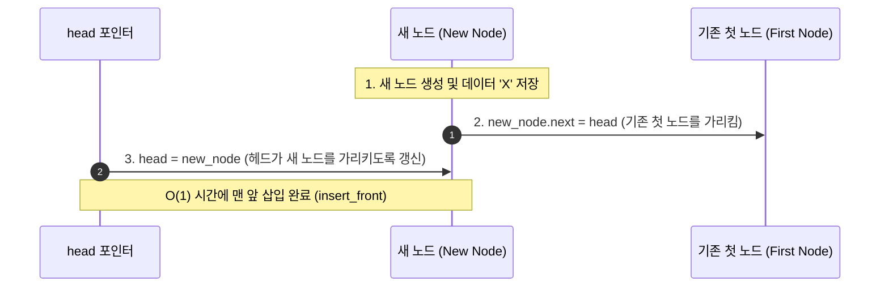

> [!abstract] 핵심 요약
> **연결 리스트(Linked List)**는 물리적으로 흩어진 노드(Node)들을 포인터(Pointer/Reference)로 연결하여 논리적 순서를 유지하는 동적 자료구조이다.
> 배열과 달리 메모리 공간의 낭비가 없고 $O(1)$ 시간에 임의 위치 노드의 삽입·삭제가 가능하지만, 임의 접근($O(1)$)이 불가능하여 항상 $O(n)$의 순차 탐색(Sequential Search)이 필요하다.

---

## 1. 순차 리스트(배열) vs 연결 리스트 핵심 비교



| 비교 항목 | 배열 기반 순차 리스트 (Array List) | 단순 연결 리스트 (Singly Linked List) | 이중 연결 리스트 (Doubly Linked List) |
| :-- | :-- | :-- | :-- |
| **메모리 할당** | 정적/동적 연속 블록 할당 | 동적 개별 노드 할당 (힙 영역) | 동적 개별 노드 할당 (추가 `prev` 포인터) |
| **임의 원소 접근** | **$O(1)$** (주소 계산 `Base + i * size`) | $O(n)$ (헤드부터 순차 탐색) | $O(n)$ (양방향 최단 경로 탐색) |
| **맨 앞 삽입/삭제** | $O(n)$ (전체 원소 우측/좌측 이동) | **$O(1)$** (`head` 포인터 갱신) | **$O(1)$** (`head` 및 더미 노드 갱신) |
| **중간 노드 삽입/삭제** | $O(n)$ (물리적 원소 이동 발생) | **$O(1)$** (해당 노드 포인터 획득 시) | **$O(1)$** (`prev`, `next` 양방향 갱신) |
| **추가 메모리 오버헤드** | 없음 (데이터만 저장) | 노드당 포인터 1개 (`next`) | 노드당 포인터 2개 (`prev`, `next`) |

---

## 2. 단순 연결 리스트(SList) 포인터 재배치 알고리즘



```python
class Node:
    def __init__(self, item, next=None):
        self.item = item
        self.next = next

class SList:
    def __init__(self):
        self.head = None
        self.size = 0

    def insert_front(self, item):
        \"\"\"맨 앞에 새 노드 삽입: O(1)\"\"\"
        self.head = Node(item, self.head)
        self.size += 1

    def insert_after(self, p: Node, item):
        \"\"\"노드 p 다음에 새 노드 삽입: O(1)\"\"\"
        p.next = Node(item, p.next)
        self.size += 1

    def delete_front(self):
        \"\"\"맨 앞 노드 삭제: O(1)\"\"\"
        if self.head is None:
            raise IndexError("List is empty")
        target = self.head
        self.head = self.head.next
        self.size -= 1
        return target.item

    def delete_after(self, p: Node):
        \"\"\"노드 p의 다음 노드 삭제: O(1)\"\"\"
        if p.next is None:
            return None
        target = p.next
        p.next = target.next
        self.size -= 1
        return target.item
```

---

## 3. 이중 연결 리스트(DList)와 원형 연결 리스트(CList)

<Tabs>
  <Tab label="1. 이중 연결 리스트 (DList)">
    각 노드가 <code>prev</code>(이전 노드)와 <code>next</code>(다음 노드) 두 개의 포인터를 유지하여 <strong>양방향 순회(Bidirectional Traversal)</strong>가 가능함.
    ```mermaid
    flowchart LR
        HEAD["head (더미)"] <--> N1["Node A"] <--> N2["Node B"] <--> TAIL["tail (더미)"]
    ```
    삭제 연산 시 선행 노드를 별도로 탐색할 필요 없이 <code>p.prev.next = p.next</code>와 <code>p.next.prev = p.prev</code>로 $O(1)$에 완결.
  </Tab>
  <Tab label="2. 원형 연결 리스트 (CList)">
    마지막 노드의 <code>next</code> 포인터가 <code>None</code> 대신 첫 번째 노드를 순환 참조함.
    ```mermaid
    flowchart LR
        N1["Node A"] --> N2["Node B"] --> N3["Node C"] --> N1
        LAST["last 포인터"] --> N3
    ```
    <code>last</code> 포인터 하나만 유지하면:
    <ul>
      <li>마지막 노드 접근: <code>last</code> ➔ <strong>$O(1)$</strong></li>
      <li>첫 번째 노드 접근: <code>last.next</code> ➔ <strong>$O(1)$</strong></li>
    </ul>
  </Tab>
</Tabs>

---

## 4. 실시간 연결 리스트(Linked List) 인터랙티브 시각화 시뮬레이터

```html preview
<div style="font-family:system-ui,-apple-system,sans-serif;padding:20px;background:var(--card);color:var(--card-foreground);border:1px solid var(--border);border-radius:var(--radius)">
  <div style="font-size:16px;font-weight:700;margin-bottom:14px;color:var(--primary);display:flex;align-items:center;gap:8px">
    <span>🔗 연결 리스트(Singly Linked List) 노드 동적 삽입·삭제 시뮬레이터</span>
  </div>

  <div style="display:flex;gap:8px;margin-bottom:14px;flex-wrap:wrap">
    <input id="nodeValInput" type="text" placeholder="노드 데이터 (예: Apple)" value="Data_1" style="flex:1;min-width:120px;padding:6px 10px;background:var(--background);color:var(--foreground);border:1px solid var(--border);border-radius:var(--radius);font-size:13px" />
    <button id="addFrontBtn" style="padding:6px 12px;background:var(--primary);color:#fff;border:none;border-radius:var(--radius);font-size:12px;font-weight:700;cursor:pointer">+ 맨 앞 삽입 (O(1))</button>
    <button id="addRearBtn" style="padding:6px 12px;background:var(--chart-2);color:#fff;border:none;border-radius:var(--radius);font-size:12px;font-weight:700;cursor:pointer">+ 맨 뒤 삽입 (O(N))</button>
    <button id="delFrontBtn" style="padding:6px 12px;background:var(--destructive);color:#fff;border:none;border-radius:var(--radius);font-size:12px;font-weight:700;cursor:pointer">- 맨 앞 삭제 (O(1))</button>
  </div>

  <div style="padding:16px;background:var(--background);border:1px solid var(--border);border-radius:var(--radius);overflow-x:auto;min-height:90px;display:flex;align-items:center">
    <div id="listVisualizer" style="display:flex;align-items:center;gap:6px"></div>
  </div>

  <div style="margin-top:10px;font-size:11px;color:var(--muted-foreground)">
    총 노드 수: <span id="listSize" style="font-weight:700;color:var(--primary)">0</span>개 | 헤드 상태: <span id="headState" style="font-family:monospace;font-weight:700">head -> None</span>
  </div>

  <script>
    var items = ["Node_A", "Node_B", "Node_C"];
    var viz = document.getElementById('listVisualizer');
    var valIn = document.getElementById('nodeValInput');
    var szOut = document.getElementById('listSize');
    var hdOut = document.getElementById('headState');

    function renderList() {
      viz.innerHTML = '';
      szOut.textContent = items.length;

      var headBadge = document.createElement('div');
      headBadge.style.cssText = 'padding:6px 10px;background:var(--chart-1);color:#fff;border-radius:var(--radius);font-size:11px;font-weight:800';
      headBadge.textContent = 'HEAD';
      viz.appendChild(headBadge);

      var arrow0 = document.createElement('span');
      arrow0.style.cssText = 'font-size:16px;color:var(--muted-foreground);font-weight:700';
      arrow0.textContent = '➔';
      viz.appendChild(arrow0);

      if (items.length === 0) {
        var nullBadge = document.createElement('div');
        nullBadge.style.cssText = 'padding:6px 10px;background:var(--card);border:1px solid var(--border);color:var(--muted-foreground);border-radius:var(--radius);font-size:11px;font-family:monospace';
        nullBadge.textContent = 'None (NULL)';
        viz.appendChild(nullBadge);
        hdOut.textContent = "head -> None";
        return;
      }

      hdOut.textContent = "head -> [" + items[0] + "]";

      for (var i = 0; i < items.length; i++) {
        var nodeBox = document.createElement('div');
        nodeBox.style.cssText = 'display:flex;border:1px solid var(--primary);border-radius:var(--radius);overflow:hidden;background:var(--card)';
        nodeBox.innerHTML = '<div style="padding:6px 10px;font-size:12px;font-weight:700;color:var(--card-foreground)">' + items[i] + '</div><div style="padding:6px 8px;background:var(--primary);color:#fff;font-size:10px;display:flex;align-items:center">next</div>';
        viz.appendChild(nodeBox);

        var arrow = document.createElement('span');
        arrow.style.cssText = 'font-size:16px;color:var(--muted-foreground);font-weight:700';
        arrow.textContent = (i === items.length - 1) ? '➔' : '➔';
        viz.appendChild(arrow);
      }

      var tailNull = document.createElement('div');
      tailNull.style.cssText = 'padding:6px 10px;background:var(--card);border:1px solid var(--border);color:var(--muted-foreground);border-radius:var(--radius);font-size:11px;font-family:monospace';
      tailNull.textContent = 'None';
      viz.appendChild(tailNull);
    }

    document.getElementById('addFrontBtn').addEventListener('click', function() {
      var val = valIn.value.trim() || ("Item_" + (items.length + 1));
      items.unshift(val);
      renderList();
    });

    document.getElementById('addRearBtn').addEventListener('click', function() {
      var val = valIn.value.trim() || ("Item_" + (items.length + 1));
      items.push(val);
      renderList();
    });

    document.getElementById('delFrontBtn').addEventListener('click', function() {
      if (items.length > 0) items.shift();
      renderList();
    });

    renderList();
  </script>
</div>
```
