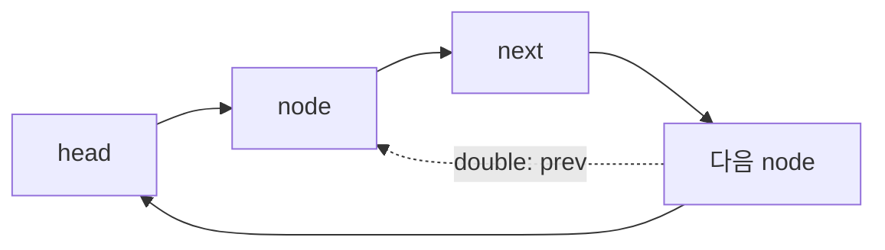

연결 리스트는 동일한 타입의 항목을 노드로 묶고 링크로 연결한다. 배열처럼 연속 메모리를 요구하지 않으며, 노드 삽입·삭제가 항목 이동 없이 이루어진다.

> [!IMPORTANT]
> 강의 흐름은 리스트 개념 → 단일 연결 리스트 코딩 → 이중 연결 리스트 → 원형 연결 리스트 → 수정·삭제·검색이다.

---

## 1. 노드와 기본 메소드

단일·이중·원형 리스트 모두 HEAD 생성, 마지막 위치 추가, 원하는 위치 추가, 전체 순회, 삭제, 수정, 검색을 구현한다. 이중 리스트는 HEAD와 TAIL을 정하면 역순 출력이 가능하다.



<Tabs>
  <Tab label="단일">각 노드가 다음 노드만 가리킨다. 순차 검색은 head에서 시작한다.</Tab>
  <Tab label="이중">next와 prev를 함께 저장해 순방향·역방향 순회를 지원한다.</Tab>
  <Tab label="원형">마지막 노드가 다시 head를 가리켜 끝에서 처음으로 이어진다.</Tab>
</Tabs>

---

## 2. 삽입·삭제의 불변식

- 삽입 전후에 head와 tail의 위치를 갱신한다.
- 삭제할 노드의 이전·다음 링크를 연결한다.
- 같은 데이터가 여러 번 나타나면 “첫 항목을 처리할지, 모두 처리할지” 정책을 먼저 정한다.
- 수정은 검색한 노드의 데이터만 바꾸고 링크는 보존한다.

```html preview
<div style="font-family:system-ui,sans-serif;padding:20px;color:var(--foreground)">
<label for="amt" style="font-size:14px;font-weight:600">리스트 주차</label>
<div id="out" style="font-size:30px;font-weight:700;color:var(--chart-1);margin:6px 0">2주차</div>
<input id="amt" type="range" min="2" max="5" step="1" value="2" style="width:100%;accent-color:var(--primary)" />
<p style="font-size:13px;color:var(--muted-foreground)">원본 주차 순서를 움직여 현재 자료의 핵심을 확인한다.</p>
<script>
var amt=document.getElementById('amt'); var out=document.getElementById('out');
amt.addEventListener('input',function(){out.textContent=Number(amt.value).toLocaleString()+'주차';});
</script>
</div>
```

| 구현 단계 | 확인 |
| --- | --- |
| 위치 검색 | head 또는 tail에서 시작 |
| 링크 변경 | 주변 노드의 next/prev 갱신 |
| 순회 | 전체·순방향·역방향 출력 |
| 경계 | 빈 리스트, 첫 노드, 마지막 노드 |

<details>
<summary>코드 점검</summary>

노드 클래스는 data와 링크를 보유한다. 원하는 위치 삽입·삭제 후 head, tail, 현재 포인터가 새 구조를 가리키는지 순서대로 확인한다.

</details>

<!-- source: list and coding decks; linked-list variants and seven operations preserved -->