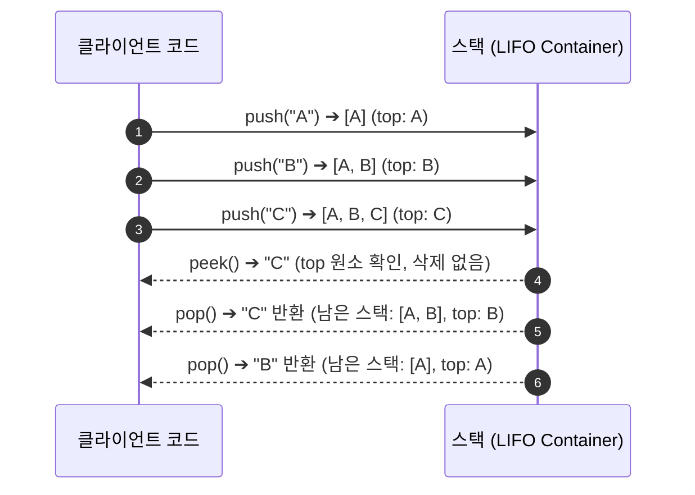
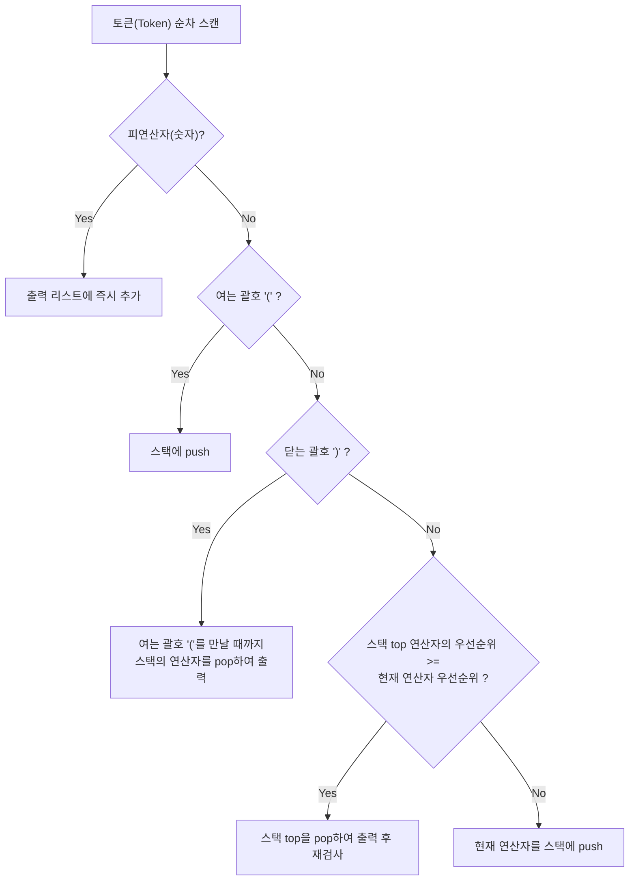

> [!abstract] 핵심 요약
> **스택(Stack)**은 한쪽 끝(`top`)에서만 모든 삽입(`push`)과 삭제(`pop`)가 일어나는 **후입선출(LIFO, Last-In First-Out)** 선형 자료구조이다.
> 브라우저 뒤로 가기, Undo 기능, 재귀 호출 스택의 기반이 되며, **다익스트라의 션팅 야드(Shunting-Yard) 알고리즘**을 통해 연산자 우선순위를 반영한 중위 $\rightarrow$ 후위 표기식 변환 및 $O(n)$ 수식 계산을 가능하게 한다.

---

## 1. 스택의 LIFO 동작 메커니즘과 기본 연산



| 연산자 | 시간 복잡도 | 기능 설명 | 예외 조건 |
| :-- | :-- | :-- | :-- |
| **`push(item)`** | **$O(1)$** | `top` 위치에 새 데이터를 추가하고 `top` 포인터 갱신 | Stack Overflow (배열 용량 초과 시) |
| **`pop()`** | **$O(1)$** | `top` 위치의 데이터를 꺼내어 반환하고 제거 | Stack Underflow (`is_empty()` 시) |
| **`peek()`** | **$O(1)$** | 데이터를 제거하지 않고 현재 `top` 원소 열람 | Stack Underflow |
| **`is_empty()`** | **$O(1)$** | 스택이 비어있는지 여부(`size == 0`) 반환 | 없음 |

---

## 2. 중위 표기식(Infix) ➔ 후위 표기식(Postfix) 변환 알고리즘

수식 $A + B \times C$에서 연산자 우선순위에 따라 괄호를 적용하면 $(A + (B \times C))$가 되며, 연산자를 피연산자 뒤로 이동시키면 $A \, B \, C \times +$가 된다.



---

## 3. 실시간 중위 표기식 ➔ 후위 변환 및 스택 계산 시뮬레이터

```html preview
<div style="font-family:system-ui,-apple-system,sans-serif;padding:20px;background:var(--card);color:var(--card-foreground);border:1px solid var(--border);border-radius:var(--radius)">
  <div style="font-size:16px;font-weight:700;margin-bottom:14px;color:var(--primary);display:flex;align-items:center;gap:8px">
    <span>🧮 중위 표기식 ➔ 후위 표기식(Postfix) 변환 및 스택 연산기</span>
  </div>

  <div style="display:flex;gap:8px;margin-bottom:14px">
    <input id="infixInput" type="text" value="( 3 + 5 ) * 2 - 8 / 4" placeholder="공백으로 구분된 중위 수식 (예: 3 + 5 * 2)" style="flex:1;padding:8px 12px;background:var(--background);color:var(--foreground);border:1px solid var(--border);border-radius:var(--radius);font-family:monospace;font-size:13px;font-weight:700" />
    <button id="calcExprBtn" style="padding:8px 16px;background:var(--primary);color:#fff;border:none;border-radius:var(--radius);font-size:12px;font-weight:700;cursor:pointer">변환 및 계산</button>
  </div>

  <div style="display:grid;grid-template-columns:1fr 1fr;gap:10px;margin-bottom:12px">
    <div style="padding:10px;background:var(--background);border:1px solid var(--border);border-radius:var(--radius)">
      <div style="font-size:11px;color:var(--muted-foreground)">변환된 후위 표기식 (Postfix)</div>
      <div id="postfixOut" style="font-family:monospace;font-size:14px;font-weight:700;color:var(--chart-1);margin-top:4px">3 5 + 2 * 8 4 / -</div>
    </div>
    <div style="padding:10px;background:var(--background);border:1px solid var(--border);border-radius:var(--radius)">
      <div style="font-size:11px;color:var(--muted-foreground)">최종 계산 결과값</div>
      <div id="resultOut" style="font-family:monospace;font-size:18px;font-weight:800;color:var(--chart-2);margin-top:2px">14</div>
    </div>
  </div>

  <div style="padding:10px;background:var(--background);border:1px solid var(--border);border-radius:var(--radius);font-family:monospace;font-size:11px;line-height:1.6;max-height:140px;overflow-y:auto">
    <div style="font-weight:700;color:var(--primary);margin-bottom:4px">단계별 연산자 스택 트레이스:</div>
    <div id="stackTrace" style="color:var(--foreground);white-space:pre-wrap"></div>
  </div>

  <script>
    var inExpr = document.getElementById('infixInput');
    var btn = document.getElementById('calcExprBtn');
    var postOut = document.getElementById('postfixOut');
    var resOut = document.getElementById('resultOut');
    var trace = document.getElementById('stackTrace');

    var prec = { '*': 2, '/': 2, '+': 1, '-': 1, '(': 0 };

    function infixToPostfix(tokens) {
      var output = [];
      var stack = [];
      var logs = [];

      for (var i = 0; i < tokens.length; i++) {
        var token = tokens[i];
        if (!isNaN(parseFloat(token))) {
          output.push(token);
          logs.push("피연산자 [" + token + "] ➔ 출력 추가: " + output.join(' '));
        } else if (token === '(') {
          stack.push(token);
          logs.push("여는 괄호 '(' ➔ 스택 push: [" + stack.join(', ') + "]");
        } else if (token === ')') {
          while (stack.length > 0 && stack[stack.length - 1] !== '(') {
            output.push(stack.pop());
          }
          stack.pop(); // '(' 제거
          logs.push("닫는 괄호 ')' ➔ '('까지 pop 완료: 스택 [" + stack.join(', ') + "]");
        } else if (prec[token] !== undefined) {
          while (stack.length > 0 && prec[stack[stack.length - 1]] >= prec[token]) {
            output.push(stack.pop());
          }
          stack.push(token);
          logs.push("연산자 [" + token + "] ➔ 우선순위 비교 후 push: 스택 [" + stack.join(', ') + "]");
        }
      }
      while (stack.length > 0) {
        output.push(stack.pop());
      }
      logs.push("잔여 스택 전원 pop ➔ 최종 Postfix: " + output.join(' '));
      return { postfix: output, logs: logs };
    }

    function evalPostfix(postfixTokens) {
      var st = [];
      for (var i = 0; i < postfixTokens.length; i++) {
        var t = postfixTokens[i];
        if (!isNaN(parseFloat(t))) {
          st.push(parseFloat(t));
        } else {
          var b = st.pop();
          var a = st.pop();
          var r = 0;
          if (t === '+') r = a + b;
          else if (t === '-') r = a - b;
          else if (t === '*') r = a * b;
          else if (t === '/') r = a / b;
          st.push(r);
        }
      }
      return st.pop();
    }

    function runProcess() {
      var raw = inExpr.value.trim();
      var tokens = raw.replace(/\(/g, ' ( ').replace(/\)/g, ' ) ').split(/\s+/).filter(function(s){return s.length > 0;});
      var conv = infixToPostfix(tokens);
      var ans = evalPostfix(conv.postfix);

      postOut.textContent = conv.postfix.join(' ');
      resOut.textContent = ans;
      trace.textContent = conv.logs.join('\\n');
    }

    btn.addEventListener('click', runProcess);
    inExpr.addEventListener('keydown', function(e) { if (e.key === 'Enter') runProcess(); });
    runProcess();
  </script>
</div>
```
