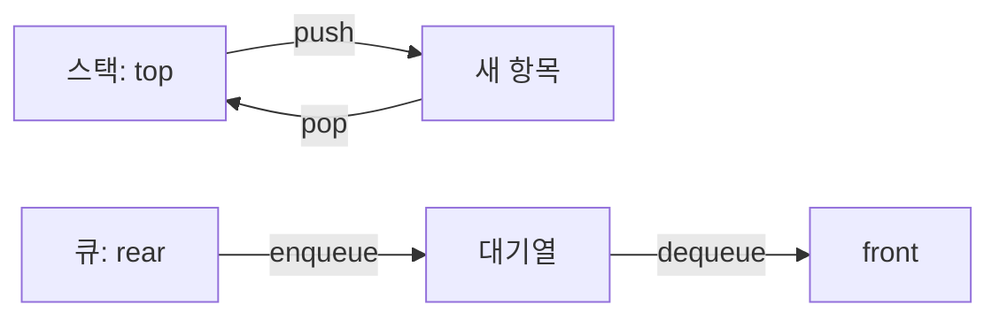

스택은 한쪽 끝에서만 삽입·삭제하는 LIFO 구조이고 큐는 삽입과 삭제 끝이 분리된 FIFO 구조다.



<Tabs>
  <Tab label="Stack · LIFO">마지막에 들어온 항목이 먼저 나온다. top이 최상위 위치를 가리킨다.</Tab>
  <Tab label="Queue · FIFO">먼저 들어온 항목이 먼저 나온다. enQueue는 뒤에 넣고 deQueue는 앞에서 뺀다.</Tab>
  <Tab label="Deque">양쪽 끝에서 삽입·삭제하는 확장 구조로 자료의 3.4절에 소개된다.</Tab>
</Tabs>

---

## 1. 스택 연산

push는 append처럼 데이터를 추가하고 top을 갱신한다. pop은 top 항목을 삭제하고 top을 한 칸 내린다. 웹 브라우저 뒤로 가기와 편집기의 Undo가 응용 사례다.

## 2. 큐 연산

큐는 한쪽 끝에서만 삽입하고 다른 쪽에서 삭제한다. 대기열의 순서를 보존하려면 front와 rear를 구분해야 한다.

```html preview
<div style="font-family:system-ui,sans-serif;padding:20px;color:var(--foreground)">
<label for="amt" style="font-size:14px;font-weight:600">자료구조 단계</label>
<div id="out" style="font-size:30px;font-weight:700;color:var(--chart-1);margin:6px 0">1단계</div>
<input id="amt" type="range" min="1" max="3" step="1" value="1" style="width:100%;accent-color:var(--primary)" />
<p style="font-size:13px;color:var(--muted-foreground)">원본 주차 순서를 움직여 현재 자료의 핵심을 확인한다.</p>
<script>
var amt=document.getElementById('amt'); var out=document.getElementById('out');
amt.addEventListener('input',function(){out.textContent=Number(amt.value).toLocaleString()+'단계';});
</script>
</div>
```

| 구조 | 삽입 | 삭제 | 순서 |
| --- | --- | --- | --- |
| 스택 | push | pop | LIFO |
| 큐 | enQueue | deQueue | FIFO |
| 데크 | 양쪽 끝 | 양쪽 끝 | 양방향 |

> [!WARNING]
> 빈 스택에서 pop하거나 빈 큐에서 deQueue하는 경계 조건을 구현할 때 먼저 검사한다.

<details>
<summary>응용 연결</summary>

스택은 괄호·수식 처리와 되돌리기에, 큐는 작업 대기와 순서 보장에 적합하다.

</details>

<!-- source: 5주차 stack, 스택과 큐, 6주차 queue; operation semantics preserved -->