> [!abstract] 이 네 편의 자료에 답은 없다 — 질문이 있다
> 3주차부터 5주차까지의 실습 자료 네 편(23쪽)은 [02장의 교재 Part 2](./02.%20%EB%A6%AC%EC%8A%A4%ED%8A%B8%20%E2%80%94%20%EB%81%9D%EC%9D%84%20%EC%96%B4%EB%96%BB%EA%B2%8C%20%ED%91%9C%EC%8B%9C%ED%95%A0%20%EA%B2%83%EC%9D%B8%EA%B0%80.md)와 같은 자료구조를 다룬다. 그런데 성격이 정반대다. 교재는 완성된 클래스 전문을 보여주고 끝내지만, 실습 자료는 **화살표 그림과 "코드 진행 순서" 목록만** 남기고 코드를 학생에게 맡긴다.
>
> 그리고 슬라이드 사이사이에 교수가 **질문 다섯 개**를 던져 둔다. 답은 어디에도 없다. 이 다섯 개가 실습에서 실제로 부딪히는 설계 결정 전부이고, 그래서 이 정리는 그 다섯 질문을 목차로 삼는다.
>
> | | 질문 | 나온 곳 |
> | --- | --- | --- |
> | **Q1** | 전체 연결 리스트 내에 같은 데이터가 있을 경우에는 어떻게 할 것인가? | 4주차(cont) 2쪽 |
> | **Q2** | 단순연결리스트는 현재 노드에서 이전 노드에 대한 정보를 얻을 방법이 없음. 해결 방안은? | 4주차(cont) 3쪽 |
> | **Q3** | 파이썬에서 삭제된 Node에 대한 메모리 해제 방법은? | 4주차(cont) 3쪽 |
> | **Q4** | 원형 연결리스트는 처음과 마지막의 위치가 같다. 어떤 부분을 조심해야 할까? | 5주차 3쪽 |
> | **Q5** | 파이썬에는 다른 언어에 존재하는 `Do ~ while` 구문이 없다. 해결방안은? | 5주차 3쪽 |

---

## 1. 실습이 교재와 갈라지는 첫 줄

네 편의 자료는 모두 같은 목차로 시작한다. 3주차 2쪽과 4주차 2쪽과 5주차 2쪽이 거의 글자 그대로 같다.

```text
1. HEAD 생성
2. 마지막 위치에 데이터 추가
3. 원하는 위치에 데이터 추가
4. 데이터 전체 순차 출력      ← 4주차는 "순차/역순 출력"
5. 데이터 삭제
6. 데이터 수정
7. 원하는 위치 검색
```

1번 항목이 이 장 전체를 가른다. **"HEAD 생성"** 이다. 교재의 `SList.__init__` 은 `self.head = None` 한 줄이었다 — 아무것도 만들지 않는다. 실습 3주차 3쪽은 다르다.

```python
▣ Node 클래스
class Node:
    def __init__(self, data=None):
        self.data = data
        self.next = None

▣ Head 생성 코드
def create_head(self):
    self.head = self.Node()          # ← 데이터 없는 노드를 하나 만든다

▣ Node 연결 방법
이전Node.next = 새 Node 변수
```

`self.Node()` 는 인자 없이 호출되므로 `data=None` 인 **빈 노드**가 생긴다. 즉 실습의 리스트는 항목이 하나도 없어도 **노드가 하나 존재한다.**

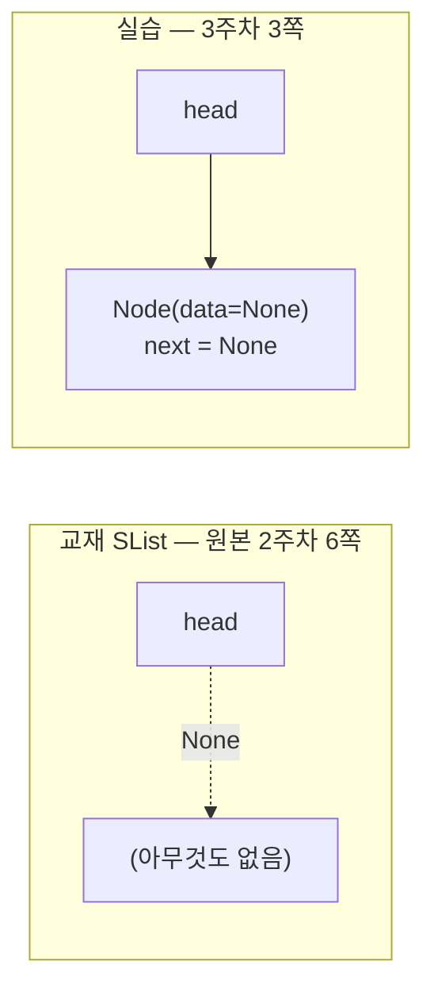

이 차이가 만드는 결과는 작지 않다.

| | 교재 `SList` | 실습 `create_head()` |
| --- | --- | --- |
| 빈 리스트 | `head is None` | `head.next is None` |
| 첫 항목 노드 | `head` 자신 | `head.next` |
| 첫 항목 삽입 | `head` 를 갈아 끼워야 함 (특수 처리) | 다른 삽입과 **똑같다** |
| 순회 시작 | `p = head` | `p = head.next` |
| 대가 | 없음 | 노드 하나만큼의 메모리 |

교재가 `insert_front` 안에서 `if self.is_empty():` 분기를 둔 이유가 왼쪽 열이고, 실습이 그 분기를 없앤 방법이 오른쪽 열이다. [02장](./02.%20%EB%A6%AC%EC%8A%A4%ED%8A%B8%20%E2%80%94%20%EB%81%9D%EC%9D%84%20%EC%96%B4%EB%96%BB%EA%B2%8C%20%ED%91%9C%EC%8B%9C%ED%95%A0%20%EA%B2%83%EC%9D%B8%EA%B0%80.md)에서 교재의 `DList` 가 더미 노드 둘을 세운 것과 같은 발상을, 실습은 **단순 연결 리스트에서부터** 적용한다.

4주차 3쪽은 이중 연결 리스트에서도 같은 선택을 이어간다.

```python
▣ Node 클래스                      Node 구조:  left | 데이터 | right
class Node:
    def __init__(self, data=None):
        self.lnext = None
        self.data = data
        self.rnext = None

▣ Head / Tail 생성 코드
def create_ht(self):
    self.head = self.Node()
    self.tail = self.Node()
```

이름이 `prev`/`next` 가 아니라 **`lnext`/`rnext`** 다. "왼쪽 다음"과 "오른쪽 다음" — 방향을 좌우로 부른다. 교재의 `prev`/`next` 와 뜻은 같지만, 4주차 4·5쪽의 그림이 노드를 가로로 늘어놓고 화살표를 좌우로 그리므로 이름이 그림과 맞아떨어진다.

> [!note] `create_ht` 는 연결까지 하지는 않는다
> 교재 `DList.__init__` 은 더미 둘을 만든 뒤 `self.tail = self.Node(None, self.head, None)` 과 `self.head.next = self.tail` 로 **서로 묶는 두 줄**을 더 실행했다. 실습 4주차 3쪽의 `create_ht` 에는 그 두 줄이 없다. 슬라이드가 생략한 것인지 학생이 채울 몫인지는 자료에 적혀 있지 않지만, 4쪽의 삽입 코드가 `self.tail.lnext` 를 읽는 것으로 보아 **어딘가에서 반드시 이어 두어야** 한다.

---

## 2. 마지막 노드까지 걸어가기 — 반복과 재귀

3주차 4쪽은 순회를 두 가지로 제시한다. 자료 전체에서 유일하게 "같은 일을 하는 두 코드"를 나란히 놓은 쪽이다.

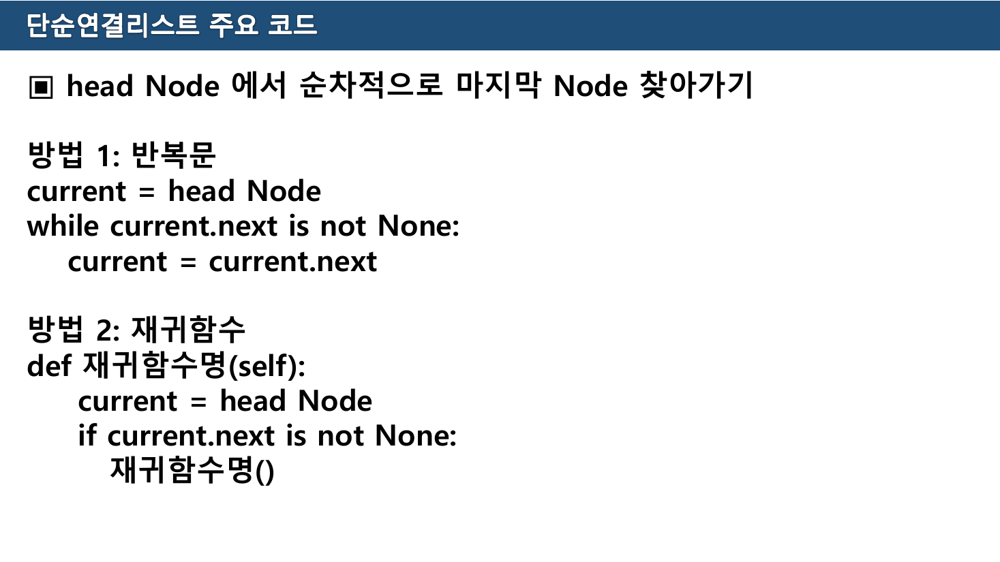

```python
# 방법 1: 반복문
current = head Node
while current.next is not None:
    current = current.next

# 방법 2: 재귀함수
def 재귀함수명(self):
    current = head Node
    if current.next is not None:
        재귀함수명()
```

방법 1은 그대로 쓸 수 있다. `current.next` 가 `None` 이 되는 지점, 즉 **마지막 노드**에서 멈춘다(`current` 자체가 `None` 이 될 때까지 가는 것이 아니다 — 마지막 노드를 손에 쥔 채로 서야 다음 줄에서 `current.next = newNode` 를 할 수 있다).

> [!caution] 원본 오류 — 재귀 버전은 전진하지 않는다
> 방법 2를 그대로 옮기면 **무한 재귀**가 된다. 함수를 다시 부를 때마다 첫 줄 `current = head Node` 가 실행되어 **매번 처음으로 되돌아가기** 때문이다. 종료 조건 `current.next is not None` 은 영원히 참이고, 파이썬은 곧 `RecursionError: maximum recursion depth exceeded` 를 낸다.
>
> 재귀가 성립하려면 **진행 상태를 인자로 넘겨야** 한다.
>
> ```python
> def find_last(self, current):        # 현재 위치를 인자로 받는다
>     if current.next is None:
>         return current                # 기저 사례: 여기가 마지막
>     return self.find_last(current.next)   # 한 칸 전진해서 다시
> ```
>
> 슬라이드는 "재귀함수명"이라는 자리표시자를 쓴 개요 수준의 의사코드지만, **상태를 어디에 두는가**라는 재귀의 핵심이 빠져 있어 그대로 옮기면 동작하지 않는다.

7쪽은 출력 기능에 대해 *"본 강의자료 4Page 참조"* 라고만 적는다. 즉 이 4쪽 하나가 순회가 필요한 **모든** 기능(출력·검색·수정·삭제)의 공통 부품이다.

---

## 3. 삽입 — 화살표를 다시 그리는 순서

3주차 5·6쪽과 4주차 4·5쪽은 모두 같은 형식이다. 그림 위에 ①②③ 번호를 얹고, 아래에 "※ 코드 진행 순서"를 적는다. **코드가 아니라 순서가 내용이다.**

### 단순 연결 리스트

```text
▣ 마지막 위치에 데이터 추가 (3주차 5쪽)
  1. 마지막 노드 찾아가기
  2. 새로운 노드 생성
  3. 마지막 노드.next = 새로운 노드
```

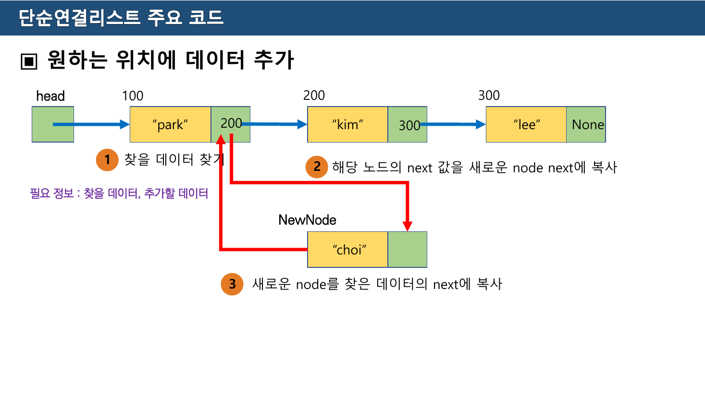

6쪽의 그림은 주소를 붙여 훨씬 구체적이다. `head → 100("park") → 200("kim") → 300("lee") → None` 사이에 `"choi"` 를 끼워 넣는다.

```text
▣ 원하는 위치에 데이터 추가 (3주차 6쪽)
  필요 정보 : 찾을 데이터, 추가할 데이터
  ① 찾을 데이터 찾기
  ② 해당 노드의 next 값을 새로운 node next에 복사
  ③ 새로운 node를 찾은 데이터의 next에 복사
```

②와 ③의 순서가 뒤집히면 무슨 일이 생기는지는 슬라이드가 말하지 않는다. 아래에서 직접 바꿔 볼 수 있다.

```html preview
<div id="ins-root">
  <style>
    #ins-root{font-family:system-ui,-apple-system,"Segoe UI",sans-serif;color:var(--foreground);background:var(--card);
      border:1px solid var(--border);border-radius:10px;padding:16px}
    #ins-root h4{margin:0 0 4px;font-size:14px}
    #ins-root .sub{font-size:12px;opacity:.7;margin-bottom:12px}
    #ins-root .bar{display:flex;gap:8px;flex-wrap:wrap;align-items:center;margin-bottom:12px}
    #ins-root button{font:inherit;font-size:12.5px;padding:6px 12px;border-radius:7px;cursor:pointer;
      border:1px solid var(--border);background:transparent;color:var(--foreground)}
    #ins-root button.sel{border-color:var(--chart-1);color:var(--chart-1)}
    #ins-root svg{width:100%;height:auto;display:block;margin:4px 0 2px}
    #ins-root .steps{font-family:ui-monospace,SFMono-Regular,Menlo,monospace;font-size:12px;line-height:1.8;
      border-left:3px solid var(--border);padding-left:11px;margin-top:8px;white-space:pre}
    #ins-root .steps .now{color:var(--chart-1);font-weight:600}
    #ins-root .steps .done{opacity:.5}
    #ins-root .verdict{font-size:12.5px;margin-top:11px;line-height:1.6;min-height:3.2em}
  </style>
  <h4>삽입 순서를 바꿔 보기 — 원본 3주차 6쪽의 ②③</h4>
  <div class="sub">노드는 원본 그림 그대로: head → 100 "park" → 200 "kim" → 300 "lee" → None. "kim" 뒤에 "choi"를 넣는다.</div>
  <div class="bar">
    <button id="ins-a" class="sel">원본 순서 (② → ③)</button>
    <button id="ins-b">뒤집은 순서 (③ → ②)</button>
    <button id="ins-step">▶ 한 단계</button>
    <button id="ins-reset">처음으로</button>
  </div>
  <svg id="ins-svg" viewBox="0 0 700 190" role="img" aria-label="단순 연결 리스트 삽입 순서 시각화"></svg>
  <div class="steps" id="ins-steps"></div>
  <div class="verdict" id="ins-verdict"></div>
</div>
<script>
(function(){
  var good=true, k=0;
  var A=document.getElementById("ins-a"), B=document.getElementById("ins-b");
  A.onclick=function(){ good=true; k=0; render(); };
  B.onclick=function(){ good=false; k=0; render(); };
  document.getElementById("ins-step").onclick=function(){ if(k<3) k++; render(); };
  document.getElementById("ins-reset").onclick=function(){ k=0; render(); };
  function render(){
    A.classList.toggle("sel",good); B.classList.toggle("sel",!good);
    // 상태: kimNext (kim.next 가 가리키는 것), newNext (choi.next)
    var kimNext="lee", newNext=null, found=(k>=1);
    if(good){ if(k>=2) newNext="lee"; if(k>=3) kimNext="choi"; }
    else    { if(k>=2) kimNext="choi"; if(k>=3) newNext="choi"; }

    var S="", y=52, w=150, x0=24;
    var boxes=[{n:"park",a:"100"},{n:"kim",a:"200"},{n:"lee",a:"300"}];
    S+='<text x="'+x0+'" y="'+(y-16)+'" font-size="12" fill="var(--chart-2)">head</text>';
    boxes.forEach(function(b,i){
      var x=x0+i*w, hl=(found && b.n==="kim");
      S+='<rect x="'+x+'" y="'+y+'" width="118" height="40" rx="6" fill="none" stroke="'+(hl?"var(--chart-1)":"var(--border)")+'" stroke-width="'+(hl?2.2:1.2)+'"/>';
      S+='<text x="'+(x+40)+'" y="'+(y+25)+'" text-anchor="middle" font-size="13" fill="var(--foreground)">"'+b.n+'"</text>';
      S+='<line x1="'+(x+80)+'" y1="'+y+'" x2="'+(x+80)+'" y2="'+(y+40)+'" stroke="var(--border)"/>';
      S+='<text x="'+(x+12)+'" y="'+(y-8)+'" font-size="11" fill="var(--border)">'+b.a+'</text>';
    });
    // choi
    var cx=x0+w, cy=140;
    S+='<rect x="'+cx+'" y="'+cy+'" width="118" height="40" rx="6" fill="none" stroke="var(--chart-1)" stroke-width="1.8" stroke-dasharray="'+(k>=1?"0":"4 3")+'"/>';
    S+='<text x="'+(cx+40)+'" y="'+(cy+25)+'" text-anchor="middle" font-size="13" fill="var(--chart-1)">"choi"</text>';
    S+='<line x1="'+(cx+80)+'" y1="'+cy+'" x2="'+(cx+80)+'" y2="'+(cy+40)+'" stroke="var(--border)"/>';
    S+='<text x="'+(cx-56)+'" y="'+(cy+25)+'" font-size="12" fill="var(--chart-1)">newNode</text>';
    function arrow(x1,y1,x2,y2,col,dash){
      return '<path d="M'+x1+' '+y1+' C '+((x1+x2)/2)+' '+y1+', '+((x1+x2)/2)+' '+y2+', '+x2+' '+y2+'" fill="none" stroke="'+col+'" stroke-width="1.6" '+(dash?'stroke-dasharray="4 3"':'')+' marker-end="url(#insA)"/>';
    }
    // park -> kim (고정)
    S+=arrow(x0+108,y+20,x0+w,y+20,"var(--border)");
    // kim.next
    if(kimNext==="lee"){ S+=arrow(x0+w+108,y+20,x0+2*w,y+20,"var(--chart-2)"); }
    else { S+=arrow(x0+w+108,y+20,cx,cy+20,"var(--chart-1)"); }
    // choi.next
    if(newNext==="lee"){ S+=arrow(cx+108,cy+20,x0+2*w+6,y+40,"var(--chart-1)"); }
    else if(newNext==="choi"){ S+='<path d="M'+(cx+108)+' '+(cy+8)+' C '+(cx+180)+' '+(cy-30)+', '+(cx+180)+' '+(cy+70)+', '+(cx+112)+' '+(cy+34)+'" fill="none" stroke="var(--chart-3)" stroke-width="1.8" marker-end="url(#insA3)"/>'; }
    // lee -> None
    S+='<text x="'+(x0+2*w+126)+'" y="'+(y+25)+'" font-size="12" fill="var(--border)">None</text>';
    S+='<defs><marker id="insA" markerWidth="7" markerHeight="7" refX="6" refY="3" orient="auto"><path d="M0 0 L6 3 L0 6 z" fill="var(--chart-2)"/></marker>'+
       '<marker id="insA3" markerWidth="7" markerHeight="7" refX="6" refY="3" orient="auto"><path d="M0 0 L6 3 L0 6 z" fill="var(--chart-3)"/></marker></defs>';
    document.getElementById("ins-svg").innerHTML=S;

    var lines = good
      ? ['① current = "kim" 노드를 찾는다',
         '② newNode.next = current.next      # lee',
         '③ current.next = newNode           # choi']
      : ['① current = "kim" 노드를 찾는다',
         '③ current.next = newNode           # choi  ← 먼저 해 버림',
         '② newNode.next = current.next      # 이제 current.next 는 choi 자신'];
    document.getElementById("ins-steps").innerHTML = lines.map(function(l,i){
      var cls = (i+1===k)?"now":((i+1<k)?"done":"");
      return '<span class="'+cls+'">'+l.replace(/&/g,"&amp;").replace(/</g,"&lt;")+'</span>';
    }).join("\n");

    var v;
    if(k===0){ v="한 단계씩 눌러 보자."; }
    else if(k===1){ v='"kim" 노드를 찾았다. 여기까지는 두 순서가 같다.'; }
    else if(good){ v = (k===2) ? '새 노드가 먼저 <b>lee</b> 를 붙잡았다. 아직 리스트는 온전하다 — lee 로 가는 길이 두 개(kim·choi)일 뿐이다.'
                               : '이제 kim이 choi를 가리킨다. <b>park → kim → choi → lee</b> 완성.'; }
    else { v = (k===2) ? '<span style="color:var(--chart-3)">kim이 choi를 가리키는 순간 <b>lee 로 가는 마지막 길이 끊겼다.</b></span> lee·그 뒤의 모든 노드에 도달할 방법이 사라졌다.'
                       : '<span style="color:var(--chart-3)">이제 <code>current.next</code> 는 choi 자신이다. <b>choi.next = choi</b> — 자기 자신을 가리키는 고리가 생기고, 출력하면 무한 루프에 빠진다.</span> 리스트의 나머지는 회수 불가.'; }
    document.getElementById("ins-verdict").innerHTML=v;
  }
  render();
})();
</script>
```

**끊기 전에 이어라.** 이것이 ②③ 순서의 전부이고, 이중 연결 리스트에서는 갱신할 화살표가 넷으로 늘어나 더 중요해진다.

### 이중 연결 리스트

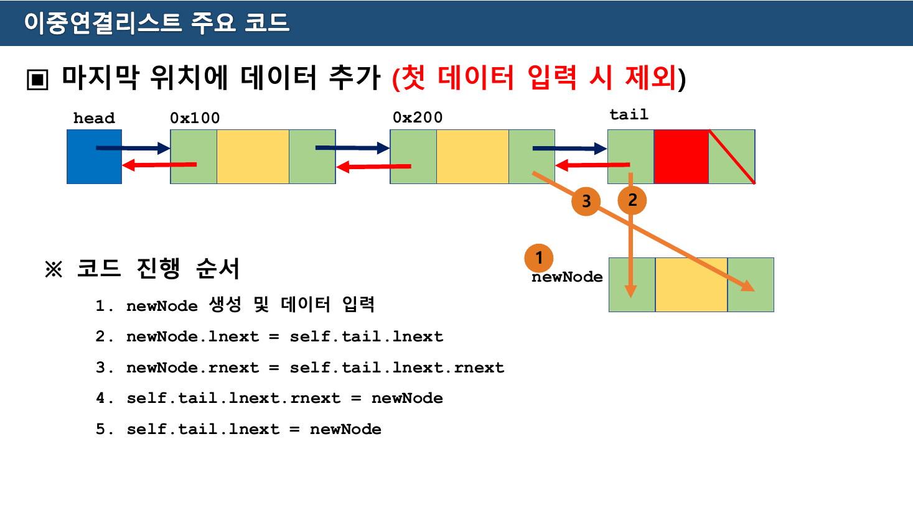

```text
▣ 마지막 위치에 데이터 추가 (첫 데이터 입력 시 제외) — 4주차 4쪽
  1. newNode 생성 및 데이터 입력
  2. newNode.lnext = self.tail.lnext
  3. newNode.rnext = self.tail.lnext.rnext
  4. self.tail.lnext.rnext = newNode
  5. self.tail.lnext = newNode
```

`self.tail.lnext` 는 **마지막 데이터 노드**다. 2~3번에서 새 노드가 앞뒤를 먼저 붙잡고, 4~5번에서 기존 노드들이 새 노드를 가리키도록 바꾼다. 여기서도 **새 노드가 먼저 붙잡고, 기존 화살표는 나중에** 라는 순서가 지켜진다.

3번 줄의 `self.tail.lnext.rnext` 는 결국 `self.tail` 이다(마지막 노드의 오른쪽은 tail). 굳이 두 단계로 쓴 이유는 4번 줄과 표현을 맞추기 위한 것으로 보인다.

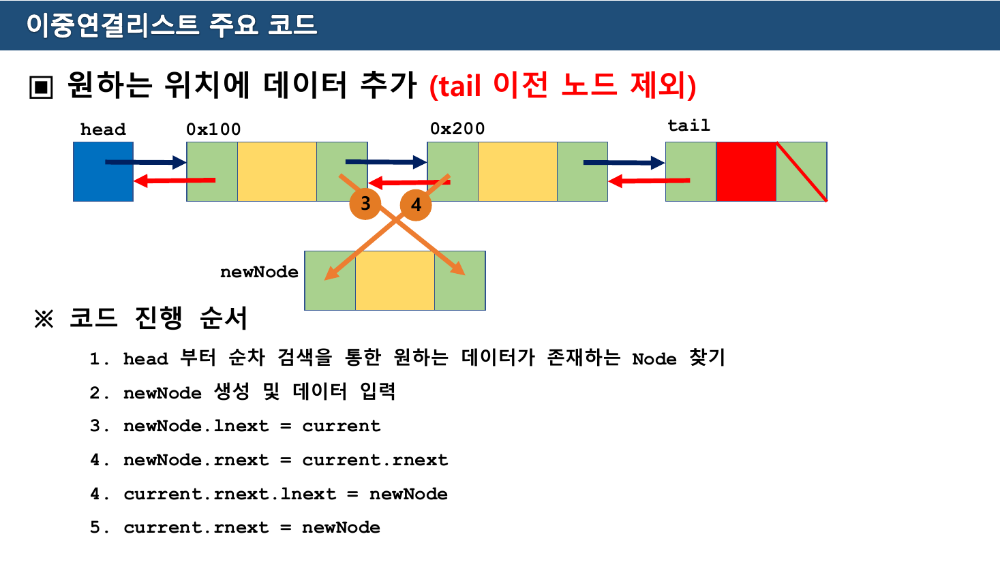

> [!caution] 원본 오류 — 단계 번호 `4` 가 두 번 나온다
> 4주차 5쪽의 "※ 코드 진행 순서"는 이렇게 적혀 있다.
>
> ```text
> 1. head 부터 순차 검색을 통한 원하는 데이터가 존재하는 Node 찾기
> 2. newNode 생성 및 데이터 입력
> 3. newNode.lnext = current
> 4. newNode.rnext = current.rnext
> 4. current.rnext.lnext = newNode      ← 4가 반복된다
> 5. current.rnext = newNode
> ```
>
> 실제 단계는 여섯 개이므로 마지막 둘은 **5·6** 이어야 한다. 코드 내용과 순서 자체는 맞다 — 번호만 어긋났다. 4쪽이 같은 형식으로 1~5를 정확히 매긴 것과 대비된다.
>
> 슬라이드 그림에도 주황색 원 ③④ 두 개만 그려져 있어, 네 줄의 대입 중 둘만 번호가 붙은 상태다.

---

## 4. Q1 — 같은 데이터가 여럿이면?

4주차(cont) 2쪽이 던지는 첫 질문이다.

> Q. 전체 연결 리스트 내에 같은 데이터가 있을 경우에는 어떻게 할 것인가?

이 질문이 나온 맥락이 중요하다. 실습의 검색·수정·삭제는 전부 **데이터 값으로 노드를 찾는다**(3주차 6쪽: *"필요 정보 : 찾을 데이터, 추가할 데이터"*). 인덱스가 아니라 값이 열쇠다. 값이 유일하지 않으면 그 열쇠가 문을 여러 개 연다.

자료는 답을 주지 않는다. 실제로 선택지는 몇 가지뿐이다.

| 정책 | 코드에 미치는 영향 |
| --- | --- |
| 처음 만난 것 하나만 | 순회를 `break` 로 끊는다. 가장 단순하고, 교재 `SList.search` 가 택한 방식(`return k`) |
| 마지막 것 하나만 | 끝까지 돌면서 마지막 일치를 기억한다 |
| 전부 | 리스트를 돌려주도록 반환형이 바뀐다. 삭제라면 **순회 중 삭제**가 되어 `current` 관리가 까다로워진다 |
| 애초에 중복을 막는다 | 삽입에서 검사한다. 삽입 비용이 O(1)에서 O(n)으로 오른다 |

마지막 행이 중요하다. [02장 44쪽 표](./02.%20%EB%A6%AC%EC%8A%A4%ED%8A%B8%20%E2%80%94%20%EB%81%9D%EC%9D%84%20%EC%96%B4%EB%96%BB%EA%B2%8C%20%ED%91%9C%EC%8B%9C%ED%95%A0%20%EA%B2%83%EC%9D%B8%EA%B0%80.md)가 약속한 "삽입 O(1)"은 중복을 허용할 때에만 유지된다.

---

## 5. Q2 — 이전 노드를 어떻게 아는가

4주차(cont) 3쪽은 단순 연결 리스트의 삭제를 그리고 그 아래 질문을 단다.

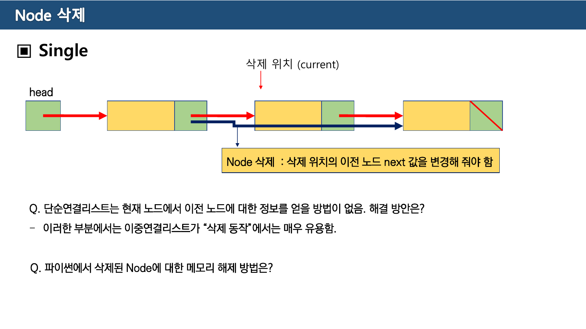

> Node 삭제 : 삭제 위치의 이전 노드 next 값을 변경해 줘야 함
>
> Q. 단순연결리스트는 현재 노드에서 이전 노드에 대한 정보를 얻을 방법이 없음. 해결 방안은?
>
> \- 이러한 부분에서는 이중연결리스트가 "삭제 동작"에서는 매우 유용함.

교재도 같은 곳을 짚었다. [02장](./02.%20%EB%A6%AC%EC%8A%A4%ED%8A%B8%20%E2%80%94%20%EB%81%9D%EC%9D%84%20%EC%96%B4%EB%96%BB%EA%B2%8C%20%ED%91%9C%EC%8B%9C%ED%95%A0%20%EA%B2%83%EC%9D%B8%EA%B0%80.md)의 `SList.delete_after(p)` 가 **이전 노드 `p` 를 인자로 요구**한 것이 바로 이 문제를 호출하는 쪽에 떠넘긴 것이다.

실무적인 해법은 셋이다.

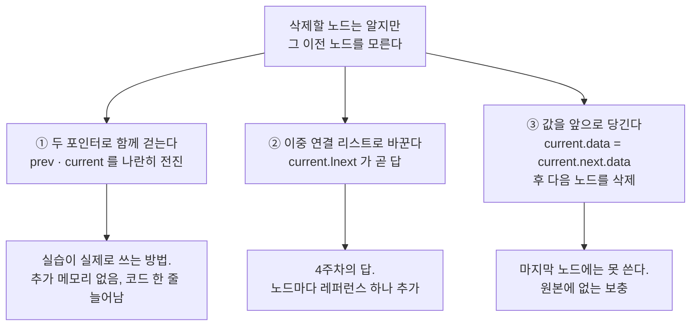

①이 가장 흔하다. 3주차 4쪽의 순회 코드에 변수를 하나 더 두면 된다.

```python
prev = self.head
current = self.head.next
while current is not None:
    if current.data == target:
        prev.next = current.next     # 이전 노드의 next 를 바꾼다
        break
    prev = current
    current = current.next
```

여기서 1절의 설계가 값을 한다. `create_head()` 로 만든 **더미 head 덕분에 `prev` 가 처음부터 유효한 노드**다. 교재처럼 `head = None` 으로 시작했다면 "첫 노드를 지우는 경우"를 따로 써야 한다.

4주차(cont) 4쪽은 이중 연결 리스트의 답을 한 문장으로 끝낸다.

> 단순연결리스트에 비해 이중연결리스트는 이전노드와 다음 노드에 대한 정보를 쉽게 얻을 수 있으므로, 간단하게 삭제동작을 할 수 있다.

그림에는 화살표 두 개(①②)만 그려져 있다 — `current.lnext.rnext = current.rnext` 와 `current.rnext.lnext = current.lnext`. 단순 연결 리스트의 한 줄이 두 줄로 늘었지만, **찾아 헤맬 필요가 없다.**

---

## 6. Q3 — 지운 노드의 메모리는 누가 치우는가

같은 3쪽의 두 번째 질문이다.

> Q. 파이썬에서 삭제된 Node에 대한 메모리 해제 방법은?

C나 C++이라면 `free()`/`delete` 를 불러야 한다. 파이썬에는 그런 것이 없다. 질문의 답은 **"아무것도 하지 않아도 된다, 단 조건이 있다"** 이다.

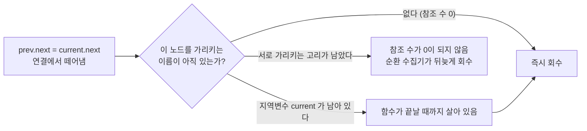

파이썬은 객체를 가리키는 이름의 수를 세고 있다가 0이 되는 순간 회수한다. 연결을 끊는 것만으로 이미 회수 대상이 되므로, `del current` 를 굳이 쓸 필요는 없다 — `del` 은 메모리를 지우는 명령이 아니라 **이름 하나를 지우는** 명령이다.

주의해야 할 경우가 이중 연결 리스트와 원형 연결 리스트다. 두 노드가 서로를 가리키고 있으면 바깥에서 아무도 안 봐도 참조 수가 서로 1씩 남는다. 이때는 참조 수만으로는 회수되지 않고, 파이썬의 순환 참조 수집기가 나중에 처리한다. 삭제 코드에서 `current.lnext = None; current.rnext = None` 을 덧붙여 고리를 끊어 주면 즉시 회수된다.

> [!note] 이 절은 원본에 없는 보충이다
> 4주차(cont) 3쪽은 질문만 남기고 답을 적지 않았다. 위 설명은 파이썬의 동작을 근거로 답을 채운 것이며, 슬라이드에 있는 내용이 아니다.

---

## 7. Q4·Q5 — 원형 리스트: 두 가지 방법과 없는 구문

5주차 3쪽은 이 자료에서 정보 밀도가 가장 높은 쪽이다. 그림 하나에 **두 가지 설계**를 겹쳐 그리고, 질문 둘을 붙였다.

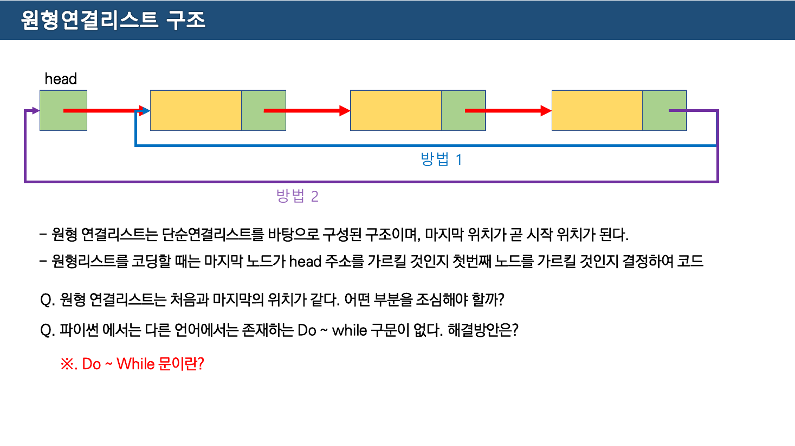

> \- 원형 연결리스트는 단순연결리스트를 바탕으로 구성된 구조이며, 마지막 위치가 곧 시작 위치가 된다.
> \- 원형리스트를 코딩할 때는 **마지막 노드가 head 주소를 가르킬 것인지 첫번째 노드를 가르킬 것인지 결정**하여 코드

그림의 파란 선(**방법 1**)은 마지막 노드에서 **첫 데이터 노드**로 돌아가고, 보라 선(**방법 2**)은 **head 노드 자체**로 돌아간다.

| | 방법 1 — 첫 데이터 노드로 | 방법 2 — head 노드로 |
| --- | --- | --- |
| 고리에 들어가는 것 | 데이터 노드만 | head 더미까지 포함 |
| 한 바퀴의 길이 | n | n + 1 |
| 순회 중 만나는 것 | 전부 실제 항목 | 중간에 `data=None` 인 더미가 낀다 |
| 종료 조건 | `current.next == last.next` | `current.next == last` |

두 방법 모두 `last = self.head` 로 두고 출발하므로, 방법 1의 `last.next` 는 첫 데이터 노드를, 방법 2의 `last` 는 head 자신을 뜻한다. 4쪽이 두 코드를 나란히 싣는다.

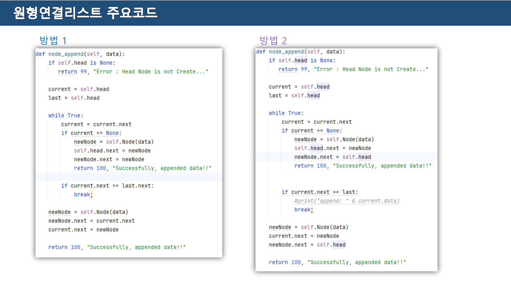

```python
# 방법 1 — 마지막 노드가 첫 데이터 노드를 가리킨다
def node_append(self, data):
    if self.head is None:
        return 99, "Error : Head Node is not Create..."
    current = self.head
    last = self.head
    while True:
        current = current.next
        if current == None:                    # 아직 데이터 노드가 없다
            newNode = self.Node(data)
            self.head.next = newNode
            newNode.next = newNode             # 자기 자신을 가리킨다
            return 100, "Successfully, appended data!!"
        if current.next == last.next:          # current 가 마지막 노드
            break;
    newNode = self.Node(data)
    newNode.next = current.next
    current.next = newNode
    return 100, "Successfully, appended data!!"
```

```python
# 방법 2 — 마지막 노드가 head 를 가리킨다
def node_append(self, data):
    if self.head is None:
        return 99, "Error : Head Node is not Create..."
    current = self.head
    last = self.head
    while True:
        current = current.next
        if current == None:
            newNode = self.Node(data)
            self.head.next = newNode
            newNode.next = self.head           # head 로 돌아간다
            return 100, "Successfully, appended data!!"
        if current.next == last:               # current.next 가 head 면 마지막
            # print("append: " & current.data)
            break;
    newNode = self.Node(data)
    current.next = newNode
    newNode.next = self.head
    return 100, "Successfully, appended data!!"
```

두 코드의 차이는 **딱 세 줄**이다 — 첫 노드가 무엇을 가리키는가, 종료 조건이 무엇과 비교하는가, 새 마지막 노드가 무엇을 가리키는가. 5쪽이 *"원형리스트는 처음과 마지막이 같으므로 … 두 개 위치 변수(head, last)을 두고, 그 중 head 를 변경하여 Node 를 이동하고, head와 last 를 비교하여 마지막 위치 즉, Node를 전부 순회했는지 여부를 판단한다"* 라고 적은 것이 이 구조다.

### Q4 — 무엇을 조심해야 하는가

> Q. 원형 연결리스트는 처음과 마지막의 위치가 같다. 어떤 부분을 조심해야 할까?

위 코드가 스스로 답한다. **정지 조건을 값이 아니라 위치로 잡아야 한다.** `while current is not None` 은 영원히 거짓이 되지 않으므로 쓸 수 없다. 대신 "처음 그 자리로 돌아왔는가"를 비교한다. [02장 교재 `CList.print_list`](./02.%20%EB%A6%AC%EC%8A%A4%ED%8A%B8%20%E2%80%94%20%EB%81%9D%EC%9D%84%20%EC%96%B4%EB%96%BB%EA%B2%8C%20%ED%91%9C%EC%8B%9C%ED%95%A0%20%EA%B2%83%EC%9D%B8%EA%B0%80.md)의 `while p.next != f:` 와 같은 발상이다.

두 번째로 조심할 것은 **원소가 하나일 때**다. 방법 1의 `newNode.next = newNode` 가 그 경우인데, 이 노드는 첫 노드이자 마지막 노드다. 삭제할 때 이 특수 경우를 놓치면 `last` 가 죽은 노드를 계속 가리킨다(교재 `CList.delete` 의 `if self.size == 1:` 분기가 같은 이유로 존재한다).

### Q5 — `do ~ while` 이 없다

> Q. 파이썬 에서는 다른 언어에서는 존재하는 Do ~ while 구문이 없다. 해결방안은?
>
> ※. Do ~ While 문이란?

`do { ... } while (조건);` 은 **몸통을 먼저 한 번 실행하고 나서** 조건을 본다. 원형 리스트에 정확히 필요한 형태다 — 출발 노드에서 "돌아왔는가"를 먼저 물으면 시작하자마자 참이 되어 한 바퀴를 못 돈다.

원본 코드가 쓴 방법이 곧 답이다.

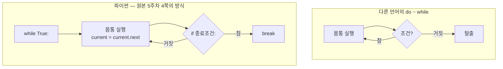

`while True:` 로 조건 검사를 없앤 뒤, 몸통 **끝**에 `if ...: break` 를 두는 것. 검사 지점을 루프 머리에서 꼬리로 옮긴 것이 `do ~ while` 의 정체다.

> [!caution] 원본 오류 — 주석 처리된 한 줄이 파이썬 문법이 아니다
> 방법 2 코드의 `#print("append: " & current.data)` 에서 `&` 는 문자열을 잇는 연산자로 쓰였다. 이것은 **Visual Basic·C# 계열의 문법**이고, 파이썬에서 문자열에 `&` 를 쓰면 `TypeError: unsupported operand type(s) for &: 'str' and 'str'` 이 난다. 파이썬은 `+` 또는 콤마다. 주석 처리되어 있어 실행되지는 않지만, 다른 언어의 코드를 옮겨 온 흔적이 그대로 남았다.
>
> 같은 코드에 사소한 것 둘이 더 있다.
>
> - `break;` — 세미콜론이 붙어 있다. 파이썬에서 문법 오류는 아니지만(문장 구분자로 해석된다) 불필요하다
> - `if self.head is None` 과 `if current == None` 이 **한 함수 안에서 혼용**된다. `None` 비교는 `is` 가 정석이다

6쪽은 원형 리스트의 장점을 한 줄로 정리하고 과제를 낸다.

> \- 장점 : 하나의 노드에서 모든 노드를 접근할 수 있다.
>
> Try — 본 자료 4Page를 참조하여 원형리스트 삽입, 삭제, 수정 코드를 스스로 작성해 보세요. / **이중노드 구조를 이용하여 원형리스트 구현** 해 보세요.

마지막 줄이 원형 이중 연결 리스트다. 교재 Part 2에는 나오지 않는 형태이고, [02장 28쪽](./02.%20%EB%A6%AC%EC%8A%A4%ED%8A%B8%20%E2%80%94%20%EB%81%9D%EC%9D%84%20%EC%96%B4%EB%96%BB%EA%B2%8C%20%ED%91%9C%EC%8B%9C%ED%95%A0%20%EA%B2%83%EC%9D%B8%EA%B0%80.md)이 응용으로 든 이항 힙·피보나치 힙이 실제로 쓰는 구조이기도 하다.

---

## 8. 과제 — 무엇을 제출해야 하는가

실습 자료는 두 번 과제를 낸다. 요구 사항이 곧 "이 장을 이해했다"의 판정 기준이다.

| 자료 | 마감 | 요구 |
| --- | --- | --- |
| 3주차 7쪽 (1차 과제) | 3월 25일 | 데이터 **수정·삭제·원하는 위치 탐색** 구현. 전체 코드 + 실제 동작결과 캡처(추가·수정·삭제·위치탐색) |
| 6주차(큐) 4쪽 (2차 과제) | 4월 29일 | 단순연결리스트로 **큐 클래스** 완성 + 실행화면 |

제목·파일명 형식까지 지정되어 있다 — `학번_성명_데이터구조_N차과제`, 제출처 `swcberet@naver.com`.

3주차 7쪽이 요구한 네 기능(추가·수정·삭제·탐색)은 전부 2절의 순회 코드 하나에서 갈라져 나온다. 순회로 노드를 찾은 다음,

- **탐색** — 찾은 자리에서 멈추고 결과를 알린다
- **수정** — `current.data = 새 값`
- **삭제** — `prev.next = current.next` (5절)
- **추가** — 3절의 ②③ 순서

즉 실습 과제는 "네 가지 기능"이 아니라 **"순회 하나와 그 뒤에 붙는 한두 줄"** 이다.

---

## 다른 장과의 연결

- 같은 자료구조를 교재 쪽에서 본 장 — [02. 리스트](./02.%20%EB%A6%AC%EC%8A%A4%ED%8A%B8%20%E2%80%94%20%EB%81%9D%EC%9D%84%20%EC%96%B4%EB%96%BB%EA%B2%8C%20%ED%91%9C%EC%8B%9C%ED%95%A0%20%EA%B2%83%EC%9D%B8%EA%B0%80.md)
- 여기서 만든 단순 연결 리스트를 그대로 스택으로 바꾸는 장 — [04. 스택](./04.%20%EC%8A%A4%ED%83%9D%20%E2%80%94%20%EC%B6%9C%EC%9E%85%EA%B5%AC%EA%B0%80%20%ED%95%98%EB%82%98%EB%9D%BC%EB%8A%94%20%EC%A0%9C%EC%95%BD%EC%9D%B4%20%EB%A7%8C%EB%93%9C%EB%8A%94%20%EA%B2%83.md)
- 2차 과제(연결 리스트로 큐 만들기)가 실린 장 — [06. 큐와 데크](./06.%20%ED%81%90%EC%99%80%20%EB%8D%B0%ED%81%AC%20%E2%80%94%20%EA%B5%90%EC%9E%AC%EA%B0%80%20%EA%B3%B5%EC%A7%9C%EB%9D%BC%20%ED%95%9C%20%EC%9E%90%EB%A6%AC%EB%A5%BC%20%EC%8B%A4%EC%8A%B5%EC%9D%80%20%EB%AC%B8%EC%A0%9C%EC%A0%90%EC%9D%B4%EB%9D%BC%20%EB%B6%80%EB%A5%B8%EB%8B%A4.md)
- 파이썬 인터프리터와 패키지 환경 — [01. 개발 환경](./01.%20%EA%B0%9C%EB%B0%9C%20%ED%99%98%EA%B2%BD%20%E2%80%94%20%EC%96%B4%EB%8A%90%20python.exe%EA%B0%80%20%EC%8B%A4%ED%96%89%EB%90%98%EB%8A%94%EA%B0%80.md)

---

## 근거 자료

| 원본 | 쪽 | 내용 | 이 문서에서 쓰인 곳 |
| --- | --- | --- | --- |
| 3주차_1 | 1~2 | 표지 / 7개 기능 목차 | 1절 |
| 3주차_1 | 3 | `Node` 클래스와 `create_head()` | 1절 |
| 3주차_1 | **4** | 마지막 노드 찾기 — 반복과 재귀 | 2절 · 인용 · **원본 오류** |
| 3주차_1 | 5 | 마지막 위치에 데이터 추가 | 3절 |
| 3주차_1 | **6** | 원하는 위치에 데이터 추가 (①②③) | 3절 · 인용 · 인터랙티브 |
| 3주차_1 | 7 | 1차 과제 | 8절 |
| 4주차 | 3 | 이중 `Node` (`lnext`/`rnext`) 와 `create_ht()` | 1절 |
| 4주차 | **4** | 마지막 위치 추가 5단계 | 3절 · 인용 |
| 4주차 | **5** | 원하는 위치 추가 — 번호 `4` 중복 | 3절 · 인용 · **원본 오류** |
| 4주차 | 6 | 순차/역순 출력 등 구현 과제 | 8절 |
| 4주차(cont) | 2 | 검색 코드 재사용 / **Q1** | 4절 |
| 4주차(cont) | **3** | 단순 연결 리스트 삭제 / **Q2 · Q3** | 5·6절 · 인용 |
| 4주차(cont) | 4 | 이중 연결 리스트 삭제 | 5절 |
| 5주차 | **3** | 원형 리스트 두 가지 방법 / **Q4 · Q5** | 7절 · 인용 |
| 5주차 | **4** | 방법 1·2 코드 전문 | 7절 · 인용 · **원본 오류** |
| 5주차 | 5 | head·last 두 변수로 순회 판단 | 7절 |
| 5주차 | 6 | 장점 한 줄 / Try 과제 | 7절 |

- 원본 파일: `sources/3주차_1.pdf`(7쪽) · `sources/4주차.pdf`(6쪽) · `sources/4주차(cont).pdf`(4쪽) · `sources/5주차.pdf`(6쪽)
- 텍스트 0자 페이지: 없음. 이 네 편은 모든 쪽에 최소한의 설명 문장이 붙어 있다 — 대신 **그림 안에만 있는 정보**(5주차 3쪽의 두 선, 4주차 5쪽의 주황 원)가 많아 이미지를 함께 봐야 한다
