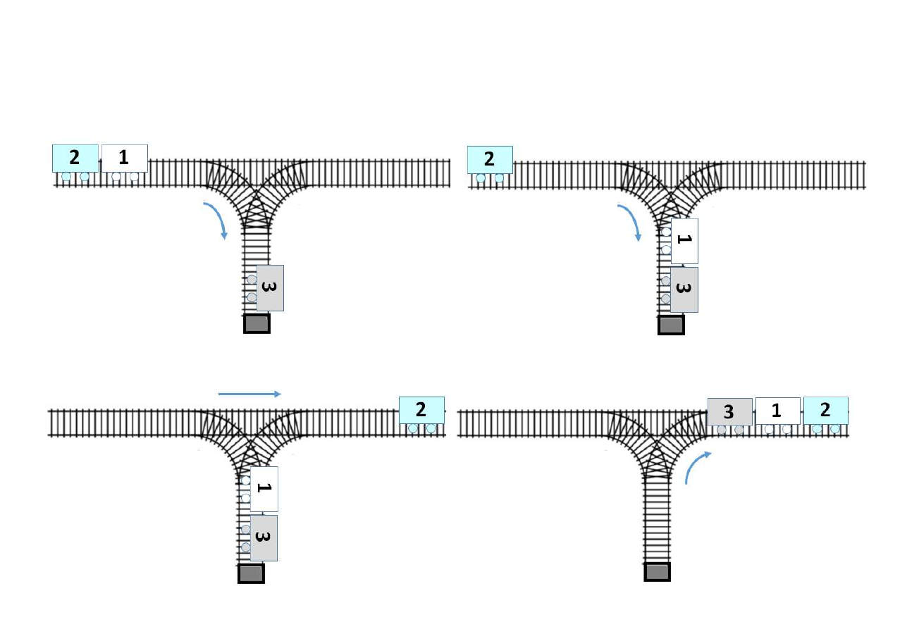
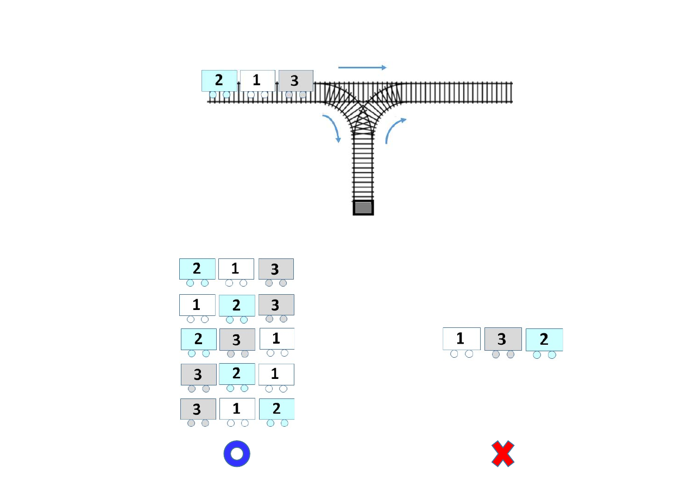
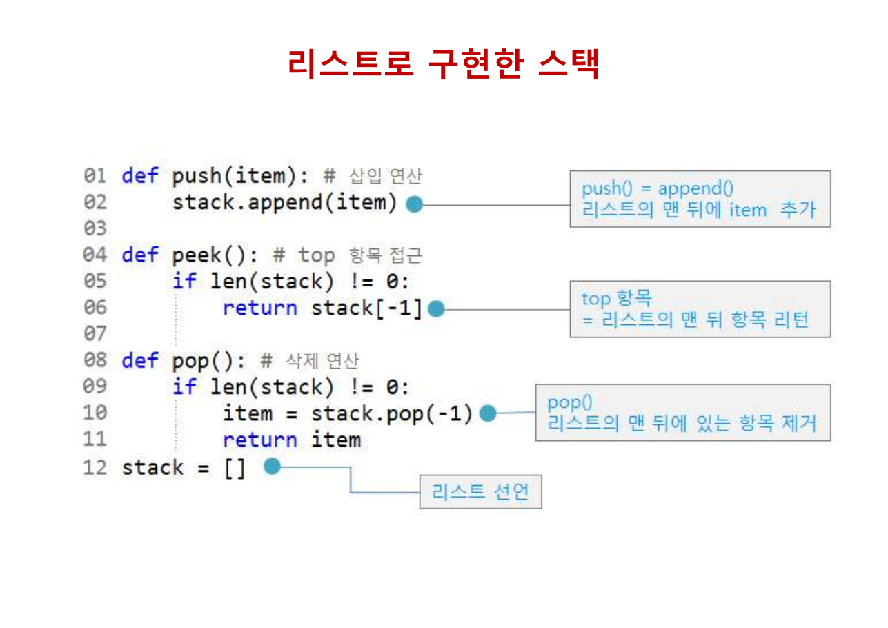
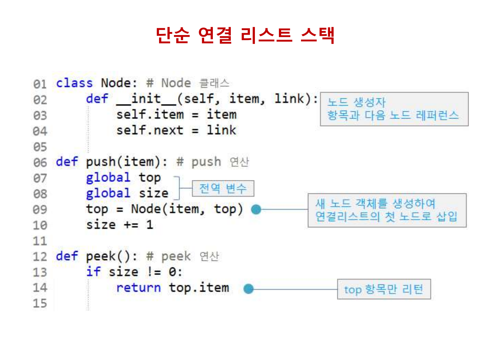
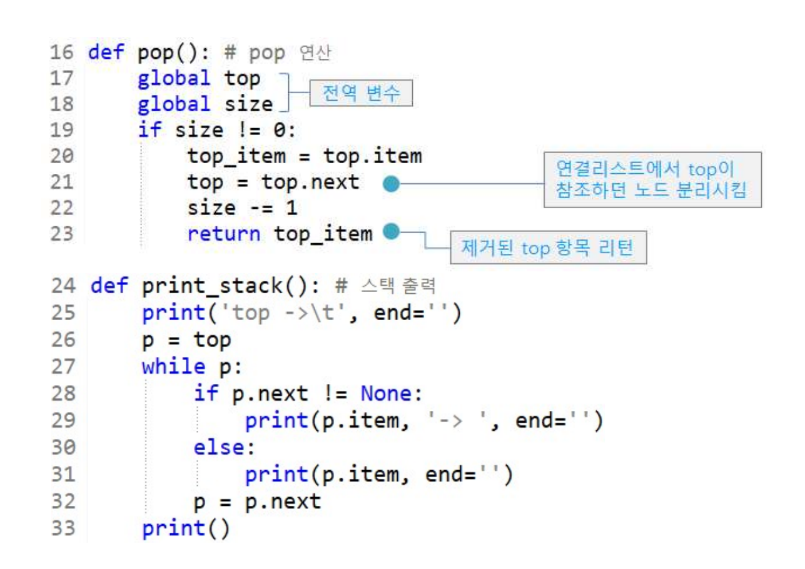
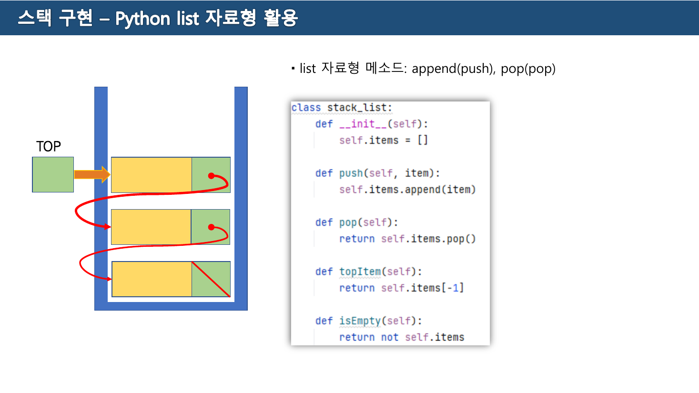
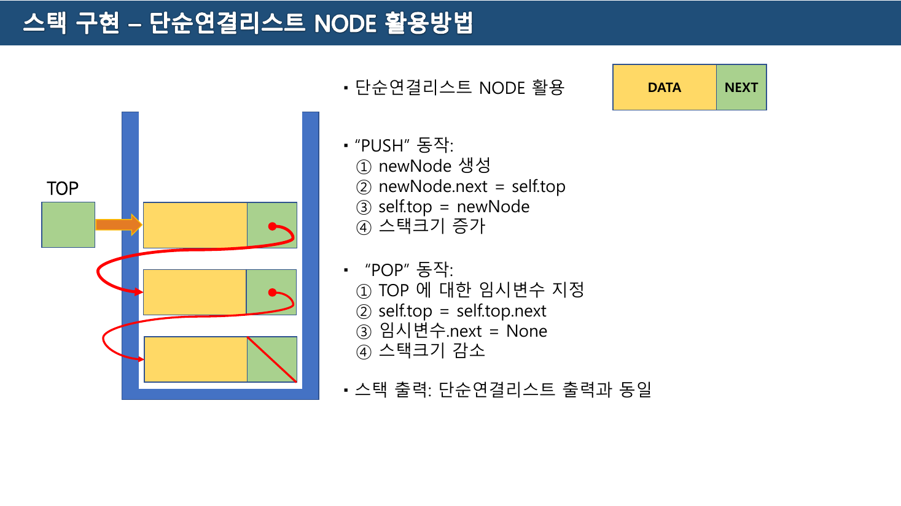
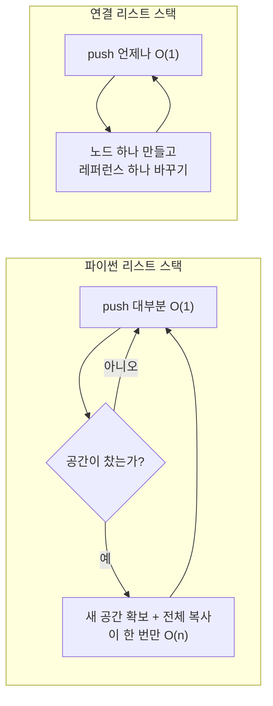
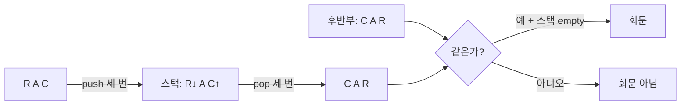

> [!abstract] 정의보다 그림이 먼저 온다
> 교재 Part 3의 3쪽은 스택을 다섯 줄로 정의한다. 그런데 4·5·6쪽 — **세 쪽 연속으로 텍스트가 0자**다. 그 세 쪽에는 정의도 코드도 없고, **철도 측선(側線) 그림**만 있다. 본선을 달리던 차량 세 대를 옆 선로에 넣었다 뺐다 하면서 순서를 바꾸는 그림이다.
>
> 그리고 6쪽이 던지는 것은 문제다. 차량 세 대의 출력 순서 여섯 가지 중 **다섯 개에는 ○, 하나에는 빨간 ✗**가 붙어 있다. 왜 하나만 안 되는가 — 이 질문이 스택의 정의보다 스택을 잘 설명한다. 스택은 자료를 담는 그릇이 아니라 **가능한 순서의 집합을 제한하는 장치**이기 때문이다.
>
> 이 정리는 6쪽의 ✗에서 출발한다.

---

## 1. 6쪽의 ✗ — 왜 하나만 안 되는가



4·5쪽은 같은 배치에서 두 가지 다른 조작을 보여준다. 본선 위에 차량이 순서대로 놓여 있고, 가운데 아래로 **막다른 측선**이 하나 나 있다. 차량은 측선에 넣을 수 있고, 넣은 차량은 **가장 나중에 넣은 것부터** 꺼낼 수밖에 없다. 막다른 길이니까.



6쪽 위쪽 그림의 차량은 왼쪽부터 `2 · 1 · 3` 이고 오른쪽으로 진행한다. 즉 분기점을 **먼저 통과하는 것은 3**, 그다음 1, 마지막이 2다. 입력 순서는 **3 → 1 → 2** 다.

아래에 여섯 줄이 있고, 다섯 줄에는 파란 ○, `1 3 2` 한 줄에만 빨간 ✗가 붙었다. 각 줄은 조작이 끝난 뒤 오른쪽 본선에 늘어선 모습이므로, **오른쪽 끝이 가장 먼저 나온 차량**이다. 뒤집어 읽으면 출력 순서가 된다.

| 6쪽 표기 | 실제 출력 순서 | 판정 | 조작 |
| --- | --- | --- | --- |
| `2 1 3` | 3 → 1 → 2 | ○ | 넣고 바로 빼기를 세 번 |
| `1 2 3` | 3 → 2 → 1 | ○ | 3만 통과, 1·2를 쌓았다 빼기 |
| `2 3 1` | 1 → 3 → 2 | ○ | 3 넣기, 1 넣고 빼기, 3 빼기, 2 |
| `3 2 1` | 1 → 2 → 3 | ○ | 3 넣기, 1 넣고 빼기, 2 통과, 3 빼기 |
| `3 1 2` | 2 → 1 → 3 | ○ | 셋 다 넣었다가 역순으로 빼기 |
| `1 3 2` | **2 → 3 → 1** | **✗** | — |

마지막 줄이 왜 불가능한지는 손으로 따라가면 곧 막힌다. **2가 가장 먼저 나오려면** 3과 1이 이미 측선에 들어가 있어야 한다. 그런데 측선에서는 나중에 넣은 1이 3보다 먼저 나온다. 그러니 2 다음은 반드시 1이어야 하고, 3은 절대 그 사이에 낄 수 없다.

세 개의 입력에 대해 순서를 바꾸는 방법은 원래 $3! = 6$ 가지인데, 측선 하나로 만들 수 있는 것은 다섯 가지다. 아래에서 직접 조작해 볼 수 있다.

```html preview
<div id="sd-root">
  <style>
    #sd-root{font-family:system-ui,-apple-system,"Segoe UI",sans-serif;color:var(--foreground);background:var(--card);
      border:1px solid var(--border);border-radius:10px;padding:16px}
    #sd-root h4{margin:0 0 4px;font-size:14px}
    #sd-root .sub{font-size:12px;opacity:.7;margin-bottom:12px}
    #sd-root .bar{display:flex;gap:8px;flex-wrap:wrap;align-items:center;margin-bottom:12px}
    #sd-root button{font:inherit;font-size:12.5px;padding:7px 13px;border-radius:7px;cursor:pointer;
      border:1px solid var(--border);background:transparent;color:var(--foreground)}
    #sd-root button:disabled{opacity:.35;cursor:default}
    #sd-root svg{width:100%;height:auto;display:block}
    #sd-root table{width:100%;border-collapse:collapse;font-size:12.5px;margin-top:13px}
    #sd-root th,#sd-root td{border:1px solid var(--border);padding:5px 8px;text-align:center}
    #sd-root td.hit{border-color:var(--chart-1);color:var(--chart-1);font-weight:600}
    #sd-root td.no{color:var(--chart-3)}
    #sd-root .say{font-size:12.5px;margin-top:10px;line-height:1.6;min-height:2.6em}
  </style>
  <h4>측선 하나로 만들 수 있는 순서 — 원본 6쪽</h4>
  <div class="sub">차량은 <b>3 → 1 → 2</b> 순으로 분기점에 도착한다. 통과시키거나(pop 없이 지나감) 측선에 넣었다 뺄 수 있다.</div>
  <div class="bar">
    <button id="sd-push">↓ 측선에 넣기 (push)</button>
    <button id="sd-pop">↑ 측선에서 빼기 (pop)</button>
    <button id="sd-reset">처음으로</button>
  </div>
  <svg id="sd-svg" viewBox="0 0 700 200" role="img" aria-label="철도 측선 시뮬레이터"></svg>
  <div class="say" id="sd-say"></div>
  <table>
    <thead><tr><th>원본 6쪽 표기</th><th>출력 순서</th><th>판정</th></tr></thead>
    <tbody id="sd-tbl"></tbody>
  </table>
</div>
<script>
(function(){
  var IN=[3,1,2];
  var ROWS=[
    {disp:"2 1 3", out:[3,1,2], ok:true},
    {disp:"1 2 3", out:[3,2,1], ok:true},
    {disp:"2 3 1", out:[1,3,2], ok:true},
    {disp:"3 2 1", out:[1,2,3], ok:true},
    {disp:"3 1 2", out:[2,1,3], ok:true},
    {disp:"1 3 2", out:[2,3,1], ok:false}
  ];
  var i=0, st=[], out=[];
  var bp=document.getElementById("sd-push"), bo=document.getElementById("sd-pop");
  bp.onclick=function(){ if(i<IN.length){ st.push(IN[i++]); render(); } };
  bo.onclick=function(){ if(st.length){ out.push(st.pop()); render(); } };
  document.getElementById("sd-reset").onclick=function(){ i=0; st=[]; out=[]; render(); };
  function render(){
    bp.disabled = i>=IN.length;
    bo.disabled = st.length===0;
    var S="";
    // 본선
    S+='<line x1="10" y1="60" x2="690" y2="60" stroke="var(--border)" stroke-width="2"/>';
    S+='<line x1="350" y1="60" x2="350" y2="185" stroke="var(--border)" stroke-width="2"/>';
    S+='<rect x="336" y="180" width="28" height="10" fill="var(--border)"/>';
    S+='<text x="14" y="30" font-size="11.5" fill="var(--chart-2)">도착 대기</text>';
    S+='<text x="560" y="30" font-size="11.5" fill="var(--chart-2)">빠져나간 순서 →</text>';
    S+='<text x="366" y="176" font-size="11.5" fill="var(--chart-2)">측선 (막다른 길)</text>';
    // 대기 중
    for(var k=i;k<IN.length;k++){
      var x=20+(k-i)*54;
      S+='<rect x="'+x+'" y="42" width="46" height="34" rx="5" fill="none" stroke="var(--chart-2)"/>';
      S+='<text x="'+(x+23)+'" y="64" text-anchor="middle" font-size="14" fill="var(--chart-2)">'+IN[k]+'</text>';
    }
    // 측선
    st.forEach(function(v,k){
      var y=170-(k+1)*40;
      S+='<rect x="327" y="'+y+'" width="46" height="34" rx="5" fill="none" stroke="var(--chart-1)" stroke-width="1.8"/>';
      S+='<text x="350" y="'+(y+22)+'" text-anchor="middle" font-size="14" fill="var(--chart-1)">'+v+'</text>';
    });
    if(st.length){ S+='<text x="386" y="'+(170-st.length*40+22)+'" font-size="11.5" fill="var(--chart-1)">← 여기만 열려 있다</text>'; }
    // 출력
    out.forEach(function(v,k){
      var x=460+k*54;
      S+='<rect x="'+x+'" y="42" width="46" height="34" rx="5" fill="none" stroke="var(--foreground)"/>';
      S+='<text x="'+(x+23)+'" y="64" text-anchor="middle" font-size="14" fill="var(--foreground)">'+v+'</text>';
      S+='<text x="'+(x+23)+'" y="92" text-anchor="middle" font-size="10" fill="var(--border)">'+(k+1)+'번째</text>';
    });
    document.getElementById("sd-svg").innerHTML=S;

    var tb=document.getElementById("sd-tbl"); tb.innerHTML="";
    ROWS.forEach(function(r){
      var match = out.length>0 && r.out.slice(0,out.length).join()===out.join();
      var tr=document.createElement("tr");
      tr.innerHTML="<td"+(match?" class='hit'":"")+">"+r.disp+"</td>"+
                   "<td"+(match?" class='hit'":"")+">"+r.out.join(" → ")+"</td>"+
                   "<td class='"+(r.ok?"":"no")+"'>"+(r.ok?"○ 가능":"✗ 불가능")+"</td>";
      tb.appendChild(tr);
    });

    var say;
    if(out.length===0){ say="아직 아무것도 빠져나가지 않았다. 넣기/빼기를 눌러 순서를 만들어 보자."; }
    else if(out.length<3){
      var live=ROWS.filter(function(r){ return r.out.slice(0,out.length).join()===out.join(); });
      say="지금까지 <b>"+out.join(" → ")+"</b>. 아직 가능한 최종 순서는 <b>"+live.length+"가지</b>다.";
      if(out[0]===2){ say+=' <span style="color:var(--chart-3)">2가 먼저 나왔다 — 3과 1이 측선에 쌓여 있으므로 다음은 반드시 1이다. 2 → 3 → 1 은 이미 불가능해졌다.</span>'; }
    } else {
      var r=ROWS.filter(function(x){ return x.out.join()===out.join(); })[0];
      say="완성: <b>"+out.join(" → ")+"</b> — 원본 6쪽 표기로는 <b>"+(r?r.disp:"?")+"</b>. 어떻게 조작해도 <b>2 → 3 → 1</b> 만은 만들 수 없다.";
    }
    document.getElementById("sd-say").innerHTML=say;
  }
  render();
})();
</script>
```

그러고 나서 3쪽의 정의를 읽으면 다르게 읽힌다.

> \- 한 쪽 끝에서만 item(항목)을 삭제하거나 새로운 item을 삽입하는 자료구조
> \- 새 item을 저장하는 연산: **push** / Top item을 삭제하는 연산: **pop**
> \- **후입 선출**(Last-In First-Out, LIFO)

"한 쪽 끝에서만"이 측선의 막다른 벽이고, LIFO가 6쪽의 ✗다.

5주차(스택) 실습 자료 2쪽은 같은 것을 다른 이름으로 부른다.

> LIFO (Last In First Out) 또는 **FILO (First In Last Out)**
> 데이터 출입 통로가 하나인 구조
> "TOP" : 데이터 최상위 데이터 위치를 의미함.

두 약자는 같은 말이다 — 마지막에 들어온 것이 먼저 나온다는 것과 처음 들어온 것이 마지막에 나온다는 것.

---

## 2. 두 가지 구현, 하나의 약속

교재는 스택을 두 번 만든다. 8쪽은 파이썬 리스트로, 12쪽은 단순 연결 리스트로.

### 파이썬 리스트로 (원본 8~11쪽)

8쪽 [그림 3-3]은 인덱스 `0 1 2 3` 위에 항목을 올리고 `top` 을 오른쪽 끝에 표시한다. 리스트의 **뒤쪽**이 top이다.



```python
def push(item):            # 삽입 연산
    stack.append(item)     # push() = append() — 리스트의 맨 뒤에 item 추가

def peek():                # top 항목 접근
    if len(stack) != 0:
        return stack[-1]   # top 항목 = 리스트의 맨 뒤 항목 리턴

def pop():                 # 삭제 연산
    if len(stack) != 0:
        item = stack.pop(-1)   # 리스트의 맨 뒤에 있는 항목 제거
        return item

stack = []                 # 리스트 선언
```

클래스가 아니라 **전역 리스트 하나와 함수 셋**이다. `stack = []` 선언이 함수 정의보다 **뒤에** 있는 것도 눈에 띈다 — 파이썬에서는 함수 몸통이 호출 시점에 이름을 찾으므로 문제가 없지만, 읽는 순서로는 낯설다.

10쪽의 사용 코드와 11쪽의 출력은 이렇다.

```python
push('apple'); push('orange'); push('cherry')
print('사과, 오렌지, 체리 push 후:\t', end=''); print(stack, '\t<- top')
print('top 항목: ', end=''); print(peek())
push('pear')
print('배 push 후:\t\t', end=''); print(stack, '\t<- top')
pop(); push('grape')
print('pop(), 포도 push 후:\t', end=''); print(stack, '\t<- top')
```

```text
사과, 오렌지, 체리 push 후:  ['apple', 'orange', 'cherry']   <- top
top 항목: cherry
배 push 후:                 ['apple', 'orange', 'cherry', 'pear']   <- top
pop(), 포도 push 후:        ['apple', 'orange', 'cherry', 'grape']   <- top
```

`pear` 를 넣었다 뺀 자리에 `grape` 가 들어갔다. 리스트의 **왼쪽 세 항목은 한 번도 건드려지지 않았다** — top에서만 일이 벌어진다는 것이 눈으로 보인다.

### 단순 연결 리스트로 (원본 12~15쪽)



```python
class Node:                        # Node 클래스
    def __init__(self, item, link):
        self.item = item
        self.next = link

def push(item):                    # push 연산
    global top
    global size                    # 전역 변수
    top = Node(item, top)          # 새 노드를 연결리스트의 첫 노드로 삽입
    size += 1

def peek():                        # peek 연산
    if size != 0:
        return top.item            # top 항목만 리턴
```

`top = Node(item, top)` 한 줄이 전부다. [02장 `SList.insert_front`](./02.%20%EB%A6%AC%EC%8A%A4%ED%8A%B8%20%E2%80%94%20%EB%81%9D%EC%9D%84%20%EC%96%B4%EB%96%BB%EA%B2%8C%20%ED%91%9C%EC%8B%9C%ED%95%A0%20%EA%B2%83%EC%9D%B8%EA%B0%80.md)와 완전히 같은 코드이며, 이름만 `head` 에서 `top` 으로 바뀌었다. **스택은 단순 연결 리스트에서 맨 앞 삽입·맨 앞 삭제만 남긴 것**이다.



```python
def pop():                         # pop 연산
    global top
    global size
    if size != 0:
        top_item = top.item
        top = top.next             # 연결리스트에서 top이 참조하던 노드 분리시킴
        size -= 1
        return top_item            # 제거된 top 항목 리턴

def print_stack():                 # 스택 출력
    print('top ->\t', end='')
    p = top
    while p:
        if p.next != None:
            print(p.item, '-> ', end='')
        else:
            print(p.item, end='')
        p = p.next
    print()
```

15쪽 출력은 10쪽과 같은 조작을 한 결과인데, **방향이 반대로 찍힌다.**

```text
사과, 오렌지, 체리 push 후:  top ->  cherry -> orange -> apple
top 항목: cherry
배 push 후:                 top ->  pear -> cherry -> orange -> apple
pop(), 포도 push 후:        top ->  grape -> cherry -> orange -> apple
```

| | 리스트 구현(11쪽) | 연결 리스트 구현(15쪽) |
| --- | --- | --- |
| top의 위치 | 출력의 **오른쪽 끝** | 출력의 **왼쪽 끝** |
| push가 손대는 곳 | 리스트의 뒤 | 연결의 앞 |
| 같은 조작의 결과 | `[apple, orange, cherry, grape]` | `grape -> cherry -> orange -> apple` |

**두 출력은 서로의 역순이다.** 자료구조로서는 완전히 같고, 내부 배치와 출력 관습만 다르다. 실제로 push/pop만 통해 접근하는 한 바깥에서는 구별할 방법이 없다 — 그것이 추상 자료형이라는 말의 뜻이다.

> [!caution] 원본 코드의 빈틈 — underflow가 조용히 지나간다
> 네 구현 모두 `if len(stack) != 0:` 또는 `if size != 0:` 로 감싸 놓고 **`else` 를 두지 않았다.** 빈 스택에서 `pop()` 을 부르면 예외가 아니라 **`None` 이 반환된다.**
>
> [02장의 `SList`](./02.%20%EB%A6%AC%EC%8A%A4%ED%8A%B8%20%E2%80%94%20%EB%81%9D%EC%9D%84%20%EC%96%B4%EB%96%BB%EA%B2%8C%20%ED%91%9C%EC%8B%9C%ED%95%A0%20%EA%B2%83%EC%9D%B8%EA%B0%80.md)가 같은 상황에서 `raise EmptyError('Underflow')` 를 던졌던 것과 대비된다. 같은 교재의 Part 2와 Part 3이 다른 방침을 쓴 셈이다. `None` 반환은 호출한 쪽에서 "빈 스택이었다"와 "항목이 정말 `None` 이었다"를 구별할 수 없게 만든다.
>
> [중간고사 예상문제 14번](#7-예상문제로-되짚기)이 묻는 **스택 오버플로**의 짝인 **언더플로**가 바로 여기다.

### 실습 자료의 세 번째 구현

5주차(스택) 자료는 같은 것을 한 번 더, 이번에는 **클래스로** 만든다.



```python
class stack_list:
    def __init__(self):
        self.items = []

    def push(self, item):
        self.items.append(item)

    def pop(self):
        return self.items.pop()

    def topItem(self):
        return self.items[-1]

    def isEmpty(self):
        return not self.items
```

교재의 전역 변수 방식과 달리 **스택을 여러 개 만들 수 있다.** [05장의 표기법 변환](./05.%20%ED%91%9C%EA%B8%B0%EB%B2%95%20%EB%B3%80%ED%99%98%20%E2%80%94%20%EA%B4%84%ED%98%B8%EB%A5%BC%20%EC%97%86%EC%95%A0%EB%8A%94%20%EB%91%90%20%EA%B0%80%EC%A7%80%20%EA%B8%B8.md)에서 연산자 스택과 데이터 저장소를 동시에 굴려야 하므로, 실제로는 이 형태가 필요하다.

같은 자료 4쪽은 노드 방식의 push/pop을 네 단계로 쪼개 적는다.



```text
"PUSH" 동작:                    "POP" 동작:
 ① newNode 생성                  ① TOP 에 대한 임시변수 지정
 ② newNode.next = self.top       ② self.top = self.top.next
 ③ self.top = newNode            ③ 임시변수.next = None
 ④ 스택크기 증가                  ④ 스택크기 감소
```

POP의 ③번 `임시변수.next = None` 은 교재 코드에 없는 줄이다. 떼어낸 노드가 아직 스택의 나머지를 가리키고 있으면 [03장 Q3](./03.%20%EC%A7%81%EC%A0%91%20%EC%A7%9C%20%EB%B3%B4%EB%A9%B4%20%EB%8B%AC%EB%9D%BC%EC%A7%80%EB%8A%94%20%EA%B2%83%20%E2%80%94%20%EA%B5%90%EC%88%98%EA%B0%80%20%EB%82%A8%EA%B8%B4%20%EB%8B%A4%EC%84%AF%20%EA%B0%9C%EC%9D%98%20Q.md)에서 본 참조가 남는다. 끊어 주면 그 노드만 정확히 회수된다.

---

## 3. 수행 시간 — 리스트 쪽에 각주가 붙는다

16쪽은 두 구현의 비용을 나란히 적는다.

> \- 파이썬의 리스트로 구현한 스택의 push와 pop 연산: 각각 **O(1)** 시간
> 파이썬의 리스트는 크기가 동적으로 확대/축소되며, **크기 조절은 스택(리스트)의 모든 항목을 새 리스트로 복사해야 하기 때문에 O(n) 시간** 소요
>
> \- 단순 연결 리스트 스택의 push와 pop 연산: 각각 **O(1)** 시간
> 연결 리스트의 맨 앞 부분에서 노드를 삽입하거나 삭제하기 때문

같은 O(1)인데 첫 항목에만 단서가 붙는다. 파이썬 리스트는 내부적으로 연속된 공간을 쓰므로, 그 공간이 다 차면 더 큰 공간을 잡아 전부 옮겨야 한다. 그 순간의 push는 O(n)이다.



대신 연결 리스트 쪽은 항목마다 노드 객체와 레퍼런스를 하나씩 더 쓴다. [02장 5쪽](./02.%20%EB%A6%AC%EC%8A%A4%ED%8A%B8%20%E2%80%94%20%EB%81%9D%EC%9D%84%20%EC%96%B4%EB%96%BB%EA%B2%8C%20%ED%91%9C%EC%8B%9C%ED%95%A0%20%EA%B2%83%EC%9D%B8%EA%B0%80.md)가 말한 "배열은 빈 공간을 가지나 연결 리스트는 빈 공간이 없음"의 뒷면이다.

---

## 4. 괄호 짝 맞추기 — 제약을 답으로 쓰기

17쪽부터 응용이 시작된다. 18쪽의 핵심 아이디어는 두 줄이다.

> **[핵심 아이디어] 왼쪽 괄호는 스택에 push, 오른쪽 괄호를 읽으면 pop 수행**
>
> \- pop된 왼쪽 괄호와 바로 읽었던 오른쪽 괄호가 다른 종류이면 에러 처리, 같은 종류이면 다음 괄호를 읽음
> \- 모든 괄호를 읽은 뒤 에러가 없고 스택이 empty이면, 정상
> \- 모든 괄호를 처리한 후, **스택이 empty가 아니면** 짝이 맞지 않는 괄호가 스택에 남은 것이므로 에러 처리

여기서 판정 조건이 **셋**이라는 점이 중요하다. 흔한 실수는 마지막 조건을 빠뜨리는 것이다.

| 상황 | 어디서 걸리는가 |
| --- | --- |
| `{ ( ] }` — 종류가 안 맞음 | pop한 것과 비교하는 순간 |
| `{ ( ) ) }` — 여는 것보다 닫는 것이 많음 | pop하려는데 스택이 비어 있음 |
| `{ ( ) {` — 닫는 것이 모자람 | **끝까지 읽고 나서** 스택이 비지 않음 |

![괄호 짝 맞추기 [예제 1] — 여덟 단계가 전부 짝을 이룬다 (원본 19쪽)](../assets/ch04-p19-괄호-예제1.png)

19쪽 [예제 1]의 입력은 `{ ( ) { ( ) } }` 여덟 글자다. 그림은 여덟 단계를 왼쪽에서 오른쪽으로 늘어놓고, ③⑥⑦⑧에서 `( ↔ )`, `{ ↔ }` 로 짝이 맞는 것을 보인다. 마지막에 스택이 비었으므로 **정상**이다.

20쪽 [예제 2]는 실패 사례다. 입력이 `{ ( ) { ( ) ) }` 로, 여섯 번째까지는 [예제 1]과 같지만 일곱 번째가 `)` 다.

```text
입력:      {      (      )      {      (      )      )      }
연산:  push({) push(() pop()  push({) push(() pop()  pop()  pop()
                        ↑ ( )  짝                     ↑ pop하면 '{'
                                                        읽은 것은 ')'  → 에러
```

일곱 번째에서 스택 top은 `{` 인데 읽은 것은 `)` 다. **종류가 다르므로** 여기서 거짓을 반환하고 끝낸다.

6주차(스택응용문제) 4쪽은 같은 알고리즘을 실습 과제로 다시 낸다. 표현이 조금 더 실행 코드에 가깝다.

> 왼쪽 괄호( `{` or `(` )는 스택에 PUSH, 오른쪽 괄호 ( `}` or `)` ) 일 경우 스택에 있는 괄호 기호 하나 POP
> POP 된 괄호와 오른쪽 괄호가 다를 경우 **False**, 같으면 다음 괄호 읽음
> 모든 입력된 괄호를 검사한 후 오류가 없고, 스택이 Empty 이면 **True**
> 모든 입력된 괄호를 검사한 후 스택이 empty 가 아니면 **False**

이 문제에서 스택이 필요한 이유는 명확하다. `{ ( ) }` 에서 `)` 를 만났을 때 **짝을 이룰 후보가 여럿**이고, 그중 골라야 하는 것은 **가장 최근에 열린 것**이다. 6쪽의 ✗가 말한 그 성질 — 가장 나중에 넣은 것이 먼저 나온다 — 이 여기서 답이 된다.

---

## 5. 회문 검사 — 반을 접어 맞추기

21쪽의 정의와 아이디어.

> 회문(Palindrome): 앞으로부터 읽으나 뒤로부터 읽으나 동일한 스트링
>
> **[핵심 아이디어] 전반부의 문자들을 스택에 push한 후, 후반부의 각 문자를 차례로 pop한 문자와 비교**
>
> \- 입력의 앞부분 1/2을 읽어 스택에 push한 후, 문자열의 길이가 짝수이면 뒷부분의 문자 1개를 읽어서 pop한 문자와 비교하는 과정 반복
> \- 마지막 비교까지 두 문자가 동일하고 스택이 empty이면, 입력은 회문

22쪽이 짝수 길이 예제(`ABSSBA`), 23쪽이 홀수 길이 예제다. 22쪽 위에 홀수 처리 규칙이 한 줄 붙어 있다.

> 입력의 길이가 홀수인 경우 **중간 문자는 읽고 버린다.**

![회문 검사 [예제 2] — RACECAR, 가운데 E는 버린다 (원본 23쪽)](../assets/ch04-p23-회문-RACECAR.png)

23쪽의 입력은 `RACECAR` 7글자다.

| 단계 | 문자 | 동작 | 스택 (아래→위) |
| --- | --- | --- | --- |
| ① | R | push | R |
| ② | A | push | R A |
| ③ | C | push | R A C |
| ④ | **E** | **읽고 버림** (가운데) | R A C |
| ⑤ | C | pop → `C = C` | R A |
| ⑥ | A | pop → `A = A` | R |
| ⑦ | R | pop → `R = R` | (비었음) |

그림에서 ④의 `E` 만 위쪽으로 튕겨 나가는 화살표가 그려져 있다. 마지막에 스택이 비고 비교가 전부 성공했으므로 **회문**이다.

여기서 스택이 하는 일은 **문자열을 뒤집는 것**이다. push한 순서와 pop되는 순서가 반대이므로, 전반부를 넣고 빼면 전반부의 역순이 나온다. 회문의 정의가 "역순과 같다"이니 정확히 필요한 도구다.



24쪽은 나머지 응용을 나열하고 다음 절로 넘긴다.

> 후위 표기(Postfix Notation) 수식 계산하기 · 중위 표기(Infix Notation) 수식의 후위 표기법 변환 · 미로 찾기 · **트리의 순회(Part 4)** · **그래프의 DFS(Part 8)** · 프로그래밍에서 매우 중요한 **함수/메소드 호출 및 순환 호출**

앞의 둘은 [05장](./05.%20%ED%91%9C%EA%B8%B0%EB%B2%95%20%EB%B3%80%ED%99%98%20%E2%80%94%20%EA%B4%84%ED%98%B8%EB%A5%BC%20%EC%97%86%EC%95%A0%EB%8A%94%20%EB%91%90%20%EA%B0%80%EC%A7%80%20%EA%B8%B8.md)에서, 트리 순회는 [07장](./07.%20%ED%8A%B8%EB%A6%AC%20%E2%80%94%20%EC%9E%90%EC%8B%9D%EC%9D%B4%20%EB%91%98%EC%9D%84%20%EB%84%98%EC%9C%BC%EB%A9%B4%20%EA%B0%90%EB%8B%B9%EC%9D%B4%20%EC%95%88%20%EB%90%9C%EB%8B%A4.md)에서 다시 만난다.

마지막 항목이 특히 중요하다. **함수 호출이 스택으로 구현된다**는 것은, 재귀 함수를 쓸 때마다 우리가 스택을 쓰고 있다는 뜻이다. [03장 2절](./03.%20%EC%A7%81%EC%A0%91%20%EC%A7%9C%20%EB%B3%B4%EB%A9%B4%20%EB%8B%AC%EB%9D%BC%EC%A7%80%EB%8A%94%20%EA%B2%83%20%E2%80%94%20%EA%B5%90%EC%88%98%EA%B0%80%20%EB%82%A8%EA%B8%B4%20%EB%8B%A4%EC%84%AF%20%EA%B0%9C%EC%9D%98%20Q.md)의 무한 재귀가 `RecursionError` 로 끝나는 이유도 이 스택이 넘치기 때문이다.

---

## 6. 5주차 실습 과제 — 웹 브라우저 뒤로 가기

5주차(스택) 자료 2쪽은 스택의 예로 **"웹 브라우저 뒤로 가기"** 와 **"생산성 도구의 Undo (Ctrl+z)"** 를 든다. 그리고 6쪽에서 그것을 그대로 만들게 한다.

> 1) 웹 주소를 저장할 수 있는 변수를 만들고, 5개 웹 주소를 스택 구조에 push 하세요.
> 2) 키보드 이벤트를 활용하여 왼쪽 화살표 방향키 (←)를 입력하면 해당 웹 주소를 출력하고, 스택에서 제거하세요.
>
> hint) `import keyboard` / `import time` — 키보드 입력 대기를 위해 무한반복이 필수이며, 무한 반복시 키보드 값이 계속 입력되므로 `time.sleep` 을 줘야 함.

`keyboard` 는 표준 라이브러리가 아니므로 별도 설치가 필요하다 — [01장 4절](./01.%20%EA%B0%9C%EB%B0%9C%20%ED%99%98%EA%B2%BD%20%E2%80%94%20%EC%96%B4%EB%8A%90%20python.exe%EA%B0%80%20%EC%8B%A4%ED%96%89%EB%90%98%EB%8A%94%EA%B0%80.md)가 말한 "Anaconda 기본 채널에 패키지가 존재하지 않는 경우"의 실제 사례다.

이 과제가 스택인 이유도 6쪽의 ✗와 같다. 방문 기록에서 "뒤로"가 데려가는 곳은 **가장 최근에 떠난 페이지**이지 처음 방문한 페이지가 아니다. 순서를 고를 수 없다는 것이 여기서는 제약이 아니라 **정확히 원하는 동작**이다.

---

## 7. 예상문제로 되짚기

중간고사 예상문제 11~16번이 이 장 범위다.

| 문항 | 답과 근거 |
| --- | --- |
| 11. 스택 설명 중 옳지 않은 것 | **② 선입 선출 자료구조이다** — 3쪽은 후입 선출(LIFO). 선입 선출은 큐다([06장](./06.%20%ED%81%90%EC%99%80%20%EB%8D%B0%ED%81%AC%20%E2%80%94%20%EA%B5%90%EC%9E%AC%EA%B0%80%20%EA%B3%B5%EC%A7%9C%EB%9D%BC%20%ED%95%9C%20%EC%9E%90%EB%A6%AC%EB%A5%BC%20%EC%8B%A4%EC%8A%B5%EC%9D%80%20%EB%AC%B8%EC%A0%9C%EC%A0%90%EC%9D%B4%EB%9D%BC%20%EB%B6%80%EB%A5%B8%EB%8B%A4.md)) |
| 12. 스택의 항목은 어떤 순서로 저장되어 있는가 | **④ 스택에 push된 시각 순서** — 크기와는 무관하다. 11쪽 출력 `['apple','orange','cherry','grape']` 가 그대로 push 순서다 |
| 13. 배열로 구현할 경우 | **① 배열의 크기가 정해져 있으므로 push할 수 없는 경우도 발생한다** — 16쪽이 말한 "크기 조절"이 불가능한 정적 배열의 경우. ③④는 스택이 허용하지 않는 중간 접근을 전제한다 |
| 14. 스택 오버플로 | **③ 배열 자료형으로 구현했을 때 push를 실패한 경우** — ①은 반대다. 연결 리스트는 메모리가 있는 한 계속 늘어난다 |
| 15. 스택의 응용과 가장 거리가 먼 것 | **③ 이벤트 구동 시뮬레이션** — 39쪽에서 **큐**의 응용으로 나온다. 나머지 셋(괄호·회문·미로찾기)은 17·24쪽 목록 그대로 |
| 16. 부 프로그램 복귀 주소 저장 | **③ 스택** — 24쪽의 "함수/메소드 호출 및 순환 호출도 스택 자료구조를 바탕으로 구현" |

15번은 특히 헷갈리기 쉽다. 24쪽 스택 응용 목록과 39쪽 큐 응용 목록을 나란히 놓고 외우는 편이 확실하다.

---

## 다른 장과의 연결

- 스택으로 만드는 수식 표기법 변환과 후위 계산 — [05. 표기법 변환](./05.%20%ED%91%9C%EA%B8%B0%EB%B2%95%20%EB%B3%80%ED%99%98%20%E2%80%94%20%EA%B4%84%ED%98%B8%EB%A5%BC%20%EC%97%86%EC%95%A0%EB%8A%94%20%EB%91%90%20%EA%B0%80%EC%A7%80%20%EA%B8%B8.md)
- 반대 규약(선입 선출)을 가진 자료구조 — [06. 큐와 데크](./06.%20%ED%81%90%EC%99%80%20%EB%8D%B0%ED%81%AC%20%E2%80%94%20%EA%B5%90%EC%9E%AC%EA%B0%80%20%EA%B3%B5%EC%A7%9C%EB%9D%BC%20%ED%95%9C%20%EC%9E%90%EB%A6%AC%EB%A5%BC%20%EC%8B%A4%EC%8A%B5%EC%9D%80%20%EB%AC%B8%EC%A0%9C%EC%A0%90%EC%9D%B4%EB%9D%BC%20%EB%B6%80%EB%A5%B8%EB%8B%A4.md)
- push/pop만 남기기 전의 단순 연결 리스트 — [02. 리스트](./02.%20%EB%A6%AC%EC%8A%A4%ED%8A%B8%20%E2%80%94%20%EB%81%9D%EC%9D%84%20%EC%96%B4%EB%96%BB%EA%B2%8C%20%ED%91%9C%EC%8B%9C%ED%95%A0%20%EA%B2%83%EC%9D%B8%EA%B0%80.md) · [03. 직접 짜 보면 달라지는 것](./03.%20%EC%A7%81%EC%A0%91%20%EC%A7%9C%20%EB%B3%B4%EB%A9%B4%20%EB%8B%AC%EB%9D%BC%EC%A7%80%EB%8A%94%20%EA%B2%83%20%E2%80%94%20%EA%B5%90%EC%88%98%EA%B0%80%20%EB%82%A8%EA%B8%B4%20%EB%8B%A4%EC%84%AF%20%EA%B0%9C%EC%9D%98%20Q.md)
- 스택이 다시 등장하는 트리 순회 — [07. 트리](./07.%20%ED%8A%B8%EB%A6%AC%20%E2%80%94%20%EC%9E%90%EC%8B%9D%EC%9D%B4%20%EB%91%98%EC%9D%84%20%EB%84%98%EC%9C%BC%EB%A9%B4%20%EA%B0%90%EB%8B%B9%EC%9D%B4%20%EC%95%88%20%EB%90%9C%EB%8B%A4.md)

---

## 근거 자료

| 원본 | 쪽 | 내용 | 이 문서에서 쓰인 곳 |
| --- | --- | --- | --- |
| 스택과 큐 | 3 | 스택의 정의 · push · pop · LIFO | 1절 |
| 스택과 큐 | **4 · 5 · 6** | 철도 측선 그림과 가능/불가능 순서 (전부 텍스트 0자) | 1절 · 인용 2장 · 인터랙티브 |
| 스택과 큐 | 7 · 8 | [그림 3-2] push/pop · [그림 3-3] 리스트로 구현한 스택 | 2절 |
| 스택과 큐 | **9 · 10 · 11** | `liststack.py` 와 실행 결과 | 2절 · 인용 |
| 스택과 큐 | **12 · 13** | `linkedstack.py` (13쪽 텍스트 0자) | 2절 · 인용 2장 |
| 스택과 큐 | 14 · 15 | 사용 코드와 실행 결과 | 2절 |
| 스택과 큐 | 16 | 두 구현의 수행 시간 | 3절 |
| 스택과 큐 | 17 · 18 | 응용 개요 / 괄호 짝 맞추기 알고리즘 | 4절 |
| 스택과 큐 | **19 · 20** | 괄호 [예제 1]·[예제 2] | 4절 · 인용 |
| 스택과 큐 | 21 · 22 | 회문 검사 아이디어 / 짝수 길이 예제 | 5절 |
| 스택과 큐 | **23** | 회문 [예제 2] `RACECAR` | 5절 · 인용 |
| 스택과 큐 | 24 | 스택의 기타 응용 | 5절 |
| 5주차(스택) | 2 | LIFO/FILO · TOP · 구현 방법 두 가지 | 1절 |
| 5주차(스택) | **4** | 노드 방식 push/pop 4단계 | 2절 · 인용 |
| 5주차(스택) | **5** | `stack_list` 클래스 | 2절 · 인용 |
| 5주차(스택) | 6 | 웹 브라우저 뒤로 가기 과제 | 6절 |
| 6주차(스택응용문제) | 4 | 괄호 짝 맞추기 실습 | 4절 |
| 중간고사 예상문제 | 2~3 | 문항 11~16 | 7절 |

- 텍스트 0자 페이지: 스택과 큐 **4 · 5 · 6 · 13쪽** — 앞의 셋은 이 장의 출발점인 철도 측선 그림이고, 13쪽은 연결 리스트 스택의 `pop`·`print_stack` 코드다
